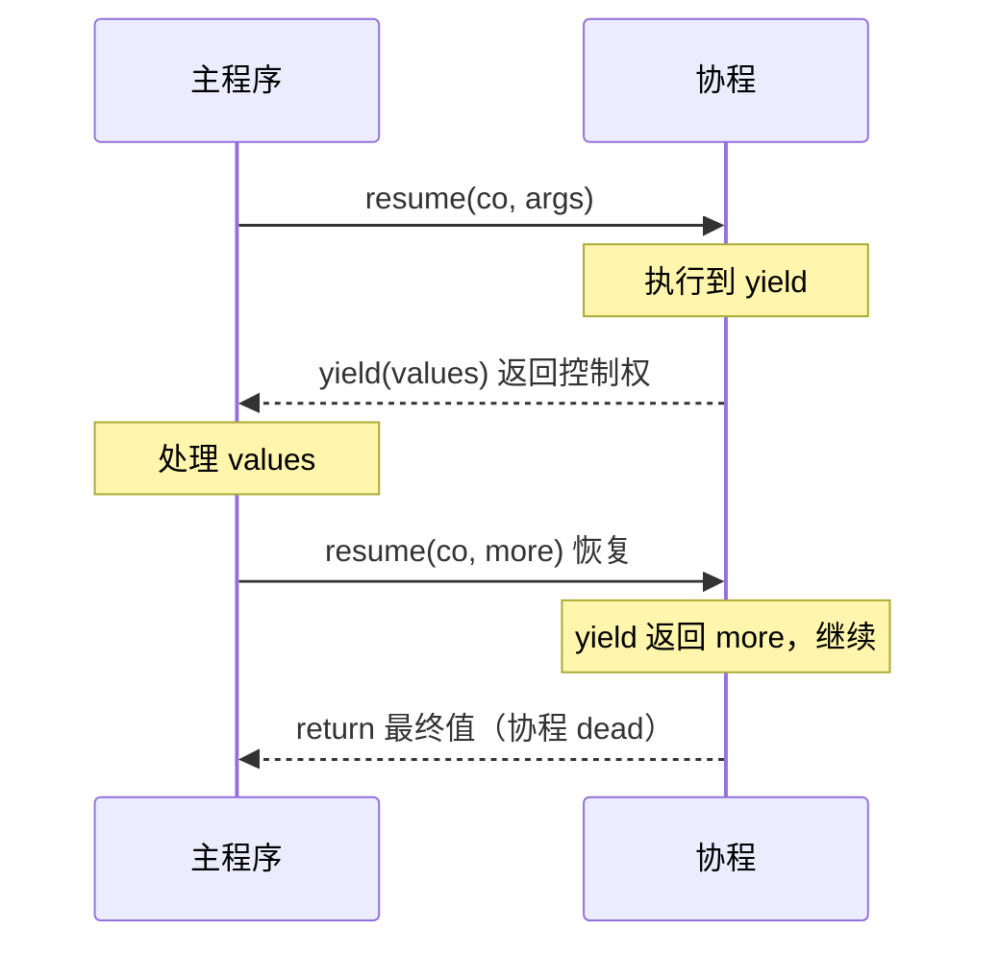

# 精通 Lua 协程 coroutine

> 课程编号：L08
> 路线图来源：Lua 全场景深度课程 — 协程
> 难度：⭐⭐⭐⭐⭐
> 预计阅读时间：60 分钟
> 📅 内容基准：**Lua 5.4.8**（`coroutine.close` 为 5.4）+ **LuaJIT 2.1**

---

## 引言：单线程里的"暂停与继续"

```lua
-- 1) 输出顺序？
local co = coroutine.create(function(a, b)
    print("start", a, b)
    local c = coroutine.yield(a + b)
    print("resume", c)
    return "done"
end)
print(coroutine.resume(co, 1, 2))
print(coroutine.resume(co, 99))
print(coroutine.resume(co))

-- 2) 这是并发吗？
local function gen()
    for i = 1, 3 do coroutine.yield(i) end
end
local co2 = coroutine.wrap(gen)
print(co2(), co2(), co2())
```

答案 ①：
```
start  1  2
true  3            ← 第一次 resume：跑到 yield，返回 yield 的值 3
resume 99          ← 第二次 resume：99 成为 yield 的返回值
true  done         ← 函数 return，resume 返回 true + 返回值
false  cannot resume dead coroutine   ← 第三次：协程已死
```
答案 ②：`1  2  3`——`wrap` 把协程包成一个函数，每次调用产出下一个 yield 值。

协程（coroutine）是 Lua 最强大也最被误解的特性。它**不是线程**——是**单线程内协作式的"可暂停函数"**。理解它是掌握迭代器、生成器、异步 IO（尤其 OpenResty 的非阻塞模型，L18）的关键。

---

## 第一章：协程是什么，不是什么

### 1.1 协作式 vs 抢占式

| 维度 | 操作系统线程 | Lua 协程 |
|---|---|---|
| 调度 | **抢占式**（OS 随时切换） | **协作式**（只在 `yield` 处主动让出） |
| 并行 | 真并行（多核） | **不并行**（同一时刻只有一个在跑） |
| 数据竞争 | 有（需锁） | **无**（不会被打断，天然安全） |
| 切换成本 | 高（内核态） | 极低（用户态，换栈指针） |
| 数量 | 受限（MB 级栈） | 海量（轻量） |

**核心认知**：协程是**单线程**的。它解决的不是"利用多核"，而是"在一个线程里优雅地表达可暂停/恢复的控制流"——生成器、状态机、异步回调的扁平化。

### 1.2 非对称协程

Lua 用**非对称（asymmetric）协程**：有明确的"调用者"和"被调用者"关系。`resume` 进入协程，`yield` 返回到 resume 它的地方。这与"对称协程"（任意协程间直接转移）不同——非对称更简单、更易理解。



---

## 第二章：四个核心 API

```lua
coroutine.create(fn)    -- 创建协程（不运行），返回 thread 对象
coroutine.resume(co, ...) -- 启动/恢复，返回 true/false + yield或return的值
coroutine.yield(...)    -- 暂停，把值交回 resume，并接收下次 resume 的参数
coroutine.status(co)    -- "suspended" / "running" / "normal" / "dead"
coroutine.wrap(fn)      -- 创建并返回一个"调用即 resume"的函数（不返回状态布尔）
coroutine.isyieldable() -- 当前是否可 yield
coroutine.running()     -- 返回当前协程 + 是否主协程
coroutine.close(co)     -- 5.4：关闭一个挂起/死亡的协程，触发其 <close> 变量
```

### 2.1 `create` + `resume` + `yield` 的协作

```lua
local co = coroutine.create(function()
    for i = 1, 3 do
        print("产出", i)
        coroutine.yield(i)       -- 暂停，把 i 交回
    end
    print("结束")
end)

print(coroutine.resume(co))   -- 产出 1 → true 1
print(coroutine.resume(co))   -- 产出 2 → true 2
print(coroutine.resume(co))   -- 产出 3 → true 3
print(coroutine.resume(co))   -- 结束 → true（无 yield 值）
print(coroutine.resume(co))   -- false  cannot resume dead coroutine
```

### 2.2 状态机

```lua
local co = coroutine.create(function() coroutine.yield() end)
print(coroutine.status(co))   -- suspended（刚创建）
coroutine.resume(co)
print(coroutine.status(co))   -- suspended（yield 后）
coroutine.resume(co)
print(coroutine.status(co))   -- dead（结束）
```

四种状态：
- **suspended**：挂起（刚创建或 yield 后），可 resume。
- **running**：正在运行（即当前协程自己）。
- **normal**：活跃但不在运行（它 resume 了别的协程）。
- **dead**：已结束或出错，不可再 resume。

---

## 第三章：双向传值

协程的精妙在于 `resume` 和 `yield` 之间**双向传递数据**：

- `resume(co, a, b)` 的额外参数 → 成为协程函数的**初始参数**（首次）或 **yield 的返回值**（后续）。
- `yield(x, y)` 的参数 → 成为 `resume` 的**返回值**（除了第一个 true）。
- 协程 `return r` → 成为最后一次 `resume` 的返回值。

```lua
local co = coroutine.create(function(start)
    print("初始参数", start)              -- 来自第一次 resume
    local got = coroutine.yield(start * 2) -- 产出 start*2，暂停
    print("yield 收到", got)               -- 来自第二次 resume
    return "final"
end)

print(coroutine.resume(co, 10))   -- 初始参数 10 → true 20
print(coroutine.resume(co, 99))   -- yield 收到 99 → true final
```

数据流：
```
resume(co,10) ──10──► 协程函数参数 start
              ◄─20─── yield(20)
resume(co,99) ──99──► yield 的返回值 got
              ◄final─ return "final"
```

理解这个双向通道，是用协程写"按需供数""基于事件恢复"的关键（OpenResty cosocket 正是这个模型，L18）。

---

## 第四章：错误处理与 `wrap`

### 4.1 `resume` 捕获错误

`resume` **永不抛出**——协程内出错时，`resume` 返回 `false, 错误信息`（类似 `pcall`）：

```lua
local co = coroutine.create(function() error("boom") end)
local ok, err = coroutine.resume(co)
print(ok, err)        -- false  ...: boom
print(coroutine.status(co))   -- dead（出错后协程死亡）
```

### 4.2 `wrap`：更简洁但会抛错

`coroutine.wrap` 返回一个函数，调用它 = resume，但：
- **不返回状态布尔**，直接返回 yield/return 的值。
- **出错时直接抛出**（不像 resume 吞掉）。

```lua
local gen = coroutine.wrap(function()
    for i = 1, 3 do coroutine.yield(i * i) end
end)
print(gen(), gen(), gen())   -- 1  4  9
-- 再调用会抛 "cannot resume dead coroutine"
```

**选择**：要管控状态/错误用 `create`+`resume`；做迭代器、确定不会出错的生成器用 `wrap`（更简洁）。

### 4.3 跨 `pcall` 的 yield（5.2+）

5.1 里 `yield` 不能跨越 `pcall` 边界（C 边界），5.2 起可以：

```lua
local co = coroutine.wrap(function()
    pcall(function() coroutine.yield(1) end)   -- 5.2+ 合法
    coroutine.yield(2)
end)
print(co(), co())   -- 1  2
```

LuaJIT 同样支持跨 pcall yield（这对 OpenResty 至关重要）。

### 4.4 `coroutine.close`（5.4）

5.4 新增，用于**主动关闭**一个挂起的协程，触发其内部的 `<close>` 变量（L25）做资源清理：

```lua
local co = coroutine.create(function()
    local r <close> = setmetatable({}, {__close = function() print("清理") end})
    coroutine.yield()
end)
coroutine.resume(co)
coroutine.close(co)   -- 打印"清理"，协程变 dead
```

---

## 第五章：协程做迭代器

这是协程最优雅的应用——把"复杂的产出逻辑"写成线性代码，再包成迭代器。

### 5.1 generic for 的迭代器协议

`for x in iter do` 要求 `iter` 是一个**每次调用返回下一个值、用尽返回 nil 的函数**。`coroutine.wrap` 正好产出这样的函数：

```lua
local function range(n)
    return coroutine.wrap(function()
        for i = 1, n do coroutine.yield(i) end
    end)
end
for x in range(3) do print(x) end   -- 1 / 2 / 3
```

### 5.2 遍历树（递归 + yield）

协程能把**递归遍历**变成**惰性迭代器**——这是普通迭代器很难做到的：

```lua
local function tree_iter(node)
    return coroutine.wrap(function()
        local function walk(n)
            if not n then return end
            walk(n.left)
            coroutine.yield(n.value)   -- 中序遍历产出
            walk(n.right)
        end
        walk(node)
    end)
end

local tree = { value = 2,
    left  = { value = 1 },
    right = { value = 3 } }
for v in tree_iter(tree) do io.write(v, " ") end   -- 1 2 3
```

普通写法要手动维护栈，协程让你"写递归、得迭代器"。

### 5.3 无限序列（惰性）

```lua
local function naturals()
    return coroutine.wrap(function()
        local n = 1
        while true do coroutine.yield(n); n = n + 1 end
    end)
end
local nat = naturals()
print(nat(), nat(), nat())   -- 1 2 3（无限序列，按需取）
```

---

## 第六章：生产者-消费者与流水线

```lua
-- 生产者：协程产出数据
local function producer()
    return coroutine.wrap(function()
        for _, line in ipairs({"a", "b", "c"}) do
            coroutine.yield(line)
        end
    end)
end

-- 过滤器：消费上游，产出处理后的数据（流水线一节）
local function upper_filter(source)
    return coroutine.wrap(function()
        for item in source do
            coroutine.yield(item:upper())
        end
    end)
end

-- 消费者：拉取
local pipe = upper_filter(producer())
for x in pipe do print(x) end   -- A / B / C
```

这种"协程流水线（pipeline）"用拉取（pull）模型串起多级处理，每级惰性求值、内存友好——是处理大流、日志、ETL 的优雅范式。

---

## 第七章：常见陷阱清单

### ❌ 陷阱 1：以为协程是并行/多核

```lua
-- 协程不会利用多核，同一时刻只有一个在跑
```
要真并行用多进程或 OpenResty 的多 worker（L17）。协程解决的是控制流，不是并行计算。

### ❌ 陷阱 2：resume 已死协程

```lua
local ok, err = coroutine.resume(dead_co)   -- false, "cannot resume dead coroutine"
```
用 `coroutine.status(co) == "suspended"` 先检查。

### ❌ 陷阱 3：`wrap` 的错误被直接抛出

```lua
local f = coroutine.wrap(function() error("x") end)
f()   -- 直接抛错（不像 resume 返回 false）
```
要捕获用 `pcall(f)` 或改用 create+resume。

### ❌ 陷阱 4：在主协程 yield

```lua
coroutine.yield()   -- 在主线程顶层调用 → "attempt to yield from outside a coroutine"
```
`yield` 只能在被 resume 的协程里调用。

### ❌ 陷阱 5：忘记协程是惰性的，create 不执行

```lua
local co = coroutine.create(function() print("hi") end)
-- 此时什么都没打印！必须 resume 才执行
coroutine.resume(co)   -- 现在才打印 hi
```

### ❌ 陷阱 6：5.1/LuaJIT 跨 C 边界 yield 限制

```lua
-- 5.1 里 yield 不能跨 pcall/某些 C 函数；5.2+ 和 LuaJIT 放宽
```
注意运行时版本。

---

## 第八章：练习题

**练习 1**：输出顺序？
```lua
local co = coroutine.create(function()
    print(1); coroutine.yield()
    print(2); coroutine.yield()
    print(3)
end)
print(0)
coroutine.resume(co); print("A")
coroutine.resume(co); print("B")
```

**练习 2**：用协程写一个斐波那契数列生成器。

**练习 3**：双向传值——输出？
```lua
local co = coroutine.wrap(function()
    local x = coroutine.yield("ready")
    coroutine.yield(x + 1)
end)
print(co())        -- ?
print(co(10))      -- ?
```

**练习 4**：实现 `imap(f, iter)`——对迭代器每个元素应用 f 的惰性迭代器。

**练习 5**：判断真假——"两个协程可以同时运行在两个 CPU 核上。"

---

## 参考答案与解析

**练习 1**：
```
0
1
A
2
B
```
`resume` 跑到第一个 yield（打印 1）→ 回主程序打印 A；再 resume 跑到第二个 yield（打印 2）→ 打印 B。`3` 还没轮到。

**练习 2**：
```lua
local function fib()
    return coroutine.wrap(function()
        local a, b = 0, 1
        while true do coroutine.yield(a); a, b = b, a + b end
    end)
end
local f = fib()
print(f(), f(), f(), f(), f())   -- 0 1 1 2 3
```

**练习 3**：`ready`，然后 `11`。第一次 `co()` 跑到第一个 yield 返回 "ready"；`co(10)` 把 10 传给 `x`，`yield(x+1)` 返回 11。

**练习 4**：
```lua
local function imap(f, iter)
    return coroutine.wrap(function()
        for v in iter do coroutine.yield(f(v)) end
    end)
end
for x in imap(function(n) return n*n end, range(3)) do print(x) end  -- 1 4 9
```

**练习 5**：**假**。Lua 协程是单线程协作式，永远不并行。要多核用多 worker/多进程。

---

## 小结

| 知识点 | 关键记忆 |
|---|---|
| 本质 | **单线程协作式**可暂停函数；非并行、无数据竞争 |
| 非对称 | resume 进 / yield 回；明确调用者关系 |
| API | create/resume/yield/status/wrap/close(5.4) |
| 状态 | suspended / running / normal / dead |
| 双向传值 | resume 参→yield 返回值；yield 参→resume 返回值 |
| 错误 | resume 返回 `false,err`；wrap **直接抛** |
| 迭代器 | `wrap` + `yield` = generic for 迭代器；递归遍历变惰性 |
| 流水线 | 协程串成 pull 模型，惰性、省内存 |

---

## 📅 2026 现状/更新

- `coroutine.close`（5.4）配合 `<close>` 提供协程级确定性清理（L25）；LuaJIT 无此 API。
- 协程是 **OpenResty 非阻塞模型的灵魂**——每个请求一个协程，cosocket 阻塞操作时 `yield` 让出、IO 就绪后 `resume`，让同步写法获得异步性能（L18）。
- 跨 C 边界 yield 在 5.2+ 与 LuaJIT 均支持，是 OpenResty 能在 `pcall` 内做 IO 的前提。

---

> 🔁 下一篇 **L09 — 精通 Lua 错误处理**：`error`/`pcall`/`xpcall` 的保护调用、错误对象（错误可以是任意值）、`debug.traceback`、5.4 的 `warn` 系统，以及与协程结合的错误传播。
>
> 反馈：协程"写递归得迭代器"的能力很反直觉，把第五章的树遍历自己实现一遍。
