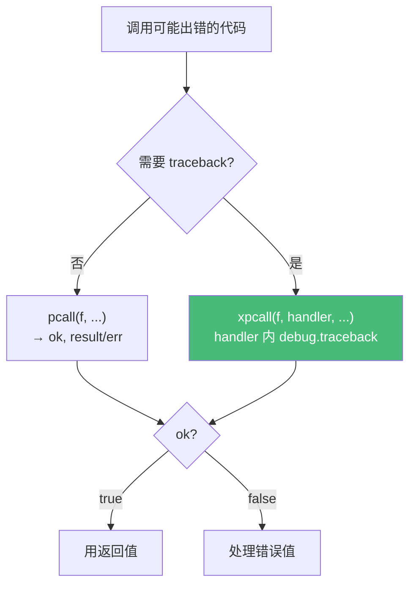

# 精通 Lua 错误处理

> 课程编号：L09
> 路线图来源：Lua 全场景深度课程 — 错误与异常
> 难度：⭐⭐⭐⭐
> 预计阅读时间：50 分钟
> 📅 内容基准：**Lua 5.4.8**（`warn` 为 5.4）+ **LuaJIT 2.1**

---

## 引言：错误不只是字符串

```lua
-- 1) 输出？
local ok, err = pcall(function() error("boom") end)
print(ok, err)

-- 2) 错误可以是表吗？输出？
local ok2, err2 = pcall(function()
    error({ code = 404, msg = "not found" })
end)
print(ok2, type(err2), err2.code)

-- 3) error 的 level 参数有什么用？
local function check(x)
    if not x then error("参数错误", 2) end   -- level 2
end
-- check(nil) 会报告哪一行？

-- 4) pcall 能捕获语法错误吗？
local ok3 = pcall(function() local x = end)
print(ok3)
```

答案：① `false  文件:行: boom`（error 给字符串会自动加位置前缀）；② `false  table  404`（**错误可以是任意值，包括表**——这是 Lua 实现"结构化异常"的方式）；③ `level 2` 让错误**指向调用者那一行**而非 `error` 所在行（写校验函数的关键）；④ 这是个陷阱——`local x = end` 是**语法错误**，在函数**定义时**就编译失败了，根本到不了 pcall。

Lua 没有 `try/catch` 关键字，而是用 `error` + `pcall`/`xpcall` 这套**基于值传递的保护调用机制**。它简单、灵活，但有几个容易踩的点：错误对象、level、traceback 时机、与协程的交互。这一章讲透——它是写健壮库、OpenResty handler（L17）、Redis 脚本（L21）的基础。

---

## 第一章：`error` —— 抛出错误

### 1.1 基本用法

```lua
error("出错了")              -- 抛出字符串错误（自动加 "文件:行: " 前缀）
error("出错了", 0)           -- level 0：不加位置前缀
```

`error(message, level)`：
- `message`：错误值，**任意类型**（字符串、表、数字……）。
- `level`：指示错误**归属哪一层**，影响位置前缀。

### 1.2 `level` 参数详解

`level` 控制错误信息里"文件:行"指向哪一帧：

- `level = 1`（默认）：指向**调用 `error` 的那一行**。
- `level = 2`：指向**调用"包含 error 的函数"的那一行**（即调用者）。
- `level = 0`：**不加**位置信息。

```lua
local function check_positive(n)
    if n <= 0 then
        error("必须为正数", 2)   -- level 2：指向调用 check_positive 的地方
    end
end

check_positive(-1)   -- 错误指向这一行（调用处），而非 check_positive 内部
```

**经验法则**：写**参数校验/库函数**时用 `level = 2`，让使用者看到的是**他们的**代码行，而不是你库内部的行。这是高质量库的标志。

### 1.3 错误对象（结构化异常）

字符串错误适合人读，但程序难处理。用**表作错误对象**可携带结构化信息：

```lua
local function fetch(url)
    if not url:match("^https?://") then
        error({ code = "INVALID_URL", url = url })   -- 表错误，无位置前缀
    end
end

local ok, err = pcall(fetch, "ftp://x")
if not ok then
    if type(err) == "table" and err.code == "INVALID_URL" then
        print("处理特定错误:", err.url)
    end
end
```

⚠️ 表错误**不会**自动加位置前缀（只有字符串会）。需要位置就自己塞进表，或用 `debug.traceback`。

---

## 第二章：`pcall` —— 保护调用

`pcall(f, ...)`（protected call）在保护模式下调用 `f`，**捕获任何错误而不让它向上传播**：

```lua
local ok, result = pcall(function()
    return 10 / 2
end)
print(ok, result)        -- true  5（成功：true + 返回值）

local ok2, err = pcall(function()
    error("fail")
end)
print(ok2, err)          -- false  ...: fail（失败：false + 错误值）
```

返回约定：
- 成功：`true, <f 的返回值们...>`
- 失败：`false, <错误值>`

### 2.1 传参

```lua
local ok, r = pcall(string.rep, "ab", 3)   -- 等价 pcall(function() return string.rep("ab",3) end)
print(ok, r)             -- true  ababab
```

`pcall(f, a, b)` 把 `a, b` 作为参数传给 `f`——避免创建额外闭包。

### 2.2 标准错误处理模式

```lua
local function safe_divide(a, b)
    if b == 0 then error("除零", 2) end
    return a / b
end

local ok, result = pcall(safe_divide, 10, 0)
if ok then
    print("结果:", result)
else
    print("错误:", result)   -- 这里 result 是错误值
end
```

---

## 第三章：`xpcall` —— 带消息处理器

`pcall` 的局限：错误传出时**栈已经展开**，拿不到出错时的调用栈。`xpcall(f, handler, ...)` 多一个**消息处理器（message handler）**，它在**栈展开前**被调用，正好能抓 traceback：

```lua
local function handler(err)
    return debug.traceback(tostring(err), 2)   -- 在出错现场抓栈
end

local ok, err = xpcall(function()
    local function a() error("deep error") end
    local function b() a() end
    b()
end, handler)

print(ok)
print(err)
-- false
-- deep error
-- stack traceback:
--     ... a()
--     ... b()
--     ...
```

**`pcall` vs `xpcall`**：要完整调用栈用 `xpcall + debug.traceback`；只需知道"成没成 + 错误值"用 `pcall`。生产服务（OpenResty）通常用 `xpcall` 记录完整栈。



---

## 第四章：`assert` —— 断言

`assert(v, message)`：`v` 为假（nil/false）时调用 `error(message)`，否则原样返回所有参数：

```lua
assert(type(x) == "number", "x 必须是数字")
local file = assert(io.open("config.lua"))   -- io.open 失败返回 nil,err，assert 抛出 err
```

`assert` 的妙处：很多标准库函数**失败返回 `nil, errmsg`**，`assert` 直接把第二返回值当错误信息抛出——`assert(io.open(path))` 是惯用法。

⚠️ `assert` 的 message **总会被求值**（不像 C 的宏惰性），所以别在 message 里放昂贵计算：

```lua
assert(cond, expensive())   -- expensive() 每次都执行，即使 cond 为真！
```

---

## 第五章：`debug.traceback` 与错误传播

### 5.1 主动获取调用栈

```lua
local function c() print(debug.traceback("到这里的调用栈", 1)) end
local function b() c() end
local function a() b() end
a()
-- 到这里的调用栈
-- stack traceback:
--     c / b / a / ...
```

### 5.2 错误传播链

不被 `pcall` 捕获的错误会一路向上抛，直到顶层（终止程序并打印栈）或被某层 `pcall` 截获：

```lua
local function level3() error("源头") end
local function level2() level3() end       -- 不处理，继续上抛
local function level1()
    local ok, err = pcall(level2)          -- 在这里截获
    if not ok then print("level1 捕获:", err) end
end
level1()
```

### 5.3 重新抛出（rethrow）

```lua
local ok, err = pcall(risky)
if not ok then
    -- 记录后重新抛出
    log(err)
    error(err, 0)   -- level 0 避免重复加位置前缀
end
```

---

## 第六章：`warn` —— 警告系统（5.4 新增）

5.4 引入 `warn`，用于发**警告**（不中断程序），可被开关控制：

```lua
warn("@on")                          -- 开启警告输出（默认关闭）
warn("这是一条警告")                  -- 输出到 stderr: "Lua warning: 这是一条警告"
warn("@off")                         -- 关闭

-- 多段拼接：单次 warn 调用的多个实参会拼接成一条消息
-- （所有实参都必须是字符串，传非字符串会报 "string expected"）
warn("part1 ", "part2", "!")         -- 输出: "Lua warning: part1 part2!"
```

`@on`/`@off` 是**控制消息**。可以用 `lua_setwarnf`（C API）自定义警告处理器，把警告导到日志系统。LuaJIT 无 `warn`。

---

## 第七章：资源清理——错误安全

### 7.1 经典问题：错误导致资源泄漏

```lua
local function process()
    local f = io.open("data.txt")
    local data = parse(f:read("*a"))     -- 如果 parse 出错，f 永远不关闭！
    f:close()
    return data
end
```

### 7.2 用 `pcall` 确保清理

```lua
local function process()
    local f = assert(io.open("data.txt"))
    local ok, result = pcall(function()
        return parse(f:read("*a"))
    end)
    f:close()                            -- 无论成败都关闭
    if not ok then error(result, 0) end  -- 重新抛出
    return result
end
```

### 7.3 5.4 的 `<close>`——确定性清理（预览）

5.4 的 to-be-closed 变量让这变得优雅（详见 L25）：

```lua
local function process()
    local f <close> = assert(io.open("data.txt"))   -- 离开作用域自动 close
    return parse(f:read("*a"))                        -- 即使这里出错，f 也会被关
end
```

`<close>` 变量在作用域结束（含因错误退出）时自动调用其 `__close` 元方法——这是 Lua 版的 RAII / `defer` / `try-with-resources`。**LuaJIT 不支持**，OpenResty 仍需 `pcall` 手动清理。

---

## 第八章：常见陷阱清单

### ❌ 陷阱 1：以为 pcall 能抓语法错误

```lua
pcall(function() if then end end)   -- 语法错误在编译期，pcall 抓不到
```
语法错误要用 `pcall(load(code))` 在加载层捕获。

### ❌ 陷阱 2：表错误没有位置前缀却期望有

```lua
error({msg = "x"})   -- 无 "文件:行" 前缀
```
要位置自己用 `debug.traceback` 或塞进表。

### ❌ 陷阱 3：在校验函数里用默认 level

```lua
local function check(x) if not x then error("bad") end end   -- 错误指向 check 内部
```
修正：`error("bad", 2)` 指向调用者。

### ❌ 陷阱 4：`pcall` 后栈已展开，拿不到 traceback

```lua
local ok, err = pcall(deep_fn)   -- err 只有错误值，没有调用栈
```
要栈用 `xpcall(deep_fn, debug.traceback)`。

### ❌ 陷阱 5：`assert` 的 message 被无条件求值

```lua
assert(ok, "失败: " .. serialize(bigtable))   -- serialize 每次都跑
```
昂贵 message 改用 `if not ok then error(...) end`。

### ❌ 陷阱 6：吞掉错误

```lua
pcall(important_operation)   -- 不检查返回值 → 错误被默默吞掉
```
永远检查 `pcall` 的第一个返回值。

---

## 第九章：练习题

**练习 1**：输出？
```lua
print(pcall(function() return 1, 2, 3 end))
print(pcall(function() error("x") end))
```

**练习 2**：写一个 `try(f, catch)` 函数，模拟 try/catch 语义。

**练习 3**：`level` 实验——下面错误信息指向哪一行？
```lua
local function validate(n)          -- 第 1 行
    error("invalid", 2)             -- 第 2 行
end                                 -- 第 3 行
validate(5)                         -- 第 4 行
```

**练习 4**：用 `xpcall` 捕获错误并打印完整调用栈。

**练习 5**：找 bug（资源泄漏）：
```lua
local function read_config(path)
    local f = io.open(path)
    local content = f:read("*a")    -- f 可能是 nil！
    f:close()
    return content
end
```

---

## 参考答案与解析

**练习 1**：第一行 `true  1  2  3`（成功，true + 所有返回值）；第二行 `false  文件:行: x`。

**练习 2**：
```lua
local function try(f, catch)
    local ok, err = pcall(f)
    if not ok then catch(err) end
end
try(function() error("oops") end, function(e) print("caught:", e) end)
```

**练习 3**：指向**第 4 行**（`validate(5)` 调用处）。`level = 2` 让错误归属调用者那一帧，而非 error 所在的第 2 行。

**练习 4**：
```lua
local ok, err = xpcall(function()
    error("deep")
end, function(e) return debug.traceback(e, 2) end)
print(err)   -- 含完整 stack traceback
```

**练习 5**：`io.open` 失败返回 `nil, errmsg`，`f:read` 会对 nil 报错且 `f:close()` 也崩。修正：`local f = assert(io.open(path))`，或 `<close>`（5.4）。

---

## 小结

| 知识点 | 关键记忆 |
|---|---|
| error | 抛任意值；字符串自动加位置前缀，表不加 |
| level | 1=本行，2=调用者，0=无前缀；**校验函数用 2** |
| pcall | 保护调用；成功 `true,...`，失败 `false,err`；**必检查返回值** |
| xpcall | 多消息处理器；栈展开前抓 `debug.traceback` |
| assert | 假则抛错；`assert(io.open(...))` 惯用；message 总被求值 |
| 错误对象 | 用表携带结构化信息（code/msg） |
| warn | 5.4 警告系统，`@on`/`@off`；LuaJIT 无 |
| 资源安全 | `pcall` 包裹 + finally 清理；5.4 用 `<close>` |

---

## 📅 2026 现状/更新

- **`warn`** 与 **`<close>`** 是 5.4 的错误/资源管理增强；LuaJIT 两者都无。
- OpenResty 里 handler 通常用 `xpcall(fn, debug.traceback)` 记录完整栈，再 `ngx.log(ngx.ERR, ...)`（L17）。
- Redis 脚本（L21）用 `redis.pcall` 而非 `redis.call` 来捕获命令错误，是同一思想的领域版本。

---

> 🔁 下一篇 **L10 — 精通 Lua 模块、require 与 LuaRocks**：`require` 的缓存与搜索器机制、`package.path`/`cpath`、现代模块写法（返回 table）vs 废弃的 `module()`、C 模块加载，以及用 LuaRocks 管理依赖。
>
> 反馈：错误处理决定代码的健壮性，把第七章的资源安全模式用在你的实际 IO 代码里。
