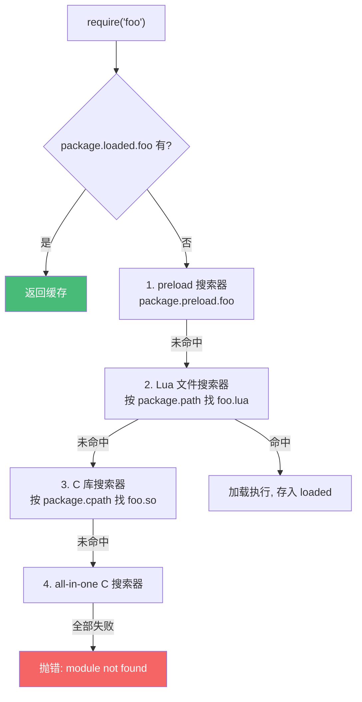

# 精通 Lua 模块、require 与 LuaRocks

> 课程编号：L10
> 路线图来源：Lua 全场景深度课程 — 模块与依赖
> 难度：⭐⭐⭐
> 预计阅读时间：50 分钟
> 📅 内容基准：**Lua 5.4.8** + **LuaJIT 2.1** + **LuaRocks 3.x**

---

## 引言：require 到底做了什么

```lua
-- 1) require 同一个模块两次，模块代码执行几次？
local a = require("mymod")
local b = require("mymod")
print(a == b)            -- ?

-- 2) 这个模块返回什么？
-- file: greet.lua
local M = {}
function M.hello() return "hi" end
return M
-- 调用方：
local g = require("greet")
print(g.hello())

-- 3) require 找不到模块会怎样？
local ok, mod = pcall(require, "nonexistent")
print(ok)
```

答案：① `true`——**`require` 有缓存，模块代码只执行一次**，后续返回缓存的同一个值；② 打印 `hi`（模块返回的 table 就是 `require` 的返回值）；③ `false`（找不到模块时 `require` 抛错，故 pcall 返回 false）。

模块系统是把代码组织成可复用单元的机制。Lua 的 `require` 看似简单，背后有一套**缓存 + 多搜索器**的机制。搞懂它能解决"为什么改了模块不生效""相对路径找不到""C 模块怎么加载"等高频问题。这一章也是 OpenResty 代码组织（L17）和热重载（L23）的基础。

---

## 第一章：现代模块的标准写法

### 1.1 返回一个 table

现代 Lua（5.1+ 通用）模块的标准写法就一句话：**一个文件返回一个 table（或任意值）**。

```lua
-- file: mymath.lua
local M = {}

local function private_helper(x)   -- 私有：不导出
    return x * 2
end

function M.double(x)                -- 公开：挂在返回的 table 上
    return private_helper(x)
end

M.PI = 3.14159

return M                           -- 关键：返回模块表
```

使用：

```lua
local mymath = require("mymath")
print(mymath.double(5))   -- 10
print(mymath.PI)          -- 3.14159
```

**要点**：
- 用 `local M = {}` 收集导出项，最后 `return M`。
- 不写 `local` 的函数才是私有（但要始终写 local，靠"不挂到 M 上"来区分私有/公开）。
- **不要污染全局**——现代模块不往 `_G` 写任何东西。

### 1.2 为什么不用 `module()`

老教程里的 `module("name", package.seeall)` 写法**已在 5.2 废弃、5.3+ 移除**：

```lua
-- ❌ 过时写法，别用
module("mymath", package.seeall)
function double(x) return x * 2 end
```

它的问题：污染全局、`package.seeall` 破坏封装、行为隐晦。**一律用"返回 table"的写法。**

---

## 第二章：`require` 的机制

### 2.1 缓存：`package.loaded`

`require("foo")` 第一次会加载执行 `foo`，并把返回值存进 **`package.loaded.foo`**；之后再 `require("foo")` 直接返回缓存，**不重新执行**。

```lua
-- counter.lua
print("模块被加载")
return { n = 0 }

-- main.lua
local a = require("counter")   -- 打印"模块被加载"
local b = require("counter")   -- 不打印（用缓存）
a.n = 99
print(b.n)                     -- 99（a 和 b 是同一个表！）
```

**推论**：
- 模块天然是**单例**——所有 `require` 拿到同一个实例，可用于共享状态（但 OpenResty 里要小心跨请求共享，见 L17）。
- 改了模块文件后，已 `require` 的不会自动更新——**热重载需手动清缓存**：`package.loaded.foo = nil`（见 L23）。

### 2.2 搜索器（searchers）

`require` 按 `package.searchers`（5.1 叫 `package.loaders`）里的搜索器**依次尝试**：



### 2.3 `package.preload`：手动注册

可以在不写文件的情况下注册模块加载器：

```lua
package.preload["virtual"] = function()
    return { msg = "我是虚拟模块" }
end
print(require("virtual").msg)   -- 我是虚拟模块
```

OpenResty/打包工具常用 preload 把多个模块塞进单文件。

---

## 第三章：搜索路径

### 3.1 `package.path`（Lua 模块）

`package.path` 是用 `;` 分隔、含 `?` 占位的模板。`require("a.b")` 会把 `.` 转成路径分隔符，用模块名替换 `?`：

```lua
print(package.path)
-- 典型: ./?.lua;/usr/local/share/lua/5.4/?.lua;/usr/local/share/lua/5.4/?/init.lua;...

-- require("foo.bar") 会尝试：
-- ./foo/bar.lua
-- /usr/local/share/lua/5.4/foo/bar.lua
-- .../foo/bar/init.lua
```

注意 `require("foo.bar")` 里的 `.` 表示**目录层级**（`foo/bar.lua`），不是字段访问。

### 3.2 `package.cpath`（C 模块）

```lua
print(package.cpath)
-- 典型: ./?.so;/usr/local/lib/lua/5.4/?.so;...   （Windows 是 .dll）
```

### 3.3 环境变量与自定义

```lua
-- 环境变量 LUA_PATH / LUA_CPATH（;; 表示"插入默认值"）
-- export LUA_PATH="./src/?.lua;;"

-- 运行时追加
package.path = package.path .. ";./lib/?.lua"
```

OpenResty 用 `lua_package_path` 指令设置（见 L17）。

---

## 第四章：C 模块

### 4.1 加载机制

C 写的扩展编译成动态库（`.so`/`.dll`），`require` 通过 cpath 找到后，调用其中名为 **`luaopen_<模块名>`** 的导出函数：

```c
// mylib.c → mylib.so
int luaopen_mylib(lua_State *L) {
    luaL_newlib(L, mylib_funcs);   // 创建模块表
    return 1;                       // 返回 1 个值（模块表）
}
```

```lua
local mylib = require("mylib")   -- 加载 mylib.so，调用 luaopen_mylib
```

子模块名 `a.b` 对应函数 `luaopen_a_b`（点变下划线）。C 模块细节见 L15（C API）。

### 4.2 `package.loadlib`：手动加载

```lua
local f = package.loadlib("./mylib.so", "luaopen_mylib")
local mylib = f()
```

低层 API，一般用 `require` 即可。

---

## 第五章：LuaRocks —— 包管理器

LuaRocks 是 Lua 的包管理器（类比 npm/pip）。

### 5.1 常用命令

```bash
luarocks install luasocket          # 安装包
luarocks install penlight --local   # 装到用户目录（~/.luarocks）
luarocks list                        # 已装列表
luarocks remove luasocket            # 卸载
luarocks search json                 # 搜索
luarocks show luasocket              # 查看包信息与依赖
luarocks path                        # 打印需要 export 的 LUA_PATH/LUA_CPATH
```

装好后，把 `luarocks path` 输出的环境变量加进 shell，`require` 就能找到。

### 5.2 rockspec：包描述文件

每个包由一个 `.rockspec` 描述（依赖、源码、构建方式）：

```lua
-- mypackage-1.0-1.rockspec
package = "mypackage"
version = "1.0-1"
source = { url = "git+https://github.com/me/mypackage" }
dependencies = { "lua >= 5.1", "luasocket" }
build = {
    type = "builtin",
    modules = { ["mypackage"] = "src/mypackage.lua" }
}
```

### 5.3 本地 tree 与隔离

```bash
luarocks --tree ./modules install penlight   # 装到项目本地目录
```

类似 `node_modules` 的项目级隔离。OpenResty 生态常用 `opm`（OpenResty Package Manager）替代或并用 LuaRocks。

---

## 第六章：模块组织实践

### 6.1 子模块与 init.lua

```
mylib/
  init.lua       -- require("mylib") 加载这个
  util.lua       -- require("mylib.util")
  net.lua        -- require("mylib.net")
```

```lua
-- mylib/init.lua
local M = {}
M.util = require("mylib.util")
M.net = require("mylib.net")
return M
```

### 6.2 避免循环依赖

A require B，B 又 require A 会出问题（其中一个拿到未完成的模块）。解法：把共享部分抽到第三个模块，或延迟 require（在函数内 require 而非文件顶部）。

```lua
-- 延迟 require 打破循环
local function f()
    local b = require("b")   -- 用时才加载
    return b.something()
end
```

---

## 第七章：常见陷阱清单

### ❌ 陷阱 1：改了模块不生效

```lua
require("mod")   -- 已缓存
-- 改了 mod.lua 后再 require 还是旧的
```
修正（热重载）：`package.loaded["mod"] = nil` 再 require（见 L23）。

### ❌ 陷阱 2：模块忘记 return

```lua
-- mymod.lua
local M = {}
function M.f() end
-- 忘了 return M ！
```
`require` 返回 `true`（默认值）而非模块表，调用方拿不到 `M.f`。**务必 `return M`**。

### ❌ 陷阱 3：模块污染全局

```lua
-- bad.lua
function helper() end   -- 没 local → 全局污染！
return {}
```
修正：所有内部函数都 `local`。

### ❌ 陷阱 4：`require("a/b")` 用斜杠

```lua
require("foo/bar")   -- ❌ 应该用点
require("foo.bar")   -- ✅ 点表示层级
```

### ❌ 陷阱 5：用废弃的 `module()`

```lua
module("x", package.seeall)   -- 5.3+ 已移除，报错
```
用"返回 table"写法。

### ❌ 陷阱 6：循环依赖导致空表

```lua
-- a.lua require b，b.lua 顶部 require a → a 还没 return，b 拿到不完整的 a
```
修正：延迟 require 或重构。

---

## 第八章：练习题

**练习 1**：判断真假——"`require('x')` 每次都会重新执行 x.lua。"

**练习 2**：写一个模块 `stack.lua`，导出 `new`/`push`/`pop`，内部状态私有。

**练习 3**：`require("a.b.c")` 在 `package.path` 为 `./?.lua` 时会尝试哪个文件路径？

**练习 4**：实现一个 `reload(name)` 函数，强制重新加载模块。

**练习 5**：找 bug：
```lua
-- config.lua
local config = { port = 8080 }
config   -- 想返回它
```

---

## 参考答案与解析

**练习 1**：**假**。`require` 有缓存（`package.loaded`），同一模块只执行一次，后续返回缓存。

**练习 2**：
```lua
-- stack.lua
local Stack = {}
Stack.__index = Stack
local M = {}
function M.new() return setmetatable({ items = {} }, Stack) end
function Stack:push(v) self.items[#self.items + 1] = v end
function Stack:pop() return table.remove(self.items) end
return M
```

**练习 3**：尝试 `./a/b/c.lua`（点全部转成路径分隔符，替换 `?`）。

**练习 4**：
```lua
local function reload(name)
    package.loaded[name] = nil
    return require(name)
end
```

**练习 5**：少了 `return`。最后一行 `config` 只是一个表达式语句，没有 `return`，所以模块返回 nil/true。修正：`return config`。

---

## 小结

| 知识点 | 关键记忆 |
|---|---|
| 模块写法 | `local M = {} ... return M`；私有靠不挂到 M |
| 废弃 | 不用 `module()`（5.3+ 移除） |
| require 缓存 | `package.loaded`；只执行一次；天然单例 |
| 搜索器 | preload → Lua 文件(path) → C 库(cpath) → all-in-one C（共 4 个）|
| 路径 | `package.path`/`cpath` 用 `?` 占位；`require("a.b")` 点表层级 |
| C 模块 | `.so` 里的 `luaopen_<name>`；点变下划线 |
| LuaRocks | install/list/remove；rockspec 描述；本地 tree 隔离 |
| 热重载 | 清 `package.loaded[name]` 再 require |

---

## 📅 2026 现状/更新

- **LuaRocks 3.x** 为当前主线；OpenResty 生态另有 **opm** 与基于 `lua_package_path` 的部署方式（L17）。
- 现代模块"返回 table"写法跨 5.1–5.4 与 LuaJIT 完全一致，是最可移植的组织方式。
- 模块缓存的单例特性在 OpenResty 是双刃剑：worker 级共享可缓存配置，但**绝不能存请求相关状态**（跨请求泄漏），这点在 L17 反复强调。

---

> 🔁 下一篇 **L11 — 精通 Lua 基于元表的 OOP**：用表 + 元表搭建类、`self` 与冒号语法、单继承与多重继承、私有性，以及 `middleclass` 等类库的实现原理。
>
> 反馈：把练习 2 的 stack 模块真正建成文件 require 进来跑一遍，体会模块化。
