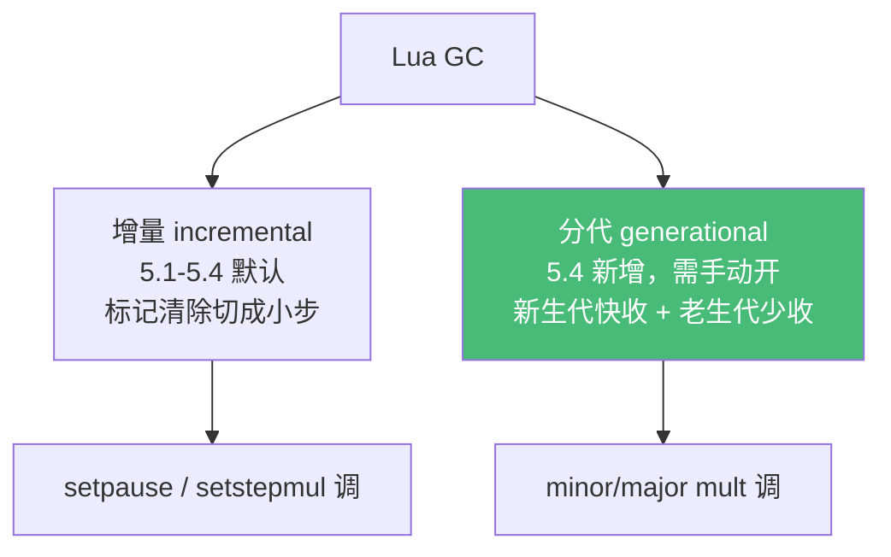

# 精通 Lua 垃圾回收与弱表

> 课程编号：L12
> 路线图来源：Lua 全场景深度课程 — 内存管理
> 难度：⭐⭐⭐⭐⭐
> 预计阅读时间：60 分钟
> 📅 内容基准：**Lua 5.4.8**（分代 GC）+ **LuaJIT 2.1**

---

## 引言：内存自动管理，但你得懂它

```lua
-- 1) 这个对象什么时候被回收？__gc 何时打印？
do
    local obj = setmetatable({}, { __gc = function() print("回收!") end })
end
-- 离开块后 obj 不可达，但"回收!"什么时候打印？

-- 2) 弱表：输出？
local cache = setmetatable({}, { __mode = "v" })   -- 值弱引用
cache[1] = {} -- 临时表
collectgarbage()
print(cache[1])   -- ?

-- 3) collectgarbage 能查内存吗？
print(collectgarbage("count"))   -- 单位是什么？
```

答案：① **不确定**——`__gc` 在对象被 GC 回收时调用，但 GC 何时运行是非确定的（要么等内存压力触发，要么手动 `collectgarbage()`）；② 大概率是 `nil`——值是弱引用，没有其它强引用时会被回收；③ 返回**已用内存的 KB 数**（不是字节）。

Lua 有自动垃圾回收（GC），但"自动"不等于"不用懂"。理解 GC 的工作方式、`collectgarbage` 调优、弱表、`__gc` 终结器，是写不卡顿的游戏（L23）、不泄漏的长驻服务（OpenResty L17）的必修课。

---

## 第一章：Lua 的 GC 演进

### 1.1 标记-清除（mark and sweep）

Lua 用**追踪式 GC**：从根（全局表、栈、注册表）出发，标记所有可达对象，未标记的即垃圾，清除回收。基本算法是**标记-清除**。

### 1.2 增量 GC（5.1–5.3 默认，5.4 可选）

一次性标记清除会造成长时间停顿（stop-the-world, STW）。**增量 GC（incremental）** 把工作切成小步，与程序交替执行，**降低单次停顿**（但总开销略增）。这是 5.1–5.4 都支持的模式。

### 1.3 分代 GC（5.4 新增）

5.4 引入**分代 GC（generational）**，基于"大多数对象朝生夕死"的假设：

- **新生代**：频繁、快速地回收新对象（多数对象在这里就死了）。
- **老生代**：存活下来的对象晋升，较少回收。

分代 GC 对"大量短命小对象"（游戏每帧的临时表、Web 每请求的临时数据）特别高效。**5.4 默认仍是增量**，分代需手动开启：

```lua
collectgarbage("generational")   -- 切到分代模式
collectgarbage("incremental")    -- 切回增量模式（默认）
```



> ⚠️ LuaJIT 用的是自己的 GC（接近 Lua 5.1 的增量；其 GC64/新 GC 长期在开发）。本章的 5.4 分代是 PUC-Lua 专属。

---

## 第二章：`collectgarbage` —— 控制与监控

```lua
collectgarbage("collect")     -- 完整 GC 一轮（默认动作）
collectgarbage("count")       -- 返回已用内存（KB，浮点）
collectgarbage("step", n)     -- 走一小步 GC
collectgarbage("stop")        -- 暂停自动 GC
collectgarbage("restart")     -- 恢复自动 GC
collectgarbage("setpause", p)    -- 设置"暂停"参数（5.4 用 incremental 的参数）
collectgarbage("setstepmul", m)  -- 设置步进倍率
collectgarbage("incremental"[, p, sm, ...])  -- 切增量模式 + 参数
collectgarbage("generational"[, minor, major]) -- 切分代模式 + 参数
collectgarbage("isrunning")   -- GC 是否在自动运行
```

### 2.1 监控内存

```lua
local before = collectgarbage("count")
local data = {}
for i = 1, 100000 do data[i] = { value = i } end
local after = collectgarbage("count")
print(("用了 %.1f KB"):format(after - before))
```

`count` 返回 KB（除以 1024 得 MB）。这是排查内存泄漏的第一工具。

### 2.2 调优参数

- **pause（暂停）**：控制 GC 多久启动一次。值越大，等内存涨越多才回收（更少 GC、更多内存）。5.4 增量默认 200（即内存翻倍才启动新一轮）。
- **step multiplier（步进倍率）**：控制每步回收多少。越大回收越快但每步停顿越长。

```lua
-- 内存敏感场景：更激进回收
collectgarbage("incremental", 100, 200)   -- pause=100（内存涨 100% 就收）

-- 延迟敏感（游戏）：用分代减少停顿
collectgarbage("generational")
```

⚠️ 调优要基于**实测**（`count` + 停顿测量），盲调常适得其反。

---

## 第三章：`__gc` 终结器

### 3.1 释放外部资源

`__gc` 元方法在对象被回收时调用，用于释放 GC 管不到的**外部资源**（文件句柄、C 分配的内存、socket）：

```lua
local function open_resource(name)
    return setmetatable({ name = name }, {
        __gc = function(self)
            print("释放资源:", self.name)   -- 模拟 close
        end
    })
end

do
    local r = open_resource("file.txt")
    -- 使用 r
end
collectgarbage()   -- 触发回收 → 打印"释放资源: file.txt"
```

### 3.2 关键限制

- **非确定性时机**：`__gc` 何时调用取决于 GC，**不保证及时**。需要确定性释放用 `<close>`（5.4，见 L25）或手动 `close`。
- **5.1 的坑**：5.1 里普通表的 `__gc` 不生效（需 `newproxy` hack）；**5.2+ 普通表的 `__gc` 才正常工作**。
- **必须在设元表时已有 `__gc`**：5.4 里，对象设置元表时元表若没有 `__gc` 字段，之后再加也无效（要在 setmetatable 时就带上，或用特定标记）。
- **LuaJIT**：FFI 对象用 `ffi.gc` 而非 `__gc`（见 L14）。

### 3.3 对象复活（resurrection）

`__gc` 里如果把对象重新变可达（如存进全局表），对象"复活"——但其 `__gc` **不会再次调用**：

```lua
local saved
local obj = setmetatable({ id = 1 }, {
    __gc = function(self) saved = self end   -- 复活：存进外部变量
})
```

复活是高级且危险的用法，一般避免。

---

## 第四章：弱表（Weak Table）

### 4.1 强引用 vs 弱引用

普通表对它的键和值持**强引用**——只要表活着，键值就不会被回收。**弱表**持**弱引用**——如果某个键/值只被这个弱表引用（无其它强引用），GC 可以回收它。

用元表的 **`__mode`** 字段声明弱性：

| `__mode` | 含义 |
|---|---|
| `"k"` | 键弱引用 |
| `"v"` | 值弱引用 |
| `"kv"` | 键和值都弱 |

```lua
local cache = setmetatable({}, { __mode = "v" })   -- 值弱
cache.temp = {} -- 只有 cache 引用这个表
collectgarbage()
print(cache.temp)   -- nil（值被回收，条目自动消失）

local keep = {}
cache.kept = keep   -- keep 有强引用
collectgarbage()
print(cache.kept)   -- table（keep 还活着，没被回收）
```

### 4.2 用途一：自动清理的缓存

```lua
-- 值弱缓存：缓存的值在别处不再使用时自动失效
local result_cache = setmetatable({}, { __mode = "v" })
local function compute(key)
    if result_cache[key] then return result_cache[key] end
    local r = expensive(key)
    result_cache[key] = r
    return r
end
-- 当某个结果在程序别处不再被引用，它会从缓存自动消失，不占内存
```

### 4.3 用途二：对象关联元数据（键弱）

给对象挂"侧表（side table）"信息，又不阻止对象被回收：

```lua
local metadata = setmetatable({}, { __mode = "k" })   -- 键弱
local function tag(obj, info) metadata[obj] = info end
-- 当 obj 在别处被回收，metadata 里对应条目自动消失，不泄漏
```

这是"对象 → 额外属性"映射的标准做法（避免侵入对象本身）。

### 4.4 注意：值含数字/布尔的键弱表

弱性只对**可回收对象**（表、函数、userdata、线程、长字符串）有意义。数字、布尔、短字符串不会被回收，放在弱表里不会消失。

---

## 第五章：GC 与性能实践

### 5.1 减少垃圾产生

GC 压力的根源是"产生大量临时对象"。减少分配：

```lua
-- ❌ 循环里大量临时表/字符串
for i = 1, 1e6 do
    local t = { x = i }      -- 每次新表
    process(t)
end

-- ✅ 复用对象
local t = {}
for i = 1, 1e6 do
    t.x = i                  -- 复用同一表
    process(t)
end
```

LuaJIT 的 `table.clear` 可原地清空复用：

```lua
local clear = require("table.clear")
clear(t)   -- 清空但不释放，复用
```

### 5.2 字符串拼接（回顾 L04）

循环 `..` 产生大量临时字符串，用 `table.concat`。

### 5.3 游戏：控制每帧分配

游戏要稳定帧率，常用：**对象池（pool）**复用、分代 GC、或在帧间手动 `collectgarbage("step")` 摊平停顿（见 L23）。

### 5.4 OpenResty：worker 级注意

OpenResty 每个 worker 一个 LuaJIT VM，长驻。要点：避免缓存无限增长（用弱表或 LRU，见 L19）、避免全局变量累积（L17）。

---

## 第六章：常见陷阱清单

### ❌ 陷阱 1：依赖 `__gc` 及时释放

```lua
local f = setmetatable({}, { __gc = function() io_close() end })
-- f 不可达后，文件可能很久才关闭（GC 不及时）
```
修正：需要确定性用 `<close>`（5.4）或手动 close。

### ❌ 陷阱 2：以为 `collectgarbage("count")` 返回字节

```lua
print(collectgarbage("count"))   -- KB，不是字节！
```

### ❌ 陷阱 3：弱表里放不可回收值期望消失

```lua
local t = setmetatable({}, { __mode = "v" })
t.x = 42    -- 数字不会被回收，永远在
```

### ❌ 陷阱 4：强引用阻止弱表回收

```lua
local cache = setmetatable({}, { __mode = "v" })
local data = {}
cache.d = data   -- data 有强引用（局部变量），不会被回收
-- 只要 data 局部变量在作用域内，cache.d 就不消失
```

### ❌ 陷阱 5：在 `__gc` 里做复杂/会出错的操作

```lua
__gc = function(self) risky_operation() end   -- __gc 里出错会被忽略或警告，难调试
```
`__gc` 应只做简单的资源释放。

### ❌ 陷阱 6：LuaJIT 用 `__gc` 管 FFI 对象

```lua
-- LuaJIT FFI 的 cdata 用 ffi.gc 注册终结器，不是 __gc（见 L14）
```

---

## 第七章：练习题

**练习 1**：输出什么？为什么不确定？
```lua
setmetatable({}, { __gc = function() print("gc") end })
print("end")
```

**练习 2**：用弱表实现一个不会内存泄漏的"对象 → 名字"映射。

**练习 3**：测量一个操作的内存开销。

**练习 4**：判断 `cache[k]` 回收后是否还在：
```lua
local cache = setmetatable({}, { __mode = "k" })
local key = {}
cache[key] = "data"
key = nil
collectgarbage()
-- cache 里还有那个条目吗？
```

**练习 5**：判断真假——"调用 `collectgarbage()` 后所有不可达对象立即被回收。"

---

## 参考答案与解析

**练习 1**：先打印 `end`，`gc` 在某次 GC 运行时才打印（程序退出时也会做最终 GC，所以最终会看到 `gc`，但时机不定）。匿名对象创建后立即不可达，但回收时机非确定。

**练习 2**：
```lua
local names = setmetatable({}, { __mode = "k" })   -- 键弱
local function set_name(obj, name) names[obj] = name end
local function get_name(obj) return names[obj] end
-- obj 在别处被回收时，names 条目自动清除，不泄漏
```

**练习 3**：
```lua
collectgarbage()
local m0 = collectgarbage("count")
local big = {}; for i = 1, 10000 do big[i] = i end
local m1 = collectgarbage("count")
print(("%.1f KB"):format(m1 - m0))
```

**练习 4**：**条目会消失**。键 `key` 弱引用，`key = nil` 后没有其它强引用，GC 回收它，弱表里以它为键的条目自动移除。

**练习 5**：**假**。`collectgarbage()` 做一轮回收，但带 `__gc` 的对象、复活、以及增量进度等因素下，"立即全部回收"不绝对成立；通常需要理解为"触发一轮完整回收"。

---

## 小结

| 知识点 | 关键记忆 |
|---|---|
| 算法 | 追踪式标记-清除 |
| 模式 | 增量（5.1–5.4 默认）/ **分代（5.4 新增，需手动开）** |
| collectgarbage | `count`(KB) / `collect` / `step` / `stop`/`restart` / `incremental`/`generational` |
| 调优 | pause（多久启动）+ stepmul（每步多少）；**实测驱动** |
| `__gc` | 释放外部资源；**时机非确定**；5.2+ 普通表才生效；LuaJIT 用 ffi.gc |
| 弱表 | `__mode` k/v/kv；缓存（值弱）、对象元数据（键弱） |
| 弱性条件 | 只对可回收对象有意义（表/函数/userdata/线程） |
| 性能 | 减少临时对象、复用、`table.clear`(LuaJIT)、对象池 |

---

## 📅 2026 现状/更新

- **分代 GC** 是 5.4 的重要增强，对"大量短命对象"场景（游戏每帧、Web 每请求）显著降停顿；5.4 默认仍是增量，按需 `collectgarbage("generational")`。
- **LuaJIT** 用自有 GC（接近 5.1 增量）；其新一代 GC 长期开发中。OpenResty 高并发下控制内存增长（弱表/LRU/避免全局累积）仍是核心运维点。
- 确定性资源释放优先用 **5.4 `<close>`**（L25），把 `__gc` 留给"兜底"。

---

> 🔁 下一篇 **L13 — 精通 LuaJIT：JIT 与性能模型**：进入模块四。LuaJIT 的 trace 编译如何工作、什么是 NYI（导致 trace 中止）、性能为何能逼近 C、以及它与标准 Lua 的兼容性边界。
>
> 反馈：用 `collectgarbage("count")` 给你自己的脚本做一次内存画像，往往有惊喜。
