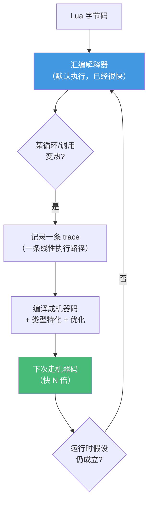

# 精通 LuaJIT：JIT 与性能模型

> 课程编号：L13
> 路线图来源：Lua 全场景深度课程 — 高性能运行时
> 难度：⭐⭐⭐⭐⭐
> 预计阅读时间：60 分钟
> 📅 内容基准：**LuaJIT 2.1**（rolling，兼容 Lua 5.1 + 部分 5.2/5.3）

---

## 引言：为什么同样的代码快了 30 倍

```lua
-- 同一段代码：
local sum = 0
for i = 1, 100000000 do
    sum = sum + i
end
print(sum)

-- $ time lua    script.lua   →  约 1.x 秒
-- $ time luajit script.lua   →  约 0.0x 秒（快一两个数量级）
```

为什么快这么多？因为 **LuaJIT 把这个热循环编译成了机器码**，而标准 Lua 一直在解释字节码。但 LuaJIT 的"快"是有条件的——某些操作会让它**退回解释器**。理解它什么时候快、什么时候不快，是写高性能 Lua（OpenResty L17、游戏 L23）的核心。

这一章讲清 LuaJIT 的工作原理、性能模型、以及和标准 Lua 的边界。

---

## 第一章：LuaJIT 是什么

### 1.1 一个独立的 Lua 实现

LuaJIT 由 **Mike Pall** 开发，是 Lua 5.1 的一个**高性能独立实现**，不是 PUC-Lua 的插件。它包含两大部分：

- **高度优化的解释器**：用**手写汇编**实现（不是 C），本身就比 PUC-Lua 快好几倍。
- **trace 编译器（JIT）**：在运行时把"热点代码路径"编译成本地机器码。



### 1.2 语言版本：5.1 + 扩展

LuaJIT **基于 Lua 5.1**，但移植了部分 5.2/5.3 特性：

- **有**：`goto`（5.2）、`//` 整除运算符（但结果按 double）、部分 5.2 库函数。
- **没有**：原生整型（5.3）、位运算符 `& | ~`（用 `bit` 库代替）、`<close>`（5.4）、`_ENV`（用 `setfenv`/`getfenv`）、5.4 分代 GC。
- **独有**：**FFI**（杀手锏，L14）、`bit` 库、`table.new`/`table.clear`、`jit.*` 控制库。

> 这就是为什么前几章反复强调"你在用哪个 Lua"。OpenResty = LuaJIT，所以那里没有原生整型、没有 `<close>`。

---

## 第二章：Trace 编译——和方法 JIT 不同

### 2.1 什么是 trace

多数 JIT（JVM HotSpot、V8）是**方法级 JIT**：以函数为单位编译。LuaJIT 是 **trace JIT**：以**一条实际执行的线性路径**为单位编译。

工作流程：

1. **计数**：解释器给循环回边、函数调用计数。
2. **触发**：某处计数超过阈值（变"热"）→ 开始记录。
3. **记录（recording）**：跟踪一次实际执行，记下**这条具体路径**上的所有操作（跨越函数调用、内联），形成一条 trace（线性的中间表示 IR）。
4. **编译**：对这条 trace 做激进优化（类型特化、循环不变量外提、消除冗余）后生成机器码。
5. **执行 + guard**：下次走机器码，但每个"假设"（如"这个变量是数字""这个分支走 then"）都有一个 **guard**；假设不成立就**退回解释器**（trace exit）。

### 2.2 为什么 trace 模型快

- **跨函数内联**：一条 trace 可以穿过多层函数调用，把它们摊平成一段直线代码，消除调用开销。
- **类型特化**：记录时看到 `x` 是数字，就按数字生成代码，省去动态类型检查（用 guard 兜底）。
- **专注热路径**：只编译真正热的路径，冷代码不浪费编译成本。

### 2.3 side trace（侧分支）

当一个 guard 频繁失败（某分支也变热），LuaJIT 会为它编译一条 **side trace**，挂在主 trace 上。多条 trace 织成一棵 trace 树，覆盖常见路径。

---

## 第三章：NYI —— LuaJIT 性能的"暗礁"

### 3.1 什么是 NYI

某些操作 LuaJIT 的 JIT **还没实现编译（Not Yet Implemented, NYI）**。一旦 trace 记录中遇到 NYI 操作，**记录中止（trace abort）**，这段代码只能在解释器里跑——**得不到 JIT 加速**。

常见 NYI（不同版本略有差异）：

- `pairs()` 遍历（**`ipairs` 可 JIT，`pairs` 长期 NYI**！这是最著名的坑）
- 部分字符串函数（如 `string.gsub` 带函数替换、某些 `string.format`）
- `select('#', ...)` 之外的部分 vararg 操作
- `coroutine.resume`/`yield`（协程切换会中断 trace）
- 非 FFI 的 C 函数调用（早期完全 NYI；LuaJIT 2.1 起有 trace stitching 可续接 trace。`pcall`/`xpcall` 本身在 2.1 已可被编译）

### 3.2 实战影响

```lua
-- ❌ 慢：pairs 是 NYI，这个循环无法 JIT
for k, v in pairs(huge_table) do process(k, v) end

-- ✅ 快：数组用 ipairs 或数字 for（可 JIT）
for i = 1, #arr do process(arr[i]) end
for i, v in ipairs(arr) do process(i, v) end
```

这解释了 OpenResty 性能金律之一：**热路径避免 `pairs`，尽量用数组 + 数字 for**。

### 3.3 诊断工具

```bash
luajit -jv script.lua      # 打印 trace 信息（编译了哪些、abort 在哪）
luajit -jdump script.lua   # dump 详细 IR/机器码
luajit -jp script.lua      # profiler（见 L24）
```

`-jv` 输出里 `[TRACE --- ... abort ...]` 标出哪里因 NYI 中止——这是优化热路径的关键线索。

```lua
-- 代码里也能查
local jit = require("jit")
print(jit.version)         -- LuaJIT 2.1.x
print(jit.status())        -- JIT 是否开启 + 启用的优化
```

---

## 第四章：性能模型与对比

### 4.1 量级感知

| 实现 | 相对速度（数值循环类） |
|---|---|
| PUC-Lua 5.4 解释器 | 1x（基准，但已是动态语言里很快的）|
| LuaJIT 解释器（未 JIT） | 约 2–4x |
| LuaJIT JIT 热路径 | 约 10–50x，**接近 C** |
| LuaJIT + FFI | 某些场景**等于 C**（L14）|

注意"接近 C"只在**可 JIT 的数值/数组密集代码**上成立。大量字符串处理、`pairs`、协程切换的代码，LuaJIT 优势会缩小。

### 4.2 什么代码 LuaJIT 最爱

- 数值计算密集的循环。
- 数组（连续整数键）+ 数字 for / ipairs。
- FFI 调用 C 库（零开销，L14）。
- 类型稳定的热路径（变量类型不变，guard 不频繁失败）。

### 4.3 什么会拖慢

- `pairs` 遍历哈希表（NYI）。
- 频繁的协程切换（中断 trace）。
- 类型不稳定（同一变量一会儿数字一会儿字符串 → guard 频繁失败、trace 反复退出）。
- 过多的字符串生成（GC 压力 + 部分 NYI）。

---

## 第五章：`jit.*` 控制库

```lua
local jit = require("jit")

jit.on()              -- 开启 JIT（默认开）
jit.off()             -- 关闭 JIT（只用解释器）
jit.flush()           -- 清空所有已编译 trace（如改了代码热重载后）

-- 对特定函数关 JIT（某些 NYI 函数强行 JIT 反而反复 abort 时）
jit.off(some_func)

print(jit.version)         -- "LuaJIT 2.1.x"
print(jit.arch)            -- "x64" / "arm64" ...
print(jit.status())        -- JIT 开关 + 优化项

-- 调优化级别
jit.opt.start("hotloop=10", "hotexit=5")   -- 调阈值
```

### 5.1 `jit.off` 的用途

某些函数全是 NYI 操作，JIT 反复尝试记录又 abort，反而浪费。对这类函数 `jit.off(func)` 让它老实在解释器跑，避免无效编译。

---

## 第六章：写 LuaJIT 友好的代码

### 6.1 黄金法则

1. **热路径用数组 + 数字 for / ipairs**，避开 `pairs`。
2. **保持类型稳定**：一个变量别一会儿存数字一会儿存字符串。
3. **把热循环写紧凑**，让一条 trace 能覆盖。
4. **FFI 处理 C 数据/大整数**（L14）。
5. **用 `-jv` 找 abort**，针对性优化。
6. **预分配表**（`table.new`），避免 rehash。

### 6.2 例：优化一个热点

```lua
-- ❌ 多个 NYI 友好性差的点
local function slow(data)
    local result = {}
    for k, v in pairs(data) do        -- pairs NYI
        result[k] = tostring(v) .. "!"  -- 字符串生成
    end
    return result
end

-- ✅ 若 data 是数组，改用 ipairs + 复用
local function fast(arr, out)
    for i = 1, #arr do                -- 数字 for，可 JIT
        out[i] = arr[i] * 2           -- 纯数值，类型稳定
    end
    return out
end
```

---

## 第七章：常见陷阱清单

### ❌ 陷阱 1：以为 LuaJIT 处处比 PUC 快

```lua
-- 大量 pairs / 字符串处理的代码，LuaJIT 优势有限甚至接近
```
JIT 加速主要在可编译的数值/数组热路径。

### ❌ 陷阱 2：热路径用 `pairs`

```lua
for k, v in pairs(arr) do ... end   -- NYI，整个循环不 JIT
```
数组用 `ipairs` 或 `for i=1,#arr`。

### ❌ 陷阱 3：以为 LuaJIT 有原生整型

```lua
-- LuaJIT 里 9007199254740993 已经是 double，不精确
print(math.type)   -- nil（LuaJIT 没有！）
```
大整数用 FFI `int64_t`（L14）。

### ❌ 陷阱 4：类型不稳定毁掉 trace

```lua
local x
if cond then x = 1 else x = "a" end   -- x 类型不定 → guard 频繁失败
```
保持变量类型单一。

### ❌ 陷阱 5：在 LuaJIT 用 5.3/5.4 语法

```lua
local n = 5 & 3          -- ❌ LuaJIT 无位运算符，用 bit.band
local f <close> = ...    -- ❌ 无 <close>
```

### ❌ 陷阱 6：改代码后旧 trace 仍在跑

```lua
-- 热重载后没 jit.flush()，旧编译的 trace 可能仍生效
```
热重载配合 `jit.flush()`。

---

## 第八章：练习题

**练习 1**：判断真假——"LuaJIT 把整个函数编译成机器码。"

**练习 2**：为什么下面循环在 LuaJIT 下慢？怎么改？
```lua
local total = 0
for k, v in pairs(scores) do total = total + v end
```

**练习 3**：用 `-jv` 你会怎么找出代码里的 trace abort？

**练习 4**：解释为什么这段在 LuaJIT 下精度有问题：
```lua
local id = 9007199254740993
print(id + 0)
```

**练习 5**：判断真假——"`ipairs` 和 `pairs` 在 LuaJIT 下 JIT 友好性相同。"

---

## 参考答案与解析

**练习 1**：**假**。LuaJIT 是 **trace JIT**，编译的是"一条实际执行路径"（可跨函数内联），不是整个函数。

**练习 2**：`pairs` 是 NYI，循环无法 JIT。若 `scores` 是数组，改 `for i = 1, #scores do total = total + scores[i] end`；若必须是哈希表，则这段难以 JIT 加速（考虑数据结构调整）。

**练习 3**：`luajit -jv script.lua`，看输出里 `abort` 行，它标出哪条 trace 因什么 NYI 操作中止，定位到具体代码行后替换为可 JIT 的写法。

**练习 4**：LuaJIT 无原生整型，`9007199254740993`（2^53+1）作为 double 无法精确表示，等于 2^53，`+0` 仍是不精确值。要精确用 FFI `int64_t`（L14）。

**练习 5**：**假**。`ipairs`（及数字 for）JIT 友好；`pairs` 长期是 NYI，不友好。

---

## 小结

| 知识点 | 关键记忆 |
|---|---|
| 本质 | Lua 5.1 的独立高性能实现；汇编解释器 + **trace JIT** |
| 语言 | 5.1 + 部分 5.2/5.3；无原生整型/位运算符/`<close>`；独有 FFI/`bit`/`jit.*` |
| trace | 编译"一条执行路径"（非函数），跨函数内联 + 类型特化 + guard |
| NYI | 某些操作不可 JIT → trace abort；**`pairs` 是经典 NYI** |
| 性能 | 数值/数组热路径快 10–50x 近 C；字符串/`pairs`/协程优势小 |
| 诊断 | `-jv` 看 abort、`-jdump` 看 IR、`-jp` profiler |
| 友好代码 | 数组+数字 for、类型稳定、FFI、预分配、`-jv` 调优 |

---

## 📅 2026 现状/更新

- **LuaJIT 采用 rolling release**（`2.1` 分支），无传统版本号；由社区持续维护，仍是 OpenResty/高性能场景事实标准。
- 对 Lua 5.2/5.3 特性的支持是**部分**且历史包袱重；处理 5.3+ 整型/位运算时务必确认运行时。
- "`pairs` NYI、数组优先"等性能法则在 2026 的 OpenResty 调优中依然成立，是高并发网关代码的基本功（L17/L19）。

---

> 🔁 下一篇 **L14 — 精通 LuaJIT FFI 与 C 数据**：LuaJIT 的杀手锏。用 `ffi.cdef` 声明 C 类型/函数、直接操作 C 结构体与指针、零开销调用 C 库、以及处理 64 位整数与回调。
>
> 反馈：拿你的热点代码跑一遍 `luajit -jv`，看看有没有意外的 trace abort。
