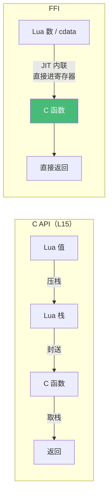

# 精通 LuaJIT FFI 与 C 数据

> 课程编号：L14
> 路线图来源：Lua 全场景深度课程 — FFI 与 C 互操作
> 难度：⭐⭐⭐⭐⭐
> 预计阅读时间：60 分钟
> 📅 内容基准：**LuaJIT 2.1**（FFI 是 LuaJIT 独有）

---

## 引言：不写一行 C 胶水代码，直接调 C 库

```lua
local ffi = require("ffi")

-- 1) 直接声明并调用 C 标准库函数
ffi.cdef[[
    int printf(const char *fmt, ...);
    double sqrt(double x);
]]
ffi.C.printf("Hello from C, sqrt(2)=%f\n", ffi.C.sqrt(2))

-- 2) 创建一个 C 结构体
ffi.cdef[[ typedef struct { double x, y; } point_t; ]]
local p = ffi.new("point_t", { 3, 4 })
print(p.x, p.y)

-- 3) 这个数组从几开始索引？
local arr = ffi.new("int[10]")
arr[0] = 42         -- 0 还是 1？
print(arr[0])
```

答案：① 直接打印 `Hello from C, sqrt(2)=1.414214`——**FFI 让你不写任何 C 胶水就调用 C 函数**；② `3  4`；③ **从 0 开始**——FFI 的 C 数组是**真正的 C 数组，0-based**（和 Lua 表的 1-based 完全不同，这是头号陷阱）。

FFI（Foreign Function Interface）是 LuaJIT 的**杀手锏**。它让你直接声明、调用 C 函数和操作 C 数据结构，**零胶水代码、零开销**（JIT 能把 FFI 调用内联成裸机器指令）。这是 OpenResty 高性能库（`lua-resty-core`）、加密、协议解析的底层基础，也是 LuaJIT 处理 64 位整数的正解。

> ⚠️ FFI 是 **LuaJIT 独有**。PUC-Lua 没有 FFI，要扩展 C 必须用 C API（L15）。

---

## 第一章：FFI 基础

### 1.1 `ffi.cdef`：声明 C 接口

```lua
local ffi = require("ffi")

ffi.cdef[[
    // 这里用标准 C 声明语法
    int abs(int n);
    size_t strlen(const char *s);
    typedef struct { int x; int y; } vec2;
]]
```

`ffi.cdef` 接受**C 声明语法**的字符串（函数原型、typedef、struct、union、enum）。它只是"告诉 LuaJIT 这些 C 符号长什么样"，不分配也不调用。

### 1.2 `ffi.C` 与 `ffi.load`

- **`ffi.C`**：默认命名空间，指向当前进程已加载的符号（标准库 libc、libm 等已在其中）。
- **`ffi.load(name)`**：加载额外的动态库。

```lua
ffi.cdef[[ int abs(int); ]]
print(ffi.C.abs(-5))             -- 5（abs 在 libc，已可用）

-- 加载第三方库
local zlib = ffi.load("z")       -- libz.so
ffi.cdef[[ unsigned long crc32(unsigned long crc, const char *buf, unsigned int len); ]]
print(zlib.crc32(0, "hello", 5))
```

---

## 第二章：cdata —— C 数据对象

FFI 创建的 C 数据是一种新类型：**cdata**（`type(x) == "cdata"`）。

### 2.1 `ffi.new`：分配

```lua
local i = ffi.new("int", 42)          -- 一个 int
local arr = ffi.new("int[10]")        -- 10 个 int 的数组（0-9）
local arr2 = ffi.new("int[?]", 100)   -- 变长数组（VLA），100 个 int
local arr3 = ffi.new("double[3]", {1.0, 2.0, 3.0})  -- 带初始化

-- 简写：用类型名直接当构造器
local point = ffi.typeof("struct { double x, y; }")
local p = point(3, 4)
```

### 2.2 C 数组是 0-based！

```lua
local a = ffi.new("int[5]")
for i = 0, 4 do a[i] = i * 10 end     -- 注意：0 到 4！
print(a[0], a[4])                      -- 0  40
-- a[5]  -- 越界！未定义行为（可能崩溃，不像 Lua 表返回 nil）
```

这是 FFI 最大的认知切换：**cdata 数组是真 C 数组，0-based，无边界检查**。越界是未定义行为（可能 segfault），不像 Lua 表那样安全返回 nil。

### 2.3 struct 与指针

```lua
ffi.cdef[[
    typedef struct { double x, y, z; } vec3;
]]
local v = ffi.new("vec3", {1, 2, 3})
print(v.x, v.y, v.z)        -- 1  2  3
v.x = 10                    -- 直接改字段

-- 指针
local p = ffi.new("vec3[1]")    -- 一个元素的数组，可当指针用
p[0].x = 5
local ptr = ffi.cast("vec3*", p)
print(ptr[0].x)             -- 5
```

### 2.4 `ffi.cast` / `ffi.sizeof` / `ffi.typeof`

```lua
print(ffi.sizeof("int"))        -- 4
print(ffi.sizeof("vec3"))       -- 24（3 个 double）
print(ffi.sizeof(v))            -- 24（也能对 cdata 实例）

local p = ffi.cast("char*", some_pointer)   -- 类型转换
local T = ffi.typeof("vec3")    -- 拿到类型构造器（比每次传字符串快）
local v2 = T(1, 2, 3)
```

`ffi.typeof` 预编译类型构造器，热路径里比反复传字符串给 `ffi.new` 快。

---

## 第三章：零开销——为什么 FFI 这么快

### 3.1 JIT 能内联 FFI 调用

普通 C API（L15）调用要经过 Lua 栈：压参数、调用、取返回——有固定开销。FFI 不同：**JIT 能把 FFI 调用直接编译成机器码的函数调用指令**，参数直接进寄存器，**零栈操作、零封送（marshalling）**。

```lua
-- 这个循环里的 sqrt 调用会被 JIT 内联成裸 CALL 指令
ffi.cdef[[ double sqrt(double); ]]
local sum = 0
for i = 1, 1000000 do sum = sum + ffi.C.sqrt(i) end   -- 接近纯 C 性能
```

### 3.2 直接内存访问

cdata 是真实内存，读写字段就是直接的 load/store 指令——没有哈希查找、没有元方法。这让 FFI struct 比 Lua 表快得多（也省内存）。



---

## 第四章：处理 64 位整数

这是 LuaJIT 用户的刚需——LuaJIT 没有原生整型（L13），但 FFI 提供精确的 64 位整数：

```lua
local ffi = require("ffi")

-- 64 位整数字面量：加 LL / ULL 后缀
local big = 9007199254740993LL        -- int64_t，精确！
print(big)                             -- 9007199254740993LL
print(tonumber(big))                   -- 转回 double 会丢精度，慎用

-- 雪花 ID 处理
local id = ffi.new("int64_t", 1234567890123456789LL)
print(tostring(id))

-- 64 位整数运算（在 int64 范围内精确，不退化为 double）
local a = 1000000000LL                 -- 10^9
local b = 1000000000LL                 -- 10^9
print(a * b)                           -- 1000000000000000000LL（10^18，精确）
-- ⚠️ 超出 int64 范围（约 9.22×10^18）会按模 2^64 回绕，而非报错：
print(1000000000000LL * 1000000000000LL)  -- 溢出回绕成 2003764205206896640LL（不是 10^24！）
```

`LL`（有符号）/`ULL`（无符号）后缀创建 64 位整数 cdata。这是 OpenResty 处理大整数 ID、时间戳纳秒、位掩码的标准做法（L16/L21）。

⚠️ 64 位 cdata 与 Lua number 混用要小心精度；作为表键时按 cdata 身份（不同于 number 键）。

---

## 第五章：内存管理与 metatype

### 5.1 `ffi.gc`：注册终结器

FFI 分配的内存由 LuaJIT GC 管理（`ffi.new` 的内存随 cdata 回收）。但调用 C 的 `malloc` 等手动分配的，要用 **`ffi.gc`** 注册释放回调：

```lua
ffi.cdef[[
    void *malloc(size_t size);
    void free(void *ptr);
]]
local buf = ffi.gc(ffi.C.malloc(1024), ffi.C.free)   -- buf 被 GC 时自动调 free
-- 用 buf...
-- 不用手动 free，GC 会调（但时机非确定，见 L12）
```

`ffi.gc(cdata, finalizer)` 是 FFI 版的 `__gc`（L12 提过 FFI 不用 `__gc`）。

### 5.2 `ffi.copy` / `ffi.fill` / `ffi.string`

```lua
local buf = ffi.new("char[10]")
ffi.copy(buf, "hello")              -- 拷贝字符串到 buf
ffi.fill(buf, 10, 0)                -- 用 0 填充 10 字节
local s = ffi.string(buf, 5)        -- cdata → Lua 字符串（指定长度）
print(ffi.string(buf))              -- 到 \0 为止
```

`ffi.string` 是 C 缓冲区转 Lua 字符串的桥梁（网络/文件 IO 常用）。

### 5.3 `ffi.metatype`：给 cdata 加方法

可以给一个 C 类型关联元表，让 cdata 像 Lua 对象一样有方法、运算符：

```lua
ffi.cdef[[ typedef struct { double x, y; } vec2_t; ]]
local vec2 = ffi.metatype("vec2_t", {
    __add = function(a, b) return vec2(a.x + b.x, a.y + b.y) end,
    __tostring = function(v) return ("(%g, %g)"):format(v.x, v.y) end,
    __index = {
        length = function(self) return math.sqrt(self.x^2 + self.y^2) end,
    },
})

local a = vec2(1, 2)
local b = vec2(3, 4)
print(a + b)              -- (4, 6)
print(a:length())        -- 2.236...
```

`ffi.metatype` 让你用 C struct 的速度 + Lua 对象的语法，是高性能数学库（向量、矩阵）的常用技法。

---

## 第六章：回调（C 调用 Lua）

可以把 Lua 函数当作 C 函数指针传给 C 库（如排序回调、事件钩子）：

```lua
ffi.cdef[[
    typedef int (*cmp_t)(const void *, const void *);
    void qsort(void *base, size_t n, size_t size, cmp_t cmp);
]]
local arr = ffi.new("int[5]", {3, 1, 4, 1, 5})
local cmp = ffi.cast("cmp_t", function(a, b)
    a = ffi.cast("int*", a); b = ffi.cast("int*", b)
    return a[0] - b[0]
end)
ffi.C.qsort(arr, 5, ffi.sizeof("int"), cmp)
```

⚠️ **回调有显著开销且会中断 JIT trace**（C→Lua 跨界），数量也有限制（LuaJIT 限制活跃回调数）。**热路径避免大量回调**；回调对象要保持引用防止被 GC。

---

## 第七章：常见陷阱清单

### ❌ 陷阱 1：cdata 数组当成 1-based

```lua
local a = ffi.new("int[3]")
a[1], a[2], a[3] = 1, 2, 3   -- ❌ a[3] 越界！C 数组是 0,1,2
```
修正：`a[0], a[1], a[2]`。

### ❌ 陷阱 2：越界访问无保护

```lua
local a = ffi.new("int[3]")
print(a[10])    -- 不是 nil！是未定义行为，可能崩溃或读垃圾
```
FFI 无边界检查，自己保证范围。

### ❌ 陷阱 3：64 位整数转 double 丢精度

```lua
local id = 9007199254740993LL
local n = tonumber(id)   -- 变 double，精度丢失
```
保持 cdata，或用 `tostring` 输出。

### ❌ 陷阱 4：忘记 C 字符串的 `\0`

```lua
local buf = ffi.new("char[5]")
ffi.copy(buf, "hello")   -- 5 字符 + \0 = 6 字节，但 buf 只有 5 → 溢出！
```
留出结尾 `\0` 空间：`char[6]`。

### ❌ 陷阱 5：回调对象被 GC

```lua
ffi.C.register(ffi.cast("cb_t", function() end))   -- 临时回调，可能被 GC → C 调用时崩溃
```
回调 cdata 要存在长生命周期变量里。

### ❌ 陷阱 6：在 PUC-Lua 用 FFI

```lua
local ffi = require("ffi")   -- PUC-Lua 报错：module 'ffi' not found
```
FFI 是 LuaJIT 独有；PUC-Lua 用 C API（L15）。

---

## 第八章：练习题

**练习 1**：输出？（注意索引）
```lua
local ffi = require("ffi")
local a = ffi.new("int[3]", {10, 20, 30})
print(a[0], a[2])
```

**练习 2**：声明并调用 C 的 `strlen`。

**练习 3**：为什么 FFI 调用比 C API 快？

**练习 4**：用 FFI 精确计算 `2^62 + 2^62`（在 LuaJIT 下）。

**练习 5**：判断真假——"FFI 在 PUC-Lua 和 LuaJIT 上都能用。"

---

## 参考答案与解析

**练习 1**：`10  30`。C 数组 0-based，`a[0]=10`、`a[2]=30`。

**练习 2**：
```lua
local ffi = require("ffi")
ffi.cdef[[ size_t strlen(const char *s); ]]
print(tonumber(ffi.C.strlen("hello")))   -- 5
```

**练习 3**：FFI 调用能被 JIT 内联成裸机器码调用，参数直接进寄存器，无 Lua 栈封送开销；C API 要经过压栈/取栈的固定开销。

**练习 4**：
```lua
local a = 2LL^62   -- 或 local a = ffi.new("int64_t", 1); a = a * ... 
-- 简单写：
print(4611686018427387904LL + 4611686018427387904LL)  -- 9223372036854775808 会溢出 int64...
-- 正确用 uint64：
print(4611686018427387904ULL + 4611686018427387904ULL) -- 9223372036854775808ULL
```
用 `LL`/`ULL` 后缀保证 64 位整数精度（注意有符号 int64 的上界）。

**练习 5**：**假**。FFI 是 LuaJIT 独有；PUC-Lua 无 FFI，用 C API（L15）。

---

## 小结

| 知识点 | 关键记忆 |
|---|---|
| 定位 | **LuaJIT 独有**；零胶水、零开销调 C、操作 C 数据 |
| cdef | C 声明语法；`ffi.C`（已加载符号）/`ffi.load`（额外库）|
| cdata | `ffi.new`/`typeof`/`cast`/`sizeof`；**数组 0-based、无边界检查** |
| 零开销 | JIT 内联 FFI 调用为裸指令；struct 直接内存访问 |
| 64 位整数 | `LL`/`ULL` 后缀；LuaJIT 处理大整数的正解 |
| 内存 | `ffi.gc`（终结器）/`copy`/`fill`/`string`（C↔Lua） |
| metatype | 给 C 类型加方法/运算符；高性能对象 |
| 回调 | C 调 Lua；**有开销、中断 trace、防 GC** |

---

## 📅 2026 现状/更新

- FFI 是 OpenResty `lua-resty-core` 把热点 API（`ngx.re`、共享字典等）重写为 FFI 实现的基础，**这是现代 OpenResty 性能的关键**（L17/L19）。
- 处理 64 位 ID/时间戳/位掩码时，FFI `int64_t`/`uint64_t` 是 LuaJIT 唯一精确手段（L16/L21）。
- FFI 绕过 Lua 安全边界（无边界检查、可访问任意内存），在**沙箱/不可信代码**场景要禁用（L23）。

---

> 🔁 下一篇 **L15 — 精通 Lua C API：嵌入宿主**：标准 Lua 与 C 互操作的"正统"方式。栈式 API、`lua_push`/`lua_to`、注册 C 函数、userdata、把 Lua 嵌入 C/C++ 程序。
>
> 反馈：FFI 极强但危险（无边界检查），把"C 数组 0-based"这条刻进肌肉记忆。
