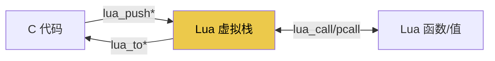
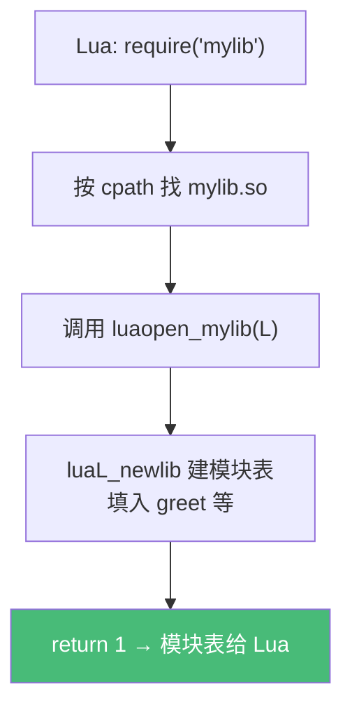

# 精通 Lua C API：嵌入宿主

> 课程编号：L15
> 路线图来源：Lua 全场景深度课程 — C 互操作（正统方式）
> 难度：⭐⭐⭐⭐⭐
> 预计阅读时间：60 分钟
> 📅 内容基准：**Lua 5.4.8** C API（与 5.1–5.3 略有差异处会标注）

---

## 引言：Lua 为何"生而为嵌入"

```c
// 把 Lua 嵌入 C 程序，只需几行：
#include <lua.h>
#include <lauxlib.h>
#include <lualib.h>

int main(void) {
    lua_State *L = luaL_newstate();   // 创建解释器
    luaL_openlibs(L);                 // 打开标准库
    luaL_dostring(L, "print('Hello from embedded Lua!')");
    lua_close(L);
    return 0;
}
```

```lua
-- 而在 Lua 这边，一个问题：
-- C 和 Lua 之间怎么传数据？答案是——一个虚拟栈。
```

L01 讲过 Lua 的设计核心是"可嵌入"，`lua_State` 就是一个解释器实例。**C API** 是宿主程序（游戏引擎、Nginx、Redis）与 Lua 双向通信的"正统"方式——通过一个**虚拟栈**传值。与 LuaJIT FFI（L14，Lua 调 C）不同，C API 是双向的，且是 **PUC-Lua 扩展/嵌入的唯一方式**。

这一章讲清栈式 API 的心智模型——它是理解 Redis 脚本宿主、游戏引擎绑定、`luaopen_*` 模块（L10）的底座。

---

## 第一章：核心模型——虚拟栈

### 1.1 一切通过栈

C 和 Lua 不能直接互访对方的数据结构（C 不懂 Lua 表，Lua 不懂 C 指针）。它们通过一个**虚拟栈（virtual stack）**交换值：

- C 想给 Lua 一个值 → **push** 到栈上。
- C 想读 Lua 的值 → 从栈上 **to** 出来。
- 调用 Lua 函数 → 函数和参数都在栈上，结果留在栈上。



### 1.2 栈索引

栈位置用索引表示：

- **正索引**：`1` 是栈底，`2`、`3`... 向上。
- **负索引**：`-1` 是栈顶，`-2` 是次顶...（**最常用**）。
- **伪索引（pseudo-index）**：如 `LUA_REGISTRYINDEX` 访问注册表（见第五章）。

```c
lua_pushnumber(L, 10);     // 栈: [10]
lua_pushstring(L, "hi");   // 栈: [10, "hi"]
// 此时 -1 是 "hi"，-2 是 10；1 是 10，2 是 "hi"
lua_pushvalue(L, -2);      // 复制 -2（10）到栈顶: [10, "hi", 10]
```

---

## 第二章：push 与 to —— 值的进出

### 2.1 push 系列（C → 栈）

```c
lua_pushnil(L);
lua_pushboolean(L, 1);
lua_pushinteger(L, 42);          // 5.3+ 整型
lua_pushnumber(L, 3.14);         // 浮点
lua_pushstring(L, "text");       // C 字符串（到 \0）
lua_pushlstring(L, buf, len);    // 带长度（可含 \0）
lua_pushcfunction(L, my_func);   // C 函数
lua_pushvalue(L, idx);           // 复制栈上某值到顶
```

### 2.2 to 系列（栈 → C）

```c
int isnum;
lua_Integer n = lua_tointeger(L, -1);
lua_Number  d = lua_tonumber(L, 1);
const char *s = lua_tostring(L, 2);        // 返回内部指针（注意生命周期！）
int b = lua_toboolean(L, -1);              // nil/false → 0，其它 → 1

// 更安全：带类型检查（失败抛 Lua 错误）
lua_Integer m = luaL_checkinteger(L, 1);   // 参数 1 不是整数 → 报错
const char *str = luaL_checkstring(L, 2);
lua_Number opt = luaL_optnumber(L, 3, 0.0);  // 可选参数，默认 0.0
```

⚠️ `lua_tostring` 返回的指针指向 Lua 内部内存——**值出栈后可能失效**。需要长期持有要拷贝。

### 2.3 类型检查

```c
if (lua_isnumber(L, 1)) { ... }
if (lua_istable(L, 2)) { ... }
int t = lua_type(L, -1);    // LUA_TNIL / LUA_TNUMBER / LUA_TSTRING / LUA_TTABLE ...
const char *tn = lua_typename(L, t);
```

---

## 第三章：注册 C 函数

### 3.1 `lua_CFunction` 协议

所有暴露给 Lua 的 C 函数遵循统一签名：**`int (*)(lua_State *L)`**——参数从栈上取，返回值压栈，**返回 int 表示压了几个返回值**。

```c
// Lua 调用 add(3, 4) 时：
static int l_add(lua_State *L) {
    lua_Number a = luaL_checknumber(L, 1);   // 第 1 个参数
    lua_Number b = luaL_checknumber(L, 2);   // 第 2 个参数
    lua_pushnumber(L, a + b);                 // 压结果
    return 1;                                  // 返回 1 个值
}

// 注册到全局
lua_pushcfunction(L, l_add);
lua_setglobal(L, "add");
// 现在 Lua 里可以 add(3, 4)
```

### 3.2 多返回值

```c
static int l_minmax(lua_State *L) {
    // ... 计算 lo, hi
    lua_pushnumber(L, lo);
    lua_pushnumber(L, hi);
    return 2;   // 返回 2 个值 → Lua 端 local a, b = minmax(...)
}
```

### 3.3 C closure（带 upvalue 的 C 函数）

C 函数也能有 upvalue（类似 Lua 闭包，L07）：

```c
// 注册时绑定 upvalue
lua_pushnumber(L, 100);              // upvalue
lua_pushcclosure(L, l_counter, 1);   // 绑 1 个 upvalue
lua_setglobal(L, "counter");

// 函数内通过伪索引访问 upvalue
static int l_counter(lua_State *L) {
    lua_Number base = lua_tonumber(L, lua_upvalueindex(1));  // 取 upvalue 1
    lua_pushnumber(L, base + 1);
    return 1;
}
```

---

## 第四章：C 调用 Lua 函数

### 4.1 `lua_call` / `lua_pcall`

要从 C 调用一个 Lua 函数：把函数压栈、压参数、`lua_pcall`：

```c
// 调用 Lua 的 string.format("%d-%d", 1, 2)
lua_getglobal(L, "string");           // 栈: [string]
lua_getfield(L, -1, "format");        // 栈: [string, format]
lua_pushstring(L, "%d-%d");           // 栈: [string, format, "%d-%d"]
lua_pushinteger(L, 1);
lua_pushinteger(L, 2);                // 栈: [string, format, fmt, 1, 2]

// pcall(函数, 参数个数=3, 期望返回数=1, 错误处理器=0)
if (lua_pcall(L, 3, 1, 0) != LUA_OK) {
    const char *err = lua_tostring(L, -1);   // 出错：栈顶是错误信息
    fprintf(stderr, "error: %s\n", err);
    lua_pop(L, 1);
} else {
    const char *result = lua_tostring(L, -1); // 成功：栈顶是返回值 "1-2"
    lua_pop(L, 1);
}
```

**`lua_call` vs `lua_pcall`**：`lua_call` 出错会直接 longjmp（崩溃宿主）；**`lua_pcall` 保护调用，返回错误码**——嵌入时几乎总用 `lua_pcall`（类似 Lua 层的 pcall，L09）。

### 4.2 栈平衡

C API 编程的核心纪律：**时刻清楚栈上有什么、保持平衡**。每次操作后栈的状态都要心里有数，用 `lua_gettop(L)` 查栈高，`lua_pop(L, n)` 清理。栈失衡是 C API bug 的头号来源。

---

## 第五章：userdata 与注册表

### 5.1 userdata —— 把 C 对象给 Lua

**userdata** 是"C 分配、Lua 持有"的数据块，用于把 C 结构体/对象暴露给 Lua：

- **full userdata**：Lua 管理的内存块，可有元表、可被 `__gc`（L12）。
- **light userdata**：裸 C 指针，无元表、不被 GC（仅作句柄）。

```c
// 创建 full userdata 包装一个 C 结构
typedef struct { int fd; } File;

static int l_open(lua_State *L) {
    File *f = (File *)lua_newuserdatauv(L, sizeof(File), 0);  // 分配 userdata
    f->fd = real_open(luaL_checkstring(L, 1));
    luaL_setmetatable(L, "File");   // 绑定元表（提供方法 + __gc）
    return 1;
}

// __gc 释放资源
static int l_file_gc(lua_State *L) {
    File *f = (File *)luaL_checkudata(L, 1, "File");
    if (f->fd >= 0) real_close(f->fd);
    return 0;
}
```

给 userdata 关联元表（含 `__index` 指向方法表 + `__gc` 终结器），就能让 Lua 端 `file:read()`、自动释放——这是把 C 对象做成 Lua 对象的标准模式（L11 的 C 版）。

### 5.2 注册表（registry）

C 代码需要"跨调用保存 Lua 值"（如回调函数、配置表）时，用**注册表**——一个只有 C 能访问的全局表，用伪索引 `LUA_REGISTRYINDEX`：

```c
// 保存一个 Lua 值，拿到引用
lua_pushvalue(L, idx);                       // 复制要保存的值到顶
int ref = luaL_ref(L, LUA_REGISTRYINDEX);    // 存入注册表，返回整数引用

// 之后取回
lua_rawgeti(L, LUA_REGISTRYINDEX, ref);      // 把它压栈

// 不用了释放
luaL_unref(L, LUA_REGISTRYINDEX, ref);
```

`luaL_ref`/`luaL_unref` 是 C 持有 Lua 对象（防被 GC）的标准手段。

---

## 第六章：写一个 C 模块

把前面拼起来——一个可被 `require` 的 C 模块（L10）：

```c
#include <lua.h>
#include <lauxlib.h>

static int l_greet(lua_State *L) {
    const char *name = luaL_checkstring(L, 1);
    lua_pushfstring(L, "Hello, %s!", name);
    return 1;
}

// 函数表
static const luaL_Reg mylib[] = {
    {"greet", l_greet},
    {NULL, NULL}   // 哨兵
};

// 入口：require("mylib") 调用它
int luaopen_mylib(lua_State *L) {
    luaL_newlib(L, mylib);   // 创建并填充模块表
    return 1;                 // 返回模块表
}
```

编译成 `mylib.so` 放到 `package.cpath`，Lua 端 `require("mylib").greet("World")` 即可（L10 第四章）。



---

## 第七章：常见陷阱清单

### ❌ 陷阱 1：栈不平衡

```c
lua_pushnumber(L, 1);   // 压了没清理
// 函数返回 0，但栈上多了个值 → 累积泄漏/错乱
```
始终明确每个 C 函数对栈的净影响，返回值个数要准。

### ❌ 陷阱 2：用 `lua_call` 不保护

```c
lua_call(L, 1, 0);   // Lua 出错 → longjmp，可能崩溃宿主
```
嵌入用 `lua_pcall`。

### ❌ 陷阱 3：持有 `lua_tostring` 的指针

```c
const char *s = lua_tostring(L, -1);
lua_pop(L, 1);          // 值出栈，s 可能失效！
use(s);                  // 悬空指针
```
需要长期用要 `strdup` 拷贝，或保持值在栈上。

### ❌ 陷阱 4：light userdata 当对象用

```c
lua_pushlightuserdata(L, ptr);   // 无元表、不 GC，只是句柄
```
要方法和 `__gc` 用 full userdata。

### ❌ 陷阱 5：C 持有 Lua 值不防 GC

```c
// 把 Lua 回调存进 C 结构但没 luaL_ref → 可能被 GC 回收
```
用 `luaL_ref` 存注册表。

### ❌ 陷阱 6：版本 API 差异

```c
// 5.1 是 lua_open；5.2+ 是 luaL_newstate
// 5.3 加了 lua_pushinteger 的整型语义；userdata 创建 API 在 5.4 变 lua_newuserdatauv
```
跨版本嵌入注意 API 变更。

---

## 第八章：练习题

**练习 1**：一个 C 函数返回 `return 2;` 意味着什么？

**练习 2**：写一个 C 函数 `l_max`，接受两个数，返回较大者。

**练习 3**：`lua_pcall(L, 2, 1, 0)` 的三个数字各是什么含义？

**练习 4**：为什么嵌入 Lua 时几乎总用 `lua_pcall` 而非 `lua_call`？

**练习 5**：判断真假——"light userdata 会被 Lua GC 自动释放。"

---

## 参考答案与解析

**练习 1**：表示这个 C 函数向 Lua 返回了 **2 个值**（栈顶的 2 个）。Lua 端可 `local a, b = thefunc()`。

**练习 2**：
```c
static int l_max(lua_State *L) {
    lua_Number a = luaL_checknumber(L, 1);
    lua_Number b = luaL_checknumber(L, 2);
    lua_pushnumber(L, a > b ? a : b);
    return 1;
}
```

**练习 3**：`lua_pcall(L, nargs=2, nresults=1, msgh=0)`：调用栈上的函数，传 2 个参数，期望 1 个返回值，无消息处理器（0）。

**练习 4**：`lua_call` 在 Lua 出错时直接 longjmp（向上跳），若没有保护边界会终止/崩溃宿主程序；`lua_pcall` 捕获错误返回错误码，宿主能优雅处理——嵌入式场景必须稳健，故用 pcall。

**练习 5**：**假**。light userdata 只是裸指针，无元表、不被 GC 管理（不会自动释放）；要 `__gc` 自动释放用 full userdata。

---

## 小结

| 知识点 | 关键记忆 |
|---|---|
| 模型 | C↔Lua 通过**虚拟栈**；`lua_State` 是解释器实例 |
| 索引 | 正(栈底起)/负(-1 栈顶)/伪索引；负索引最常用 |
| push/to | `lua_push*` 进栈、`lua_to*`/`luaL_check*` 出栈（check 带校验） |
| C 函数 | 签名 `int f(lua_State*)`；返回值 = 压栈个数；C closure 带 upvalue |
| 调用 Lua | 压函数+参数 → **`lua_pcall`**（保护）；保持栈平衡 |
| userdata | full（有元表/`__gc`，包 C 对象）/ light（裸指针句柄） |
| 注册表 | `luaL_ref`/`unref` 让 C 持有 Lua 值防 GC |
| C 模块 | `luaL_newlib` + `luaopen_<name>` 返回模块表 |

---

## 📅 2026 现状/更新

- C API 是 **Redis 嵌入 Lua（脚本宿主）、众多游戏引擎、Neovim** 绑定 C 与 Lua 的底层机制（L21/L23/L22）。
- 5.4 的 userdata API 增加了 user value（`lua_newuserdatauv` 的 `nuvalue` 参数）；跨 5.1→5.4 嵌入注意 API 演进。
- **C API vs FFI（L14）**：FFI 是 LuaJIT 专属、Lua 调 C 的零开销捷径；C API 是 PUC-Lua 双向互操作的正统、可移植方式。嵌入宿主（让 C 程序跑 Lua）必须用 C API。

---

> 🔁 下一篇 **L16 — 精通 Lua 标准库全景**：系统梳理 `string`/`table`/`math`/`os`/`io`/`utf8` 等标准库的实用要点与版本差异，补全前面分散讲到的库知识，并讲 `string.pack` 二进制处理与 UTF-8。
>
> 反馈：C API 的核心是"栈"心智模型——画出每步操作后栈的样子，bug 会少一半。
