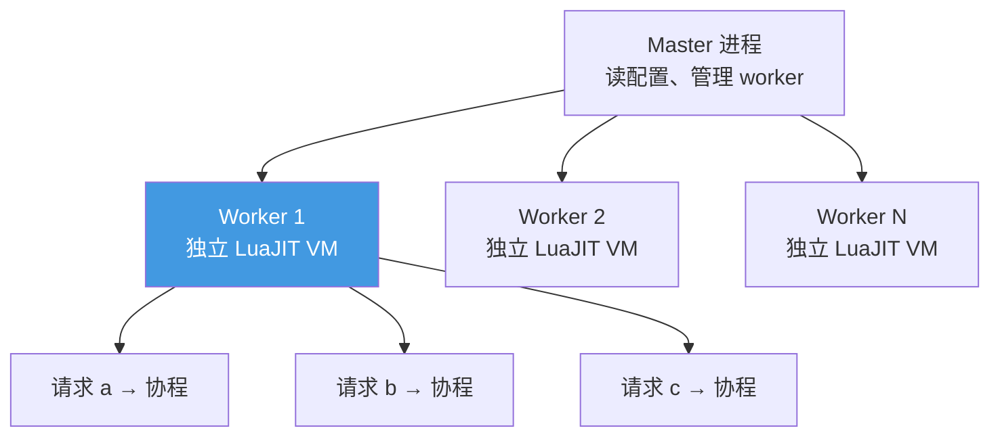
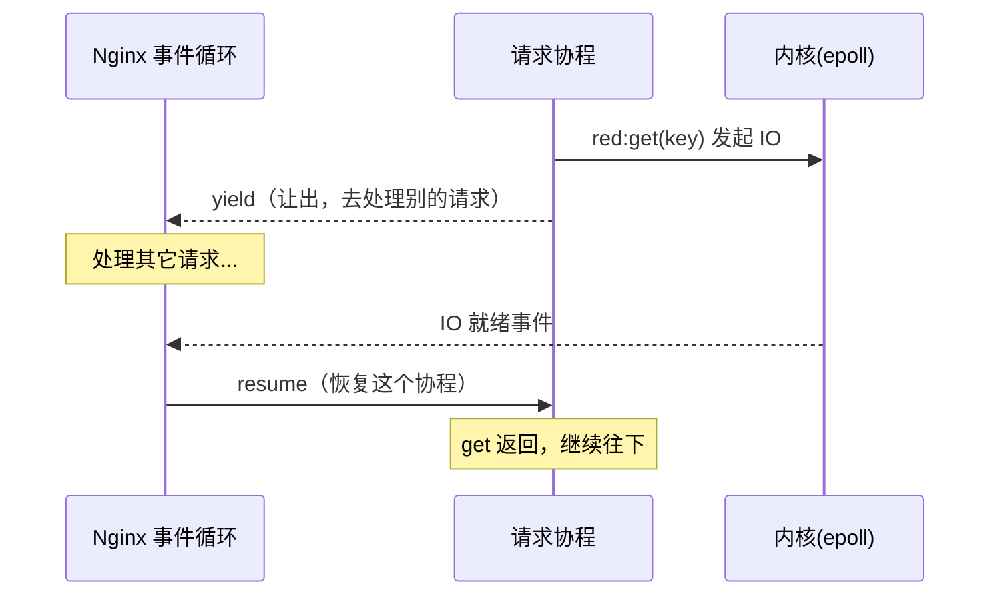
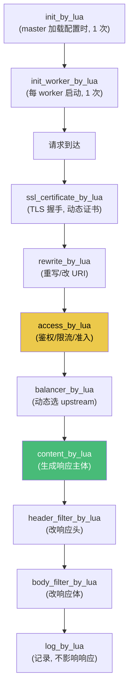

# 精通 OpenResty 架构与 ngx_lua 生命周期

> 课程编号：L17
> 路线图来源：Lua 全场景深度课程 — OpenResty 应用篇
> 难度：⭐⭐⭐⭐
> 预计阅读时间：60 分钟
> 📅 内容基准：**OpenResty 1.27.x** + **LuaJIT 2.1**（≈ Lua 5.1）

---

## 引言：用 Lua 写出 C 级性能的网关

```nginx
# 一个完整的"Hello World" API（nginx.conf 片段）
server {
    listen 8080;
    location /hello {
        content_by_lua_block {
            ngx.say("Hello, ", ngx.var.arg_name or "World")
        }
    }
}
```

```lua
-- 几个必须先想清楚的问题：
-- 1) 这段 Lua 在哪个进程、哪个 VM、哪个"线程"里跑？
-- 2) 一个请求来了，会经过哪些"阶段"？
-- 3) 为什么这里写阻塞式的代码却能扛十万并发？
```

OpenResty 把 **Nginx 的事件驱动架构**和 **LuaJIT 的高性能**焊在一起，让你用同步风格的 Lua 写出能扛超高并发的网关、API、Web 应用。但要用好它，必须理解它的进程模型、请求生命周期的 11 个阶段、以及"每请求一协程"的非阻塞秘密。这一章是 L18–L20（cosocket、共享内存、网关实战）的总纲。

> 提醒：OpenResty 用的是 **LuaJIT（≈ Lua 5.1）**，所以前面所有"LuaJIT vs PUC-Lua"的差异（无原生整型、无 `<close>`、`pairs` 是 NYI……）在这里全部适用。

---

## 第一章：OpenResty 是什么

### 1.1 组成

OpenResty **不是 Web 框架**，而是一个**打包发行版**：

- **Nginx**（核心，事件驱动 HTTP 服务器）
- **LuaJIT**（嵌入的脚本引擎）
- **lua-nginx-module**（`ngx_http_lua_module`，把 Lua 嵌进 Nginx 各阶段）
- **lua-resty-*** 系列库（redis、mysql、http、jwt、limit 等）
- **lua-resty-core**（用 FFI 重写的核心 API，L14）

它把 Lua **嵌进 Nginx 的请求处理流程**，让你在不写 C 模块的情况下扩展 Nginx。

### 1.2 进程模型



关键事实（务必记牢）：

- **多 worker 进程**：通常等于 CPU 核数（`worker_processes auto`）。这是 OpenResty 利用多核的方式（协程不并行，L08）。
- **每个 worker 一个独立的 LuaJIT VM**：worker 之间**不共享 Lua 内存**（要共享数据用 shared dict，L19）。
- **每个请求一个轻量协程**：worker 在单线程事件循环里，用协程并发处理成千上万请求。

---

## 第二章：每请求一协程的非阻塞模型

### 2.1 同步写法，异步性能

最反直觉也最强大的一点：你写**看起来阻塞**的代码，却获得**非阻塞**性能。

```lua
-- 看起来这会阻塞，其实不会
local redis = require("resty.redis")
local red = redis:new()
red:connect("127.0.0.1", 6379)   -- "阻塞"等连接……
local val = red:get("key")        -- "阻塞"等响应……
ngx.say(val)
```

秘密：每个请求跑在一个**协程**里。当它执行 `connect`/`get` 这种 IO 操作时，cosocket（L18）会让协程 **`yield`**（L08）——把 CPU 让给同 worker 的其它请求；等 IO 就绪（epoll 通知），Nginx 事件循环再 **`resume`** 这个协程。



**所以**：你用同步代码的简洁，拿到异步事件驱动的吞吐。这是 OpenResty 的核心魔法。

### 2.2 绝不能用阻塞调用

代价是：**绝对不能在 OpenResty 里用真正阻塞的操作**——它会卡住整个 worker（连同它正在处理的所有请求）！

```lua
-- ❌ 致命：这些真阻塞，卡死整个 worker
os.execute("sleep 1")          -- 阻塞系统调用
local f = io.open("/path")     -- 阻塞磁盘 IO（标准 io 库）
-- 用标准 socket 库做网络            -- 阻塞

-- ✅ 用 OpenResty 的非阻塞替代
ngx.sleep(1)                   -- 非阻塞 sleep（yield）
-- cosocket / lua-resty-* 做 IO（L18）
```

这是 OpenResty 编程的第一铁律：**所有 IO 必须走 cosocket / ngx API，不用任何阻塞调用**。

---

## 第三章：请求生命周期的 11 个阶段

Nginx 把请求处理分成多个阶段，OpenResty 给每个关键阶段提供 `*_by_lua*` 指令，让你在恰当的时机注入 Lua。



### 3.1 各阶段用途

| 指令 | 时机 / 用途 |
|---|---|
| `init_by_lua` | master 加载配置时执行 1 次。**预加载模块、初始化只读全局数据**（如规则表） |
| `init_worker_by_lua` | 每个 worker 启动时 1 次。**启动定时器（`ngx.timer`）、worker 级初始化** |
| `ssl_certificate_by_lua` | TLS 握手期。**动态选证书**（SNI、ACME） |
| `set_by_lua` | 给 nginx 变量赋值（轻量、同步，慎用 IO） |
| `rewrite_by_lua` | 早期。改 URI、重定向 |
| `access_by_lua` | 准入控制。**鉴权、限流、IP 黑白名单、WAF**（L20） |
| `balancer_by_lua` | 选后端。**动态 upstream、灰度、重试**（L20） |
| `content_by_lua` | **生成响应主体**（主战场） |
| `header_filter_by_lua` | 改响应头（加安全头、CORS） |
| `body_filter_by_lua` | 改/过滤响应体（流式，可多次调用） |
| `log_by_lua` | 请求结束记录。**埋点、统计、日志**（不能改响应） |

### 3.2 各阶段能做什么有限制

- `init_by_lua` 在 master，**不能做网络 IO**（cosocket 不可用），只能加载代码、建静态数据。
- `set_by_lua`/`header_filter_by_lua` **不能 yield**（不能用 cosocket/sleep）——它们在不能让出的上下文。
- `content_by_lua`/`access_by_lua`/`rewrite_by_lua` **可以**用 cosocket（能 yield）。
- `log_by_lua` 也能做 cosocket，但要快（别拖慢日志阶段）。

记住"哪个阶段能 yield"决定了你能在哪做 IO。

---

## 第四章：`ngx.*` 核心 API

### 4.1 输出与请求

```lua
ngx.say("text")              -- 输出 + 换行
ngx.print("text")            -- 输出不换行
ngx.var.arg_name             -- 查询参数 ?name=
ngx.var.host                 -- nginx 变量
ngx.req.get_headers()        -- 请求头表
ngx.req.get_uri_args()       -- URL 参数表
ngx.req.read_body()          -- 读请求体（先调用）
ngx.req.get_body_data()      -- 取请求体
ngx.req.get_method()         -- GET/POST...
```

### 4.2 响应控制

```lua
ngx.status = 404                       -- 设状态码
ngx.header["Content-Type"] = "application/json"  -- 设响应头
ngx.exit(ngx.HTTP_FORBIDDEN)           -- 提前结束（403）
ngx.redirect("/login")                 -- 重定向
ngx.exec("/internal")                  -- 内部跳转（不发给客户端）
```

### 4.3 日志与时间

```lua
ngx.log(ngx.ERR, "出错了: ", err)       -- 写错误日志（ERR/WARN/INFO/DEBUG）
ngx.now()                              -- 当前时间（秒，浮点，带毫秒，缓存值）
ngx.update_time()                      -- 刷新缓存的时间
ngx.sleep(0.5)                         -- 非阻塞 sleep（yield）
```

### 4.4 `ngx.ctx`：请求级上下文

```lua
-- ngx.ctx 是"当前请求私有"的表，跨阶段共享数据
ngx.ctx.user_id = 123        -- 在 access 阶段设
-- 在 content 阶段读
local uid = ngx.ctx.user_id
```

⚠️ `ngx.ctx` 是**每请求独立**的（不会跨请求泄漏），但它有创建开销，且**不跨内部跳转/子请求自动传递**。是跨阶段传数据的标准位置。

---

## 第五章：全局变量的致命陷阱

### 5.1 worker 长驻 + 模块缓存 = 跨请求泄漏

OpenResty 的 worker 是**长驻进程**，模块 `require` 一次后缓存（L10）。如果你不小心用了**全局变量**或往模块表写**请求相关数据**，它会在**所有请求间共享**——造成数据串台、安全漏洞：

```lua
-- ❌ 灾难：全局变量在请求间共享！
-- some_module.lua
local _M = {}
current_user = nil           -- ❌ 全局！请求 A 设的值，请求 B 能看到

function _M.handle()
    current_user = get_user()   -- 请求间互相覆盖，数据串台
end
```

```lua
-- ✅ 用 local + ngx.ctx
local _M = {}
function _M.handle()
    ngx.ctx.current_user = get_user()   -- 请求私有
end
```

**铁律**（强化版的 L02 全局污染）：
- **所有变量加 `local`**。
- **请求相关状态放 `ngx.ctx`**，绝不放全局或模块表。
- 模块表/全局只放**只读的、worker 级共享**的数据（配置、规则）。
- 用 `lua_code_cache on`（生产必开）+ luacheck 防御。

### 5.2 `lua_code_cache`

```nginx
lua_code_cache on;    # 生产：缓存编译的 Lua（必须 on）
# lua_code_cache off; # 开发：每次重载代码（方便调试，但慢且不安全）
```

---

## 第六章：定时器与后台任务

```lua
-- init_worker_by_lua 里启动周期任务
local function sync_config(premature)
    if premature then return end   -- worker 退出时 premature=true
    -- 拉取配置...（可用 cosocket）
end

-- 每个 worker 启动时
init_worker_by_lua_block {
    local ok, err = ngx.timer.every(60, sync_config)   -- 每 60 秒
    if not ok then ngx.log(ngx.ERR, "timer failed: ", err) end
}
```

`ngx.timer.at`（一次）/`ngx.timer.every`（周期）创建**脱离请求**的后台协程，可做配置同步、健康检查、缓存预热。注意每个 worker 都会跑（用 shared dict 选主避免重复，L19）。

---

## 第七章：常见陷阱清单

### ❌ 陷阱 1：用阻塞调用卡死 worker

```lua
os.execute("curl ...")   -- 阻塞，卡死整个 worker
```
用 cosocket / `resty.http`。

### ❌ 陷阱 2：全局变量跨请求泄漏

```lua
user = ngx.var.user   -- 全局！串台
```
用 `local` + `ngx.ctx`。

### ❌ 陷阱 3：在不能 yield 的阶段做 IO

```lua
set_by_lua_block $x { local r = redis_get() }   -- ❌ set 阶段不能 cosocket
```
IO 放到 access/content 阶段。

### ❌ 陷阱 4：`init_by_lua` 里做网络

```lua
init_by_lua_block { http_get("...") }   -- ❌ master 阶段无 cosocket
```
网络初始化放 `init_worker_by_lua`（用 timer）。

### ❌ 陷阱 5：忘开 `lua_code_cache`

```nginx
lua_code_cache off;   # 生产环境 → 性能暴跌且行为异常
```

### ❌ 陷阱 6：以为有 PUC-Lua 5.3+ 特性

```lua
local n = 7 // 2        -- LuaJIT 下是 double
local f <close> = ...   -- ❌ LuaJIT 无 <close>
```

---

## 第八章：练习题

**练习 1**：OpenResty 一个 worker 里同时处理 1000 个请求，有几个 LuaJIT VM？几个协程？

**练习 2**：为什么 `os.execute("sleep 1")` 在 OpenResty 里是灾难？

**练习 3**：把用户 ID 从 `access` 阶段传到 `content` 阶段，该放哪？

**练习 4**：哪个阶段适合做"鉴权 + 限流"？哪个适合"埋点统计"？

**练习 5**：找 bug：
```lua
-- mymod.lua
local _M = {}
count = 0
function _M.incr() count = count + 1; return count end
return _M
```

---

## 参考答案与解析

**练习 1**：**1 个 LuaJIT VM**（每 worker 一个），**约 1000 个轻量协程**（每请求一个）。协程不并行，靠事件循环 + cosocket yield/resume 并发。

**练习 2**：`sleep` 是阻塞系统调用，会卡住整个 worker 的事件循环——这个 worker 正在处理的**所有其它请求**都被冻结 1 秒。用非阻塞的 `ngx.sleep(1)`。

**练习 3**：放 `ngx.ctx`（`ngx.ctx.user_id = ...`），它是请求私有、跨阶段共享的。

**练习 4**：鉴权+限流放 `access_by_lua`（准入阶段，可拒绝请求）；埋点统计放 `log_by_lua`（请求结束、不影响响应）。

**练习 5**：`count` 是全局变量！在长驻 worker 里被所有请求共享，且污染全局环境。修正：`local count = 0`（模块级，worker 内共享但至少不污染全局；若要请求私有则用 ngx.ctx）。

---

## 小结

| 知识点 | 关键记忆 |
|---|---|
| 组成 | Nginx + LuaJIT + lua-nginx-module + lua-resty + lua-resty-core(FFI) |
| 进程 | 多 worker，**每 worker 一 VM 不共享**；每请求一协程 |
| 非阻塞 | 同步写法 + cosocket yield/resume = 异步性能；**禁一切阻塞调用** |
| 11 阶段 | init/init_worker/ssl/set/rewrite/**access**/balancer/**content**/header_filter/body_filter/log |
| 能否 yield | content/access/rewrite 可；set/header_filter/init 不可 |
| ngx API | say/print/var/req/header/status/exit/log/sleep/ctx |
| ngx.ctx | 请求私有、跨阶段共享 |
| 全局陷阱 | worker 长驻 + 模块缓存 → 全局变量跨请求泄漏；**local + ngx.ctx** |

---

## 📅 2026 现状/更新

- **OpenResty 1.27.x** 为当前主线（基于较新 Nginx core）；`lua-resty-core` 持续用 FFI 优化核心 API。
- 云原生网关 **Apache APISIX**（基于 OpenResty）是 2026 主流选择之一，把本章机制封装成插件体系（L20）。
- "每请求一协程 + cosocket"模型让 OpenResty 在 API 网关、WAF、边缘计算场景保持极高性价比；理解阶段模型与全局陷阱是上手的两道门槛。

---

> 🔁 下一篇 **L18 — 精通 OpenResty cosocket 与非阻塞 IO**：深入非阻塞的核心 cosocket——`ngx.socket.tcp`、连接池 `setkeepalive`、DNS 解析、`ngx.thread` 轻线程并发，看清"同步写法异步执行"的底层。
>
> 反馈：把"每 worker 一 VM、每请求一协程、禁阻塞调用"这三句话背下来，它们是 OpenResty 一切问题的判断起点。
