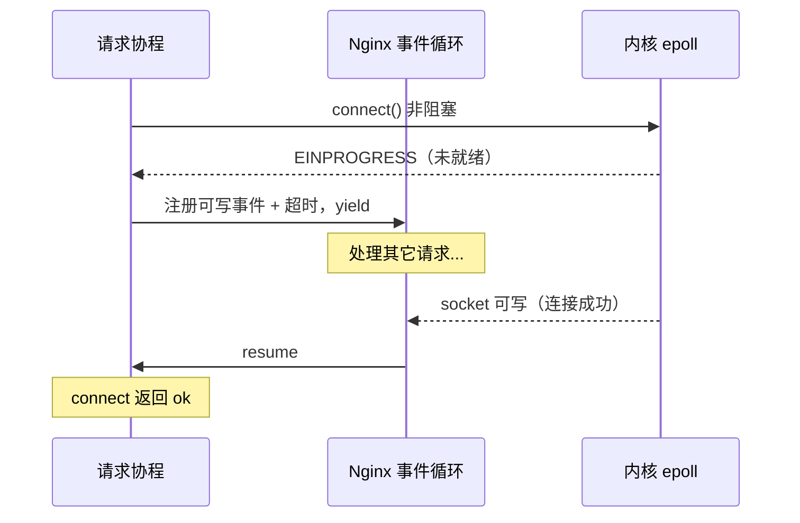

# 精通 OpenResty cosocket 与非阻塞 IO

> 课程编号：L18
> 路线图来源：Lua 全场景深度课程 — OpenResty 非阻塞 IO
> 难度：⭐⭐⭐⭐⭐
> 预计阅读时间：55 分钟
> 📅 内容基准：**OpenResty 1.27.x** + **LuaJIT 2.1**

---

## 引言：阻塞代码为何不阻塞

```lua
-- 这段代码看起来会阻塞三次，实际一次都不"卡"
local sock = ngx.socket.tcp()
sock:settimeout(1000)
local ok, err = sock:connect("example.com", 80)   -- "等"连接
sock:send("GET / HTTP/1.0\r\nHost: example.com\r\n\r\n")  -- "等"发送
local line = sock:receive("*l")                    -- "等"响应
ngx.say(line)

-- 问题：
-- 1) connect/send/receive 各自"等待"时，worker 在干什么？
-- 2) 连接用完了直接 close 吗？还是有更好的做法？
-- 3) 怎么同时向 3 个后端发请求？
```

答案预览：① worker 没有空等——协程 `yield` 出去处理别的请求，IO 就绪后再 `resume`（L17）；② 高频连接应 `setkeepalive` 放回**连接池**复用，而非 close；③ 用 `ngx.thread.spawn` 起多个轻线程并发。

cosocket（cooperative socket，协作式套接字）是 OpenResty 非阻塞 IO 的核心抽象。它让你用同步 API 写网络代码，底层自动 yield/resume。所有 `lua-resty-*` 库（redis、mysql、http）都建立在它之上。这一章深入 cosocket、连接池、DNS、并发——是写高性能上游交互（L19/L20）的基础。

---

## 第一章：cosocket 工作原理

### 1.1 同步 API，事件驱动底层

cosocket 的每个"阻塞"方法（`connect`/`send`/`receive`）实际做的是：

1. 发起非阻塞系统调用（如 `connect`）。
2. 如果会阻塞（连接未就绪），向 Nginx 事件循环**注册关注的事件**（可读/可写）+ 一个超时定时器。
3. 协程 **`yield`**（L08），把 CPU 交还事件循环。
4. 事件循环处理其它请求；当该 socket 就绪（epoll 通知）或超时，**`resume`** 这个协程。
5. 方法从 yield 处继续，返回结果。



**所以**：你的 Lua 代码逻辑是线性的（易读易写），但 worker 在 IO 等待期间满负荷处理其它请求——这就是 OpenResty 高并发的来源。

### 1.2 创建与基本操作

```lua
local sock = ngx.socket.tcp()      -- 创建 TCP cosocket
sock:settimeout(2000)              -- 超时 2000ms（connect/send/receive 共用）
-- 或分别设：sock:settimeouts(connect_to, send_to, read_to)

local ok, err = sock:connect("127.0.0.1", 6379)
if not ok then
    ngx.log(ngx.ERR, "connect failed: ", err)
    return
end

local bytes, err = sock:send("PING\r\n")
local data, err, partial = sock:receive("*l")   -- 读一行
-- receive 模式：*l(一行,默认) / *a(到关闭) / 数字n(n字节)
```

### 1.3 UDP cosocket

```lua
local udp = ngx.socket.udp()
udp:setpeername("127.0.0.1", 53)
udp:send(query)
local data = udp:receive()
```

---

## 第二章：连接池——性能关键

### 2.1 `setkeepalive` 复用连接

每次 `connect` 都做 TCP 握手（+ 可能 TLS）开销大。高频访问同一上游（Redis、MySQL、上游服务）时，应把连接**放回连接池**复用，而非 `close`：

```lua
local ok, err = sock:connect("127.0.0.1", 6379)
-- ... 使用 sock ...

-- ❌ 用完直接关：下次又要重新握手
-- sock:close()

-- ✅ 放回池子，下次 connect 直接复用
local ok, err = sock:setkeepalive(60000, 100)
-- 参数：max_idle_timeout(ms)，pool_size(每 worker 池容量)
```

`setkeepalive(idle_timeout, pool_size)`：连接空闲超过 `idle_timeout` 才真正关闭；每 worker 池最多保 `pool_size` 个连接。之后 `connect` 到**相同 host:port**会优先从池里取。

### 2.2 连接池的隐患

⚠️ **放回池前必须确保连接状态干净**——如果连接上还有未读完的响应、或处于事务中间状态，复用会导致**数据串台**（下个请求读到上个请求的残留）：

```lua
-- 必须把响应完全读完，连接才能安全复用
local res = red:get("key")     -- 读完整个响应
red:set_keepalive(60000, 100)  -- resty.redis 封装的 setkeepalive

-- 如果出错或状态不确定，应 close 而非 keepalive
if err then red:close() end
```

`lua-resty-redis`/`mysql` 等库封装了 `set_keepalive`，但你要保证调用前连接干净。

### 2.3 连接池粒度

连接池按 `host:port`（或自定义 pool name）区分。可用 `connect(host, port, { pool = "name" })` 自定义池，隔离不同用途的连接（如不同 DB、不同认证）。

---

## 第三章：DNS 解析

### 3.1 cosocket 的 DNS 限制

`sock:connect("example.com", 80)` 用域名时，OpenResty 会用 **nginx 的 resolver**（需配 `resolver` 指令）做非阻塞 DNS：

```nginx
resolver 8.8.8.8 valid=30s;   # 必须配置，否则域名解析失败
```

⚠️ 没配 `resolver` 时，cosocket 连域名会报错（不像系统会查 /etc/hosts）。生产必配。

### 3.2 `lua-resty-dns`：精细控制

需要自己控制 DNS（轮询、SRV 记录、缓存）用 `resty.dns.resolver`：

```lua
local resolver = require("resty.dns.resolver")
local r = resolver:new({ nameservers = {"8.8.8.8"}, timeout = 2000 })
local answers = r:query("example.com", { qtype = r.TYPE_A })
for _, ans in ipairs(answers or {}) do
    ngx.say(ans.address)
end
```

DNS 解析结果应缓存（shared dict / lrucache，L19），避免每请求都查。

---

## 第四章：并发——`ngx.thread`

### 4.1 轻线程（light thread）

一个请求里要同时访问多个后端（如聚合 3 个微服务），串行做太慢。`ngx.thread.spawn` 起多个**轻线程**（也是协程），并发执行、再 `ngx.thread.wait` 汇合：

```lua
local function fetch(host)
    local httpc = require("resty.http").new()
    local res = httpc:request_uri("http://" .. host .. "/api")
    return res and res.body
end

-- 并发起三个
local t1 = ngx.thread.spawn(fetch, "service-a")
local t2 = ngx.thread.spawn(fetch, "service-b")
local t3 = ngx.thread.spawn(fetch, "service-c")

-- 等待汇合
local ok1, body1 = ngx.thread.wait(t1)
local ok2, body2 = ngx.thread.wait(t2)
local ok3, body3 = ngx.thread.wait(t3)

ngx.say(body1, body2, body3)
```

三个请求的 IO 等待**重叠**进行，总耗时 ≈ 最慢的一个（而非三者之和）。这是"扇出（fan-out）"聚合的标准写法。

### 4.2 "谁先回来用谁"

```lua
-- ngx.thread.wait 可等多个，返回第一个完成的
local ok, res = ngx.thread.wait(t1, t2, t3)   -- 任一完成即返回
```

可用于"竞速请求多个副本，取最快"（对冲请求，类似 L12 微服务的 hedging）。

### 4.3 轻线程仍是单线程

⚠️ `ngx.thread` 不是 OS 线程——它们仍在**同一 worker、同一 VM、协作式调度**。并发的是 **IO 等待**，CPU 密集任务不会因此加速（L08）。

---

## 第五章：子请求 `ngx.location.capture`

另一种访问上游的方式——发起 nginx 内部子请求：

```lua
local res = ngx.location.capture("/proxy/api", {
    method = ngx.HTTP_GET,
    args = { id = 123 },
})
ngx.say(res.status, res.body)

-- 并发多个子请求
local r1, r2 = ngx.location.capture_multi({
    { "/a" }, { "/b" },
})
```

`capture` 走 nginx 的内部 location（可复用 proxy_pass、缓存等 nginx 机制），但**受限于 nginx 子请求模型**（不能直连任意外部地址）。

**`capture` vs cosocket**：
- `cosocket`/`resty.http`：灵活，直连任意地址，完全可控。
- `ngx.location.capture`：复用 nginx 配置（缓存、proxy 模块），但只能打内部 location。

现代 OpenResty 多用 `resty.http`（基于 cosocket）做上游 HTTP，更灵活。

---

## 第六章：常见陷阱清单

### ❌ 陷阱 1：用完 `close` 而非 `setkeepalive`

```lua
sock:close()   -- 高频场景下每次重新握手，性能差
```
高频复用用 `setkeepalive`。

### ❌ 陷阱 2：连接状态不干净就放回池

```lua
-- 没读完响应就 set_keepalive → 下个请求读到残留数据（串台）
```
确保响应读完、状态干净；不确定就 close。

### ❌ 陷阱 3：没配 resolver 连域名

```lua
sock:connect("api.example.com", 443)   -- 没配 resolver → 解析失败
```
配 `resolver` 指令。

### ❌ 陷阱 4：串行访问多个后端

```lua
local a = fetch("svc-a")   -- 等
local b = fetch("svc-b")   -- 再等（串行，慢）
```
用 `ngx.thread.spawn` 并发。

### ❌ 陷阱 5：cosocket 跨请求复用

```lua
-- 把 sock 存全局/模块表想跨请求复用 → 报错或串台
```
cosocket **绑定当前请求协程**，不能跨请求；复用要靠连接池（它内部安全管理）。

### ❌ 陷阱 6：忘设超时

```lua
local sock = ngx.socket.tcp()
sock:connect(...)   -- 用默认超时（可能很长），慢上游拖垮服务
```
显式 `settimeout`/`settimeouts`。

---

## 第七章：练习题

**练习 1**：cosocket 的 `receive("*l")` 在等数据时，worker 在做什么？

**练习 2**：为什么高频访问 Redis 要用 `set_keepalive` 而非 `close`？

**练习 3**：把串行的三个上游请求改成并发。

**练习 4**：连接放回池前要满足什么条件？

**练习 5**：判断真假——"`ngx.thread.spawn` 起的轻线程能利用多核并行计算。"

---

## 参考答案与解析

**练习 1**：worker 没有空等——该请求协程 `yield` 让出，事件循环转去处理同 worker 的其它请求；当 socket 可读（或超时），事件循环 `resume` 这个协程，`receive` 才返回。

**练习 2**：每次 `connect` 都有 TCP（+可能 TLS）握手开销。`set_keepalive` 把连接放回池复用，省去重复握手，大幅降低延迟和资源消耗。

**练习 3**：
```lua
local threads = {}
for _, host in ipairs({"a", "b", "c"}) do
    threads[#threads+1] = ngx.thread.spawn(fetch, host)
end
local results = {}
for i, t in ipairs(threads) do
    local ok, body = ngx.thread.wait(t)
    results[i] = body
end
```

**练习 4**：连接上的请求/响应必须**完整结束、状态干净**（无残留数据、不在事务/管道中间），否则下次复用会数据串台。不确定时应 `close`。

**练习 5**：**假**。轻线程仍是同 worker、同 VM 的协作式协程，不并行计算；它们重叠的是 **IO 等待**，CPU 密集任务不加速。要多核用多 worker。

---

## 小结

| 知识点 | 关键记忆 |
|---|---|
| cosocket | 同步 API + 底层 yield/resume；IO 等待时让出 worker |
| 创建 | `ngx.socket.tcp()`；`settimeout(s)` 必设；receive `*l`/`*a`/n |
| 连接池 | **`setkeepalive`** 复用，别 close；放回前确保连接干净 |
| 池粒度 | 按 host:port / 自定义 pool name |
| DNS | 必配 `resolver` 指令；精细控制用 `resty.dns` + 缓存 |
| 并发 | `ngx.thread.spawn`+`wait` 扇出；IO 重叠，**非多核** |
| 子请求 | `ngx.location.capture` 复用 nginx 配置，限内部 location |
| 跨请求 | cosocket 绑当前请求，不能跨；复用靠连接池 |

---

## 📅 2026 现状/更新

- cosocket + 连接池仍是 OpenResty 一切上游交互（`resty.redis`/`mysql`/`http`，L19）的底座；`lua-resty-core` 用 FFI 进一步降低其开销。
- `lua-resty-http` 是现代上游 HTTP 的主力，逐渐取代 `ngx.location.capture` 的部分场景。
- 高并发网关里"连接池复用 + 超时治理 + 并发扇出"是性能与稳定的三要素，直接关系到 L20 网关实战的限流/重试设计。

---

> 🔁 下一篇 **L19 — 精通 OpenResty 共享内存与 lua-resty 生态**：worker 间如何共享数据（`lua_shared_dict`）、worker 内缓存（`lua-resty-lrucache`）、防缓存击穿的 `lua-resty-lock`、以及多级缓存（mlcache）架构。
>
> 反馈：连接池是 OpenResty 性能的命门，把"放回前确保干净"这条刻进每次上游交互。
