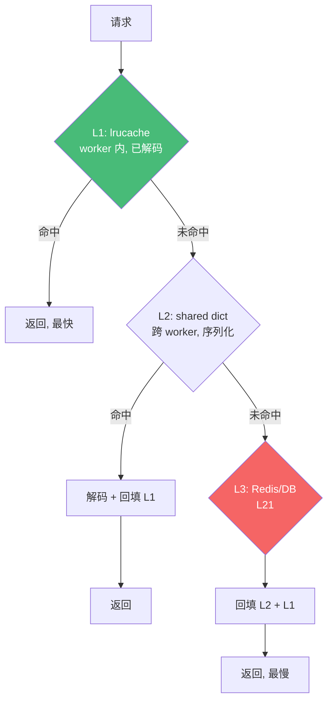

# 精通 OpenResty 共享内存与 lua-resty 生态

> 课程编号：L19
> 路线图来源：Lua 全场景深度课程 — 共享状态与生态库
> 难度：⭐⭐⭐⭐
> 预计阅读时间：55 分钟
> 📅 内容基准：**OpenResty 1.27.x** + **LuaJIT 2.1**

---

## 引言：worker 之间怎么共享数据

```lua
-- L17 说过：每个 worker 是独立 VM，不共享 Lua 内存。
-- 那么问题来了——
-- 1) 4 个 worker，怎么共享一个全局计数器？
-- 2) 怎么做一个所有 worker 都能命中的缓存？
-- 3) 缓存失效瞬间，1000 个请求同时打到数据库，怎么办？
```

L17 讲过 OpenResty 是**多 worker、每 worker 独立 LuaJIT VM**——这意味着 Lua 全局变量、模块状态**不跨 worker 共享**。那共享数据怎么办？答案是 **`lua_shared_dict`**（共享内存字典）。再配合 `lua-resty-lrucache`（worker 内缓存）、`lua-resty-lock`（防击穿），构成 OpenResty 的多级缓存体系。

这一章讲清共享内存、缓存层次、`lua-resty-*` 生态，是高性能网关数据层（与 L21 Redis 互补）的核心。

---

## 第一章：`lua_shared_dict` —— 跨 worker 共享内存

### 1.1 声明与基本操作

在 `http` 块声明一块共享内存（所有 worker 共享，由 master 分配）：

```nginx
http {
    lua_shared_dict my_cache 100m;     # 100MB 共享字典
    lua_shared_dict metrics 10m;
}
```

```lua
local dict = ngx.shared.my_cache

dict:set("key", "value")               -- 设置
dict:set("key2", 42, 60)               -- 带 60 秒 TTL
local v = dict:get("key")              -- 读取
dict:delete("key")

dict:add("k", "v")                     -- 仅当不存在时设（原子）
dict:incr("counter", 1, 0)             -- 原子自增（第三参为初始值）
dict:replace("k", "v2")                -- 仅当存在时替换

dict:flush_all()                       -- 清空
local keys = dict:get_keys(100)        -- 取部分键（慎用，遍历有锁）
```

### 1.2 关键特性

- **跨 worker**：所有 worker 看到同一份数据（共享内存，不是各自副本）。
- **原子操作**：`incr`/`add`/`replace` 等是原子的（内部加锁），适合做计数器、限流。
- **自带 LRU**：内存满时按 LRU 淘汰；`set` 可能返回 `forcible=true` 表示挤掉了其它键。
- **TTL 支持**：可设过期时间。

### 1.3 限制

⚠️ shared dict **只能存标量**（字符串、数字、布尔、nil）——**不能直接存 table**！存复杂结构要先序列化：

```lua
local cjson = require("cjson")
dict:set("user:1", cjson.encode({ name = "Alice", age = 30 }))   -- 序列化存
local user = cjson.decode(dict:get("user:1"))                     -- 取出反序列化
```

序列化/反序列化有 CPU 开销——这是 shared dict 和 worker 内 lrucache 的主要权衡（见第三章）。

### 1.4 内存满与 forcible

```lua
local ok, err, forcible = dict:set("k", big_value)
if forcible then
    ngx.log(ngx.WARN, "shared dict 内存不足，挤掉了其它键")
end
```

`forcible=true` 警示该 dict 内存吃紧，需调大或检查用法。

---

## 第二章：`lua-resty-lrucache` —— worker 内缓存

### 2.1 与 shared dict 的区别

`lua-resty-lrucache` 是**纯 Lua 实现的 worker 级缓存**：

| | shared dict | lrucache |
|---|---|---|
| 范围 | 跨 worker 共享 | **单 worker 内** |
| 存储 | 只标量（要序列化） | **可存任意 Lua 值（table、函数）** |
| 速度 | 较快（有锁 + 序列化） | **极快（纯内存，无锁无序列化）** |
| 用途 | 共享状态、计数器、限流 | 热数据本地缓存、解码后的对象 |

```lua
local lrucache = require("resty.lrucache")
local c = lrucache.new(1000)          -- 容量 1000 条（每 worker 各一份）

c:set("key", { complex = "table" }, 60)   -- 可直接存 table！60s TTL
local v = c:get("key")                 -- 直接拿到原对象，无反序列化
```

### 2.2 用 lrucache 缓存解码结果

shared dict 存的是序列化字符串，每次取都要解码。用 lrucache 缓存**解码后的对象**，避免重复解码：

```lua
-- 二级缓存：shared dict（跨 worker）+ lrucache（worker 内解码缓存）
local function get_config(key)
    local obj = lru:get(key)           -- 先查 worker 内（已解码）
    if obj then return obj end
    local raw = ngx.shared.cfg:get(key)  -- 再查共享内存（序列化）
    if raw then
        obj = cjson.decode(raw)
        lru:set(key, obj, 10)          -- 缓存解码结果
        return obj
    end
    return nil
end
```

---

## 第三章：多级缓存架构

### 3.1 三级缓存

典型高性能缓存分三级，逐级回源：



### 3.2 `lua-resty-mlcache`

手写三级缓存容易出错，`lua-resty-mlcache` 封装了完整的多级缓存 + 防击穿 + 失效广播：

```lua
local mlcache = require("resty.mlcache")
local cache = mlcache.new("my_cache", "shared_dict_name", {
    lru_size = 1000,         -- L1 lrucache 容量
    ttl = 60,                -- 缓存 TTL
    neg_ttl = 5,             -- 负缓存（防穿透）TTL
})

-- 一行搞定多级查询 + 回源 + 防击穿
local value, err = cache:get("key", nil, fetch_from_db, arg1)
-- 命中 L1/L2 直接返回；都未命中则调 fetch_from_db 回源（带 lock 防并发回源）
```

mlcache 内部用 lrucache（L1）+ shared dict（L2）+ lua-resty-lock（防击穿）+ 失效事件广播，是生产级缓存的推荐方案。

---

## 第四章：`lua-resty-lock` —— 防缓存击穿

### 4.1 缓存击穿问题（dog-pile / thundering herd）

热点 key 失效的瞬间，大量并发请求同时未命中，**全部去回源**（打数据库），可能压垮后端：

```lua
-- ❌ 击穿：N 个请求同时发现缓存空，N 个都查数据库
local v = cache:get(key)
if not v then
    v = query_database(key)   -- 并发时这里被执行 N 次！
    cache:set(key, v)
end
```

### 4.2 用 lock 串行化回源

`lua-resty-lock` 基于 shared dict 实现锁——只让**一个**请求回源，其它请求等待并共享结果：

```lua
local resty_lock = require("resty.lock")

local function get_with_lock(key)
    local v = cache:get(key)
    if v then return v end

    local lock = resty_lock:new("my_locks")    -- 锁用一个 shared dict
    local elapsed, err = lock:lock(key)        -- 抢锁（阻塞等待）
    if not elapsed then return nil, err end

    -- 拿到锁后再查一次（别人可能已回填）
    v = cache:get(key)
    if v then lock:unlock(); return v end

    v = query_database(key)                    -- 只有持锁者回源
    cache:set(key, v)
    lock:unlock()                              -- 释放，唤醒等待者
    return v
end
```

**关键**：双重检查（拿锁后再查缓存），因为等锁期间别的请求可能已回填。mlcache 内部已封装这套逻辑。

---

## 第五章：`lua-resty-*` 生态速览

OpenResty 的能力大半来自 `lua-resty-*` 库：

| 库 | 用途 |
|---|---|
| `lua-resty-redis` | Redis 客户端（cosocket，L21） |
| `lua-resty-mysql` | MySQL 客户端 |
| `lua-resty-http` | HTTP 客户端（上游调用，L18） |
| `lua-resty-lrucache` | worker 内 LRU 缓存（本章） |
| `lua-resty-lock` | 基于 shared dict 的锁（本章） |
| `lua-resty-mlcache` | 多级缓存（本章） |
| `lua-resty-jwt` | JWT 签发/校验（L20） |
| `lua-resty-limit-traffic` | 限流（req/count/conn，L20） |
| `lua-resty-dns` | DNS 解析（L18） |
| `lua-resty-string` | 哈希/加密辅助（基于 FFI + OpenSSL） |
| `lua-resty-template` | 模板渲染 |
| `lua-cjson` | JSON 编解码（C 实现，快） |
| `lua-resty-core` | 核心 API 的 FFI 实现（性能基石，L14） |

安装用 **opm**（OpenResty Package Manager）或 LuaRocks：

```bash
opm get openresty/lua-resty-redis
luarocks install lua-resty-jwt
```

---

## 第六章：worker 间协调——选主与事件

### 6.1 定时器选主

L17 提过 `ngx.timer.every` 在**每个 worker**都跑——如果是"全局唯一任务"（如配置同步），会重复执行 N 次。用 shared dict 原子操作选一个 worker 做：

```lua
local function unique_task(premature)
    if premature then return end
    -- 用 add 抢"主"标记（原子，只有一个成功）
    local ok = ngx.shared.locks:add("leader", true, 30)
    if not ok then return end          -- 不是主，跳过
    do_global_work()
end
```

### 6.2 `lua-resty-worker-events`

worker 间事件广播（如缓存失效通知）用 `lua-resty-worker-events`（基于 shared dict 轮询），mlcache 的失效广播也基于它。

---

## 第七章：常见陷阱清单

### ❌ 陷阱 1：shared dict 存 table

```lua
ngx.shared.cache:set("k", { a = 1 })   -- ❌ 报错：只能存标量
```
序列化：`set("k", cjson.encode(t))`。

### ❌ 陷阱 2：缓存击穿没防护

```lua
if not cache:get(k) then v = db_query(k) end   -- 热 key 失效 → N 个并发回源
```
用 lua-resty-lock 或 mlcache。

### ❌ 陷阱 3：只用 shared dict，每次都反序列化

```lua
local user = cjson.decode(ngx.shared.c:get(k))   -- 每请求都解码，CPU 浪费
```
加一层 lrucache 缓存解码结果。

### ❌ 陷阱 4：lrucache 当跨 worker 用

```lua
-- worker 1 set 的，worker 2 get 不到（lrucache 是 worker 内的）
```
跨 worker 用 shared dict。

### ❌ 陷阱 5：拿锁后不双重检查

```lua
lock:lock(k); v = db_query(k)   -- 等锁期间别人已回填，又查了一次
```
拿锁后先 `cache:get` 再决定是否回源。

### ❌ 陷阱 6：shared dict 频繁 forcible

```lua
-- 内存太小，频繁挤出 → 缓存命中率暴跌
```
监控 forcible，调大 dict 或优化 key。

---

## 第八章：练习题

**练习 1**：4 个 worker 共享一个计数器，用什么？怎么原子自增？

**练习 2**：为什么 shared dict 之上还要加 lrucache？

**练习 3**：描述缓存击穿，并给出防护方案。

**练习 4**：把一个对象缓存到 shared dict 并正确取回。

**练习 5**：判断真假——"lua-resty-lrucache 的数据所有 worker 都能看到。"

---

## 参考答案与解析

**练习 1**：用 `lua_shared_dict`（跨 worker 共享）。`ngx.shared.counters:incr("c", 1, 0)`——`incr` 是原子操作，第三参 0 是 key 不存在时的初始值。

**练习 2**：shared dict 只存序列化字符串，每次 `get` 要 `cjson.decode`（CPU 开销）。lrucache 在 worker 内缓存**解码后的对象**，命中时零解码、零拷贝，极快。两级配合：lrucache（快、worker 内）+ shared dict（共享、跨 worker）。

**练习 3**：缓存击穿 = 热点 key 失效瞬间，大量并发请求同时未命中、全部回源，压垮后端。防护：用 `lua-resty-lock` 让一个请求回源、其它等待共享结果（双重检查），或直接用 mlcache（已封装）。

**练习 4**：
```lua
local cjson = require("cjson")
ngx.shared.cache:set("user:1", cjson.encode({ name = "A" }), 60)
local raw = ngx.shared.cache:get("user:1")
local user = raw and cjson.decode(raw)
```

**练习 5**：**假**。lrucache 是 **worker 内**缓存，每个 worker 各有一份，互不可见。跨 worker 共享用 shared dict。

---

## 小结

| 知识点 | 关键记忆 |
|---|---|
| shared dict | 跨 worker 共享内存；**只存标量**（table 要序列化）；原子 incr/add；自带 LRU/TTL |
| lrucache | worker 内、**可存任意 Lua 值**、极快无序列化 |
| 多级缓存 | L1 lrucache（解码后）+ L2 shared dict（序列化）+ L3 Redis/DB |
| mlcache | 封装多级 + 防击穿 + 失效广播，生产推荐 |
| lua-resty-lock | 基于 shared dict 的锁，防缓存击穿；拿锁后**双重检查** |
| 生态 | redis/mysql/http/jwt/limit/lock/mlcache/cjson/lua-resty-core |
| worker 协调 | shared dict `add` 选主；worker-events 广播失效 |

---

## 📅 2026 现状/更新

- **mlcache** 是 2026 OpenResty 多级缓存的事实标准，把本章所有手写逻辑封装好。
- `lua-resty-core`（FFI）让 shared dict、`ngx.re` 等核心 API 持续提速（L14）。
- 共享内存 + Redis（L21）的分工：shared dict 做 worker/机器本地的超快缓存与限流计数，Redis 做跨机器的全局状态——L20 的分布式限流正是两者协作。

---

> 🔁 下一篇 **L20 — 精通 Lua 网关实战：限流·鉴权·灰度**：把前几章综合成真实网关能力——令牌桶/漏桶限流、JWT/HMAC 鉴权、基于权重的灰度发布、`balancer_by_lua` 动态 upstream，以及 APISIX 的插件机制。
>
> 反馈：把"lrucache + shared dict + lock"三件套在脑中拼成一张多级缓存图，它是网关数据层的标准答案。
