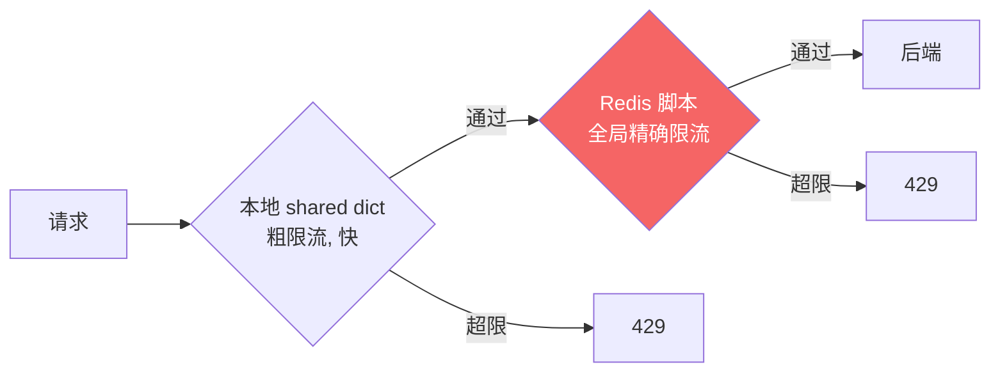

# 精通 Lua 网关实战：限流·鉴权·灰度

> 课程编号：L20
> 路线图来源：Lua 全场景深度课程 — 网关核心能力
> 难度：⭐⭐⭐⭐
> 预计阅读时间：55 分钟
> 📅 内容基准：**OpenResty 1.27.x** + **Apache APISIX 3.x** + **LuaJIT 2.1**

---

## 引言：网关到底在网关什么

```lua
-- 一个请求进入 API 网关，它要替你做几件事：
-- access 阶段：
--   1) 这个调用方超频了吗？（限流）
--   2) 它是谁、有权限吗？（鉴权）
-- balancer 阶段：
--   3) 这个请求该打到哪台后端？灰度发布要分流吗？
-- 还要防：恶意请求（WAF）

-- 这一章把 L17-L19 的机制（阶段、cosocket、共享内存）
-- 拼成真实的网关能力。
```

API 网关是 OpenResty 最典型的应用。它在请求进入业务之前，统一处理**限流、鉴权、路由、灰度、安全**——这些横切关注点（参考 `../microservices` 与 `../backend`）。这一章把前几章机制落地成网关核心功能，并介绍业界主流的 **Apache APISIX**。

---

## 第一章：限流

限流保护后端不被打垮。OpenResty 用 `lua-resty-limit-traffic` 提供几种算法。

### 1.1 漏桶（leaky bucket）—— `resty.limit.req`

漏桶以恒定速率"漏水"，请求超过速率则延迟或拒绝——**平滑突发**：

```lua
local limit_req = require("resty.limit.req")

-- 速率 200 req/s，允许突发 100
local lim = limit_req.new("my_limit_req", 200, 100)

local key = ngx.var.binary_remote_addr   -- 按客户端 IP 限
local delay, err = lim:incoming(key, true)
if not delay then
    if err == "rejected" then
        return ngx.exit(503)             -- 超限拒绝
    end
    ngx.log(ngx.ERR, "limit error: ", err)
    return ngx.exit(500)
end
if delay > 0 then
    ngx.sleep(delay)                     -- 在突发额度内，延迟放行（平滑）
end
```

### 1.2 固定窗口计数 —— `resty.limit.count`

简单的"N 个/时间窗"：

```lua
local limit_count = require("resty.limit.count")
local lim = limit_count.new("my_limit_count", 100, 60)   -- 60 秒内最多 100 次
-- 注意返回约定：成功放行返回 (0, remaining)，超限返回 (nil, "rejected")
-- 第一个返回值是“需延迟的秒数”（count 永远是 0），不是剩余次数！
local delay, err = lim:incoming(key, true)
if not delay then
    if err == "rejected" then
        return ngx.exit(429)   -- Too Many Requests
    end
    ngx.log(ngx.ERR, "limit.count failed: ", err)
    return ngx.exit(500)
end
ngx.header["X-RateLimit-Remaining"] = err   -- 成功时第二个返回值才是剩余次数
```

### 1.3 令牌桶（token bucket）思想

令牌桶以恒定速率生成令牌，请求消耗令牌——**允许突发**（攒下的令牌可一次用）。可用 shared dict 自己实现，或用 `resty.limit.req`（漏桶其实涵盖类似平滑需求）。手写令牌桶核心：

```lua
-- 简化的令牌桶（基于 shared dict 原子操作）
local function take_token(key, rate, capacity)
    local dict = ngx.shared.ratelimit
    local now = ngx.now()
    -- 实际实现要原子地：按时间补充令牌、扣减、记录 last_time
    -- 生产建议直接用 resty.limit.* 或 Redis 脚本（L21）做分布式版本
end
```

### 1.4 多维组合 —— `resty.limit.traffic`

```lua
local limit_traffic = require("resty.limit.traffic")
-- 组合多个限制器（按 IP + 按用户 + 全局），取最严
local limiters = { lim_ip, lim_user, lim_global }
local keys = { ip_key, user_key, "global" }
local delay, err = limit_traffic.combine(limiters, keys, states)
```

### 1.5 分布式限流

⚠️ shared dict 限流是**单机**的（每台网关各算各的）。多网关实例要**全局限流**得用 Redis（Redis Lua 脚本做原子令牌桶，L21）——这是 L19"shared dict 本地 + Redis 全局"分工的体现。



---

## 第二章：鉴权

### 2.1 API Key

最简单：请求带 key，网关查白名单（shared dict / Redis）：

```lua
-- access_by_lua
local key = ngx.req.get_headers()["X-API-Key"]
if not key or not ngx.shared.apikeys:get(key) then
    return ngx.exit(ngx.HTTP_UNAUTHORIZED)   -- 401
end
```

### 2.2 JWT —— `lua-resty-jwt`

JWT（JSON Web Token）自包含、无状态，网关本地即可验签（不用查库）：

```lua
local jwt = require("resty.jwt")

local token = ngx.req.get_headers()["Authorization"]
if token then token = token:gsub("^Bearer ", "") end

local verified = jwt:verify("your-secret-key", token)
if not verified.verified then
    ngx.log(ngx.WARN, "JWT 验证失败: ", verified.reason)
    return ngx.exit(ngx.HTTP_UNAUTHORIZED)
end

-- 验证通过，取 claims 放 ngx.ctx 供下游用（L17）
ngx.ctx.user_id = verified.payload.sub
ngx.ctx.roles = verified.payload.roles
```

要点：验签密钥/公钥（HS256 用密钥、RS256 用公钥）；检查 `exp`（过期）、`iss`/`aud`；敏感操作仍需后端二次校验。详见 `../microservices` 安全篇与 `../backend` 认证篇。

### 2.3 HMAC 签名

防篡改/重放：客户端用密钥对请求（方法+路径+时间戳+body）算 HMAC，网关重算比对：

```lua
local resty_hmac = require("resty.hmac")   -- 或用 resty.string + openssl
local function verify_signature(secret)
    local sig = ngx.req.get_headers()["X-Signature"]
    local ts = ngx.req.get_headers()["X-Timestamp"]
    -- 防重放：检查时间戳新鲜度
    if math.abs(ngx.now() - tonumber(ts)) > 300 then
        return false   -- 超过 5 分钟，拒绝
    end
    local payload = ngx.var.request_method .. ngx.var.uri .. ts
    local expected = compute_hmac(secret, payload)
    return sig == expected
end
```

---

## 第三章：动态路由与灰度发布

### 3.1 `balancer_by_lua` —— 动态选后端

`balancer_by_lua` 阶段（L17）让你用 Lua 动态决定请求打到哪个上游、失败重试哪台：

```nginx
upstream backend {
    server 0.0.0.1;   # 占位，实际由 lua 决定
    balancer_by_lua_block {
        local balancer = require("ngx.balancer")
        local server = ngx.ctx.target_server   -- 在 access 阶段选好
        local ok, err = balancer.set_current_peer(server.host, server.port)
        if not ok then ngx.log(ngx.ERR, err) end
        -- 还能设重试：balancer.set_more_tries(2)
    }
}
```

### 3.2 灰度发布（金丝雀）

按规则把一部分流量分到新版本：

```lua
-- access_by_lua：决定走 v1 还是 v2
local function pick_version()
    -- 1) 按 header 强制（测试用）
    if ngx.req.get_headers()["X-Canary"] == "true" then return "v2" end

    -- 2) 按用户 ID 一致性哈希（同一用户稳定路由，避免 A/B 抖动）
    local uid = ngx.ctx.user_id or ngx.var.binary_remote_addr
    local hash = ngx.crc32_short(uid)
    if hash % 100 < 10 then return "v2" end   -- 10% 流量到 v2

    return "v1"
end

ngx.ctx.target_server = upstreams[pick_version()]
```

⚠️ 灰度要用**一致性哈希/稳定特征**（用户 ID）分流，而非纯随机——否则同一用户在 v1/v2 间跳变，体验割裂、难复现问题。

### 3.3 蓝绿 / 流量镜像

- **蓝绿**：整体切换（改 upstream 指向）。
- **流量镜像（mirror）**：把生产流量复制一份打到新版本（不影响真实响应），用 `ngx.location.capture` 异步发到镜像 location，验证新版本。

---

## 第四章：WAF（Web 应用防火墙）

在 `access` 阶段用规则匹配拦截恶意请求：

```lua
-- 简化的规则匹配（生产用 lua-resty-waf 或 Coraza/ModSecurity）
local function check_waf()
    local uri = ngx.var.request_uri
    local args = ngx.req.get_uri_args()

    -- SQL 注入特征（用 ngx.re，PCRE 正则，L04 提过 Lua 模式不够用）
    for _, v in pairs(args) do
        if type(v) == "string" and ngx.re.find(v, [[(union\s+select|';--|\bor\b\s+1=1)]], "ijo") then
            ngx.log(ngx.WARN, "WAF blocked SQLi: ", v)
            return ngx.exit(403)
        end
    end
end
```

`ngx.re.*` 用 PCRE 正则（比 Lua 模式强大，L04），`"jo"` 标志启用 JIT + 编译缓存。生产用成熟 WAF（Coraza、lua-resty-waf）而非手写规则。

---

## 第五章：Apache APISIX —— 生产级网关

手写网关能力多，业界多用基于 OpenResty 的成熟网关。**Apache APISIX** 是 2026 主流之一：

### 5.1 架构

- 基于 OpenResty + etcd（配置中心，动态下发路由/插件，无需 reload）。
- **插件化**：限流、鉴权、灰度、可观测都是插件，热插拔。
- 控制面（Dashboard/Admin API）+ 数据面（OpenResty worker）。

### 5.2 插件机制

APISIX 插件本质是在各阶段（rewrite/access/...）注册的 Lua 函数：

```lua
-- 一个 APISIX 插件骨架
local plugin_name = "my-auth"
local _M = {
    version = 0.1,
    priority = 2500,        -- 执行优先级
    name = plugin_name,
    schema = {...},          -- 配置 schema（JSON Schema 校验）
}

function _M.access(conf, ctx)   -- 在 access 阶段执行
    local key = core.request.header(ctx, "apikey")
    if not valid(key, conf) then
        return 401, { message = "unauthorized" }
    end
end

return _M
```

理解了 L17 的阶段模型，APISIX 插件就是"在某阶段挂一段逻辑"——本章手写的限流/鉴权/灰度，在 APISIX 里都是现成插件（`limit-req`、`jwt-auth`、`traffic-split` 等）。

### 5.3 何时手写 vs 用 APISIX

- **简单/特定需求**：直接 OpenResty 写（本章方式），轻量可控。
- **复杂/多团队/需动态配置**：用 APISIX，省去造轮子、有生态和管控面。

---

## 第六章：常见陷阱清单

### ❌ 陷阱 1：shared dict 限流当全局限流

```lua
-- 4 台网关各算各的 → 实际限流是配置值的 4 倍
```
全局限流用 Redis 脚本（L21）。

### ❌ 陷阱 2：灰度用纯随机分流

```lua
if math.random(100) < 10 then version = "v2" end   -- 同一用户每次可能不同
```
用一致性哈希（用户 ID）稳定路由。

### ❌ 陷阱 3：JWT 只验签不验过期

```lua
if jwt:verify(secret, token).verified then pass() end   -- 没查 exp！
```
检查 `exp`/`nbf`/`iss`/`aud`。

### ❌ 陷阱 4：WAF 用 Lua 模式当正则

```lua
ngx.re.find(v, "...")   -- ✅ 用 ngx.re（PCRE）
string.match(v, "...")  -- ❌ Lua 模式表达力不足（L04）
```

### ❌ 陷阱 5：限流键选错

```lua
lim:incoming("global", true)   -- 所有请求一个 key → 全局限流而非按用户
```
按 IP/用户/API 选合适的 key。

### ❌ 陷阱 6：HMAC 不防重放

```lua
-- 只验签名不验时间戳 → 攻击者可重放抓到的请求
```
加时间戳新鲜度检查 + nonce。

---

## 第七章：练习题

**练习 1**：漏桶和令牌桶的核心区别？

**练习 2**：为什么多网关实例的全局限流不能只用 shared dict？

**练习 3**：写一段 access 阶段的 JWT 校验（含过期检查思路）。

**练习 4**：灰度发布为什么要用一致性哈希分流？

**练习 5**：判断真假——"APISIX 插件本质上是在 OpenResty 某个处理阶段注册的 Lua 逻辑。"

---

## 参考答案与解析

**练习 1**：漏桶以**恒定速率**处理请求（平滑突发，超出排队/拒绝）；令牌桶以恒定速率**生成令牌**、请求消耗令牌（**允许突发**，攒的令牌可一次用）。漏桶平滑、令牌桶容忍突发。

**练习 2**：shared dict 是单机共享内存，每台网关各有一份，各自计数。4 台网关用同样配置会让实际通过量约 4 倍。全局精确限流要用共享存储（Redis + 原子脚本，L21）。

**练习 3**：见第二章 2.2；过期检查：`verified.payload.exp` 与 `ngx.now()` 比较，过期则 401（`lua-resty-jwt` 的 `verify` 配合 validators 也能自动校验 exp）。

**练习 4**：保证**同一用户稳定落在同一版本**。纯随机会让用户在 v1/v2 间跳变，导致体验不一致、bug 难复现、A/B 数据被污染。一致性哈希（hash(user_id) % 100）让分流稳定。

**练习 5**：**真**。APISIX 插件就是在 rewrite/access/balancer 等阶段注册的 Lua 函数（+ 配置 schema + 优先级），是 L17 阶段模型的产品化封装。

---

## 小结

| 能力 | 关键点 |
|---|---|
| 限流 | 漏桶 `limit.req`(平滑) / 计数 `limit.count` / 令牌桶(突发)；**shared dict 单机、Redis 全局** |
| 鉴权 | API Key / **JWT**(无状态验签，查 exp/iss/aud) / HMAC(防篡改+时间戳防重放) |
| 路由 | `balancer_by_lua` 动态选 peer + 重试 |
| 灰度 | **一致性哈希分流**（用户 ID），非随机；蓝绿/镜像 |
| WAF | `ngx.re`(PCRE)规则；生产用成熟 WAF |
| APISIX | OpenResty+etcd，插件化（阶段注册 Lua），动态配置无 reload |
| 选型 | 简单需求手写；复杂/多团队用 APISIX |

---

## 📅 2026 现状/更新

- **Apache APISIX 3.x** 是 2026 云原生 API 网关主流之一；Kong（同基于 OpenResty）亦广泛使用。两者都把本章能力做成插件。
- 全局限流、分布式锁等"跨实例一致性"需求，标准做法是 OpenResty（本地快路径）+ Redis 原子脚本（全局，L21）。
- JWT/OAuth、mTLS、零信任等鉴权趋势详见 `../microservices` 安全篇与 `../backend` 认证篇——网关是这些策略的统一落地点。

---

> 🔁 下一篇 **L21 — 精通 Redis Lua 脚本**：换一个 Lua 宿主——Redis。`EVAL`/`EVALSHA` 的原子性、`KEYS`/`ARGV` 为何分离、Redis 7.0 Functions、以及用脚本实现原子限流和分布式锁（与本章全局限流呼应）。
>
> 反馈：把"限流/鉴权/灰度"在 access 与 balancer 阶段的落点画成一张请求流程图，网关逻辑就清晰了。
