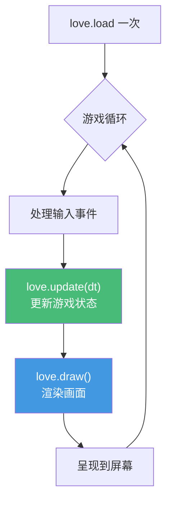

# 精通 Lua 游戏脚本：Love2D 与嵌入

> 课程编号：L23
> 路线图来源：Lua 全场景深度课程 — 游戏与嵌入
> 难度：⭐⭐⭐⭐
> 预计阅读时间：50 分钟
> 📅 内容基准：**LÖVE (Love2D) 11.x** + **Lua 5.1/LuaJIT**（游戏多用此版本）

---

## 引言：为什么游戏世界离不开 Lua

```lua
-- 一个 Love2D 游戏的骨架——三个回调就是一个游戏：
function love.load()    -- 启动时一次：加载资源
    player = { x = 100, y = 100, speed = 200 }
end

function love.update(dt) -- 每帧：dt 是上一帧到这帧的秒数
    if love.keyboard.isDown("right") then
        player.x = player.x + player.speed * dt   -- 为什么要乘 dt？
    end
end

function love.draw()    -- 每帧：渲染
    love.graphics.circle("fill", player.x, player.y, 20)
end
```

```lua
-- 问题：
-- 1) 为什么移动要乘 dt（而不是直接 +speed）？
-- 2) 怎么在不重启游戏的情况下改逻辑（热重载）？
-- 3) 怎么让玩家上传的脚本不能 rm -rf（沙箱）？
```

Lua 是**游戏脚本的事实标准**——魔兽世界、Roblox、《文明》、众多引擎都用它。原因正是 L01 讲的设计哲学：**嵌入小巧、热更新、沙箱、对非程序员友好**。这一章以 **Love2D** 为例讲游戏循环，讲把 Lua 嵌入 C/C++ 引擎（L15 的应用），并重点讲**热重载**和**沙箱**——后者是运行不可信脚本（Roblox、Mod）的安全命门。

---

## 第一章：为什么游戏选 Lua

| 需求 | Lua 的契合点 |
|---|---|
| **引擎是 C/C++，逻辑要常改** | Lua 易嵌入（L15），脚本改了不用重编引擎 |
| **热更新** | 线上游戏改逻辑/数值不停服（本章第四章） |
| **运行不可信脚本** | 沙箱机制隔离玩家脚本（Roblox、Mod，本章第五章） |
| **策划/设计师写逻辑** | 语法简单，非程序员也能上手 |
| **性能** | LuaJIT 接近 C（L13），够游戏逻辑用 |
| **小** | 整个解释器 200KB，适合主机/移动/嵌入式 |

典型分工：**引擎（C/C++）负责渲染、物理、IO 等性能关键部分；Lua 负责游戏逻辑、AI、剧情、配置、UI**——这正是"机制 vs 策略"哲学（L01）的体现。

---

## 第二章：游戏循环与 dt

### 2.1 Love2D 的三回调

Love2D（LÖVE）是一个开源 2D 游戏框架，C++ 内核 + Lua API。你只需定义几个 `love.*` 回调，框架驱动游戏循环：

```lua
function love.load() end           -- 初始化（一次）
function love.update(dt) end       -- 逻辑更新（每帧，dt = 帧间隔秒数）
function love.draw() end           -- 渲染（每帧）
function love.keypressed(key) end  -- 输入事件
function love.mousepressed(x, y, button) end
```

底层循环大致是：



### 2.2 为什么移动要乘 dt（帧率无关）

不同机器帧率不同（60fps、144fps）。如果直接 `x = x + speed`，高帧率的机器移动更快——游戏速度依赖硬件。**乘 dt 让移动按"每秒"计**，与帧率无关：

```lua
-- ❌ 帧率相关：60fps 和 144fps 速度不同
player.x = player.x + 5

-- ✅ 帧率无关：每秒移动 200 像素，无论多少帧
player.x = player.x + 200 * dt
```

`dt`（delta time）是上一帧到这一帧的秒数。所有"随时间变化"的量（移动、动画、计时器）都要乘 dt。这是游戏编程第一课。

### 2.3 固定时间步（进阶）

物理模拟需要稳定的步长（否则不同 dt 下行为不一致）。常用**固定时间步 + 累加器**：

```lua
local accumulator = 0
local FIXED_DT = 1/60
function love.update(dt)
    accumulator = accumulator + dt
    while accumulator >= FIXED_DT do
        physics_step(FIXED_DT)        -- 物理用固定步长
        accumulator = accumulator - FIXED_DT
    end
end
```

---

## 第三章：把 Lua 嵌入 C/C++ 引擎

自研引擎用 C API（L15）嵌入 Lua，把引擎能力暴露给脚本：

```c
// 引擎侧（C）：注册一个供 Lua 调用的函数
static int l_spawn_entity(lua_State *L) {
    const char *type = luaL_checkstring(L, 1);
    float x = luaL_checknumber(L, 2);
    float y = luaL_checknumber(L, 3);
    Entity *e = engine_spawn(type, x, y);    // 调引擎 C 代码
    lua_pushlightuserdata(L, e);             // 把句柄返回给 Lua
    return 1;
}

// 注册 + 每帧调用脚本的 update
void game_init(lua_State *L) {
    lua_register(L, "spawn", l_spawn_entity);
    luaL_dofile(L, "game.lua");
}
void game_update(lua_State *L, float dt) {
    lua_getglobal(L, "on_update");
    lua_pushnumber(L, dt);
    lua_pcall(L, 1, 0, 0);                    // 调 Lua 的 on_update(dt)（L15）
}
```

```lua
-- 脚本侧（game.lua）：用引擎暴露的 API 写逻辑
function on_update(dt)
    if should_spawn() then
        spawn("enemy", math.random(800), 0)   -- 调引擎的 C 函数
    end
end
```

引擎用 `lua_pcall` 每帧调脚本（保护调用，脚本出错不崩引擎，L09/L15）。把 C 对象作 userdata/lightuserdata 给 Lua（L15）。

---

## 第四章：热重载

### 4.1 改逻辑不重启

游戏开发/线上运营要"改了脚本立即生效"。核心是清掉模块缓存（L10）再重新加载：

```lua
local function reload(module_name)
    package.loaded[module_name] = nil    -- 清缓存（L10）
    return require(module_name)
end

-- 监听文件变化或按键触发
function love.keypressed(key)
    if key == "f5" then
        enemy_logic = reload("enemy_logic")   -- 重载敌人逻辑
        print("已热重载")
    end
end
```

### 4.2 保留运行时状态

难点：重载会丢失模块内的运行时状态（如已生成的敌人）。解法是**把状态和逻辑分离**——状态存在外部（不随重载清空），逻辑模块只含函数：

```lua
-- 状态放全局/外部表（不随重载丢）
GameState = GameState or { enemies = {}, score = 0 }

-- enemy_logic.lua 只含纯函数，操作传入的 state
local M = {}
function M.update(state, dt)
    for _, e in ipairs(state.enemies) do e.x = e.x + e.vx * dt end
end
return M
-- 重载 M 后，GameState 还在，逻辑换新
```

这是"数据与行为分离"在热重载场景的应用。

---

## 第五章：沙箱——运行不可信脚本

### 5.1 为什么需要沙箱

Roblox、游戏 Mod、玩家自定义脚本——这些是**不可信代码**。直接跑它们，恶意脚本能 `os.execute("rm -rf")`、`io.open` 读你的文件、死循环卡死游戏。**沙箱**限制脚本只能访问安全的 API。

### 5.2 用 `_ENV`/受限环境构建沙箱

L02 讲过 `_ENV` 是全局环境。给不可信代码一个**只含安全函数的环境**：

```lua
-- 构建白名单环境
local function make_sandbox()
    return {
        print = print,
        math = math,
        string = string,
        table = table,
        pairs = pairs, ipairs = ipairs,
        -- 故意不给：os, io, load, require, dofile, package, setmetatable...
    }
end

-- 在沙箱里运行不可信代码（5.2+/5.4 用 load 的 env 参数）
local function run_untrusted(code)
    local sandbox = make_sandbox()
    local fn, err = load(code, "untrusted", "t", sandbox)   -- "t"=只允许文本(防字节码注入)
    if not fn then return nil, err end
    return pcall(fn)                                          -- 保护执行
end

print(run_untrusted("print(math.sqrt(16))"))   -- ok, 4
print(run_untrusted("os.execute('rm -rf /')"))  -- false（os 不在沙箱，报错）
```

要点：
- `load(code, name, "t", env)` 第三参 `"t"` **只允许文本**（防止注入预编译字节码绕过沙箱，L16）。
- 环境里**不放** `os`/`io`/`load`/`require`/`dofile`/`package`/`debug`/`setmetatable`（这些能逃逸）。
- 用 `pcall` 保护执行（L09）。

### 5.3 防死循环（超时）

沙箱拦得住 API，但拦不住 `while true do end`。要用 `debug.sethook` 设指令计数钩子，超限中断：

```lua
local function run_with_limit(fn, max_instructions)
    debug.sethook(function()
        error("脚本执行超时（疑似死循环）")
    end, "", max_instructions)         -- 每执行 N 条指令触发一次
    local ok, err = pcall(fn)
    debug.sethook()                     -- 清除钩子
    return ok, err
end
```

⚠️ 沙箱是**安全攸关**的，自己拼容易留漏洞（如通过 `string.rep` 爆内存、元表逃逸）。生产用成熟方案（如 Roblox 的 Luau 内置沙箱、`lua-sandbox` 库）。**LuaJIT 的 FFI 必须禁用**（FFI 可访问任意内存，L14，是沙箱大洞）。

---

## 第六章：Luau —— Roblox 的 Lua 方言

**Luau** 是 Roblox 基于 Lua 5.1 开发的方言，针对游戏场景增强：

- **渐进类型系统**（gradual typing）：可选的类型注解 + 类型检查。
- **性能优化**：自有 VM、更快的解释器。
- **内置沙箱与安全**：为大规模运行不可信脚本设计。
- **语法扩展**：`continue`、复合赋值 `+=`、字符串插值等。

Luau 与标准 Lua **不完全兼容**（是一个分支）。如果做 Roblox 开发，学的是 Luau；通用游戏/嵌入则用标准 Lua/LuaJIT。了解它的存在，避免把 Luau 特性当标准 Lua 用。

---

## 第七章：常见陷阱清单

### ❌ 陷阱 1：移动不乘 dt

```lua
player.x = player.x + 5   -- 帧率越高跑越快
```
乘 dt：`+ speed * dt`。

### ❌ 陷阱 2：沙箱放了危险 API

```lua
local env = { os = os, io = io }   -- ❌ 不可信脚本能 os.execute/io.open
```
只放安全白名单。

### ❌ 陷阱 3：load 允许字节码

```lua
load(code, "x", "bt", env)   -- ❌ "b" 允许字节码，可注入恶意字节码绕沙箱
```
用 `"t"` 只允许文本。

### ❌ 陷阱 4：沙箱没防死循环

```lua
-- 不可信脚本 while true do end → 卡死游戏
```
用 `debug.sethook` 指令计数超时。

### ❌ 陷阱 5：LuaJIT 沙箱没禁 FFI

```lua
-- 沙箱里能 require("ffi") → 直接访问内存，沙箱形同虚设
```
禁用 FFI（移除 `ffi`、`package`、`require`）。

### ❌ 陷阱 6：热重载丢状态

```lua
-- 模块内 local enemies = {} 随重载清空
```
状态外置，逻辑模块纯函数化。

---

## 第八章：练习题

**练习 1**：为什么 `player.x = player.x + speed * dt` 而不是 `+ speed`？

**练习 2**：写一个 Love2D 回调，让方块每秒向右移动 100 像素。

**练习 3**：构建一个只允许 `math` 和 `print` 的沙箱运行字符串代码。

**练习 4**：热重载时如何保留游戏状态？

**练习 5**：判断真假——"在沙箱里保留 `setmetatable` 和 `load` 是安全的。"

---

## 参考答案与解析

**练习 1**：让移动速度**与帧率无关**。直接 `+ speed` 时，帧率高的机器每秒更新更多次、移动更快。乘 `dt`（帧间隔秒数）后，每秒移动量固定（speed 像素/秒），各机器一致。

**练习 2**：
```lua
function love.load() box = { x = 0, y = 100 } end
function love.update(dt) box.x = box.x + 100 * dt end
function love.draw() love.graphics.rectangle("fill", box.x, box.y, 50, 50) end
```

**练习 3**：
```lua
local function run(code)
    local env = { math = math, print = print }
    local fn = load(code, "sb", "t", env)
    if not fn then return nil end
    return pcall(fn)
end
run("print(math.pi)")   -- ok, 3.14...
```

**练习 4**：把状态存在外部表（全局/独立模块），逻辑模块只含纯函数操作传入的状态；重载只换逻辑模块（清 `package.loaded` 后 require），状态表不动，故保留。

**练习 5**：**假**。`load` 能加载任意代码（可指定不同环境逃逸）；`setmetatable` 可通过元表操纵访问、配合 `string` 等的元表可能逃逸。沙箱应排除它们（或极其谨慎地包装）。

---

## 小结

| 知识点 | 关键记忆 |
|---|---|
| 为何选 Lua | 易嵌入 + 热更新 + 沙箱 + 设计师友好 + 小 + 快(LuaJIT) |
| 游戏循环 | load(一次) / update(dt) / draw（每帧）；引擎驱动 |
| dt | **移动/动画乘 dt** 实现帧率无关；物理用固定步长 |
| 嵌入 | C 引擎用 C API（L15）注册函数 + 每帧 `lua_pcall` 脚本 |
| 热重载 | 清 `package.loaded` 重 require；**状态外置**保留 |
| 沙箱 | 受限 `_ENV` 白名单；`load(...,"t",env)` 防字节码；**禁 os/io/load/FFI** |
| 防死循环 | `debug.sethook` 指令计数超时 |
| Luau | Roblox 方言：渐进类型 + 沙箱 + 语法扩展，**不完全兼容标准 Lua** |

---

## 📅 2026 现状/更新

- **Luau**（Roblox）发展活跃，带类型系统与强沙箱，是大规模不可信脚本场景的代表；与标准 Lua 是分支关系。
- **LÖVE 11.x** 仍是开源 2D 游戏的主流框架（LuaJIT 驱动）。
- 沙箱安全是持续课题——自研沙箱难做对，**生产优先用经过审计的方案**，且 LuaJIT 场景务必禁用 FFI（L14 的"无边界检查"是沙箱大洞）。

---

> 🔁 下一篇 **L24 — 精通 Lua 测试、调试与性能剖析**：工程化收尾。用 busted 写测试、luacheck 静态检查、luacov 覆盖率、debug 库与调试器、LuaJIT profiler 找热点。
>
> 反馈：游戏是 Lua "可嵌入"哲学最生动的舞台——把"dt 帧率无关"和"沙箱禁 FFI"这两条记牢。
