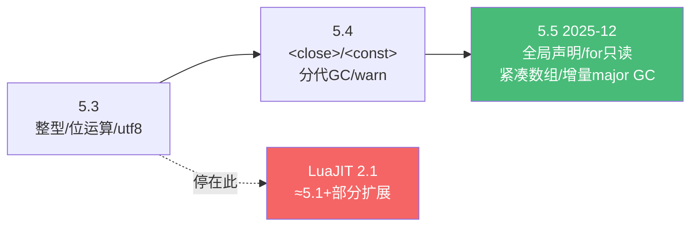

# 精通 Lua 5.4 新特性与 2026 现状

> 课程编号：L25
> 路线图来源：Lua 全场景深度课程 — 新特性与生态现状（收官）
> 难度：⭐⭐⭐⭐
> 预计阅读时间：55 分钟
> 📅 内容基准：**Lua 5.5.0**（2025-12-22 最新）+ **Lua 5.4.8**（2025-06，5.4 末版）+ **LuaJIT 2.1**

---

## 引言：语言还在进化

```lua
-- 1) 5.4 的 <close>——这个文件何时被关闭？
do
    local f <close> = assert(io.open("data.txt"))
    process(f:read("a"))
end   -- 离开块时？还是等 GC？

-- 2) 5.4 的 <const>
local MAX <const> = 100
-- MAX = 200   -- 会怎样？

-- 3) 5.5 的大变化（2025-12）——这段在 5.5 里可能报错？
for i = 1, 10 do
    i = i + 1   -- 5.4 允许，5.5 呢？
end
```

答案：① `<close>` 让 `f` 在**离开作用域时确定性关闭**（不等 GC），即使因错误退出也会关——这是 Lua 版的 RAII；② `<const>` 声明编译期常量，`MAX = 200` 会**编译错误**；③ 在 **Lua 5.5**（2025-12 发布），`for` 循环变量变成**只读（const）**，`i = i + 1` 会报错——这是 5.5 收紧安全性的一个改动。

这是全系列收官篇。前 24 篇覆盖了语言核心、性能、嵌入与各应用宿主。这一篇聚焦**语言的最新演进**——5.4 引入的 `<close>`/`<const>`/分代 GC，以及 **2025 年底发布的 Lua 5.5**（五年来首个大版本）——并总览 Lua/LuaJIT/Luau 生态在 2026 的现状，为整个学习旅程收尾。

---

## 第一章：5.4 的 to-be-closed 变量 `<close>`

### 1.1 确定性资源释放

L09/L12 反复提到：`__gc` 释放资源**时机不确定**。5.4 的 **to-be-closed 变量**提供**确定性**释放——变量离开作用域时立即调用其 `__close` 元方法（L06）：

```lua
local function open_resource(name)
    return setmetatable({ name = name }, {
        __close = function(self, err)
            print("关闭:", self.name, err and ("(因错误: "..tostring(err)..")") or "")
        end
    })
end

do
    local r <close> = open_resource("file")
    print("使用中")
end   -- 离开块 → 立即打印"关闭: file"
-- 输出：使用中 / 关闭: file
```

### 1.2 错误安全

`<close>` 在作用域因**任何原因**退出时都触发——正常结束、`return`、`break`、甚至**错误**：

```lua
local function risky()
    local conn <close> = open_resource("db")   -- 即使下面出错，conn 也会被关
    error("出错了")
end
pcall(risky)   -- conn 的 __close 仍被调用，传入错误信息
```

`__close(self, err)` 的第二参是导致退出的错误（正常退出为 nil）。这优雅解决了 L09 第七章的"资源泄漏"问题——不再需要 `pcall` 包裹 + 手动 finally：

```lua
-- L09 的繁琐写法 → 5.4 一行搞定
local function process()
    local f <close> = assert(io.open("data.txt"))
    return parse(f:read("a"))   -- 无论成败 f 都会关
end
```

### 1.3 约束

- `<close>` 的值必须有 `__close` 元方法（或为 nil/false，会被忽略）。
- 多个 `<close>` 变量**逆序关闭**（后声明的先关，像栈）。
- **LuaJIT 不支持**（≈5.1），OpenResty/游戏仍需 `pcall` 手动清理（L09）。

---

## 第二章：5.4 的 `<const>` 变量

```lua
local PI <const> = 3.14159
local CONFIG <const> = load_config()
-- PI = 3   -- ❌ 编译错误: attempt to assign to const variable 'PI'
```

`<const>` 声明**编译期常量**——赋值后不可改，编译器强制检查。好处：

- 表达不变量的意图，编译器帮你守护。
- 编译器可能据此优化。

`<const>` 和 `<close>` 是 5.4 引入的**属性（attribute）**语法（`<name>` 形式）。⚠️ LuaJIT 不支持。

---

## 第三章：5.4 的其它增强（回顾）

前面各章讲过的 5.4 特性，汇总：

| 特性 | 章节 | 要点 |
|---|---|---|
| **分代 GC** | L12 | `collectgarbage("generational")`，对短命对象高效 |
| **`warn` 系统** | L09 | `warn("@on")` + 警告消息；可自定义处理器 |
| **`coroutine.close`** | L08 | 主动关闭协程，触发其 `<close>` |
| **数值 for 溢出修正** | — | 5.4 修正了数值 for 在边界溢出时的语义（不再可能无限循环） |
| **`math.random` 升级** | L16 | 用 xoshiro256\*\*，质量更好（但仍非密码学） |
| **字符串转数字收紧** | L03/L16 | 隐式强制规则更严格 |
| **整型（5.3 起）** | L03 | integer/float 分离，`math.type` |

这些共同构成 5.4 "更安全、更高效"的主题。

---

## 第四章：Lua 5.5（2025-12-22）——五年来的大版本

2025 年 12 月，Lua 团队发布 **5.5.0**——自 5.4（2020-06）以来的首个大版本。它带来几项重要（部分**向后不兼容**）的变化。

### 4.1 全局变量声明——修正"默认全局"

这是 5.5 的**头条特性**，也是对本系列 L02/L17 反复警告的"默认全局是坑"的**官方回应**：

- 长久以来 Lua **默认全局**（不写 local 即全局，L02），是拼写错误静默制造全局的头号 bug 源。
- 5.5 引入**可选的全局变量声明**机制：可以要求全局变量**显式声明**，未声明的名字赋值会在**编译期报错**（而非静默创建）。
- 可用 `global <const> *` 一类声明把"未声明的全局名"设为只读，让拼写错误在编译期就被抓住，而不是运行时。

```lua
-- 5.5 思路（具体语法以官方 5.5 手册为准）
-- 启用严格全局后：
foo = 1        -- 若 foo 未声明 → 编译错误（不再静默建全局）
```

⚠️ 这是**可选/opt-in** 的——不破坏不启用它的旧代码。社区对此有讨论（有人指出 5.1 起就能用元表做运行时严格检查，L02 的 strict 模式；但那只在运行时、且不防覆盖已存在全局）。5.5 的方案在**编译期**捕获，更彻底。

### 4.2 for 循环变量只读

5.5 把**数值 for 和泛型 for-in 的控制变量改为只读（const）**：

```lua
-- 5.5：循环变量是 const
for i = 1, 10 do
    i = i + 1   -- ❌ 5.5 编译错误（5.4 允许但语义混乱）
end
for _, v in ipairs(t) do
    v = transform(v)   -- ❌ 改的也只是局部副本，5.5 直接禁止误导性写法
end
```

这与 L07"循环变量每轮独立"一脉相承，进一步防止"在循环里改控制变量"这种几乎总是 bug 的写法。

### 4.3 紧凑数组——省约 60% 内存

5.5 优化了表的数组部分（L05）的内存布局：**大数组省约 60% 内存**。此前数组在 padding/对齐上浪费 40%+，5.5 更紧凑地存储连续整数键的值。对大数据/游戏/OpenResty 缓存是显著利好。

### 4.4 大型 GC 增量化

5.5 让 **major collection（全堆扫描）也增量进行**（L12），进一步降低 stop-the-world 停顿——对延迟敏感的游戏（L23）、长驻服务（OpenResty L17）很重要。

### 4.5 其它

- **`table.create`** 进入标准库（此前是 LuaJIT 扩展，L05）——预分配数组，减少 rehash。
- **具名 vararg 表（named vararg）**。
- **`utf8.offset`** 也返回字符的终止位置（L16）。
- **external strings**（用非 Lua 管理的内存的字符串）。
- 浮点打印用足够位数的十进制（可被正确读回）。
- 新增 `luaL_openselectedlibs`、`luaL_makeseed`（C API，L15）。

### 4.6 升级注意

5.5 有**向后不兼容**变化（for 变量只读、可能的全局严格化等）。迁移前读官方 5.5 readme 的不兼容列表。**LuaJIT 无法支持 5.5 的全部**（每个新版本的不兼容变化都让 LuaJIT 难以跟进，它仍停在 ≈5.1，L13）。

---

## 第五章：版本迁移速查



| 你在用 | 能用什么 |
|---|---|
| **PUC-Lua 5.5** | 全部最新（全局声明、for 只读、`<close>`、整型、分代/增量 GC） |
| **PUC-Lua 5.4.8** | `<close>`/`<const>`/分代 GC/warn/整型，但无 5.5 的全局声明、for 只读 |
| **LuaJIT 2.1** | ≈5.1 + goto/部分扩展 + **FFI**；**无**整型/`<close>`/5.5 特性 |
| **Redis 内嵌** | Lua 5.1（L21） |
| **OpenResty/Neovim** | LuaJIT（L17/L22） |
| **Roblox** | Luau（L23，独立方言） |

---

## 第六章：2026 生态现状

### 6.1 实现版图

- **PUC-Lua 5.5.0**：最新参考实现，语言进化的主线。
- **PUC-Lua 5.4.x（末版 5.4.8）**：成熟稳定，大量项目仍用。
- **LuaJIT 2.1**：rolling release，社区维护；性能 + FFI 不可替代，仍是 OpenResty/高性能/游戏的基石。其与新版本的兼容鸿沟随 5.5 进一步拉大。
- **Luau**：Roblox 的渐进类型方言，独立发展，面向大规模不可信脚本。

### 6.2 应用版图（本系列应用篇映射）

| 领域 | 运行时 | 本系列 |
|---|---|---|
| API 网关 | OpenResty/APISIX（LuaJIT） | L17–L20 |
| 数据库脚本 | Redis（Lua 5.1） | L21 |
| 编辑器 | Neovim（LuaJIT） | L22 |
| 游戏 | LÖVE（LuaJIT）/ Roblox（Luau）/ 嵌入引擎 | L23 |
| 嵌入式/IoT | PUC-Lua / 各定制 | L01/L15 |

### 6.3 选型建议

- **新通用项目 / 要最新特性**：PUC-Lua 5.5（或 5.4 求稳）。
- **极致性能 / FFI / OpenResty 全家桶**：LuaJIT。
- **特定宿主**：跟随宿主（Redis→5.1、Neovim→LuaJIT、Roblox→Luau）。

---

## 第七章：常见陷阱清单

### ❌ 陷阱 1：在 LuaJIT 用 `<close>`/`<const>`

```lua
local f <close> = ...   -- ❌ LuaJIT/5.1 语法错误
```
仅 PUC-Lua 5.4+。OpenResty/Neovim 用不了。

### ❌ 陷阱 2：以为 `<close>` 像 `__gc`（不确定时机）

```lua
-- <close> 是确定性的（离开作用域立即），__gc 不确定
```

### ❌ 陷阱 3：5.5 里改 for 控制变量

```lua
for i = 1, 10 do i = i * 2 end   -- 5.5 编译错误（for 变量只读）
```

### ❌ 陷阱 4：跨版本迁移忽略不兼容

```lua
-- 5.4→5.5 有破坏性变化（for 只读等），迁移前读 readme
```

### ❌ 陷阱 5：以为 LuaJIT 会很快支持 5.5

```lua
-- LuaJIT 停在 ≈5.1，5.5 的不兼容变化让它更难跟进
```
高性能场景继续按 5.1/LuaJIT 能力写。

### ❌ 陷阱 6：`<close>` 值无 `__close`

```lua
local x <close> = {}   -- ❌ 普通表无 __close，离开作用域报错
```
值必须有 `__close` 元方法（或 nil/false）。

---

## 第八章：练习题

**练习 1**：`<close>` 和 `__gc` 在"何时释放"上有何本质区别？

**练习 2**：用 `<close>` 写一个确保文件关闭的函数（即使中途出错）。

**练习 3**：Lua 5.5 的"全局变量声明"解决了本系列哪一章反复强调的什么问题？

**练习 4**：下面代码在 5.4 和 5.5 下分别如何？
```lua
for i = 1, 3 do i = i + 10; print(i) end
```

**练习 5**：你要写一个 OpenResty 网关插件，能用 `<close>` 吗？为什么？

---

## 参考答案与解析

**练习 1**：`<close>` 是**确定性**的——变量离开作用域（含正常退出、break、return、错误）时**立即**调用 `__close`。`__gc` 是**非确定性**的——对象被 GC 回收时才调，时机不可控、不保证及时（L12）。`<close>` 适合资源（文件、锁、连接）的及时释放。

**练习 2**：
```lua
local function process(path)
    local f <close> = assert(io.open(path))
    return parse(f:read("a"))   -- 即使 parse 出错，f 也会被关
end
```

**练习 3**：解决 **L02/L17 反复强调的"默认全局是坑"**——忘写 `local` 静默创建全局变量（拼写错误、OpenResty 跨请求泄漏的头号来源）。5.5 让全局可显式声明、未声明赋值在编译期报错。

**练习 4**：5.4 下打印 `11 12 13`（允许改 `i`，但每轮 `i` 重新由循环设值，所以 `i+10` 后立即被覆盖到下一轮的循环值——实际每轮独立，打印 11、12、13）；**5.5 下编译错误**（for 变量只读，`i = i + 10` 非法）。

**练习 5**：**不能**。OpenResty 跑的是 LuaJIT（≈5.1，L17），不支持 `<close>`（5.4 特性）。网关插件的资源清理要用 `pcall` 手动 finally（L09）或 cosocket 连接池的 `setkeepalive`（L18）。

---

## 小结

| 知识点 | 关键记忆 |
|---|---|
| `<close>` (5.4) | **确定性**资源释放；离开作用域（含出错）调 `__close`；逆序；LuaJIT 无 |
| `<const>` (5.4) | 编译期常量，赋值即编译错误 |
| 5.4 其它 | 分代 GC / warn / coroutine.close / 数值 for 修正 / 整型 |
| **5.5 (2025-12)** | **全局声明**（修正默认全局）/ **for 变量只读** / 紧凑数组(-60%内存) / 增量 major GC / table.create 标准化 |
| 兼容 | 5.5 有破坏性变化；**LuaJIT 停 ≈5.1**，跟不进 |
| 选型 | 最新特性→5.5；性能/FFI/OpenResty→LuaJIT；跟随宿主 |

---

## 📅 2026 现状/更新

- **Lua 5.5.0（2025-12-22）** 是最新大版本，五年磨一剑：可选全局声明、for 只读、紧凑数组省 60% 内存、major GC 增量化。**Lua 5.4.8（2025-06）** 是 5.4 末版，仍广泛使用。
- **LuaJIT 2.1** 继续以 rolling release 维护，是 OpenResty/游戏/高性能的基石；与 PUC-Lua 新版本的鸿沟随 5.5 拉大——"你在用哪个 Lua"在 2026 比以往更需要确认。
- 生态全景：OpenResty/APISIX（网关）、Redis（脚本/Functions）、Neovim（编辑器）、Roblox/Luau 与 LÖVE（游戏）——Lua "可嵌入"哲学（L01）在 2026 依旧无处不在。

---

## 🎓 全系列收束

恭喜读到这里。回顾这趟旅程：

- **语言核心（L01–L12）**：从运行模型、类型、表、元表，到函数闭包、协程、错误、模块、OOP、GC——Lua 的全部语言机制。
- **性能与嵌入（L13–L16）**：LuaJIT 的 JIT 与 FFI、C API 嵌入、标准库——把 Lua 用快、用进 C 世界。
- **应用场景（L17–L25）**：OpenResty 网关、Redis 脚本、Neovim、游戏、工程化、最新特性——Lua 作为"嵌入式胶水语言"的真实战场。

Lua 的精髓始终是 L01 那句话：**提供机制而非策略**。一个数据结构（表）、一套元机制（元表）、一个可暂停函数（协程）、一个可嵌入的解释器（lua_State）——少数正交的机制，组合出无穷的可能。把这些机制吃透，比记住任何 API 都重要。

> 🔁 配套资源：[INDEX.md](./INDEX.md) 总目录 · [QUIZ.md](./QUIZ.md) 测验题 · [ROADMAP.md](./ROADMAP.md) 可视化路线图
>
> 反馈：动手是关键。挑一个你感兴趣的方向（写个 OpenResty 接口、一个 Redis 限流脚本、一个 Love2D 小游戏、一份 Neovim 配置），把学到的机制用起来。
