# Lua 全场景课程 · Mermaid 可视化路线图

> 配合 [INDEX.md](./INDEX.md) 与 [QUIZ.md](./QUIZ.md) 使用
> 所有 Mermaid 图可在 GitHub、VS Code、Obsidian、Typora 等直接渲染
>
> **📅 内容基准：Lua 5.4.8 + LuaJIT 2.1**，覆盖 Lua 5.5.0（2025-12）新特性

---

## 🗺️ 全景路线图

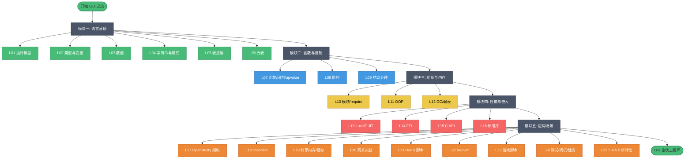

---

## 🟢 模块一：语言基础（L01–L06）依赖图

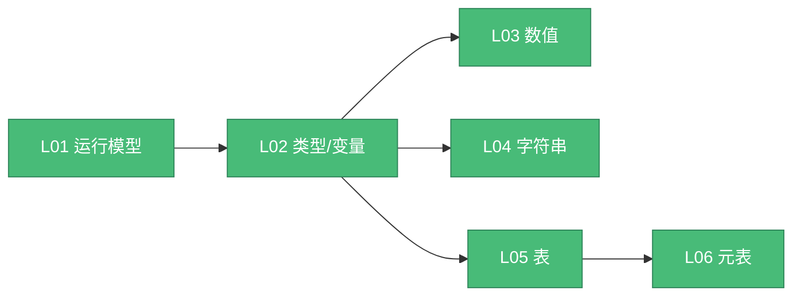

**核心知识点速记**：
- L01：字节码 + 寄存器式 VM；`lua_State` 多实例；5.1–5.5 谱系
- L02：8 类型；只有 nil/false 假；全局即 `_G`/`_ENV`；and/or 返回操作数
- L03：整浮分离；`/`和`^`恒浮点；`//`整除；`1`与`1.0`同键
- L04：不可变/interning；**模式≠正则**；gsub 返回两值；concat 性能
- L05：数组部分+哈希部分；含洞 `#` 未定义；`next` 判空；pairs 无序
- L06：`__index`/`__newindex`；运算符重载；`__call`；rawset 防递归

---

## 🔵🟡 模块二/三：控制流与组织（L07–L12）

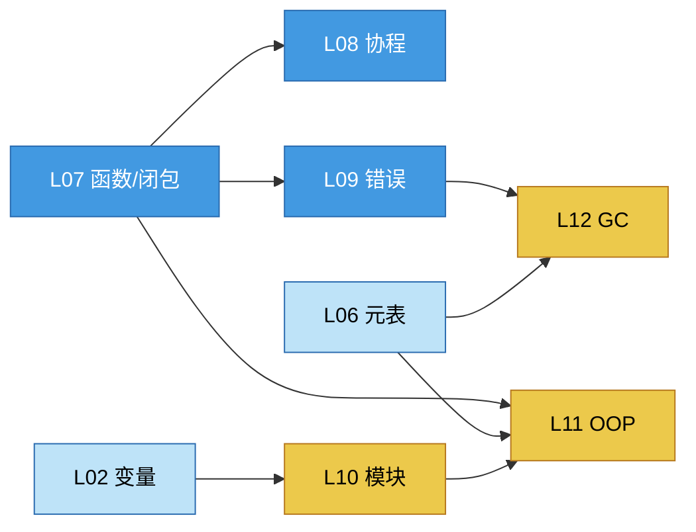

**Lua 抽象机制心智模型**：
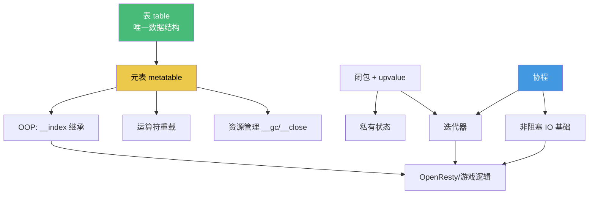

---

## 🔴 模块四：性能与嵌入（L13–L16）

```mermaid
graph TD
    L13[L13 LuaJIT JIT] --> L14[L14 FFI]
    L13 -.对比.-> L15[L15 C API]
    L14 -.Lua调C.-> Cworld[C 世界]
    L15 -.C嵌Lua.-> Cworld
    L16[L16 标准库] -.string.pack/utf8.-> L13

    classDef perf fill:#f56565,stroke:#c53030,color:#fff
    class L13,L14,L15,L16 perf
    classDef c fill:#a0aec0,stroke:#4a5568,color:#000
    class Cworld c
```

**LuaJIT 性能决策流**：
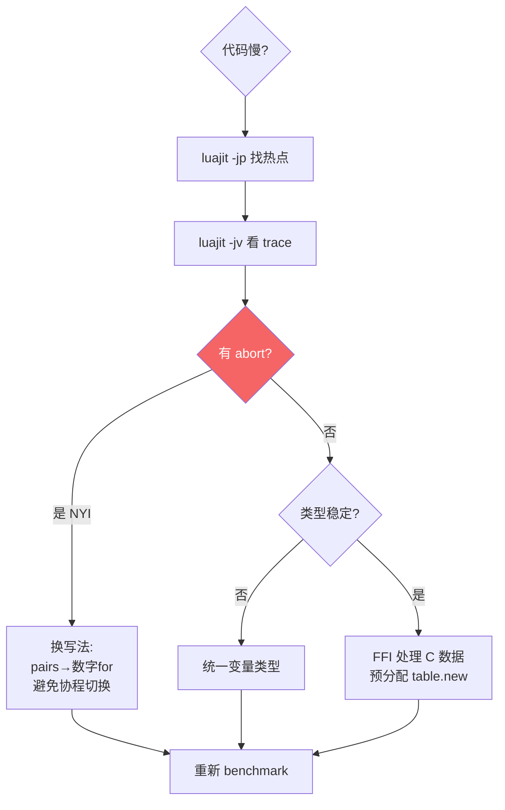

---

## 🟠 模块五：应用场景（L17–L25）

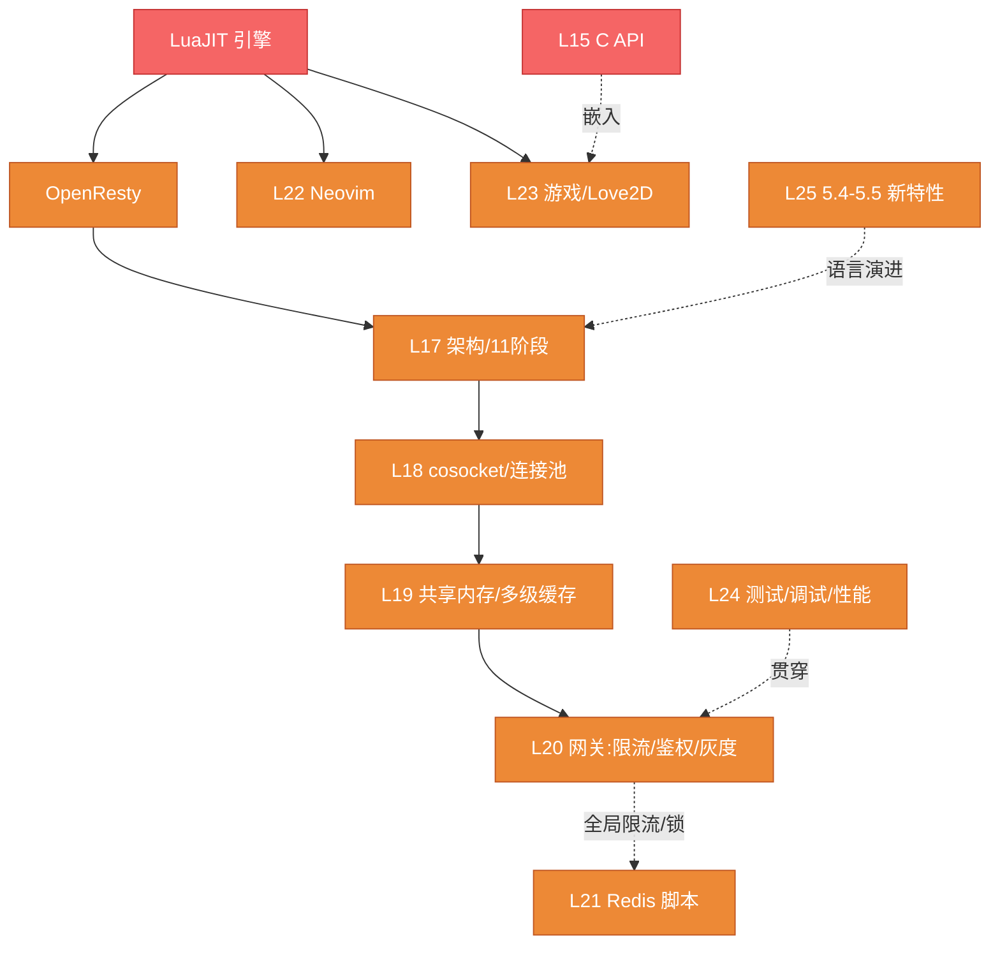

**OpenResty 请求生命周期（11 阶段）**：
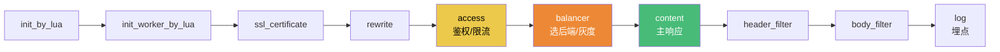

---

## 🎯 学习路径可视化

### 路径 A：完整通学（推荐）

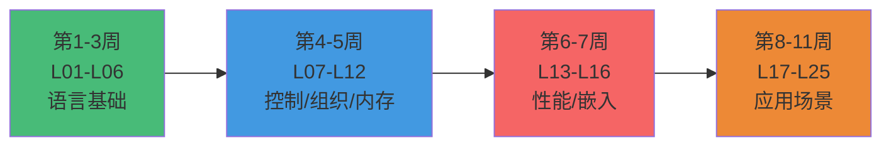

### 路径 B：OpenResty 工程师


### 路径 C：游戏 / 嵌入

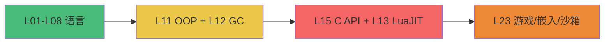

---

## 🧠 知识检索思维导图

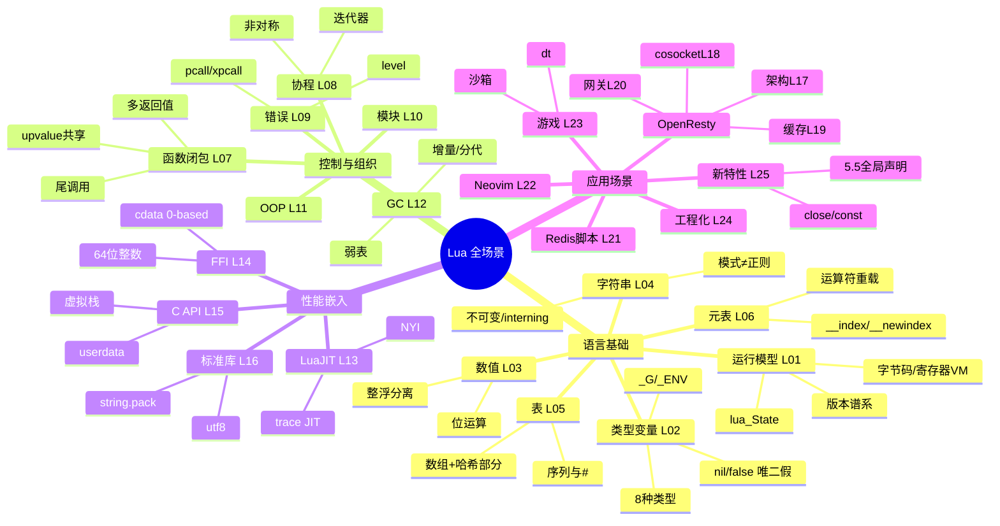

---

## 📊 难度与重要性矩阵

> 难度：⭐ 简单 → ⭐⭐⭐⭐⭐ 极难　重要性：🔥🔥🔥🔥🔥 必学 → 🔥 选学

### 必学 + 难（高优先级，花时间啃）

| 课程 | 难度 | 重要性 | 备注 |
|---|---|---|---|
| L06 元表 | ⭐⭐⭐⭐⭐ | 🔥🔥🔥🔥🔥 | Lua 抽象能力总开关 |
| L08 协程 | ⭐⭐⭐⭐⭐ | 🔥🔥🔥🔥🔥 | 迭代器 + OpenResty 非阻塞根基 |
| L05 表 | ⭐⭐⭐⭐ | 🔥🔥🔥🔥🔥 | 唯一数据结构、`#` 陷阱 |
| L13 LuaJIT | ⭐⭐⭐⭐⭐ | 🔥🔥🔥🔥 | NYI、性能模型 |
| L17 OpenResty | ⭐⭐⭐⭐ | 🔥🔥🔥🔥 | 进程/阶段/全局陷阱 |

### 必学 + 性价比高

| 课程 | 难度 | 重要性 | 备注 |
|---|---|---|---|
| L02 类型变量 | ⭐⭐⭐ | 🔥🔥🔥🔥🔥 | nil/false、全局陷阱 |
| L07 函数闭包 | ⭐⭐⭐⭐ | 🔥🔥🔥🔥🔥 | upvalue 共享、多返回值 |
| L09 错误处理 | ⭐⭐⭐⭐ | 🔥🔥🔥🔥 | pcall/level/资源安全 |
| L03 数值 | ⭐⭐⭐ | 🔥🔥🔥🔥 | 整浮分离、LuaJIT 差异 |

### 按方向选学

| 课程 | 难度 | 何时学 |
|---|---|---|
| L14 FFI | ⭐⭐⭐⭐⭐ | LuaJIT/OpenResty/64位整数 |
| L15 C API | ⭐⭐⭐⭐⭐ | 嵌入宿主/游戏引擎 |
| L18–L20 OpenResty 进阶 | ⭐⭐⭐⭐ | 网关/Web 工程 |
| L21 Redis 脚本 | ⭐⭐⭐⭐ | 分布式限流/锁 |
| L22 Neovim | ⭐⭐⭐ | 编辑器配置 |
| L23 游戏 | ⭐⭐⭐⭐ | 游戏/嵌入 |
| L24 工程化 | ⭐⭐⭐⭐ | 生产项目 |
| L25 新特性 | ⭐⭐⭐⭐ | 跟进语言演进 |

---

## 🔗 跨章知识连接

某些主题贯穿多章——理解"为什么"比死记每章更重要。

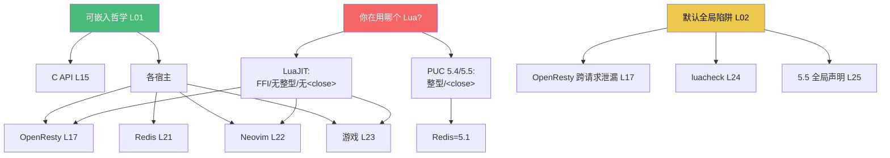

---

> 🔁 配套：[INDEX.md](./INDEX.md) 总目录 / [QUIZ.md](./QUIZ.md) 测验题（125 题）
