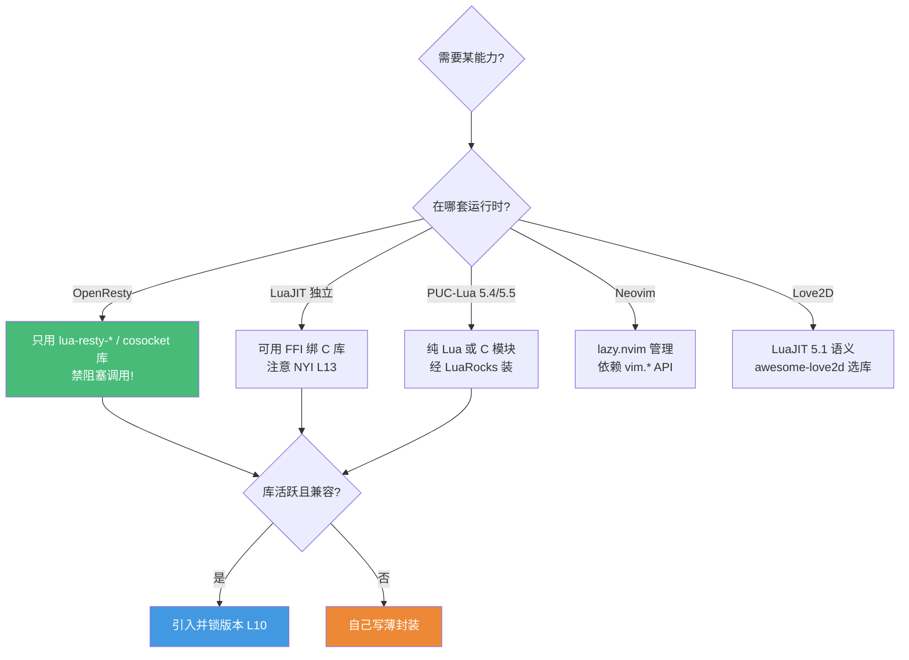

# Lua 生态库选型地图 · 2026 实战精选

> 配套《Lua 全场景深度课程》的生态补充篇
> **📅 内容基准：Lua 5.4.8 / 5.5.0 · LuaJIT 2.1（rolling）· OpenResty 1.27.x / 1.29.x**（2026-06）· 标注每个库的活跃度、**运行时归属**与选型建议
> 本课程主体讲透了**语言机制与三套运行时**，这一篇补上"真实项目里到底该用哪些第三方库"。

---

## 选型总原则：核心极简，能力靠宿主与库扩展

Lua 的设计哲学与 Go 截然相反——**Lua 核心刻意做到极小**（一个独立解释器 + 几个标准库），几乎所有"真实能力"（网络、文件、数据库、并发调度）都来自**宿主程序**或**第三方库**。所以 Lua 选型的第一问不是"标准库够不够用"，而是：

1. **我在哪套运行时上跑？** 这是 Lua 选型最特殊的一点。`lua-resty-*` 系列**只在 OpenResty 里能用**（依赖 cosocket/ngx API，L17–L19）；FFI 库**只在 LuaJIT 里能用**（PUC-Lua 无 FFI，L14）；Neovim 插件依赖 `vim.*` API，离开 Neovim 就是死代码。**先确定运行时，再谈库。**
2. **这个库还活着吗？** Lua 生态小而精，但也有大量"明星已死"的库。看最近提交、是否兼容你的 Lua 版本（很多库停在 5.1）。
3. **它的成本是什么？** 纯 Lua 可移植但慢；C 模块快但要编译、绑死 ABI；FFI 库零开销但脱离 PUC-Lua。OpenResty 里**任何阻塞调用都会卡死整个 worker**（L17/L18），所以网络库必须是 cosocket 实现的。

> 📐 **黄金法则**：Lua 选型 = **先定运行时，再定库**。同一个需求（如"连 PostgreSQL"），OpenResty 用 `pgmoon`，桌面脚本用 `luadbi`，二者不可互换。

> ⚠️ **三套运行时速记**：
> - **PUC-Lua**（官方实现，5.4/5.5）：最新语言特性、`<close>`/整型，但无 JIT、无 FFI。
> - **LuaJIT**（停在 5.1 语义 + 部分 5.2）：极快、有 FFI，但**永远到不了 5.4**。Love2D、OpenResty 底层都是它。
> - **OpenResty**：LuaJIT + Nginx + cosocket + `lua-resty-*` 全家桶，是独立的"Web 运行时"。

---

## 1. 包管理：LuaRocks vs opm

| 工具 | 用途 | 选型建议 | 2026 现状 |
|---|---|---|---|
| **LuaRocks** | 通用包管理 | **事实标准**，覆盖整个 Lua 世界；支持编译 C 扩展（rockspec 里写 C 源）；可用 `--lua-version=5.1` 装 LuaJIT/OpenResty 兼容版（L10）| 活跃，生态最大 |
| **opm**（OpenResty Package Manager）| OpenResty 专用包 | 仅收 OpenResty 相关包、采用 `作者/包名` 命名（如 `ledgetech/lua-resty-http`）；**只支持纯 Lua 包，不能编译 C** | 活跃但覆盖窄 |

**一句话选型**：OpenResty 官方文档虽"强烈不建议用 LuaRocks、推荐 opm"，但**现实是 opm 包覆盖率有限**（很多常用包不在其中），且无法装带 C 扩展的依赖（如 pgmoon 依赖的 lpeg）。**实务里两者并用**：纯 lua-resty 包用 `opm get`，其余（含 C 模块、跨生态库）用 `luarocks install`。绝大多数库**两个仓库都发布**。

---

## 2. OpenResty / lua-resty 生态（对应 L17–L20，重点）

> ⚠️ 本节所有库**仅在 OpenResty 内可用**，依赖 cosocket 非阻塞 IO（L18）。在普通 Lua/LuaJIT 里 `require` 它们会失败。

| 库 | 用途 | 选型建议 | 2026 现状 |
|---|---|---|---|
| **lua-resty-core** | FFI 版 ngx API | **OpenResty 1.15.8.1 起默认加载**，FFI 实现比旧 C API 更快更全；别手动装别的版本，用 OpenResty 自带的（L19）| 官方维护，捆绑 |
| **lua-resty-redis** | Redis 客户端 | 官方维护，cosocket 实现；**务必 `set_keepalive` 复用连接**（L18），并注意脚本走 `EVAL`（L21）| 活跃 |
| **lua-resty-mysql** | MySQL 客户端 | 官方维护，纯 cosocket；同样靠连接池 | 活跃 |
| **pgmoon** | PostgreSQL 驱动 | **OpenResty 下连 PG 的首选**，纯 Lua + cosocket 异步；亦可在普通 Lua（LuaSocket/cqueues）跑；新版自带 `PostgresPool` 连接池 | 活跃；**新 OpenResty 需 pgmoon ≥1.12** |
| **lua-resty-http** | HTTP 客户端 | **OpenResty 出站 HTTP 首选**，cosocket 实现，支持 chunked/keepalive/流式/mTLS（mTLS 需配 lua-resty-openssl）| 活跃（ledgetech，0.17.x）|
| **lua-resty-lock** | 互斥锁 | 基于 shared dict 的非阻塞锁，**防缓存击穿/惊群**的标配（L19）| 活跃 |
| **lua-resty-lrucache** | worker 级缓存 | 进程内 LRU，**不跨 worker**；常与 shared dict 组多级缓存（L19）| 官方维护，捆绑 |
| **lua-resty-jwt** | JWT 签发/校验 | 网关鉴权常用（L20）；签名校验底层走 OpenSSL | 社区维护 |
| **lua-resty-limit-traffic** | 限流 | 官方限流套件：`limit.req`（漏桶）、`limit.count`、`limit.conn`，配合 shared dict（L20）| 官方维护 |
| **lua-resty-dns** | DNS 解析 | 非阻塞 DNS 查询，做服务发现/动态 upstream 用 | 官方维护 |
| **lua-resty-openssl** | OpenSSL FFI 绑定 | **加密操作首选**：HMAC/摘要/X509/EC 等，支持 OpenSSL 3.x/1.1；JWT、mTLS、ACME 都依赖它 | 活跃（fffonion，1.7.x）|

**一句话选型**：OpenResty 网关三件套 = **lua-resty-redis + lua-resty-lock + lua-resty-lrucache**（多级缓存防击穿，L19）；鉴权 = **lua-resty-jwt + lua-resty-openssl**；限流直接上**官方 lua-resty-limit-traffic**（L20）；连 PG 用 **pgmoon**。**所有 cosocket 调用记得连接池 `set_keepalive`，否则每请求新建连接会拖垮性能。**

> 💡 想找更多 lua-resty 库？看 `awesome-resty` 列表（按类别整理了全部 OpenResty 生态）。若已用 **APISIX**（基于 OpenResty 的网关，L20），上述能力多已内置插件化。

---

## 3. JSON / 序列化

| 库 | 用途 | 选型建议 | 2026 现状 |
|---|---|---|---|
| **lua-cjson** | JSON 编解码 | **事实标准**，C 实现极快；OpenResty 自带 fork（默认启用，支持空表编码为 `[]`、`array_mt`）| 活跃，OpenResty 捆绑 |
| **lua-rapidjson** | JSON 编解码 | 基于 RapidJSON，超大 payload 更快、支持 SAX/Schema；需编译 | 活跃 |
| **dkjson** | 纯 Lua JSON | **无 C 依赖**、单文件，可移植性优先（嵌入式/沙箱）时用，但慢 | 稳定 |
| **serpent** | Lua 值序列化 | 把 Lua table 序列化为**可重新执行的 Lua 源码**，适合配置/调试/状态快照（非 JSON）| 稳定 |
| **lua-MessagePack** | MessagePack | 比 JSON 更小更快的二进制格式，纯 Lua 实现，跨语言传输用 | 稳定 |

**一句话选型**：默认 **lua-cjson**（OpenResty 里直接有）；空表歧义（`{}` 编成 `{}` 还是 `[]`）记得用 OpenResty fork 的 `array_mt` 或 `encode_empty_table_as_object`；不能装 C 模块时退 **dkjson**；存配置/做热重载快照用 **serpent**；二进制紧凑传输用 **lua-MessagePack**。

> ⚠️ **JSON 空表陷阱**：Lua 无法区分"空数组"和"空对象"（都是 `{}`）。这是 OpenResty fork lua-cjson 的核心增强点，跨服务对接前务必对齐。

---

## 4. Web 框架

| 库 | 用途 | 选型建议 | 2026 现状 |
|---|---|---|---|
| **Lapis** | OpenResty Web 框架 | **OpenResty 上写完整 Web 应用的首选**：路由 + ORM + 模板(etlua) + CSRF/session，Lua 或 MoonScript 编写；LuaRocks.org 自己就用它 | 活跃（leafo/Kong），production ready |
| **Sailor** | MVC 框架 | 传统 MVC 风格 Web 框架，可跑在多种 Lua 服务器上 | 维护放缓，谨慎用于新项目 |

**一句话选型**：OpenResty 上要完整 MVC + ORM → **Lapis**（注意装时用 `--lua-version=5.1` 对齐 LuaJIT）；只要轻量路由/网关逻辑，**直接写 `content_by_lua` + lua-resty-* 往往比框架更可控**（L20）。

---

## 5. 通用工具库

| 库 | 用途 | 选型建议 |
|---|---|---|
| **Penlight (pl)** | 通用工具集 | Lua 的"标准库扩展"：`pl.tablex`/`pl.stringx`/`pl.class`/`pl.path`/`pl.List` 等，弥补核心极简的不足——**通用脚本首选工具箱** |
| **luafun** | 函数式 | 惰性序列、map/filter/reduce 等函数式组合子，**LuaJIT 上零开销**（专为 trace 优化）|
| **inspect.lua** | 调试打印 | 把任意 table 漂亮地打印成可读结构，**调试神器**，单文件零依赖 |

**一句话选型**：写通用脚本缺工具就上 **Penlight**（一个库顶半个标准库）；LuaJIT 上做数据管道用 **luafun**（避开 NYI）；调试看 table 结构用 **inspect.lua**。

---

## 6. OOP 库（对应 L11）

| 库 | 用途 | 选型建议 |
|---|---|---|
| **middleclass** | 类系统 | **最流行**：简洁的 `class('Name')`、单继承、`super`、mixin；语义清晰、零魔法 |
| **classic** | 极简类系统 | 单文件、更轻，Love2D 圈常用 |

**一句话选型**：理解了 L11 的 `Class.__index = Class` 机制后，**多数项目其实手写一个 30 行的 class 函数就够**；要现成的就 **middleclass**（功能全）或 **classic**（极简）。游戏里 hump 也自带 `hump.class`。

> 💡 **别过度 OOP**：Lua 是多范式语言，table + 闭包 + 元表往往比硬套类继承更地道（L06/L07）。

---

## 7. 测试 / 质量

| 库 | 用途 | 选型建议 | 2026 现状 |
|---|---|---|---|
| **busted** | 单元测试 | **事实标准**：BDD 风格 `describe`/`it`、链式断言（`assert.not.equals`）；支持 5.1–5.4 + LuaJIT + MoonScript（L24）| 活跃（lunarmodules）|
| **luassert** | 断言库 | busted 内置的断言引擎，可单独用；支持自定义 matcher | 活跃 |
| **luacov** | 覆盖率 | 与 busted 配合出覆盖率报告（`busted --coverage`，L24）| 活跃 |
| **luacheck** | 静态检查/lint | **查未定义全局、未用局部变量**——OpenResty 防全局泄漏的命脉（L17/L24）；现由 lunarmodules 维护、已恢复活跃 | 活跃 |
| **stylua** | 代码格式化 | **Rust 写的确定性格式化器**，支持 Lua 5.1–5.4 + LuaJIT + Luau + CfxLua；带 LSP 模式 | 活跃（v2.5.x，2026）|
| **selene** | 静态检查（Rust）| luacheck 的 Rust 替代：更快、多线程、TOML 配置、lint 名可读；**对 Luau/Roblox 支持最佳**，但暂不支持 5.1 以上 | 活跃 |

**一句话选型**：测试一律 **busted**（+ luassert 断言 + luacov 覆盖率）；lint **普通 Lua/OpenResty 用 luacheck**（防全局泄漏不可替代），**Luau/Roblox 用 selene**；格式化全场景 **stylua**。

> ⚠️ **stylua + Luau 歧义坑**：默认 stylua 二进制合并了所有 Lua 方言语法，Lua 5.2 的 `::label::` 会和 Luau 的类型断言 `x :: number` 冲突（后者被吞）。Luau 项目务必在 `.stylua.toml` 里显式设 `syntax = "Luau"`。

---

## 8. HTTP / 网络

| 库 | 用途 | 选型建议 | 运行时 |
|---|---|---|---|
| **lua-resty-http** | HTTP 客户端 | OpenResty 出站请求**首选**（见 §2），cosocket 非阻塞 | **仅 OpenResty** |
| **luasocket** | TCP/UDP/HTTP | 老牌通用网络库，PUC-Lua/LuaJIT 通吃；但**阻塞式**，**绝不可用于 OpenResty** | PUC/LuaJIT |
| **lua-http** | HTTP/1+2 客户端/服务端 | 纯 Lua、支持 HTTP/2 + WebSocket + TLS，基于 cqueues 协程并发；OpenResty 外做现代 HTTP 时的选择 | PUC/LuaJIT |
| **copas** | 协程并发调度 | 用协程（L08）做非阻塞 IO 调度器，把 luasocket 变成并发服务器；OpenResty 外的"轻量异步" | PUC/LuaJIT |

**一句话选型**：在 OpenResty 里 → **lua-resty-http**（别用 luasocket，会阻塞 worker）；独立脚本简单请求 → luasocket；独立脚本要 HTTP/2/并发 → **lua-http + cqueues** 或 **copas**。

> ⚠️ **OpenResty 头号大坑**：在 OpenResty 里 `require "socket"`（luasocket）做请求会**阻塞整个 Nginx worker**，所有并发请求一起卡死（L17/L18）。网络库必须是 cosocket 实现的 `lua-resty-*`。

---

## 9. 游戏：Love2D（LÖVE）生态

> 运行时为 **LuaJIT（5.1 语义）**；学 Lua 配合 Love2D 时务必用 **5.1 兼容**资料，5.2+/5.3/5.4 特性不可用（L23）。

| 库 | 用途 | 选型建议 | 2026 现状 |
|---|---|---|---|
| **LÖVE (love2d)** | 2D 游戏框架 | **Lua 游戏开发首选**：跨 Win/macOS/Linux/Android/iOS，回调式游戏循环 + `dt`（L23）| 稳定 **11.5**；**12.0（Vulkan）开发中** |
| **hump** | 工具集 | gamestate / timer / tween / vector / camera / class / signal——Love2D 的"瑞士军刀" | 稳定 |
| **anim8** | 精灵动画 | 基于精灵表网格做帧动画（`newGrid` + `newAnimation`），简单直接 | 稳定 |
| **bump.lua** | 碰撞检测 | **AABB 碰撞首选**：`world` 抽象、滑动/弹跳响应，平台跳跃类标配（作者 kikito）| 稳定 |
| **HardonCollider (HC)** | 碰撞检测 | 支持**任意凸多边形**碰撞（非仅 AABB），需要旋转/复杂形状时用 | 稳定 |

**一句话选型**：游戏框架 = **LÖVE 11.5**（新项目稳起步，12.0 出再迁）；矩形碰撞 = **bump.lua**，多边形碰撞 = **HardonCollider**；动画 = **anim8**；状态机/相机/计时器 = **hump**。选库前刷一遍 `awesome-love2d` 列表。

> 💡 把 Lua 嵌进自研 C/C++ 引擎做脚本时（L15/L23），通常**禁用 FFI/io/os 做沙箱**——此时上面这些库未必适用，自己用 C API 暴露受控接口。

---

## 10. Neovim 生态

> 运行时为 Neovim 内置 LuaJIT，依赖 `vim.*` API（L22）；离开 Neovim 无意义。Neovim 0.11+ 已让很多配置原生化，插件需求减少。

| 库 | 用途 | 选型建议 | 2026 现状 |
|---|---|---|---|
| **lazy.nvim** | 插件管理 | **绝对主流**：`lua/plugins/` 自动发现、惰性加载（按命令/键位/事件/文件类型）、`lazy-lock.json` 锁版本可复现（L22）| 活跃，事实标准 |
| **telescope.nvim** | 模糊查找 | 文件/grep/命令面板三合一，底层用 ripgrep + fd；纯 Lua | 活跃 |
| **nvim-treesitter** | 语法解析 | Treesitter 结构化高亮/折叠/文本对象，众多插件的基础（`:TSUpdate`）| 活跃 |
| **nvim-lspconfig** | LSP 配置 | Neovim 内置 LSP 客户端的配置集合，与 mason 组队 | 活跃 |
| **plenary.nvim** | Lua 工具库 | 异步/路径/测试等基础工具，**众多插件的公共依赖**（包括 telescope）| 活跃 |
| **mason.nvim** | 工具安装器 | 跨平台装 LSP/DAP/linter/formatter 到 `~/.local/share`，与 mason-lspconfig 粘合 nvim-lspconfig | 活跃 |
| **nvim-cmp** | 补全引擎 | 老牌标准，外部 source（`cmp-nvim-lsp`）+ LuaSnip；稳定但有 debounce 延迟 | 活跃，**地位被 blink.cmp 挑战** |
| **blink.cmp** | 补全引擎 | **2026 上升首选**：内置 source、每键 0.5–4ms、抗错字模糊匹配；**LazyVim 已默认切到它** | 活跃（注意 v2 破坏性变更，可锁 `v1`）|
| **which-key.nvim** | 键位提示 | 输入前缀键时弹出可用快捷键，记键位神器 | 活跃 |

**一句话选型**：插件管理 **lazy.nvim**（锁 `lazy-lock.json`）；查找 telescope；语法 treesitter；LSP = **mason + mason-lspconfig + nvim-lspconfig** 三件套；补全 **新配置直接上 blink.cmp**（更快、内置 source），保守/已有大量 nvim-cmp 配置则留 nvim-cmp；plenary 多半被动引入。

> 💡 不想逐个装？**LazyVim** 发行版已把上面整套配好（默认 blink.cmp + mason + telescope + conform.nvim 保存即格式化）。

---

## 11. 数据库

| 库 | 用途 | 选型建议 | 运行时 |
|---|---|---|---|
| **lua-resty-redis / lua-resty-mysql** | Redis/MySQL | OpenResty 内首选（见 §2），cosocket 非阻塞 | **仅 OpenResty** |
| **pgmoon** | PostgreSQL | OpenResty 内连 PG 首选；亦可在普通 Lua 跑（见 §2）| OpenResty / PUC / LuaJIT |
| **luadbi** | 通用 DB 抽象 | PUC-Lua/LuaJIT 下的 DBI 风格抽象（PG/MySQL/SQLite3）；**阻塞式，不可用于 OpenResty** | PUC / LuaJIT |

**一句话选型**：OpenResty → **lua-resty-redis / lua-resty-mysql / pgmoon**；普通脚本/桌面应用 → **luadbi**（或直接 LuaSQL）。**再次强调：OpenResty 里只能用 cosocket 驱动，luadbi/LuaSQL 会阻塞 worker。**

---

## 12. 日期 / 文件系统 / 系统

| 库 | 用途 | 选型建议 |
|---|---|---|
| **luatz** | 时区/时间 | 纯 Lua 时区处理（解析 tz 数据库）、UTC 转换，**跨平台无 C 依赖**，处理时区首选 |
| **luaposix** | POSIX 绑定 | 暴露 POSIX API（fork/signal/syslog/termios 等），Unix 系统编程用；非纯 Lua |
| **luafilesystem (lfs)** | 文件系统 | **目录遍历/属性/mkdir 的事实标准**（核心 `io` 不含目录操作），几乎所有需要遍历目录的工具都依赖它 |

**一句话选型**：目录/文件元信息 → **luafilesystem (lfs)**（几乎必装）；时区计算 → **luatz**；Unix 系统调用 → **luaposix**。Neovim 里这些多被 `vim.uv`（libuv）取代（L22）。

---

## 🗺️ 场景 → 首选 速查

| 场景 | 2026 首选 | 备选 / 备注 |
|---|---|---|
| 包管理（通用）| **LuaRocks** | opm（仅 OpenResty 纯 Lua 包）|
| OpenResty Redis | lua-resty-redis | — |
| OpenResty 连 PG | **pgmoon** | — |
| OpenResty HTTP 出站 | **lua-resty-http** | （禁 luasocket）|
| OpenResty 限流 | **lua-resty-limit-traffic** | 自写 shared dict 令牌桶（L20）|
| OpenResty 防击穿 | lua-resty-lock + lrucache | mlcache（L19）|
| OpenResty 加密/JWT | lua-resty-openssl + lua-resty-jwt | — |
| JSON | **lua-cjson** | dkjson（纯 Lua）/ lua-rapidjson（大数据）|
| OpenResty Web 框架 | **Lapis** | 直接写 content_by_lua |
| 通用工具集 | **Penlight** | luafun（函数式/LuaJIT）|
| OOP | 手写 / **middleclass** | classic / hump.class |
| 单元测试 | **busted** | — |
| Lint | **luacheck**（普通）| **selene**（Luau）|
| 格式化 | **stylua** | — |
| 独立脚本 HTTP | lua-http / luasocket | copas（协程并发）|
| 游戏框架 | **LÖVE 11.5** | 12.0 开发中 |
| 游戏碰撞 | **bump.lua**（AABB）| HardonCollider（多边形）|
| Neovim 插件管理 | **lazy.nvim** | — |
| Neovim 补全 | **blink.cmp** | nvim-cmp |
| Neovim LSP | mason + lspconfig | — |
| 目录/文件操作 | **luafilesystem** | — |
| 时区 | **luatz** | — |

---

## ⚠️ 选型避坑清单

- ❌ **在 OpenResty 里用阻塞库**：luasocket / luadbi / LuaSQL / 阻塞式 redis 客户端会**卡死整个 worker**（L17/L18）。只用 `lua-resty-*` cosocket 库。
- ❌ **cosocket 不用连接池**：每请求新建 TCP 连接 → 性能崩盘。`lua-resty-redis`/`mysql`/`http` 后必须 `set_keepalive`（L18）。
- ❌ **以为 LuaJIT 能跑 5.4 特性**：LuaJIT 永远停在 5.1 语义 + 部分 5.2。`<close>`/整型/位运算符在 LuaJIT 下不存在或行为不同（L13/L25）。
- ❌ **在 LuaJIT 热路径用 NYI 操作**：`pairs`、`string.gsub` 回调等是 NYI，会中断 trace（L13）。FFI 库虽零开销，但 NYI 仍会拖慢——用 `-jv` 找 trace abort（L13/L24）。
- ❌ **跨运行时误用库**：把 `lua-resty-*` 装到普通 Lua、或把 Love2D 库塞进 OpenResty——`require` 直接失败或行为错乱。**先定运行时**。
- ❌ **JSON 空表不对齐**：`{}` 在 Lua 既是空数组也是空对象，lua-cjson 默认编为 `{}`。跨服务对接前用 `array_mt`/`encode_empty_table` 对齐（§3）。
- ❌ **stylua 格式化 Luau 不设 syntax**：会触发 `::label::` 与类型断言 `::` 的歧义，须 `syntax = "Luau"`（§7）。
- ❌ **依赖停在 5.1 的库却跑在 5.4**：Lua 生态大量库只测过 5.1，引入前确认版本兼容（尤其 `unpack` vs `table.unpack`、`#` 行为）。

---

## 📌 与课程章节的对应

| 课程章节 | 相关生态库 |
|---|---|
| L08 协程 | copas / lua-http(cqueues) — 协程驱动的非阻塞调度 |
| L10 模块/LuaRocks | LuaRocks / opm — 包管理 |
| L11 OOP | middleclass / classic / hump.class |
| L13 LuaJIT 性能 | luafun（避 NYI）/ 所有 LuaJIT 库（注意 NYI）|
| L14 FFI | lua-resty-core / lua-resty-openssl / pgmoon — 大量 FFI 实现 |
| L15 C API 嵌入 | 自研引擎沙箱（禁 FFI/io，L23）|
| L17–L20 OpenResty | lua-resty-redis/mysql/http/lock/lrucache/jwt/limit-traffic/dns/openssl · pgmoon · Lapis |
| L21 Redis 脚本 | lua-resty-redis（EVAL 入口）|
| L22 Neovim | lazy.nvim / telescope / treesitter / mason / lspconfig / blink.cmp / which-key / plenary |
| L23 游戏 | LÖVE / hump / anim8 / bump.lua / HardonCollider |
| L24 测试/质量 | busted / luassert / luacov / luacheck / stylua / selene |

---

> 🔁 **原则复述**：Lua 选型 = **先定运行时（PUC-Lua / LuaJIT / OpenResty / Neovim / Love2D），再选库** → 确认库**活跃、兼容你的 Lua 版本** → OpenResty 里只用 cosocket 非阻塞库 → 用 L10 锁版本、L24 用 luacheck/busted 把关。"核心极简、能力靠库扩展"是 Lua 的天性，但**跨运行时的库不可互换**，这是它和 Go"标准库优先"最大的不同。
>
> 📅 库的活跃度会随时间变化，引入前请上 GitHub 看最近提交与 issue 响应、确认 Lua 版本兼容，本篇基准为 2026-06（Lua 5.4.8/5.5.0 · LuaJIT 2.1 · OpenResty 1.27/1.29）。
