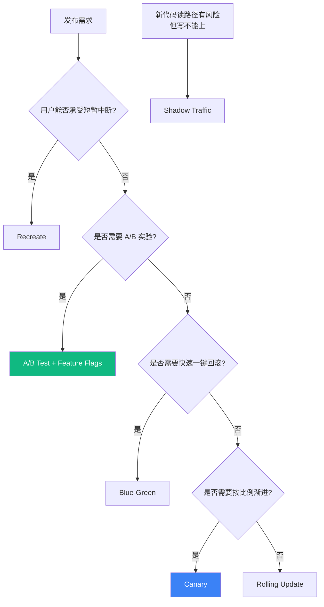
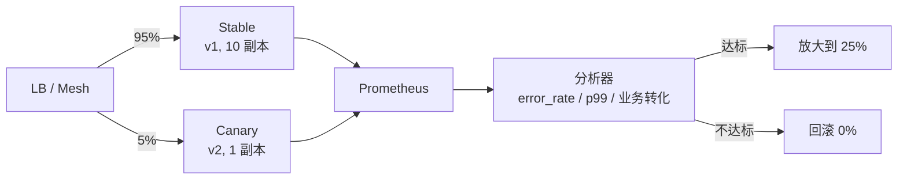
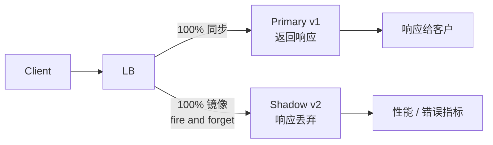
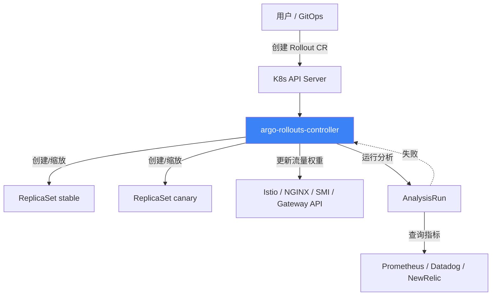
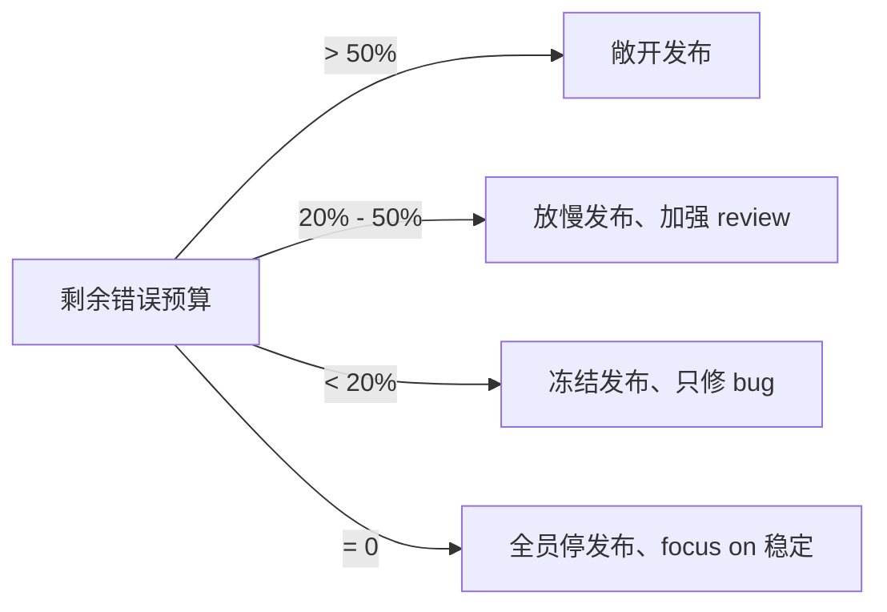

# 精通灰度发布与渐进式交付：Canary / Blue-Green / Feature Flags / Argo Rollouts
> 关联章节：[微服务 INDEX](./INDEX.md) · [服务网格](./15-精通-服务网格.md) · [可观测三支柱](./18-精通-可观测三支柱.md) · [GitOps](../cloud-native/C14-精通-GitOps.md)

> 课程编号：M19
> 路线图来源：微服务 · 模块七 发布与测试
> 难度：⭐⭐⭐⭐
> 预计阅读时间：90 分钟
> 内容基准：2026 年 6 月（Argo Rollouts 1.8+、Flagger 1.40+、Istio Ambient GA、GrowthBook 3.x、Unleash 6.x）

---

## 引言：发布是一项工程，不是一次操作

```bash
# 老派发布
ssh prod-host-1
sudo systemctl stop api
cp api-v2 /opt/api/api && sudo systemctl start api
# 看监控盘 5 分钟，没事就上下一台

# 现代发布
kubectl argo rollouts set image rollout/api api=registry/api:v2.3.1
# 之后流量在 10% → 25% → 50% → 100% 中按 SLO 自动推进
```

"发布"在 2010 年是个动词，在 2026 年是个**长达数小时甚至数天的过程**。微服务时代，一次"上线"早已不是 `cp + restart`，而是：

1. 镜像构建并打 tag
2. 部署新版本（不接流量或只接极少流量）
3. 用极小比例真实流量验证
4. 看错误率 / RT / 业务指标 / SLO
5. 不达标 → 自动回滚；达标 → 继续放大
6. 直到 100% 完成切换

这套流程的目标只有一个：**让"发布"不再是高风险事件**。Google SRE 书里有句话：发布失败的代价 = 错误率 × 暴露时间 × 流量。前两项你都可以通过发布策略压到接近零。

本章覆盖 6 种发布策略的本质差异、Canary 的核心机制、Argo Rollouts 与 Flagger 的工程实践、Feature Flags 与配置中心的边界、SLO 驱动的渐进式交付、影子流量、数据库变更的灰度技巧，以及 11 个生产陷阱。

读完应能独立设计一套"代码 commit 到全量生产"的渐进式交付流水线，并解释每一步的"安全保证"来自哪里。

---

## 第一章：6 种发布策略全景

### 1.1 策略矩阵

| 策略 | 同时存在版本数 | 流量切换粒度 | 资源开销 | 回滚速度 | 用户感知 | 用户级精度 | 适用场景 |
|---|---|---|---|---|---|---|---|
| Recreate（停机）| 1（中间 0）| 100% 一次切 | 1x | 慢（重新部署旧版）| 有中断 | 无 | 内部工具、开发环境 |
| Rolling Update | 1-2 混存 | 按 Pod 自然过渡 | 1.0-1.25x | 中（继续 rollout 旧版）| 短暂混合 | 无 | K8s 默认、无状态服务 |
| Blue-Green | 2 全量 | 一次切 100% | 2x | 极快（切 service）| 无 | 无 | 双向兼容数据库、关键服务 |
| Canary | 1 旧 + 极小新 | 逐步 1%→5%→25%→… | 1.05-1.5x | 快（缩回新版本）| 极少数 | 无 / 有（结合 header）| 默认推荐 |
| Shadow | 1 主 + 1 影子 | 100% 复制到影子 | 2x | 不需要 | 无（影子不返回）| 无 | 性能验证、新代码读路径验证 |
| A/B Test | 2 长期共存 | 按用户特征定 | 2x | 不需要 | 有意识到 | 完全可控 | 产品实验、UI 实验 |



### 1.2 Recreate（停机更新）

```yaml
spec:
  strategy:
    type: Recreate
```

机制：先把旧 Pod 全部杀掉，再创建新 Pod。中间会有一段"零可用"时间。

适用场景极其有限：
- 内部管理后台
- 开发环境
- 数据迁移工具（不能新旧并存）
- StatefulSet 的某些特殊场景

为什么不能用于生产 API：客户的请求会在那几十秒里 5xx，SLA 立刻吃亏。

### 1.3 Rolling Update（K8s 默认）

```yaml
spec:
  strategy:
    type: RollingUpdate
    rollingUpdate:
      maxUnavailable: 25%   # 允许有 25% Pod 暂时不可用
      maxSurge: 25%         # 允许多创建 25% Pod
```

机制：K8s 一个一个（或一批一批）创建新 Pod、删除旧 Pod，过程中新旧 Pod **共享同一个 Service**，流量按 endpoint 数量比例自然分配。

优点：零额外资源、原生支持。

致命缺陷（这也是为什么需要 Canary）：
- **流量切换粒度等于 Pod 数量**。10 个 Pod，第一个新 Pod 上线就是 10% 流量
- **没有"暂停"概念**——一旦开始就一路滚到底
- **没有"指标判断"**——只看 Pod 健康，不看错误率
- **回滚需要再触发一次 rollout**，慢

`kubectl rollout` 命令族在 2026 年依然是兜底，但**任何带业务影响的服务都应该用 Argo Rollouts / Flagger 这一类增强 controller**。

### 1.4 Blue-Green（蓝绿）

```text
LB / Ingress
  ↓
  ├── selector: version=blue  (生产 v1)
  └── selector: version=green (预发 v2)

切换：把 selector 从 blue 改成 green，1 秒完成
回滚：再改回去，1 秒完成
```

适用场景：
- 数据库 schema 兼容（同时能服务两个版本读写）
- 集群有 2x 资源
- 需要随时秒级回滚

陷阱：
- **会话粘性**：连接到 blue 的长连接（gRPC / WebSocket / SSE）不会立刻迁移到 green，需要在网关层做 connection draining
- **数据库迁移**：如果 v2 写了 v1 不认识的字段，回滚时数据已经被污染了（详见第十章数据库灰度）
- **缓存**：缓存命中可能让"旧实例继续读到旧数据"的假象

### 1.5 Canary（金丝雀，重点）

金丝雀来自 19 世纪矿工的故事：矿井里带一只金丝雀，它对一氧化碳极敏感，先死的是它而不是矿工。在软件发布中：让极少数请求先"探坑"。



核心机制 3 件套：
1. **流量分配**：靠 service mesh（Istio VirtualService）/ Ingress（NGINX canary）/ SDK（客户端发现按权重）/ 服务网格的 traffic split
2. **指标观察**：在每一步暂停，自动跑指标对比（baseline vs canary）
3. **自动决策**：达标推进 / 不达标回滚

### 1.6 Shadow（影子流量）



- 真实流量被**复制**一份到 v2，v2 的响应**不返回给客户端**
- 用于：性能压测、读路径风险验证、机器学习模型对比
- **写操作不能用 shadow**，会双写
- Istio 的 `mirror` 字段、Linkerd 的 traffic split with `weight: 0` + mirror 都能实现

### 1.7 A/B Test

A/B 与 Canary 在工具上常常重叠，但**本质完全不同**：

| 维度 | Canary | A/B Test |
|---|---|---|
| 目的 | 验证"新版本是否能上"| 验证"哪个版本业务效果更好" |
| 分组依据 | 随机比例 | 用户属性（地域、登录态、付费等级、Cookie）|
| 持续时间 | 小时级（验完就推全量）| 周 / 月级（要积累统计显著性）|
| 同时存在版本 | 1 主 + 1 候选 | 2-N 个长期版本 |
| 关键指标 | 错误率、RT | 业务指标（转化率、留存、ARPU）|
| 回滚标准 | 错误率超阈值 | 实验结束后选 winner |

A/B 测试的核心工具不是 Argo Rollouts，而是 **Feature Flags + 实验平台**（GrowthBook / Optimizely / LaunchDarkly Experimentation）。

---

## 第二章：Canary 的核心机制

### 2.1 流量分配的三种实现

**方案 A：服务网格层（Istio / Linkerd）**

```yaml
apiVersion: networking.istio.io/v1
kind: VirtualService
metadata:
  name: api
spec:
  hosts: [api]
  http:
  - route:
    - destination:
        host: api
        subset: stable
      weight: 95
    - destination:
        host: api
        subset: canary
      weight: 5
```

特点：与应用解耦，可按 header / 用户 ID 等精确分流。**推荐**。

**方案 B：Ingress / 网关层**

```yaml
# NGINX Ingress 的 canary annotation
metadata:
  annotations:
    nginx.ingress.kubernetes.io/canary: "true"
    nginx.ingress.kubernetes.io/canary-weight: "5"
    # 或按 header
    # nginx.ingress.kubernetes.io/canary-by-header: "x-canary"
```

特点：只能在外部入口分流，**服务间调用无效**。如果你的 canary 服务在调用链中间，这条路走不通。

**方案 C：客户端 SDK 按权重选实例**

服务发现 SDK（Spring Cloud LoadBalancer、Go-Kit selector）按 metadata 中的 version 标签按权重选实例。特点：完全自主，但每个语言栈都要实现一遍，**已经过时**（2018 年的主流，2026 年只在没有 mesh 的存量系统里看到）。

### 2.2 指标观察：什么算"出问题"

四类指标必看，按优先级：

| 类别 | 典型指标 | 阈值参考 | 备注 |
|---|---|---|---|
| 可用性 | HTTP 5xx 率、gRPC error 率 | < 0.1% / < 基线的 1.2x | 最硬的红线 |
| 时延 | p50、p95、p99 | p99 < 基线 × 1.5 | p99 比平均更敏感 |
| 饱和度 | CPU、内存、GC、连接池 | < 80% | 防止"短时通过但快撑爆" |
| 业务 | 转化率、下单成功率、登录成功率 | 不低于基线 5% | 反映客户真实感受 |

**比较两组指标的方式**：不要拿"canary 的绝对值"和"目标 SLO"比，而是拿"canary 的指标"和"同时刻的 stable 的指标"比（同环境同流量，最公平）。这就是 Argo Rollouts 的 **Analysis with baseline vs canary** 模式。

### 2.3 自动回滚

```text
错误率连续 3 个采样周期 (每周期 30s) 高于阈值
  → 触发 abort
  → 把流量调回 0%
  → ReplicaSet 缩容 canary
  → 告警 + 留下报告
```

回滚的"自动"必须谨慎：
- 阈值设太低，正常波动也会回滚（false positive）
- 阈值设太高，真问题混过去（false negative）
- 推荐用**统计显著性**判断（如 Mann-Whitney U test），Flagger 内置支持

---

## 第三章：Argo Rollouts 深度

Argo Rollouts 是 ArgoCD 团队（Intuit）开发的渐进式发布 controller，2026 年是 K8s 上 canary 的事实标准之一。

### 3.1 架构



控制器维护 **2 个 ReplicaSet**（stable + canary），不需要你管。

### 3.2 Rollout CR：核心字段

```yaml
apiVersion: argoproj.io/v1alpha1
kind: Rollout
metadata:
  name: api
spec:
  replicas: 10
  strategy:
    canary:
      canaryService: api-canary       # 必须预先存在的 Service
      stableService: api-stable
      trafficRouting:
        istio:
          virtualService:
            name: api
            routes: [primary]
      steps:
      - setWeight: 5
      - pause: {duration: 5m}
      - analysis:
          templates:
          - templateName: success-rate
          args:
          - name: service-name
            value: api-canary
      - setWeight: 25
      - pause: {duration: 10m}
      - analysis:
          templates: [{templateName: success-rate}]
      - setWeight: 50
      - pause: {duration: 15m}
      - setWeight: 100
  selector:
    matchLabels:
      app: api
  template:
    metadata:
      labels:
        app: api
    spec:
      containers:
      - name: api
        image: registry/api:v2.3.1
```

关键字段：
- `steps`: 按顺序执行的步骤列表，最常见为 `setWeight` / `pause` / `analysis` / `experiment` 四种
- `pause: {}` 无 duration 是**手动暂停**（必须 `kubectl argo rollouts promote` 才推进），生产关键服务推荐第一步用这个
- `analysis`: 关键自动决策点（见 3.3）
- `trafficRouting`: 不写就是按 ReplicaSet 副本数比例分流（粒度粗），生产推荐写

### 3.3 AnalysisTemplate（最关键的部分）

```yaml
apiVersion: argoproj.io/v1alpha1
kind: AnalysisTemplate
metadata:
  name: success-rate
spec:
  args:
  - name: service-name
  metrics:
  - name: success-rate
    interval: 30s
    count: 5
    successCondition: result[0] >= 0.99
    failureLimit: 3
    provider:
      prometheus:
        address: http://prometheus.monitoring.svc.cluster.local:9090
        query: |
          sum(rate(
            istio_requests_total{destination_service=~"{{args.service-name}}.*", response_code!~"5.."}[1m]
          ))
          /
          sum(rate(
            istio_requests_total{destination_service=~"{{args.service-name}}.*"}[1m]
          ))
```

参数解读：
- `interval: 30s` `count: 5`：每 30 秒取一次，取 5 次（共 2.5 分钟）
- `successCondition: result[0] >= 0.99`：5 次都满足才算 success
- `failureLimit: 3`：3 次失败就 abort

**Inconclusive 判定**：除了 success / failure 还有 inconclusive（指标没数据）。生产推荐显式处理：

```yaml
inconclusiveLimit: 2          # 连续 2 次 inconclusive 当失败
```

### 3.4 Experiment：并行实验

`Experiment` CR 让你**临时**起一组 Pod 做实验：

```yaml
spec:
  duration: 30m
  templates:
  - name: baseline
    specRef: stable
    replicas: 1
  - name: candidate
    specRef: canary
    replicas: 1
  analyses:
  - templateName: latency-comparison
    args: [...]
```

适用场景：两套配置参数对比、新算法对比，**做完即销毁**。

### 3.5 与 ArgoCD 协同

ArgoCD 会把 Rollout CR 当成"只是一个 K8s 资源"管。但 Rollout 内部的状态变化（如手动 promote）属于"集群侧操作"，**不属于 Git 真相**。处理方式：

```yaml
# argocd Application 的 ignoreDifferences
spec:
  ignoreDifferences:
  - group: argoproj.io
    kind: Rollout
    jsonPointers:
    - /spec/template/spec/containers/0/image  # 让 image 由 Rollout 自己管
```

镜像更新走另一条路（Argo Image Updater 或 PR-based）。

---

## 第四章：Flagger 深度

Flagger 由 Weaveworks 开发，2025 年由 Stefan Prodan 维护，强项是**自动化程度更高**和**与 Helm 的天然集成**。

### 4.1 与 Argo Rollouts 的取舍

| 维度 | Argo Rollouts | Flagger |
|---|---|---|
| CR 模型 | 用 Rollout 替换 Deployment | 在原 Deployment 上加 Canary CR |
| 流量分配后端 | Istio / Linkerd / SMI / Nginx / ALB / Traefik / Gateway API | Istio / Linkerd / Contour / NGINX / Gloo / Skipper / AppMesh |
| UI | 自带 dashboard | 无内置 UI，靠 Grafana |
| 实验 | Experiment CR | Webhook + Load Tester |
| GitOps 兼容性 | 与 ArgoCD 天然 | 与 Flux 天然 |
| 自动渐进 | 是 | 是，更"开箱即用" |
| 复杂场景 | 灵活，可写脚本 | 配置驱动 |

经验法则：用 ArgoCD 选 Argo Rollouts，用 Flux 选 Flagger，两者技术上都能跨。

### 4.2 Flagger Canary CR

```yaml
apiVersion: flagger.app/v1beta1
kind: Canary
metadata:
  name: api
spec:
  targetRef:
    apiVersion: apps/v1
    kind: Deployment
    name: api
  service:
    port: 80
    targetPort: 8080
  analysis:
    interval: 1m
    threshold: 5             # 连续 5 次失败回滚
    maxWeight: 50
    stepWeight: 10
    metrics:
    - name: request-success-rate
      thresholdRange:
        min: 99
      interval: 1m
    - name: request-duration
      thresholdRange:
        max: 500             # ms
      interval: 30s
    webhooks:
    - name: load-test
      url: http://flagger-loadtester.test/
      timeout: 5s
      metadata:
        cmd: "hey -z 1m -q 10 -c 2 http://api-canary.test/"
```

Flagger 会自动创建 `api-primary` 和 `api-canary` 两个 deployment + service，并按 `stepWeight` 渐进。

### 4.3 Flagger 内置的 webhook 阶段

| 阶段 | 何时触发 | 典型用途 |
|---|---|---|
| confirm-rollout | 推进前 | 人工审批 |
| pre-rollout | canary 部署前 | DB 迁移前置检查 |
| rollout | canary 流量切换中 | **跑负载测试** |
| confirm-promotion | 推全前 | 人工最后确认 |
| post-rollout | 全量后 | 通知 / 清理 |
| rollback | 回滚时 | 通知 / 创建 incident |
| event | 任何状态变化 | 通知到 Slack |

---

## 第五章：Feature Flags 详解

### 5.1 与配置中心的差异

很多人把 Feature Flags 和配置中心混为一谈，**它们解决不同问题**：

| 维度 | 配置中心（Apollo / Nacos）| Feature Flags（LaunchDarkly / GrowthBook）|
|---|---|---|
| 关注点 | "参数是什么" | "对谁开启什么" |
| 数据形态 | key-value | 规则集 + 用户上下文求值 |
| 用户分组 | 一般无 | 一等公民（按地域 / 角色 / 付费等级 / 任意属性）|
| A/B 实验 | 不支持 | 内置 |
| 评估时机 | 启动时 / 周期性拉取 | 每次请求（带用户上下文）|
| 性能 | 高（本地缓存）| 高（本地 SDK 求值，配置变更推送）|
| 典型用途 | 数据库连接串 / 限流参数 | 功能开关 / 渐进式 rollout / 实验 |

### 5.2 Feature Flag 的 4 种典型用法

**1) Release Flag（发布开关）**：新功能上线前用 flag 包住，发布到生产后默认关，然后通过 flag 控制对哪部分用户打开。**这是真正的"代码部署 ≠ 功能发布"**。

```go
if ff.IsEnabled("new-checkout", user) {
    return newCheckout(req)
}
return oldCheckout(req)
```

**2) Experiment Flag（实验开关）**：A/B 实验用，关注业务指标。

**3) Ops Flag（运维开关）**：紧急情况关闭某功能（kill switch），如服务过载时关掉非核心功能。

**4) Permission Flag（权限开关）**：付费功能 / 早期访问，长期存在。

### 5.3 主流方案

| 方案 | 类型 | 特点 |
|---|---|---|
| LaunchDarkly | SaaS | 行业标准，贵，体验最好 |
| GrowthBook | 开源 + SaaS | 2026 实验功能最强的开源方案 |
| Unleash | 开源 + SaaS | 简单成熟，自部署易 |
| FF4j | 开源 Java | Java 生态首选 |
| OpenFeature | CNCF Incubating | **SDK 标准**（不是后端），可对接多个 provider |

**2026 推荐 stack**：OpenFeature SDK（语言无关）+ GrowthBook（自部署后端）。

### 5.4 客户端 SDK 求值原理

```text
Server 端启动：
  ├── 拉取所有 flag 规则到本地（JSON）
  └── 订阅变更（SSE / Polling）

每次请求：
  └── ff.IsEnabled("new-checkout", {userId:'u123', country:'CN', plan:'pro'})
       ├── 找 flag 规则
       ├── 按规则求值（与 server 通信无关）
       └── 返回 bool
```

关键设计：求值在 SDK 本地完成，**不依赖网络**。即使后端挂掉，本地缓存依旧能工作（降级到上次的规则）。

### 5.5 技术债：Flag 清理

每个临时 flag 都是技术债。生产经验：
- 每个 Release flag 必须有 **TTL**（如 30 天）
- 到期 CI 失败，强制开发者要么转 permanent，要么删 flag
- 监控"过期 flag 数量"作为代码债指标

---

## 第六章：SLO 驱动的渐进式交付

### 6.1 核心概念

```text
SLI（Service Level Indicator）：测量值，如错误率
SLO（Service Level Objective）：目标，如 99.9% 成功
SLA（Service Level Agreement）：合同，违约赔钱
Error Budget：1 - SLO，可以"烧"的预算
```

如果 SLO = 99.9% 月成功率，月内 30 天 × 24 小时 × 60 分钟 = 43200 分钟，错误预算 = 43.2 分钟"完全不可用"。

### 6.2 错误预算决定能不能发



这就是 Google SRE 的"错误预算政策（Error Budget Policy）"。在大公司这是**写进流程的硬规则**：错误预算耗尽，CTO 也不能批准发新功能。

### 6.3 Burn Rate 告警

```promql
# 1 小时错误率 > 14.4 × 0.1% 表示 1 小时烧掉 2% 预算（30 天预算）
1 - (
  sum(rate(http_requests_total{code!~"5.."}[1h]))
  /
  sum(rate(http_requests_total[1h]))
) > 14.4 * 0.001
```

不同 burn rate 对应不同响应：

| 时间窗口 | Burn rate | 预算消耗 | 响应 |
|---|---|---|---|
| 1h | 14.4x | 2% / 1h | Page (吵醒人) |
| 6h | 6x | 5% / 6h | Page |
| 1d | 3x | 10% / 1d | Ticket |
| 3d | 1x | 10% / 3d | Ticket |

---

## 第七章：Shadow Traffic（影子流量）

### 7.1 Istio 实现

```yaml
apiVersion: networking.istio.io/v1
kind: VirtualService
spec:
  http:
  - route:
    - destination:
        host: api-v1
      weight: 100
    mirror:
      host: api-v2
    mirrorPercentage:
      value: 100.0     # 镜像 100% 流量
```

`mirror` 流量是 **fire-and-forget**：复制请求到 api-v2，等 v2 响应但**丢弃**，原响应来自 v1。

### 7.2 注意事项

- **必须只读**：影子复制是真实流量，如果触发写（DB / 消息 / 调用第三方付费 API），会产生**副作用**
- **下游放大**：v2 也会调用下游服务，下游会"双倍流量"——评估容量
- **资源消耗**：v2 集群至少要能扛住真实流量
- **trace**：mirror 流量打上 `x-shadow: true` header，下游服务识别后跳过有副作用的操作

### 7.3 案例：新版 ML 推理服务

```text
v1：旧推理服务（稳定，但慢）
v2：新模型推理服务（快，但准确率未知）

Shadow 流量复制 7 天：
  ├── v2 与 v1 准确率对比（业务指标）
  ├── v2 p99 时延对比
  └── v2 在生产真实数据分布下的内存峰值

7 天后：
  └── 数据达标 → 切 Canary 上 v2
```

---

## 第八章：灰度的关键指标

### 8.1 三层指标

```text
基础层（必看）：
  ├── HTTP 5xx 率 / gRPC error code 分布
  ├── p50/p95/p99 时延
  ├── CPU / Mem / GC time
  └── 重启次数 / OOM 计数

业务层（必看）：
  ├── 关键 API 成功率（业务定义，不是 HTTP 200）
  ├── 转化率 / 下单成功率 / 登录成功率
  └── 队列消费速率（如果是 worker）

下游层（推荐）：
  ├── canary 调用下游的错误率
  ├── canary 调用 DB 的慢查询比例
  └── canary 发出的消息量与基线对比
```

### 8.2 比较的统计学

**错误做法**：取 5 分钟窗口的指标均值，比较绝对值。

**正确做法**：使用**统计假设检验**判断 canary 是否"显著差于" stable：

```text
H0: canary 与 stable 没有显著差异
H1: canary 显著差于 stable

Mann-Whitney U test (非参数)：
  对最近 5 分钟内 stable / canary 的 p99 样本做检验
  p-value < 0.05 → 拒绝 H0，回滚
```

Flagger 内置支持，Argo Rollouts 需要写脚本。

### 8.3 灰度可见性 dashboard

每个 canary 必须有"双面板"：

```text
[ Stable ]                 [ Canary ]
错误率: 0.02% ↓           错误率: 0.04%  ↓ ★
p99:    320ms             p99:    340ms ★
CPU:    45%               CPU:    48%
QPS:    1.2k              QPS:    60 (5%)
```

`★` 表示差异显著。一眼判断要不要继续推进。

---

## 第九章：回滚策略

### 9.1 三种回滚模式

| 模式 | 触发 | 速度 | 适用 |
|---|---|---|---|
| 自动 | AnalysisRun 失败 | 秒级 | 默认推荐 |
| 半自动 | 告警+人工 abort | 分钟级 | 高风险变更 |
| 手动 | 人工判断 | 分钟到小时 | 重大变更 |

### 9.2 部分回滚

不全部回滚，只在某些维度回滚：

```text
全量 100% v2 后，发现：
  ├── 80% 用户 OK
  └── 20% 老安卓用户 5xx

解决：
  ├── 不回滚 deployment
  └── 在 ff 中关闭 "old-android" 用户的新功能
```

Feature Flags 让"部分回滚"成为可能——你不一定要回滚 deployment，只回滚某个功能对某群用户。

### 9.3 不能回滚的情况

**一旦做了下面的操作，回滚没用**：
- DB schema 变更（删字段）
- 消息格式不兼容（v2 发出了 v1 不认识的事件）
- 第三方 API 调用产生了副作用（钱已经扣了）
- 数据被重新加工写回（覆盖了旧数据）

这意味着发布的"安全策略"必须前置：**任何变更都先做向后兼容版本**，确认稳定再做下一步。详见第十章。

---

## 第十章：数据库变更的灰度

数据库变更是灰度的最大盲区。代码可以回滚，**数据回不来**。

### 10.1 Expand and Contract 模式（推荐）

任何 schema 变更都拆成三步：

```text
1. Expand: 加新字段/表，旧代码不知道，新代码可选用
2. Migrate: 数据迁移 + 代码切换到新字段
3. Contract: 旧字段不再被使用，过段时间删除
```

例子：把 `user.name`（单字段）拆成 `first_name` + `last_name`。

| 阶段 | DB 变更 | 代码版本 | 读 | 写 |
|---|---|---|---|---|
| v1（原始）| name | 老代码 | name | name |
| v2 expand | name + first_name + last_name（可空）| 同时支持读写两套 | 新字段为空时回退到 name | **双写**，name 与拆分后字段同步 |
| v3 migrate | 同上 + 离线脚本回填 | 优先读拆分字段 | 拆分字段，失败回退 name | 双写 |
| v4 转移 | 同上 | 只读写拆分字段 | first_name + last_name | first_name + last_name |
| v5 contract | drop column name | 同上 | 同上 | 同上 |

每个版本都**向后兼容**，回滚都安全。

### 10.2 不可逆变更的"硬熔断"

某些操作天然不可回滚：

- `DROP TABLE`
- `DROP COLUMN`
- `ALTER COLUMN type`（如果旧类型不能容纳新类型的所有值）
- 任何"对存量数据做有损改造"的 UPDATE

对应实践：
- **生产 DDL 走 PR + Review**（不是 dev 直连）
- **DDL 部署前自动 backup**
- **任何 `DROP`/`DELETE` 至少有 7 天的可回滚窗口**（先 rename，确认无引用后 drop）

### 10.3 Online Schema Change 工具

- gh-ost（GitHub 出品，MySQL）
- pg_repack / pg-osc（PG）
- pt-online-schema-change（Percona toolkit）

它们用**影子表 + trigger 同步 + 切换**的方式做 DDL，不锁表。

---

## 第十一章：案例：基于 Argo Rollouts + Prometheus 的自动金丝雀流水线

### 11.1 目标

电商订单服务，30 个 Pod，日 5000 万订单。要求：
- 每次发布从 5% → 100% 渐进，全程 30 分钟
- 错误率超 0.5% 自动回滚
- p99 超基线 1.5x 自动回滚
- 业务下单成功率掉 2% 自动回滚

### 11.2 Rollout 定义

```yaml
apiVersion: argoproj.io/v1alpha1
kind: Rollout
metadata:
  name: order-svc
  namespace: orders
spec:
  replicas: 30
  strategy:
    canary:
      canaryService: order-svc-canary
      stableService: order-svc-stable
      trafficRouting:
        istio:
          virtualService:
            name: order-svc
      analysis:
        templates:
        - templateName: success-rate
        - templateName: latency-p99
        - templateName: order-success-rate
        args:
        - name: service-name
          value: order-svc-canary
        - name: baseline-service
          value: order-svc-stable
        startingStep: 1
      steps:
      - setWeight: 5
      - pause: {duration: 5m}
      - setWeight: 25
      - pause: {duration: 10m}
      - setWeight: 50
      - pause: {duration: 10m}
      - setWeight: 100
  selector:
    matchLabels:
      app: order-svc
  template:
    metadata:
      labels:
        app: order-svc
    spec:
      containers:
      - name: order-svc
        image: registry/order-svc:VERSION
        readinessProbe:
          httpGet: {path: /readyz, port: 8080}
```

### 11.3 AnalysisTemplate

```yaml
apiVersion: argoproj.io/v1alpha1
kind: AnalysisTemplate
metadata:
  name: order-success-rate
spec:
  args:
  - name: service-name
  - name: baseline-service
  metrics:
  - name: business-success-rate
    interval: 1m
    count: 5
    successCondition: result[0] >= result[1] * 0.98     # canary 不低于 baseline 的 98%
    failureLimit: 3
    provider:
      prometheus:
        address: http://prometheus:9090
        query: |
          (
            sum(rate(order_created_total{service="{{args.service-name}}"}[1m]))
            /
            sum(rate(order_request_total{service="{{args.service-name}}"}[1m]))
          )
          and
          (
            sum(rate(order_created_total{service="{{args.baseline-service}}"}[1m]))
            /
            sum(rate(order_request_total{service="{{args.baseline-service}}"}[1m]))
          )
```

### 11.4 GitOps 流水线

```text
开发者推代码
  ↓
CI 构建镜像，打 tag v2.3.4
  ↓
CI 写 PR：更新 manifest 里 image tag
  ↓
PR merge 到 main
  ↓
ArgoCD reconcile 到生产集群
  ↓
Argo Rollouts 接管：
  ├── 5% 流量到 canary (5min)
  ├── 跑 AnalysisRun
  ├── 通过 → 25%
  ├── 通过 → 50%
  └── 通过 → 100%
  
任一步不通过 → 自动 abort → 缩容 canary → Slack 告警
```

---

## 生产实践

1. **Canary 第一步 5% 不能再小**。再小（如 0.1%）样本量不够，statistics 没意义。
2. **每个发布有"金丝雀复盘 5 分钟"**。哪怕全自动跑过了，看一眼 dashboard，养肌肉记忆。
3. **AnalysisTemplate 跑在 stable 流量上**（不是 canary 流量）。如果连 stable 都跑不过，说明告警阈值有问题。
4. **手动 pause 必备**。第一次发布到生产的服务、节假日变更、跨大版本，第一步用 `pause: {}`（无 duration）等人工确认。
5. **canary Service 暴露独立 metric label**。Prometheus 查询能区分 stable / canary 是一切自动分析的前提。
6. **小服务也用 Rollouts**。即使只有 3 个 Pod，Rollouts 也能在比例 33% / 66% / 100% 上做分析，比 Rolling Update 强。
7. **Feature Flags 与 Canary 双层**：deployment 100% 上线，flag 5% 用户打开。任何时刻只动一面。
8. **DB 变更前先做"只读演练"**。把变更 SQL 在 staging 上跑一遍，量级评估、锁评估。
9. **回滚演练 quarterly**。每季度抽一个非高峰时段，故意触发一次自动回滚，验证整条链路。
10. **canary 必须有 baseline 比较**。绝对值比较容易误判（早高峰 RT 本来就高），同时刻 stable vs canary 才公平。
11. **多区域分批**。多 region 不要同时上 canary，先 A region 跑完再 B region。
12. **业务方知情**：发布日期同步给业务，他们能看 dashboard。

---

## 陷阱清单

1. **用 Rolling Update 当 Canary 用**。Rolling Update 没有"暂停 + 分析 + 回滚"，只有滚动。它**不是**灰度。
2. **canary 没流量**。50 QPS 的服务取 5% canary = 2.5 QPS，统计样本太小。这种小服务用蓝绿或一次性切换更合适。
3. **AnalysisTemplate 查询写错了**。常见错：忘加 service label 过滤，查到全集群指标；分子分母时间窗不一致；rate 时间窗太短噪声大。先在 Prometheus UI 调通，再放到 template。
4. **不可逆的 DB 变更先于代码灰度**。代码 5% 上线，DB drop column 已经全量执行了，灰度毫无意义。
5. **Feature Flag 永不清理**。三年前的 release flag 还在代码里，没人敢删，分支爆炸。
6. **canary 资源不足被驱逐**。canary Pod 调度到资源紧张的 node，被 OOMKill，误判成"新代码有问题"。
7. **mirror 流量产生写副作用**。新版本里有写 DB / 发消息的代码，shadow 流量复制后产生双倍写。
8. **回滚不彻底**。流量回到 0% 了，canary Pod 没缩容，下次发布起点错乱。
9. **不区分 release 与 deploy**。代码部署 = 功能上线，连 flag 都没。这就是为什么有的人在凌晨发布。
10. **过度依赖业务指标做自动决策**。业务指标有滞后（订单需要 30 分钟统计），早期判断容易踩 noise。先用技术指标，业务指标作辅助。
11. **canary 与 stable 配置不一致**。canary 跑在新版本镜像但用了旧版 ConfigMap，问题不是代码而是配置。

---

## 2026 现状

| 维度 | 2026 现状 |
|---|---|
| Argo Rollouts | 1.8+，与 ArgoCD 紧密协同，新版支持 Gateway API HTTPRoute、Plugin Metric provider |
| Flagger | 1.40+，由 Stefan Prodan 主导维护，与 Flux v2 紧密协同 |
| 流量分配后端 | Istio Ambient（ztunnel）、Cilium Service Mesh、Gateway API 渐成主流 |
| GitOps 协同 | ArgoCD + Rollouts / Flux + Flagger 是两个主流栈 |
| Feature Flags | OpenFeature CNCF Incubating；GrowthBook 与 Unleash 是开源主流 |
| SLO 工具 | Sloth / Pyrra / Nobl9，把 SLO 定义生成 Prometheus rules |
| 商业平台 | Harness、CloudBees、Codefresh 集成渐进式交付能力 |
| 趋势 | "AI 辅助 canary 决策"（异常检测 + 自动阈值）在 2025 年开始商用 |

---

## 练习题

1. 你的服务有 4 个 Pod，QPS 10000，发现 Rolling Update 上线时偶发 5xx 飙升。给出三个改进方案并比较。
2. 解释为什么"Rolling Update 用 maxSurge=25% maxUnavailable=0"和"Canary 5%"在含义上**不等价**。
3. AnalysisTemplate 报错 `failed to fetch metric from prometheus: no data`，列出至少 4 种可能原因。
4. Feature Flags 与配置中心的边界在哪里？给出一个"你会用 ff、不会用配置中心"的具体场景。
5. 错误预算剩 5%，研发还想发新功能，作为 SRE 你怎么做？给出沟通逻辑与可能的妥协方案。
6. 设计一个"DB 字段类型从 INT 改为 BIGINT"的零停机迁移方案，写出 4 个阶段。
7. shadow 流量复制到 v2，下游服务调用量翻倍并报警。给出两种解决方案并比较。
8. Canary 升到 50% 时被 abort 回滚，复盘发现是"baseline 流量太低导致比较失真"。如何在 AnalysisTemplate 里防止这种情况？

---

## 参考答案

1. **4 Pod、10000 QPS 偶发 5xx 的三个改进方案**
   - 方案 A：`maxUnavailable=0` + `maxSurge` 提高（如 25%），保证滚动时不减少可用副本，避免容量瞬时不足导致过载 5xx。代价是发布期间多占资源。
   - 方案 B：换成 Canary（Argo Rollouts/Flagger），按 5%→25%→50%→100% 渐进 + 指标分析 + 自动回滚，把 5xx 暴露面压到极小。代价是要引入额外 controller。
   - 方案 C：完善 readinessProbe + preStop hook + 连接 draining，确保新 Pod 真正就绪才接流量、旧 Pod 优雅退出（避免请求打到正在关闭的实例）。最低成本，应作为前两者的基础。
   综合：先做 C（探针/优雅退出），有业务影响的服务再上 B。

2. **为何二者不等价**
   `maxSurge=25% maxUnavailable=0` 只控制"同时替换多少 Pod"，但新旧 Pod 共享同一 Service，流量按 endpoint 数自然分配，且**没有暂停、没有指标判断、不能自动回滚**，一旦开始就一路滚到底。Canary 5% 是**显式按权重**把 5% 流量导到新版本，并在每步暂停做指标分析、不达标自动回滚。前者是"滚动替换"，后者是"受控的流量灰度 + 决策"，安全保证完全不同。

3. **`no data` 的可能原因**
   - 查询缺少正确的 service/version label 过滤，或 label 名写错，匹配不到任何 series。
   - canary 流量太少（如 5% 才 2.5 QPS），rate 时间窗内样本为 0。
   - canary 刚启动指标还没产生 / Prometheus 还没抓取（抓取间隔未到）。
   - Prometheus 地址或 namespace 写错、网络不通。
   - 指标名拼写错误或该指标在新版本中根本没暴露。
   （应在 Prometheus UI 先调通查询，并配置 `inconclusiveLimit` 处理无数据。）

4. **Feature Flags 与配置中心边界**
   配置中心关注"参数是什么"（key-value，如 DB 连接串、限流阈值，启动/周期拉取）；Feature Flags 关注"对谁开启什么"（规则集 + 用户上下文每次请求求值，支持按地域/角色/付费等级分组与 A/B 实验）。具体场景："新结账流程只对中国区 pro 用户开放 10%"——需要按用户属性求值并能渐进放量，用 Feature Flag；而不会用配置中心（它不做用户分组与实验）。

5. **错误预算剩 5% 仍想发新功能**
   按错误预算政策：< 20% 应放慢/冻结发布、只修 bug。沟通逻辑：用数据说话——剩余预算只够约 X 分钟不可用，再发高风险功能可能耗尽预算并违反 SLO/SLA。可能妥协：只允许低风险、向后兼容、用 Feature Flag 包裹且默认关的变更，先 deploy 不 release；或缩小发布范围、加强 review 与监控；高风险功能等预算恢复（窗口滚动）再发。

6. **INT → BIGINT 零停机迁移（Expand and Contract 四阶段）**
   - Expand：新增一个 BIGINT 的新列（可空），旧代码无感。
   - Migrate（双写 + 回填）：代码同时写 INT 旧列和 BIGINT 新列；离线脚本分批回填存量数据到新列。
   - 转移：代码改为优先读写新 BIGINT 列（读失败回退旧列），校验数据一致。
   - Contract：确认新列被全量使用、无引用旧列后，drop 旧 INT 列（保留可回滚窗口）。
   每阶段向后兼容、可回滚。

7. **shadow 下游翻倍报警的两种方案**
   - 方案 A：降低 `mirrorPercentage`（如只镜像 10%-20% 流量），减少下游放大。代价是验证样本变少。
   - 方案 B：给 mirror 流量打 `x-shadow: true` header，下游识别后跳过有副作用/可短路的调用，或路由到下游的影子/桩环境；同时为 v2 链路扩容。代价是下游需要改造识别 shadow。
   比较：A 简单但牺牲覆盖率；B 更彻底（避免真实副作用与放大），但需要下游配合改造。

8. **防止 baseline 流量过低导致失真**
   - 在 AnalysisTemplate 中加入"最小样本量/最小请求速率"前置条件，baseline 或 canary 的请求速率低于阈值时判为 inconclusive 而非 failure，并设 `inconclusiveLimit`。
   - 用 canary 与同时刻 stable 的**相对比较**（如 `result[0] >= result[1] * 0.98`），而非与固定绝对阈值比较。
   - 采用统计显著性检验（Flagger 的 Mann-Whitney），样本不足时不下结论。
   - 第一步用手动 `pause: {}`，对低流量服务考虑改用蓝绿/一次性切换。

---

## 延伸阅读

- 《Continuous Delivery》Jez Humble & David Farley
- 《Accelerate》Nicole Forsgren —— DORA 四项指标
- Google SRE Book，第 26 章「Data Integrity」与第 27 章「Reliable Product Launches at Scale」
- Argo Rollouts 官方文档：<https://argoproj.github.io/argo-rollouts/>
- Flagger 官方文档：<https://docs.flagger.app/>
- LaunchDarkly Blog: "Feature Flags vs Configuration Files"
- OpenFeature 官方网站：<https://openfeature.dev/>
- 关联章节：[M15 服务网格](./15-精通-服务网格.md) · [M18 可观测三支柱](./18-精通-可观测三支柱.md) · [cloud-native C14 GitOps](../cloud-native/C14-精通-GitOps.md) · [M03 单体到微服务演进](./03-精通-单体到微服务演进.md)
