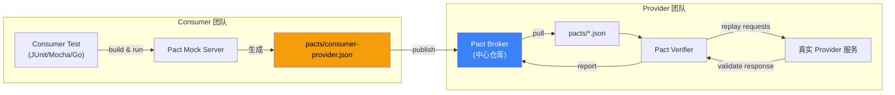

# 精通契约测试与混沌工程：Pact / Schema Registry / Chaos Mesh / Gremlin
> 关联章节：[微服务 INDEX](./INDEX.md) · [同步通信](./04-精通-同步通信.md) · [异步消息](./07-精通-异步消息与事件驱动.md) · [韧性设计模式](./12-精通-韧性设计模式.md)

> 课程编号：M20
> 路线图来源：微服务 · 模块七 发布与测试
> 难度：⭐⭐⭐⭐
> 预计阅读时间：90 分钟
> 内容基准：2026 年 5 月（Pact 5.x、Schemathesis 4.x、Chaos Mesh 2.7+、Litmus 3.x、Confluent Schema Registry 8.x）

---

## 引言：你信什么，决定你能跑多快

```text
单体时代：
  ├── 接口变了？ IDE 直接告诉你哪几个调用方编译错了
  └── 跑一遍单元 + 集成测试就行

微服务时代：
  ├── 接口变了？另一个团队的服务可能在凌晨突然 500
  ├── 跑 30 个服务的完整 E2E？慢、脆、贵
  └── 不跑？等于把"服务边界"的稳定性赌运气
```

微服务的两个最大风险：**接口不可信**与**故障不可见**。前者要靠"契约测试"，后者要靠"混沌工程"。它们都不是测试技术，而是**纪律**——你要让所有人都同意"接口要被契约约束"，"故障要被主动制造"。

本章拆三件事：

1. 契约测试：Consumer-Driven Contracts、Pact、Spring Cloud Contract、Schemathesis
2. Schema 兼容性：Avro/Protobuf/JSON Schema 的前向 / 后向 / 全兼容规则，Confluent Schema Registry
3. 混沌工程：5 原则、Chaos Mesh / Litmus / Gremlin、故障注入分类、生产混沌的安全实施

读完应能为一个 10+ 服务的系统设计契约测试体系、定义 schema 演进规则、并独立设计一个"网络分区下熔断是否生效"的混沌实验。

---

## 第一章：契约测试解决什么

### 1.1 微服务的"集成测试困境"

```text
方案 A：每个服务跑独立单元测试（mock 所有依赖）
  ├── 优点：快、稳
  └── 缺点：mock 和真实接口可能不一致，"绿色测试 + 生产 500"

方案 B：拉起全栈 E2E（所有服务都启）
  ├── 优点：最接近真实
  └── 缺点：慢（10 分钟起步）、脆（一个服务挂全失败）、贵（环境维护）

方案 C：契约测试
  ├── Consumer 用 mock 但 mock 由"契约文件"生成
  ├── Provider 用真实代码验证"契约文件"
  └── 两侧用同一份契约，等于"间接一致"
```

契约测试的精髓是**用契约文件做接口"中间人"**，consumer 和 provider 不直接握手，但都信同一份文件。

### 1.2 测试金字塔的位置

```text
       ▲
      / \  E2E (慢、少)
     /---\
    /     \  Contract Tests (适中)
   /-------\
  /         \  Integration Tests (单服务内)
 /-----------\
/  Unit Tests \  (快、多)
---------------
```

Martin Fowler 提出的"微服务测试金字塔"中，契约测试是**E2E 的替代品**。一个合格的微服务系统应该：
- 70% 单元测试
- 20% 集成测试
- 9% 契约测试
- 1% 端到端测试

不是"完全不要 E2E"，是 E2E 只覆盖最核心的几条 happy path。

### 1.3 与传统测试的对比

| 测试类型 | 范围 | 速度 | 维护成本 | 真实性 |
|---|---|---|---|---|
| 单元测试 | 单类 / 单函数 | ms | 低 | 低（mock）|
| 集成测试 | 单服务 + DB / 中间件 | s | 中 | 中 |
| 契约测试 | 服务边界（消费者 ↔ 提供者）| s | 中 | **高（双方同源）**|
| 端到端 | 全栈 | 分钟 | 高 | 高 |

---

## 第二章：Consumer-Driven Contract（CDC）

### 2.1 核心思想

传统接口契约是**Provider 推**的：Provider 写好 OpenAPI 文档，Consumer 自己看着对接。

CDC 反过来：**Consumer 写出"我期望 Provider 怎么响应"**，Provider 必须满足。

```text
Consumer 测试：
  ├── 用 Pact mock 起 Provider
  ├── 跑业务逻辑，验证 mock 的响应是否够用
  └── 生成 pact.json（契约文件）

Provider 验证：
  ├── 拿到 pact.json
  ├── 起真实的 Provider 代码
  ├── 按 pact.json 中的请求发给自己
  └── 验证响应是否匹配 pact.json 中的期望
```

为什么"消费者主导"？因为**消费者更知道自己真正需要哪些字段**。Provider 经常因为"以为某字段没人用"而删掉它，造成线上事故。CDC 让"实际被用到的字段"显式化。

### 2.2 与 OpenAPI / Schema 的关系

OpenAPI 是 **Provider Contract**（提供方说"我能提供什么"），CDC 是 **Consumer Contract**（消费方说"我需要什么"）。两者互补：

| 维度 | OpenAPI | Pact CDC |
|---|---|---|
| 写者 | Provider | Consumer |
| 范围 | Provider 能力全集 | Consumer 实际需要的子集 |
| 验证粒度 | 字段类型 | 字段类型 + 业务取值 |
| 与代码同步 | 易脱钩 | 测试通过即同步 |
| 用途 | API 文档 / 代码生成 | 防止 breaking change |

成熟系统两者并用：OpenAPI 写 spec、Pact 测真实接口对接。

---

## 第三章：Pact 框架深度

Pact 是 CDC 的事实标准框架，2013 年由 DiUS（澳大利亚）开源。

### 3.1 三大组件



### 3.2 Consumer 端示例（Go）

```go
import "github.com/pact-foundation/pact-go/v2/consumer"

func TestUserClient_GetUser(t *testing.T) {
    mockProvider, err := consumer.NewV4Pact(consumer.MockHTTPProviderConfig{
        Consumer: "order-service",
        Provider: "user-service",
    })
    require.NoError(t, err)

    err = mockProvider.
        AddInteraction().
        Given("user 42 exists").
        UponReceiving("a request for user 42").
        WithRequest("GET", "/users/42", func(b *consumer.V4RequestBuilder) {
            b.Header("Accept", matchers.S("application/json"))
        }).
        WillRespondWith(200, func(b *consumer.V4ResponseBuilder) {
            b.JSONBody(matchers.Map{
                "id":    matchers.Integer(42),
                "name":  matchers.String("Alice"),
                "email": matchers.Regex("alice@example.com", `\S+@\S+`),
            })
        }).
        ExecuteTest(t, func(config consumer.MockServerConfig) error {
            client := NewUserClient(config.BaseURL)
            user, err := client.GetUser(42)
            if err != nil { return err }
            assert.Equal(t, "Alice", user.Name)
            return nil
        })
    require.NoError(t, err)
}
```

跑完得到 `pacts/order-service-user-service.json`：

```json
{
  "consumer": {"name": "order-service"},
  "provider": {"name": "user-service"},
  "interactions": [{
    "description": "a request for user 42",
    "providerState": "user 42 exists",
    "request": {
      "method": "GET",
      "path": "/users/42"
    },
    "response": {
      "status": 200,
      "body": {"id": 42, "name": "Alice", "email": "alice@example.com"},
      "matchingRules": {
        "$.email": {"match": "regex", "regex": "\\S+@\\S+"}
      }
    }
  }]
}
```

### 3.3 Provider 端验证（Go）

```go
import "github.com/pact-foundation/pact-go/v2/provider"

func TestProvider(t *testing.T) {
    // 启真实的 Provider HTTP 服务
    go startProviderApp(":18080")

    v := provider.NewVerifier()
    err := v.VerifyProvider(t, provider.VerifyRequest{
        ProviderBaseURL: "http://localhost:18080",
        BrokerURL:       "https://broker.example.com",
        Provider:        "user-service",
        ProviderVersion: getGitSHA(),
        // 关键：状态准备 handlers
        StateHandlers: provider.StateHandlers{
            "user 42 exists": func(setup bool, state provider.ProviderState) (provider.ProviderStateResponse, error) {
                if setup { createUser(42, "Alice", "alice@example.com") }
                return nil, nil
            },
        },
        PublishVerificationResults: true,
    })
    require.NoError(t, err)
}
```

关键点：
- **StateHandler**：每个交互前置条件（如"user 42 存在"）由 provider 在测试前临时构造
- **PublishVerificationResults**：把验证结果上报 Broker，Broker 能告诉 consumer "你的 pact 是否被 provider 验证通过"

### 3.4 Pact Broker

Broker 是 pact 文件 + 验证结果的中心化仓库（也可用 Pactflow SaaS）。它解决：

- **pact 文件存哪儿**：不进 git 仓库（生成产物），存 Broker
- **谁在用我的接口**：consumer 列表
- **改了接口会影响谁**：版本 + tag + 验证矩阵
- **能不能上线**：`can-i-deploy` 命令

```bash
pact-broker can-i-deploy \
  --pacticipant user-service \
  --version $GIT_SHA \
  --to-environment production
# 输出：yes / no（基于"该版本是否被所有 active consumer 验证通过"）
```

### 3.5 适用与不适用

| 场景 | 是否推荐 |
|---|---|
| 同公司内部 REST / gRPC 服务间 | 强烈推荐 |
| 多团队、跨产品线接口 | 强烈推荐 |
| 对外开放 API（你不知道有哪些 consumer） | 不推荐（用 OpenAPI + Schemathesis）|
| 异步消息（事件）| 推荐（Pact message contract）|
| GraphQL | 部分支持（Apollo Federation 有自己的 schema check）|

---

## 第四章：Spring Cloud Contract

Java 生态的等价方案，Pivotal/VMware 出品，与 Spring Boot 紧密集成。

### 4.1 Groovy DSL 定义契约

```groovy
// src/test/resources/contracts/getUser.groovy
Contract.make {
    description "get user by id"
    request {
        method GET()
        url "/users/42"
        headers { contentType(applicationJson()) }
    }
    response {
        status OK()
        body([
            id: 42,
            name: "Alice",
            email: regex(/[\w.]+@[\w.]+/)
        ])
    }
}
```

### 4.2 双向工作流

```text
Provider 写契约文件 → 自动生成 Provider 的 verification 测试
                  → 发布到 Maven 仓库作为 stub jar
Consumer 引入 stub jar → @AutoConfigureStubRunner 启动 mock
                     → 用 mock 跑 consumer 测试
```

与 Pact 的关键差异：**Spring Cloud Contract 是 Provider Driven**（契约由 Provider 写，stub 给 Consumer 用），Pact 是 Consumer Driven。

实际中两种都有人用，**没有绝对优劣**——Spring 生态团队倾向 Spring Cloud Contract，多语言团队倾向 Pact。

---

## 第五章：Schemathesis 与 OpenAPI 驱动测试

### 5.1 思路

如果你有 OpenAPI spec，Schemathesis 能**自动**根据 spec 生成测试用例（基于 Property-based Testing / hypothesis）。

```bash
schemathesis run https://api.example.com/openapi.json \
  --checks all \
  --hypothesis-deadline=10000 \
  --report
```

它会：
- 自动构造各种 valid / invalid 请求
- 验证响应是否匹配 spec 的 schema
- 找到"spec 说允许但 server 实际拒绝"或反之的差异

### 5.2 与 Pact 的对比

| 维度 | Pact | Schemathesis |
|---|---|---|
| 契约来源 | Consumer 写测试生成 | OpenAPI spec |
| 测试用例 | 手写交互 | 自动属性测试 |
| 适合 | 内部服务（你知道 consumer 是谁）| 公开 API（不知道 consumer）|
| 业务取值 | 能测 | 难（自动生成可能不符合业务约束）|
| 边界用例 | 你写啥测啥 | 自动覆盖大量边界 |

两者**可以并用**：Pact 测主路径业务取值，Schemathesis 测 spec 一致性 + 边界 fuzz。

---

## 第六章：Schema 兼容性

### 6.1 兼容性的三个方向

```text
向后兼容 (Backward Compatible)：
  新版 schema 能读旧版数据
  → 升级 reader 优先时使用
  → 例：加可选字段、加默认值

向前兼容 (Forward Compatible)：
  旧版 schema 能读新版数据
  → 升级 writer 优先时使用
  → 例：删可选字段、放宽校验

全兼容 (Full Compatible)：
  双向都兼容
  → reader / writer 可任意顺序升级
  → 微服务中默认推荐
```

### 6.2 Protobuf 兼容规则

| 操作 | 向后兼容 | 向前兼容 |
|---|---|---|
| 加字段 (optional / 默认值) | 是 | 是 |
| 删字段 | 否（旧数据有字段，新代码不识别）| 否 |
| **改 tag number** | **从不允许** | 从不允许 |
| 改字段类型（int32 → string） | 否 | 否 |
| `int32 → int64`（整数族内）| 是 | 部分 |
| 加 oneof 成员 | 是 | 是 |
| `singular → repeated` | 否 | 否 |
| 把字段标记为 `reserved` | 是（防止重用 tag） | 是 |

**永远不要重用 tag number**。删字段时 reserved：

```protobuf
message User {
  reserved 3, 5;          // 老字段 3, 5 永远不能再用
  reserved "old_field";
  int64 id = 1;
  string name = 2;
}
```

### 6.3 Avro 兼容规则

Avro 更严格，schema 直接在数据里编码字段名，**支持 schema 演进**：

| 操作 | Backward | Forward | Full |
|---|---|---|---|
| 加带 default 的字段 | 是 | 是 | 是 |
| 加无 default 的字段 | 否 | 是 | 否 |
| 删带 default 的字段 | 是 | 是 | 是 |
| 删无 default 的字段 | 是 | 否 | 否 |
| 改字段类型（同族内的 promotion）| 是 | 否 | 否 |
| 改字段类型（跨族） | 否 | 否 | 否 |
| rename 字段 | 否（除非用 aliases）| 否 | 否 |

### 6.4 JSON Schema 兼容规则

JSON Schema 是最宽松的：
- 加可选字段 → 兼容
- 加 required 字段 → 破坏向前兼容
- 把 optional 改 required → 破坏向后兼容
- 删字段 → 看消费者是否使用

JSON Schema 没有 tag number 概念，但因为 JSON 是文本格式，**别人可能依赖字段名拼写**——所以**字段名也是契约的一部分**。

---

## 第七章：Schema Registry

### 7.1 为什么需要

Kafka 这类 schema-less 系统，message 本身只是字节流。没有 registry：
- Producer 写错 schema，consumer 解析失败
- 历史 message 的 schema 没人知道
- 兼容性靠口头约定

Schema Registry 把 schema 集中存储 + 编号，message 里只带 schema id。

```text
Producer：
  ├── 序列化 message：schema_id(4 字节) + Avro 数据
  └── 发到 Kafka

Consumer：
  ├── 读到字节流
  ├── 解析 schema_id
  ├── 向 registry 查 schema
  └── 反序列化
```

### 7.2 Confluent Schema Registry

```yaml
# 注册 schema
curl -X POST \
  -H "Content-Type: application/vnd.schemaregistry.v1+json" \
  --data '{"schema": "{\"type\":\"record\",\"name\":\"User\", ... }"}' \
  http://registry:8081/subjects/users-value/versions

# 设置兼容性策略（subject 级别）
curl -X PUT \
  -H "Content-Type: application/vnd.schemaregistry.v1+json" \
  --data '{"compatibility": "FULL_TRANSITIVE"}' \
  http://registry:8081/config/users-value
```

兼容性策略选项：

| 策略 | 含义 |
|---|---|
| NONE | 不检查 |
| BACKWARD | 新 schema 能读上一版 |
| BACKWARD_TRANSITIVE | 新 schema 能读所有历史版 |
| FORWARD | 上一版能读新 schema 写的数据 |
| FORWARD_TRANSITIVE | 所有历史版都能 |
| FULL | 双向，仅与上一版 |
| **FULL_TRANSITIVE** | **双向，全历史 —— 生产推荐**|

### 7.3 Apicurio

Red Hat 出品的开源替代，支持 OpenAPI / AsyncAPI / Avro / Protobuf / JSON Schema 多种 schema 类型，license 比 Confluent CSL 友好。

### 7.4 CI 集成

```yaml
# .github/workflows/schema-check.yml
- name: Check schema compatibility
  run: |
    confluent schema-registry subject update \
      --subject users-value \
      --compatibility FULL_TRANSITIVE
    
    confluent schema-registry schema create \
      --subject users-value \
      --schema schemas/User.avsc \
      --type AVRO
    # 失败时 exit 非 0，PR 不能合
```

---

## 第八章：混沌工程定义

### 8.1 起源：Netflix Chaos Monkey

2010 年 Netflix 从数据中心迁到 AWS 时，AWS 频繁单机故障。Netflix 决定：**与其等故障发生再焦虑，不如主动每天杀一台机器**——Chaos Monkey 诞生。

2014 年 Netflix 提出"混沌工程"概念，2015 年发布 Principles of Chaos Engineering。

### 8.2 五大原则（Principles of Chaos）

1. **Build a Hypothesis around Steady-State Behavior**（围绕稳态行为构建假设）：先定义"正常时系统什么样"
2. **Vary Real-world Events**（注入真实世界事件）：硬件故障 / 网络中断 / 流量激增，而不是抽象错误
3. **Run Experiments in Production**（在生产环境跑）：dev 环境的实验不算数
4. **Automate Experiments to Run Continuously**（自动化持续运行）：人记不住，自动跑
5. **Minimize Blast Radius**（最小化爆炸半径）：实验要可控、可停

### 8.3 不是什么

| 混沌工程 ≠ | 区别 |
|---|---|
| 故障演练 | 演练是"我知道要测什么"，混沌是"我用实验找出我不知道的弱点" |
| 性能测试 | 性能测压力，混沌测故障下的行为 |
| 测试 | 测试是"验证已知期望"，混沌是"探索未知故障行为" |
| 在生产搞破坏 | 严格爆炸半径控制 + 一键停止 |

---

## 第九章：故障类型矩阵

按"作用层"分类：

### 9.1 网络故障

| 类型 | 工具 | 模拟 |
|---|---|---|
| 延迟 | tc / Chaos Mesh NetworkChaos | 加 100ms 延迟 |
| 丢包 | tc / Chaos Mesh | 5% 丢包 |
| 损坏 | tc | 包 corruption |
| 重复 | tc | 包 duplicate |
| 分区 | iptables / Chaos Mesh PartitionAction | 服务 A 和 B 之间断网 |
| 限速 | tc | 把 1Gbps 限到 1Mbps |
| DNS 故障 | Chaos Mesh DNSChaos | DNS 解析失败 / 解析到错误 IP |

### 9.2 资源故障

| 类型 | 工具 | 模拟 |
|---|---|---|
| CPU 满 | stress-ng / Chaos Mesh StressChaos | CPU 100% |
| 内存满 | stress-ng | 占满 mem |
| 磁盘满 | dd | 写满磁盘 |
| 磁盘 IO 慢 | Chaos Mesh IOChaos / blkio cgroup | 加 100ms IO 延迟 |
| 磁盘错误 | Chaos Mesh IOChaos | 返回 EIO |

### 9.3 进程故障

| 类型 | 工具 | 模拟 |
|---|---|---|
| 进程被 kill | Chaos Mesh PodChaos | 杀进程 |
| Pod 重启 | Chaos Mesh PodChaos | 重启 Pod |
| Pod 失联 | Chaos Mesh | 让 Pod 与 K8s API 失联 |
| 容器 OOM | Chaos Mesh | 触发 OOM kill |

### 9.4 时钟故障

| 类型 | 工具 | 模拟 |
|---|---|---|
| 时钟漂移 | Chaos Mesh TimeChaos | 容器时间 +1h |
| 时钟回拨 | Chaos Mesh | 容器时间 -10s |

时钟故障最容易暴露 Snowflake / 分布式锁的 bug。

### 9.5 应用层故障

| 类型 | 工具 | 模拟 |
|---|---|---|
| HTTP 错误注入 | Chaos Mesh HTTPChaos / Istio FaultInjection | 5% 请求返回 503 |
| RPC 错误 | Chaos Mesh gRPCChaos | gRPC error |
| JVM 异常 | Chaos Mesh JVMChaos | 注入特定异常 |

### 9.6 平台故障

| 类型 | 模拟 |
|---|---|
| Region 失效 | 切断对一个 region 的访问 |
| AZ 失效 | 切断对一个 AZ 的访问 |
| 中间件失效 | Kafka broker 宕、Redis 节点宕 |

---

## 第十章：Chaos Mesh 深度

PingCAP 开源、CNCF Incubating，K8s 上最主流的混沌工程平台。

### 10.1 CR 示例

```yaml
apiVersion: chaos-mesh.org/v1alpha1
kind: NetworkChaos
metadata:
  name: delay-payment-to-bank
  namespace: chaos
spec:
  action: delay
  mode: all
  selector:
    namespaces: [payment]
    labelSelectors:
      app: payment-svc
  direction: to
  target:
    selector:
      namespaces: [bank-mock]
      labelSelectors:
        app: bank-svc
    mode: all
  delay:
    latency: 500ms
    jitter: 100ms
    correlation: "50"
  duration: 5m
```

关键字段：
- `selector`：受影响的 Pod
- `target`：故障的另一端（这里是注入 payment-svc 到 bank-svc 的延迟）
- `duration`：实验时长，**到期自动恢复**
- `mode`：all / one / fixed / fixed-percent / random-max-percent

### 10.2 Workflow

Chaos Mesh 2.0（2021-07）引入 Workflow 串联多个实验：

```yaml
apiVersion: chaos-mesh.org/v1alpha1
kind: Workflow
metadata:
  name: payment-failure-scenario
spec:
  entry: full-scenario
  templates:
  - name: full-scenario
    templateType: Serial
    children:
    - inject-network-delay
    - inject-pod-kill
    - assert-recovery
  - name: inject-network-delay
    templateType: NetworkChaos
    deadline: 5m
    networkChaos: { ... }
  - name: inject-pod-kill
    templateType: PodChaos
    deadline: 1m
    podChaos: { ... }
  - name: assert-recovery
    templateType: Task
    deadline: 2m
    task:
      container:
        image: curlimages/curl
        command: ["sh", "-c", "until curl -f http://api/health; do sleep 1; done"]
```

### 10.3 安全机制

- **Namespace 隔离**：默认只能对配置的 namespace 注入
- **RBAC**：通过 K8s RBAC 限制谁能创建 chaos CR
- **Pause / Resume**：一键暂停所有进行中的实验
- **Duration 强制**：所有实验必须有时长，到期自动恢复

---

## 第十一章：Litmus / Gremlin / Pumba 比较

| 工具 | 部署形态 | 主要场景 | 商业化 |
|---|---|---|---|
| Chaos Mesh | K8s CR | K8s 内一切层故障 | 开源 |
| Litmus | K8s CR | Chaos workflow 强 + Hub 实验市场 | 开源（ChaosNative SaaS）|
| Gremlin | SaaS Agent | 跨平台（VM/K8s/容器/裸金属）| 商业 |
| Pumba | CLI 工具 | Docker 容器（非 K8s） | 开源 |
| AWS FIS | AWS 原生 | AWS 服务故障 | 商业 |
| Azure Chaos Studio | Azure 原生 | Azure 服务故障 | 商业 |

**选型建议**：
- K8s 内：Chaos Mesh 或 Litmus
- 跨云 / 跨平台：Gremlin
- 单机 Docker 实验：Pumba

---

## 第十二章：实验流程

### 12.1 4 步法

```text
1. 定义稳态：哪些指标在"正常时"是什么样
   → e.g. p99 < 500ms, 错误率 < 0.1%, QPS > 1000

2. 提出假设：注入 X 故障，系统仍保持稳态
   → e.g. "杀死 payment 服务一个 Pod，10s 内 K8s 调度新 Pod，期间错误率不超过 0.5%"

3. 注入并观察：
   → 看指标是否偏离稳态
   → 看告警是否触发

4. 复盘 / 修复：
   → 假设成立：增加置信度，扩大爆炸半径
   → 假设不成立：找出弱点，修复，再跑
```

### 12.2 实验记录模板

```markdown
## 实验名称：Payment 服务 Pod kill

### 稳态
- p99 < 500ms
- 错误率 < 0.1%

### 假设
杀 1 个 Payment Pod（共 5 副本），期间错误率不超过 0.5%，1 分钟内恢复稳态

### 爆炸半径
- 命名空间：payment-staging
- Pod 数：1（共 5）
- 时长：1 min

### 一键停止
kubectl delete networkchaos.chaos-mesh.org payment-pod-kill -n chaos

### 结果
- 实际错误率峰值：0.8%（超出预期）
- 恢复时间：90s

### 学习
- 客户端 grpc 没设 retry，单次失败直接报错
- 修复：客户端加 retry + circuit breaker
```

---

## 第十三章：生产混沌的"安全实施"

### 13.1 三道防线

```text
1. Blast Radius（爆炸半径）：
   - 第一次：单 Pod，1 副本 / 5 副本
   - 第二次：30%，3 副本 / 5 副本
   - 第三次：全部，5 副本 / 5 副本（生产已经验证抗性了）

2. Time Window（时间窗口）：
   - 工作时间，业务低峰
   - 提前周知所有相关方
   - 不在周五、节假日前、大促前

3. Kill Switch（一键停止）：
   - 所有实验有 finite duration
   - 单独 Slack / PagerDuty 通道
   - SRE 团队人工 hold ack 不超过 5 分钟
```

### 13.2 谁能批准 / 跑生产混沌

| 阶段 | 谁批准 | 谁跑 |
|---|---|---|
| dev 实验 | 不需要 | 任何开发 |
| staging 实验 | tech lead | 任何开发 |
| 生产小爆炸半径 | tech lead + SRE | SRE |
| 生产大爆炸半径 | 部门总监 + SRE manager | SRE |
| 跨服务生产实验 | CTO / VP Eng | 专门 game day 团队 |

---

## 第十四章：游戏日（Game Day）

### 14.1 什么是 Game Day

整个团队 4-8 小时**主动**注入故障，演练响应。源自 Amazon、Netflix 等公司，2026 年大公司 quarterly 一次是标配。

### 14.2 流程

```text
准备（前 2 周）：
  ├── 选场景（如"主数据库 region 失效"）
  ├── 准备 runbook
  ├── 周知业务方
  └── 准备一键停止

执行（D 日）：
  ├── 0:00 - 计时开始
  ├── 0:05 - 注入故障
  ├── 0:10 - 不告诉 oncall 发生了什么，看他们能否自己发现
  ├── 0:30 - 让他们解决
  └── 5:00 - 结束

复盘（D+1）：
  ├── 检测时间（MTTD）
  ├── 修复时间（MTTR）
  ├── 误报数量
  ├── runbook 哪里没用
  └── 改进项进 backlog
```

### 14.3 关键产出

- **runbook 改进**：实际操作发现 runbook 漏了哪些步骤
- **告警优化**：哪些告警太晚、哪些是 noise
- **架构债**：哪些"理论可恢复"实际"恢复太慢"

---

## 第十五章：案例：网络延迟下熔断与重试的验证

### 15.1 场景

订单服务调用支付服务。期望行为：
- 支付服务网络 RT > 1s → 熔断器开启
- 熔断后，订单服务降级返回"稍后重试"
- 网络恢复后 30s 内熔断器自动关闭

### 15.2 NetworkChaos 注入

```yaml
apiVersion: chaos-mesh.org/v1alpha1
kind: NetworkChaos
metadata:
  name: payment-slow
  namespace: chaos
spec:
  action: delay
  mode: all
  selector:
    namespaces: [orders]
    labelSelectors:
      app: order-svc
  direction: to
  target:
    selector:
      namespaces: [payment]
      labelSelectors:
        app: payment-svc
  delay:
    latency: 3s
  duration: 3m
```

### 15.3 验证

观察 Prometheus 指标：

```promql
# 熔断器状态（resilience4j_circuitbreaker_state 例如）
resilience4j_circuitbreaker_state{name="payment-client", state="open"}

# 期望：实验开始 30s 内，open 指标 = 1
# 期望：实验结束 30s 内，open 指标 = 0
# 期望：实验期间，订单服务对客户的成功率 > 95%（降级返回 "稍后"也算"成功响应"）
```

如果验证不通过：
- 熔断器没触发 → 阈值设置太宽
- 触发了但没降级 → fallback 没写
- 网络恢复后熔断器没关闭 → half-open 试探机制有 bug

---

## 生产实践

1. **新服务上线时第一道关卡是 Pact 测试**。没有契约测试就不让上 main。
2. **schema 兼容性必须 CI 阻断**。不能靠 review。
3. **schema registry 用 FULL_TRANSITIVE**。性能损失极小，安全收益巨大。
4. **混沌实验先 staging 再生产**。staging 都通不过的实验不能上生产。
5. **每个 chaos 实验文档化**。假设、稳态、爆炸半径、停止方式四件套。
6. **每个生产混沌实验有"看门人"**。一个 SRE 全程盯监控，可以一键 abort。
7. **每周一次小型 chaos 自动跑**。周五下午别跑。
8. **重要发现进 incident review**。chaos 发现的问题就是真问题，按生产事故处理。
9. **不在"已经在 fire"时跑 chaos**。系统有未解决的 incident 时停所有实验。
10. **培训 oncall 的 game day**。new oncall 必须先经过模拟 game day 才能正式排班。
11. **Pact 与 OpenAPI 并用**：OpenAPI 做 spec/文档，Pact 做实际接口验证。
12. **deprecated 字段的删除流程化**：标记 deprecated → 3 个版本周期 → consumer 验证不再使用 → 删除。

---

## 陷阱清单

1. **Pact 把单元测试当契约测试用**。consumer 测试里直接调真实的 provider 数据库，不是 mock，pact 文件不真实。
2. **Provider 不跑 verifier**。consumer 写了 pact，provider 团队没接入验证。pact 文件只是装饰。
3. **schema 改了 tag number**。protobuf 删字段没 reserved，新加的字段复用了旧 tag。线上 deserialize 错乱。
4. **schema registry 设 NONE**。怕麻烦关掉兼容检查，几个月后多个 schema 已经互不兼容。
5. **chaos 实验没有 duration**。实验跑完了忘了停，第二天发现 service 还在被注入故障。
6. **chaos 直接上生产**。dev/staging 都没跑就上生产，第一次就把核心服务搞挂。
7. **混沌实验影响其他团队**。一个团队跑实验导致另一个团队的服务异常，没沟通。
8. **断言不充分**：实验"看似通过"——但其实是 metric 没采到 / 告警没接 / 业务没下单。
9. **把"凌晨自动化跑 chaos"当 quarterly game day**：少了"人工观察 + 复盘"，价值减半。
10. **game day 没产出**：跑完没人写 doc、没修 bug，下次还是同样问题。
11. **Pact Broker 没 backup**：契约文件丢了，consumer 不能验证升级了。
12. **schema breaking change 走"邮件通知"**：靠人记是不可靠的，必须靠 CI gate。

---

## 2026 现状

| 维度 | 2026 现状 |
|---|---|
| Pact | 5.x，go/java/js/python/rust SDK 完整，Pactflow SaaS 流行 |
| Spring Cloud Contract | 4.x，Spring Boot 生态主流 |
| Schemathesis | 4.x，OpenAPI 自动测试事实标准 |
| Schema Registry | Confluent Cloud SaaS / Apicurio 自部署 / AWS Glue Schema Registry |
| Chaos Mesh | 2.7+，CNCF Incubating，K8s 生态最主流 |
| Litmus | 3.x，CNCF Incubating，Workflow + Hub 强 |
| Gremlin | SaaS 主流商业方案 |
| AWS FIS | 2025 GA，与 AWS 原生服务集成 |
| OpenChaos | OpenChaos Initiative 倡议但未成标准 |
| 趋势 | "AI-assisted Chaos"：根据 trace 自动建议实验场景 |
| 趋势 | "持续混沌"：CI/CD 流水线里固定跑小型 chaos 步骤 |

---

## 练习题

1. 你的 user-service 计划重命名一个字段，order-service / inventory-service / notification-service 都在用。给出三步走的迁移方案。
2. Pact 与 OpenAPI 的边界在哪里？给出两个"你会用 Pact、不会用 OpenAPI 验证"的具体场景。
3. Avro schema 在 schema registry 设 BACKWARD_TRANSITIVE，可以做哪些变更，不能做哪些变更？给出 3 个 yes / 3 个 no。
4. 设计一个"假设：单 AZ 失效，订单系统 60s 内自动恢复"的混沌实验，包含稳态定义、注入方式、断言指标、停止机制。
5. 你的混沌实验跑完后发现"系统看似正常但订单数下降 30%"，没有任何告警触发。问题出在哪？给出 4 个可能原因。
6. 给出一个 protobuf message 演进的反例：哪种变更"在 IDE 里没报错，但线上会出问题"？
7. 解释为什么"在 staging 跑得通的 chaos 实验在生产可能不通"。给出至少 3 个可能原因。
8. Pact Broker 中显示某 consumer 的 verification 失败了，但 consumer 团队没有看到任何告警。问题流程上出了什么？怎么改？

---

## 参考答案

1. **重命名字段的三步走迁移**
   - 第一步（Expand/兼容新增）：在 user-service 同时输出新旧两个字段（旧字段保留，新字段加上），不删旧字段；下游无感。
   - 第二步（迁移消费方）：order/inventory/notification 逐个改为读取新字段，并通过 Pact 验证不再依赖旧字段；用 Broker 的 `can-i-deploy` 确认所有 active consumer 都不再使用旧字段。
   - 第三步（Contract/删除）：确认无引用后，user-service 移除旧字段。Protobuf 场景删字段要 `reserved` 旧 tag/字段名，永不重用。

2. **Pact vs OpenAPI 边界**
   Pact 验证"消费者实际需要的子集 + 业务取值"且双方同源，OpenAPI 描述提供方能力全集易与代码脱钩。两个用 Pact 的场景：(a) 内部多团队 REST/gRPC 服务对接，要防止 provider 删字段引发 breaking change——Pact 能显式标记"谁在用哪些字段"；(b) 异步消息事件契约（Pact message contract），验证 consumer 真正消费的事件字段。

3. **BACKWARD_TRANSITIVE 下 Avro 变更**
   含义：新 schema 能读所有历史版本数据（reader 先升级）。
   可以（yes）：加带 default 的字段；删带 default 的字段；删无 default 的字段（向后允许）。
   不能（no）：加无 default 的字段（破坏向后兼容）；跨族改字段类型；rename 字段（除非用 aliases）。

4. **单 AZ 失效 60s 自恢复实验**
   - 稳态：错误率 < 0.1%、p99 < 500ms、下单成功率 > 基线 95%。
   - 假设：切断对一个 AZ 的访问，系统在 60s 内把流量调度到其余 AZ，期间错误率不超过阈值。
   - 注入：用平台层故障（如 NetworkChaos 分区/iptables 切断该 AZ，或 AWS FIS 模拟 AZ 失效），mode 限定该 AZ 的 Pod。
   - 断言指标：错误率、p99、下单成功率、副本在其余 AZ 的重调度时间、熔断/重试是否生效。
   - 停止机制：设 finite `duration`（到期自动恢复）+ 一键 `kubectl delete networkchaos`，SRE 全程盯盘。

5. **"看似正常但订单降 30% 且无告警"的可能原因**
   (1) 没有针对业务指标（下单成功率/订单数）的告警，只盯了技术指标；(2) 稳态/断言定义不含业务指标，实验判定失真；(3) 指标采集断了或 metric 没采到（exporter/抓取问题），曲线看不出异常；(4) 告警阈值设得太宽或燃烧率窗口太长，30% 跌幅未触发；(也可能是降级把失败计为"成功响应"掩盖了真实业务损失)。

6. **Protobuf 演进反例**
   改 tag number 或复用已删字段的 tag（删字段未 `reserved`，新字段占用旧 tag）。`.proto` 编译不会报错，但线上反序列化会把新字段的数据按旧字段语义解析，导致字段错乱/数据损坏。同类还有把 `singular` 改 `repeated`、跨类型改字段（int32→string）。

7. **staging 通过但生产不通的原因**
   (1) 规模/流量不同：生产真实并发与数据量更大，暴露容量与重试风暴问题；(2) 拓扑/依赖不同：生产有多 AZ、真实第三方依赖、缓存预热状态，staging 简化或 mock 了；(3) 配置不一致：生产的副本数、限流、熔断阈值、资源配额与 staging 不同；(也可能数据分布、网络延迟基线不同导致行为差异)。

8. **verification 失败但 consumer 无告警的流程问题**
   问题：Provider 验证结果虽上报 Broker，但发布流程没有把 `can-i-deploy` 作为强制门禁，且 Broker 验证失败没有接入 consumer 团队的通知/CI。改法：在 consumer 与 provider 的 CI/CD 中强制 `pact-broker can-i-deploy`（失败即阻断发布），并配置 Broker webhook 在 verification 失败时通知到对应团队（Slack/工单），把契约校验做成 CI gate 而非靠人看面板。

---

## 延伸阅读

- 《Chaos Engineering》Casey Rosenthal & Nora Jones (O'Reilly)
- 《Learning Chaos Engineering》Russ Miles
- Netflix Tech Blog: "Chaos Monkey" 系列
- Principles of Chaos Engineering：<https://principlesofchaos.org/>
- Pact 文档：<https://docs.pact.io/>
- Schemathesis：<https://schemathesis.readthedocs.io/>
- Chaos Mesh：<https://chaos-mesh.org/>
- Litmus：<https://litmuschaos.io/>
- Confluent Schema Registry：<https://docs.confluent.io/platform/current/schema-registry/index.html>
- 关联章节：[M04 同步通信](./04-精通-同步通信.md) · [M07 异步消息](./07-精通-异步消息与事件驱动.md) · [M11 限流熔断降级](./11-精通-限流熔断降级.md) · [M12 韧性设计模式](./12-精通-韧性设计模式.md) · [M19 灰度发布](./19-精通-灰度发布.md)
