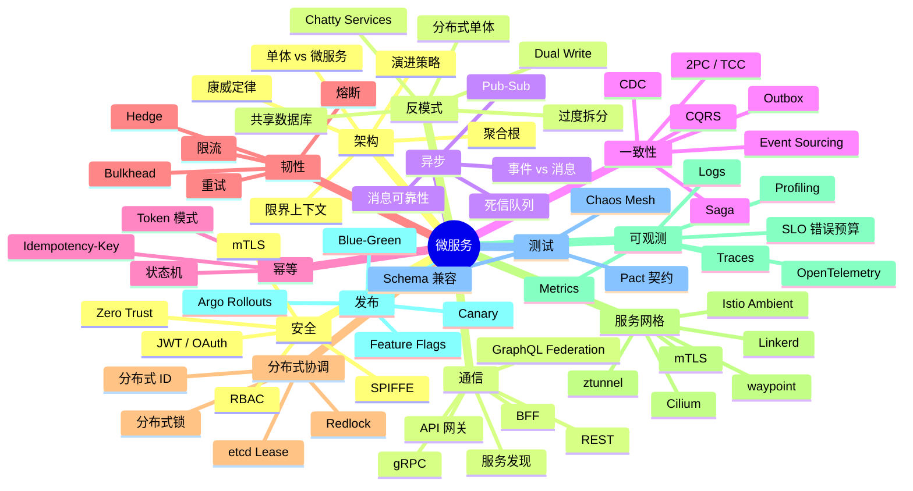

# 微服务架构 · 综合测验

> 配套 [INDEX.md](./INDEX.md) 与 [ROADMAP.md](./ROADMAP.md)
>
> 共 100 题，覆盖 M01-M22 全部内容。题目按难度递增分四组：基础 / 进阶 / 高级 / 综合实战。
> 推荐用法：先合上书自己作答，再翻回各章对照。答错的题，把对应章节再看一遍。

---

## 第一组：基础（25 题，⭐⭐⭐）

### 架构与拆分

1. 列出 5 个"**不要**做微服务"的信号。
2. 康威定律（Conway's Law）的核心论点是什么？反向康威（Inverse Conway Maneuver）又是什么？
3. SOA 和微服务的核心区别在哪 3 点？
4. DDD 中"限界上下文（Bounded Context）"和"子域（Subdomain）"是同一个东西吗？为什么？
5. 聚合根（Aggregate Root）的核心职责是什么？

### 通信

6. REST 和 gRPC 的 3 个本质差异（不是表面的"用什么协议"）？
7. 客户端服务发现 vs 服务端服务发现的取舍？
8. API 网关和 BFF 是什么关系？什么场景下两者都需要？
9. gRPC 的 4 种 RPC 模式（unary / server-stream / client-stream / bidi）各适合什么？
10. GraphQL Federation 解决了什么 BFF 痛点？

### 异步与一致性

11. 消息（Message）和事件（Event）的差异？
12. Saga 的 Orchestration 模式和 Choreography 模式各自的优劣？
13. Outbox 模式解决的核心问题是什么？为什么不能直接"DB 写完再发消息"？
14. 幂等 key 的常见生成策略有哪些？
15. Event Sourcing 把"什么"作为唯一真实来源？

### 韧性

16. Token Bucket 和 Leaky Bucket 的区别？哪个支持突发？
17. Circuit Breaker 的三态（Closed / Open / Half-Open）转换条件？
18. Bulkhead 模式解决什么问题？举一个具体例子。
19. 为什么"指数退避 + 抖动（jitter）"比纯指数退避好？
20. Redlock 算法解决什么问题？它有什么争议？

### 治理与可观测

21. 配置中心的"热更新"是怎么实现的？应用侧需要做什么？
22. Istio Ambient Mesh 相对于 Sidecar 模式的 3 个主要改进？
23. Snowflake 64 位 ID 的位分布是什么？时钟回拨怎么处理？
24. W3C TraceContext 头部包含哪几个字段？跨进程怎么传递？
25. SLO / SLI / 错误预算的关系是什么？

---

## 第二组：进阶（30 题，⭐⭐⭐⭐）

### DDD 与拆分

26. 给一个电商场景，把"订单"和"商品"分到两个限界上下文。两者交互时为什么需要防腐层（ACL）？
27. 上下文映射的 7 种关系（Partnership / Shared Kernel / Customer-Supplier / Conformist / ACL / OHS / SeparateWays）中，哪几种适合"上下游团队权力不对等"？
28. 战术 DDD 里的"领域服务（Domain Service）"和"应用服务（Application Service）"的根本区别？
29. 一个聚合"过大"的信号有哪些？怎么拆？
30. 事件风暴（Event Storming）的 3 个阶段是什么？

### 演进与拆分

31. 绞杀者模式（Strangler Fig）的 3 个关键步骤？
32. 数据库拆分时"先 Shared Database 再拆"和"直接 Database per Service"哪个更现实？为什么？
33. 影子流量（Shadow Traffic）用于什么场景？要注意什么副作用？
34. CDC（Change Data Capture）在单体到微服务迁移中的作用？
35. 单体拆出第一个服务时"先拆什么"的判断标准？

### 通信与服务发现

36. gRPC 流式 RPC 与 WebSocket 各自的代价？
37. 服务端发现（如 K8s Service）下，应用端要不要做客户端负载均衡？
38. Consul 在多数据中心 / 多集群场景比 K8s Service 强在哪？
39. API 网关常见的 5 个职责，哪些应该下沉到服务，哪些保留？
40. BFF 模式下，一个 BFF 服务应该归"前端团队"还是"后端团队"？

### 异步、事务、幂等

41. Kafka 的 Exactly-Once 是真的吗？它能保证什么、不能保证什么？
42. TCC（Try-Confirm-Cancel）和 Saga 各自适合什么场景？
43. Outbox 模式的实现细节：业务表怎么和 outbox 表在同一事务？后台 publisher 怎么保证不重？
44. Idempotency-Key（Stripe 风格）的请求生命周期是什么？key 应该保留多久？
45. PUT 一定幂等吗？什么场景下 PUT 仍然有副作用差异？

### 韧性

46. 限流的"令牌桶 + 滑动窗口"组合实现方式？为什么不直接用固定窗口？
47. 自适应限流（基于 RT/CPU/Load）相对于固定阈值的优势？
48. 熔断的 sleep window 设短了什么后果？设长了什么后果？
49. 重试一定要配 Idempotency-Key 吗？为什么？
50. Hedged Request（hedge）是什么？什么场景下值得用？

### 治理与配置

51. 配置中心和环境变量两种配置方式的取舍？
52. 灰度配置（Gray-Release Config）的常见实现策略？
53. 服务网格的 mTLS 是怎么自动注入证书的？应用代码要改吗？
54. Service Mesh 的"东西流量"和 API Gateway 的"南北流量"分别处理什么？
55. SPIFFE / SPIRE 解决了什么"服务身份"问题？

### 可观测

56. 分布式追踪的 Head-based vs Tail-based 采样各自适合什么？
57. OpenTelemetry 的 Resource / Scope / Signal 三个概念是什么关系？
58. Prometheus 的 Pull 模型相对 Push 模型的优势？什么场景下要切到 Pushgateway？
59. 持续 Profiling（Pyroscope / Parca）和传统采样 profiling 的差异？
60. SLO 中"99.9% 月可用性"对应的允许停机时间是多少？

---

## 第三组：高级（25 题，⭐⭐⭐⭐⭐）

### 架构与设计

61. 你接手一个 30 服务的"分布式单体"，给出 3 个月内的重构方案（含识别、优先级、改造）。
62. 设计一个"亿级订单/天"的电商订单系统的微服务拆分方案（含限界上下文、数据库、事件流）。
63. 一个核心服务因依赖下游 5 个服务而频繁超时。从架构层面（不是限流熔断）你怎么改造？
64. 限界上下文"过细"何时应该合并？给出 5 个判断信号。
65. 用 DDD 的视角解释为什么"用户中心"经常成为微服务架构的痛点。

### 数据一致性

66. 设计一个 Saga：从 Order Service 调用 Payment / Inventory / Shipping 三个服务，处理任意一步失败的补偿。给出状态机图。
67. Outbox 模式在 PostgreSQL + Kafka 的具体实现（含表结构、事务、CDC 配置）。
68. 你的业务表 UPDATE 后既要更新缓存又要发消息。两种实现：双写 vs Outbox+CDC。详细对比。
69. Event Sourcing 的"事件版本演进"（schema evolution）怎么处理？给出至少 2 种策略。
70. CQRS 的读模型如何保证和写模型同步？延迟可接受范围内的策略。

### 韧性与韧性

71. 一个核心服务依赖下游 10 个服务，每个 99.9%。整体可用性约多少？怎么改善？
72. Redis 实现分布式锁的 5 个陷阱（含 Redlock 的争议点）。给出可生产的实现方案。
73. 服务降级时如何安全地"返回兜底数据"？数据不一致怎么处理？
74. 重试 + 超时 + 熔断 + 限流的"组合参数设置"思路（不是孤立调每个）。
75. 给一个 Go 服务用 hedge request 调用下游：90% 直接发，10% 在 P95 latency 后再发一个备份请求。要注意什么？

### 服务网格与安全

76. Istio Ambient 的 ztunnel 和 waypoint 各负责 L4 / L7 的哪些事？
77. 如何在不修改应用代码的前提下，让所有内部服务调用都强制 mTLS？给出 Istio 配置。
78. 零信任架构下，"服务身份"和"用户身份"如何区分和复用？
79. JWT 在微服务间传递的 3 种常见错误用法？
80. 跨集群服务网格（Multi-cluster mesh）的 3 种典型拓扑？

### 可观测与发布

81. 一个微服务系统线上 P99 突涨，给出从"网关→服务→DB"的完整排查路径（用具体的 metric / log / trace 工具）。
82. 设计一个"基于 SLO 自动回滚的金丝雀发布流程"（含 Argo Rollouts 配置）。
83. Feature Flag 滥用会带来什么问题？给出治理策略。
84. 链路追踪在异步消息场景下如何传播 TraceContext？
85. Chaos Engineering 在生产环境的"安全实施"原则（blast radius / rollback / approval）。

---

## 第四组：综合实战（15 题，⭐⭐⭐⭐⭐）

### 完整设计

86. **场景**：一个 SaaS 平台从 5 个服务扩展到 50 个，团队从 20 人扩到 200 人。请给出技术 + 组织的同步演进策略（含 IDP、平台工程、SRE 团队设计）。
87. **场景**：一个金融对账系统跨 5 个微服务，每天处理 1 亿笔交易，对账要求 5 分钟内完成。给出端到端架构（含数据流、一致性、对账策略）。
88. **场景**：把一个 200 万行 Java 单体应用拆成微服务。给出 12 个月的演进路线图（含里程碑、风险、回滚预案）。
89. **场景**：一个在线游戏后端，100 万并发用户。给出微服务拆分 + 通信选型（同步 vs 异步）+ 状态服务（如战斗服）的设计。
90. **场景**：一个电商促销系统，零点抢购峰值 100 万 QPS。设计分布式锁 + 限流 + 缓存 + 异步落单的完整方案。

### 故障诊断

91. **故障**：生产环境某服务突然"半死"——能接受 30% 请求成功，70% 5xx。Pod 内存、CPU 正常。你怎么排查？
92. **故障**：跨地域多集群服务发现配错，导致 30% 流量打到错误集群。在不停服的情况下怎么修复？
93. **故障**：Kafka 消费者 lag 持续增长，业务方反馈"实时性差"。可能原因和排查路径？
94. **故障**：一个 Saga 流程"卡住"——状态显示 PENDING 但没有任何后续动作。怎么定位与恢复？
95. **故障**：链路追踪显示一个服务调用"消失"——上游有 outgoing span，下游没有 incoming span。最常见的 3 种原因？

### 安全与合规

96. **任务**：在不停服的前提下，把整个微服务集群从 HTTP 切到 mTLS 全量加密。给出渐进式方案。
97. **任务**：JWT token 泄露怎么紧急处理？设计一个"强制注销 + 黑名单 + 短 TTL"的完整方案。
98. **任务**：满足"用户的某次请求要能在所有相关服务的日志中关联"的合规要求。给出实现。

### 架构选型

99. **选型**：你的公司有 30 个微服务，现在选服务网格。从 Istio Ambient / Linkerd / Cilium Service Mesh 中给出对比和最终建议。
100. **选型**：跨服务事务有 4 种选项：2PC / TCC / Saga / Outbox。给一个具体的电商场景（订单+支付+库存+物流），论证你选哪种以及为什么不选其他。

---

## 答题建议

### 自我评估

- **80+ 分**：微服务高级水平，可担任团队架构师 / Tech Lead
- **60-80 分**：微服务中高级，能独立设计和落地新服务
- **40-60 分**：微服务中级，需要在工作中持续积累
- **< 40 分**：建议把对应章节重读，配合实操

### 实操建议

1. **本地起一个 K8s + Istio Ambient 集群**（kind / k3d 即可），跑通 mTLS + 流量切分
2. **实现一个 Saga**：用 Go / Java 写一个跨 3 服务的订单流程，含补偿
3. **配 OpenTelemetry**：把一个简单的 3 服务调用链跑出 traces + metrics + logs 全联动
4. **跑一次 Chaos**：在测试集群用 Chaos Mesh 注入网络延迟，看你的熔断器是否生效
5. **做一次 Canary**：用 Argo Rollouts 配一个基于 Prometheus 指标的自动回滚
6. **设计一个限流器**：用 Redis 实现分布式 Token Bucket，处理时钟漂移和原子性
7. **写一个 Outbox**：业务表 + outbox 表 + Debezium → Kafka，端到端跑通
8. **重构一个反模式**：找你工作里的"分布式单体"，分析它怎么变成那样，给出重构 PR
9. **写 SLO**：给一个核心 API 定 SLI / SLO，画 Grafana dashboard
10. **跑契约测试**：用 Pact 在 CI 里跑 Consumer-Driven Contract

---

## 重点知识图谱

---

## 结语

微服务**不是技术问题，是组织问题**。康威定律早就说过：你的系统架构会反映你的组织结构。这套课程 22 篇 + 100 题，覆盖了从设计到落地、从拆分到重构、从韧性到安全的完整图景。

但**真正的进步发生在生产环境**——一次次故障、一次次拆分、一次次重构、甚至一次次合并。微服务不是终点，是阶段。能在该用单体时不上微服务、在该拆时果断拆、在过细时敢于合并，才是真正的架构师。

> 🔁 反馈：每章学完后，回来挑相关题目作答；3 个月后全套再做一遍，对比进步

祝你成为团队里的微服务架构 Owner。

---

## 相关资源

- [INDEX.md](./INDEX.md) — 课程总目录
- [ROADMAP.md](./ROADMAP.md) — Mermaid 可视化路线图
- 必读 [microservices.io](https://microservices.io/)（Chris Richardson）
- 必读 [martinfowler.com/microservices](https://martinfowler.com/microservices/)
- 关联专题：cloud-native/（K8s/Istio）、backend/（B20-B21 韧性）、kafka/（消息中间件）、postgresql/（P16 逻辑复制 / CDC）
