# 微服务架构 路线图 · Mermaid 可视化

> 配合 [INDEX.md](./INDEX.md) 与 [QUIZ.md](./QUIZ.md) 使用
>
> **📅 内容基准：2026 年 5 月**

---

## 🗺️ 全景路线图

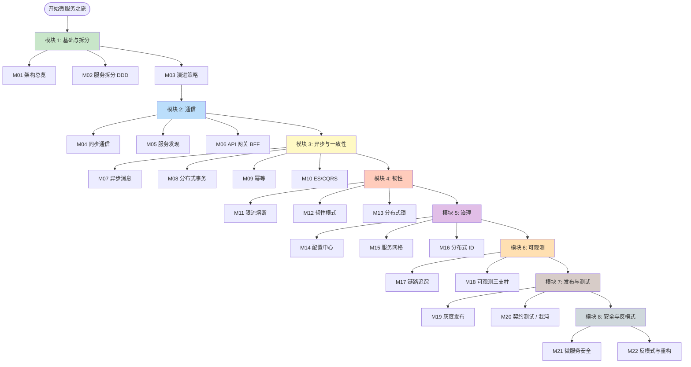

---

## 🏛️ 微服务核心组件全景

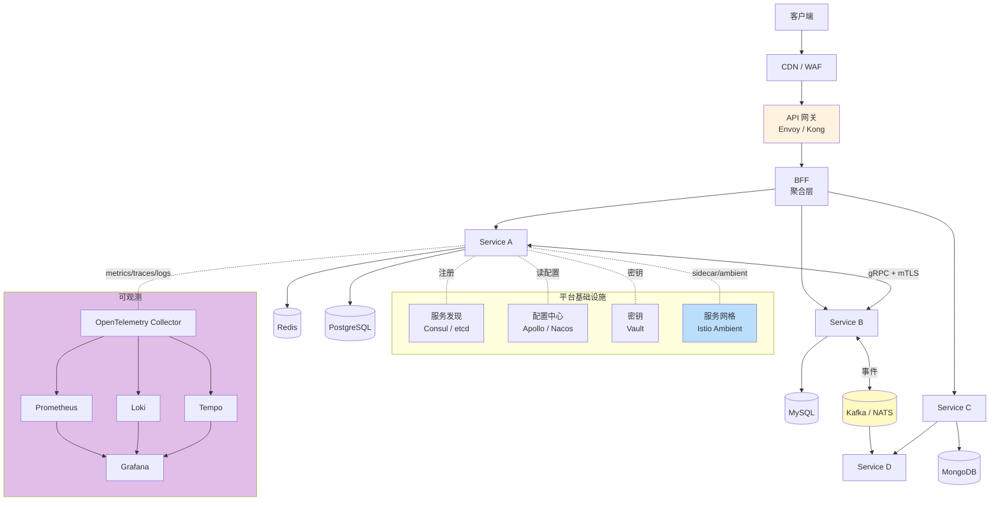

---

## 🧩 DDD 战略设计

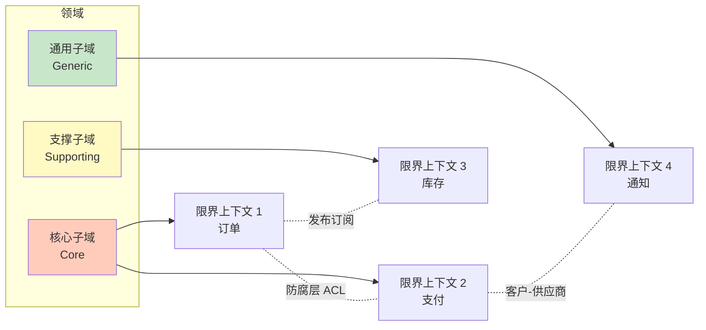

---

## 🔁 Saga（编排模式）

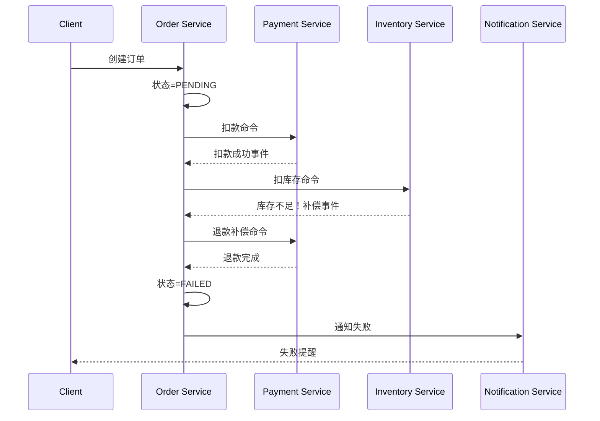

---

## ⚡ Circuit Breaker 三态

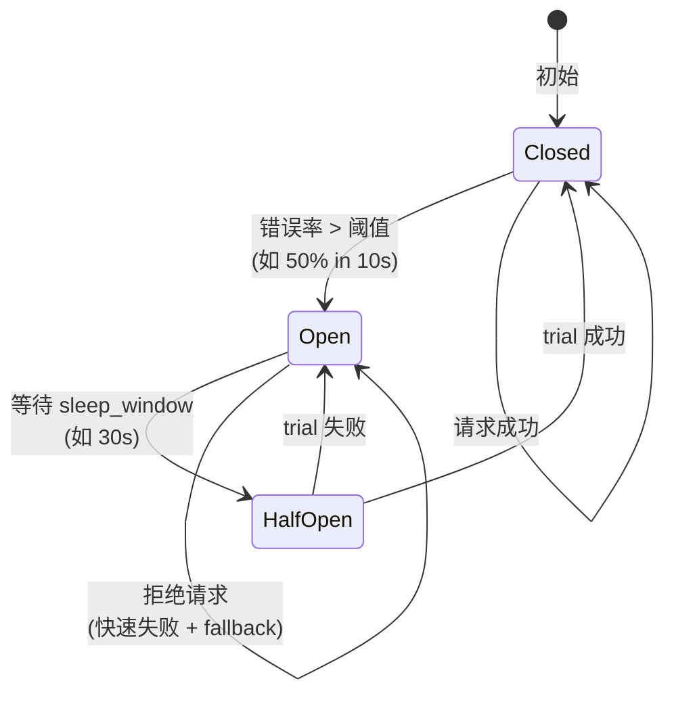

---

## 🌐 服务网格 Sidecar vs Ambient

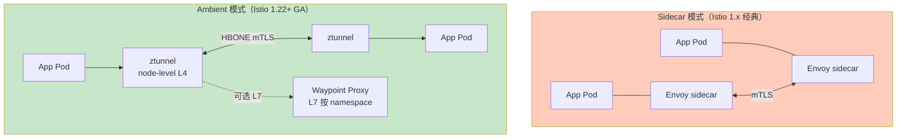

---

## 🎯 OpenTelemetry 数据流

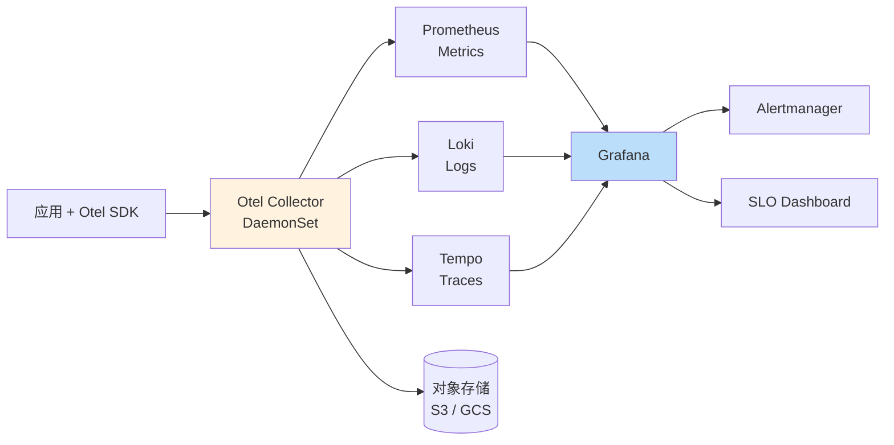

---

## 🚦 灰度发布流程

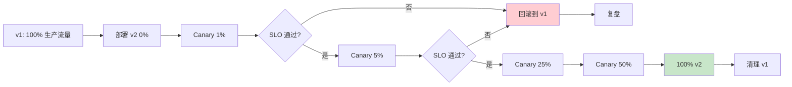

---

## 🛡️ 零信任（Zero Trust）服务身份链

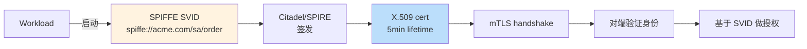

---

## 🚧 反模式速查

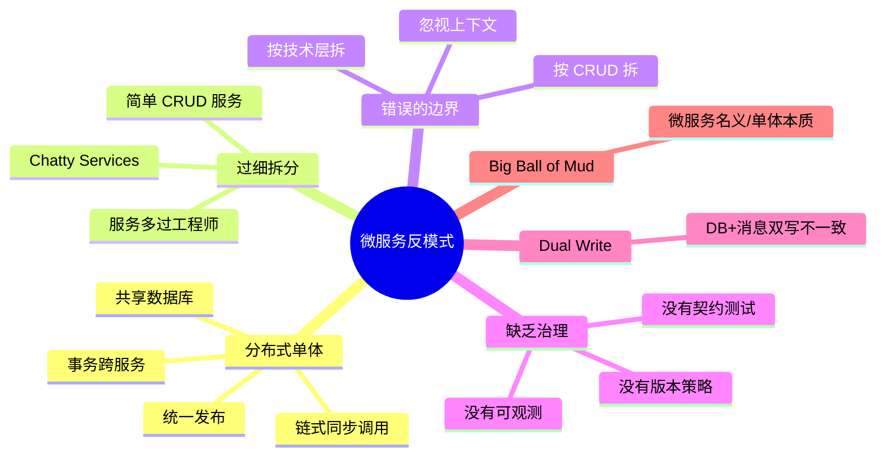

---

## 🎓 学习顺序建议

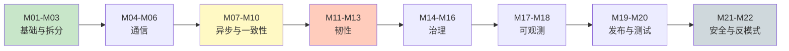

按顺序读 = 完整心智模型；按需读 = 看 [INDEX.md](./INDEX.md) 中的 6 条学习路径。
