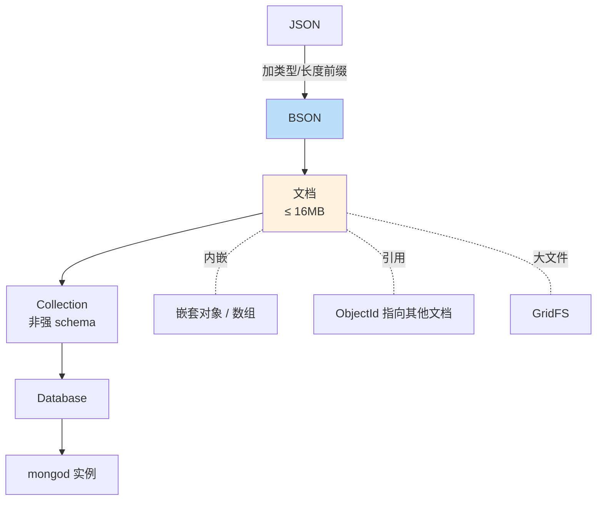

# 精通 MongoDB 文档模型与 BSON：JSON 的工程化形态

> 关联章节：[M02 索引](./02-精通-索引.md)、[M03 WiredTiger](./03-精通-WiredTiger.md)、[M10 Schema 设计](./10-精通-Schema-设计.md)

---

## 引言：MongoDB 区别于关系数据库的本质

MongoDB 不是"没有 schema 的 MySQL"。它的核心创新是**把存储单元从行变成文档**：

- 关系模型：扁平行 + 跨表 join
- 文档模型：嵌套文档 + 数组 + **一次性查询拿到完整业务对象**

这一变化带来：

- 取消 join 的需求（多数场景）
- schema 演化更自由（加字段不用 ALTER TABLE）
- 更接近应用对象模型（少 ORM 代价）

但也带来新问题：

- 嵌套到多深？文档多大？
- 同一字段不同文档可以不同类型——好是好，但难维护
- BSON 不是 JSON——多了类型，少了人类可读

读完这章你应能：

- 解释 BSON 与 JSON 的差异和编码方式
- 设计文档结构（embed vs reference 的初步判断）
- 理解 ObjectId / UUID / 自定义 _id 的选择
- 列出 16MB 文档上限的影响
- 设计 collection / database / namespace 的合理划分

---

## 第一章：从 JSON 到 BSON

### 1.1 JSON 的缺陷（在数据库视角）

JSON 是文本格式，对数据库存储 / 查询有几个痛点：

- **没有类型**：`42` 是 int 还是 double 还是 string？只能猜。
- **没有日期类型**：要约定 `"2026-05-13T00:00:00Z"` 这种字符串。
- **没有二进制**：要 base64 编码塞 string。
- **数字精度**：JavaScript 的 number 是 double，存大整数会丢精度。
- **遍历慢**：要从头扫，没有字段长度前缀。

### 1.2 BSON 的设计

**BSON = Binary JSON**。MongoDB 自己定义的二进制格式：

- **每个字段带类型 tag**
- **每个字段带长度前缀**（可跳过整个值）
- **支持丰富类型**：date / binary / regex / objectId / decimal128 / ...
- **小端字节序**

```
[total_length (4 bytes)]
[type (1 byte)][field_name][\0][value]
[type (1 byte)][field_name][\0][value]
...
[\0]
```

### 1.3 BSON 类型速查

| Type ID | 名称 | 用途 |
|---|---|---|
| 0x01 | double | 浮点 |
| 0x02 | string | UTF-8 字符串 |
| 0x03 | document | 嵌套对象 |
| 0x04 | array | 数组（其实是 0-indexed document） |
| 0x05 | binary | 二进制（含 subtype） |
| 0x07 | ObjectId | 12 字节 ID |
| 0x08 | boolean | true/false |
| 0x09 | date | 64-bit int 毫秒 |
| 0x0A | null | null |
| 0x0B | regex | 正则 |
| 0x10 | int32 | 32-bit 整数 |
| 0x11 | timestamp | 内部使用（oplog） |
| 0x12 | int64 | 64-bit 整数 |
| 0x13 | decimal128 | 128-bit 高精度小数 |
| 0xFF | minKey | 比所有都小 |
| 0x7F | maxKey | 比所有都大 |

### 1.4 比较顺序

BSON 字段比较有**跨类型顺序**（用于排序）：

```
MinKey < null < numbers (int/long/double/decimal 一起比) < string < object < array
       < binary < ObjectId < boolean < date < timestamp < regex < MaxKey
```

跨类型比较 → 有意义但容易踩坑（如 sort 时混类型导致顺序不直观）。

### 1.5 mongosh 中观察 BSON 类型

```js
> doc = { age: 25, score: 95.5, big: NumberLong("12345678901234"), price: NumberDecimal("19.99") }
> typeof doc.age          // 'number' （JS 视角）
> doc.age instanceof NumberInt   // 看实际类型
> printjson(doc)
{
  age: 25,                          // int32
  score: 95.5,                      // double
  big: Long("12345678901234"),      // int64
  price: Decimal128("19.99")        // decimal128
}
```

> 写应用代码时务必清楚每个数字字段的实际 BSON 类型——否则索引可能 mismatch，查询命中不到。

---

## 第二章：文档（Document）

### 2.1 一个文档的样子

```js
{
  _id: ObjectId("65fb8b2c1234567890abcdef"),
  user: {
    name: "Alice",
    email: "alice@example.com",
    age: 28
  },
  orders: [
    { id: "ord-1", amount: 99.5, at: ISODate("2026-05-13T10:00:00Z") },
    { id: "ord-2", amount: 49.0, at: ISODate("2026-05-13T11:00:00Z") }
  ],
  tags: ["vip", "active"],
  meta: { source: "web", version: 3 }
}
```

这是一个**业务对象**的完整表达。关系数据库会拆 5 张表 + 多次 join。

### 2.2 16MB 上限

**单个文档最大 16MB**。原因：

- 防止单文档把 WiredTiger cache 撑爆
- 复制 / 传输 / oplog 大小可控
- 业务侧逼迫"不要无限堆数据"

如果业务真的需要存超过 16MB → **GridFS**（把大文件切片成多个文档存）。

实战经验：

- 99% 业务文档 < 100KB
- 超过 1MB 就要警觉：是不是不该嵌入？
- 数组无限增长是首要风险（产品的 review 列表、用户的好友列表）

### 2.3 字段路径

```
"user.name"            访问嵌套对象字段
"orders.0.amount"      访问数组第一个元素的 amount
"orders.amount"        访问数组中所有元素的 amount（数组操作语义）
"orders.$.amount"      在 update 中匹配到第几个元素
```

理解路径语义是查询和索引的基础。

### 2.4 字段命名约束

- 不能以 `$` 开头（操作符前缀）
- 不能含 `.`（路径分隔符）—— 8.0+ 部分场景允许，但兼容性差
- `_id` 是保留字段（每个文档必须有）

---

## 第三章：_id 字段

### 3.1 默认：ObjectId

12 字节：

```
| 4 bytes timestamp | 5 bytes random | 3 bytes counter |
```

- 时间戳让 ObjectId **大致按生成时间排序**（不严格单调，多机器并发）
- random + counter 防冲突

mongosh：

```js
> id = new ObjectId()
ObjectId("65fb8b2c1234567890abcdef")
> id.getTimestamp()
ISODate("2026-05-13T10:00:00.000Z")
```

### 3.2 自定义 _id

可以用任何 BSON 类型：

```js
db.users.insertOne({ _id: "user-42", name: "Alice" })
db.events.insertOne({ _id: NumberLong(1234567), event: "click" })
db.composite.insertOne({ _id: { date: "2026-05-13", user: 42 }, count: 100 })
```

选择标准：

- **ObjectId**：默认，自动生成，时间相关，多数场景
- **数字** ID：从其他系统迁移、要有自然顺序
- **字符串** ID：业务可读（user-42）
- **复合 _id**：天然带语义的复合键（如 (date, user_id)）

### 3.3 性能影响

`_id` 自带唯一索引。它的**单调性影响写入热点**：

- ObjectId 时间前缀 → 大致单调 → 新文档总插入到 B-tree 最右侧 → **同一 page 热点**
- UUID v4（随机）→ 写入分散 → 但 cache 局部性差
- UUID v7（时间排序）→ 平衡

实战：大多数场景 ObjectId 够好。极高写入 QPS（> 100k）才需要 hash 后缀打散。

### 3.4 ObjectId 的 8.0 改进

MongoDB 8.0 把 ObjectId 内部 counter 升级为 random （非 counter），改善并发场景下连续插入的 page 热点。

---

## 第四章：Collection 与 Database

### 4.1 层级

```
mongod 实例
├── admin (database)
├── config (database)
├── local (database)        ← 副本集 oplog 在这里
└── mydb (database)
    ├── users (collection)
    ├── orders (collection)
    └── ...
```

- database：相当于命名空间
- collection：相当于"表"（但 schema 灵活）
- view：基于 collection 的虚拟视图（聚合管道结果）

### 4.2 命名规则

| 对象 | 长度上限 | 字符限制 |
|---|---|---|
| database | 64 字节 | 不含 `/\. "$*<>:|?` |
| collection | namespace 总 255 字节 | 不含 `$`、不能以 `system.` 开头 |
| field | 无明确上限，但短为好 | 不以 `$` 开头 |

namespace = `database.collection`（如 `mydb.users`）。

### 4.3 字段名长度的影响

```js
// 反例
{ "very_long_field_name_for_user_account_balance": 100 }

// 推荐
{ "balance": 100 }
```

每个文档都存字段名字符串。100M 文档每个字段名长 30 字节 vs 5 字节 → **多 2.5 GB 存储**。

经验：字段名 ≤ 15 字符。

### 4.4 系统集合

```
system.users           认证用户
system.roles           角色
system.profile         慢查询（开了 profiler）
system.indexes         索引（旧版本，新版用 $listIndexes）
config.chunks          分片 chunk 元数据
local.oplog.rs         副本集 oplog
```

通常不直接操作系统集合，用对应命令行工具。

---

## 第五章：Schema 灵活性

### 5.1 Schemaless 的真相

MongoDB 不强制 schema，但**实际上业务总有 schema**——只是 schema 在应用层：

```js
// collection users 里同时有：
{ _id: 1, name: "Alice", age: 28 }
{ _id: 2, name: "Bob", emailAddress: "bob@x.com" }  // 不同字段
{ _id: 3, name: "Charlie", age: "thirty" }  // 不同类型！
```

技术上允许，业务上灾难——查询、索引、统计全混乱。

### 5.2 实际怎么做

主流方案：

1. **应用层 schema**（Mongoose / Beanie / mongo-driver 内置 schema）
2. **MongoDB 自带 schema validator**（推荐）

```js
db.createCollection("users", {
  validator: {
    $jsonSchema: {
      bsonType: "object",
      required: ["name", "email"],
      properties: {
        name: { bsonType: "string", maxLength: 100 },
        email: { bsonType: "string", pattern: "^.+@.+$" },
        age: { bsonType: "int", minimum: 0, maximum: 150 }
      }
    }
  },
  validationLevel: "strict",
  validationAction: "error"
})
```

- `validationLevel: strict`（默认）：所有写都校验
- `validationLevel: moderate`：只校验"已经符合 validator 的文档"的更新
- `validationAction: error`（默认）：违反则拒绝
- `validationAction: warn`：违反但允许，写 log

### 5.3 演化策略

```js
// 旧 schema
{ name: "Alice", phone: "+1 555-1234" }

// 新需求：phone 拆 country + number
// 不需要 ALTER TABLE，直接：

// 1. 应用代码读时支持两种格式
function getPhone(doc) {
  if (typeof doc.phone === "string") {
    return parseLegacyPhone(doc.phone)
  }
  return { country: doc.phone.country, number: doc.phone.number }
}

// 2. 新写入用新格式
db.users.insertOne({ name: "Bob", phone: { country: 1, number: "5551234" } })

// 3. 后台慢慢迁移老文档
db.users.find({ "phone": { $type: "string" } }).forEach(doc => {
  doc.phone = parseLegacyPhone(doc.phone)
  db.users.updateOne({ _id: doc._id }, { $set: { phone: doc.phone } })
})
```

灵活演化是 MongoDB 大优势——但需要应用代码兼容多版本。

### 5.4 字段稀疏性

- 关系：每行都有所有列（NULL 填充）
- 文档：可选字段**不存就是不存**

```js
// 字段缺失的查询
db.users.find({ vip_level: { $exists: false } })   // 没有 vip_level 字段
db.users.find({ vip_level: { $exists: true } })    // 有此字段（哪怕值是 null）
db.users.find({ vip_level: null })                  // 字段不存或字段值是 null
```

注意三者语义微妙差别。

---

## 第六章：数组字段

### 6.1 数组的特殊地位

MongoDB 数组：

- 是一等公民（不像关系 DB 要拆子表）
- 支持嵌套数组、对象数组
- 可以用单字段索引就索引数组所有元素（**multi-key index**）
- 大部分查询操作符（$eq、$lt 等）作用于数组任一元素

```js
db.users.findOne({ tags: "vip" })
// 匹配 tags 数组中含 "vip" 的文档
```

### 6.2 数组操作符

```js
// 数组中至少一个元素满足
db.users.find({ "scores": { $gt: 90 } })   // 任一 score > 90

// 数组所有元素满足
db.users.find({ "scores": { $not: { $lt: 60 } } })   // 没有 < 60 的

// 元素同时满足多条件（用 $elemMatch）
db.users.find({ "orders": { $elemMatch: { status: "paid", amount: { $gt: 100 } } } })

// 数组长度
db.users.find({ "tags": { $size: 3 } })

// 更新数组
db.users.updateOne({_id:1}, { $push: { tags: "new" } })       // 加
db.users.updateOne({_id:1}, { $addToSet: { tags: "new" } })  // 加（去重）
db.users.updateOne({_id:1}, { $pull: { tags: "old" } })       // 删
db.users.updateOne({_id:1}, { $pop: { tags: 1 } })            // 删最后一个（-1 第一个）
```

### 6.3 无限增长数组反模式

```js
// 反例：用户行为日志
{
  user_id: 42,
  actions: [
    { type: "click", at: ... },
    { type: "view", at: ... },
    ...
    // 10 万条 ...
  ]
}
```

问题：

- 文档膨胀，最终 > 16MB
- 每次 $push 重写整个文档 → 极慢
- 索引 multi-key 占用大

正确做法：每个 action 一个文档：

```js
db.actions.insertOne({ user_id: 42, type: "click", at: ... })
```

或 **bucket pattern**（每 N 个聚合一个文档，详见 M10）。

---

## 第七章：日期与时间

### 7.1 BSON Date

64-bit 整数，表示 UTC 毫秒：

```js
> new Date()
ISODate("2026-05-13T10:30:00.123Z")
> ISODate("2026-05-13").getTime()
1747094400000
```

- 内部都是 UTC（应用层转时区）
- 范围：±2^63 ms ≈ ±2.9 亿年（够用）
- 精度：毫秒（要纳秒精度用 timestamp 或自存 long）

### 7.2 时区注意事项

存：

```js
db.events.insertOne({ at: new Date("2026-05-13T10:00:00+08:00") })
// 实际存的是 UTC 2026-05-13T02:00:00Z
```

查：

```js
db.events.find({ at: { $gte: new Date("2026-05-13T00:00:00+08:00") } })
// 按 +08:00 时区查
```

**约定**：存 UTC，应用层转。

### 7.3 Timestamp 类型（不要混淆）

```js
> new Timestamp({ t: 1747094400, i: 1 })
```

BSON Timestamp 是**内部使用**（oplog 用它做全序）。秒数 + 计数器。

业务代码用 Date，不用 Timestamp。

### 7.4 Time Series Collections

MongoDB 5.0+ 引入。优化时序数据：

```js
db.createCollection("temperature", {
  timeseries: {
    timeField: "ts",
    metaField: "sensor_id",
    granularity: "seconds"   // seconds / minutes / hours
  },
  expireAfterSeconds: 86400 * 30   // 30 天 retention
})
```

内部用 **bucket 模式**自动把同 sensor 的多个时间点聚合到一个文档。压缩比和查询速度都好。详见 M10。

---

## 第八章：二进制与大文件

### 8.1 BinData

```js
> bytes = BinData(0, "SGVsbG8gV29ybGQ=")   // subtype 0, base64
> bytes.length()
11
```

适合：

- 图片缩略图（< 16MB）
- 加密的字段（FLE / Queryable Encryption）
- UUID（subtype 4）

不适合：

- 大文件（> 几 MB）—— 用 GridFS

### 8.2 GridFS

把大文件切片（默认 255KB chunk）存到两个 collection：

```
fs.files     文件元数据（每文件一个文档）
fs.chunks    切片（每切片一个文档）
```

```bash
mongofiles --uri=... put big_video.mp4
mongofiles --uri=... list
mongofiles --uri=... get big_video.mp4
```

适合：

- 单文件 > 16MB
- 需要随机读（按 offset 拉某段，比直接存 BinData 优）
- 文件元数据要查询

**不推荐当 S3 用**——MongoDB 不是对象存储，吞吐和成本都不如真正的对象存储。GridFS 适合"已经在用 MongoDB，文件不多不大，省一套基础设施"的场景。

---

## 第九章：编码与字符集

### 9.1 字符串

BSON string 是 **UTF-8**：

- 全球字符无缝
- 字段名也是 UTF-8（虽然不推荐 ascii 之外的字段名）

### 9.2 比较顺序（collation）

默认按字节序比较：

```js
db.users.find({}).sort({ name: 1 })
// "Apple", "Banana", "apple" - 大写在前
```

collation 让"按语言规则比"：

```js
db.users.createIndex({ name: 1 }, {
  collation: { locale: "zh", strength: 1 }
})

db.users.find({}, {}, {
  collation: { locale: "zh", strength: 1 }
}).sort({ name: 1 })
// 按中文拼音排序、不区分大小写
```

strength：

- 1：base letter（不区分大小写、不区分变音）
- 2：+ 区分变音
- 3：+ 区分大小写（默认）
- 4：标点也算
- 5：完全字节

实操：业务有多语言或大小写不敏感查询，要建带 collation 的索引；否则用不到索引。

---

## 第十章：典型陷阱

### 10.1 字段类型不一致

```js
db.users.insertOne({ _id: 1, age: 25 })       // int32
db.users.insertOne({ _id: 2, age: "twenty" }) // string
db.users.find({ age: { $gte: 20 } })          // 只匹配 age 是数字的
```

修复：写 schema validator 早期拦截。

### 10.2 大文档拖慢复制

oplog 是个上限大小的 capped collection（默认几 GB）。一条 10MB 大文档的更新 → oplog 一下消耗大块空间。

修复：

- 监控单 update / insert 体积
- oplog 调大（一般几 GB - 几十 GB）
- 业务拆文档

### 10.3 数字精度

```js
// JavaScript 默认 number 是 double
db.t.insertOne({ amount: 0.1 + 0.2 })   // 0.30000000000000004

// 财务用 Decimal128
db.t.insertOne({ amount: NumberDecimal("0.1").add(NumberDecimal("0.2")) })  // 0.3 准确
```

财务 / 金融场景一律 Decimal128。

### 10.4 $ 前缀字段名

```js
db.t.insertOne({ "$foo": 1 })  // 写入失败
```

应用代码动态字段名时要先 escape：

```js
sanitize(key) {
  if (key.startsWith("$") || key.includes(".")) throw new Error("invalid field name")
}
```

### 10.5 ObjectId 时间精度只到秒

```js
> id1 = new ObjectId()
> sleep(500)
> id2 = new ObjectId()
> id1 < id2  // 不一定！同秒内顺序看 counter
```

不要把 ObjectId 当严格单调时间戳用。

---

## 第十一章：实战 schema 示例

### 11.1 用户表

```js
{
  _id: ObjectId("..."),
  email: "alice@example.com",
  emailVerified: true,
  name: "Alice Wonder",
  profile: {
    avatar: "https://...",
    bio: "Backend dev",
    location: { country: "US", city: "NYC" }
  },
  preferences: {
    locale: "en-US",
    timezone: "America/New_York",
    notifications: { email: true, push: false }
  },
  createdAt: ISODate("..."),
  updatedAt: ISODate("...")
}

// 索引
db.users.createIndex({ email: 1 }, { unique: true })
db.users.createIndex({ "profile.location.country": 1 })
db.users.createIndex({ createdAt: 1 })
```

### 11.2 订单表

```js
{
  _id: ObjectId("..."),
  userId: ObjectId("..."),
  status: "paid",        // "pending" / "paid" / "shipped" / "delivered" / "cancelled"
  items: [
    { sku: "ABC", name: "Widget", qty: 2, price: NumberDecimal("19.99") },
    { sku: "XYZ", name: "Gadget", qty: 1, price: NumberDecimal("99.00") }
  ],
  total: NumberDecimal("138.98"),
  shipping: {
    address: { ... },
    method: "express",
    cost: NumberDecimal("9.99")
  },
  payment: {
    method: "card",
    cardLast4: "1234",
    paidAt: ISODate("...")
  },
  createdAt: ISODate("..."),
  updatedAt: ISODate("...")
}
```

要点：

- userId 用 ObjectId reference（详见 M10 embed vs reference）
- items embed（不可能 > 100 项）
- 金额用 Decimal128
- 历史不可变字段（如 createdAt）单独
- 状态机字段（status）方便查询 / 索引

---

## 总结 · 文档模型一图



文档模型心法：

1. **BSON ≠ JSON**——多类型、二进制、按字段长度跳过
2. **16MB 是硬上限**——超过用 GridFS 或拆文档
3. **schemaless 不等于无 schema**——应用层 + validator 共同保证
4. **数组是一等公民**——但无限增长是反模式
5. **字段名短**——海量文档累加几 GB

---

## 练习题

1. BSON 与 JSON 的 3 个关键差异？
2. 16MB 文档上限怎么影响 schema 设计？
3. ObjectId 的 12 字节如何构成？
4. 自定义 _id 用 UUID v4 vs ObjectId 的取舍？
5. schema validator 的 strict / moderate 区别？
6. 数组字段无限增长的反模式有什么具体危害？
7. Decimal128 与 double 的差异？什么场景必须用 Decimal128？
8. multi-key index 是什么意思？
9. collation 解决什么问题？默认为什么不开？
10. GridFS 适合什么场景不适合什么场景？

> 答案见 [QUIZ.md](./QUIZ.md)

---

> 📁 本文位于 `/data/workspace/dp4/mongodb/01-精通-文档模型-与-BSON.md`
> 🔁 反馈：`mongosh` 试着插入混类型文档，观察 sort 顺序
