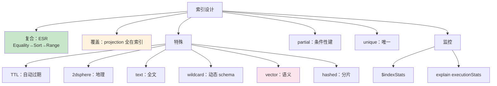

# 精通 MongoDB 索引体系：B-tree、复合、TTL、地理、文本、向量

> 关联章节：[M01 文档模型](./01-精通-文档模型-与-BSON.md)、[M04 查询与聚合](./04-精通-查询与聚合管道.md)、[M08 性能调优](./08-精通-性能调优.md)

---

## 引言：索引是 MongoDB 性能的灵魂

MongoDB 默认只对 `_id` 建索引。其他字段查询全是 **collection scan**（扫整个集合）—— 数据量大就崩。

学好索引意味着掌握：

- 什么样的查询能走索引
- 怎么设计复合索引覆盖多种查询
- 各种特殊索引（TTL、地理、文本、向量）的取舍
- explain 怎么读、stage 怎么分析

读完本章你应能：

- 设计 ESR 规则的复合索引
- 区分覆盖索引、multi-key 索引、partial 索引
- 用 wildcard 索引处理动态 schema
- 启用 vector search 做语义检索
- 用 explain 验证索引选择

---

## 第一章：索引基础

### 1.1 索引是什么

MongoDB 索引本质：**B-tree 数据结构 + 文档指针**。

```
索引 B-tree:
   [age=25,...] → 文档 RecordId
   [age=30,...] → 文档 RecordId
   [age=35,...] → 文档 RecordId

主表（按 RecordId 物理顺序）:
   RecordId 1 → { _id:..., age:25, name:"Alice", ... }
   RecordId 2 → { _id:..., age:30, ... }
```

查询时：

1. 在 B-tree 上找匹配的索引项 → RecordId
2. 按 RecordId 去主表取完整文档（**fetch**）
3. 返回

如果索引能覆盖所有查询字段（覆盖索引），第 2 步省去。

### 1.2 为什么用 B-tree 不用 hash

- B-tree 支持范围查询、排序
- hash 只支持等值
- MongoDB 也有 `hashed` 索引，但仅用于分片 / 等值

### 1.3 创建与删除

```js
// 创建
db.users.createIndex({ email: 1 }, { unique: true })

// 列所有
db.users.getIndexes()

// 看大小
db.users.stats().indexSizes

// 删
db.users.dropIndex("email_1")

// 删全部（除 _id）
db.users.dropIndexes()
```

`1` 表示升序，`-1` 表示降序。

### 1.4 后台创建

```js
db.users.createIndex({ name: 1 }, { background: true })   // 4.2 前的语法
```

MongoDB 4.2+ 默认就是 **online build**（不阻塞读写）。`background` 参数被忽略。

代价：online build 比离线慢 ~30%，但生产更安全。

---

## 第二章：复合索引

### 2.1 字段顺序很重要

```js
db.users.createIndex({ country: 1, age: 1, name: 1 })
```

支持的查询：

- `{ country }` ✅
- `{ country, age }` ✅
- `{ country, age, name }` ✅
- `{ age }` ❌ —— 缺前缀
- `{ country, name }` ⚠️ —— country 能用，name 不能

**只能用前缀**。

### 2.2 ESR 规则

设计复合索引顺序的最佳实践：

> **Equality（等值）→ Sort（排序）→ Range（范围）**

例：要查 `country = "US"` 且 `age > 18`，按 `lastLogin` 排序：

```js
db.users.createIndex({ country: 1, lastLogin: -1, age: 1 })
//                     ^ Equality   ^ Sort       ^ Range
```

为什么这顺序？

- Equality 在前：快速缩小范围（最有选择性）
- Sort 中间：B-tree 自然有序，不用额外 sort 操作
- Range 在后：范围扫描发生在最后阶段

### 2.3 案例

```js
db.orders.createIndex({ status: 1, createdAt: -1, amount: 1 })
```

适合：

```js
db.orders.find({ status: "paid", amount: { $gt: 100 } }).sort({ createdAt: -1 })
//              equality          range                      sort（已经在索引里）
```

不适合：

```js
db.orders.find({ amount: { $gt: 100 } })  // 缺 status，扫全索引
```

### 2.4 索引的方向

```js
db.orders.createIndex({ createdAt: -1 })

db.orders.find({}).sort({ createdAt: -1 })   // ✅ 索引方向匹配
db.orders.find({}).sort({ createdAt:  1 })   // ✅ 反向扫，仍走索引
```

但**复合索引**的方向要看整体一致：

```js
db.orders.createIndex({ status: 1, createdAt: -1 })

db.orders.find({status:"paid"}).sort({createdAt:-1})  // ✅
db.orders.find({status:"paid"}).sort({createdAt:1})   // ⚠️ 反向，需 in-memory sort 或选另一索引
```

---

## 第三章：覆盖索引（Covered Query）

### 3.1 概念

查询只用到索引里的字段，**不需要 fetch 主文档**：

```js
db.users.createIndex({ email: 1, name: 1 })

db.users.find({ email: "alice@x.com" }, { _id: 0, name: 1 }).explain()
// 走 IXSCAN，没有 FETCH stage → 覆盖
```

### 3.2 必须满足的条件

1. 查询字段 + projection 字段全在索引中
2. 显式排除 `_id`（或 `_id` 也在索引中）

```js
db.users.find({ email: "alice@x.com" }, { _id: 0, name: 1, email: 1 })  // 覆盖
db.users.find({ email: "alice@x.com" }, { name: 1 })                     // 不覆盖（要 _id）
db.users.find({ email: "alice@x.com" })                                  // 不覆盖（要全文档）
```

### 3.3 性能差异

- 普通：IXSCAN + FETCH（多一次磁盘 / cache 访问）
- 覆盖：IXSCAN 后直接返回

实测：覆盖索引比 fetch 快 2-5×（看 cache 命中）。

### 3.4 实战考量

为了覆盖索引把字段塞进索引：

```js
db.users.createIndex({ email: 1, name: 1, avatar: 1, bio: 1 })
```

代价：

- 索引大（写入更慢）
- 多个查询模式时索引爆炸

权衡：只在**高频 + 只读少字段**的查询用覆盖索引。

---

## 第四章：Multi-key 索引（数组索引）

### 4.1 自动 multi-key

```js
db.products.insertMany([
  { _id: 1, tags: ["red", "small"] },
  { _id: 2, tags: ["blue", "large"] },
  { _id: 3, tags: ["red", "large"] }
])

db.products.createIndex({ tags: 1 })
```

索引项：

```
"blue" → 2
"large" → 2, 3
"red" → 1, 3
"small" → 1
```

→ 数组中每个元素都在索引里有项。**multi-key 自动开启**。

### 4.2 查询

```js
db.products.find({ tags: "red" })           // ✅ 索引
db.products.find({ tags: { $in: ["red", "blue"] } })  // ✅ 索引
db.products.find({ tags: { $all: ["red", "large"] } }) // ✅ 索引（看实现）
```

### 4.3 限制

- **复合索引中最多一个数组字段**：
  ```js
  db.t.createIndex({ tags: 1, categories: 1 })   // 如果两者都是数组 → 错误
  ```
- 不能覆盖（fetch 是必须的，因为 multi-key 存的是单元素值不是完整数组）
- 占用空间大（数组长度 × 文档数）

### 4.4 嵌套数组

```js
{ comments: [ { author: "A", text: "..." }, { author: "B", text: "..." } ] }

db.posts.createIndex({ "comments.author": 1 })
db.posts.find({ "comments.author": "A" })   // 用索引
```

支持。索引大小 ∝ 数组元素数。

---

## 第五章：唯一索引

### 5.1 用法

```js
db.users.createIndex({ email: 1 }, { unique: true })

db.users.insertOne({ email: "a@x.com" })   // OK
db.users.insertOne({ email: "a@x.com" })   // E11000 duplicate key error
```

### 5.2 null 与缺失字段

```js
db.users.createIndex({ email: 1 }, { unique: true })

db.users.insertOne({ name: "A" })   // 没 email
db.users.insertOne({ name: "B" })   // 没 email → 触发 duplicate（null 算同值）
```

修复：用 partial index：

```js
db.users.createIndex(
  { email: 1 },
  { unique: true, partialFilterExpression: { email: { $type: "string" } } }
)
```

只对有 email 的文档建唯一索引。

### 5.3 复合唯一

```js
db.users.createIndex({ tenant: 1, email: 1 }, { unique: true })
// 同租户内 email 唯一
```

---

## 第六章：Partial Index

### 6.1 用途

只对满足条件的文档建索引，省空间：

```js
db.orders.createIndex(
  { customerId: 1 },
  { partialFilterExpression: { status: "active" } }
)
```

- 索引只含 `status: "active"` 的订单
- 查询能走索引的条件：必须**也包含 `status: "active"`**

```js
db.orders.find({ customerId: 42, status: "active" })   // ✅ 索引
db.orders.find({ customerId: 42 })                      // ❌ 不走索引（少了 status）
```

### 6.2 适合场景

- 大集合，但只有少数文档常被查（如"活跃订单"）
- 唯一性只对部分文档（email 字段，但允许缺失）
- 历史数据冷数据可不索引

### 6.3 vs Sparse Index

| 索引类型 | 行为 |
|---|---|
| sparse | 字段不存在的文档不索引（老语法） |
| partial | 任意条件不满足的文档不索引（更灵活） |

新版本用 partial 替代 sparse。

---

## 第七章：TTL 索引

### 7.1 工作原理

后台任务（每 60 秒）扫描带 TTL 的索引，删除过期文档：

```js
db.sessions.createIndex({ lastAccess: 1 }, { expireAfterSeconds: 3600 })
// lastAccess 字段超过 1 小时的文档会被删
```

### 7.2 适合场景

- 会话 session
- 缓存数据
- 临时日志
- 一次性 token

### 7.3 注意事项

- **删除不实时**：可能晚 60 秒以上才删（背景任务周期）
- 字段必须是 **BSON Date**（int 不行）
- 不能在副本集 secondary 上工作（只在 primary 删，复制到 secondary）
- 不能与 compound index 第一字段以外结合

### 7.4 自定义过期时间

```js
db.sessions.createIndex({ expireAt: 1 }, { expireAfterSeconds: 0 })

db.sessions.insertOne({
  user: 42,
  expireAt: new Date(Date.now() + 3600 * 1000)   // 1 小时后
})
```

`expireAfterSeconds: 0` + 字段值是绝对过期时间 → 任意自定义过期。

---

## 第八章：地理索引

### 8.1 2dsphere（球面）

```js
db.places.insertMany([
  { name: "Eiffel", loc: { type: "Point", coordinates: [2.2945, 48.8584] } },
  { name: "Louvre", loc: { type: "Point", coordinates: [2.3376, 48.8606] } }
])

db.places.createIndex({ loc: "2dsphere" })

// 附近查询
db.places.find({
  loc: {
    $near: {
      $geometry: { type: "Point", coordinates: [2.30, 48.85] },
      $maxDistance: 5000   // 米
    }
  }
})

// 多边形内
db.places.find({
  loc: { $geoWithin: { $geometry: { type: "Polygon", coordinates: [...] } } }
})
```

支持 GeoJSON 类型：Point / LineString / Polygon / MultiPoint 等。

### 8.2 2d（平面）

老格式，平面坐标系。99% 场景用 2dsphere（球面更准）。

### 8.3 实战注意

- coordinates 顺序：**[longitude, latitude]**（经纬度，先经后纬）
- 用米作单位（球面距离自动算）
- $near 自动按距离排序（不需要 sort）
- $maxDistance 必须配 $near 才生效

---

## 第九章：文本索引

### 9.1 基本用法

```js
db.articles.createIndex({ title: "text", content: "text" })

db.articles.find({ $text: { $search: "mongodb performance" } })
```

`$text` 查询：

- 分词（空格 + 标点）
- 大小写不敏感
- 默认 OR（任一词命中即可）
- 加引号是 phrase：`"$search": "\"mongodb performance\""`

### 9.2 score

```js
db.articles.find(
  { $text: { $search: "mongodb" } },
  { score: { $meta: "textScore" } }
).sort({ score: { $meta: "textScore" } })
```

按相关度排。

### 9.3 限制

- **每集合只能有 1 个文本索引**
- 不支持复杂 query（不及 Elasticsearch / Lucene）
- 中文支持差（默认按空格切，要装第三方分词器或 Atlas Search）

### 9.4 替代：Atlas Search

MongoDB Atlas 提供基于 Lucene 的全文索引：

- 真正的 IK / 中文分词支持
- 高级查询（fuzzy / phrase / synonym）
- 不占主集群资源

自托管 MongoDB 没这个能力，要全文检索通常配 Elasticsearch。

---

## 第十章：Wildcard 索引

### 10.1 用途

应对**动态 schema**（字段不固定）：

```js
db.events.insertMany([
  { user: 1, props: { color: "red", size: 10 } },
  { user: 2, props: { brand: "Nike", color: "blue" } },
  { user: 3, props: { weight: 2.5 } }
])

// 不知道 props 下有哪些字段，但都想能查
db.events.createIndex({ "props.$**": 1 })

db.events.find({ "props.color": "red" })   // ✅ 走索引
db.events.find({ "props.weight": 2.5 })    // ✅ 走索引
```

`$**` 通配符匹配任意嵌套字段。

### 10.2 全文档 wildcard

```js
db.events.createIndex({ "$**": 1 })
```

整个文档每个字段都建索引——**索引大，慎用**。

### 10.3 排除字段

```js
db.events.createIndex({ "$**": 1 }, { wildcardProjection: { "internal": 0 } })
```

### 10.4 局限

- 7.0 起支持 **compound wildcard index**（一个 wildcard 字段 + 其他普通字段），但仍只能含一个 wildcard 字段
- 数组也算（multi-key 同时启用）
- 查询语法对单字段：`{"prop.x": value}`（不支持 $or 等不固定路径）

适合：**真正动态的 schema**（产品属性、事件 props）。

---

## 第十一章：Hashed 索引

### 11.1 用途

```js
db.users.createIndex({ user_id: "hashed" })
```

- 索引项是字段值的 hash（64-bit）
- 等值查询走索引
- **范围查询不走**（hash 后顺序无意义）

主要用于**分片**——hashed shard key 让数据均匀分布，避免单调写入热点。

### 11.2 复合 hashed（4.4+）

```js
db.users.createIndex({ region: 1, user_id: "hashed" })
```

region 等值后 user_id hashed 分散——分片场景常用模式。

---

## 第十二章：Vector Search

### 12.1 MongoDB Atlas Vector Search（Atlas / 7.0+ Atlas Local）

向量搜索主要在 **MongoDB Atlas** 上提供，自托管 Community/Enterprise 8.2+ 通过独立的 **mongot** 二进制（2025 年 9 月起 public preview）也能用。语法用 **createSearchIndex** 而非 createIndex：

```js
db.docs.createSearchIndex(
  "vector_index",
  "vectorSearch",
  {
    fields: [
      {
        type: "vector",
        path: "embedding",
        numDimensions: 768,
        similarity: "cosine"     // cosine / euclidean / dotProduct
      }
    ]
  }
)

// 查询（用 $vectorSearch 聚合 stage）
db.docs.aggregate([
  {
    $vectorSearch: {
      index: "vector_index",
      path: "embedding",
      queryVector: [0.1, 0.2, ...],
      numCandidates: 100,
      limit: 10
    }
  }
])
```

实现：ANN（HNSW 算法），与 ES、Pinecone 类似。

### 12.2 适用场景

- RAG（Retrieval-Augmented Generation）
- 推荐系统
- 图片 / 文档相似度

### 12.3 vs 专用向量库

| 维度 | MongoDB Vector | 专用向量库（Qdrant / Pinecone） |
|---|---|---|
| 一站式 | ✅（一套 stack） | ❌（额外服务） |
| 性能极限 | 中（HNSW 实现） | 高（专门优化） |
| 过滤 + 向量 | ✅（hybrid 容易） | 一般要专门接口 |
| 数据量上限 | 看 cache（一般 < 千万）| 高 |

业务向量量不大（< 1000 万）+ 已有 MongoDB → 集成方便。极端规模选专用。

---

## 第十三章：索引选择与 explain

### 13.1 explain 三种模式

```js
db.users.find({age: 25}).explain()                     // queryPlanner（默认，不执行）
db.users.find({age: 25}).explain("executionStats")     // 含实际执行统计
db.users.find({age: 25}).explain("allPlansExecution")  // 含所有候选 plan 的执行
```

### 13.2 关键字段

```json
{
  "winningPlan": {
    "stage": "FETCH",
    "inputStage": {
      "stage": "IXSCAN",
      "indexName": "age_1",
      "indexBounds": { "age": ["[25, 25]"] }
    }
  },
  "executionStats": {
    "totalKeysExamined": 100,    // 看了多少索引项
    "totalDocsExamined": 100,    // fetch 了多少文档
    "nReturned": 100,            // 返回多少
    "executionTimeMillis": 5
  }
}
```

健康指标：

- `nReturned / totalKeysExamined` 接近 1（索引选择性好）
- `totalDocsExamined / nReturned` 接近 1（少 fetch）

### 13.3 Stage 类型

| Stage | 含义 |
|---|---|
| COLLSCAN | 全集合扫描（坏） |
| IXSCAN | 索引扫描 |
| FETCH | 按索引去主表取 |
| SORT | 内存排序（如索引不能 sort） |
| LIMIT | 限制返回数 |
| PROJECTION | 字段裁剪 |
| TEXT | 文本索引 |
| GEO_NEAR_2DSPHERE | 地理 |
| SORT_MERGE | 合并多个已排序的 IXSCAN 流（常见于带 sort 的 $in / $or 查询） |

### 13.4 选错索引怎么办

MongoDB 优化器有时选错：

```js
// 强制走某索引
db.users.find({...}).hint("email_1")
db.users.find({...}).hint({ email: 1 })

// 或在 explain 中看候选 plan，调整索引消除歧义
```

实战：

- 大多数情况优化器正确
- 极少数（统计偏差）需要 hint
- 长期：改索引设计，让目标索引"唯一最优"

---

## 第十四章：索引维护

### 14.1 索引大小

```js
db.users.stats().indexSizes
// { "_id_": 1024000, "email_1": 5120000, ... }
```

经验：索引总大小 < 数据大小 1× 算合理，> 2× 警觉。

### 14.2 未使用索引

```js
db.users.aggregate([{ $indexStats: {} }])
// 看每个索引被用次数
```

长期 `accesses.ops = 0` 的索引可以删（省写入开销）。

### 14.3 索引重建

WiredTiger 索引一般不需要 rebuild（不像 InnoDB）。极少数情况下索引膨胀：

```js
db.users.reIndex()   // 重建所有索引（阻塞）
```

生产慎用，备用方案：drop + recreate。

### 14.4 在线 build

```js
db.users.createIndex({ name: 1 })   // 默认 online
```

资源占用：

- 一个后台线程
- 占少量 cache
- 大集合可能要几小时
- 中途可以 kill：`db.killOp(opid)`

监控：

```js
db.currentOp({ "command.createIndexes": { $exists: true } })
```

### 14.5 滚动 build（副本集）

```js
// secondary 一个个 detach、单机起、build index、重新 join
// 减少 primary 负载
```

通常不需要（online build 已经够）。

---

## 第十五章：典型故障

### 15.1 案例：所有查询都全表扫

**症状**：query 慢，explain 显示 COLLSCAN。

**诊断**：

```js
db.users.getIndexes()   // 是否有适合的索引
```

**根因**：没建索引，或建了但查询条件不匹配前缀。

**修复**：按 ESR 规则建索引。

### 15.2 案例：索引建了但没用

**症状**：`getIndexes` 显示 `{country: 1, age: 1}`，但 `find({age: 25})` 还是 COLLSCAN。

**根因**：缺前缀 `country`。

**修复**：

- 加 country 到查询条件
- 或建 `{age: 1, country: 1}` 索引（如果业务真的不带 country）

### 15.3 案例：复合索引顺序错

**症状**：`find({status:"paid"}).sort({createdAt:-1})` 有索引但仍慢。

**根因**：

```js
db.orders.createIndex({ createdAt: -1, status: 1 })  // 错顺序
```

应该 status 在前（equality）：

```js
db.orders.createIndex({ status: 1, createdAt: -1 })  // ESR 正确
```

### 15.4 案例：TTL 不删除

**症状**：TTL 索引建了，但文档没过期。

**诊断**：

- 字段是 Date 类型吗？（不能是 string / number）
- expireAfterSeconds 是否正确？
- secondary 不删，看 primary 节点

```js
db.runCommand({ serverStatus: 1 }).metrics.ttl   // TTL 任务统计
```

### 15.5 案例：unique 索引 duplicate key error

**症状**：批量 insert 时报 E11000。

**根因**：业务有真正的重复，或 null 字段触发"null 算同值"。

**修复**：

- 业务侧去重
- 或改 partial index 只对非 null 唯一

---

## 第十六章：实战索引设计

### 16.1 用户表

```js
db.users.createIndex({ email: 1 }, { unique: true })
db.users.createIndex({ phone: 1 }, { unique: true, partialFilterExpression: { phone: { $type: "string" } } })
db.users.createIndex({ createdAt: -1 })
db.users.createIndex({ "address.country": 1, "address.city": 1 })
```

### 16.2 订单表

```js
// 按用户查历史订单
db.orders.createIndex({ userId: 1, createdAt: -1 })
// 按状态 + 时间筛
db.orders.createIndex({ status: 1, createdAt: -1 })
// 唯一订单号
db.orders.createIndex({ orderNo: 1 }, { unique: true })
// 商家维度
db.orders.createIndex({ merchantId: 1, createdAt: -1, status: 1 })
```

### 16.3 时序数据

```js
db.metrics.createIndex({ host: 1, ts: -1, metric: 1 })

// 或用 Time Series Collection 自动创建合适索引
```

### 16.4 全文 + 地理

```js
db.shops.createIndex({ name: "text", description: "text" })
db.shops.createIndex({ location: "2dsphere" })
db.shops.createIndex({ category: 1, location: "2dsphere" })   // 复合 + 地理
```

后者支持 "category=餐厅 + 5km 内" 的查询。

---

## 总结 · 索引一图流



索引心法：

1. **ESR 规则** 是复合索引设计的金线
2. **覆盖索引** 减一次 fetch，热路径必备
3. **TTL / Geo / Text / Vector / Wildcard** 是特殊场景神器
4. **partial / unique** 控制空间和约束
5. **explain executionStats** 是验证唯一手段——不要凭感觉

---

## 练习题

1. ESR 规则的全称和理由？
2. 复合索引 `{a:1, b:1, c:1}` 能加速哪些查询？
3. 覆盖索引的两个必要条件？
4. multi-key 索引为什么不能两个数组字段一起？
5. TTL 索引的字段必须是什么类型？删除多久一次？
6. partial vs sparse 区别？
7. wildcard 索引适合什么不适合什么？
8. unique 索引下 null 字段为什么会"重复"？
9. hashed 索引为什么不支持范围查询？
10. vector search 与 ES 的 dense_vector 概念区别？

> 答案见 [QUIZ.md](./QUIZ.md)

---

> 🔁 反馈：建几种索引跑 explain 对比 totalKeysExamined / nReturned
