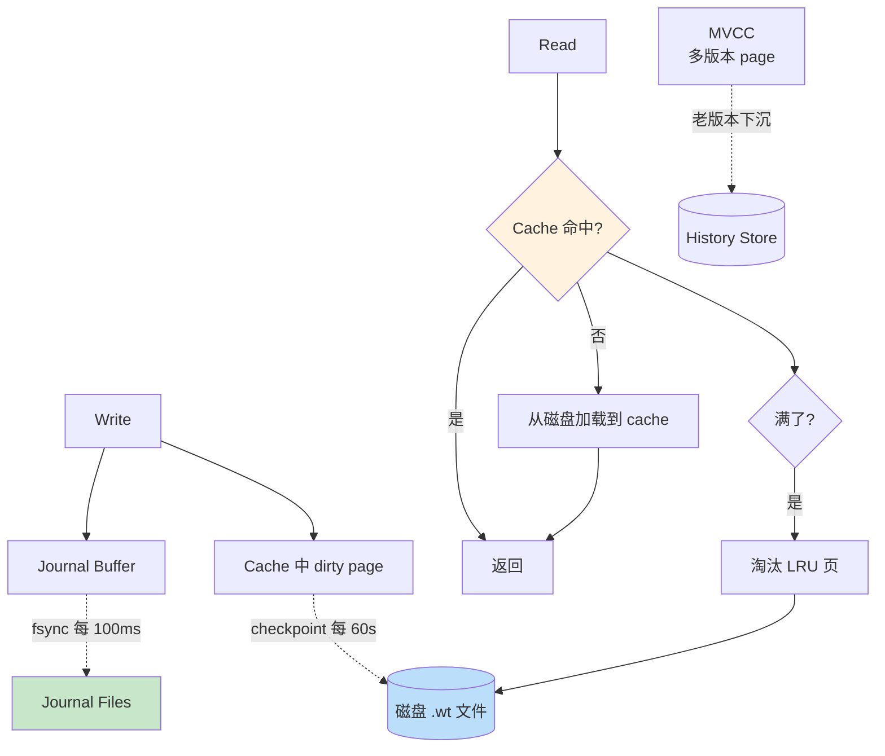

# 精通 WiredTiger 存储引擎：Cache、Checkpoint、Journal 与压缩

> 关联章节：[M02 索引](./02-精通-索引.md)、[M08 性能调优](./08-精通-性能调优.md)、[M12 生产运维](./12-精通-生产运维-与-替代品.md)

---

## 引言：MongoDB 的存储底盘

MongoDB 3.0（2015 年 3 月）首次把 **WiredTiger**（WT）作为可选引擎引入；**3.2（2015 年 12 月）起 WT 成为默认存储引擎**，逐步替代 MMAPv1。这是 MongoDB 历史上最重要的架构改变之一：

- MMAPv1：基于 mmap 文件，3.0 之前是数据库级锁、3.0 改进为集合级锁，写性能差
- WiredTiger：B-tree / LSM 双引擎，**文档级 MVCC**，压缩，并发好

到 2026 年 WiredTiger 已经是默认且唯一可用的引擎。MMAPv1 在 4.0 弃用、4.2 正式移除，In-Memory 引擎只在企业版有。

但 WiredTiger 不是 MongoDB 独有——是 MongoDB 收购的独立开源引擎（[wiredtiger.com](http://source.wiredtiger.com/)），也被其他项目使用。

读完本章你应能：

- 解释 WT cache、journal、checkpoint 三者关系
- 调整 cache 大小、checkpoint 间隔、journal 频率
- 区分 B-tree 与 LSM 适用场景
- 设置合适的压缩算法
- 诊断 cache pressure、checkpoint stall 等故障

---

## 第一章：架构概览

### 1.1 三层

```
┌─────────────────────────────────────┐
│  WiredTiger Cache（in-memory）       │  ~50% RAM
│  ├── BTree pages (collection + index)│
│  └── 已修改但未刷盘的 dirty pages    │
├─────────────────────────────────────┤
│  Journal（WAL，按 file group 滚动）  │  保证持久性
├─────────────────────────────────────┤
│  Data files（.wt 文件，B-tree 持久层）│  磁盘
└─────────────────────────────────────┘
```

工作流：

- **写**：先 update cache 中的 page（dirty page） + append journal
- **持久**：journal 定时 fsync（默认 100ms） + cache dirty page 定时 checkpoint（默认 60s）
- **读**：从 cache 取（命中）/ 从磁盘 page 加载到 cache

### 1.2 与 MySQL InnoDB 对比

| 概念 | MongoDB WT | MySQL InnoDB |
|---|---|---|
| 缓存 | WT Cache | Buffer Pool |
| WAL | Journal | redo log |
| 落盘策略 | Checkpoint（每 60s） | flush list / checkpoint |
| 隔离实现 | MVCC（自管） | MVCC（undo log） |
| Page 大小 | 默认 32KB（可压缩到 4-8 KB） | 默认 16KB |

整体设计相似——都是"WAL + 缓冲 + 异步刷盘"。

---

## 第二章：Cache（缓存）

### 2.1 默认大小

```
WT cache = max(50% × (RAM - 1GB), 256MB)
```

例：

- 8 GB RAM → 3.5 GB cache
- 16 GB RAM → 7.5 GB cache
- 64 GB RAM → 31.5 GB cache

### 2.2 调整

```yaml
# mongod.conf
storage:
  wiredTiger:
    engineConfig:
      cacheSizeGB: 16   # 显式指定
```

实战经验：

- 默认值适合**专用机器**
- 共享机器（与其他服务共用）必须降到 30-40%
- 容器化部署要看 cgroup limit（mongod 5.0 起会读 cgroup）

### 2.3 Cache 中存什么

- B-tree 内部节点（索引上层）
- B-tree 叶子页（含文档数据）
- 索引的 in-memory 部分
- 事务的 MVCC 历史版本

### 2.4 Working Set 概念

**Working Set** = 经常被访问的数据集大小。

性能黄金法则：**Working Set ≤ cache 大小**。

如果 Working Set > cache：

- cache 命中率下降
- 频繁 page eviction（淘汰）
- 磁盘 IO 飙高
- 查询延迟 P99 飙

诊断：

```js
db.serverStatus().wiredTiger.cache
// "bytes currently in the cache" / "maximum bytes configured"
// "pages requested from the cache" / "pages read into cache"
```

`pages read into cache` 持续高 = cache miss 多 = working set > cache。

### 2.5 Eviction（淘汰）

cache 满了要淘汰 page：

- WT 用 LRU + 自定义启发式
- dirty page 淘汰前必须先写到 journal / data file
- eviction thread 持续工作（不是惰性）

`wiredTiger.cache.pages evicted` 看淘汰速率。

eviction 跟不上 → cache pressure → 写阻塞（应用看到延迟突然飙高）。

---

## 第三章：Journal（WAL）

### 3.1 工作原理

每次写操作：

1. update cache 中 page（in-memory）
2. **同时 append journal**（WAL 文件）
3. ack 给 client

Journal 提供"崩溃恢复"——cache 中的数据丢失后能从 journal replay。

### 3.2 同步策略

```yaml
storage:
  journal:
    commitIntervalMs: 100    # 默认 100ms
```

- 写操作先到 journal buffer（in-memory）
- 每 100ms 或 buffer 满（默认 128KB）→ fsync 到 journal 文件
- ack 时机看 write concern：
  - `j: false`（默认）：不等 journal fsync 就 ack（崩溃可能丢最近 100ms）
  - `j: true`：等 journal fsync 才 ack（不丢任何 ack 过的）

### 3.3 文件结构

```
data/journal/
├── WiredTigerLog.0000000001       # 当前 log file
├── WiredTigerLog.0000000002
├── ...
└── WiredTigerPreplog.0000000010   # 预分配
```

- 每文件最大 100 MB（环形预分配）
- 写满一个新建一个
- checkpoint 后老 journal 可删

### 3.4 journal 与 ack 关系

```js
db.users.insertOne({...}, { writeConcern: { w: 1, j: true } })
// j: true → 等 journal fsync 才回
// 慢但不丢
```

副本集场景：

```js
db.users.insertOne({...}, { writeConcern: { w: "majority", j: true } })
// 多数节点写入 + 每节点 journal fsync
```

最强保证。

### 3.5 关闭 journal？

技术上可以：

```yaml
storage:
  journal:
    enabled: false
```

**不要这么做**。即使在副本集中，单节点崩溃还是要 journal 才能从崩溃点恢复。关 journal 会让单节点崩溃后必须 resync（耗时长）。

---

## 第四章：Checkpoint

### 4.1 什么是 checkpoint

WT 周期性把 cache 中所有 dirty page 刷到磁盘，建立一致快照点：

- 默认每 **60 秒**一次
- checkpoint 完成后老 journal 可删
- 重启时从最近 checkpoint + journal replay 即可

### 4.2 调整

```yaml
storage:
  wiredTiger:
    engineConfig:
      checkpointMs: 60000   # 60 秒
```

- 调小（如 30s）→ checkpoint 频繁，IO 压力大，但崩溃恢复快
- 调大（如 300s）→ IO 集中爆发，恢复慢
- 默认 60s 是甜区

### 4.3 Checkpoint 的代价

checkpoint 期间：

- WT 把所有 dirty page 排队刷盘
- 短暂 IO 高峰
- 大集合可能持续几秒到几分钟

`wiredTiger.transaction.transaction checkpoint currently running` 看是否在 checkpoint。

监控 `transaction checkpoint total time (msecs)` 趋势。

### 4.4 Checkpoint Stall

极端情况下 checkpoint 跟不上：

- 写入太快、cache 太多 dirty page
- 一次 checkpoint 持续超过 checkpointMs，下次还没开始就要开始

诊断：

```js
db.serverStatus().wiredTiger.transaction
// "transaction checkpoint currently running" = 1 长时间
// "transaction checkpoint generation" 不增加
```

修复：

- 调大 cache（减少 dirty page）
- 调小写入并发
- 升级 SSD 加快 IO

---

## 第五章：B-tree vs LSM

### 5.1 WT 双引擎

WT 内部支持两种数据结构：

- **B-tree**（默认）：MongoDB collection / index 都用 B-tree
- **LSM**（log-structured merge）：可选，需要显式配置

```yaml
storage:
  wiredTiger:
    collectionConfig:
      blockCompressor: snappy
    indexConfig:
      prefixCompression: true
```

collection / index 在 WT 中都是 file，配 `type=lsm` 可改成 LSM。但 MongoDB 实践中**几乎从不用 LSM**——B-tree 在 MongoDB 工作负载下性能更稳。

### 5.2 B-tree 特点

- 高读取性能（直接寻址）
- 单 page 更新可能要写多 page（如分裂）
- 适合读多写少 + 范围查询

### 5.3 LSM 特点

- 高写吞吐（append-only）
- 读放大（要查多层 SSTable）
- compaction IO 重
- 适合写多读少

主流 NoSQL（Cassandra / HBase / RocksDB）用 LSM。WT 选 B-tree 是 MongoDB 特定决策。

---

## 第六章：压缩

### 6.1 压缩层级

| 层 | 压缩 |
|---|---|
| Block-level（collection 数据） | snappy（默认）/ zlib / zstd / none |
| Index | prefixCompression（默认开） |
| Journal | snappy（默认） |

### 6.2 算法选择

| 算法 | 比 | CPU | 速度 |
|---|---|---|---|
| none | 1× | 0 | 最快 |
| snappy（默认） | ~70% | 低 | 快 |
| zlib | ~50% | 高 | 慢 |
| zstd（4.2+） | ~50% | 中 | 中 |

```yaml
storage:
  wiredTiger:
    collectionConfig:
      blockCompressor: zstd
```

或单 collection：

```js
db.createCollection("logs", {
  storageEngine: {
    wiredTiger: { configString: "block_compressor=zstd" }
  }
})
```

### 6.3 实战选择

- 默认 snappy：性能 + 压缩平衡
- zstd：磁盘紧张 + CPU 富裕（日志数据典型）
- none：纯性能、磁盘充裕（基本不用）
- zlib：旧选项，被 zstd 全面替代

### 6.4 索引前缀压缩

```
索引：name=Alice, name=Alice2, name=Alice3, ...
压缩后：[Alice][2][3] —— 共同前缀只存一次
```

对字符串索引特别有效。默认开。

### 6.5 压缩 vs cache

压缩在**磁盘 / 网络层**——cache 里是**解压后**的。

所以：

- 压缩省磁盘 / IO，**不直接省 cache**
- 容易误以为"同样 cache 大小能装更多原始数据"——错
- 实际上 cache 容量按解压后的数据计算

正确理解：压缩主要省磁盘和 IO 带宽，cache 行为不变。

---

## 第七章：MVCC 实现

### 7.1 WT 的 MVCC

每次更新 page：

- 不原地改，建一个新 page version（in-memory）
- 旧 version 保留在 in-memory 链表中
- 读事务看到 snapshot 对应的 version

```
Page X:
  version 100 (ts=10:00)
  ↓
  version 101 (ts=10:01)
  ↓
  version 102 (ts=10:02 current)
```

读事务 ts=10:01 → 看 version 101。

### 7.2 与 InnoDB 区别

InnoDB：

- undo log 存"旧版本如何恢复"
- 当前 page 是最新版本，回滚靠 undo

WT：

- 直接在 cache 里多版本 page
- 不需要单独 undo log

副作用：长事务会持有老版本 → cache 中 history 大 → 占空间。

### 7.3 History Store

老版本最终下沉到磁盘上一个特殊文件 `WiredTigerHS.wt`（history store）：

- in-memory 老版本满了 → 下沉到 HS
- HS 文件可以增长很大
- HS 也会被 checkpoint

长事务会让 HS 暴涨。

监控：

```js
db.serverStatus().wiredTiger["history store"]
```

### 7.4 隔离级别

WT 支持：

- read-uncommitted
- read-committed（默认 MongoDB 单文档）
- snapshot（MongoDB 多文档事务用）

MongoDB 应用层映射到 read concern（详见 M07）。

---

## 第八章：监控 WiredTiger

### 8.1 关键指标

```js
const stats = db.serverStatus().wiredTiger

stats.cache["bytes currently in the cache"]          // cache 当前用量
stats.cache["maximum bytes configured"]              // cache 上限
stats.cache["pages requested from the cache"]        // 请求 page 数
stats.cache["pages read into cache"]                 // miss → 从磁盘读
stats.cache["unmodified pages evicted"]              // 干净页淘汰
stats.cache["modified pages evicted"]                // 脏页淘汰（重）
stats.cache["tracked dirty bytes in the cache"]      // dirty 总量
stats.cache["application threads page read from disk to cache time (usecs)"]   // 读盘耗时
stats.cache["application threads page write from cache to disk time (usecs)"]  // 写盘耗时
stats.cache["pages currently held in the cache"]     // 当前总 page 数

stats.transaction["transaction checkpoint generation"]
stats.transaction["transaction checkpoint total time (msecs)"]

stats["log"]["log bytes written"]                    // journal 写量
stats["log"]["log sync time duration (usecs)"]
```

### 8.2 告警阈值

| 指标 | 阈值 |
|---|---|
| cache 占用率 | > 95% 警觉（接近 eviction 触发线） |
| `tracked dirty bytes` / cache | > 20% 警觉 |
| `pages read into cache` 速率 | 突变到平时 5× 警觉 |
| `modified pages evicted` 速率 | 突然高 = cache pressure |
| checkpoint duration | > 30s 警觉 |
| journal sync time avg | > 50 ms 警觉 |

### 8.3 mongostat / mongotop

```bash
mongostat
# insert query update delete getmore command dirty used flushes ...
```

- dirty %：cache 中 dirty page 占比
- used %：cache 使用率
- flushes：每秒 checkpoint 次数

```bash
mongotop
# 看哪个 collection 时间最多
```

---

## 第九章：调优案例

### 9.1 调 cache size

```yaml
# 64GB RAM 专用机器
storage:
  wiredTiger:
    engineConfig:
      cacheSizeGB: 32   # 略低于默认的 31.5，留点给 OS
```

为什么不给更多？

- 留 30%+ 给 OS file cache（journal、压缩中间数据）
- 留余地给 connection / 临时 buffer

### 9.2 调 eviction 阈值

```yaml
storage:
  wiredTiger:
    engineConfig:
      configString: "eviction=(threads_min=4,threads_max=8),eviction_dirty_trigger=20,eviction_trigger=95"
```

- `eviction_trigger=95`：cache 用到 95% 触发 eviction（默认 95）
- `eviction_dirty_trigger=20`：dirty 占 20% 触发（默认 20）
- 触发后 application thread 也帮忙 evict（应用变慢）

实操不常调，业务上调改架构（加内存、分片）更直接。

### 9.3 调 checkpoint

```yaml
storage:
  wiredTiger:
    engineConfig:
      checkpointMs: 30000   # 30 秒
```

适合：

- 写入巨大、cache pressure 高 → 调小让 dirty page 更勤
- 恢复时间敏感 → 调小让 journal 不长

### 9.4 关 prefix compression

```yaml
storage:
  wiredTiger:
    indexConfig:
      prefixCompression: false
```

代价：索引大 30-50%。基本不关。

---

## 第十章：典型故障

### 10.1 案例：突然 P99 飙到几秒

**症状**：平时 P99 50ms，突然飙到 5s。

**诊断**：

```js
db.serverStatus().wiredTiger.cache
// "pages read into cache" 突然飙高
// "modified pages evicted" 飙高
```

**根因**：Working Set 超过 cache。可能是：

- 新加了 hot 业务
- 数据量自然增长到临界
- 一个大查询走全 collection 把 cache 撑暴

**修复**：

- 短期：cache size 调大
- 中期：识别大查询，加索引消除
- 长期：分片或加节点

### 10.2 案例：checkpoint stall

**症状**：每分钟 1 次写入卡顿。

**诊断**：

```
transaction checkpoint currently running 持续 > 60s
```

**根因**：dirty page 太多，checkpoint 一次刷不完。

**修复**：

- 调大 cache（更多空间装 dirty）
- 升 SSD（更快刷盘）
- 调小 checkpoint 间隔（dirty page 累积少）
- 业务写入限流

### 10.3 案例：journal 写盘慢

**症状**：

```js
db.serverStatus().wiredTiger.log["log sync time duration (usecs)"]
// 单次 sync 几百 ms
```

业务延迟跟着飙。

**根因**：

- 磁盘 IO 满（其他进程占用 / 共享 NAS）
- fsync 慢的磁盘（云盘有时抖动）

**修复**：

- 独占 NVMe SSD
- 业务侧 w:1 + j:false（接受丢 100ms）
- 加监控提前发现

### 10.4 案例：disk 满 + WT 损坏

**症状**：磁盘满后无法启动，启动报 WT corruption。

**根因**：磁盘满 → checkpoint 写到一半中断 → WT 元数据不一致。

**修复**：

- 立刻清空间（删 retention 之外的数据）
- 用 `mongod --repair`（漫长且数据可能不全）
- 或从副本集 secondary resync

预防：

- 监控 disk used > 80% 告警
- WT 默认不会主动写满（留 5% buffer），但极端业务还是会撑爆

### 10.5 案例：长事务卡 history store

**症状**：HS 文件几十 GB，cache 紧张。

**根因**：业务侧有长事务（几小时），WT 必须保留旧版本。

**修复**：

- 业务侧短事务（< 1 分钟）
- `transactionLifetimeLimitSeconds` 限制事务上限（默认 60s）

---

## 第十一章：In-Memory 引擎（企业版）

### 11.1 用途

完全在内存的引擎：

- 没有磁盘 IO
- 极低延迟
- 但**重启数据全丢**

### 11.2 适用

- 高频缓存层
- 实时分析中间结果
- 必须独立部署（副本集中混用没意义）

### 11.3 配置

```yaml
storage:
  engine: inMemory
  inMemory:
    engineConfig:
      inMemorySizeGB: 32
```

只在 MongoDB Enterprise 中可用。社区版没有。

---

## 第十二章：备份与 WT

### 12.1 文件级备份

WT 数据在 dbPath 下：

```
data/
├── collection-N--*.wt
├── index-N--*.wt
├── _mdb_catalog.wt
├── sizeStorer.wt
├── WiredTiger.wt
├── WiredTiger.turtle       # 关键 catalog
├── journal/
└── ...
```

直接 cp 这些文件 → 启动可用，但**必须先停 mongod 或加锁**。

### 12.2 在线备份

`fsync + lock`：

```js
db.fsyncLock()      // flush 所有 dirty page + 阻塞写入
// 复制 data 目录
db.fsyncUnlock()
```

不阻塞读但阻塞写。生产小心。

更好：

- **mongodump / mongorestore**：逻辑备份，慢但灵活
- **MongoDB Atlas / Ops Manager**：基于文件 snapshot + oplog
- **Percona Backup**：开源的 hot backup

详见 M12。

---

## 总结 · WiredTiger 一图



WT 心法：

1. **Working Set ≤ cache** 是性能黄金法则
2. **journal + checkpoint** 双保险持久化
3. **MVCC 多版本** 实现快照隔离
4. **B-tree（非 LSM）** 是 MongoDB 默认
5. **snappy 压缩** 是性能 / 压缩比甜区

---

## 练习题

1. WT cache 默认大小公式？
2. checkpoint 与 journal 各自解决什么问题？
3. cache 中 dirty page 占比超过 20% 会发生什么？
4. snappy / zstd / zlib 怎么选？
5. 长事务为什么会让 history store 暴涨？
6. journal 关掉的代价？
7. WT 默认用 B-tree 不用 LSM 的原因？
8. MongoDB Working Set 怎么估算？
9. cache eviction 跟不上的症状？
10. fsyncLock 是干嘛的？什么场景用？

> 答案见 [QUIZ.md](./QUIZ.md)

---

> 🔁 反馈：mongostat 跑起来看 dirty / used 实时数字，配合 db.serverStatus().wiredTiger
