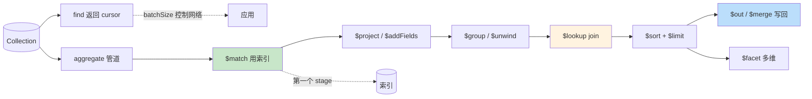

# 精通 MongoDB 查询与聚合管道：find、Aggregation、$lookup 与 explain

> 关联章节：[M02 索引](./02-精通-索引.md)、[M08 性能调优](./08-精通-性能调优.md)、[M10 Schema 设计](./10-精通-Schema-设计.md)

---

## 引言：MongoDB 的"SQL"

关系数据库有 SQL。MongoDB 有两条主线：

- **CRUD API（find / insert / update / delete）**：80% 业务用得到
- **Aggregation Pipeline**：复杂查询、统计、ETL —— MongoDB 的"分析引擎"

聚合管道是 MongoDB 区别于早期 NoSQL 的关键 —— 它把 SQL 的 SELECT / WHERE / GROUP BY / JOIN / ORDER BY / LIMIT 都做成了"管道阶段"，可任意串联。

读完本章你应能：

- 写出 find / projection / cursor 的标准用法
- 写出多阶段聚合管道（$match → $group → $sort → $project）
- 用 $lookup 做"join"
- 用 $facet 一次返回多个统计维度
- 用 explain 看聚合执行计划

---

## 第一章：find 查询

### 1.1 基本语法

```js
// 全部
db.users.find()

// 条件
db.users.find({ age: 25 })
db.users.find({ age: { $gt: 18 }, country: "US" })   // 隐含 AND

// 投影
db.users.find({}, { name: 1, age: 1, _id: 0 })
//  ^ filter        ^ projection（1 包含、0 排除）

// 排序、限制、跳过
db.users.find().sort({ createdAt: -1 }).limit(10).skip(20)
```

### 1.2 比较操作符

| 操作符 | 含义 |
|---|---|
| `$eq` | 等于（默认隐式） |
| `$ne` | 不等于 |
| `$gt` / `$gte` | 大于 / 大于等于 |
| `$lt` / `$lte` | 小于 / 小于等于 |
| `$in` | 属于列表 |
| `$nin` | 不属于列表 |
| `$exists` | 字段是否存在 |
| `$type` | BSON 类型 |
| `$regex` | 正则匹配 |
| `$mod` | 模运算 |

```js
db.users.find({ age: { $gte: 18, $lte: 65 } })       // 18 ≤ age ≤ 65
db.users.find({ status: { $in: ["active", "vip"] } })
db.users.find({ deletedAt: { $exists: false } })
db.users.find({ name: { $regex: /^Al/, $options: "i" } })
```

### 1.3 逻辑操作符

| 操作符 | 含义 |
|---|---|
| `$and` | AND（默认隐式） |
| `$or` | OR |
| `$nor` | NOR |
| `$not` | NOT |

```js
db.users.find({
  $or: [
    { age: { $lt: 18 } },
    { status: "minor" }
  ]
})

db.users.find({
  age: { $gte: 18 },
  $or: [
    { country: "US" },
    { country: "CA" }
  ]
})
```

### 1.4 数组操作符

| 操作符 | 含义 |
|---|---|
| `$all` | 数组包含所有指定值 |
| `$elemMatch` | 数组中至少一个元素满足所有条件 |
| `$size` | 数组长度等于 |

```js
db.posts.find({ tags: { $all: ["mongodb", "performance"] } })
db.users.find({
  scores: { $elemMatch: { subject: "math", score: { $gt: 90 } } }
})
db.posts.find({ tags: { $size: 3 } })
```

`$elemMatch` 的精髓：让多个条件作用于**同一个元素**。

```js
// 不用 $elemMatch
db.users.find({ "scores.subject": "math", "scores.score": { $gt: 90 } })
// 数组里 subject=math 的元素 + 数组里 score>90 的元素（可能不是同一个）

// 用 $elemMatch
db.users.find({ scores: { $elemMatch: { subject: "math", score: { $gt: 90 } } } })
// 数组里"既 subject=math 又 score>90"的元素
```

### 1.5 cursor 与 batch

```js
const cursor = db.users.find({ active: true })
while (cursor.hasNext()) {
  process(cursor.next())
}
```

- 返回的是 cursor，不是数组
- 默认每批 101 文档（首批）/ 4MB（后续）
- batchSize 调大减少网络往返：`.batchSize(1000)`

### 1.6 ID 查询的特殊性

```js
db.users.findOne({ _id: ObjectId("...") })   // _id 用主键索引
db.users.findOne({ _id: "user-42" })          // 自定义 _id 也走主键
```

最快查询路径。

---

## 第二章：更新（Update）

### 2.1 操作符

| 操作符 | 含义 |
|---|---|
| `$set` | 设置字段 |
| `$unset` | 删除字段 |
| `$inc` | 自增 |
| `$mul` | 自乘 |
| `$rename` | 重命名字段 |
| `$min` / `$max` | 取更小 / 更大值 |
| `$push` | 数组追加 |
| `$pop` | 数组弹出 |
| `$pull` | 数组删元素 |
| `$addToSet` | 数组追加（去重） |
| `$pullAll` | 删多个 |

```js
db.users.updateOne(
  { _id: 1 },
  {
    $set: { lastLogin: new Date() },
    $inc: { loginCount: 1 },
    $push: { history: { ts: new Date(), action: "login" } }
  }
)
```

### 2.2 update 模式

```js
db.users.updateOne({ _id: 1 }, { $set: {...} })       // 1 条
db.users.updateMany({ status: "old" }, { $set: {...} })  // 多条
db.users.replaceOne({ _id: 1 }, { name: "new" })      // 整文档替换
```

### 2.3 upsert

```js
db.users.updateOne(
  { email: "a@x.com" },
  { $set: { name: "Alice", lastSeen: new Date() } },
  { upsert: true }
)
```

存在则更新，不存在则插入。upsert 的常见用途：

- "create or update"
- 计数器（先 $inc + upsert）
- 幂等写入

### 2.4 字段位置操作（数组）

```js
db.posts.updateOne(
  { _id: 1, "comments.id": 5 },
  { $set: { "comments.$.text": "edited" } }
)
//                        ^ 匹配数组中第一个符合条件的元素
```

`$` 引用 query 中匹配的数组元素位置。

更新所有匹配元素：

```js
db.posts.updateMany(
  { },
  { $set: { "comments.$[].read": true } }
)
```

### 2.5 findOneAndUpdate

```js
const old = db.users.findOneAndUpdate(
  { _id: 1 },
  { $inc: { count: 1 } },
  { returnNewDocument: false }   // 返回更新前的文档
)
```

原子操作 + 返回结果。适合：

- 计数器获取唯一值（如订单号）
- 队列实现（找到一个 pending → 改 processing）

---

## 第三章：聚合管道（Aggregation Pipeline）

### 3.1 概念

把一个 collection 当成"输入流"，经过多个 stage 处理，最后输出：

```
collection → $match → $project → $group → $sort → $limit → 输出
```

每个 stage 接受文档流入、产出新文档流。

### 3.2 第一个例子

```js
db.orders.aggregate([
  { $match: { status: "paid" } },
  { $group: { _id: "$customerId", total: { $sum: "$amount" } } },
  { $sort: { total: -1 } },
  { $limit: 10 }
])
```

SQL 类比：

```sql
SELECT customerId, SUM(amount) AS total
FROM orders
WHERE status = 'paid'
GROUP BY customerId
ORDER BY total DESC
LIMIT 10
```

### 3.3 常用 stage

| Stage | 用途 |
|---|---|
| `$match` | 过滤（== WHERE） |
| `$project` | 字段裁剪 / 计算（== SELECT） |
| `$group` | 分组聚合（== GROUP BY） |
| `$sort` | 排序 |
| `$limit` / `$skip` | 限制 / 跳过 |
| `$unwind` | 展开数组（每元素一行） |
| `$lookup` | join 另一 collection |
| `$facet` | 多分支并行 |
| `$bucket` / `$bucketAuto` | 分桶 |
| `$addFields` | 加字段（不删原有） |
| `$set` | 同 $addFields 别名 |
| `$unset` | 删字段 |
| `$count` | 计数 |
| `$out` / `$merge` | 写到另一 collection |
| `$replaceRoot` | 替换文档根 |

---

## 第四章：$match 与 $project

### 4.1 $match

与 find 的 filter 一模一样：

```js
db.orders.aggregate([
  { $match: {
    status: "paid",
    amount: { $gt: 100 },
    createdAt: { $gte: ISODate("2026-01-01") }
  }}
])
```

**$match 越早越好** —— 减少后续 stage 的输入量。

### 4.2 $match 能用索引

```js
db.orders.aggregate([
  { $match: { customerId: 42 } },   // ← 第一阶段 + 字段有索引 → 走索引
  { $group: {...} }
])
```

**只有第一个 $match 在 collection 索引可用**。被其他 stage 隔开后就走不了原始索引。

### 4.3 $project

```js
db.users.aggregate([
  { $project: {
    _id: 0,
    fullName: { $concat: ["$firstName", " ", "$lastName"] },
    age: 1,
    isAdult: { $gte: ["$age", 18] }
  }}
])
```

支持表达式（$concat / $gte / $cond 等）。

### 4.4 $addFields

加字段不影响其他字段：

```js
db.products.aggregate([
  { $addFields: {
    discountedPrice: { $multiply: ["$price", 0.9] }
  }}
])
```

vs $project：

- $project：只输出列出的字段
- $addFields：保留所有原字段 + 加新的

---

## 第五章：$group 与聚合表达式

### 5.1 基本 $group

```js
db.orders.aggregate([
  { $group: {
    _id: "$customerId",          // 按 customerId 分组
    totalSpent: { $sum: "$amount" },
    orderCount: { $sum: 1 },
    avgAmount: { $avg: "$amount" },
    maxAmount: { $max: "$amount" },
    lastOrder: { $max: "$createdAt" }
  }}
])
```

`_id` 是分组的 key。`null` 表示"全局聚合"（一组）。

### 5.2 复合分组

```js
db.orders.aggregate([
  { $group: {
    _id: {
      customerId: "$customerId",
      month: { $month: "$createdAt" }
    },
    total: { $sum: "$amount" }
  }}
])
// _id 是对象，按 (customerId, month) 二维聚合
```

### 5.3 聚合操作符

| 操作符 | 含义 |
|---|---|
| `$sum` | 求和（值或 count） |
| `$avg` | 平均 |
| `$min` / `$max` | 最值 |
| `$first` / `$last` | 第一个 / 最后一个（按当前 sort） |
| `$push` | 收集到数组 |
| `$addToSet` | 收集到去重数组 |
| `$count` | 计数（5.0+） |
| `$mergeObjects` | 合并对象 |
| `$stdDevPop` / `$stdDevSamp` | 标准差 |

### 5.4 $push 收集

```js
db.orders.aggregate([
  { $group: {
    _id: "$customerId",
    orderIds: { $push: "$_id" }
  }}
])
// 输出：每客户的所有订单 ID 列表
```

警惕：数组无限增长可能超 16MB。

---

## 第六章：$sort、$limit、$skip

### 6.1 $sort 能用索引吗

```js
db.orders.aggregate([
  { $match: { status: "paid" } },
  { $sort: { createdAt: -1 } }
])
```

- 如果有 `{status: 1, createdAt: -1}` 索引 → $sort 复用索引顺序（**no actual sort**）
- 否则 $sort 在内存中做（受 100MB 限制）

```js
{ $sort: {...} }   // allowDiskUse 默认 false，超 100MB 报错
```

启用 disk：

```js
db.orders.aggregate([...], { allowDiskUse: true })
```

或 stage 内：

```js
{ $sort: {...}, allowDiskUse: true }
```

### 6.2 $limit 与 $sort 合并

```js
db.orders.aggregate([
  { $sort: { amount: -1 } },
  { $limit: 10 }
])
```

MongoDB 优化器把 limit 推到 sort 前：**top-K sort**（堆排序），不全排序。

### 6.3 $skip 的代价

```js
db.orders.aggregate([
  { $sort: { createdAt: -1 } },
  { $skip: 10000 },
  { $limit: 10 }
])
```

仍要扫前 10000 文档。深分页慢。

更好：

```js
// 用游标续传
db.orders.aggregate([
  { $match: { createdAt: { $lt: lastSeenCreatedAt } } },
  { $sort: { createdAt: -1 } },
  { $limit: 10 }
])
```

---

## 第七章：$unwind 与 $group 配合

### 7.1 $unwind 展开数组

```js
// 输入
{ _id: 1, name: "Alice", hobbies: ["read", "code", "hike"] }

// $unwind "$hobbies" 输出
{ _id: 1, name: "Alice", hobbies: "read" }
{ _id: 1, name: "Alice", hobbies: "code" }
{ _id: 1, name: "Alice", hobbies: "hike" }
```

每个数组元素一行。

### 7.2 用法：聚合数组

```js
// 统计每个 tag 出现次数
db.posts.aggregate([
  { $unwind: "$tags" },
  { $group: { _id: "$tags", count: { $sum: 1 } } },
  { $sort: { count: -1 } }
])
```

### 7.3 preserveNullAndEmptyArrays

```js
{ $unwind: { path: "$tags", preserveNullAndEmptyArrays: true } }
```

数组为空或字段不存在时仍保留文档（hobbies = null）。

### 7.4 includeArrayIndex

```js
{ $unwind: { path: "$tags", includeArrayIndex: "tagIndex" } }
// 输出加 tagIndex: 0/1/2 字段
```

---

## 第八章：$lookup —— Join

### 8.1 基本 join

```js
db.orders.aggregate([
  { $lookup: {
    from: "users",
    localField: "userId",
    foreignField: "_id",
    as: "user"
  }}
])

// 输出：
{ _id: ..., userId: 42, amount: 100, user: [ {_id: 42, name: "Alice"} ] }
//                                          ^ user 是数组（可能多匹配）
```

注意 `user` 是数组，即使 _id 唯一。配 `$unwind` 拍平：

```js
{ $lookup: {...} },
{ $unwind: { path: "$user", preserveNullAndEmptyArrays: true } }
```

### 8.2 子管道版本（4.0+）

```js
{ $lookup: {
  from: "orders",
  let: { userId: "$_id" },
  pipeline: [
    { $match: { $expr: { $eq: ["$userId", "$$userId"] } } },
    { $match: { status: "paid" } },
    { $group: { _id: null, total: { $sum: "$amount" } } }
  ],
  as: "stats"
}}
```

支持复杂条件、多字段、内部聚合。

### 8.3 性能注意

$lookup 本质是 **nested loop join**：

- 每个左侧文档对右侧 collection 做一次查询
- 右侧字段必须有索引（默认 _id 有）
- 大集合 join 很慢

替代方案：

- 反范式（embed 而非 reference）
- 应用层 join
- 数据导到 ES / 数据仓库做大规模分析

### 8.4 vs $graphLookup

```js
{ $graphLookup: {
  from: "employees",
  startWith: "$_id",
  connectFromField: "_id",
  connectToField: "managerId",
  as: "subordinates"
}}
```

递归遍历（如组织树、好友的好友）。本质 BFS。

---

## 第九章：$facet —— 多维聚合

### 9.1 用途

一次扫描得到**多个聚合结果**：

```js
db.products.aggregate([
  { $match: { category: "books" } },
  { $facet: {
    "byPrice": [
      { $bucket: {
        groupBy: "$price",
        boundaries: [0, 20, 50, 100],
        default: "100+"
      }}
    ],
    "byRating": [
      { $group: { _id: "$rating", count: { $sum: 1 } } }
    ],
    "topRated": [
      { $sort: { rating: -1 } },
      { $limit: 5 }
    ]
  }}
])

// 输出：
{
  byPrice: [ {_id: 0, count: 12}, ... ],
  byRating: [ {_id: 5, count: 8}, ... ],
  topRated: [ {...}, {...}, ... ]
}
```

适合"商品列表 + 各种 facet 过滤器"的电商搜索。

### 9.2 性能

$facet 内部各分支**串行**执行（不是并行）。但比"跑 3 次独立 query"快——只扫一次输入。

---

## 第十章：$bucket / $bucketAuto

### 10.1 $bucket：固定边界

```js
db.products.aggregate([
  { $bucket: {
    groupBy: "$price",
    boundaries: [0, 50, 100, 500, 1000],
    default: "Other",
    output: {
      count: { $sum: 1 },
      avgPrice: { $avg: "$price" }
    }
  }}
])
```

类似 SQL 的 `CASE WHEN price < 50 THEN ... ELSE ... END`。

### 10.2 $bucketAuto：自动分桶

```js
{ $bucketAuto: {
  groupBy: "$age",
  buckets: 5    // 自动分 5 个等容量桶
}}
```

适合"直方图"分析。

---

## 第十一章：$merge / $out —— 输出结果

### 11.1 $out 全量替换

```js
db.orders.aggregate([
  { $match: {...} },
  { $group: {...} },
  { $out: "order_summary" }
])
```

- 把结果写到 `order_summary` 集合
- **整集合替换**（先 drop 再写）
- 4.2+ 支持

### 11.2 $merge 灵活合并

```js
{ $merge: {
  into: "daily_stats",
  on: "_id",
  whenMatched: "merge",     // merge / replace / keepExisting / fail / pipeline
  whenNotMatched: "insert"  // insert / discard / fail
}}
```

- 4.2+ 引入
- 支持 upsert / 累加 / 自定义合并逻辑
- 适合**增量物化视图**（每天跑一次，append 到结果集）

### 11.3 使用场景

- 离线 ETL：聚合后存到结果集供查询
- 物化视图：避免每次重复计算
- 数据冷热分离：把老数据搬到归档集合

---

## 第十二章：表达式与运算符

聚合 stage 中可用的表达式：

### 12.1 算术

```js
{ $add: ["$a", "$b", 5] }
{ $subtract: ["$total", "$discount"] }
{ $multiply: [...] }
{ $divide: [...] }
{ $mod: ["$n", 10] }
{ $round: ["$score", 2] }    // 4.2+
```

### 12.2 字符串

```js
{ $concat: ["$first", " ", "$last"] }
{ $toUpper: "$name" }
{ $substr: ["$desc", 0, 50] }
{ $split: ["$email", "@"] }
{ $regexMatch: { input: "$name", regex: /^A/ } }
{ $trim: { input: "$name" } }
```

### 12.3 日期

```js
{ $year: "$createdAt" }
{ $month: "$createdAt" }
{ $dayOfWeek: "$createdAt" }
{ $dateToString: { format: "%Y-%m-%d", date: "$createdAt" } }
{ $dateTrunc: { date: "$ts", unit: "hour" } }    // 5.0+
{ $dateAdd: { startDate: "$ts", unit: "day", amount: 7 } }
```

### 12.4 条件

```js
{ $cond: [ { $gte: ["$age", 18] }, "adult", "minor" ] }
{ $switch: {
  branches: [
    { case: { $lt: ["$score", 60] }, then: "F" },
    { case: { $lt: ["$score", 80] }, then: "B" }
  ],
  default: "A"
}}
{ $ifNull: ["$email", "no-email"] }
```

### 12.5 数组

```js
{ $size: "$tags" }
{ $arrayElemAt: ["$tags", 0] }
{ $slice: ["$tags", 5] }   // 前 5
{ $map: { input: "$items", as: "i", in: { $multiply: ["$$i.price", 2] } } }
{ $filter: { input: "$items", as: "i", cond: { $gt: ["$$i.qty", 0] } } }
{ $reduce: {...} }
{ $in: ["vip", "$tags"] }   // 数组包含某值
```

---

## 第十三章：explain 聚合

### 13.1 看执行计划

```js
db.orders.explain("executionStats").aggregate([
  { $match: { status: "paid" } },
  { $group: { _id: "$customerId", total: { $sum: "$amount" } } }
])
```

### 13.2 关键字段

```json
{
  "stages": [
    {
      "$cursor": {
        "queryPlanner": {
          "winningPlan": { "stage": "IXSCAN", "indexName": "status_1" }
        },
        "executionStats": {
          "totalDocsExamined": 1000,
          "executionTimeMillis": 50
        }
      }
    },
    { "$group": {...} }
  ]
}
```

- `$cursor` stage：底层 find 部分，能用索引就 IXSCAN
- 后续 stage 在内存做
- 总时间 = 各 stage 时间和

### 13.3 优化器规则

MongoDB 优化器会自动重排 stage：

- $match 提前（"predicate pushdown"）
- $match + $sort 合并
- $project 提前（减字段）
- $limit 推到 $sort

但**只有 $match 在最前才能用索引**——所以业务侧也要主动把 $match 写在前面。

### 13.4 实战

```js
// 慢
db.orders.aggregate([
  { $group: {...} },
  { $match: { total: { $gt: 1000 } } }   // group 之后 match 无法用索引
])

// 快
db.orders.aggregate([
  { $match: { amount: { $gt: 100 } } },   // 先 match 减少 group 输入
  { $group: {...} },
  { $match: { total: { $gt: 1000 } } }
])
```

---

## 第十四章：性能与陷阱

### 14.1 单个聚合 100MB 限制

每个 stage 中间结果不能超 100MB（含 $sort、$group 等内存阶段）。超了：

- 报 `QueryExceededMemoryLimit`
- 加 `allowDiskUse: true` 用磁盘做

```js
db.orders.aggregate([...], { allowDiskUse: true })
```

代价：磁盘 swap 慢。

### 14.2 hot collection

聚合扫大量文档 → cache pressure → 影响其他查询。

修复：

- 用 secondary 跑聚合（read preference: secondary）
- 物化视图（$merge 离线跑）
- 增量聚合（按时间 chunk）

### 14.3 $lookup 慢

每条左侧文档 → 一次右侧查询 → N × M 复杂度。

修复：

- 右侧字段必须有索引
- 减少左侧文档数（先 $match）
- 反范式 / 物化视图替代

### 14.4 $sort 不走索引

```js
db.orders.aggregate([
  { $match: { status: "paid" } },
  { $unwind: "$items" },     // ← 这之后 $sort 无法用索引
  { $sort: { createdAt: -1 } }
])
```

中间 stage（如 $unwind / $group）打破了索引顺序。

修复：

- 把 $sort 放到能用索引的位置
- 接受内存排序（小数据集）

### 14.5 $group 在大基数下爆 cache

```js
db.events.aggregate([
  { $group: { _id: "$user_id", count: { $sum: 1 } } }
])
// 1 亿 user → 1 亿组 → 内存爆
```

修复：

- 加 $match 限制范围
- 用 $bucket 减少分组数
- 离线 ETL

---

## 第十五章：实战案例

### 15.1 用户留存分析

```js
db.users.aggregate([
  { $match: { signupDate: { $gte: ISODate("2026-01-01"), $lt: ISODate("2026-02-01") } } },
  { $lookup: {
    from: "events",
    let: { uid: "$_id" },
    pipeline: [
      { $match: { $expr: { $eq: ["$userId", "$$uid"] }, type: "active" } },
      { $group: { _id: { $dateTrunc: { date: "$ts", unit: "day" } } } }
    ],
    as: "activeDays"
  }},
  { $project: {
    _id: 1,
    signupDate: 1,
    retainedDays: { $size: "$activeDays" }
  }},
  { $bucket: {
    groupBy: "$retainedDays",
    boundaries: [0, 1, 7, 14, 30],
    default: "30+",
    output: { count: { $sum: 1 } }
  }}
])
```

### 15.2 销售排行

```js
db.orders.aggregate([
  { $match: { status: "paid", createdAt: { $gte: ISODate("2026-05-01") } } },
  { $group: {
    _id: "$customerId",
    revenue: { $sum: "$amount" },
    orderCount: { $sum: 1 }
  }},
  { $lookup: {
    from: "customers",
    localField: "_id",
    foreignField: "_id",
    as: "customer"
  }},
  { $unwind: "$customer" },
  { $sort: { revenue: -1 } },
  { $limit: 100 },
  { $project: {
    name: "$customer.name",
    revenue: 1,
    orderCount: 1
  }}
])
```

### 15.3 实时漏斗

```js
db.events.aggregate([
  { $match: { ts: { $gte: ISODate("2026-05-13") } } },
  { $facet: {
    "view":     [{ $match: { type: "view" } }, { $count: "n" }],
    "addCart":  [{ $match: { type: "add_cart" } }, { $count: "n" }],
    "checkout": [{ $match: { type: "checkout" } }, { $count: "n" }],
    "purchase": [{ $match: { type: "purchase" } }, { $count: "n" }]
  }}
])
```

---

## 总结 · 查询与聚合一图



查询与聚合心法：

1. **$match 越早越好** —— 第一阶段才能用索引
2. **ESR 规则** 跟索引设计绑定
3. **$lookup 是 nested loop join** —— 右侧字段必须有索引
4. **$facet 一次扫多维度** —— 仪表盘场景
5. **$merge 做增量物化视图** —— 离线缓存重计算
6. **explain executionStats** 是验证唯一手段

---

## 练习题

1. find 的 projection 中 `_id` 默认行为？
2. $elemMatch 与多个独立条件的区别？
3. $match 放在 $group 后能不能用索引？为什么？
4. $lookup 慢的两个常见原因？
5. $facet 是并行还是串行？
6. $out 与 $merge 区别？
7. 聚合 100MB 内存限制怎么绕过？
8. $unwind 后 $sort 为什么不走索引？
9. findOneAndUpdate 的原子性体现在哪？
10. upsert 用 $inc 的常见场景？

> 答案见 [QUIZ.md](./QUIZ.md)

---

> 🔁 反馈：把业务里最复杂的 SQL 试着翻译成聚合管道，对比可读性
