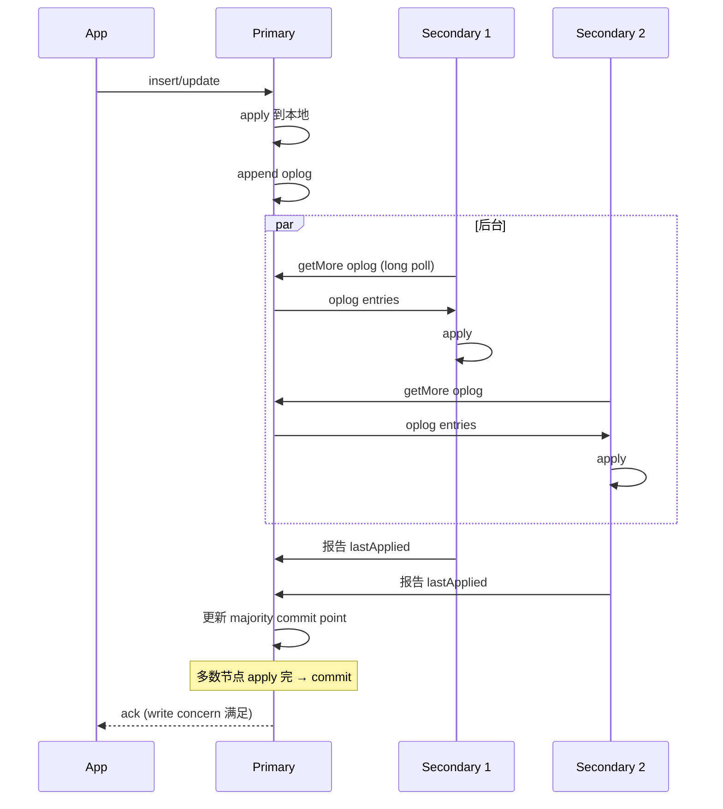
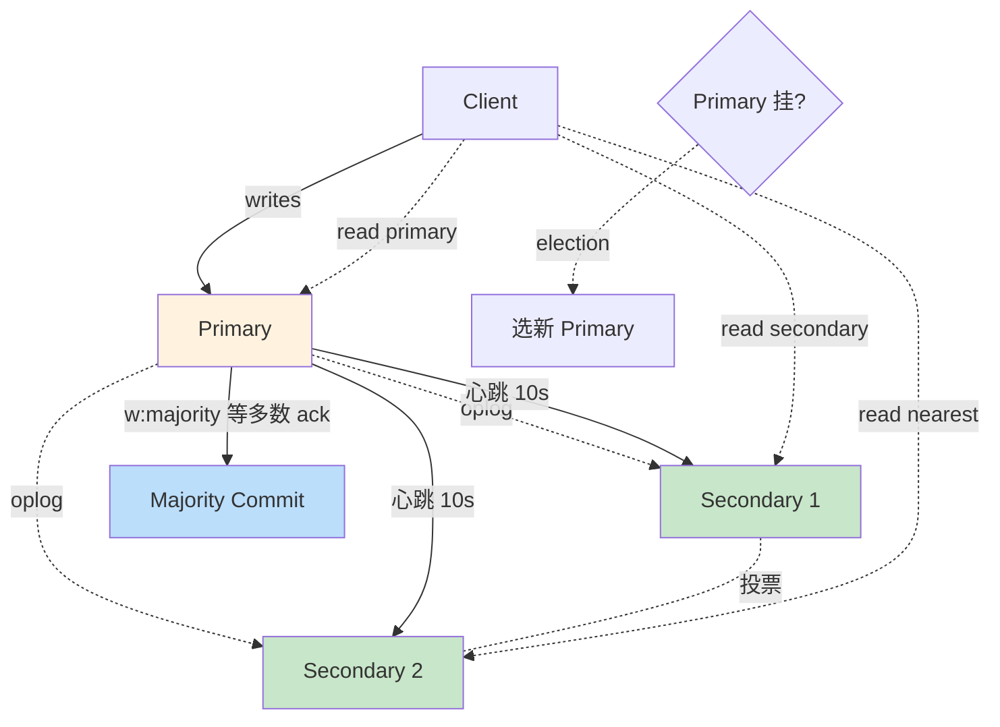

# 精通 MongoDB 副本集：Primary/Secondary、Oplog、选举与 Read Preference

> 关联章节：[M03 WiredTiger](./03-精通-WiredTiger.md)、[M07 事务与一致性](./07-精通-事务与一致性.md)、[M09 Change Streams](./09-精通-Change-Streams-与-oplog.md)

---

## 引言：副本集是 MongoDB 高可用的基石

单机 MongoDB 几乎不应该在生产用。**副本集（Replica Set）** 是 MongoDB 最小生产单元：

- 多节点存同一份数据
- 自动 failover
- 读写分离
- 数据冗余保证持久性

副本集 ≠ 分片：

- 副本集解决"高可用、读吞吐扩展、数据冗余"
- 分片解决"写吞吐扩展、容量扩展"
- 多数业务：1 个副本集就够；超大业务才上分片（详见 M06）

读完本章你应能：

- 设计 3 节点 / 5 节点的副本集拓扑
- 解释 oplog、replication lag、majority commit point
- 读懂 election 过程和 priority / votes 影响
- 配 read preference 平衡新鲜度与吞吐
- 处理 stepdown、failover、resync 等运维事件

---

## 第一章：副本集基础

### 1.1 角色

| 角色 | 职责 |
|---|---|
| **Primary** | 唯一写入节点；接受所有写请求 |
| **Secondary** | 异步复制 primary 的 oplog；可服务读 |
| **Arbiter** | 不存数据，只参与选举投票 |

### 1.2 PSS vs PSA

| 拓扑 | 含义 |
|---|---|
| PSS | Primary + Secondary + Secondary（3 数据节点，推荐） |
| PSA | Primary + Secondary + Arbiter（2 数据节点 + 1 投票） |
| P+2S+1A | 5 节点高可用 |

**避免 PSA**：

- 一个 Secondary 挂 → ISR 只剩 P + A
- A 不存数据 → majority commit 不到 → w:majority 写阻塞
- 数据冗余只有 1 份（P 挂数据可能丢）

主流：**PSS** 最小生产。

### 1.3 节点数

| 节点数 | 容忍挂几个 | 评价 |
|---|---|---|
| 1 | 0 | 不能用 |
| 2 | 0（quorum 必须 2） | 等同 1 |
| 3 | 1 | 最小生产 |
| 5 | 2 | 高可用 |
| 7+ | 3+ | 跨数据中心 / 特殊 |

**永远奇数**（quorum 友好）。

### 1.4 启动副本集

```bash
# 每个节点
mongod --replSet rs0 --bind_ip_all --port 27017 --dbpath /data/db1

# 在任一节点上初始化
mongosh
> rs.initiate({
  _id: "rs0",
  members: [
    { _id: 0, host: "host1:27017" },
    { _id: 1, host: "host2:27017" },
    { _id: 2, host: "host3:27017" }
  ]
})

> rs.status()
```

---

## 第二章：Oplog —— 复制的核心

### 2.1 什么是 oplog

`local.oplog.rs` 是一个 **capped collection**（有上限大小的环形 collection），记录 primary 上所有写操作。

```js
use local
db.oplog.rs.find().sort({ ts: -1 }).limit(3)

// 输出示例
{
  ts: Timestamp(1715587200, 1),
  t: NumberLong(5),                  // term（任期号）
  h: NumberLong(...),                 // hash
  v: 2,                                // oplog version
  op: "i",                             // i=insert, u=update, d=delete, c=command
  ns: "mydb.users",
  ui: UUID("..."),
  o: { _id: ObjectId(...), name: "Alice" },
  wall: ISODate("2026-05-13T10:00:00Z")
}
```

每次写产生一条 oplog entry。secondary 拉取并 replay。

### 2.2 oplog 大小

```bash
# 看 oplog 大小
mongosh
> rs.printReplicationInfo()
configured oplog size:   10240MB
log length start to end: 86400 secs (24 hrs)
oplog first event time:  ...
oplog last event time:   ...
now:                     ...
```

默认 5% 磁盘空间，min 1 GB max 50 GB。

调整：

```js
db.adminCommand({ replSetResizeOplog: 1, size: 51200 })   // 50 GB
```

### 2.3 Oplog Window

**oplog window** = oplog 中保留的时间跨度（最老 entry 到最新 entry）。

oplog window 应该 **> 最长 secondary 离线时间**：

- 太短：secondary 离线 1 小时回来，oplog 中已经没有起始点 → 必须全量 resync
- 太长：占磁盘

经验：生产 24 小时起步，关键业务 7 天。

### 2.4 Idempotent oplog

oplog 设计成 **幂等**：

```js
// 原始操作
db.users.updateOne({ _id: 1 }, { $inc: { count: 1 } })

// oplog 记录（idempotent 形式）
{ op: "u", o2: { _id: 1 }, o: { $v: 2, diff: { u: { count: <new_value> } } } }
```

`$inc` 写入 oplog 时被转换为"设置为最终值" → secondary replay 多次也是同样结果。

这保证：

- secondary 可重复 replay 不出错
- 网络抖动 / restart 不破坏一致性

### 2.5 OpTime 与 Timestamp

每条 oplog entry 有 **(ts, t)** 二元组：

- ts：BSON Timestamp（秒 + counter）
- t：term（任期号），主切换时递增

二元组全序，secondary 用它判断"还需要拉哪些"。

---

## 第三章：复制流程

### 3.1 工作流



**关键**：复制是 **pull 模型**（secondary 主动拉），不是 push。

### 3.2 Sync Source

secondary 默认从 primary 拉 oplog，但也能从其他 secondary 拉（**chained replication**）：

```js
rs.conf().settings.chainingAllowed   // 默认 true
```

链式好处：

- primary 出流量减少
- 远距离副本不直接连 primary

链式代价：

- replication lag 累积
- 拓扑复杂

生产经常关 chaining 让 secondary 直接从 primary 拉。

### 3.3 多线程 apply

secondary 用多线程 apply oplog（writer pool）：

```yaml
replication:
  oplogSizeMB: 10240
  secondaryIndexPrefetch: all
```

并发 apply：

- 同集合不同 _id 并行
- 同 _id 串行
- 大写入吞吐时 apply 速度跟得上 primary

### 3.4 Replication Lag

`replication lag` = primary 上某 op 时间 - 该 op 在 secondary 上 apply 时间。

监控：

```js
rs.printSecondaryReplicationInfo()

source: host2:27017
        syncedTo: ...
        0 secs (0 hrs) behind the primary

source: host3:27017
        syncedTo: ...
        5 secs (0 hrs) behind the primary
```

健康：lag < 1s。> 10s 警觉，> 60s 严重。

原因：

- secondary 资源不足
- secondary 跑大查询占 IO
- 网络问题
- 大批量写入超过 secondary apply 能力

---

## 第四章：选举（Election）

### 4.1 触发条件

- primary 心跳超时（默认 10s）
- 手动 stepDown
- 加 / 删节点
- 配置变更
- 网络分区

### 4.2 Raft-like 协议

MongoDB 副本集选举基于 Raft（自 3.2 起）：

- 每个节点有 **term**（任期）
- 节点状态：follower / candidate / primary
- 选举要 **quorum**（多数派同意）

### 4.3 选举过程

```
1. secondary 一段时间没收到 primary 心跳
2. secondary 升 term，自己变 candidate，给其他节点发 voteRequest
3. 其他节点检查：
   - 自己 term 是否更低？
   - candidate 的 oplog 是否至少跟自己一样新？
   - 满足 → 投赞同
4. candidate 拿到多数票 → 成为新 primary
5. 新 primary 广播给所有节点
```

### 4.4 Priority

```js
rs.conf().members[1].priority    // 默认 1
```

- priority 高的节点**优先**成为 primary
- priority = 0 永远不能成为 primary（可以投票）
- 用于：跨机房部署，让"主机房"节点 priority 高

```js
cfg = rs.conf()
cfg.members[0].priority = 2     // 优先这个
cfg.members[1].priority = 1
cfg.members[2].priority = 0     // 不参选
rs.reconfig(cfg)
```

### 4.5 Votes

每个节点默认 votes=1（参与投票）。

- 副本集最多 50 节点
- 但**最多 7 个 voting members**
- 多于 7 个的节点 votes 必须设 0

实战 5 节点的话直接 5 voting；超大集群（10+）才需要"7 voting + 几个非投票"。

### 4.6 Election Timeout

```js
rs.conf().settings.electionTimeoutMillis    // 默认 10000
```

primary 心跳超过这个就触发选举。

- 调小（5s）：故障检测快，但网络抖动容易误选
- 调大（30s）：稳定，但故障期间长

跨机房部署调大（RTT 高、网络抖动）。

### 4.7 stepDown

让当前 primary 主动让位：

```js
rs.stepDown(60)   // 60 秒内不再当选
```

用于：

- 升级 primary（先 stepDown 再升级 secondary，最后切回去）
- 计划性维护
- 测试 failover

---

## 第五章：Read Preference

### 5.1 五种模式

| 模式 | 行为 |
|---|---|
| `primary`（默认） | 只读 primary |
| `primaryPreferred` | 优先 primary；primary 不可用走 secondary |
| `secondary` | 只读 secondary |
| `secondaryPreferred` | 优先 secondary；都不可用走 primary |
| `nearest` | 看网络延迟，最近的（不区分角色） |

### 5.2 用法

```js
// driver 层
client.db("mydb").collection("users").find({}).withReadPreference("secondary")

// connection string
mongodb://host1,host2,host3/mydb?replicaSet=rs0&readPreference=secondary
```

### 5.3 适用场景

| 场景 | preference |
|---|---|
| 标准业务读 | primary（默认） |
| 报表 / 离线分析 | secondaryPreferred |
| 跨地域低延迟读 | nearest |
| 备份扫描 | secondary（独占某 secondary） |

### 5.4 Stale Read 问题

读 secondary 可能拿到老数据（lag 几秒）：

```
T0: primary update user.balance = 100
T1: user 端 commit
T2: 应用读 secondary（lag 1s）→ 仍看到 balance = 90 ❌
```

修复方案：

- 用 **causal consistency**（详见 M07）
- 关键业务读 primary
- 接受最终一致

### 5.5 Tag-based 路由

```js
cfg = rs.conf()
cfg.members[2].tags = { region: "us-east", role: "analytics" }
rs.reconfig(cfg)

// 客户端只读特定 tag
mongodb://host1,host2,host3/mydb?readPreference=secondary&readPreferenceTags=region:us-east
```

适合：

- 区域读分流（亚太用户读亚太节点）
- 分析读隔离（不影响业务读）

### 5.6 maxStalenessSeconds

```js
client.find({}, { readPreference: { mode: "secondary", maxStalenessSeconds: 90 } })
```

拒绝 lag > 90s 的 secondary。保护业务不读到过老数据。

---

## 第六章：Write Concern

### 6.1 选项

```js
db.users.insertOne({...}, {
  writeConcern: {
    w: "majority",     // 多少节点 ack
    j: true,           // journal fsync
    wtimeout: 5000     // 等多久（毫秒）
  }
})
```

| w 值 | 含义 |
|---|---|
| `0` | 不等任何 ack |
| `1` | primary ack |
| `2`、`3` | N 个节点 ack |
| `"majority"` | 多数节点 ack |
| `"<tag>"` | 特定 tag 节点 ack |

### 6.2 取舍

| w | 写入吞吐 | 持久 |
|---|---|---|
| 0 | 极高 | 最弱（fire and forget） |
| 1 | 高 | primary 挂可能丢 |
| majority（推荐） | 中 | 强（多数确认才返回） |

### 6.3 w:majority 实现

```
T0: client send write
T1: primary apply
T2: primary append oplog
T3: secondary 1 fetch + apply → 报告 lastApplied
T4: secondary 2 fetch + apply → 报告 lastApplied
T5: primary 看到多数 apply → majority commit point 推进
T6: ack client
```

w:majority 保证：**ack 后即使 primary 挂，新 primary 也有这条数据**。

### 6.4 wtimeout 陷阱

```js
{ w: "majority", wtimeout: 1000 }
```

- 1 秒内多数没 ack → 抛 WriteConcernError
- **但 primary 已经写了**！数据没回滚

`wtimeout` 只是"等待超时"，不是事务回滚。建议长 timeout（5-10s）或不设 wtimeout（无限等）。

### 6.5 默认 write concern

MongoDB 5.0 起默认 **w: majority**（旧版本默认 w: 1）。

```js
db.adminCommand({ getDefaultRWConcern: 1 })
db.adminCommand({ setDefaultRWConcern: 1, defaultWriteConcern: { w: "majority" } })
```

业务代码不显式指定时用默认。

---

## 第七章：Read Concern

### 7.1 选项

| readConcern | 含义 |
|---|---|
| `local`（默认） | 看本节点最新 |
| `available` | 类似 local，分片场景有微差异 |
| `majority` | 看多数 commit 的（持久保证） |
| `linearizable` | 强一致：等读时再次确认是 primary |
| `snapshot` | 事务用快照 |

### 7.2 读 majority 的代价

- 必须从 majority commit point 之前读
- secondary 上 majority commit point 滞后于 lastApplied
- → 读到的数据比 secondary local 老

但保证：**读到的数据不会回滚**（一旦读到就持久）。

### 7.3 linearizable

```js
db.users.findOne({...}, { readConcern: { level: "linearizable" } })
```

- 必须在 primary 上读
- 读操作之前等到当前 majority commit
- 读完返回前再次确认自己仍是 primary

最强一致。代价：

- 慢（多一次往返）
- 只能在 primary
- 长事务影响吞吐

99% 业务用 majority 够了。极少数（资金、审计）才需要 linearizable。

### 7.4 read / write concern 协同

| 组合 | 保证 |
|---|---|
| w:majority + r:majority | 经典强一致组合 |
| w:1 + r:local | 高性能但弱一致 |
| w:majority + r:linearizable | 极强一致（贵） |

---

## 第八章：Failover

### 8.1 自动 failover 流程

```
T0: primary 网络分区或挂
T1: secondary 心跳超时（10s）
T2: 一个 secondary 触发选举
T3: 多数同意 → 新 primary
T4: client driver 检测到 → 重连到新 primary
T5: 业务恢复
```

整个过程 10-30 秒。

### 8.2 客户端行为

driver 默认重试：

```js
const client = new MongoClient(uri, {
  retryWrites: true,    // 默认开
  retryReads: true,
  serverSelectionTimeoutMS: 30000
})
```

`retryWrites: true` 让 failover 期间的写**自动重试**一次（**幂等的写支持**，如 insertOne / updateOne，不支持 updateMany）。

### 8.3 数据回滚（rollback）

极端场景：

```
T0: primary A 接受写入 W
T1: A 网络分区，无法复制到其他节点
T2: B 当选新 primary，继续接受新写入
T3: A 恢复，发现自己 W 没在多数节点 → rollback
```

A 上的 W 数据被回滚到 `rollback` 目录（不丢，但不在主线上）。

预防：用 **w:majority**（保证 ack 的写不会丢）。

### 8.4 监控

```js
rs.status()
// 看 members[].state：
//   PRIMARY=1, SECONDARY=2, RECOVERING=3, STARTUP2=5, ARBITER=7,
//   DOWN=8, ROLLBACK=9, REMOVED=10
```

关键状态：

- RECOVERING：节点在追赶（如 resync）
- ROLLBACK：节点正在回滚（罕见但严重）
- DOWN：节点不可达

---

## 第九章：维护操作

### 9.1 添加节点

```js
rs.add({ host: "host4:27017" })
// 新节点状态：STARTUP2 → RECOVERING → SECONDARY
```

新节点要 initial sync（全量复制）：

- 时间 = 数据量 / 复制带宽
- 100GB 数据 / 1Gbps 网络 ≈ 15 分钟
- 大集合可能几小时到几天

### 9.2 删除节点

```js
rs.remove("host4:27017")
```

被删的节点变成独立 mongod。

### 9.3 修改配置

```js
cfg = rs.conf()
cfg.members[1].priority = 0
cfg.members[1].hidden = true       // hidden：不接读写
rs.reconfig(cfg)
```

hidden 节点用于：

- 备份专用（不影响业务读）
- 报表分析（隔离负载）

### 9.4 滚动升级

```
1. 把 secondary 一个个升级（stop / 升级 / start，等 SECONDARY 状态）
2. stepDown primary 让 secondary 接管
3. 升级原 primary
4. 完成
```

业务侧 retryWrites 保护，整个过程基本无感。

### 9.5 Resync

极端情况下 secondary 数据不一致：

```js
// 在该 secondary 上
// 停掉 mongod + 清空 dbPath + 重启 → 自动触发 initial sync
// （或从健康成员拷贝数据文件）
```

> 注意：旧的 `db.adminCommand({ resync: 1 })` 属于 master/slave 复制机制，该机制在 MongoDB 4.0 已被移除，resync 命令随之删除。现代副本集（4.0+）请用上述删 dbPath 后重启的方式做 initial sync。

代价：全量重新拉。大数据量耗时长。

---

## 第十章：典型故障

### 10.1 案例：所有节点都是 secondary

**症状**：副本集没 primary，所有 client 写入失败。

**诊断**：

```js
rs.status()
// 看是否有 PRIMARY，看 election 失败原因
```

**根因**：

- 多数节点失联（quorum 不满足）
- 网络分区

**修复**：

- 恢复网络 / 节点
- 不要"强制选主" —— 会引入脑裂

### 10.2 案例：replication lag 持续涨

**症状**：

```
secondary: 300 secs behind primary
```

并且 lag 越来越大。

**诊断**：

- secondary 上 mongostat 看 CPU / IO
- 是否有大查询占资源
- 网络带宽

**修复**：

- 升 secondary 硬件
- 关掉 secondary 上的报表查询
- 业务侧降写入并发

### 10.3 案例：oplog window 太短

**症状**：secondary 重启后 oplog 已 rotate，必须 initial sync。

**修复**：

```js
db.adminCommand({ replSetResizeOplog: 1, size: 51200 })   // 50 GB
```

预防：监控 oplog window，至少 24h。

### 10.4 案例：选举频繁

**症状**：每天 primary 切换几次，业务断续。

**诊断**：

- 看 primary 资源（CPU / GC / IO 是否抖动）
- 网络 RTT 是否抖动

**根因**：

- primary GC 让心跳超时
- 网络间歇断
- electionTimeoutMillis 设太小

**修复**：

- 升级硬件 / 调 GC
- 网络排查
- 临时调大 electionTimeoutMillis

### 10.5 案例：rollback 文件出现

**症状**：dbPath/rollback/ 下有几个 BSON 文件。

**根因**：

- 原 primary 网络分区，写了多数没 ack 的数据
- 恢复后这部分数据被回滚

**处理**：

- 检查 rollback 文件内容
- 决定是否手动重写（如果重要）
- 长期：用 w:majority 防止 rollback

---

## 第十一章：跨机房部署

### 11.1 同 region 多 AZ

```
AZ-1: Primary
AZ-2: Secondary
AZ-3: Secondary
```

- 整 AZ 挂仍能 failover
- RTT 一般 < 5ms，几乎无影响

推荐生产配置。

### 11.2 跨 region

```
Region A: Primary, Secondary    (priority 高)
Region B: Secondary              (priority 0，灾备)
```

- 平时 Region A 服务
- A 整体挂 → 手动切换 Region B
- RTT 可能 50-200ms，影响 w:majority 写延迟

代价：

- w:majority 延迟 ≈ 跨 region RTT
- 大量写场景跨 region 成本高

### 11.3 Read 本地化

```js
// Region B 应用读本地
client.find({}, {
  readPreference: { mode: "nearest", tags: [{ region: "B" }] }
})
```

减少跨 region 读延迟。

---

## 总结 · 副本集一图



副本集心法：

1. **3 节点 PSS** 是最小生产配置
2. **oplog 是复制核心** —— window 要 > 最长 secondary 离线时间
3. **w:majority + r:majority** 是强一致组合
4. **read preference** 平衡新鲜度与吞吐
5. **retryWrites + retryReads** 让 failover 无感

---

## 练习题

1. PSS 比 PSA 好在哪？
2. oplog 是什么？为什么必须幂等？
3. replication lag 持续 60 秒，可能原因 3 个？
4. priority 设 0 有什么效果？
5. read preference 的 5 种模式适用场景？
6. w:majority + wtimeout: 1000 失败是否回滚？
7. read concern majority 与 linearizable 区别？
8. retryWrites 对什么操作生效？什么不生效？
9. rollback 何时发生？怎么预防？
10. 跨 region 部署 priority 应该怎么设？

> 答案见 [QUIZ.md](./QUIZ.md)

---

> 🔁 反馈：docker compose 起 3 节点副本集，杀掉 primary 看 failover
