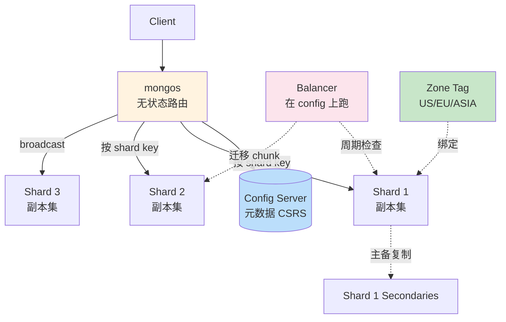

# 精通 MongoDB 分片集群：mongos、Config Server、Chunk 与 Shard Key

> 关联章节：[M02 索引](./02-精通-索引.md)、[M05 副本集](./05-精通-副本集.md)、[M08 性能调优](./08-精通-性能调优.md)

---

## 引言：MongoDB 的水平扩展

副本集（M05）解决高可用 + 读吞吐，但**单副本集有容量上限**：

- 数据全在一台机器（单 primary 写）
- 写吞吐 = 单机
- 存储 = 单机磁盘
- working set > RAM 时性能崩

**分片集群（Sharded Cluster）** 解决横向扩展：

- 数据按 shard key 散到多个 shard（每 shard 是一个独立副本集）
- 写吞吐线性扩展
- 容量扩展无上限
- 查询自动路由到目标 shard

但分片**很复杂**：

- 选错 shard key 没法改（5.0 之前完全不行；5.0+ 支持 reshardCollection 但代价大）
- 跨 shard 操作慢（scatter-gather）
- 维护成本高

读完本章你应能：

- 设计 3+1 节点 / 多 shard 的分片集群
- 选 shard key 的三大原则（基数 / 频率 / 单调性）
- 区分 ranged shard key 与 hashed shard key
- 解读 chunk migration / balancer 行为
- 处理 jumbo chunk、orphan document 等问题

---

## 第一章：分片集群组件

### 1.1 三类节点

```
┌──────────────────┐
│  Application     │
└─────────┬────────┘
          │
          ▼
┌──────────────────┐         ┌──────────────────┐
│  mongos          │ ←─────→ │  Config Servers  │
│  (Router 无状态) │         │  (元数据 CSRS)    │
└─────────┬────────┘         └──────────────────┘
          │
    ┌─────┴─────┐
    ▼     ▼     ▼
┌─────┐ ┌─────┐ ┌─────┐
│Shard│ │Shard│ │Shard│
│  1  │ │  2  │ │  3  │
│(RS) │ │(RS) │ │(RS) │
└─────┘ └─────┘ └─────┘
```

- **mongos**：客户端入口，无状态，多副本部署
- **Config Server (CSRS)**：3 节点副本集，存集群元数据（chunks、shards、databases、collections）
- **Shard**：每个是一个副本集，存实际数据

### 1.2 客户端连接

```
mongodb://mongos1:27017,mongos2:27017,mongos3:27017/mydb?...
```

只连 mongos，不直接连 shard。

### 1.3 部署最小规模

- 3 个 mongos（多副本无单点）
- 3 个 config server（CSRS 副本集）
- 至少 2 个 shard（每 shard 3 节点副本集 = 6 mongod）

合计 12 个 mongod 进程。**这是分片的"准入门槛"**——比副本集贵很多。

### 1.4 启动顺序

```bash
# 1. config server
mongod --configsvr --replSet csrs --port 27019 --dbpath /data/cfg1
# 在任一节点初始化
mongosh --port 27019 -eval 'rs.initiate({...})'

# 2. shard（每个 shard 一个副本集）
mongod --shardsvr --replSet sh1 --port 27018 --dbpath /data/sh1-1
mongosh --port 27018 -eval 'rs.initiate({...})'

# 3. mongos
mongos --configdb csrs/cfg1:27019,cfg2:27019,cfg3:27019 --port 27017

# 4. 把 shard 加进集群
mongosh --port 27017
> sh.addShard("sh1/host1:27018,host2:27018,host3:27018")
> sh.addShard("sh2/host4:27018,...")
```

---

## 第二章：开启分片

### 2.1 数据库级

```js
sh.enableSharding("mydb")
```

让数据库支持分片，但具体集合还要单独分片。

### 2.2 集合级

```js
// 必须先在分片字段上建索引
db.orders.createIndex({ customerId: 1 })

// 分片
sh.shardCollection("mydb.orders", { customerId: 1 })

// 或 hashed
sh.shardCollection("mydb.events", { _id: "hashed" })

// 复合 shard key
sh.shardCollection("mydb.events", { region: 1, userId: "hashed" })
```

### 2.3 sh.status() 看状态

```js
sh.status()

// 输出
shards:
  { "_id": "sh1", "host": "sh1/...", "state": 1 }
  { "_id": "sh2", "host": "sh2/...", "state": 1 }
databases:
  { "_id": "mydb", "primary": "sh1", "partitioned": true }
    mydb.orders
      shard key: { "customerId": 1 }
      chunks:
        sh1: 50
        sh2: 50
```

### 2.4 不分片的集合

只对开启分片的数据库的特定集合 sharding。其他集合存在 **primary shard**（数据库默认 shard）。

---

## 第三章：Shard Key —— 最重要的决策

### 3.1 三大原则

**基数 + 频率 + 单调性**。

#### 基数（cardinality）

shard key 不同值的数量。

- 低基数（如 status: paid/pending/cancelled，3 种）→ 数据只能在最多 3 个 chunk → **无法均匀分布**
- 高基数（如 user_id）→ 数据散得开

**最低要求**：shard key 至少几千到几万种值。

#### 频率（frequency）

某个 shard key 值出现频率。

- 频率均匀 → 数据均匀
- 频率集中（如 99% 流量来自 1 个大客户）→ 该客户的 chunk 巨大 → **jumbo chunk + hot shard**

#### 单调性（monotonicity）

shard key 是否单调递增（时间戳、ObjectId 前缀）。

- 单调递增 → 所有新数据都进**最大那个 chunk**所在的 shard → **热点**
- 随机 / hashed → 写入均匀

### 3.2 三种 shard key

| 类型 | 例子 | 适用 |
|---|---|---|
| **Ranged** | `{customerId: 1}` | 范围查询友好 |
| **Hashed** | `{_id: "hashed"}` | 单调写均匀分散 |
| **Compound** | `{region: 1, userId: "hashed"}` | 4.4+，最优组合 |

### 3.3 Ranged Shard Key

```js
sh.shardCollection("orders", { customerId: 1 })
```

特点：

- 同 customerId 的数据在同一 chunk → **同客户聚合查询快**
- 单调递增的 customerId 会热点（罕见，业务通常是随机的）
- 范围查询能精确路由（`customerId >= 100 AND < 200`）

适合：**自然分布均匀的字段**，业务有范围查询。

### 3.4 Hashed Shard Key

```js
sh.shardCollection("events", { _id: "hashed" })
```

特点：

- ObjectId 单调递增 → 但 hash 后散开 → 写入均匀
- **范围查询变 scatter-gather**（hash 后顺序无意义）

适合：高写入 + 不关心范围查询。

### 3.5 Compound Hashed（4.4+）

```js
sh.shardCollection("events", { region: 1, userId: "hashed" })
```

- 第一个字段 ranged（region）→ 同 region 数据在同一组 chunk
- 第二个 hashed → region 内分散

最佳实践组合：

- region 等值查询能精准路由到某 shard
- region 内的写入均匀分散

### 3.6 改 shard key

**MongoDB 4.4 前**：完全不能改。要改就 dump + restore。

**5.0+**：

```js
sh.reshardCollection("mydb.orders", { newKey: 1 })
```

- 在线重新分片
- 代价巨大（全量复制 + 旧 chunk 清理）
- 集群负载暴增
- 慎用！优先选对 key

---

## 第四章：Chunk —— 分片的逻辑单位

### 4.1 什么是 chunk

每个分片 collection 的数据被分成若干 **chunk**：

- 一个 chunk 是连续 shard key 范围的数据
- chunk 默认大小上限：**128 MB**（6.0 前是 64 MB）
- chunk 元数据存在 config server

例：

```
orders 的 chunks:
  chunk 1: customerId [MinKey, 1000)    → shard 1
  chunk 2: customerId [1000, 2000)      → shard 1
  chunk 3: customerId [2000, 5000)      → shard 2
  chunk 4: customerId [5000, MaxKey]    → shard 2
```

### 4.2 chunk 分裂

chunk 在需要迁移时才分裂：

```
chunk [1000, 2000) 因均衡需要迁移
→ 分裂为 [1000, 1500) + [1500, 2000)
```

分裂只是逻辑（更新 config server），不复制数据。

> 注意：自 MongoDB 6.0 起取消了后台 auto-split——sharded cluster 只在 chunk 因均衡需要迁移时才分裂，平时不再因超过 chunkSize 自动分裂。因此单个 chunk 大小可能长期超过 chunkSize（甚至远大于，如 1 TB）。

### 4.3 chunk 迁移（migration）

**balancer** 周期性检查 shard 间某集合的实际数据量（data size）差：

- 自 MongoDB 6.0（6.0.3+）起，balancer 改为基于数据量而非 chunk 数量判定均衡
- 某集合在两 shard 间数据量差小于 3×range size（默认 128 MB，即 384 MB）→ 视为均衡，不迁移
- 数据量差 ≥ 3×range size（即 ≥ 384 MB）→ 迁移 chunk
- （旧版 < 6.0 才按 chunk 数量差触发，如总 < 20 阈值 2、> 80 阈值 8）

迁移过程：

```
1. 选 source shard 上一个 chunk
2. 在 target shard 创建对应文档（不删 source）
3. 迁移期间，写入仍到 source（source 是权威）
4. 复制完成 → 元数据切换（chunk 现在归 target）
5. source 上的 chunk 标记 orphan，后台删
```

迁移期间业务不中断（写仍到 source 直到切换瞬间）。

### 4.4 Balancer

```js
sh.startBalancer()       // 默认开
sh.stopBalancer()        // 停（维护期）
sh.isBalancerRunning()
sh.getBalancerState()
```

可以配 balancing window（如只在业务低峰跑）：

```js
sh.setBalancerState(true)
db.settings.update(
  { _id: "balancer" },
  { $set: { activeWindow: { start: "23:00", stop: "06:00" } } },
  { upsert: true }
)
```

### 4.5 Jumbo Chunk

某个 chunk 长大但**无法分裂**（shard key 取值都相同）：

```
chunk [customerId=42, customerId=42]   → 这一个 chunk 内是同一个 customerId 的所有订单
→ 1 GB 大，无法分裂
→ jumbo（无法迁移、负载不均）
```

修复：

- 不可分的根因是 shard key 选错（频率不均）
- 紧急：手动 split + 迁
- 长期：reshardCollection

### 4.6 看 chunk

```js
db.getSiblingDB("config").chunks.find({ ns: "mydb.orders" })

// 输出
{ min: { customerId: 1000 }, max: { customerId: 2000 }, shard: "sh1" }
```

---

## 第五章：路由

### 5.1 Targeted Query（精准路由）

```js
db.orders.find({ customerId: 42 })   // shard key 在 filter 中
```

mongos 知道 customerId=42 在哪个 chunk → 只发给那个 shard。

### 5.2 Broadcast Query（scatter-gather）

```js
db.orders.find({ amount: { $gt: 100 } })   // 没 shard key
```

mongos 给**所有 shard** 发查询 → 合并结果。

代价：

- 网络放大 N 倍
- 慢 shard 拖整体
- 资源占用高

实战：业务侧尽量让查询带 shard key。

### 5.3 Targeted Updates / Deletes

```js
db.orders.updateOne({ customerId: 42, _id: 1 }, {...})  // 精准

db.orders.updateMany({ status: "old" }, {...})           // broadcast
```

唯一更新（updateOne / deleteOne）**必须**包含 shard key（4.0 前）。4.0+ 用 retryWrites 可在某些场景绕过，但仍推荐带 shard key。

### 5.4 排序与 limit

```js
db.orders.find().sort({ createdAt: -1 }).limit(10)
```

- mongos 给每 shard 发 `find + sort + limit:10`
- 每 shard 返 top 10
- mongos 合并 N × 10 取最终 top 10

复杂度 ∝ shard 数。N 个 shard 等于 N 倍工作。

---

## 第六章：Zone Sharding

### 6.1 用途

把特定 shard key 范围**固定**到特定 shard：

- 数据本地化（欧洲用户数据在欧洲机房）
- 冷热分层（旧数据移到便宜的 shard）

### 6.2 配置

```js
// 给 shard 加 zone（3.4+ 用 addShardToZone，老 API addShardTag 仍是 alias）
sh.addShardToZone("sh1", "US")
sh.addShardToZone("sh2", "EU")

// 给 collection 加 zone key range（addTagRange 是 updateZoneKeyRange 的 alias）
sh.updateZoneKeyRange("mydb.users", { region: "US", userId: MinKey }, { region: "US", userId: MaxKey }, "US")
sh.updateZoneKeyRange("mydb.users", { region: "EU", userId: MinKey }, { region: "EU", userId: MaxKey }, "EU")
```

效果：

- region=US 的用户必落 sh1
- region=EU 的用户必落 sh2

### 6.3 跨机房示例

```
shard sh-us-east, sh-us-west（部署在美国）   tag: US
shard sh-eu-fra, sh-eu-ams（部署在欧洲）     tag: EU
shard sh-asia                                  tag: ASIA
```

用户数据按 region 自动落本地机房，符合 GDPR 等数据驻留要求。

---

## 第七章：分片 + 副本集 = 完整高可用

### 7.1 拓扑

```
3 mongos
3 config servers (CSRS)
shard 1: PSS (3 节点副本集)
shard 2: PSS
shard 3: PSS
...
```

每个 shard 内部是副本集：

- 写入到 shard primary
- 副本集复制保证 shard 内高可用
- shard primary 挂 → shard 内 failover

### 7.2 容错矩阵

| 故障 | 影响 |
|---|---|
| 单 mongos 挂 | 客户端重连到另一个 mongos |
| 一个 shard 内 secondary 挂 | 该 shard 仍可写（少一份冗余） |
| 一个 shard 内 primary 挂 | shard 内 failover（10-30s 切换） |
| 整个 shard 全挂 | 该 shard 数据不可访问，但其他 shard 仍工作 |
| config server primary 挂 | config 内 failover；balancer 暂停 |
| 多数 config server 挂 | 集群元数据不可写，但读 / 写已存在数据仍可（元数据 cached） |

---

## 第八章：备份与恢复

### 8.1 mongodump

```bash
mongodump --uri="mongodb://mongos:27017" --out=/backup
```

注意：

- 必须连 mongos（不能直连 shard）
- 不保证跨 shard 一致性快照
- 大数据集慢

### 8.2 文件级备份

每个 shard 独立 snapshot。**必须先停 balancer**：

```js
sh.stopBalancer()
// 在每个 shard 副本集的 secondary 上做文件 snapshot
// 在 config server 上做 snapshot
sh.startBalancer()
```

恢复时按相反顺序。

### 8.3 MongoDB Atlas / Ops Manager

商业方案，统一管理分片集群备份 + 恢复 + PITR（point-in-time-recovery）。

实战推荐用这些工具，自己写脚本管理多 shard 备份太复杂。

---

## 第九章：监控

### 9.1 集群级

```js
sh.status()                              // 集群拓扑 + chunk 分布
sh.balancer.status()                     // balancer 状态
db.getSiblingDB("config").chunks.count() // 总 chunk 数
```

### 9.2 每 shard

像普通副本集一样监控每个 shard。

关键加项：

- chunk 数（不均说明 balancer 有问题）
- 迁移频率（频繁迁移 = balancer 累）
- jumbo chunk 数（应该 0）
- orphan 文档数

### 9.3 mongos

```js
db.serverStatus()
// connections / opcounters / mongos 内置 metrics
```

### 9.4 重要指标

| 指标 | 阈值 |
|---|---|
| Shard 间 chunk 数差 | 持续 > 10 警觉 |
| 迁移成功率 | < 95% 警觉 |
| Jumbo chunk 数 | > 0 立刻 |
| scatter-gather 查询比例 | < 20%（业务侧） |
| mongos CPU | 看负载 |

---

## 第十章：典型故障

### 10.1 案例：单 shard 写入 90%

**症状**：3 shard 集群，一个 shard CPU 100%、其他闲。

**诊断**：

```js
sh.status()
// 看 chunk 分布
```

如果 chunk 数均匀但流量集中 → shard key 频率不均（hot key）。

如果 chunk 数也不均 → balancer 没跑或被卡。

**修复**：

- balancer 不跑：检查是否 stopBalancer 了；balancer window 配置
- shard key 频率不均：reshardCollection（5.0+）或拆 collection

### 10.2 案例：jumbo chunk

**症状**：

```
sh.status() 显示某 chunk size > 256 MB
```

balancer 无法迁移。

**根因**：shard key 在该范围内是同一值。

**修复**：

```js
// 紧急：清除 jumbo 标记（4.0.15+ 官方命令，需在 mongos 上执行）
sh.clearJumboFlag("mydb.orders", { <shardKey>: <value> })
// 或：db.adminCommand({ clearJumboFlag: "mydb.orders", find: { <shardKey>: <value> } })
// hashed shard key 用 bounds 代替 find
// 注意：不要直接手改 config.chunks 元数据，那只是旧版本的兜底手段且还需刷新路由缓存

// 真正修：reshardCollection
sh.reshardCollection("mydb.orders", { newKey: "hashed" })
```

### 10.3 案例：mongos 内存涨

**症状**：mongos 节点 RES 内存涨到几 GB，被 OOM 杀。

**根因**：

- 大量 scatter-gather 查询（mongos 在内存合并）
- 大 sort 结果集

**修复**：

- 业务侧减少 scatter-gather
- 加 mongos 节点分摊
- 必要时限制单查询返回大小

### 10.4 案例：orphan 文档

**症状**：某 shard 上有不属于其 chunk 范围的文档。

**根因**：迁移失败遗留。

**修复**：

```js
db.runCommand({ cleanupOrphaned: "mydb.orders" })
```

新版本（4.4+）自动清理。

### 10.5 案例：reshardCollection 卡

**症状**：reshardCollection 跑了 8 小时还没完。

**根因**：

- 数据量大（千 GB）
- 业务流量挤压
- 网络带宽小

**修复**：

- 业务低峰跑
- 升级硬件
- 接受长时间（可能要几天）

---

## 第十一章：何时该用分片？

### 11.1 不该分片

- 数据 < 1TB：副本集够了
- 写吞吐 < 单机上限（一般 10k+ ops/s）
- working set 能装内存
- 不需要数据本地化

### 11.2 该分片

- 数据 > 几 TB
- 写入 > 单 shard 处理能力
- 需要按 region 隔离数据
- 容量将爆炸（一年内增长 10×）

### 11.3 分片的代价

- 集群部署 / 维护复杂
- 跨 shard 查询慢
- shard key 选错代价大
- 备份恢复复杂
- 监控告警多一层

**先尝试单副本集 + 垂直扩展（更大机器、SSD），再考虑分片。**

---

## 第十二章：实战 shard key 案例

### 12.1 电商订单

```js
// 反例
sh.shardCollection("orders", { _id: 1 })   // ObjectId 单调，热点
sh.shardCollection("orders", { createdAt: 1 })  // 时间单调，更糟

// 推荐
sh.shardCollection("orders", { customerId: 1 })  // 同客户聚合，前提是 customerId 均匀
sh.shardCollection("orders", { _id: "hashed" })  // 散得均，但跨 shard 查询多

// 最佳
sh.shardCollection("orders", { customerId: 1, _id: 1 })  // ranged + 自然单调
```

### 12.2 IoT 时序

```js
// 错
sh.shardCollection("metrics", { timestamp: 1 })  // 单调，新数据全在最后 shard

// 对
sh.shardCollection("metrics", { sensorId: 1, timestamp: 1 })
// 不同 sensor 散到不同 shard，同 sensor 时间序在一起
```

### 12.3 多租户 SaaS

```js
// 用 tenantId 做主前缀 + hashed 散开
sh.shardCollection("data", { tenantId: 1, _id: "hashed" })  // compound hashed (4.4+)
```

### 12.4 地理数据

```js
sh.shardCollection("places", { country: 1, _id: "hashed" })
// 加 zone：country=US 全在 us 机房
sh.updateZoneKeyRange("mydb.places",
  { country: "US", _id: MinKey },
  { country: "US", _id: MaxKey },
  "US")
```

---

## 总结 · 分片集群一图



分片心法：

1. **不要随便分片** —— 副本集够用先用副本集
2. **shard key 三原则**：基数 + 频率 + 单调性
3. **业务查询要带 shard key** —— 避免 scatter-gather
4. **jumbo chunk 是病** —— shard key 选错的症状
5. **balancer + zone** 让分片自动管理 + 数据本地化

---

## 练习题

1. mongos / config server / shard 各自的角色？
2. 选 shard key 的三大原则？
3. ranged 与 hashed shard key 各自适用什么？
4. compound hashed shard key（4.4+）解决什么问题？
5. chunk 默认大小？什么时候分裂？什么时候迁移？
6. jumbo chunk 是什么？怎么修复？
7. broadcast query 的性能代价？
8. zone sharding 怎么实现数据本地化？
9. 什么场景应该 reshardCollection？代价是什么？
10. 单 shard 写 90% 的 2 个可能原因？

> 答案见 [QUIZ.md](./QUIZ.md)

---

> 🔁 反馈：dock-compose 起 2 shard + 1 config + 1 mongos 玩 sh.shardCollection
