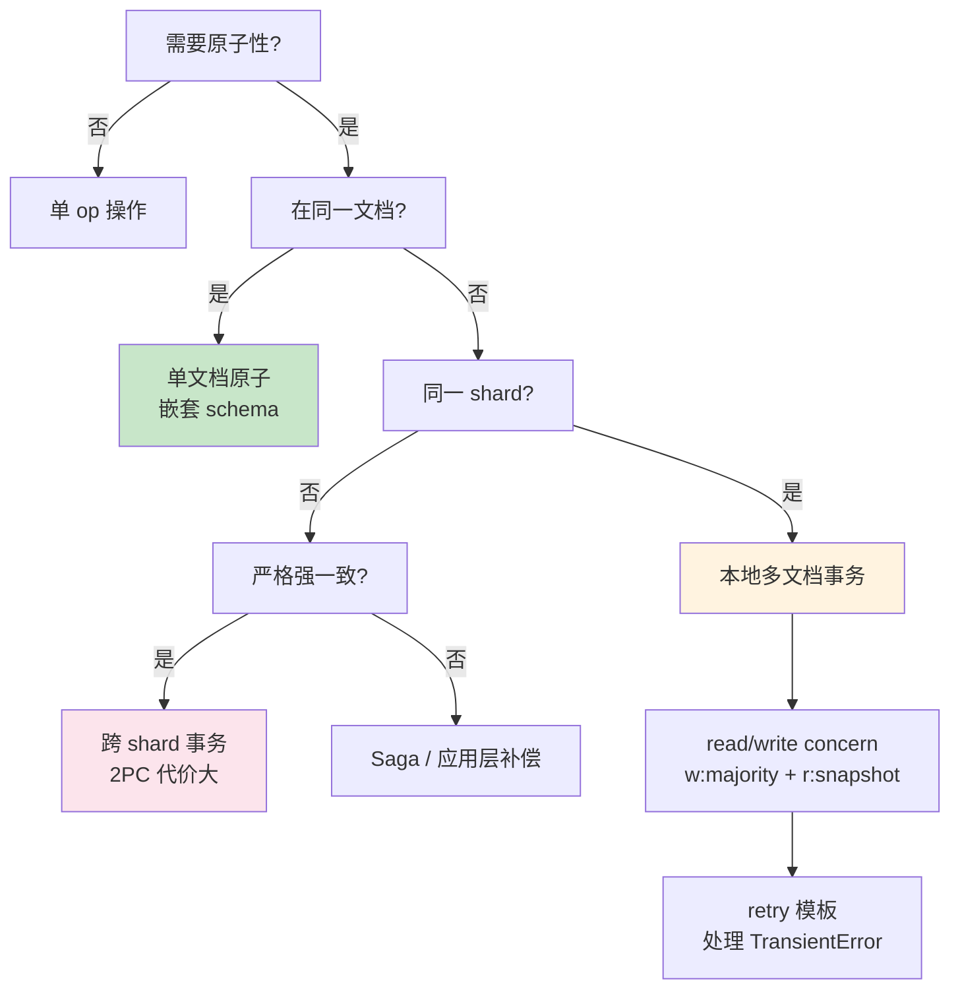

# 精通 MongoDB 事务与一致性：Multi-document Tx、Causal Consistency

> 关联章节：[M03 WiredTiger](./03-精通-WiredTiger.md)、[M05 副本集](./05-精通-副本集.md)、[M06 分片集群](./06-精通-分片集群.md)

---

## 引言：从单文档到多文档事务

MongoDB 的事务模型经历了漫长演化：

- **早期**：只支持单文档原子（update 一个文档原子）
- **MongoDB 4.0**：副本集支持多文档事务
- **MongoDB 4.2**：分片集群支持多文档事务
- **MongoDB 5.0+**：causal consistency、snapshot isolation 等完善

但 MongoDB 事务**不是 RDBMS 事务的等价品**：

- 默认时间窗口短（60 秒）—— 鼓励小事务
- 性能代价高（比单文档操作慢很多）
- 分片场景复杂度更高
- 仍然推荐**先靠 schema 设计避免多文档事务**

读完本章你应能：

- 决策何时用多文档事务何时用单文档原子操作
- 写出标准的 retry transaction 模板
- 区分 read concern / write concern / session 三层一致性
- 实现 causal consistency 避免 stale read
- 诊断 transaction abort / write conflict 故障

---

## 第一章：单文档原子性

### 1.1 默认保证

MongoDB **每个文档操作都是原子的**：

```js
db.users.updateOne(
  { _id: 1 },
  {
    $set: { name: "Alice" },
    $inc: { count: 1 },
    $push: { history: {...} }
  }
)
```

整个 update 操作内的所有字段修改要么全成功要么全失败——不需要事务包装。

### 1.2 嵌套文档也是原子的

```js
// 一个文档包含订单 + 商品
{
  _id: 1,
  customer: "Alice",
  items: [
    { sku: "A", qty: 2, price: 10 },
    { sku: "B", qty: 1, price: 20 }
  ],
  total: 40
}

db.orders.updateOne(
  { _id: 1, "items.sku": "A" },
  {
    $set: { "items.$.qty": 3 },
    $inc: { total: 10 }
  }
)
```

订单更新数量 + 修改 total，都在同一个文档内，**天然原子**。

这是 MongoDB 设计的关键：**通过嵌套规避跨文档事务需求**。

### 1.3 findOneAndUpdate

```js
const order = db.orders.findOneAndUpdate(
  { status: "pending" },
  { $set: { status: "processing", processor: "worker-1" } },
  { returnNewDocument: true, sort: { createdAt: 1 } }
)
```

原子操作 + 返回结果。常用于：

- 队列实现（fetch + claim）
- 计数器（取一个唯一值）
- 状态机推进

---

## 第二章：多文档事务

### 2.1 启用条件

- MongoDB 4.0+ 副本集
- 4.2+ 分片集群
- 集合必须存在（事务里不能 create collection）
- 必须用 session

### 2.2 基本模板

```js
const session = client.startSession()
try {
  session.startTransaction({
    readConcern: { level: "snapshot" },
    writeConcern: { w: "majority" }
  })

  db.accounts.updateOne(
    { _id: "alice" },
    { $inc: { balance: -100 } },
    { session }
  )

  db.accounts.updateOne(
    { _id: "bob" },
    { $inc: { balance: 100 } },
    { session }
  )

  session.commitTransaction()
} catch (err) {
  session.abortTransaction()
  throw err
} finally {
  session.endSession()
}
```

### 2.3 默认 read/write concern

事务内默认：

- read concern: `snapshot`
- write concern: `majority`

可以在 startTransaction 时覆盖。

### 2.4 超时

```yaml
transactionLifetimeLimitSeconds: 60   # 默认 60 秒
```

超过：自动 abort。

这是**鼓励小事务**的硬约束。要做长事务（如批处理）：

- 拆分成多个小事务
- 调大 limit（不推荐，影响 WT history store）

---

## 第三章：Retry Transaction 模板

### 3.1 为什么要 retry

事务可能因为 transient error 失败：

- WriteConflict（两个事务改同一文档）
- failover（primary 切换）
- 网络抖动

driver 不会自动 retry 整个事务（只 retry 单个 op）。应用层要自己 retry：

### 3.2 标准模板（Node.js driver）

```js
async function runTransactionWithRetry(client, txnFn) {
  while (true) {
    const session = client.startSession()
    try {
      session.startTransaction()
      await txnFn(session)
      await session.commitTransaction()
      return
    } catch (err) {
      await session.abortTransaction()
      if (err.errorLabels && err.errorLabels.includes("TransientTransactionError")) {
        continue   // 整个事务重试
      }
      if (err.errorLabels && err.errorLabels.includes("UnknownTransactionCommitResult")) {
        // commit 时挂了，不知道成没成 —— 这里要 retry commit 而不是整个事务
        continue
      }
      throw err
    } finally {
      session.endSession()
    }
  }
}

// 调用
await runTransactionWithRetry(client, async (session) => {
  await db.accounts.updateOne({_id: "alice"}, {$inc: {balance: -100}}, {session})
  await db.accounts.updateOne({_id: "bob"}, {$inc: {balance: 100}}, {session})
})
```

### 3.3 ErrorLabel 机制

- `TransientTransactionError`：临时错误，retry 整个事务
- `UnknownTransactionCommitResult`：commit 不确定，retry commit
- 没有这俩 label：永久错误，不要 retry

### 3.4 retry 次数

理论上无限。实战加上限（如 5 次）+ 指数退避避免雪崩。

---

## 第四章：Read Concern

### 4.1 级别

| Level | 含义 |
|---|---|
| `local`（默认非事务） | 看本节点最新 |
| `available` | 类似 local |
| `majority` | 看多数 commit 的版本 |
| `linearizable` | 强一致：等 majority + 再次确认 primary |
| `snapshot` | 事务用快照（session 期间一致） |

### 4.2 majority vs local

```
T0: client A write x=1 to primary
T1: primary applied，但 secondary 还没复制
T2: client B 在 secondary 上读 x：
    - local: 看到 secondary 上的 lastApplied（可能是 x=0）
    - majority: 看到 majority commit point（确认 x=0 之前的版本）
T3: secondary 复制完成，majority commit point 推进
T4: client B 再读：
    - local: 看到 x=1
    - majority: 看到 x=1
```

majority 保证：**读到的数据不会回滚**。

### 4.3 snapshot（事务专用）

事务开始时记录一个 timestamp，session 内所有读都基于这个 timestamp 看 snapshot。

```js
session.startTransaction({ readConcern: { level: "snapshot" } })

// 即使其他事务修改了 doc，本事务看到的还是开始时刻的版本
```

实现：依赖 WT MVCC，读老版本。

### 4.4 linearizable

```js
db.collection.findOne({...}, { readConcern: { level: "linearizable" } })
```

只能在 primary 上用。比 majority 还强：

- 等当前 majority commit
- 读完前再次确认自己仍是 primary（防 stale primary）

代价：

- 慢（多次往返）
- 不能用在事务中
- 极少业务真正需要

### 4.5 默认值

```js
db.adminCommand({ getDefaultRWConcern: 1 })
db.adminCommand({
  setDefaultRWConcern: 1,
  defaultReadConcern: { level: "majority" }
})
```

5.0+ 推荐默认 `majority`。

---

## 第五章：Write Concern

详见 M05。事务内 write concern 用在 commitTransaction：

```js
session.startTransaction({
  writeConcern: { w: "majority", j: true, wtimeout: 5000 }
})

session.commitTransaction()
// 等多数节点 ack 才返回
```

**w:majority 是事务的灵魂**——保证事务 commit 后不会因为 failover 丢失。

---

## 第六章：Causal Consistency（因果一致性）

### 6.1 解决什么问题

```
T0: 用户在 primary 写：profile.name = "Alice"
T1: 用户立刻读 secondary（lag 1s）→ 看到 name = "old" ❌
```

这是 **read-your-write 不一致**。

### 6.2 用 session 解决

```js
const session = client.startSession({ causalConsistency: true })

await db.users.updateOne({_id: 1}, {$set: {name: "Alice"}}, { session })
// 后续读跟 session 关联
const user = await db.users.findOne({_id: 1}, { session })
// → driver 会等 secondary 复制到刚才写的 timestamp 才读
```

### 6.3 实现原理

- 每个 op 返回一个 **operationTime**
- session 记住"我看过的最新 operationTime"
- 后续读自动 `afterClusterTime: operationTime`
- secondary 等到自己 lastApplied >= operationTime 才返回数据

### 6.4 多 session 的因果

```js
const sess1 = client.startSession({ causalConsistency: true })
// 在 sess1 写
db.users.updateOne({_id: 1}, {...}, { session: sess1 })

// 传 cluster time 给另一个 service
const clusterTime = sess1.getClusterTime()

const sess2 = client.startSession({ causalConsistency: true })
sess2.advanceClusterTime(clusterTime)
db.users.findOne({_id: 1}, { session: sess2 })   // 看到 sess1 的写
```

跨服务的"see-your-own-write"语义靠 cluster time 传递。

### 6.5 限制

- 只在副本集 / 分片集群有意义（单机不需要）
- 给 secondary 读加延迟（等到 sync）
- 不保证"全局顺序"（其他人的写可能没看到）

---

## 第七章：Snapshot Isolation

### 7.1 事务隔离级别

MongoDB 事务用 **snapshot isolation**：

- 事务开始时拍快照
- 看不到其他事务的中间状态
- 不阻止"幻读"（其他事务插入新文档）

### 7.2 Write Conflict

两个事务同时改同一文档：

```js
// tx1
db.accounts.updateOne({_id: "alice"}, {$inc: {balance: -100}}, {session: s1})

// tx2 同时
db.accounts.updateOne({_id: "alice"}, {$inc: {balance: -50}}, {session: s2})
```

后开始的事务 abort（WriteConflict / TransientTransactionError），需要 retry。

注意：**事务不锁文档**（不像 RDBMS 的 SELECT FOR UPDATE）。乐观并发 → 冲突时 retry。

### 7.3 与 RDBMS 隔离级别对比

| RDBMS | MongoDB |
|---|---|
| read-uncommitted | local read |
| read-committed | local read（事务外） |
| repeatable-read | snapshot（事务内） |
| serializable | ❌ 不支持（业务层保证） |

业务对严格"可串行化"有要求：

- 用悲观锁（如 advisory lock，业务自己实现）
- 或单 partition + 单事务保护

---

## 第八章：分片事务

### 8.1 工作原理

跨 shard 事务用 **2PC**（two-phase commit）：

```
1. Prepare phase
   coordinator → 每个参与 shard：prepare
   shard 持久化 prepare oplog entry
   shard 回应 OK
2. Commit phase
   coordinator 写 commit decision 到 config server
   coordinator → 每个 shard：commit
   shard 应用并 ack
```

如果 commit 阶段任一 shard 不可达：

- coordinator 持续重试
- 业务侧看到挂起的事务（可能几分钟）

### 8.2 性能代价

- 跨 shard 事务延迟 >> 单 shard
- 2PC 多 round trip
- shard 数越多越慢

经验：分片场景下**绝大多数业务避免跨 shard 事务**。

### 8.3 设计原则

shard key 设计让"业务事务范围"都落在同一 shard：

```js
// 错：user 和 order 不同 shard key
sh.shardCollection("users", { _id: "hashed" })
sh.shardCollection("orders", { _id: "hashed" })
// "下单 + 扣余额"事务跨两个 shard

// 对：用 customerId 作为共同前缀
sh.shardCollection("users", { customerId: 1, _id: 1 })
sh.shardCollection("orders", { customerId: 1, _id: 1 })
// 同 customer 的所有数据在同一 shard，事务本地化
```

---

## 第九章：替代方案

### 9.1 嵌套（最佳）

把相关数据放一个文档 → 单文档原子。

```js
{
  _id: "order-1",
  customer: { id: 42, name: "Alice", balance: 1000 },
  items: [...],
  status: "paid"
}
```

代价：信息冗余、更新复杂。

### 9.2 两阶段提交（应用层）

经典手动模式：

```
// pending log 文档
{ _id: "tx-1", from: "alice", to: "bob", amount: 100, status: "pending" }

// 1. 改 alice
db.accounts.updateOne({_id:"alice"}, {$inc:{balance:-100},$push:{pending:"tx-1"}})
// 2. 改 bob
db.accounts.updateOne({_id:"bob"}, {$inc:{balance:100},$push:{pending:"tx-1"}})
// 3. 标 tx 完成
db.txlog.updateOne({_id:"tx-1"}, {$set:{status:"done"}})
db.accounts.updateMany({_id:{$in:["alice","bob"]}}, {$pull:{pending:"tx-1"}})
```

复杂但比真事务灵活（可以是长事务、跨业务）。

### 9.3 Saga 模式

把分布式事务分解为一系列本地操作 + 补偿：

```
1. 扣库存
2. 扣余额
3. 创建订单
4. 任一失败 → 反向执行已执行的步骤
```

业务层实现，事件驱动。

### 9.4 选择

| 场景 | 选 |
|---|---|
| 99% 业务 | 单文档原子 + 嵌套 |
| 严格强一致跨文档 | 多文档事务（短） |
| 跨服务 | Saga |
| 历史遗留 RDBMS 范式 | 重新设计 schema 用嵌套 |

---

## 第十章：典型故障

### 10.1 案例：WriteConflict 频繁

**症状**：事务大量 abort，错误是 WriteConflict。

**根因**：

- 热点文档（多事务并发改同一 doc）
- 锁竞争

**修复**：

- 业务侧分散热点（如分片 user counter 到 N 个 doc）
- 缩短事务时间
- 异步处理某些非关键路径

### 10.2 案例：事务超过 60 秒

**症状**：事务报 "Transaction exceeded its lifetime limit"。

**根因**：事务内做了慢操作（大查询、外部调用）。

**修复**：

- 拆分事务
- 外部调用移出事务
- 必要时调大 transactionLifetimeLimitSeconds（不推荐 > 5min）

### 10.3 案例：分片事务挂起

**症状**：

```js
db.currentOp({ "transaction.parameters.txnNumber": {$exists: true} })
// 长时间 RUNNING 的事务
```

**根因**：2PC 中某 shard 不可达。

**修复**：

- 等 shard 恢复（事务自动 commit / abort）
- 或手动 abort：`db.killOp(opid)`

### 10.4 案例：stale read 业务异常

**症状**：用户改了 profile，立刻刷新看还是老的。

**根因**：默认 read 从 secondary，复制 lag。

**修复**：

- session causal consistency
- 或关键读走 primary
- 或读后等一小段时间

### 10.5 案例：commit 后崩溃

**症状**：业务侧收到 UnknownTransactionCommitResult，不知道 commit 成没成。

**根因**：commit 时 driver / 网络挂了。

**修复**：retry commit（不是 retry 整个事务）。

事务系统设计成 commit 是幂等的——再 commit 一次安全。

---

## 第十一章：实战 case study

### 11.1 银行转账

```js
async function transfer(from, to, amount) {
  await runTransactionWithRetry(client, async (session) => {
    const fromAcc = await db.accounts.findOne({_id: from}, {session})
    if (!fromAcc || fromAcc.balance < amount) throw new Error("Insufficient")

    await db.accounts.updateOne(
      {_id: from, balance: {$gte: amount}},
      {$inc: {balance: -amount}},
      {session}
    )
    await db.accounts.updateOne(
      {_id: to},
      {$inc: {balance: amount}},
      {session}
    )
    await db.transactions.insertOne({
      from, to, amount, ts: new Date()
    }, {session})
  })
}
```

要点：

- session 贯穿事务
- updateOne 用 `balance: {$gte: amount}` 双重保护（事务内仍可能并发）
- 写 audit log 在同事务

### 11.2 库存 + 订单

```js
async function placeOrder(userId, items) {
  await runTransactionWithRetry(client, async (session) => {
    // 1. 检查并扣库存（每件商品）
    for (const item of items) {
      const result = await db.products.updateOne(
        {_id: item.sku, stock: {$gte: item.qty}},
        {$inc: {stock: -item.qty}},
        {session}
      )
      if (result.matchedCount === 0) {
        throw new Error(`Insufficient stock for ${item.sku}`)
      }
    }
    // 2. 创建订单
    await db.orders.insertOne({
      userId, items, status: "paid", createdAt: new Date()
    }, {session})
  })
}
```

替代思路：把所有 item 放在订单文档里嵌入，库存单独维护（但需要先 reserve 再 confirm 的 saga）。

### 11.3 计数器（分散热点）

```js
// 反例：单一计数文档
db.counters.updateOne({_id: "global"}, {$inc: {n: 1}})
// 高并发下大量 WriteConflict

// 推荐：分散到 N 个 sub-counter
const shardId = Math.floor(Math.random() * 100)
db.counters.updateOne({_id: "global", shard: shardId}, {$inc: {n: 1}}, {upsert: true})

// 读取时聚合
db.counters.aggregate([
  {$match: {_id: "global"}},
  {$group: {_id: "$_id", total: {$sum: "$n"}}}
])
```

---

## 总结 · 事务与一致性一图



事务心法：

1. **嵌套 schema 是首选** —— 用单文档原子规避事务
2. **事务要短** —— 60 秒上限，业务内尽量更短
3. **always retry** —— TransientTransactionError 自动重试
4. **w:majority + r:snapshot** 是事务标配
5. **分片事务慎用** —— shard key 设计让事务本地化
6. **causal consistency** 解决 read-your-write

---

## 练习题

1. MongoDB 单文档原子性 vs 多文档事务的边界？
2. retry transaction 时如何区分应该 retry 整个还是只 retry commit？
3. read concern majority 与 snapshot 的区别？
4. 为什么 MongoDB 事务有 60 秒上限？
5. linearizable 在事务中能用吗？为什么？
6. WriteConflict 错误本质是什么？怎么减少？
7. 分片事务 2PC 的两阶段是什么？
8. causal consistency 怎么解决 stale read？
9. Saga 模式适合什么场景？
10. 单点计数器热点的修复策略？

> 答案见 [QUIZ.md](./QUIZ.md)

---

> 🔁 反馈：写一个转账 demo，加 sleep 模拟慢操作看 retry 行为
