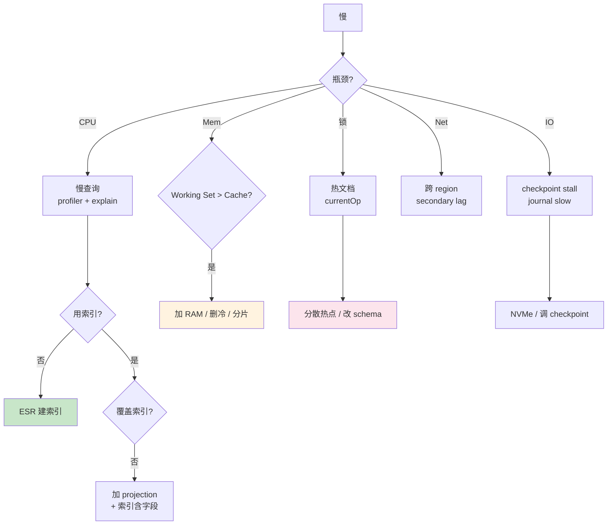

# 精通 MongoDB 性能调优：Profiler、Working Set、索引选择与热集合

> 关联章节：[M02 索引](./02-精通-索引.md)、[M03 WiredTiger](./03-精通-WiredTiger.md)、[M04 查询与聚合](./04-精通-查询与聚合管道.md)

---

## 引言：MongoDB 慢的根因

MongoDB 慢可以归到几类资源：

| 资源 | 表现 | 第一指标 |
|---|---|---|
| **CPU** | 查询慢、CPU 100% | `top` / mongostat |
| **内存（WT Cache）** | working set > RAM、cache miss 高 | `wiredTiger.cache` |
| **磁盘 IO** | 慢查询、checkpoint stall | `iostat` |
| **网络** | 跨 region 延迟、网卡饱和 | `iperf` / 客户端 P99 |
| **锁** | 慢操作 / lock queue 长 | `db.currentOp` |

调优的方法论：

1. 量化（profiler、explain）找到瓶颈
2. 索引 / schema / 配置三层修复
3. 测量验证

读完本章你应能：

- 用 profiler 找慢查询
- 用 explain 定位"为什么慢"
- 估算 working set 与 cache 关系
- 调优 connection / cursor / batch
- 设计热集合的分散策略

---

## 第一章：先量后调

### 1.1 慢查询分类

| 类型 | 表现 | 主因 |
|---|---|---|
| 全集合扫描 | COLLSCAN | 没建索引 |
| 索引但走错 | IXSCAN totalKeysExamined 远大于 nReturned | 索引选择性差 |
| 深分页 | skip 大数 | 算法错 |
| 大聚合 | 内存爆 | 没用索引、$group 基数大 |
| 大批量写 | journal 跟不上 | bulk size 太小 / IO 瓶颈 |
| 读 lag | replication 跟不上 | secondary 资源不足 |

### 1.2 调优顺序

```
1. 看 mongostat / mongotop 找 hotspot
2. 开 profiler 抓慢操作
3. explain 那几条慢查询
4. 看是不是缺索引 → 加
5. 是不是 working set > cache → 改 schema / 加 RAM / 分片
6. 是不是热点文档 → 分散
```

不要一上来就调参数（cache size、并发）—— 通常是 schema / 索引 / 业务模式问题。

---

## 第二章：Profiler

### 2.1 三档级别

```js
db.setProfilingLevel(0)   // 关
db.setProfilingLevel(1, { slowms: 100 })   // 只记 > 100ms 的
db.setProfilingLevel(2)   // 记所有（生产慎用，开销大）

db.getProfilingStatus()
```

### 2.2 查看慢日志

```js
db.system.profile.find().sort({ts: -1}).limit(10)
```

字段：

```js
{
  op: "query",
  ns: "mydb.orders",
  command: { find: "orders", filter: { status: "paid" }, sort: {...} },
  keysExamined: 1000,
  docsExamined: 50000,
  nreturned: 100,
  millis: 1500,
  planSummary: "COLLSCAN",
  client: "10.0.0.5:12345",
  ts: ISODate("...")
}
```

关键看：

- `millis`：耗时
- `keysExamined` / `docsExamined`：是否扫太多
- `planSummary`：执行计划简要

### 2.3 system.profile 的大小

是 capped collection（默认 1MB）。流量高时迅速 rotate。

调大：

```js
db.setProfilingLevel(0)
db.system.profile.drop()
db.createCollection("system.profile", { capped: true, size: 100*1024*1024 })  // 100MB
db.setProfilingLevel(1, { slowms: 100 })
```

### 2.4 生产实践

- 用 `slowms: 100`（不要全开 level 2）
- 定期分析 system.profile（每小时跑一次脚本）
- 找 top slow operations 处理

### 2.5 慢日志（mongod log）

profiler 之外，mongod 自动把 > slowOpThresholdMs 的操作写到 log：

```yaml
operationProfiling:
  slowOpThresholdMs: 100
  slowOpSampleRate: 1.0    # 1.0 = 全采，0.1 = 10% 采样
```

```bash
tail -f /var/log/mongodb/mongod.log | grep "Slow query"
```

适合外部工具（如 mongo-perf、Percona PMM）抓数据。

---

## 第三章：explain 深度解读

### 3.1 三种模式

```js
db.users.find({...}).explain("queryPlanner")        // 默认，不执行
db.users.find({...}).explain("executionStats")      // 含实际执行
db.users.find({...}).explain("allPlansExecution")  // 含候选 plan
```

### 3.2 关键 stage

| Stage | 含义 |
|---|---|
| COLLSCAN | 全集合扫（坏） |
| IXSCAN | 索引扫 |
| FETCH | 按 RecordId 取文档 |
| SORT | 内存排序 |
| LIMIT | 限制返回 |
| PROJECTION | 字段裁剪 |
| GEO_NEAR | 地理 |
| TEXT | 文本索引 |
| COUNT_SCAN | count 走索引 |
| SUBPLAN | $or 多个分支 |
| EOF | 没数据 |
| IDHACK | _id 等值的快速路径 |

### 3.3 健康指标

```
totalKeysExamined / totalDocsExamined / nReturned

理想：1 : 1 : 1
警觉：1000 : 10 : 1 ← 索引选择性差
最差：N : N : 1 ← 全扫
```

### 3.4 实战诊断

```js
db.orders.find({customerId: 42, status: "paid"}).sort({createdAt: -1}).explain("executionStats")
```

如果输出：

```
winningPlan: {
  stage: "SORT",
  inputStage: {
    stage: "FETCH",
    inputStage: {
      stage: "IXSCAN",
      indexName: "customerId_1"
    }
  }
}
executionStats: {
  totalKeysExamined: 5000,
  totalDocsExamined: 5000,
  nReturned: 100,
  executionTimeMillis: 200
}
```

诊断：

- IXSCAN 用了 customerId 索引（好）
- 但只查了 customerId 没用上 status → status filter 在 FETCH 后做
- SORT 在内存（5000 行）

修复：建复合索引 `{customerId: 1, status: 1, createdAt: -1}` → 走 ESR。

---

## 第四章：Working Set 与 Cache

### 4.1 Working Set 估算

```
Working Set ≈ 经常访问的文档大小 + 索引大小
```

实测方法：

```js
db.serverStatus().wiredTiger.cache["bytes currently in the cache"]
// 长期观察这个值

// 集合大小
db.users.stats().size           // 数据
db.users.totalIndexSize()       // 所有索引
```

如果 cache used / configured 持续 95%+ → cache 太小。

### 4.2 page eviction

```js
db.serverStatus().wiredTiger.cache["pages read into cache"]   // miss 计数
db.serverStatus().wiredTiger.cache["pages evicted"]            // 淘汰计数
```

`pages read into cache` 速率持续高 = working set > cache。

### 4.3 修复策略

按代价从低到高：

1. **加索引**：减小 working set（只 cache 索引，不 cache 全文档）
2. **删冷数据**：业务 retention 配置
3. **改 schema**：减小单文档大小、拆冷热集合
4. **加内存**
5. **分片**（最贵）

---

## 第五章：Connection 与 Pool

### 5.1 连接数

```js
db.serverStatus().connections
// { current: 200, available: 1800, totalCreated: 5000 }
```

每个连接占内存（~1MB）+ 一个线程。

- current > 1000 警觉
- max = `ulimit -n / 5` 经验值
- mongod 默认 maxIncomingConnections=65536（实际受 ulimit 限制）

### 5.2 客户端连接池

```js
const client = new MongoClient(uri, {
  maxPoolSize: 100,      // 单 client 最大连接数
  minPoolSize: 10,       // 最小保持
  maxIdleTimeMS: 30000   // 空闲超时
})
```

经验：

- maxPoolSize = 业务并发量
- 微服务每实例 50-100 够用
- 太大 → mongod 压力大

### 5.3 mongod 端

```yaml
net:
  maxIncomingConnections: 10000
```

通常不调。

### 5.4 连接复用

driver 默认连接池复用，不要每次操作建新 client：

```js
// 错
function query() {
  const client = new MongoClient(uri)
  await client.connect()
  // ...
  await client.close()
}

// 对
const client = new MongoClient(uri)
await client.connect()   // 应用启动一次
// 之后所有 query 用同一 client
```

---

## 第六章：Cursor 与 Batch

### 6.1 batchSize

```js
db.users.find().batchSize(1000)   // 默认首批为 101 文档或 16MiB 中较小者；后续每批上限 16MiB
```

- 调大：减少 RPC 次数，更快遍历
- 调太大：内存爆 / driver 缓存大

### 6.2 cursor 超时

```js
db.users.find().noCursorTimeout()   // 默认 10 分钟
```

长 cursor（处理慢）会被 mongod 自动关掉。要么处理快、要么 noCursorTimeout。

### 6.3 流式处理

```js
const cursor = db.events.find()
for await (const doc of cursor) {
  await process(doc)   // 异步处理
}
```

不要一次拿全集合到内存。

---

## 第七章：索引调优

### 7.1 评估索引价值

```js
db.users.aggregate([{$indexStats: {}}])

// 输出
{ name: "_id_", accesses: { ops: 1000000, since: ... } }
{ name: "email_1", accesses: { ops: 500, since: ... } }   // 用得少
{ name: "phone_1", accesses: { ops: 0, since: ... } }     // 没用 → 考虑删
```

### 7.2 多查询优化的复合索引

```js
// 业务有 3 种查询
// Q1: {status, createdAt}
// Q2: {customerId, status}
// Q3: {customerId, status, createdAt}

// 建一个能覆盖所有的复合索引
db.orders.createIndex({customerId: 1, status: 1, createdAt: -1})
// Q3 走前缀全部
// Q2 走前两个
// Q1 ❌ 不能用（缺 customerId 前缀）

// 还需要 Q1 索引
db.orders.createIndex({status: 1, createdAt: -1})
```

合并相似查询模式 → 一个复合索引能覆盖多种。

### 7.3 覆盖索引

```js
db.users.createIndex({email: 1, name: 1})
db.users.find({email: "a@x.com"}, {_id: 0, name: 1})
// 覆盖：不需要 FETCH
```

热路径 + 只取少字段时大幅提速。

### 7.4 删冗余索引

```js
db.users.getIndexes()
// 有 {a:1}、{a:1, b:1} 两个索引
// {a:1} 是 {a:1, b:1} 的前缀 → 可以删
db.users.dropIndex("a_1")
```

省写入开销 + 省存储。

---

## 第八章：聚合调优

### 8.1 $match 提前

```js
// 慢
db.orders.aggregate([
  { $group: { _id: "$customerId", total: { $sum: "$amount" } } },
  { $match: { total: { $gt: 10000 } } }
])

// 快
db.orders.aggregate([
  { $match: { amount: { $gt: 100 } } },           // 提前过滤减少 group 输入
  { $group: { _id: "$customerId", total: { $sum: "$amount" } } },
  { $match: { total: { $gt: 10000 } } }
])
```

### 8.2 $project 减字段

```js
// 慢（每文档带 100 字段进 pipeline）
db.users.aggregate([
  { $sort: { createdAt: -1 } },
  { $limit: 10 }
])

// 快
db.users.aggregate([
  { $project: { _id: 1, name: 1, createdAt: 1 } },   // 只带 3 个字段
  { $sort: { createdAt: -1 } },
  { $limit: 10 }
])
```

### 8.3 $lookup 优化

```js
// 慢：右侧无索引
db.orders.aggregate([
  { $lookup: { from: "users", localField: "userId", foreignField: "_id", as: "u" } }
])

// users._id 有索引（默认），但如果 join 字段不是 _id：
db.users.createIndex({ externalId: 1 })   // 必须建
db.orders.aggregate([
  { $lookup: { from: "users", localField: "externalUserId", foreignField: "externalId", as: "u" } }
])
```

### 8.4 索引可见的字段

```js
db.orders.createIndex({ status: 1, createdAt: -1 })

db.orders.aggregate([
  { $match: { status: "paid" } },
  { $sort: { createdAt: -1 } },   // 复用索引顺序，no actual sort
  { $limit: 100 }
])
```

`$match + $sort` 第一二 stage 复用复合索引。

### 8.5 allowDiskUse

```js
db.orders.aggregate([...], { allowDiskUse: true })
```

超过 100MB 内存时溢出到磁盘。慢但能跑大查询。

---

## 第九章：写入调优

### 9.1 Bulk

```js
const bulk = db.users.initializeUnorderedBulkOp()
for (const doc of docs) {
  bulk.insert(doc)
}
await bulk.execute()
```

- ordered (默认): 一条失败后续不做
- unordered: 失败继续 → **并行处理快**

经验：bulk size 1000-5000 doc 是甜区。

### 9.2 insertMany

```js
db.users.insertMany(docs, { ordered: false, writeConcern: { w: "majority" } })
```

简化 API，内部也走 bulk。

### 9.3 写入策略

| 场景 | 选 |
|---|---|
| 高吞吐不严 | w: 1, j: false |
| 通用业务 | w: majority, j: 默认 |
| 不能丢任何 | w: majority, j: true |

j:true 会让 fsync 等待 → 单 op 延迟增加几 ms。

### 9.4 不要每条 commit

```js
// 错：每文档一个事务
for (doc of docs) {
  await runTransaction(async (session) => {
    await db.orders.insertOne(doc, {session})
  })
}

// 对：批量
await db.orders.insertMany(docs)
```

事务 overhead 巨大。

---

## 第十章：热集合 / 热文档

### 10.1 识别热点

```js
db.currentOp({"command.collection": "orders"})
// 看是否大量并发操作集中在同一 collection

mongotop
// 看 collection 维度时间占用
```

### 10.2 修复：分散热点

**热文档**（如全局计数器）：

```js
// 反例
db.counters.updateOne({_id: "global"}, {$inc: {n: 1}})

// 分散到 N 个 sub-counter
db.counters.updateOne(
  {_id: "global", shard: Math.floor(Math.random() * 100)},
  {$inc: {n: 1}},
  {upsert: true}
)

// 读时聚合
db.counters.aggregate([
  {$match: {_id: "global"}},
  {$group: {_id: "$_id", total: {$sum: "$n"}}}
])
```

**热集合**（如所有用户日志在一个 collection）：

- 按业务拆 collection（按租户、按时间）
- 用分片

---

## 第十一章：监控指标

### 11.1 必看指标

| 指标 | 健康阈值 |
|---|---|
| connections.current | < 1000 |
| opcounters.query/insert/update/delete | 看业务 baseline |
| globalLock.activeClients.{readers, writers} | < 50% 总连接 |
| wiredTiger.cache.used / configured | < 95% |
| wiredTiger.cache.modified pages evicted | 突增警觉 |
| metrics.repl.network.replicationLag | < 1s |
| metrics.queryExecutor.scannedObjects / returned | < 100x 警觉 |

### 11.2 工具

- **mongostat**：实时 quick view
- **mongotop**：collection 级时间分布
- **Prometheus + mongodb_exporter**：Grafana 看板
- **Percona PMM**：开源 DBA 工具栈
- **MongoDB Atlas / Ops Manager**：商业一站式
- **Studio 3T / Compass**：GUI

### 11.3 Compass + Explain

MongoDB Compass GUI 内置 explain 可视化、profile 可视化、index advisor —— 对中级工程师极友好。

---

## 第十二章：典型故障

### 12.1 案例：所有查询突然慢 10×

**症状**：稳定运行半年后，所有查询 P99 飙高。

**诊断**：

- mongostat：dirty page 90%+
- wiredTiger.cache：used 95%

**根因**：数据增长，working set 超过 cache。

**修复**：

- 加 RAM
- 删冷数据
- 或上分片

### 12.2 案例：单慢查询拖垮集群

**症状**：业务 P99 抖动，找一个长 task。

**诊断**：

```js
db.currentOp({secs_running: {$gt: 10}})
// 找到一个 30 分钟的聚合
```

**根因**：业务部门后台报表跑全表扫。

**修复**：

```js
db.killOp(opid)
```

预防：

- 后台报表走 secondary（隔离）
- 加 $hint 强制索引
- 加 maxTimeMS 限时

```js
db.orders.find({...}).maxTimeMS(60000)   // 60 秒超时
```

### 12.3 案例：写入吞吐突降

**症状**：bulk insert 从 50k QPS 降到 5k。

**诊断**：

- secondary lag 持续涨
- primary `wiredTiger.cache.modified pages evicted` 高

**根因**：cache pressure，eviction 跟不上写入。

**修复**：

- 写入分批 + 加 sleep（业务侧）
- 升级磁盘 IO（SSD → NVMe）
- 加 cache size

### 12.4 案例：磁盘满

**症状**：mongod 拒绝写入，错误 "no space left"。

**诊断**：

```bash
df -h
du -sh /var/lib/mongo/* | sort -h | tail -10
```

**修复**：

- 紧急：删过期数据
- 中期：开 retention / TTL 索引
- 长期：监控 80% 提前告警

注意 MongoDB 删数据不立刻释放磁盘（WT 文件不缩）：

```js
db.runCommand({compact: "old_collection"})   // 阻塞，慎用
```

或 drop collection 后重建。

### 12.5 案例：连接数飙到上限

**症状**：

```
connections.current = 65000
应用报 connection refused
```

**根因**：应用每请求一个 connection 没复用。

**修复**：

- 应用层用连接池
- 或加 mongos 节点分摊
- 临时：调高 mongod ulimit + maxIncomingConnections

---

## 第十三章：实战调优清单

### 13.1 应用启动前

- [ ] 选对 driver 版本（与 MongoDB 版本兼容）
- [ ] maxPoolSize 设合理（50-100 per app instance）
- [ ] read preference 配好（primary 还是 secondary）
- [ ] retryWrites: true
- [ ] writeConcern 默认 majority
- [ ] 监控 + 慢日志开

### 13.2 业务上线前

- [ ] 所有查询走索引（explain 验证）
- [ ] 复合索引按 ESR 设计
- [ ] 没有全表扫
- [ ] 热文档分散
- [ ] 没有无限增长数组
- [ ] 写入用 bulk
- [ ] 慢操作 maxTimeMS

### 13.3 容量规划

- [ ] working set ≤ 70% cache（留余量）
- [ ] 磁盘 < 70%（留余量）
- [ ] 单 collection < 500GB（再大考虑分片）
- [ ] 单分片 < 2TB

### 13.4 上分片前

- [ ] 副本集已优化到极限
- [ ] 已 vertical scale 到大机器
- [ ] working set 仍然 > cache 多倍
- [ ] shard key 已设计好

---

## 总结 · 性能调优一图



性能心法：

1. **先量后调** —— profiler + explain 找证据
2. **索引是第一杠杆** —— ESR + 覆盖索引
3. **Working Set 是性能底线** —— 超过 cache 万劫不复
4. **热点要主动分散** —— 不能等业务自己均衡
5. **bulk 优于单 op** —— 网络放大效应
6. **监控 + 告警** —— 80% 提前发现

---

## 练习题

1. profiler level 1 / 2 区别？生产用哪个？
2. explain 中 totalKeysExamined / nReturned 多少比例算健康？
3. 如何估算 working set？
4. cache used 持续 95% 该怎么办？
5. 全局计数器热点的修复方案？
6. 一个查询慢，列 5 个排查步骤。
7. allowDiskUse 适合什么场景？
8. drop collection 后磁盘没释放怎么办？
9. 连接数飙到上限的根因 + 修复？
10. 单 collection > 2TB 该不该分片？

> 答案见 [QUIZ.md](./QUIZ.md)

---

> 🔁 反馈：开 profiler 跑生产流量一小时，看 top 10 慢操作
