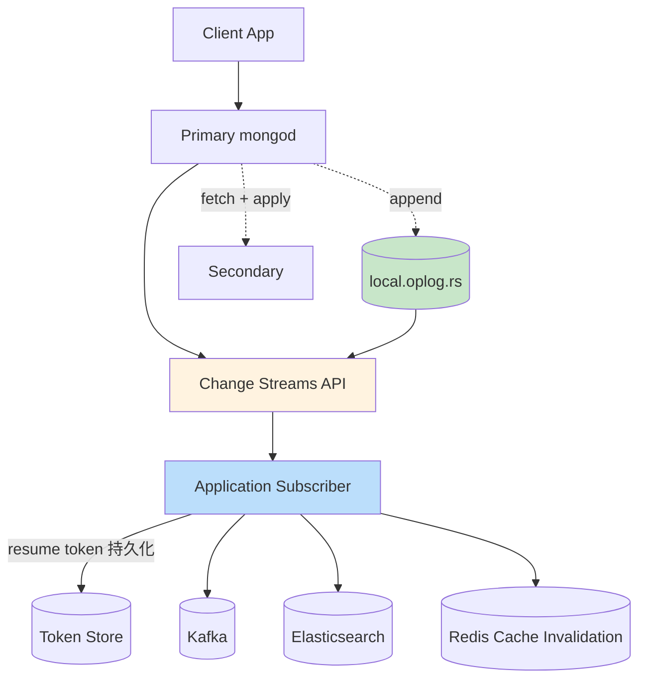

# 精通 MongoDB Change Streams 与 oplog：CDC、Resume Token 与 Kafka 集成

> 关联章节：[M05 副本集](./05-精通-副本集.md)、[M06 分片集群](./06-精通-分片集群.md)、[M10 Schema 设计](./10-精通-Schema-设计.md)

---

## 引言：把 MongoDB 变成事件流的源头

老的 CDC（变更数据捕获）方案：

- 业务每次写 DB 也写一份 Kafka（**双写**，容易不一致）
- 定时任务轮询 `updatedAt`（延迟高、漏改 / 漏删）
- 解析 binlog / oplog（实现复杂）

**Change Streams**（3.6 引入）让 MongoDB 内置 CDC：

- 应用以"长连接订阅"的方式拿到所有变更事件
- 基于 oplog，与复制同源
- 支持 resume token（断点续传）
- 支持过滤、转换（用聚合管道）

读完本章你应能：

- 区分 oplog（内部）与 change streams（应用 API）
- 写出 collection / database / cluster 三种级别的监听
- 用 resume token 实现断点续传
- 把 Change Streams 接到 Kafka / Elasticsearch 做下游同步
- 诊断 invalidate、token expired、oplog window 故障

---

## 第一章：oplog 复习

详见 M05。这里只回顾必要点：

- `local.oplog.rs` 是 capped collection，记录 primary 上所有写
- 每条 entry 含 op type、ns、o（操作内容）、ts、t
- secondary 拉 oplog 并 replay 实现复制
- **change streams 也是从 oplog 派生**——但 API 更友好

oplog 是**幂等 + 单调有序**。

---

## 第二章：Change Streams 基础

### 2.1 最简单的例子

```js
const stream = db.users.watch()

while (stream.hasNext()) {
  const change = stream.next()
  console.log(change)
}
```

每次有人对 `users` collection 做写操作（insert / update / delete / replace），就推一条 change event。

### 2.2 事件结构

```js
{
  _id: { _data: "82..." },        // resume token
  operationType: "insert",         // insert/update/delete/replace/drop/dropDatabase/invalidate/rename
  clusterTime: Timestamp(1715587200, 1),
  fullDocument: { _id: 1, name: "Alice", age: 28 },   // 新文档（insert / 后续配置可看 update 后版本）
  ns: { db: "mydb", coll: "users" },
  documentKey: { _id: 1 },
  updateDescription: {              // 仅 update / replace
    updatedFields: { age: 29 },
    removedFields: [],
    truncatedArrays: []
  }
}
```

每种 operationType 字段略不同。

### 2.3 三个级别

```js
// collection
db.users.watch()

// database：监听整个 db 所有 collection
db.watch()

// cluster：监听整个集群（实例 admin db）
client.watch()
```

级别越高，事件越多。一般业务只监听单个 collection。

### 2.4 启用前提

- **副本集或分片集群**（单机 mongod 不支持 change streams）
- 用户有 `find` 权限的 collection 才能 watch

---

## 第三章：聚合管道过滤

### 3.1 用 $match 过滤

```js
const stream = db.users.watch([
  { $match: { operationType: "insert" } }
])
// 只关心 insert
```

注意 `$match` 是对 **change event** 文档的匹配，不是对原 collection 的文档。

### 3.2 监听特定字段变更

```js
const stream = db.users.watch([
  { $match: {
    "operationType": "update",
    "updateDescription.updatedFields.status": { $exists: true }
  }}
])
// 只关心 status 字段被改的情况
```

### 3.3 fullDocument 选项

默认 update 事件只有 `updateDescription`，不包含完整文档。要拿完整新文档：

```js
const stream = db.users.watch([], { fullDocument: "updateLookup" })
// 每次 update 时 mongod 多查一次拿完整文档，附在 fullDocument
```

代价：每事件多一次 query。

更全：

```js
{ fullDocument: "required" }   // 强制带（要求集合开启 changeStreamPreAndPostImages）
{ fullDocumentBeforeChange: "required" }   // 还要 update 前的版本
```

### 3.4 Pre/Post Image（6.0+）

要拿 update 前的版本：

```js
db.runCommand({
  collMod: "users",
  changeStreamPreAndPostImages: { enabled: true }
})

const stream = db.users.watch([], {
  fullDocument: "required",
  fullDocumentBeforeChange: "required"
})
```

代价：mongod 多记录一份历史（占空间）。

---

## 第四章：Resume Token

### 4.1 断点续传

每个 event 带一个 `_id`（resume token）。重启时用它从上次位置续：

```js
const stream = db.users.watch([], { resumeAfter: lastToken })
```

或：

```js
{ startAfter: lastToken }
```

`resumeAfter` 要求 token 仍在 oplog window 内；`startAfter` 略宽松（允许从已 invalidate 后继续）。

### 4.2 持久化 token

应用侧负责持久化：

```js
let lastToken = null

// 启动时从持久存储恢复 token
lastToken = await loadToken()

const stream = lastToken
  ? db.users.watch([], { resumeAfter: lastToken })
  : db.users.watch()

while (stream.hasNext()) {
  const event = stream.next()
  await processEvent(event)
  lastToken = event._id
  await saveToken(lastToken)   // 处理一条就持久化
}
```

适合存 token 的地方：

- 应用所在的数据库（同一 MongoDB / PostgreSQL）
- Redis
- 本地文件（单实例场景）

### 4.3 Token 过期

如果应用离线很久，oplog 已经 rotate 掉对应 entry：

```
Error: cannot resume stream; the resume token was not found
```

修复：

- oplog window 设大（M05 提到 24h 起步、关键业务 7d）
- 应用持续运行，少 downtime
- 真过期了：从 startAtOperationTime 开始（要业务可容忍跳过中间事件）

### 4.4 startAtOperationTime

```js
const stream = db.users.watch([], {
  startAtOperationTime: Timestamp(1715587200, 1)
})
```

从某个时间点开始。适合：

- 首次启动（不知道 token）
- token 过期后重置

---

## 第五章：事件类型

### 5.1 完整列表

| operationType | 含义 |
|---|---|
| `insert` | 插入 |
| `update` | 部分更新 |
| `replace` | 整文档替换 |
| `delete` | 删除 |
| `drop` | 集合被 drop |
| `dropDatabase` | 数据库被 drop |
| `rename` | 集合改名 |
| `invalidate` | 流终止（如 drop / rename） |
| `create` | 集合创建（6.0+） |
| `createIndexes` | 索引创建（6.0+） |
| `modify` | 集合配置改 |
| `shardCollection` | 集合开始分片 |
| `refineCollectionShardKey` | shard key 改 |
| `reshardCollection` | resharding（5.0+） |

### 5.2 invalidate

接收到 `invalidate` 后，stream 终止：

```js
{ operationType: "invalidate", clusterTime: ... }
```

触发：

- collection 被 drop（collection 级 stream）
- database 被 drop（database 级 stream）

应用必须**重启** stream（不能从同 token 续）。

### 5.3 update 的字段语义

```js
{
  operationType: "update",
  updateDescription: {
    updatedFields: { "address.city": "NYC", age: 29 },   // 改的字段（点路径）
    removedFields: ["temp"],                              // $unset 的
    truncatedArrays: [                                   // 6.0+ 数组截断
      { field: "tags", newSize: 5 }
    ]
  }
}
```

下游用这些信息做增量更新（只同步变化的字段）。

---

## 第六章：分片集群下的 Change Streams

### 6.1 在 mongos 上 watch

```js
// 连 mongos
const client = new MongoClient("mongodb://mongos:27017/")
const stream = client.db("mydb").collection("users").watch()
```

mongos 内部：

- 跟每个 shard 各自开 oplog 流
- 合并 event 按 cluster time 排序
- 输出给客户端的是全集群有序流

### 6.2 性能

- mongos 是无状态合并节点
- 每个 shard 各跑各的 oplog 拉取
- shard 多 → mongos 工作量增加

### 6.3 局限

- 不能跨 shard 事务的两个文档"一起"看到（只能按 cluster time 顺序，单条单条来）
- 涉及 chunk migration 时 event 可能含特殊标记

---

## 第七章：与 Kafka 集成

### 7.1 MongoDB Kafka Connector

官方 connector（基于 Kafka Connect 框架）：

```json
{
  "name": "mongo-source",
  "config": {
    "connector.class": "com.mongodb.kafka.connect.MongoSourceConnector",
    "tasks.max": "1",
    "connection.uri": "mongodb://localhost:27017",
    "database": "mydb",
    "collection": "users",
    "pipeline": "[{\"$match\":{\"operationType\":\"insert\"}}]",
    "topic.namespace.map": "{\"mydb.users\":\"users-events\"}",
    "publish.full.document.only": "true",
    "change.stream.full.document": "updateLookup"
  }
}
```

工作：

- Connector 内部就是 Change Streams 监听
- 每条 event → 转 Kafka message
- offset 用 resume token

### 7.2 反向（Kafka → MongoDB）

Sink connector：

```json
{
  "name": "mongo-sink",
  "config": {
    "connector.class": "com.mongodb.kafka.connect.MongoSinkConnector",
    "topics": "users-events",
    "connection.uri": "mongodb://localhost:27017",
    "database": "mydb",
    "collection": "users_copy",
    "document.id.strategy": "com.mongodb.kafka.connect.sink.processor.id.strategy.FullKeyStrategy"
  }
}
```

### 7.3 替代：Debezium

Debezium 也支持 MongoDB（自 1.0+）：

- 同样基于 oplog（实际接 oplog API，4.0 之前的方式）或 Change Streams（更新版）
- 产生标准 CDC 格式（与 MySQL/Postgres CDC 一致）
- 适合统一架构（业务里多种 DB 都用 Debezium）

### 7.4 选择

| 工具 | 适合 |
|---|---|
| MongoDB Kafka Connector | 只有 MongoDB 源、Confluent 生态 |
| Debezium | 多源 CDC 统一架构 |
| 自写 Change Streams 消费者 | 自定义逻辑、不上 Kafka Connect |

---

## 第八章：与 Elasticsearch 同步

### 8.1 经典架构

```
MongoDB → Change Streams → 应用 → Elasticsearch
```

或者：

```
MongoDB → Kafka Connector → Kafka → ES Sink → Elasticsearch
```

### 8.2 自写同步示例

```js
const esClient = new Client({...})

const stream = db.users.watch([], { fullDocument: "updateLookup" })

while (stream.hasNext()) {
  const event = stream.next()

  switch (event.operationType) {
    case "insert":
    case "update":
    case "replace":
      await esClient.index({
        index: "users",
        id: event.documentKey._id.toString(),
        document: transformForES(event.fullDocument)
      })
      break
    case "delete":
      await esClient.delete({
        index: "users",
        id: event.documentKey._id.toString()
      })
      break
  }

  await saveToken(event._id)
}
```

### 8.3 重要细节

- ES 的 _id 用 MongoDB _id（字符串化）
- 处理失败时不要 advance token（下次重试）
- 用 bulk indexing 提高吞吐
- 监控 ES 与 MongoDB 之间的延迟

### 8.4 初始数据同步

Change Streams 只看**启动之后**的变更。初始全量同步要分开做：

```js
// 1. 记录当前 cluster time
const now = (await db.admin().command({ hello: 1 })).$clusterTime.clusterTime

// 2. 全量扫
await db.users.find().forEach(async (doc) => {
  await esClient.index({ index: "users", id: doc._id.toString(), document: doc })
})

// 3. 从 now 时间点开始增量
const stream = db.users.watch([], { startAtOperationTime: now })
```

---

## 第九章：典型应用模式

### 9.1 物化视图

把聚合结果增量维护到另一个 collection：

```js
const stream = db.orders.watch()
while (stream.hasNext()) {
  const event = stream.next()
  if (event.operationType === "insert") {
    const order = event.fullDocument
    await db.daily_summary.updateOne(
      { date: dateOnly(order.createdAt), customer: order.customerId },
      { $inc: { count: 1, total: order.amount } },
      { upsert: true }
    )
  }
}
```

### 9.2 事件总线

业务模块解耦：

```
Order Service → MongoDB orders
                     ↓ Change Stream
              Inventory Service ← 扣库存
              Notification Service ← 发邮件
              Analytics Service ← 实时统计
```

### 9.3 审计日志

所有写操作记录到审计 collection / 外部 SIEM：

```js
const stream = db.watch([
  { $match: { "operationType": { $in: ["insert", "update", "delete", "replace"] } } }
], { fullDocument: "updateLookup", fullDocumentBeforeChange: "required" })

while (stream.hasNext()) {
  const event = stream.next()
  await auditLog.write({
    op: event.operationType,
    ns: event.ns,
    docKey: event.documentKey,
    before: event.fullDocumentBeforeChange,
    after: event.fullDocument,
    ts: event.clusterTime
  })
}
```

### 9.4 缓存失效

```js
const stream = db.users.watch()
while (stream.hasNext()) {
  const event = stream.next()
  await redis.del(`user:${event.documentKey._id}`)
}
```

DB 一变 → 自动失效缓存，避免业务代码每处都要写"改 DB + 删 cache"。

### 9.5 跨数据中心复制

```js
// 把生产集群的 events 复制到 DR 集群
const sourceStream = sourceClient.db("mydb").collection("users").watch()
const targetColl = targetClient.db("mydb").collection("users")

while (sourceStream.hasNext()) {
  const event = sourceStream.next()
  await applyEvent(targetColl, event)
}
```

实际是不必要——MongoDB 原生 CCR / mirroring 通常更好。但自定义场景（如转换格式）有用。

---

## 第十章：可靠性

### 10.1 At-least-once 语义

Change Streams 是 **at-least-once**：

- 应用收到事件 → 处理 → 持久化 token
- 处理完但 token 没存 → 重启 → 重复处理

下游必须**幂等**：

- ES 用 doc id 覆盖式写
- DB 用 upsert
- Kafka 配 idempotent producer + 业务 key

### 10.2 顺序保证

**单 collection 内事件按 cluster time 严格有序**。

跨 collection / 跨 shard：

- mongos 合并后按 cluster time 排序
- 但同一时刻的事件来自不同 shard，相对顺序不保证

### 10.3 失败处理

```js
while (stream.hasNext()) {
  const event = stream.next()
  try {
    await processEvent(event)
    await saveToken(event._id)
  } catch (e) {
    // 不要 advance token
    // 选择：
    //  - 立刻 retry
    //  - 加 DLQ：写到死信 collection
    //  - 阻塞 stream（等运维介入）
    await sendToDLQ(event, e)
    await saveToken(event._id)   // 跳过这条
  }
}
```

经典 DLQ 模式适合"少数坏数据不能阻塞主流"。

---

## 第十一章：典型故障

### 11.1 案例：resume token 过期

**症状**：应用重启报 `cannot resume stream; the resume token was not found`。

**根因**：oplog rotate 掉了 token 对应的 entry（应用离线时间 > oplog window）。

**修复**：

```js
// 用 startAtOperationTime（业务能容忍跳事件）
const stream = db.users.watch([], { startAtOperationTime: Timestamp(now, 1) })
```

预防：

- 加大 oplog（`replSetResizeOplog`）
- 应用不停（HA 部署）
- 监控 lag

### 11.2 案例：stream 慢累计

**症状**：监听慢，下游 lag 越来越大。

**诊断**：

- 处理单事件耗时多少？
- 网络 RTT？
- 下游写入慢？

**修复**：

- 处理并发化（worker pool）
- 批量提交下游
- 减少 fullDocument 查询（不需要的事件别用 updateLookup）
- 用 $match 过滤无关事件

### 11.3 案例：collection 被 drop 后 stream 断

**症状**：业务 drop & recreate collection，stream 收到 invalidate 后断开。

**处理**：

- 应用监听 invalidate，自动重启 stream
- 用 database 级 watch（不依赖单 collection）

```js
const stream = db.watch()   // db 级
while (stream.hasNext()) {
  const event = stream.next()
  if (event.ns.coll === "users") {
    process(event)
  }
}
```

### 11.4 案例：分片场景事件乱

**症状**：分片集群下，event 之间顺序奇怪。

**根因**：跨 shard 事件按 cluster time 排序，但同时刻不同 shard 顺序不保证。

**修复**：

- 业务侧不要假设跨 shard 严格顺序
- 同 shard key 的事件 → 同 shard → 顺序保证

### 11.5 案例：fullDocument 拿到的是新版

**症状**：用 updateLookup 拿 fullDocument，但拿到的可能是后续又被改过的版本。

**根因**：updateLookup 是事件被消费时再查 collection，**不是事件发生时的快照**。

**修复**：

- 用 `fullDocument: "required"` + `changeStreamPreAndPostImages` 拿真正的事件时快照
- 或业务侧不依赖 update 时刻的精确文档

---

## 第十二章：监控

### 12.1 关键指标

```js
db.serverStatus().metrics.repl
db.serverStatus().wiredTiger
```

- oplog window：`rs.printReplicationInfo()`
- change stream 客户端连接数：通过应用日志
- 处理延迟：应用侧 (现在时间 - event.clusterTime)

### 12.2 告警

| 指标 | 阈值 |
|---|---|
| oplog window | < 12h |
| change stream lag（业务侧测量） | > 60s |
| resume token 过期次数 | > 0 |
| DLQ 增长 | 持续涨 |

### 12.3 实战 dashboard

至少含：

- oplog 大小与 window
- change stream 客户端 lag（应用 push 自己测的指标）
- 每 collection 事件速率
- 错误率 / DLQ 速率

---

## 第十三章：性能与扩展

### 13.1 单 stream 吞吐

- 单进程消费：几千 events/sec
- 取决于事件处理速度

### 13.2 水平扩展

Change Streams 是**单 cursor**——不能分片消费一个 stream。

但可以：

- 多 stream 监听不同 collection（每业务模块自己一份）
- 单事件流 → 拉到 Kafka → 多 consumer 并行

### 13.3 fullDocument 的代价

每事件多一次 collection.findOne。100k events/s 时 fullDocument 翻倍 QPS。

经验：

- 真的需要全文档时才开（否则 updateDescription 已经够）
- 用 pre/post image（6.0+）效率更高（不再额外 query）

---

## 第十四章：实战 case

### 14.1 订单状态机驱动业务

```js
const stream = db.orders.watch([
  { $match: {
    "operationType": "update",
    "updateDescription.updatedFields.status": { $exists: true }
  }}
], { fullDocument: "updateLookup" })

while (stream.hasNext()) {
  const event = stream.next()
  const order = event.fullDocument
  const newStatus = event.updateDescription.updatedFields.status

  switch (newStatus) {
    case "paid":
      await sendInvoiceEmail(order)
      await reserveInventory(order)
      break
    case "shipped":
      await sendShippingNotification(order)
      break
    case "delivered":
      await triggerReviewRequest(order)
      break
  }

  await saveToken(event._id)
}
```

要点：

- 状态变更是触发器
- 业务模块完全解耦（订单服务只管 update status）
- DLQ + retry 保证健壮

### 14.2 实时大屏

```js
const stream = db.events.watch([
  { $match: { operationType: "insert" } }
])

while (stream.hasNext()) {
  const event = stream.next()
  const ev = event.fullDocument
  // 推到 WebSocket
  io.emit("event", { type: ev.type, ts: ev.ts })
  // 增量更新 Redis 计数
  await redis.incr(`counter:${dateOnly(ev.ts)}:${ev.type}`)
}
```

### 14.3 双写 OS / ES（写 MongoDB 同时入 ES）

```
应用 → write MongoDB
        ↓ Change Stream
       Sync Worker → Elasticsearch
```

业务代码只关心 MongoDB；同步逻辑独立。

---

## 总结 · Change Streams 一图



Change Streams 心法：

1. **基于 oplog，但 API 友好** —— 应用不直接读 oplog
2. **at-least-once + 幂等** 是必备组合
3. **resume token 持久化** 防止重启重复
4. **fullDocument 按需开启** —— updateLookup 有代价
5. **oplog window 要够长** —— 应用离线容忍上限
6. **跨 shard 按 cluster time 排序** —— 但同时刻顺序不保证

---

## 练习题

1. Change Streams 与直接读 oplog 的区别？
2. resume token 过期是怎么发生的？怎么预防？
3. fullDocument: updateLookup 与 required 的区别？
4. invalidate 事件什么时候触发？如何处理？
5. 单 collection 的事件顺序保证什么？跨 collection 呢？
6. 应用侧如何实现 at-least-once + 幂等？
7. 在分片集群上 watch 的工作机制？
8. updateLookup 拿到的 fullDocument 一定是事件时刻的版本吗？
9. 初始全量同步与增量切换怎么衔接？
10. 单进程 Change Streams 吞吐瓶颈在哪？怎么扩展？

> 答案见 [QUIZ.md](./QUIZ.md)

---

> 🔁 反馈：写个简单 watch 脚本，开两个终端：一个改数据，一个看事件流
