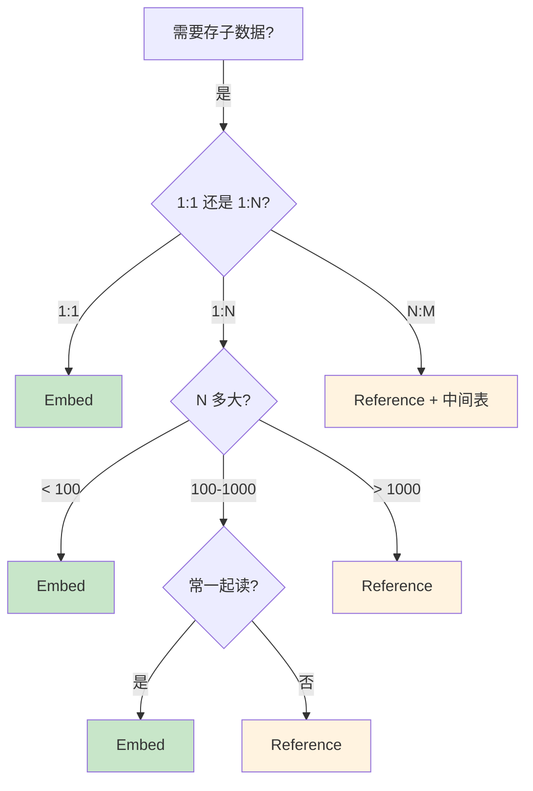
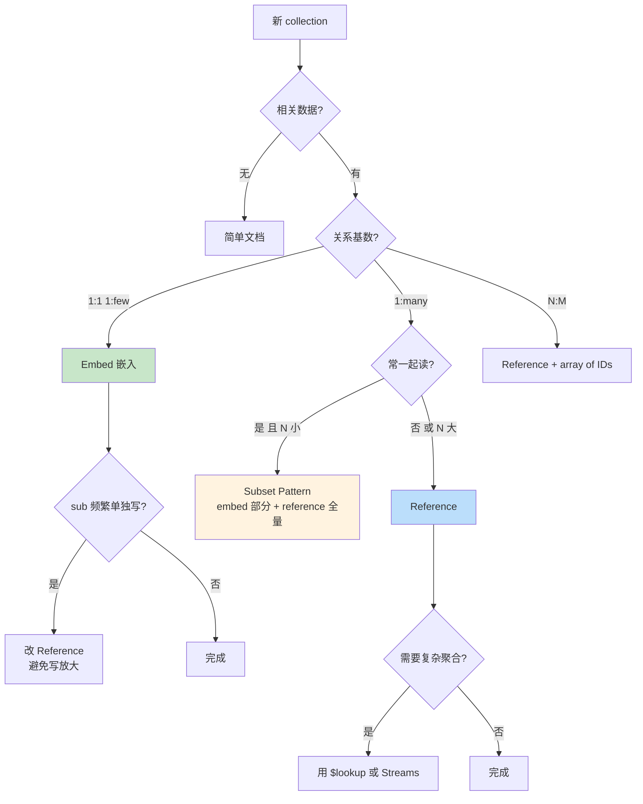
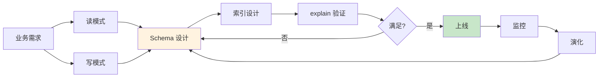

# 精通 MongoDB Schema 设计：Embed vs Reference、Pattern 与 演化

> 关联章节：[M01 文档模型](./01-精通-文档模型-与-BSON.md)、[M04 查询与聚合](./04-精通-查询与聚合管道.md)、[M07 事务](./07-精通-事务与一致性.md)

---

## 引言：Schema 设计是 MongoDB 工程的灵魂

MongoDB 没有强 schema，但**有 Schema 设计**。一个集合用什么形状的文档，决定：

- 查询性能（能不能一次拿全？要不要 join？）
- 写入复杂度（更新一处是改一个文档还是多个？）
- 存储成本（冗余多少？）
- 演化难度（加字段、改字段会破坏多少代码？）

读完本章你应能：

- 在 embed / reference / 混合之间正确选
- 应用主流 schema patterns（bucket / outlier / computed / tree 等）
- 处理 schema 演化（在线迁移、双读双写）
- 避免常见反模式（无限增长数组、过度规范化、大文档）

---

## 第一章：核心权衡 —— Embed vs Reference

### 1.1 Embed（嵌入）

```js
{
  _id: 1,
  name: "Alice",
  addresses: [
    { type: "home", city: "NYC", street: "..." },
    { type: "work", city: "NYC", street: "..." }
  ]
}
```

特点：

- 一次查询拿到所有数据
- 原子性强（单文档操作）
- 不需要 join

代价：

- 数据冗余（如果同 address 多人共用）
- 文档大（嵌入太多会撑 16MB）
- 更新 sub-doc 时整文档写回

### 1.2 Reference（引用）

```js
// users
{ _id: 1, name: "Alice", addressIds: [ObjectId("a1"), ObjectId("a2")] }

// addresses
{ _id: ObjectId("a1"), type: "home", city: "NYC" }
```

特点：

- 数据规范化（同 address 共享）
- 单文档小
- 适合"多对多"

代价：

- 查询时要 $lookup 或应用层 join
- 跨文档更新没原子性（事务太贵）
- 应用代码复杂

### 1.3 三个决策维度

**1. 关系基数**

| 类型 | 推荐 |
|---|---|
| 1:1 | embed |
| 1:few（< 100） | embed |
| 1:many（数百到数千） | embed 但要分页或拆 |
| 1:massive（百万级） | reference |
| many:many | reference + 中间集合 |

**2. 访问模式**

- 总是一起读 → embed
- 经常单独读 sub → reference

**3. 更新频率**

- sub 很少改 → embed
- sub 频繁单独改 → reference（避免每次写大文档）

### 1.4 决策树



---

## 第二章：常见 Schema Patterns

### 2.1 Embedded Pattern

最基本：把相关数据嵌入主文档。

```js
// 博客文章 + 评论
{
  _id: "post-1",
  title: "Hello",
  content: "...",
  comments: [
    { author: "Alice", text: "Great!", at: ISODate("...") },
    { author: "Bob", text: "Nice!", at: ISODate("...") }
  ]
}
```

适合：评论数有上限（< 100）的博客。

不适合：热门帖子有几万条评论 → 16MB 撑爆。

### 2.2 Subset Pattern

只 embed **常用的部分**，剩余 reference：

```js
// 商品 + 最新 5 条评价 + 评价集合
{
  _id: "prod-1",
  name: "Widget",
  reviewsTop5: [
    { user: "Alice", rating: 5, text: "..." },
    ...
  ]
}

// reviews 集合存全量
{ _id: "rev-1", productId: "prod-1", user: "Alice", ... }
```

适合：商品页只显示 top 5 评价，详情页才看全部。

### 2.3 Computed Pattern

预算好的聚合结果存在文档里：

```js
{
  _id: "user-1",
  name: "Alice",
  totalOrders: 42,       // 维护值
  totalSpent: 1500,
  lastOrderAt: ISODate("...")
}
```

每次新订单 → 用 `$inc` 更新这些字段，不需要每次查询都聚合 orders。

代价：写时多一个 update。但读快无数倍。

适合：仪表盘、用户档案、商品库存。

### 2.4 Bucket Pattern

**最重要的时序模式**。把多条小记录聚合成一个 bucket 文档：

```js
// 反例：每条传感器读数一个文档（1M 条 / 天）
{ sensorId: "s1", ts: ISODate("..."), value: 23.5 }
{ sensorId: "s1", ts: ISODate("..."), value: 23.6 }
...

// 推荐：每小时一个 bucket
{
  _id: "s1_2026051310",
  sensorId: "s1",
  hour: ISODate("2026-05-13T10:00:00Z"),
  count: 3600,                  // 一小时 3600 条
  values: [23.5, 23.6, 23.7, ...],
  ts: [ISODate("..."), ...],
  min: 23.0, max: 24.0, avg: 23.5   // 预算
}
```

效果：

- 文档数从百万降到千
- 索引大小降至 1/N
- 范围查询快

### 2.5 Polymorphic Pattern

同一集合存不同形状的文档：

```js
// 一个 collection 存多种活动
{ _id: 1, type: "post", title: "...", content: "..." }
{ _id: 2, type: "photo", url: "...", caption: "..." }
{ _id: 3, type: "share", originalId: 5, comment: "..." }
```

适合：

- 共享主索引（feed、search）
- 业务上"同类不同形"

代价：

- 应用层要按 `type` 分支
- 索引设计要考虑多种 query

### 2.6 Outlier Pattern

处理"99% 文档小、1% 巨大"的场景：

```js
// 普通用户
{ _id: 1, name: "Alice", followers: [...100 个] }

// 巨人用户：folowers 字段不放 array，而是引用
{ _id: 999, name: "Influencer", isOutlier: true, followerCollection: "followers_999" }

// followers_999 单独集合存几百万 follower
```

避免巨型用户撑爆主集合的索引和 cache。

### 2.7 Approximation Pattern

近似值避免每次写都更新：

```js
// 反例：每次浏览 +1
db.posts.updateOne({_id:1}, {$inc: {viewCount: 1}})   // 写放大

// 推荐：批量近似
// 应用本地累加 100 次，每 100 次 $inc 100
db.posts.updateOne({_id:1}, {$inc: {viewCount: 100}})
```

视图数 / 点赞数等不需要精确的场景。

### 2.8 Tree Pattern

存树形结构的几种方式：

**Parent Reference**:

```js
{ _id: "node-1", name: "A", parent: null }
{ _id: "node-2", name: "B", parent: "node-1" }
{ _id: "node-3", name: "C", parent: "node-2" }
```

查父：1 次 query。查所有后代：递归 / $graphLookup。

**Array of Ancestors**:

```js
{ _id: "node-3", name: "C", ancestors: ["node-1", "node-2"], parent: "node-2" }
```

查所有后代：`db.tree.find({ancestors: "node-1"})`。

**Materialized Path**:

```js
{ _id: "node-3", path: ",node-1,node-2," }
```

正则前缀查所有后代：`db.tree.find({path: /^,node-1,/})`。

每种各有用场景，按查询频率选。

---

## 第三章：经典反模式

### 3.1 无限增长数组

```js
{
  _id: "user-1",
  events: [
    { ts: "...", action: "..." },
    { ts: "...", action: "..." },
    ...  // 10 万条
  ]
}
```

问题：

- 16MB 撑爆
- 每次 push 重写整文档（慢）
- 索引 multi-key 巨大

修复：events 单独 collection，每事件一个文档。或 bucket pattern。

### 3.2 过度规范化

把 MongoDB 当 MySQL 用：

```js
// users / addresses / phones / emails / ... 都是独立集合
// 拿用户信息要 5 次 $lookup
```

修复：embed 基础字段，reference 大量子数据。MongoDB 设计就是为了"少 join"。

### 3.3 大文档

```js
{ _id: 1, jsonBlob: "...10MB JSON..." }
```

问题：

- 网络传输慢
- cache 撑得快
- 每次更新整 10MB 写回

修复：

- 大字段拆出去
- 用 GridFS（如果是文件）
- 业务侧避免一次传输巨大对象

### 3.4 高基数嵌套

```js
{
  _id: 1,
  productCatalog: {
    "sku-A001": {...},
    "sku-A002": {...},
    ...   // 10000 个 SKU
  }
}
```

问题：

- 索引子键不实用
- 加字段要改 schema
- $set 写时锁整文档

修复：每 SKU 一个文档，加 productGroup 字段关联。

### 3.5 时间戳作主键

```js
{ _id: Date.now(), ... }
```

问题：

- 多机时间戳冲突
- 单调递增 → ObjectId 类似问题，但更严重（精度低）

修复：用 ObjectId，或 UUID + timestamp 字段。

### 3.6 关系思维的多对多中间集合

```js
// users
{ _id: 1, name: "Alice" }
// groups
{ _id: "g1", name: "Admins" }
// user_groups (mongo 不需要)
{ userId: 1, groupId: "g1" }
```

修复：直接 embed 数组：

```js
// users
{ _id: 1, name: "Alice", groups: ["g1", "g2"] }
// 或 反过来
{ _id: "g1", name: "Admins", members: [1, 2, 3] }
```

选哪边 embed 看查询模式。

---

## 第四章：Schema 演化

### 4.1 加字段

加字段是最简单的演化：

```js
// 应用代码处理两种文档
function getDisplayName(user) {
  return user.displayName || user.name
}
```

后台慢慢迁移：

```js
db.users.find({ displayName: { $exists: false } }).forEach(u => {
  db.users.updateOne({_id: u._id}, {$set: {displayName: u.name}})
})
```

### 4.2 删字段

```js
// 1. 应用代码停止读这字段
// 2. 应用代码停止写这字段
// 3. 后台清理：
db.users.updateMany({}, {$unset: {deprecatedField: ""}})
```

要分步骤防止"代码刚改 + 老文档没改 → 业务读错"。

### 4.3 改字段类型 / 结构

```js
// 旧：phone 是字符串
{ phone: "+1 555-1234" }

// 新：phone 是对象
{ phone: { country: 1, number: "5551234" } }
```

迁移：

```js
// 1. 应用读时兼容两种
function getPhone(u) {
  if (typeof u.phone === "string") return parsePhone(u.phone)
  return u.phone
}

// 2. 新写入用新格式

// 3. 后台批量迁移
db.users.find({ phone: { $type: "string" } }).forEach(u => {
  const newPhone = parsePhone(u.phone)
  db.users.updateOne({_id: u._id}, {$set: {phone: newPhone}})
})

// 4. 加 schema validator 锁死新格式
```

### 4.4 重命名字段

```js
// 双写过渡
db.users.updateMany({}, [
  { $set: { firstName: "$first_name" } }
])

// 应用代码读两个（如果之一存在）
// 一段时间后删老字段
```

### 4.5 schema_version 字段

```js
{ _id: 1, schemaVersion: 2, ... }
```

应用按 schemaVersion 分支处理，避免猜测：

```js
function process(doc) {
  switch (doc.schemaVersion || 1) {
    case 1: return migrateAndProcess(doc)
    case 2: return process2(doc)
  }
}
```

适合：

- 多年演化的大集合
- 新版兼容老版的场景

---

## 第五章：实战 schema 案例

### 5.1 电商商品

```js
{
  _id: "sku-12345",
  name: "MacBook Pro 16",
  description: "...",
  brand: "Apple",
  category: ["electronics", "laptops"],   // 多 tag
  price: NumberDecimal("2499.00"),
  currency: "USD",
  attributes: {                            // 灵活的属性
    cpu: "M3 Pro",
    ram: "16GB",
    storage: "512GB"
  },
  stock: 42,
  images: [
    { url: "...", type: "main" },
    { url: "...", type: "side" }
  ],
  rating: { avg: 4.5, count: 230 },        // computed
  reviewsTop3: [                           // subset
    { user: "Alice", rating: 5, text: "..." },
    ...
  ],
  createdAt: ISODate("..."),
  updatedAt: ISODate("...")
}

// 索引
db.products.createIndex({ sku: 1 }, { unique: true })
db.products.createIndex({ category: 1, price: 1 })
db.products.createIndex({ name: "text", description: "text" })
db.products.createIndex({ brand: 1, createdAt: -1 })
```

要点：

- attributes 用嵌套对象（不同商品属性不同）
- top 3 评价 embed（首屏快）
- 全量评价单独 collection（reference）
- rating 是 computed（每次评价更新时 $inc + recalc）

### 5.2 IoT 时序

```js
// Bucket pattern
{
  _id: "sensor_1_2026051310",
  sensorId: "sensor_1",
  hour: ISODate("2026-05-13T10:00:00Z"),
  count: 360,                              // 每 10 秒一次，一小时 360 次
  measurements: [
    { t: 0, v: 23.5 },                     // 相对偏移（秒）
    { t: 10, v: 23.6 },
    ...
  ],
  stats: { min: 23.0, max: 24.0, avg: 23.5, sum: 8460 }
}

// 索引
db.metrics.createIndex({ sensorId: 1, hour: -1 })
```

或用 **Time Series Collection**：

```js
db.createCollection("metrics", {
  timeseries: {
    timeField: "ts",
    metaField: "sensorId",
    granularity: "seconds"
  }
})
// MongoDB 自动用 bucket
```

### 5.3 社交 feed

挑战：用户关注几千人，feed 怎么生成？

**方案 A**：写时扩散（fan-out on write）

```js
// 发帖时
const post = { author: "alice", text: "...", at: ... }
db.posts.insertOne(post)
// 给所有 follower 写 inbox
db.inbox.bulkWrite([
  ...followers.map(f => ({ insertOne: { _id: ObjectId(), userId: f, postId: post._id } }))
])
```

读快（直接读 inbox），写慢（大 V 发帖 fan-out 巨大）。

**方案 B**：读时聚合（fan-out on read）

```js
// 读时
const following = await getFollowing(userId)
const posts = await db.posts.find({ author: { $in: following } }).sort({at: -1}).limit(20)
```

写快，读慢（大量 follower 时聚合贵）。

**方案 C**：混合

- 普通用户：写扩散
- 大 V（> 10k follower）：写时不扩散，读时聚合

经典 Twitter 模式。

### 5.4 多租户 SaaS

```js
// 选 1：每租户独立 database
mongodb://.../mydb_tenant_1
mongodb://.../mydb_tenant_2

// 选 2：共享 db，每文档带 tenantId
{ _id: ..., tenantId: "t-1", ... }

// 选 3：共享集合 + shard key 前缀 tenantId
sh.shardCollection("data", { tenantId: 1, _id: "hashed" })
```

实战：

- 小租户 + 大量租户 → 共享 collection + tenantId（节省管理）
- 大租户 + 强隔离 → 独立 db
- 极大租户（如 SAP-like）→ 独立集群

### 5.5 用户画像

```js
{
  _id: ObjectId("..."),
  userId: 42,
  basic: {
    name: "Alice",
    email: "...",
    age: 28
  },
  preferences: {
    locale: "en-US",
    theme: "dark"
  },
  derived: {                               // computed
    totalSpent: 5000,
    favoriteCategory: "books",
    riskScore: 0.2
  },
  segments: ["vip", "frequent_buyer"],
  lastUpdated: ISODate("...")
}

// 索引
db.profiles.createIndex({ userId: 1 }, { unique: true })
db.profiles.createIndex({ segments: 1 })
db.profiles.createIndex({ "derived.riskScore": -1 })
```

要点：

- 一个文档拿到完整用户画像
- derived 字段定期更新（每天 / 实时 stream）
- segments 是数组（一个用户多 tag）

---

## 第六章：性能与 Schema 的关系

### 6.1 读 / 写比

| 读多 | 写多 |
|---|---|
| 多 embed | 少 embed |
| 计算字段（computed）多 | 计算字段少 |
| 反范式 | 范式 |

### 6.2 单文档大小

| 文档大小 | 性能影响 |
|---|---|
| < 1KB | 完美 |
| 1-100KB | 大多数业务 |
| 100KB-1MB | 警觉，索引大、cache 占用大 |
| > 1MB | 反模式（重新设计） |
| > 16MB | 不可能（硬上限） |

### 6.3 索引设计

schema 决定索引能否高效：

- 嵌套深 → 索引路径长
- 数组多 → multi-key 索引占空间
- 字段长 → 索引项大

实战：先想查询 → 再设计 schema → 再建索引。

### 6.4 写放大

每次更新 sub-doc 都是整文档写回（WT 是 page 级写）。

- embed 数据 + 频繁更新 → 写放大严重
- 频繁更新的字段 → 单独 collection

例：

```js
// 反：嵌入实时 view 计数
{ _id: "post-1", title: "...", viewCount: 12345 }
// 每次 view +1 → 整 post 文档写一次

// 改：拆出来
posts: { _id: "post-1", title: "..." }
counters: { _id: "post-1-views", count: 12345 }
```

---

## 第七章：Schema Validation（再回顾）

### 7.1 强制 schema

```js
db.createCollection("users", {
  validator: {
    $jsonSchema: {
      bsonType: "object",
      required: ["name", "email", "createdAt"],
      properties: {
        name: { bsonType: "string", maxLength: 100 },
        email: { bsonType: "string", pattern: "^.+@.+$" },
        age: { bsonType: "int", minimum: 0, maximum: 150 },
        addresses: {
          bsonType: "array",
          items: {
            bsonType: "object",
            required: ["city"],
            properties: {
              city: { bsonType: "string" },
              zip: { bsonType: "string" }
            }
          }
        }
      }
    }
  }
})
```

### 7.2 演化策略

```js
// 改 validator
db.runCommand({
  collMod: "users",
  validator: { /* 新的 */ },
  validationLevel: "moderate"   // 只验证已经符合的文档的更新
})
```

- `strict`：所有写入都验证（默认）
- `moderate`：只对已符合的文档的更新验证（迁移期）
- `off`：关验证

### 7.3 实践

- 上线就开 validator
- 演化 schema 时短期 moderate 让老文档通过
- 业务 + 数据库双重验证（防御性）

---

## 第八章：典型陷阱

### 8.1 案例：用户文档嵌入所有订单

```js
{ _id: "user-1", orders: [...10000 个] }
```

问题：

- 第一年 < 16MB 没事
- 第三年撑爆

修复：orders 单独 collection。早期就分。

### 8.2 案例：所有日志在一个 collection

```js
db.logs.insertOne({...})   // 100M / 天
```

问题：

- 单集合数百 GB
- 索引爆
- TTL 删除慢

修复：

- 按月 collection（logs_202605, logs_202606）
- 或上 Time Series Collection
- 或转到 Kafka / S3

### 8.3 案例：把 password 字段直接 embed

```js
{ _id: 1, name: "Alice", password: "..." }   // 哪怕 hash 过
```

问题：

- 误投影泄露（如 $project all fields）
- 一次 dump 全部泄露

修复：

- 单独 collection users_auth
- 应用层默认 projection 排除 password
- FLE 加密敏感字段

### 8.4 案例：updatedAt 字段忘维护

```js
db.users.find({}).sort({updatedAt: -1})
// 但很多文档 updatedAt 没值（老文档）
```

修复：

- update 时统一加 `$currentDate: { updatedAt: true }`
- 或用 mongoose hook、driver wrapper 强制
- 老文档批量补：`$set: { updatedAt: "$_id" }`（如果 _id 是 ObjectId 含时间）

---

## 第九章：Schema 设计 Checklist

### 9.1 设计前

- [ ] 列出所有业务查询（top 10）
- [ ] 列出所有写操作模式
- [ ] 估算文档数量与大小
- [ ] 估算关联数据基数（1:1 / 1:N / N:M）

### 9.2 设计中

- [ ] embed vs reference 每个关系都决策一次
- [ ] 选 _id 策略（ObjectId / 自定义）
- [ ] 数组大小有上限
- [ ] 大字段考虑拆出去
- [ ] 计算字段（computed）避免重复聚合
- [ ] schema_version 字段

### 9.3 设计后

- [ ] 验证 16MB 上限
- [ ] 估算每文档大小（< 100KB 理想）
- [ ] 写 schema validator
- [ ] 索引设计配套（ESR）
- [ ] 写测试数据跑业务查询 explain

### 9.4 上线后

- [ ] 监控文档大小分布
- [ ] 监控数组长度分布
- [ ] 监控热点文档（大量更新同一 _id）
- [ ] 准备演化方案（schema_version）

---

## 第十章：决策树



---

## 总结 · Schema 设计心法



Schema 心法：

1. **设计前列业务查询** —— schema 服务于查询，不是反过来
2. **embed 是默认**，reference 是必要时
3. **避免无限增长** —— 数组、单 collection、单文档
4. **computed pattern** —— 读多写少时反范式
5. **bucket pattern** —— 时序数据节省 90% 空间
6. **schema_version 字段** —— 长期演化必备
7. **schema validator** —— 业务侧 + DB 侧双重防线

---

## 练习题

1. embed vs reference 三个决策维度？
2. Subset Pattern 解决什么问题？
3. Bucket Pattern 在时序场景节省什么？
4. Outlier Pattern 适合什么数据分布？
5. 一个 user 文档不应该嵌入哪些数据？
6. 无限增长数组的 3 个问题？
7. computed pattern 的写放大代价？
8. schema_version 怎么帮助演化？
9. schema validator 的 strict / moderate 怎么用在迁移期？
10. 多租户 SaaS 的 3 种 schema 方案及选择？

> 答案见 [QUIZ.md](./QUIZ.md)

---

> 🔁 反馈：把现有业务表 schema 用 MongoDB 重新设计，对比查询次数
