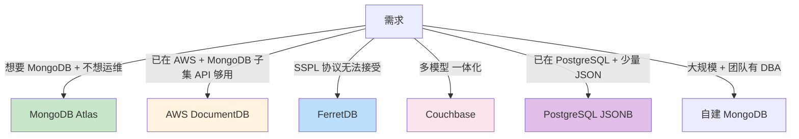
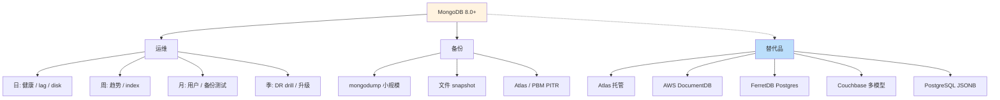

# 精通 MongoDB 生产运维 + 现代替代品：Atlas、Ops Manager、FerretDB、DocumentDB

> 关联章节：[M03 WiredTiger](./03-精通-WiredTiger.md)、[M05 副本集](./05-精通-副本集.md)、[M06 分片集群](./06-精通-分片集群.md)

---

## 引言：把 MongoDB 真正跑到生产

前 11 章覆盖了 MongoDB 的"是什么 / 怎么用 / 怎么调"。这章收官：

1. **生产运维**：日常巡检、容量规划、备份、升级、扩缩容
2. **替代品评估**：MongoDB Atlas（托管）、AWS DocumentDB、FerretDB、Couchbase 在什么场景胜过自建 MongoDB

读完本章你应能：

- 制定 MongoDB 集群的日常 / 月度 / 季度运维清单
- 设计可靠的备份恢复方案
- 滚动升级而不影响业务
- 评估 Atlas / DocumentDB / FerretDB 是否更适合你

---

## 第一章：日常巡检清单

### 1.1 每日（5 分钟）

```js
// 1. 副本集健康
rs.status()
// 看 members[].state，没有 DOWN / RECOVERING / ROLLBACK

// 2. 复制延迟
rs.printSecondaryReplicationInfo()
// 看 lag

// 3. 慢操作
db.currentOp({secs_running: {$gt: 60}})
// 没有长跑 op

// 4. 连接数
db.serverStatus().connections
// current 不接近 available

// 5. 磁盘
df -h
```

分片集群额外：

```js
sh.status()                  // chunk 分布
sh.isBalancerRunning()
```

### 1.2 每周

- disk 使用趋势 → 提前 30 天预测满
- working set vs cache 趋势
- index 使用率（$indexStats）
- 慢查询 top 10
- 副本集 lag P99
- 证书有效期
- oplog window

### 1.3 每月

- 用户 / 角色 review
- 删除冷数据 / 老索引
- 跑测试集群性能基线
- 关键 release notes 跟踪
- 备份恢复演练

### 1.4 每季度

- DR drill（杀掉一个节点 / 一个机房）
- 升级评估（小版本至少一次）
- 容量规划 review
- 安全审计

---

## 第二章：容量规划

### 2.1 三维度容量

| 维度 | 限制 |
|---|---|
| **磁盘** | 数据 + 索引 + oplog + journal |
| **内存** | working set 装得下 cache 吗 |
| **CPU/网络** | QPS 与连接数 |

### 2.2 磁盘估算

```
disk = data + indexSize × N + oplog + journal + free space buffer

例：100GB 数据，5 个索引（共 30GB），oplog 10GB，留 30% 空间
→ 单节点 ≈ (100 + 30 + 10) × 1.3 = 182GB
3 副本 → 每节点 182GB（不是 ×3，因为副本各存一份）
```

### 2.3 内存估算

```
RAM ≈ working set + index size + 5 GB overhead

例：working set 50GB + 索引 30GB → 至少 90GB RAM
cache 配 80GB（90 - 5 - 5）
```

`db.collection.totalIndexSize()` 看索引大小。

### 2.4 节点数

| 数据规模 | 推荐 |
|---|---|
| < 100GB | 3 节点副本集 |
| 100GB-1TB | 3 节点副本集（大机器） |
| 1-10TB | 副本集 vertical scale 或 2-3 shard |
| > 10TB | 多 shard 集群 |

### 2.5 性能监控

监控这些核心指标趋势：

```
db.serverStatus().opcounters
db.serverStatus().connections.current
db.serverStatus().wiredTiger.cache
db.serverStatus().mem
db.serverStatus().metrics.repl
```

---

## 第三章：备份与恢复

### 3.1 三类备份

| 方式 | 适合 |
|---|---|
| `mongodump`（逻辑） | 小集群 / 单 collection 导出 |
| 文件级 snapshot | 中大集群 / 整集群 |
| 持续 PITR（oplog） | 需要任意时间点恢复 |

### 3.2 mongodump

```bash
mongodump --uri="mongodb://localhost:27017" --out=/backup/$(date +%Y%m%d)

# 单 collection
mongodump --uri=... --db=mydb --collection=users --out=...
```

特点：

- 慢（大集合几小时）
- 逻辑格式（跨版本兼容好）
- 占目标 mongod 资源

恢复：

```bash
mongorestore --uri=... /backup/20260513
```

实战：

- 小集群 / 不超过 100GB 的备份
- 跨版本迁移（如 6.0 → 8.0）
- 单集合 export

### 3.3 文件级 snapshot

最常用的生产备份方式：

```bash
# 1. 在 secondary 上 lock
mongosh --eval 'db.fsyncLock()'

# 2. 文件 snapshot（LVM / ZFS / EBS snapshot）
ec2 create-snapshot ...

# 3. unlock
mongosh --eval 'db.fsyncUnlock()'
```

或者用专门工具：

- **Percona Backup for MongoDB**（开源）
- **MongoDB Ops Manager**（商业）
- **Atlas Backup**（托管）

### 3.4 PITR（Point-in-Time Recovery）

恢复到任意时间点：

```
全量 snapshot（每天）
+ oplog 增量（持续保存）
= 任意时间点恢复
```

实现：

- Percona Backup 或 Ops Manager 自动管理
- 自己实现：snapshot + `mongodump --oplog`

Atlas 内置 PITR，配置简单：

```
Backup Policy:
- Snapshot every 24h
- Oplog retention: 7d
```

### 3.5 备份测试

**没测试过的备份等于没备份**。每月做一次：

```
1. 从备份恢复到独立环境
2. 跑 smoke test（关键 query 都能跑）
3. 数据完整性校验
4. 记录恢复用时
```

### 3.6 备份策略示例

```
Primary backup:
- 每天 24:00 LVM snapshot 到 NAS
- oplog 持续 push 到 S3
- 保留：日 30 天，周 12 周，月 12 月

Secondary backup:
- Atlas / Ops Manager 持续 snapshot
- 跨 region 复制
- PITR 7 天
```

3-2-1 法则：**3 份副本、2 种介质、1 份异地**。

---

## 第四章：升级

### 4.1 升级路径

跨大版本（如 6.0 → 8.0）：

```
6.0 → 7.0 → 8.0   （不能跳级）
```

每步：

1. 测试集群升级 + 业务跑通
2. 生产滚动升级
3. 提升 `featureCompatibilityVersion`

### 4.2 滚动升级流程

```
1. 在测试集群完整验证
2. 备份生产
3. 升级 secondaries 一个一个
   - stop mongod
   - 升级 binary
   - start mongod
   - 等 SECONDARY 状态 + 0 lag
4. stepDown primary 让 secondary 接管
5. 升级原 primary
6. 提升 featureCompatibilityVersion
   db.adminCommand({setFeatureCompatibilityVersion: "8.0"})
```

业务侧 retryWrites 保护，整个过程基本无感。

### 4.3 分片集群升级顺序

```
1. config servers（一个一个）
2. shards（一个一个，每 shard 内部滚动）
3. mongos
4. 提升 fCV
```

### 4.4 回滚

升级期间发现问题：

- 还没切 primary：直接降回 binary
- 已经切 primary 但未提 fCV：还能降版本（数据兼容）
- 已经提 fCV：**不能简单降级**，可能要数据迁移

所以：**fCV 升级要在业务验证 1-2 周后再做**。

---

## 第五章：扩缩容

### 5.1 副本集加节点

```js
rs.add({ host: "host4:27017" })
// 新节点 STARTUP2 → RECOVERING → SECONDARY
```

initial sync 时间 = 数据量 / 网络带宽。

### 5.2 副本集加 priority 0 节点

```js
rs.add({host:"host5:27017", priority:0, hidden:true, votes:0})
// 永不当选 primary、不接业务读
```

适合：

- 备份专用
- 报表分析
- 跨 region DR

### 5.3 副本集减节点

```js
rs.remove("host4:27017")
```

确认其他节点能承载流量再做。

### 5.4 加 shard

```js
sh.addShard("sh4/host10:27018,host11:27018,host12:27018")
```

balancer 自动迁移 chunk。慢（几小时到几天）。

### 5.5 减 shard

更复杂：

```js
// 1. 移走该 shard 上的所有 chunk
db.adminCommand({ removeShard: "sh3" })
// 输出包含进度 / 剩余 chunks

// 2. 重复直到完成
// 3. 实际移除
```

代价巨大（数据迁移）。慎用。

### 5.6 Atlas 自动 scale

Atlas 提供：

- Auto-scale storage（磁盘自动加）
- Auto-scale tier（节点规格自动升）
- 但不自动 sharding（手动决定）

适合：流量波动大、不想 24/7 守集群。

---

## 第六章：监控

### 6.1 关键指标

```
# 集群健康
rs.status()
db.serverStatus().repl
db.serverStatus().opcountersRepl

# WiredTiger
db.serverStatus().wiredTiger.cache
db.serverStatus().wiredTiger.transaction

# 操作 & 延迟
db.serverStatus().opcounters
db.serverStatus().opLatencies

# 连接
db.serverStatus().connections

# 内存
db.serverStatus().mem
db.serverStatus().tcmalloc
```

### 6.2 告警

| 指标 | 阈值 |
|---|---|
| replication lag | > 10s |
| disk used | > 80% |
| connections.current | > 80% available |
| cache used | > 95% |
| modified pages evicted | 突增 |
| opLatencies P99 | 业务 baseline × 3 |
| election count | > 0 / day |
| node down | 任何持续 |

### 6.3 工具栈

| 工具 | 用途 |
|---|---|
| **MongoDB Atlas / Ops Manager** | 商业一站式 |
| **Percona PMM** | 开源 DBA 全栈 |
| **Prometheus + mongodb_exporter + Grafana** | 通用监控 |
| **Datadog** | SaaS |
| **MongoDB Compass** | GUI 调试 |
| **mongostat / mongotop** | CLI 速查 |

### 6.4 必看的几个 dashboard

- 操作 QPS（insert/query/update/delete）
- 延迟 P50/P95/P99
- replication lag
- cache used / cache miss rate
- disk used
- connection count
- election history
- slow query 数量

---

## 第七章：常见故障应急

### 7.1 节点挂

```
1. 看 monitoring 看哪个节点挂
2. ssh 上去看 mongod 日志、磁盘、网络
3. 副本集 secondary：耐心等自动 failover
4. primary 挂：等 10-30 秒自动选新 primary
5. 不能起：从备份恢复 / 用其他 secondary
```

### 7.2 写入慢

```
1. mongostat 看 dirty / used
2. db.currentOp() 看长 op
3. profiler 找慢 op
4. explain 确认索引
5. 实在不行加资源 / 业务限流
```

### 7.3 磁盘告急

```
1. 紧急：删非关键 collection / 关 retention 短期
2. df -h / du -sh 找占大头的 collection
3. 删冷数据
4. 加盘
5. 长期：上 tiered storage / 分片
```

### 7.4 业务大面积报错

```
1. 看 connection 数量是否爆
2. 看 election 是否在跑
3. 看是否多节点同时挂
4. 看是否 disk 满触发只读
5. 紧急切到备用集群（如果有 DR）
```

### 7.5 数据损坏（罕见）

```
1. 立即停 mongod
2. 用 --repair（漫长）
3. 或从最近备份恢复
4. 真无法恢复：用 --noprealloc 启动跳过坏文件
```

---

## 第八章：自建 vs 托管

### 8.1 自建 MongoDB

优点：

- 完全控制
- 成本可控（大规模）
- 数据不出公司

缺点：

- 24/7 运维
- 安全 / 备份 / 升级要自己做
- 经验门槛高

适合：

- 团队有 DBA / SRE
- 数据合规要求严
- 极大规模（节省托管溢价）

### 8.2 MongoDB Atlas

官方托管：

- 自动备份 + PITR
- 一键 sharding / scale
- 内置安全（TLS / FLE / Vault）
- 多云（AWS / GCP / Azure）
- Atlas Search（基于 Lucene 的全文）
- 内置 vector search

价格：相比自建溢价 2-5×。

适合：

- 团队没 DBA
- 业务规模中等
- 不想自管基础设施

### 8.3 Ops Manager（私有云版）

类似 Atlas 但部署在自家机房：

- UI 化部署 / 监控
- 自动备份 + PITR
- 升级管理
- 但你提供硬件

价格：商业 license。

适合：

- 合规要求私网部署
- 大型企业内部 DBaaS

---

## 第九章：替代品

### 9.1 AWS DocumentDB

AWS 的"兼容 MongoDB API"服务：

- Wire protocol 兼容（应用代码不改）
- 但**底层不是 MongoDB 代码**（AWS 自研引擎，基于 Aurora 分布式存储；社区一般认为计算层基于 PostgreSQL，但 AWS 未官方确认）
- 当前（2026）最新为 DocumentDB 8.0，兼容 MongoDB 6.0/7.0/8.0 API 驱动；此外仍保留 3.6/4.0/5.0 版本

优势：

- AWS 原生集成、托管
- 自动 backup / PITR
- 与 RDS 类似的运维体验
- 价格中等

劣势：

- 部分 API 不支持（如某些聚合 stage、Change Streams 限制）
- 性能在某些场景不如 MongoDB
- 不是真 MongoDB（出问题没有 MongoDB 社区帮你）

适合：

- 已经全 AWS
- 应用用 MongoDB 子集 API
- 不需要最新版 MongoDB 特性

### 9.2 FerretDB

完全开源的 MongoDB 替代品：

- Wire protocol 兼容
- 底层基于 **PostgreSQL**（2.0 起使用 Microsoft 开源的 DocumentDB PostgreSQL 扩展）；旧的 SQLite 等多后端仅存在于 1.x
- Apache 2.0 协议（避开 MongoDB SSPL）

优势：

- 真开源（SSPL 不友好的场景）
- 利用 PostgreSQL 成熟生态
- 部署灵活

劣势：

- 性能比 MongoDB 差（PostgreSQL 在文档场景不如 WiredTiger）
- 功能不全（部分聚合、地理 / 文本索引）
- 社区相对年轻

适合：

- SSPL 协议无法接受
- 想统一 PostgreSQL 栈
- 中小规模

### 9.3 Couchbase

多模型数据库：

- 文档（类似 MongoDB）
- KV
- 全文检索（内置）
- SQL 查询（N1QL）

优势：

- 一体化（不需要额外 ES / Redis）
- 自带 SQL（N1QL 比聚合管道易读）
- 写性能强

劣势：

- 生态小于 MongoDB
- 学习曲线
- 商业版价格

适合：

- 多模型需求强
- 团队懂 SQL
- 想避免多组件运维

### 9.4 PostgreSQL JSONB

不是替代品但常被对比：

- JSONB 字段类型 + GIN 索引
- 关系 + 文档混合
- 强 SQL + 事务

优势：

- 真开源 / 成熟
- 关系 + 文档一起
- 事务比 MongoDB 强

劣势：

- 不是为文档优化（性能不如 MongoDB）
- 分片需要 Citus / pg_dx 等扩展

适合：

- 已经在用 PostgreSQL
- 需要少量文档字段
- 强事务要求

### 9.5 选型决策



---

## 第十章：成本

### 10.1 自建估算

3 节点副本集，每节点 32 vCPU / 128GB RAM / 1TB NVMe：

- 云 VM：约 $1500/月 × 3 = $4500
- + 备份存储 + 网络 = $5000-7000/月

加上人力（0.5 DBA × 5w/年 = ~$20k/年）总成本约 $7-10k/月。

### 10.2 Atlas

同规模 Atlas M50（约同配置）：

- 约 $2500-3500/节点/月 × 3 = $7500-10500/月
- 含备份 + 监控 + 升级 + 24/7 支持
- 不需要 DBA

对比：

- 自建 + 已有 DBA → 自建省
- 没有 DBA → Atlas 省（DBA 招聘 + 运维成本高）

### 10.3 DocumentDB

中等。AWS 的"近成本"。

---

## 第十一章：常见故障案例（综合）

### 11.1 案例：周一磁盘满

**症状**：周一早上业务全报"write failed"。

**根因**：

- 周末跑了一个 batch job 灌大量数据
- 没及时清老索引
- 磁盘 95% 触发 mongod 拒绝写

**修复**：

- 紧急删过期 collection
- 加 monitor 阈值 80% 告警
- 上线 TTL / ILM 自动清

### 11.2 案例：升级到 8.0 后查询全慢

**症状**：升级后 P99 飙 5×。

**根因**：

- 没升 featureCompatibilityVersion
- 优化器某些行为依赖 fCV
- 部分新索引类型用不上

**修复**：

```js
db.adminCommand({setFeatureCompatibilityVersion: "8.0"})
```

预防：升级流程必须包含提 fCV。

### 11.3 案例：副本集脑裂

**症状**：双 primary 同时接受写入。

**根因**：

- 网络分区
- arbiter 配置错（PSA 拓扑）
- electionTimeoutMillis 过小

**修复**：

- 立即切其中一个为 secondary
- 比较 oplog，决定哪边是权威
- 把 rollback 数据合并到主线

预防：用 PSS 拓扑，不用 PSA。

### 11.4 案例：跨 region 复制延迟 1 小时

**症状**：DR region 的 secondary lag 持续 1 小时。

**根因**：

- 跨 region 带宽小
- 业务突发写入超过链路上限

**修复**：

- 升级跨 region 链路
- 调整业务 batch size
- 接受 DR 的 RPO 1 小时

### 11.5 案例：被勒索

**症状**：MongoDB 所有 collection 被清空，留勒索消息。

**根因**：

- 公网暴露
- 没开 auth

**修复**：

- 立刻下线公网
- 从备份恢复
- 上 auth + TLS + 私网
- 报警 + 客户通知

---

## 第十二章：运维工具箱

### 12.1 必装

| 工具 | 用途 |
|---|---|
| `mongosh`（自带） | 基础 shell |
| `mongostat` / `mongotop` | 实时监控 |
| `mongodump` / `mongorestore` | 备份恢复 |
| Prometheus + mongodb_exporter | 监控 |
| Grafana | 看板 |
| Percona PMM | 综合 DBA 工具 |
| MongoDB Compass | GUI |
| Studio 3T | 商业 GUI（功能强） |

### 12.2 自动化脚本

每个团队都该有：

- 健康检查脚本（一键看集群状态）
- 备份脚本（定时 + 校验）
- 升级 playbook（标准化）
- DR 演练脚本

### 12.3 文档

- runbook：常见故障应急
- 配置 inventory：每集群参数 / 用户
- 监控告警注解：告警出来该看什么

---

## 第十三章：未来展望

### 13.1 MongoDB 路线（2026+）

- **Vector Search** 持续完善（与 LLM 生态集成）
- **Time Series Collections** 优化
- **Queryable Encryption** 支持更多 query 类型（range 已在 8.0 GA；prefix/suffix/substring 部分匹配仍在 8.2 public preview，未来完善）
- **Atlas 多云** 进一步开放
- **更轻量 deployment**（容器化 / serverless）

### 13.2 文档数据库生态

- **向量数据库崛起**（Qdrant、Weaviate、Pinecone）—— MongoDB 加 vector 反击
- **PostgreSQL 多模型化**（pgvector、JSONB 完善）—— 竞争压力
- **Serverless 数据库**（Cosmos / Atlas Serverless）

### 13.3 替代品

- **WarpStream-like 对象存储原生 DB**：Turso、Neon 等的演化
- **多模型一体化**：Couchbase、SurrealDB
- **真开源回流**：FerretDB 等 OS 替代 SSPL

---

## 总结 · 运维与替代品一图



运维心法：

1. **可观测性优先** —— 没监控就没运维
2. **3-2-1 备份** + 定期测试恢复
3. **自动化 > 英雄主义** —— 脚本 + 工具
4. **滚动升级 + retryWrites** —— 业务无感
5. **DR 演练** —— 不练就是没有
6. **替代品有用但不要盲跟** —— 自建仍是主流

---

## 练习题

1. 日常巡检 5 个核心指标？
2. 3-2-1 备份法则的含义？
3. mongodump 与文件 snapshot 适用场景？
4. PITR 怎么实现？需要什么前提？
5. 副本集滚动升级的顺序？
6. featureCompatibilityVersion 是什么？什么时候提？
7. Atlas vs 自建的取舍？
8. AWS DocumentDB 与 MongoDB 的关键差异？
9. FerretDB 的核心优势？
10. 数据库被勒索的 3 个根因？

> 答案见 [QUIZ.md](./QUIZ.md)

---

> 🔁 反馈：每季度跑一次 DR drill，杀掉一个节点看 failover 与恢复
