# MongoDB 路线图 · Mermaid 可视化

> 配合 [INDEX.md](./INDEX.md) 与 [QUIZ.md](./QUIZ.md) 使用
>
> **📅 内容基准：MongoDB 8.0 LTS + 9.x**（2026-05 时主流稳定版）

---

## 🗺️ 全景路线图

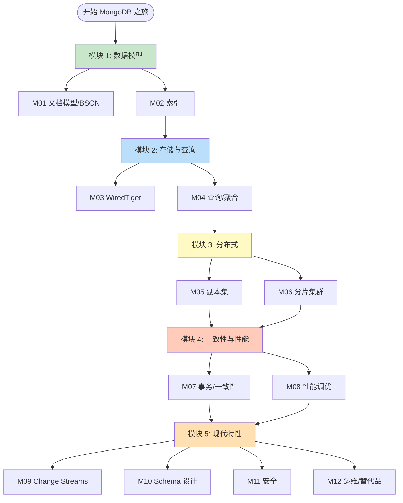

---

## 🔑 一次 find 请求的物理路径

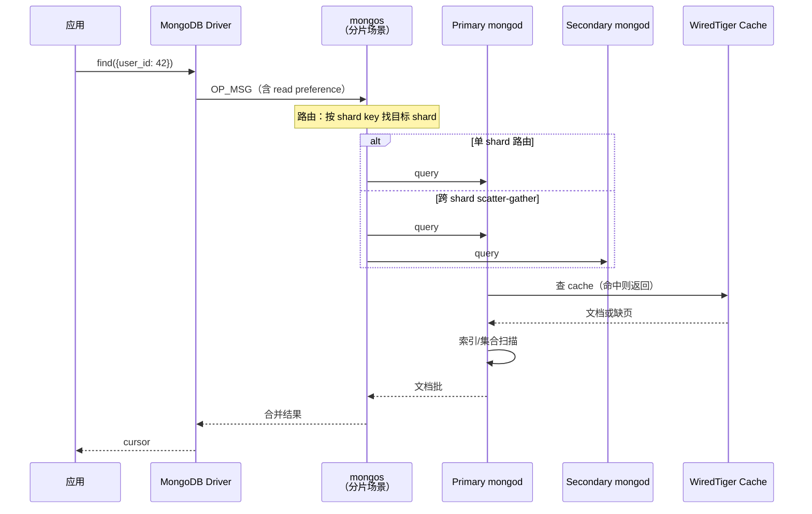

**关键观察**：默认走 **primary**。read preference 选 `secondary` / `nearest` 可分流，但要权衡新鲜度。

---

## 🌲 索引结构

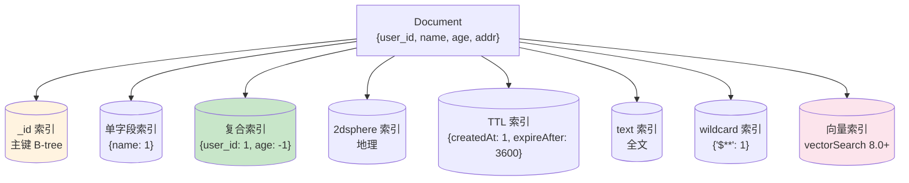

> ESR 规则：复合索引字段顺序 **Equality → Sort → Range** 是最优。

---

## 📦 WiredTiger 存储栈

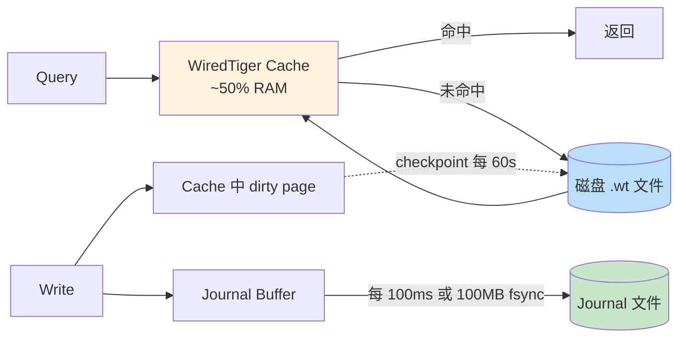

- **Journal**：WAL，崩溃恢复
- **Checkpoint**：默认 60 秒一次，把 dirty page 刷盘
- **Cache**：默认 (RAM - 1GB) × 50%，是性能关键

---

## 🏗️ 副本集拓扑

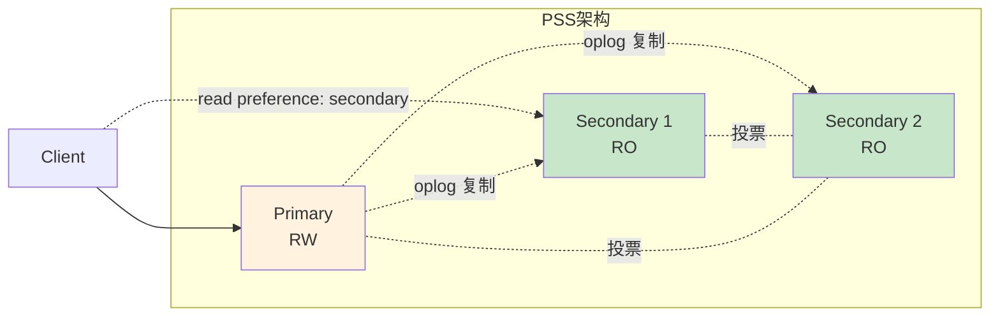

**最小生产**：3 节点 PSS（Primary + 2 Secondary）。

不要用 PSA（2 数据 + 1 Arbiter）—— Arbiter 不存数据，failover 时数据节点只剩 1 个 → 没法形成 quorum 保证安全写入。

---

## 🔪 分片集群拓扑

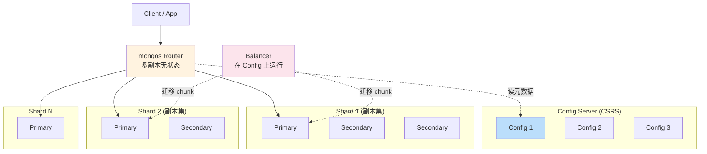

---

## 🎯 Shard Key 决策

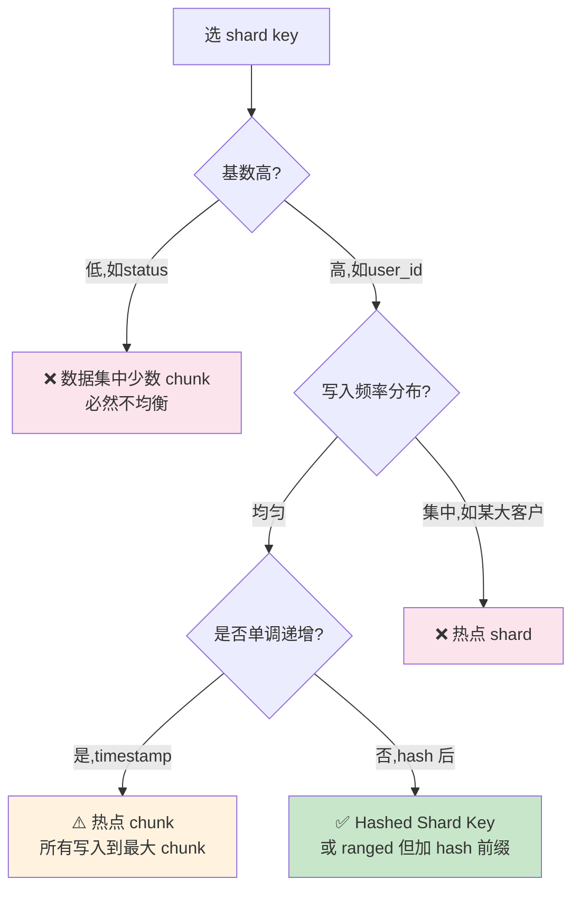

> 三原则：**基数 + 频率 + 单调性**。最容易踩坑的是单调递增 key（timestamp、ObjectId 前 4 字节是时间）。

---

## 🛡️ 一致性矩阵

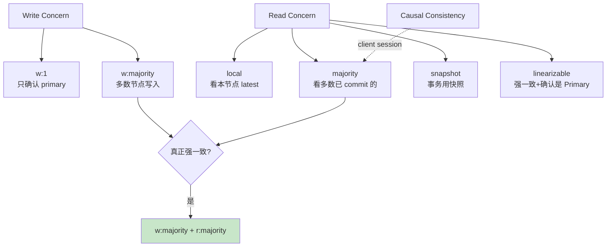

---

## 🆚 MongoDB vs 替代品

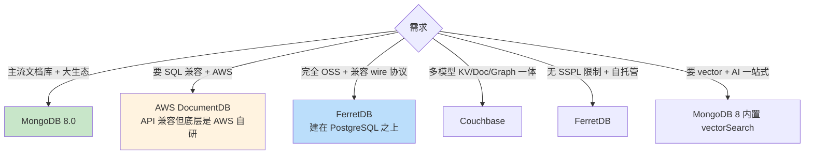

---

## 📈 MongoDB 关键版本时间线

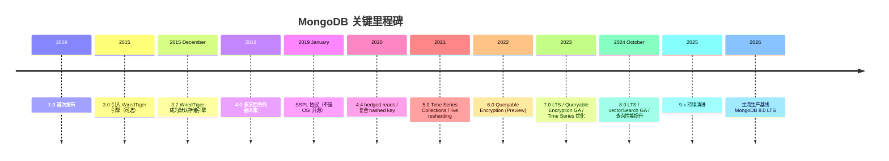

---

## 🚀 性能分层决策

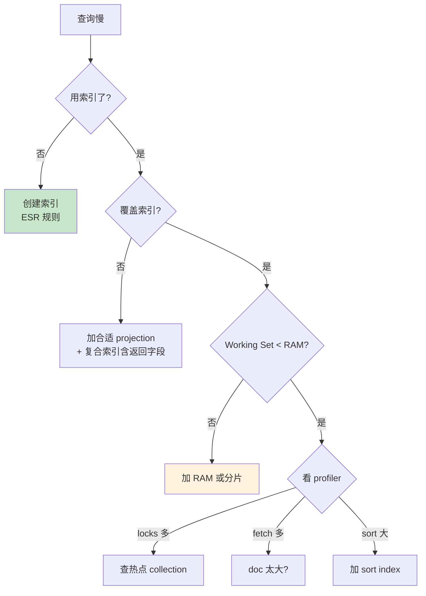

---

