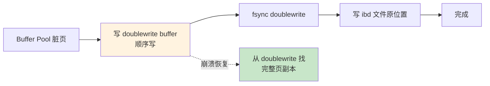
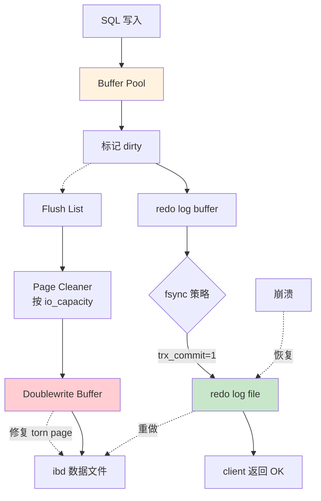

# 精通 InnoDB 参数调优与 Buffer Pool：从内存模型到 redo log

> 关联章节：[M02 索引](./02-精通-InnoDB-索引.md)、[M03 事务](./03-精通-InnoDB-事务-MVCC.md)、[M07 Performance Schema](./07-精通-Performance-Schema.md)

---

## 引言：Buffer Pool 是 InnoDB 的灵魂

很多人把 MySQL 的内存调优简化成一句话——"`innodb_buffer_pool_size` 设到内存的 70%"。这句话对，但只对了 30%。

- 你设了 64 GB Buffer Pool，但实例数只有 1，多核 CPU 在 LRU 链表锁上排队
- 你担心 OOM，把 dirty pages 上限设到 25%，结果 checkpoint 风暴让 P99 抖动
- 你听说 `innodb_flush_method=O_DIRECT` 更快，但用的是云盘，结果反而更慢
- 8.0.30 之后 `innodb_log_file_size` 被 `innodb_redo_log_capacity` 替代，你还在用旧参数手册

Buffer Pool 是 InnoDB **唯一**的数据缓存层。所有的读、所有的写、所有的事务，都先经过它。读懂它，调优 MySQL 就成功了一半。

读完这章你应该能：

- 画出 Buffer Pool 内部的 LRU / Flush List / Free List 三链表协作
- 解释 young / old 子链表如何抵抗全表扫描污染
- 区分 `innodb_io_capacity` / `innodb_io_capacity_max` / `innodb_flush_neighbors` 各自影响什么
- 说出 doublewrite buffer / change buffer / AHI 的用处与代价
- 给一个生产实例选合理的 `redo_log_capacity` 与 `buffer_pool_size`
- 通过 SHOW ENGINE INNODB STATUS 读出当前压力点

---

## 第一章：Buffer Pool 内部结构

### 1.1 一句话定义

Buffer Pool 是 InnoDB 用来**缓存数据页（16KB）和索引页**的内存区域。

```
磁盘文件（ibd）   ←→   Buffer Pool（内存）   ←→   SQL 执行器
   一份数据                     最多一份缓存
```

读：先查 Buffer Pool，命中直接返回；不命中从磁盘加载。
写：先改 Buffer Pool（标记 dirty），异步刷盘。

### 1.2 三大链表

Buffer Pool 用三个链表管理所有 16KB 页：


- **Free List**：尚未使用的页（启动时全在这里）
- **LRU List**：被读入过的所有页（包括 clean 和 dirty）
- **Flush List**：所有脏页，按**最早修改的 LSN 升序**排列（用于 checkpoint）

一个脏页同时挂在 LRU 和 Flush 两个链表上。

### 1.3 改良版 LRU：young / old 子链表

朴素 LRU 有个致命缺陷——**一次全表扫描就能把热点数据全部淘汰**（缓存污染）。

InnoDB 把 LRU 分成两半：

```
            头部                                   尾部
LRU: [ young 区 (5/8) ] - midpoint - [ old 区 (3/8) ]
       热点数据                          新进入的页
```

- 新读入的页先放在 **midpoint**（old 区头部），而不是 LRU 头部
- 如果 `innodb_old_blocks_time`（默认 1000ms）内再次被访问，才晋升到 young 区
- young 区内部访问也不会立刻挪到头部，避免锁竞争（约 1/4 头部就不挪了）

效果：

- 全表扫描的页只占据 old 区，扫完很快被淘汰
- 真正热点数据稳稳坐在 young 区

```sql
-- 看 old 区占比
SHOW VARIABLES LIKE 'innodb_old_blocks_pct';
-- 默认 37（即 37%），可调 5-95

-- 看晋升等待时间
SHOW VARIABLES LIKE 'innodb_old_blocks_time';
-- 默认 1000（毫秒）
```

### 1.4 Buffer Pool 多实例

单个 Buffer Pool 内部加锁保护 LRU/Free/Flush 链表。在多核高并发下，这把锁会成为瓶颈。

```sql
SHOW VARIABLES LIKE 'innodb_buffer_pool_instances';
-- buffer_pool_size ≤ 1GiB 时默认 1；> 1GiB 时默认按 min(buffer pool hint, CPU hint) 动态计算（范围 1–64）
```

数据按 `hash(space_id, page_no) % instances` 分到不同实例，每个实例独立加锁。

经验：

- `buffer_pool_size < 1GB`：实例数固定为 1（小内存分多了反而碎）
- 1GB ≤ size < 8GB：4 实例
- 8GB ≤ size < 64GB：8 实例
- size ≥ 64GB：16 实例

每个实例 ≥ 1GB 才有意义。

### 1.5 Buffer Pool Chunk

8.0 起 Buffer Pool 由若干 **chunk** 组成，支持**在线调整 buffer_pool_size**：

```sql
SHOW VARIABLES LIKE 'innodb_buffer_pool_chunk_size';
-- 默认 128MB

-- 在线调整
SET GLOBAL innodb_buffer_pool_size = 8 * 1024 * 1024 * 1024;  -- 8GB
```

公式：
```
buffer_pool_size = chunk_size × instances × N
```

如果设的 size 不是 `chunk × instances` 的整数倍，会自动向上取整。

---

## 第二章：核心参数 —— innodb_buffer_pool_size

### 2.1 设多大

经验值：

| 实例用途 | 推荐 Buffer Pool 占物理内存 |
|---|---|
| 专用 MySQL 服务器 | 60-80% |
| 与其他服务共存 | 30-50% |
| 容器化（cgroup 限制） | 容器 limit 的 50-70% |

注意：

- **不要直接 80%**——还要留给 InnoDB 元数据、连接、binlog cache、tmp 表
- 监控 `Innodb_buffer_pool_pages_free`：长期接近 0 = 内存不够
- 监控 `Innodb_buffer_pool_reads / Innodb_buffer_pool_read_requests`：命中率应 > 99%

### 2.2 命中率计算

```sql
SHOW STATUS LIKE 'Innodb_buffer_pool_read%';
-- Innodb_buffer_pool_read_requests = 逻辑读次数
-- Innodb_buffer_pool_reads         = 物理读次数（缓存未命中）

-- 命中率 = 1 - Innodb_buffer_pool_reads / Innodb_buffer_pool_read_requests
```

健康基线：

- OLTP：> 99.9%
- OLAP：> 95%（大表全扫不可避免）
- 灾难线：< 90% → Buffer Pool 严重不足

### 2.3 在线扩容

```sql
-- 从 4GB 扩到 16GB
SET GLOBAL innodb_buffer_pool_size = 16 * 1024 * 1024 * 1024;

-- 看进度
SHOW STATUS LIKE 'Innodb_buffer_pool_resize_status';
```

扩容会触发数据迁移（chunk 重排），高峰期最好不做。

### 2.4 NUMA 陷阱

多 socket 服务器上，Buffer Pool 可能跨 NUMA 节点，访问跨节点内存延迟翻倍。

```bash
numactl --hardware  # 看 NUMA 拓扑
numactl --interleave=all mysqld ...  # 内存平均分到所有节点
```

或者在 my.cnf：

```ini
[mysqld_safe]
innodb_numa_interleave = ON
```

---

## 第三章：Redo Log —— 持久化的关键

### 3.1 WAL 协议

InnoDB 用 **Write-Ahead Logging**——修改先写 redo log，数据页可以稍后再刷。

```
事务提交
   ↓
1. 写 undo log（用于回滚 / MVCC）
2. 改 Buffer Pool 数据页（dirty）
3. 写 redo log buffer
4. fsync redo log file  ← 持久化点（崩溃恢复靠它）
5. 返回 client OK
   ↓
（异步）刷脏页到 ibd 文件
```

只要 redo log 落盘，崩溃后能完整恢复——数据页晚刷无所谓。

### 3.2 redo log 文件结构

8.0.30 **之前**：

```ini
innodb_log_file_size = 1G       # 单个文件大小
innodb_log_files_in_group = 2   # 文件个数（默认 2）
# 总容量 = file_size × files_in_group
```

8.0.30 **之后**（推荐）：

```ini
innodb_redo_log_capacity = 2G   # 总容量，自动切分多个文件
```

新参数的好处：

- 在线调整不需要重启
- 自动按需创建 32 个 `#innodb_redo/#ib_redo*` 文件
- 旧参数被忽略

### 3.3 设多大

redo log 太小：

- frequent checkpoint → 频繁刷脏 → IO 抖动
- 长事务可能直接报 `log writes are too far ahead of the checkpoint`

redo log 太大：

- 崩溃恢复时间长（重做日志多）
- 占磁盘空间

经验：

| 场景 | redo_log_capacity |
|---|---|
| 小流量 OLTP | 1-2GB |
| 中等 OLTP | 4-8GB |
| 重写入 OLTP | 16-32GB |
| 极端写入 / 8.0.30+ | 32GB+ |

监控：

```sql
SHOW ENGINE INNODB STATUS\G
-- 看 LOG 段
-- Log sequence number     2000000
-- Log flushed up to       1900000
-- Last checkpoint at      1500000
-- (LSN - checkpoint) 应小于 redo log 总容量的 75%
```

### 3.4 innodb_flush_log_at_trx_commit

控制 redo log 刷盘时机：

| 值 | 含义 | 数据安全 | 性能 |
|---|---|---|---|
| 0 | 每秒 fsync 一次 | 崩溃丢 1 秒数据 | 最快 |
| 1 | 每次 commit fsync | 不丢数据 | 最慢（默认） |
| 2 | commit 写 OS cache，每秒 fsync | OS 崩才丢 | 中等 |

ACID 严格要求 → 1。日志类容忍丢 1 秒 → 2 是性能甜点。

---

## 第四章：脏页刷新策略

### 4.1 何时刷脏

InnoDB 在四个时机刷脏页：

1. **checkpoint**：redo log 接近写满时强制刷脏（最被动）
2. **LRU 淘汰**：尾部页是脏页时必须先刷再淘汰
3. **后台 page cleaner**：每秒按 io_capacity 刷一批
4. **shutdown**：`innodb_fast_shutdown=0` 时全量刷

### 4.2 innodb_io_capacity / io_capacity_max

```ini
innodb_io_capacity = 2000       # 后台正常刷脏速率（IOPS）
innodb_io_capacity_max = 4000   # 紧急情况上限
```

参数意义：

- 不是硬限制——InnoDB 根据脏页数、redo 落后程度，**在 capacity 和 capacity_max 之间动态决定**
- 默认 200 / 2000（HDD 时代遗留）

经验：

| 存储类型 | io_capacity / max |
|---|---|
| SATA HDD | 200 / 400 |
| SATA SSD | 2000 / 4000 |
| NVMe SSD | 5000 / 20000 |
| 云盘（一般） | 2000 / 4000 |
| 云盘（高 IO） | 8000 / 16000 |

设太低：脏页堆积，checkpoint 风暴。
设太高：后台 IO 抢占前台 SQL 的 IO。

实际值用 `fio` 或 `sysbench fileio` 测出的可持续写 IOPS 的 50-70%。

### 4.3 innodb_max_dirty_pages_pct

```ini
innodb_max_dirty_pages_pct = 90      # 脏页占比上限（8.0+ 默认 90，5.7 为 75）
innodb_max_dirty_pages_pct_lwm = 10  # 加速刷脏的低水位（8.0+）
```

当脏页占比 > `lwm` 时，刷脏速率开始指数级上升。
当 > `max_dirty_pages_pct` 时，几乎用满 `io_capacity_max`。

写多的实例可适当调低 `lwm`（如 10），让刷脏更平滑。

### 4.4 innodb_flush_neighbors

```ini
innodb_flush_neighbors = 0   # 默认 0（8.0+）
```

刷一个脏页时，是否顺带刷它相邻的脏页（HDD 时代为了顺序写优化）：

- 0：只刷目标页（SSD 推荐）
- 1：刷同 extent 内连续脏页
- 2：刷同 extent 内所有脏页

SSD 时代设 0——随机写没有连续顺序写的优势，反而可能多刷不必要的页。

### 4.5 innodb_flush_method

```ini
innodb_flush_method = O_DIRECT
```

可选值：

| 值 | 数据文件 | 日志文件 | 说明 |
|---|---|---|---|
| fsync | 经 OS cache | 经 OS cache | 默认 |
| O_DIRECT | 绕过 OS cache | 经 OS cache | 推荐（避免 double buffering） |
| O_DIRECT_NO_FSYNC | 同上 + 跳过 fsync | 同上 | 仅 XFS 安全 |
| O_DSYNC | 经 OS cache | sync 写日志 | 几乎不用 |

绝大多数现代 Linux + SSD 选 **O_DIRECT**：

- 数据文件不进 page cache，省一份内存
- 写盘直接走设备，延迟可控
- redo log 仍然经 OS cache（小且顺序，OS cache 帮助大）

云盘（如 AWS gp3、阿里云 ESSD）—— 测一下，有些云盘 O_DIRECT 性能不如默认 fsync（云盘后端已经聚合，绕过 OS cache 失去合并机会）。

---

## 第五章：Doublewrite Buffer —— 防止页撕裂

### 5.1 为什么需要

InnoDB 页 16KB，OS 文件系统块 4KB，磁盘扇区 512B 或 4KB。

写 16KB 到磁盘可能拆成多次 IO——**写到一半断电**会得到一个"半新半旧"的页（torn page）。

```
预期:  [新数据全部 16KB]
实际:  [新数据 8KB | 旧数据 8KB]  ← 灾难
```

redo log 是物理逻辑日志，**依赖一个"完整"的初始页**进行 apply。残缺页 → 恢复失败。

### 5.2 工作原理



每次刷脏页：

1. 先把页**顺序写到 doublewrite buffer 文件**（在系统表空间或独立文件）
2. fsync
3. 再写到 ibd 文件的原位置
4. 崩溃后，如果 ibd 里的页校验失败，从 doublewrite 拷贝过来

代价：双倍写入。但因为是顺序写（且整批一起 fsync），开销 < 5-10%。

### 5.3 关闭场景

```ini
innodb_doublewrite = OFF
```

什么时候可关：

- 文件系统支持原子写（如某些云盘、ZFS、NVMe 带 atomic write 特性）
- 测试环境
- 从库（崩了就重建）

**主库强烈不建议关闭**。

8.0.20 增强：可独立目录 `innodb_doublewrite_dir`，避免与数据文件争 IO。

---

## 第六章：Change Buffer —— 二级索引写优化

### 6.1 解决什么问题

向二级索引插入新值时，需要先把对应索引页从磁盘读上来才能改。**如果索引页不在 Buffer Pool**：

- 一次 INSERT → 一次随机读 + 一次随机写
- 大量索引 → 大量随机 IO

Change Buffer 把"对未读入页的修改"暂存起来，等真正需要读该页时一起 merge。

### 6.2 适用条件

只适用于**非唯一二级索引**：

- 唯一索引必须现场判重 → 必须立刻读页 → 用不了 Change Buffer
- 主键直接走聚簇索引 → 顺序写，本就高效

### 6.3 关键参数

```sql
SHOW VARIABLES LIKE 'innodb_change_buffer%';
-- innodb_change_buffer_max_size = 25  -- 占 Buffer Pool 最多 25%
-- innodb_change_buffering = all       -- 缓冲所有操作 (insert/delete/purge)
```

观察：

```sql
SHOW ENGINE INNODB STATUS\G
-- 找 INSERT BUFFER AND ADAPTIVE HASH INDEX 段
-- Ibuf: size 1, free list len 0, seg size 2
-- 0.00 hash searches/s, 0.00 non-hash searches/s
```

### 6.4 何时关闭

- SSD/NVMe 上随机读很快 → Change Buffer 收益变小
- 写少读多的实例 → 几乎用不上
- 主键 UUID 这种本身就乱序的场景 → 关掉反而更快

8.0 默认 `innodb_change_buffering = all` 还在，但许多 DBA 选择 `none` 关闭。

---

## 第七章：Adaptive Hash Index (AHI)

### 7.1 自适应？

InnoDB 监控某些**热点索引**的访问模式——如果某个 B+ 树节点频繁被访问，且模式相对固定，自动建一个**内存哈希索引**指向这些叶子页。

效果：B+ 树 O(log n) 查找 → 哈希 O(1)。

### 7.2 关键参数

```ini
innodb_adaptive_hash_index = ON       # 默认 ON
innodb_adaptive_hash_index_parts = 8  # 分区数，减少锁竞争
```

### 7.3 何时关掉

AHI 不是免费的：

- 占用 Buffer Pool 内存（约 5%）
- 自身有锁——高并发 OLTP 反而成瓶颈

观察：

```sql
SHOW ENGINE INNODB STATUS\G
-- 看 ROW OPERATIONS 段以及 SEMAPHORES 段
-- 如果 RW-shared spins 等大量出现在 btr0sea.c → AHI 锁是瓶颈
```

写多的 OLTP 实例，许多生产实践会**关闭 AHI**（`innodb_adaptive_hash_index = OFF`）。

Percona 早期就建议关闭，Oracle MySQL 默认仍 ON。

---

## 第八章：调优实战 —— SHOW ENGINE INNODB STATUS

### 8.1 完整输出分段

```
=====================================
INNODB MONITOR OUTPUT
=====================================

--- BACKGROUND THREAD
--- SEMAPHORES         ← 锁等待
--- LATEST DETECTED DEADLOCK   ← 最近一次死锁
--- TRANSACTIONS       ← 活跃事务
--- FILE I/O           ← IO 统计
--- INSERT BUFFER AND ADAPTIVE HASH INDEX
--- LOG                ← redo log 状态
--- BUFFER POOL AND MEMORY ← 内存使用
--- ROW OPERATIONS     ← 增删改查统计
```

### 8.2 关键指标

**BUFFER POOL**：

```
Buffer pool size      1048575
Free buffers          1024
Database pages        950000
Old database pages    350000
Modified db pages     20000     ← 脏页数
Buffer pool hit rate 999/1000   ← 命中率
```

- `Modified db pages / Database pages` 接近 `innodb_max_dirty_pages_pct` → 刷脏跟不上
- hit rate < 990 → Buffer Pool 不够

**LOG**：

```
Log sequence number          1000000000
Log flushed up to            999500000
Pages flushed up to          990000000
Last checkpoint at           980000000
```

`(LSN - checkpoint) / redo_log_capacity` > 75% → checkpoint 即将风暴。

**SEMAPHORES**：

```
OS WAIT ARRAY INFO: reservation count 1000
Mutex spin waits 5000, rounds 50000, OS waits 100
RW-shared spins 200, rounds 2000, OS waits 50
```

- spin waits 暴增 + 大量 OS waits → 锁竞争严重
- 高 spin 集中在 `btr0sea.c` → AHI 锁
- 集中在 `buf0buf.c` → Buffer Pool 锁，加 instances

### 8.3 实时监控

```sql
-- 8.0 起更友好的方式：information_schema 表
SELECT * FROM information_schema.innodb_buffer_pool_stats\G

-- Performance Schema 看 wait
SELECT event_name, count_star, sum_timer_wait/1e12 AS sec
FROM performance_schema.events_waits_summary_global_by_event_name
WHERE event_name LIKE 'wait/synch/%'
ORDER BY sum_timer_wait DESC LIMIT 10;
```

---

## 第九章：调优 checklist（生产模板）

### 9.1 通用 OLTP 推荐配置（8.0 / 8.4）

```ini
[mysqld]
# === Buffer Pool ===
innodb_buffer_pool_size = 32G           # 物理内存的 60-70%
innodb_buffer_pool_instances = 8        # ≥ 1GB / instance
innodb_buffer_pool_chunk_size = 128M
innodb_old_blocks_pct = 37
innodb_old_blocks_time = 1000

# === Redo Log（8.0.30+） ===
innodb_redo_log_capacity = 8G
innodb_flush_log_at_trx_commit = 1      # ACID 严格

# === Flush ===
innodb_io_capacity = 4000               # 按存储测出
innodb_io_capacity_max = 8000
innodb_flush_method = O_DIRECT
innodb_flush_neighbors = 0              # SSD
innodb_max_dirty_pages_pct = 90         # 8.0+ 默认 90（5.7 为 75）
innodb_max_dirty_pages_pct_lwm = 10

# === Doublewrite ===
innodb_doublewrite = ON                 # 主库必开
# innodb_doublewrite_dir = /data2/dblwr  # 独立目录

# === Change Buffer / AHI ===
innodb_change_buffering = all           # 视写负载，写少改为 none
innodb_adaptive_hash_index = ON         # 高并发写场景考虑 OFF
innodb_adaptive_hash_index_parts = 8

# === 其他 ===
sync_binlog = 1                         # 配合 trx_commit=1 实现"双 1"
innodb_thread_concurrency = 0           # 8.0 默认 0，让 InnoDB 自己管理
innodb_purge_threads = 4                # 大写入场景适当上调
```

### 9.2 写极重场景调整

- `innodb_redo_log_capacity = 32G`（避免 checkpoint 风暴）
- `innodb_io_capacity = 8000` / `max = 20000`（NVMe）
- `innodb_max_dirty_pages_pct_lwm = 5`（提前加速刷脏）

### 9.3 读极重场景调整

- `innodb_buffer_pool_size` 拉到内存 80%
- `innodb_change_buffering = none`
- `innodb_old_blocks_time = 0`（让读到的页快速进 young 区）

---

## 第十章：一次真实故障 —— Checkpoint 风暴

### 10.1 现象

某生产实例 P99 突然从 50ms 飙升到 5s，持续 30 秒后恢复，每 10 分钟周期性发生。

### 10.2 排查

```sql
SHOW ENGINE INNODB STATUS\G
```

LOG 段：

```
Log sequence number  500000000000
Last checkpoint at   499000000000  
```

差值 = 1GB，而 `innodb_log_files_in_group=2 × log_file_size=1G` = 2GB → 占 50%。

观察 P99 抖动时刻：

```
Pending flushes (fsync) log: 0; buffer pool: 50000
```

50000 个待刷脏页在排队——典型的**checkpoint 强制刷脏风暴**。

### 10.3 修复

1. `innodb_log_files_in_group=4`，`log_file_size=2G` → 总容量 8GB（旧参数）
   或升级到 8.0.30+ 直接 `innodb_redo_log_capacity=8G`
2. `innodb_io_capacity` 从 2000 调到 4000
3. `innodb_max_dirty_pages_pct_lwm = 10`，让刷脏更早开始平滑

P99 恢复到 50ms 以内，再无周期性抖动。

### 10.4 复盘

参数默认值（log file 1G × 2）针对的是 SATA HDD 年代——SSD 写入快得多，脏页堆积更快。**任何 SSD 上的 MySQL 都应该至少把 redo log 调到 4-8GB**。

---

## 第十一章：温启动 —— 重启不掉缓存

### 11.1 问题

MySQL 重启后 Buffer Pool 为空，需要"预热"几小时才达到稳态命中率——这段时间 P99 飙升。

### 11.2 8.0 默认开启

```ini
innodb_buffer_pool_dump_at_shutdown = ON
innodb_buffer_pool_load_at_startup = ON
innodb_buffer_pool_dump_pct = 25         # dump 多少比例的页号
```

关停时把当前 Buffer Pool 里的 `(space_id, page_no)` 列表 dump 到 `ib_buffer_pool` 文件。
启动后异步按这个列表把页读进来。

效果：5-10 分钟达到 dump 时的命中率（vs 朴素几小时）。

### 11.3 主动 dump / load

```sql
SET GLOBAL innodb_buffer_pool_dump_now = ON;
SET GLOBAL innodb_buffer_pool_load_now = ON;

-- 监控
SHOW STATUS LIKE 'Innodb_buffer_pool_dump_status';
SHOW STATUS LIKE 'Innodb_buffer_pool_load_status';
```

### 11.4 注意

- 只 dump 页号，不 dump 页内容，文件几 MB 级别
- 加载时如果某些页已被 DROP TABLE 删除，会被忽略
- 主从切换时，可以把主库的 buffer pool dump 复制到新主库加速预热

---

## 第十二章：内存监控大盘

### 12.1 关键 SQL

```sql
-- Buffer Pool 总览
SELECT 
  POOL_ID,
  POOL_SIZE,                          -- 页数
  FREE_BUFFERS,
  DATABASE_PAGES,
  MODIFIED_DATABASE_PAGES AS dirty_pages,
  ROUND(MODIFIED_DATABASE_PAGES * 100.0 / DATABASE_PAGES, 2) AS dirty_pct,
  HIT_RATE,                           -- /1000
  PAGES_MADE_YOUNG,
  PAGES_NOT_MADE_YOUNG
FROM information_schema.innodb_buffer_pool_stats;

-- 按表的内存占用
SELECT
  object_schema, object_name,
  COUNT(*) AS pages,
  ROUND(COUNT(*) * 16 / 1024, 2) AS size_mb
FROM information_schema.innodb_buffer_page
GROUP BY object_schema, object_name
ORDER BY pages DESC LIMIT 20;

-- 长事务（占用 undo / MVCC）
SELECT trx_id, trx_state, TIMESTAMPDIFF(SECOND, trx_started, NOW()) AS age_sec,
       trx_query
FROM information_schema.innodb_trx
WHERE TIMESTAMPDIFF(SECOND, trx_started, NOW()) > 60
ORDER BY age_sec DESC;
```

### 12.2 sys schema 速查

```sql
-- 内存使用 Top
SELECT * FROM sys.memory_global_by_current_bytes LIMIT 10;

-- 一句话内存大盘
SELECT * FROM sys.innodb_buffer_stats_by_schema;
```

---

## 第十三章：与 OS 协作

### 13.1 swappiness

MySQL 不希望 Buffer Pool 被换出到 swap：

```bash
sysctl -w vm.swappiness=1
# 或 0（但 0 在 OOM 时不允许 swap，可能直接 kill MySQL）
```

### 13.2 transparent huge pages

OLTP 上 THP 弊大于利（频繁的 split / compact 引起抖动）：

```bash
echo never > /sys/kernel/mm/transparent_hugepage/enabled
echo never > /sys/kernel/mm/transparent_hugepage/defrag
```

### 13.3 文件系统

- **XFS**：MySQL 上最常见。`mount -o noatime,nodiratime`
- **EXT4**：可以用。同样 noatime
- **避免**：NFS、网络文件系统（无原子 fsync 保证）

### 13.4 IO 调度器

```bash
# 看当前
cat /sys/block/nvme0n1/queue/scheduler
# 推荐：none（NVMe）/ mq-deadline（SSD）/ noop（虚机）
echo none > /sys/block/nvme0n1/queue/scheduler
```

---

## 第十四章：MySQL 9.x 在 Buffer Pool 上的进展

### 14.1 自适应刷脏（继续优化）

MySQL 9.x 持续改进 page cleaner 算法——更敏感地预判 checkpoint，提前刷脏更平滑。

### 14.2 Resource Group 与 Buffer Pool 隔离

8.0+ Resource Group 主要用于线程优先级。Buffer Pool 隔离仍然依赖**多实例**+ **分库分表**实现。

### 14.3 持久化 Buffer Pool（PMEM 路径）

部分 9.x 实验性支持 PMEM（持久化内存）做 redo log——故障恢复几乎瞬时，但需要专门硬件，生产应用尚少。

---

## 总结 · 一图流



InnoDB 的所有"调优"，其实是在这张图上**调每条箭头的速度**。看懂它，调参就有方向。

---

## 练习题

1. 你的实例 32GB 内存，专用 MySQL。Buffer Pool 应该设多大？为什么不是 80%？

2. `innodb_buffer_pool_instances = 16` 在 4GB Buffer Pool 下是否合理？解释原因。

3. SSD 上为什么 `innodb_flush_neighbors=0`？HDD 时代为什么默认 1？

4. 业务 P99 周期性抖动 30 秒，间隔 10 分钟。说出三种可能的原因和验证方法。

5. `innodb_flush_log_at_trx_commit=2` 与 `=1` 的区别。哪些场景能接受 2？

6. Change Buffer 为什么对唯一索引无效？

7. 一次 INSERT 涉及 1 个聚簇索引 + 3 个二级索引，写 4 个页。Buffer Pool 命中率 100% 的情况下，最少要写几次磁盘（不算 redo log）？

8. `innodb_redo_log_capacity` 设 16GB 的副作用是什么？崩溃恢复时间会发生什么？

9. `SHOW ENGINE INNODB STATUS` 看到 `RW-shared spins` 集中在 `btr0sea.c`，应该调什么参数？

10. 给一个写极重的 OLTP 实例（100k QPS，写占 60%）写一份 `[mysqld]` 配置模板。

---

> 📁 下一篇：[M09 精通 MySQL 高可用架构](./09-精通-MySQL-高可用.md)
