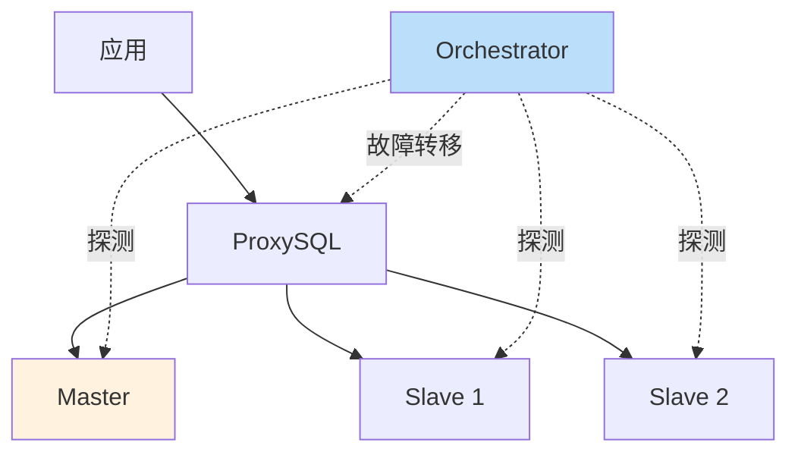
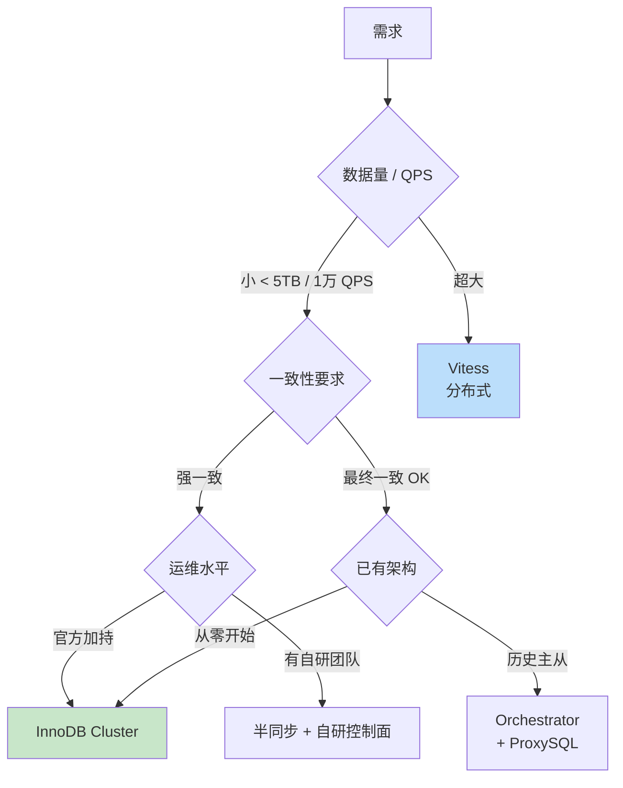

# 精通 MySQL 高可用架构：MGR、InnoDB Cluster 与故障转移

> 关联章节：[M05 Binlog 与复制](./05-精通-Binlog-与复制.md)、[M03 事务](./03-精通-InnoDB-事务-MVCC.md)

---

## 引言：高可用不是"加从库"

很多团队对 MySQL 高可用的理解停留在 "主从复制 + keepalived"。这套架构在 2010 年代是主流——但今天它有几个生产灾难级缺陷：

- **数据不一致**：异步复制下主库宕机，丢失最后几个事务
- **脑裂**：网络分区时双主同时写，恢复时需要人肉对账
- **切换抖动**：keepalived VIP 漂移延迟 + 应用连接池缓存，切换需 30s-2min
- **运维负担**：每次故障都要 DBA 介入

MySQL 8.0+ 给出了"官方认证"的方案：**Group Replication (MGR)** + **InnoDB Cluster** + **MySQL Router**。基于 Paxos 变种的多数派协议，实现自动故障转移与强一致。

读完这章你应该能：

- 区分异步复制、半同步、MGR 各自的一致性保证
- 画出 MGR 写事务的 Paxos 流程
- 部署一个 3 节点 InnoDB Cluster（单主模式）
- 解释为什么 MGR 推荐奇数节点（3 / 5 / 7）
- 用 MySQL Router 实现读写分离与故障转移
- 评估 ProxySQL / Orchestrator / Vitess 等第三方方案
- 设计跨机房 / 跨可用区的高可用拓扑

---

## 第一章：复制模式回顾

### 1.1 三种复制对比

| 模式 | 一致性 | 性能 | 故障时数据丢失 |
|---|---|---|---|
| 异步 | 最终 | 最好 | 可能丢失（默认） |
| 半同步 (rpl_semi_sync) | 至少一份从库收到 | 略降 | 取决于 ack 数 |
| MGR 同步 | 多数派 commit | 进一步降 | 不丢已提交事务 |

### 1.2 异步复制的两个陷阱

- **主从延迟**：主库 binlog 写完即返回，从库 IO/SQL 线程异步消费
- **数据丢失**：主库 crash 前未 dump 的 binlog 丢失（即使从库追上后也不知道有这部分）

### 1.3 半同步的局限

```sql
-- 5.7+ 半同步插件
INSTALL PLUGIN rpl_semi_sync_source SONAME 'semisync_source.so';
INSTALL PLUGIN rpl_semi_sync_replica SONAME 'semisync_replica.so';
SET GLOBAL rpl_semi_sync_source_enabled = 1;
SET GLOBAL rpl_semi_sync_source_timeout = 1000;  -- ms
```

半同步要求 master 收到至少 N 个 replica 的 ACK 后才返回 client OK。

但：

- **超时会降级为异步**——网络抖一下就回到异步，仍可能丢数据
- **不解决脑裂**——主库 crash 后，谁是新主？还得人工或第三方工具决定

→ 需要**多数派协议**这种"群体智慧"。

---

## 第二章：Group Replication (MGR) 原理

### 2.1 一句话定义

MGR 是 MySQL 内置的**基于多数派的同步复制方案**，所有节点组成一个 group，通过类 Paxos 协议保证：

- 任意写事务必须**多数派节点确认**才能提交
- 节点故障由 group 自动检测与处理
- **每个事务在所有节点上的顺序一致**（全序广播）

### 2.2 写事务流程

```mermaid
sequenceDiagram
    participant App
    participant Pri as Primary
    participant Sec1 as Secondary 1
    participant Sec2 as Secondary 2

    App->>Pri: BEGIN; UPDATE ...
    Note over Pri: 本地执行，产生 WriteSet
    Pri->>Pri: COMMIT 触发
    Pri->>Sec1: 广播 WriteSet (XCom Paxos)
    Pri->>Sec2: 广播 WriteSet
    Sec1-->>Pri: ACK
    Sec2-->>Pri: ACK (多数派达成)
    Note over Pri: certification（冲突检测）
    Pri-->>App: OK
    Sec1->>Sec1: 应用 WriteSet
    Sec2->>Sec2: 应用 WriteSet
```

关键点：

- **WriteSet** 包含被修改行的主键 hash（用于冲突检测）
- **多数派 ACK** 后即返回 client，但实际 apply 在 secondary 是异步的（每个 secondary 用 binlog apply 线程）
- **certification** 是 group 协议层的冲突检测：如果两个事务在不同节点同时改同一行，后到的会被回滚

### 2.3 单主 vs 多主模式

```sql
SET GLOBAL group_replication_single_primary_mode = ON;  -- 默认单主
```

- **单主模式**：只有一个 Primary 接受写，其他节点只读。故障时自动选举新 Primary。**生产推荐**
- **多主模式**：所有节点都可写。要求所有表必须有主键、不能用外键、不能用 `SERIALIZABLE` 隔离级别。冲突率高的场景性能差

99% 的生产部署是**单主模式**——它已经能解决高可用问题，多主只是噱头。

### 2.4 节点数为何推荐奇数

多数派 = `floor(n/2) + 1`：

| 节点数 | 多数派 | 容错能力 |
|---|---|---|
| 3 | 2 | 1 |
| 5 | 3 | 2 |
| 7 | 4 | 3 |
| 4 | 3 | 1（同 3 节点） |
| 6 | 4 | 2（同 5 节点） |

偶数节点没有额外的容错收益，只是多花钱。

最常见：**3 节点（容忍 1 故障）**或 **5 节点（容忍 2 故障）**。

### 2.5 故障检测

每个节点维护 group 视图（view）。如果某节点 5 秒（`group_replication_member_expel_timeout`）无响应：

1. 其他节点投票"标记 unreachable"
2. 多数派达成 → 该节点被驱逐出 group
3. 视图更新，写请求继续

如果是 **Primary 节点**故障：

1. 剩余节点选举新 Primary（按 `group_replication_member_weight` 权重 + UUID 大小）
2. 新 Primary 完成 binlog apply 后切换为可写
3. 整个过程 5-15 秒

### 2.6 网络分区

3 节点分裂为 1 + 2：

- 2 节点这边构成多数派，继续提供服务
- 1 节点这边成为少数派，**自动停止接受写**（避免脑裂）

5 节点分裂为 2 + 3：

- 3 节点这边多数派，继续服务
- 2 节点这边少数派，停止写

分裂为 1+1+3（罕见）：3 那边赢。

### 2.7 一致性级别

8.0+ 支持 `group_replication_consistency`：

| 值 | 含义 |
|---|---|
| EVENTUAL | 写完即返回，secondary 应用滞后（默认） |
| BEFORE_ON_PRIMARY_FAILOVER | failover 时等待 apply 完成再服务 |
| BEFORE | 读必须等本节点 apply 完所有已知事务 |
| AFTER | 写必须等所有节点 apply 完才返回 |
| BEFORE_AND_AFTER | 读写都强一致 |

`AFTER` 等价于完全同步，性能差，谨慎使用。

---

## 第三章：InnoDB Cluster 部署

### 3.1 三件套

InnoDB Cluster = **MGR** + **MySQL Shell** + **MySQL Router**

- MGR：底层一致性引擎
- MySQL Shell：管理工具（dba 模块）
- MySQL Router：客户端路由（读写分离 / 故障转移）

### 3.2 一行命令搭建

假设 3 台机器：`node1`, `node2`, `node3`，已装 MySQL 8.4：

```bash
# 在 node1 用 mysqlsh
$ mysqlsh root@node1:3306
```

```javascript
// 配置每个节点
dba.configureInstance('root@node1:3306')
dba.configureInstance('root@node2:3306')
dba.configureInstance('root@node3:3306')

// 在 node1 建集群
var cluster = dba.createCluster('myCluster')

// 加入 node2 / node3
cluster.addInstance('root@node2:3306')
cluster.addInstance('root@node3:3306')

// 看状态
cluster.status()
```

输出大致：

```json
{
  "clusterName": "myCluster",
  "defaultReplicaSet": {
    "name": "default",
    "primary": "node1:3306",
    "ssl": "REQUIRED",
    "status": "OK",
    "topology": {
      "node1:3306": {"role": "PRIMARY", "status": "ONLINE"},
      "node2:3306": {"role": "SECONDARY", "status": "ONLINE"},
      "node3:3306": {"role": "SECONDARY", "status": "ONLINE"}
    }
  }
}
```

### 3.3 关键 my.cnf 参数

```ini
[mysqld]
# === 基础 ===
server_id = 1                           # 每个节点唯一
gtid_mode = ON
enforce_gtid_consistency = ON
binlog_format = ROW
binlog_row_image = FULL

# === MGR ===
plugin_load_add = 'group_replication.so'
group_replication_group_name = "aaaaaaaa-aaaa-aaaa-aaaa-aaaaaaaaaaaa"  # UUID
group_replication_local_address = "node1:33061"
group_replication_group_seeds = "node1:33061,node2:33061,node3:33061"
group_replication_bootstrap_group = OFF  # 只在第一个节点首次启动设为 ON
group_replication_start_on_boot = OFF    # 通常关闭，由 mysqlsh 控制

# === 必须 ===
transaction_write_set_extraction = XXHASH64  # 8.0.20- 必需，8.0.21+ 默认（8.3+ 已移除该参数）
replica_preserve_commit_order = ON           # 保持提交顺序
```

### 3.4 部署 MySQL Router

```bash
mysqlrouter --bootstrap root@node1:3306 \
            --directory ~/myrouter \
            --user mysqlrouter
~/myrouter/start.sh
```

Router 自动连接 InnoDB Cluster，从 metadata schema 读拓扑，监听两个端口：

- **6446**：读写端口（路由到 Primary）
- **6447**：只读端口（轮询到 Secondary）

应用连接 Router 即可，对故障转移**完全透明**。

```bash
# 应用连接
mysql -h router-host -P 6446 -u app -p   # 写
mysql -h router-host -P 6447 -u app -p   # 只读
```

---

## 第四章：故障转移行为

### 4.1 Primary 故障

```
1. Primary crash / 网络隔离
2. Secondary 5s 内检测到 unreachable
3. 剩余节点投票，多数派同意驱逐
4. 触发选举：选 binlog 位点最新的、weight 最大的 secondary
5. 新 Primary 完成 apply queue → 进入可写状态
6. Router 检测到拓扑变化，路由切换
7. 应用感知：连接被断开，重试到 Router 的连接路由到新 Primary
```

整个过程：**5-15 秒**（典型 10s）。

### 4.2 Secondary 故障

只是少了一个 secondary，无影响。

但如果 secondary 数量降到 < 多数派（如 3 节点挂了 2 个），剩余节点会自动停止写——**保护数据一致性**。

### 4.3 全部节点重启

3 节点都挂了再启动，第一个起来的不会自动开启 group（没有多数派）。需要：

```sql
SET GLOBAL group_replication_bootstrap_group = ON;
START GROUP_REPLICATION;
SET GLOBAL group_replication_bootstrap_group = OFF;
```

或：

```javascript
dba.rebootClusterFromCompleteOutage()
```

### 4.4 跨机房延迟问题

MGR 多数派需要等多数节点 ACK——如果机房之间 RTT = 30ms，写延迟 + 30ms。

3 机房 3 节点（每机房 1 个）：
- 任何写都要至少 2 个机房 ACK
- 写延迟 ≈ 跨机房 RTT
- 适合**强一致**但**延迟敏感不高**的业务

同机房 3 节点：
- 写延迟低
- 但机房整体故障会全挂

折中：3 机房 5 节点（2+2+1）—— 单机房挂剩 3 节点仍构成多数派。

---

## 第五章：第三方方案对比

### 5.1 ProxySQL

- 应用与 MySQL 之间的代理
- 支持读写分离、慢 SQL 阻断、查询重写、连接池
- 配合 Orchestrator 实现故障检测
- **不像 Router 那样能感知 InnoDB Cluster metadata**——需要外部告诉它谁是 Primary

适合：异步主从架构 + 灵活路由

```bash
# 加后端
mysql -u admin -p -h 127.0.0.1 -P 6032
INSERT INTO mysql_servers(hostgroup_id, hostname, port) VALUES (0, 'master', 3306);
INSERT INTO mysql_servers(hostgroup_id, hostname, port) VALUES (1, 'slave1', 3306);
LOAD MYSQL SERVERS TO RUNTIME;
SAVE MYSQL SERVERS TO DISK;
```

### 5.2 Orchestrator

- GitHub 出品，纯故障转移工具
- 不做路由（让 ProxySQL/HAProxy 做）
- 支持复杂拓扑（链式复制、双主）
- Web UI 直观

适合：管理多个传统复制集群

### 5.3 Vitess

- YouTube 出品，从 ProxySQL+分库分表 演化而来
- 把 MySQL 改造成"分布式 MySQL"
- 支持 sharding、resharding、跨 shard 事务

适合：**超大规模**（数千节点）的 MySQL 集群

### 5.4 选型表

| 需求 | 推荐 |
|---|---|
| 中小型企业，强一致，开箱即用 | InnoDB Cluster |
| 已有大量传统主从 | Orchestrator + ProxySQL |
| 极大规模 + 分片 | Vitess |
| 自研团队 + 特殊需求 | 半同步 + 自研 controller |

---

## 第六章：传统主从 + Orchestrator 方案

### 6.1 架构



### 6.2 故障转移流程

1. Orchestrator 周期性 ping 所有节点
2. Master 失联，触发 `master-recovery` hook
3. 选 binlog 最新的 slave 提升为 master：
   - `STOP REPLICA`
   - `RESET REPLICA ALL`
   - `SET GLOBAL read_only=0`
4. 其他 slave 重新指向新 master
5. Orchestrator 调 ProxySQL API 更新路由

时间：30s - 2min（取决于探测间隔和 apply 落后）

### 6.3 优势

- **写延迟低**：异步复制，无多数派开销
- **跨地域复制友好**：可以串联（master → slave1 → slave2）
- **灵活**：可以临时手动切换、滚动升级

### 6.4 劣势

- **可能丢失数据**：master crash 前未送达 slave 的事务永久丢失
- **运维复杂**：拓扑 / VIP / 路由分散在多个组件

---

## 第七章：跨可用区 / 跨地域

### 7.1 同城多机房（< 5ms RTT）

适合 MGR 部署：

```
       AZ1                AZ2                AZ3
    [node1]            [node2]            [node3]
       |                  |                  |
       └─── group_replication ─────────────┘
```

写延迟 + 5ms，可接受。

### 7.2 跨地域（> 30ms RTT）

MGR 直接跨地域**性能太差**。常见方案：

```
   Region A (主)              Region B (DR)
   ┌─────────────┐            ┌─────────────┐
   │ MGR 3 节点  │ async repl │ MGR 3 节点  │
   │ (写在这里)  │ ─────────> │ (只读 / 灾备)│
   └─────────────┘            └─────────────┘
```

- 主地域 3 节点 MGR 保证主地域强一致
- 跨地域**异步复制**到 DR 地域
- DR 地域内部也是 MGR，灾难恢复时切过去

8.0.27+ 引入 **AdminAPI ClusterSet**，原生支持这种主备 cluster 拓扑：

```javascript
var cs = cluster.createClusterSet('myClusterSet')
cs.createReplicaCluster('root@dr-node1:3306', 'drCluster')
cs.status()

// 灾难切换
cs.setPrimaryCluster('drCluster')
```

### 7.3 Read Replica

InnoDB Cluster 也支持**异步副本**（不参与 MGR）：

```javascript
cluster.addInstance('root@ro-node:3306', {recoveryMethod: 'clone', label: 'asyncReplica'})
```

适合：
- 重读场景（如分析查询）
- 备份节点
- 跨地域只读

---

## 第八章：备份与恢复

### 8.1 物理备份：Percona XtraBackup

```bash
# 全量备份
xtrabackup --backup --target-dir=/backup/full \
           --user=root --password=xxx

# prepare（应用 redo log）
xtrabackup --prepare --target-dir=/backup/full

# 增量备份（基于全量）
xtrabackup --backup --target-dir=/backup/inc1 \
           --incremental-basedir=/backup/full

# 恢复
xtrabackup --copy-back --target-dir=/backup/full
chown -R mysql:mysql /var/lib/mysql
systemctl start mysqld
```

### 8.2 Clone Plugin（8.0+ 原生）

```sql
INSTALL PLUGIN clone SONAME 'mysql_clone.so';

-- 在新节点执行，从源节点克隆
CLONE INSTANCE FROM 'donor'@'donor-host':3306 IDENTIFIED BY 'pwd';
```

效果：物理拷贝 + 自动应用 redo + 启动从对应 binlog 位点续传。

**InnoDB Cluster 加新节点默认就用 Clone**——一行命令完成。

### 8.3 mysqldump / mysqlpump（逻辑备份）

```bash
mysqldump --single-transaction --master-data=2 \
          --routines --triggers --events \
          --all-databases > backup.sql
```

适合：跨版本迁移、单表恢复。

### 8.4 PITR（按时间点恢复）

```bash
# 1. 恢复最近一次物理全备
# 2. 应用 binlog 到指定时间点
mysqlbinlog --start-datetime="2026-05-10 12:00:00" \
            --stop-datetime="2026-05-10 13:30:00" \
            binlog.000123 binlog.000124 | mysql -u root -p
```

---

## 第九章：监控与告警

### 9.1 MGR 监控关键表

```sql
-- group 成员状态
SELECT * FROM performance_schema.replication_group_members;

-- 各成员落后程度
SELECT MEMBER_ID, COUNT_TRANSACTIONS_IN_QUEUE, COUNT_TRANSACTIONS_CHECKED,
       COUNT_TRANSACTIONS_REMOTE_IN_APPLIER_QUEUE
FROM performance_schema.replication_group_member_stats;

-- 集群级 GTID 状态
SELECT @@GLOBAL.gtid_executed;
```

### 9.2 必须监控的指标

| 指标 | 告警阈值 |
|---|---|
| `MEMBER_STATE != ONLINE` | 立即 P0 |
| `COUNT_TRANSACTIONS_IN_QUEUE` | > 1000 持续 1min P1 |
| `Seconds_Behind_Source`（异步复制） | > 60s P2 |
| `Innodb_buffer_pool_pages_dirty / total` | > 70% P2 |
| Primary 切换次数 | 任何切换 P1 |
| 半同步降级 | 任何降级 P1 |

### 9.3 Prometheus + mysqld_exporter

```yaml
# prometheus.yml
- job_name: mysql
  static_configs:
    - targets: ['node1:9104', 'node2:9104', 'node3:9104']
```

Grafana 用 **官方 MySQL Overview** 仪表盘起步。

---

## 第十章：一次脑裂事故

### 10.1 现象

3 节点 MGR，机房网络抖动 30s。恢复后发现 **node3 上有部分新数据**而 **node1/node2 没有**。

### 10.2 排查

`replication_group_members`：

```
| MEMBER_HOST | MEMBER_STATE   | MEMBER_ROLE |
| node1       | ONLINE         | PRIMARY     |
| node2       | ONLINE         | SECONDARY   |
| node3       | UNREACHABLE    | SECONDARY   |  ← 但 node3 本地认为自己 ONLINE
```

`group_replication_unreachable_majority_timeout` 默认 0（无限）—— 少数派节点（node3）一直保持 ONLINE 状态，但已经被主组驱逐。

错误：**生产环境忘了设这个参数**。

### 10.3 修复

```ini
group_replication_unreachable_majority_timeout = 30
# 少数派 30s 后自动退出 group，停止接受写
```

数据修复：

- node3 上的"幽灵事务"必须**手动确认是否需要保留**
- 如果不需要：重置 node3，用 Clone 重新加入
- 如果需要：用 `mysqlbinlog` dump 出来手动 apply 到主组

### 10.4 教训

**MGR 默认参数对脑裂不够安全**——少数派会一直挂着以为自己 ONLINE。生产部署必须设：

```ini
group_replication_unreachable_majority_timeout = 30
group_replication_exit_state_action = READ_ONLY  # 退出后变只读，避免误写
```

---

## 第十一章：选型决策树



绝大多数中小型团队推荐：**InnoDB Cluster**。

---

## 第十二章：升级与维护

### 12.1 滚动升级 MGR

3 节点 8.0.32 升级到 8.4：

```
1. 把 node3 移出 group: cluster.removeInstance('node3')
2. 升级 node3 软件包，启动
3. 重新加入: cluster.addInstance('node3') 
4. 重复处理 node2
5. 触发主切换到 node2 或 node3，然后处理 node1
6. 升级完成后视情况切回原 Primary
```

注意：MGR 兼容性窗口是**相邻大版本**（如 8.0 ↔ 8.4 可以混跑一段时间，但不要长期）。

### 12.2 Schema 变更

DDL 在 MGR 下是**完整序列化**的——所有节点同步执行。

大表 DDL 推荐：

- `ALGORITHM=INSTANT`（8.0+ 加列等支持）
- `pt-online-schema-change`（拷贝表，触发器同步）
- `gh-ost`（GitHub 出品，无触发器）

### 12.3 跨大版本升级

```bash
# 8.0 → 8.4
mysql_upgrade   # 8.0 还需要，8.4 已内置到 server 启动流程
```

升级前必查：

- 删除已弃用的 SQL syntax（如 `MASTER` → `SOURCE`）
- 检查字符集 / 校对规则（`utf8mb3` → `utf8mb4`）

---

## 总结 · 高可用决策清单

- [ ] 业务能容忍多少秒切换抖动？决定异步 vs 同步
- [ ] 业务能容忍丢失最近几秒事务吗？决定 MGR vs 半同步
- [ ] 跨机房 / 跨地域 RTT 是多少？决定 MGR 拓扑或 ClusterSet
- [ ] 节点数？3 起步，5 是甜点
- [ ] Router 还是 ProxySQL？前者集成度高，后者灵活度高
- [ ] 备份策略 = 全量物理 + 增量 + binlog
- [ ] 监控覆盖 group state / lag / 切换次数
- [ ] 演练故障转移频率（季度一次最少）

---

## 练习题

1. 3 节点 MGR 同时挂掉 2 个，剩 1 个节点的行为是什么？怎么恢复？

2. 为什么 MGR 推荐"单主模式"？多主模式的什么场景会成灾难？

3. 异步复制下，主库 crash 前最后一秒写入的 100 个事务的命运？半同步呢？MGR 呢？

4. MySQL Router 与 ProxySQL 在感知 Primary 切换上的根本区别？

5. 解释为什么 MGR 节点必须开启 GTID。

6. 跨机房 RTT 30ms 的 3 节点 MGR，单事务写延迟下界是多少？为什么？

7. `group_replication_unreachable_majority_timeout = 0` 的危险是什么？

8. 4 节点 MGR 与 3 节点 MGR 的容错能力相同吗？数学解释。

9. InnoDB Cluster 加新节点用 Clone Plugin 与传统 binlog dump 相比，优势是什么？

10. 设计一个支持每秒 10 万写、跨同城 3 机房、强一致、自动故障转移的 MySQL 拓扑。

---

> 📁 下一篇：[M10 精通 JSON、窗口函数与 CTE](./10-精通-JSON-窗口函数.md)
