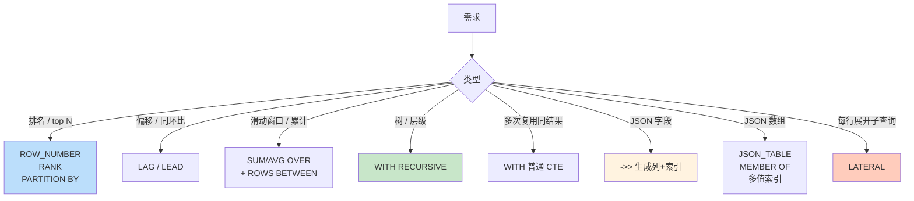

# 精通 JSON、窗口函数与 CTE：MySQL 的现代 SQL 工具箱

> 关联章节：[M02 索引](./02-精通-InnoDB-索引.md)、[M06 查询优化](./06-精通查询优化与-EXPLAIN.md)

---

## 引言：MySQL 不再是"功能贫瘠"

很多年里，MySQL 的 SQL 语法被诟病"什么都没有"——没有窗口函数、没有 CTE、JSON 用字符串硬塞。结果是大量业务把这些逻辑塞到应用层，写一堆胶水代码。

8.0 之后这些短板被一次性补齐：

- **窗口函数**（8.0）：ROW_NUMBER、RANK、LAG、LEAD、聚合开窗
- **CTE**（8.0）：WITH 子句、递归 CTE
- **JSON**（5.7 引入，8.0 大幅增强）：原生 JSON 类型、JSON 索引、JSON_TABLE
- **横向派生表**（8.0.14）：LATERAL JOIN
- **公共生成列**：从 JSON 提取字段建索引

这章把这些"现代 SQL 工具"系统讲一遍——重点不是语法手册，是**什么场景该用、什么场景不该用、性能陷阱在哪里**。

读完之后你应该能：

- 区分 ROW_NUMBER / RANK / DENSE_RANK 的语义差异
- 用 LAG / LEAD 写"同比环比"查询
- 写递归 CTE 解决组织树 / 评论树问题
- 评估 JSON 列何时该用、何时该拆成关系表
- 用生成列 + 索引加速 JSON 字段查询
- 用 JSON_TABLE 把 JSON 数组炸开成表

---

## 第一章：窗口函数（Window Functions）

### 1.1 一句话定义

窗口函数 = **不聚合行的聚合**。

对比 GROUP BY：

```sql
-- GROUP BY：3 行变 1 行
SELECT dept, AVG(salary) FROM emp GROUP BY dept;

-- 窗口函数：保留所有行，每行额外多一列"该部门平均薪资"
SELECT name, dept, salary, 
       AVG(salary) OVER (PARTITION BY dept) AS dept_avg
FROM emp;
```

### 1.2 完整语法

```sql
function() OVER (
  [PARTITION BY col1, col2, ...]   -- 分窗
  [ORDER BY col3 ASC|DESC]          -- 窗内排序
  [frame_clause]                    -- 窗内子范围
)
```

frame_clause（窗框）：

```
ROWS BETWEEN UNBOUNDED PRECEDING AND CURRENT ROW       -- 从开头到当前行
ROWS BETWEEN 2 PRECEDING AND 2 FOLLOWING               -- 前 2 + 当前 + 后 2
ROWS BETWEEN CURRENT ROW AND UNBOUNDED FOLLOWING       -- 当前到结束
RANGE BETWEEN INTERVAL '1' DAY PRECEDING AND CURRENT ROW  -- 按值范围
```

默认 frame：

- 有 ORDER BY 时：`RANGE BETWEEN UNBOUNDED PRECEDING AND CURRENT ROW`
- 无 ORDER BY 时：整个分区

### 1.3 排名类函数

| 函数 | 行为 |
|---|---|
| `ROW_NUMBER()` | 1, 2, 3, 4, 5（永不重复） |
| `RANK()` | 1, 2, 2, 4, 5（并列后跳过） |
| `DENSE_RANK()` | 1, 2, 2, 3, 4（并列后不跳） |
| `NTILE(N)` | 把数据均分 N 桶，返回桶号 |
| `PERCENT_RANK()` | 百分位排名 0-1 |
| `CUME_DIST()` | 累积分布 |

示例：每个部门薪资 Top 3

```sql
SELECT dept, name, salary FROM (
  SELECT dept, name, salary,
         ROW_NUMBER() OVER (PARTITION BY dept ORDER BY salary DESC) AS rn
  FROM emp
) t
WHERE rn <= 3;
```

注意：有些方言可以更简洁用 `QUALIFY` 子句——但 **MySQL 与 PostgreSQL 均不支持 QUALIFY**（支持的是 Snowflake / BigQuery / DuckDB）。

### 1.4 偏移类函数

| 函数 | 行为 |
|---|---|
| `LAG(col, n, default)` | 前 n 行的值（默认 n=1） |
| `LEAD(col, n, default)` | 后 n 行的值 |
| `FIRST_VALUE(col)` | 窗内第一个值 |
| `LAST_VALUE(col)` | 窗内最后一个值（注意 frame！） |
| `NTH_VALUE(col, n)` | 第 n 个值 |

示例：每日订单数与昨日对比

```sql
SELECT day, orders,
       orders - LAG(orders, 1, 0) OVER (ORDER BY day) AS day_over_day,
       orders - LAG(orders, 7, 0) OVER (ORDER BY day) AS week_over_week
FROM daily_stats
ORDER BY day;
```

### 1.5 聚合类函数开窗

任何聚合函数都可以加 OVER：

```sql
-- 运行总计 (running total)
SELECT day, sales,
       SUM(sales) OVER (ORDER BY day ROWS BETWEEN UNBOUNDED PRECEDING AND CURRENT ROW) AS cum_sales
FROM daily_sales;

-- 7 日移动平均
SELECT day, sales,
       AVG(sales) OVER (ORDER BY day ROWS BETWEEN 6 PRECEDING AND CURRENT ROW) AS ma7
FROM daily_sales;
```

### 1.6 性能：窗口函数的代价

窗口函数底层通常需要：

1. 按 PARTITION BY 排序
2. （可选）按 ORDER BY 二次排序
3. 单次扫描计算

**优化提示**：

- 给 PARTITION BY 和 ORDER BY 列建组合索引，可避免排序
- 8.0 的执行器对窗口函数有"流式"实现（无需物化所有行）
- 窗口函数 **不能** 在 WHERE 里用，但可以在外层 WHERE 里过滤

```sql
-- 错误
SELECT * FROM emp WHERE ROW_NUMBER() OVER (...) <= 3;

-- 正确
SELECT * FROM (SELECT *, ROW_NUMBER() OVER (...) AS rn FROM emp) t WHERE rn <= 3;
```

### 1.7 常见模式速查

**找连续登录 N 天的用户**：

```sql
SELECT user_id, MIN(login_day), MAX(login_day), COUNT(*) AS streak_days
FROM (
  SELECT user_id, login_day,
         DATE_SUB(login_day, INTERVAL ROW_NUMBER() OVER (PARTITION BY user_id ORDER BY login_day) DAY) AS grp
  FROM user_login
) t
GROUP BY user_id, grp
HAVING COUNT(*) >= 7;
```

**去重保留每组最新一行**：

```sql
SELECT * FROM (
  SELECT *, ROW_NUMBER() OVER (PARTITION BY user_id ORDER BY updated_at DESC) AS rn
  FROM events
) t
WHERE rn = 1;
```

**累计百分比**：

```sql
SELECT product, sales,
       SUM(sales) OVER (ORDER BY sales DESC) / SUM(sales) OVER () AS cum_pct
FROM products;
```

---

## 第二章：CTE 与递归

### 2.1 普通 CTE

```sql
WITH dept_stats AS (
  SELECT dept, AVG(salary) AS avg_sal, COUNT(*) AS cnt
  FROM emp GROUP BY dept
),
big_dept AS (
  SELECT * FROM dept_stats WHERE cnt > 10
)
SELECT b.dept, b.avg_sal, e.name
FROM big_dept b JOIN emp e USING (dept)
WHERE e.salary > b.avg_sal;
```

CTE = 命名的临时结果集，**可以多次引用**。

### 2.2 与派生表对比

```sql
-- 派生表（旧写法）
SELECT * FROM (SELECT ...) t1 JOIN (SELECT ...) t2 ON ...

-- CTE（新写法）
WITH t1 AS (SELECT ...), t2 AS (SELECT ...)
SELECT * FROM t1 JOIN t2 ON ...
```

优势：

- 可读性好（顶部声明 → 主查询用）
- 同一 CTE 可在主查询多次引用
- 递归 CTE 是派生表做不到的

劣势：

- MySQL 把 CTE 实现为**物化的临时表**（默认），可能比内联子查询慢
- 没有 PostgreSQL 那种 `MATERIALIZED` / `NOT MATERIALIZED` hint（8.0+ 优化器可能内联，但行为不稳）

### 2.3 递归 CTE 语法

```sql
WITH RECURSIVE cte_name AS (
  -- anchor: 基础查询（不引用自己）
  SELECT ...
  UNION ALL
  -- recursive: 引用自己
  SELECT ... FROM cte_name WHERE ...
)
SELECT * FROM cte_name;
```

### 2.4 经典案例：组织树

```sql
CREATE TABLE org (
  id INT PRIMARY KEY,
  name VARCHAR(50),
  parent_id INT
);

INSERT INTO org VALUES 
(1, 'CEO', NULL),
(2, 'CTO', 1), (3, 'CFO', 1),
(4, 'Engineering Director', 2), (5, 'Finance Director', 3),
(6, 'Backend Lead', 4), (7, 'Frontend Lead', 4);

-- 找 CEO 下的所有人 + 层级
WITH RECURSIVE org_tree AS (
  SELECT id, name, parent_id, 0 AS depth, CAST(name AS CHAR(500)) AS path
  FROM org WHERE id = 1
  UNION ALL
  SELECT o.id, o.name, o.parent_id, t.depth + 1, CONCAT(t.path, ' > ', o.name)
  FROM org o JOIN org_tree t ON o.parent_id = t.id
)
SELECT id, depth, path FROM org_tree ORDER BY path;
```

输出：

```
id | depth | path
1  | 0     | CEO
2  | 1     | CEO > CTO
4  | 2     | CEO > CTO > Engineering Director
6  | 3     | CEO > CTO > Engineering Director > Backend Lead
7  | 3     | CEO > CTO > Engineering Director > Frontend Lead
3  | 1     | CEO > CFO
5  | 2     | CEO > CFO > Finance Director
```

### 2.5 递归 CTE 的限制

```sql
SHOW VARIABLES LIKE 'cte_max_recursion_depth';
-- 默认 1000
```

超过深度会报错。设置：

```sql
SET cte_max_recursion_depth = 5000;
```

注意：**避免无限递归**——基础情形（anchor）和递归情形必须设计好终止条件。

### 2.6 经典案例：生成序列

MySQL 没有 PostgreSQL 的 `generate_series()`，用递归 CTE 实现：

```sql
WITH RECURSIVE nums(n) AS (
  SELECT 1
  UNION ALL
  SELECT n+1 FROM nums WHERE n < 100
)
SELECT * FROM nums;

-- 生成日期范围
WITH RECURSIVE dates(d) AS (
  SELECT DATE '2026-01-01'
  UNION ALL
  SELECT d + INTERVAL 1 DAY FROM dates WHERE d < '2026-12-31'
)
SELECT * FROM dates;
```

注意：生成大量行（百万级）用递归 CTE 性能差——考虑预生成的 `numbers` 表或临时表。

---

## 第三章：JSON 类型

### 3.1 一句话定义

MySQL 5.7+ 的 JSON 类型是**原生类型**——存储为二进制格式（不是 VARCHAR/TEXT），支持快速字段访问和部分更新。

```sql
CREATE TABLE products (
  id INT PRIMARY KEY,
  name VARCHAR(100),
  attrs JSON
);

INSERT INTO products VALUES 
  (1, 'Laptop', '{"cpu":"i7","ram":16,"gpu":"rtx4060","tags":["work","gaming"]}'),
  (2, 'Phone',  '{"cpu":"a16","ram":6, "tags":["mobile"]}');
```

### 3.2 提取字段

```sql
-- ->  返回 JSON
SELECT attrs->'$.cpu' FROM products;  -- "i7"  (带引号)

-- ->> 返回 SCALAR (去引号)
SELECT attrs->>'$.cpu' FROM products; -- i7

-- 嵌套 / 数组
SELECT attrs->>'$.tags[0]' FROM products;
SELECT attrs->>'$.specs.cores' FROM products;
```

### 3.3 关键函数

| 函数 | 作用 |
|---|---|
| `JSON_EXTRACT(j, path)` | 等价于 `->` |
| `JSON_UNQUOTE(j)` | 去引号 |
| `JSON_OBJECT(k, v, ...)` | 构造 JSON 对象 |
| `JSON_ARRAY(v, v, ...)` | 构造 JSON 数组 |
| `JSON_CONTAINS(j, val, path)` | 包含某值 |
| `JSON_CONTAINS_PATH(j, mode, path...)` | 路径存在 |
| `JSON_KEYS(j)` | 取所有 key |
| `JSON_LENGTH(j)` | 长度 |
| `JSON_SET(j, path, val, ...)` | 设置（路径存在则更新，否则插入） |
| `JSON_INSERT(j, path, val)` | 只插入新路径 |
| `JSON_REPLACE(j, path, val)` | 只替换已有路径 |
| `JSON_REMOVE(j, path)` | 删除路径 |
| `JSON_ARRAY_APPEND(j, path, val)` | 数组追加 |
| `JSON_MERGE_PATCH(j1, j2)` | RFC 7396 合并 |
| `JSON_PRETTY(j)` | 美化输出 |
| `JSON_TABLE(j, ...)` | 把 JSON 炸开成表 |

### 3.4 部分更新（partial update）

5.7 改 JSON = 整列重写。8.0 优化：如果用 `JSON_SET / JSON_REPLACE / JSON_REMOVE` 且新值不超过原大小，**只更新被改部分**，binlog 也只记差异。

```sql
UPDATE products SET attrs = JSON_SET(attrs, '$.ram', 32) WHERE id = 1;
-- 8.0 下，只改 ram 字段，不重写整列
```

### 3.5 索引 JSON

JSON 本身不能直接建索引。两种方法：

**方法 1：生成列 + 索引**

```sql
ALTER TABLE products 
  ADD COLUMN cpu VARCHAR(20) AS (attrs->>'$.cpu') STORED,
  ADD INDEX idx_cpu (cpu);

-- 然后这样查询能命中索引
SELECT * FROM products WHERE attrs->>'$.cpu' = 'i7';
```

注意：

- `STORED`：物化到行里，占空间但读取快
- `VIRTUAL`：每次读时计算（不占行空间），索引上仍然物化
- 8.0+ 优化器能识别 `attrs->>'$.cpu'` 与生成列等价，自动用索引

**方法 2：多值索引（8.0.17+）**

对 JSON 数组建索引：

```sql
ALTER TABLE products ADD INDEX idx_tags ((CAST(attrs->'$.tags' AS CHAR(20) ARRAY)));

-- 查找标签包含 'gaming' 的
SELECT * FROM products WHERE JSON_CONTAINS(attrs->'$.tags', '"gaming"');
SELECT * FROM products WHERE 'gaming' MEMBER OF (attrs->'$.tags');
```

### 3.6 JSON_TABLE：炸表

```sql
SELECT p.id, t.tag
FROM products p,
JSON_TABLE(p.attrs, '$.tags[*]' COLUMNS (
  tag VARCHAR(50) PATH '$'
)) t;
```

把数组的每个元素展成一行，可以 JOIN 用。

复杂案例：

```sql
INSERT INTO orders VALUES 
  (1, '{"customer":"Alice","items":[
        {"sku":"A1","qty":2,"price":10},
        {"sku":"B2","qty":1,"price":50}
     ]}');

SELECT o.id, t.sku, t.qty, t.price, t.qty*t.price AS total
FROM orders o,
JSON_TABLE(o.data, '$.items[*]' COLUMNS (
  sku VARCHAR(20) PATH '$.sku',
  qty INT          PATH '$.qty',
  price DECIMAL(10,2) PATH '$.price'
)) t;
```

### 3.7 何时用 JSON、何时不用

**用 JSON**：

- Schema 很灵活（用户标签、产品 attribute）
- 字段几乎不参与索引查询
- 嵌套结构很自然（如 webhook payload）

**不用 JSON**：

- 字段经常做 WHERE 过滤 / JOIN → 拆成关系表
- 字段需要事务原子性更新 → 关系表
- 数据量极大 → JSON 行变胖，影响 Buffer Pool 命中率

经验法则：**JSON 是"半结构化兜底"，不是"取代关系模型"**。能拆就拆。

---

## 第四章：横向派生表 LATERAL

### 4.1 普通 JOIN 的限制

```sql
-- 想：给每个 user 选最新 3 条订单
SELECT u.id, u.name, o.*
FROM users u
JOIN orders o ON o.user_id = u.id
ORDER BY o.created_at DESC
LIMIT 3;   -- ← 这是全表的 top 3，不是每用户 top 3
```

无法直接表达"对每行执行子查询并 JOIN 结果"。

### 4.2 LATERAL（8.0.14+）

```sql
SELECT u.id, u.name, o.*
FROM users u,
LATERAL (
  SELECT * FROM orders 
  WHERE user_id = u.id 
  ORDER BY created_at DESC LIMIT 3
) o;
```

LATERAL 让派生表能**引用左边表的列**。

适合：top-N per group、相关子查询展开。

### 4.3 性能注意

LATERAL 本质是嵌套循环——对左边每一行执行一次右边的子查询。

- 左表小 + 右表有索引 → 高效
- 左表大 + 右表无索引 → 灾难

---

## 第五章：其他实用现代 SQL

### 5.1 ROLLUP / GROUPING SETS（仅 ROLLUP）

```sql
-- 按部门 + 性别分组，加汇总行
SELECT dept, gender, SUM(salary) FROM emp
GROUP BY dept, gender WITH ROLLUP;
```

输出会有：

- (eng, M, ...), (eng, F, ...), (eng, NULL, eng 小计)
- (sales, M, ...), (sales, F, ...), (sales, NULL, sales 小计)
- (NULL, NULL, 总计)

注意：**MySQL 不支持完整的 `GROUPING SETS` / `CUBE`**（只有 ROLLUP）。需要这些 SQL 标准的特性，需要在应用层 UNION 多个查询。

### 5.2 GROUP BY 默认行为

8.0 起 `ONLY_FULL_GROUP_BY` 默认开启——`GROUP BY` 子句必须列出所有非聚合列。

```sql
-- 5.7 默认允许（虽然语义模糊）
SELECT name, dept, SUM(salary) FROM emp GROUP BY dept;

-- 8.0 报错：name 不在 GROUP BY 也不在聚合函数里
```

修正：

```sql
SELECT MAX(name), dept, SUM(salary) FROM emp GROUP BY dept;
-- 或
SELECT ANY_VALUE(name), dept, SUM(salary) FROM emp GROUP BY dept;
```

### 5.3 UPSERT

```sql
INSERT INTO products (id, name, attrs) 
VALUES (1, 'Laptop', '{}')
ON DUPLICATE KEY UPDATE attrs = VALUES(attrs);

-- 8.0.19+ 推荐用别名（避免 VALUES() 函数弃用警告）
INSERT INTO products (id, name, attrs) 
VALUES (1, 'Laptop', '{}') AS new
ON DUPLICATE KEY UPDATE attrs = new.attrs;
```

### 5.4 RETURNING（MySQL 不支持）

PostgreSQL 有 `INSERT ... RETURNING`，MySQL **没有**。要拿到 INSERT 的自增 ID：

```sql
INSERT INTO t (col) VALUES ('x');
SELECT LAST_INSERT_ID();
```

应用层用驱动的 `getGeneratedKeys()`。

---

## 第六章：性能与陷阱

### 6.1 窗口函数 vs 自连接

老写法（无窗口函数时代）：

```sql
SELECT a.day, a.sales,
       (SELECT SUM(b.sales) FROM daily b WHERE b.day <= a.day) AS cum
FROM daily a;
-- O(N²) 灾难
```

窗口函数：

```sql
SELECT day, sales, 
       SUM(sales) OVER (ORDER BY day) AS cum
FROM daily;
-- O(N log N) 排序后扫一遍
```

千行数据看不出差异；百万行差几个数量级。

### 6.2 CTE 物化的代价

```sql
WITH heavy AS (SELECT ... FROM big_table WHERE ...)  -- 跑一次
SELECT * FROM heavy WHERE a = 1
UNION ALL
SELECT * FROM heavy WHERE a = 2;
```

heavy 可能被物化成临时表跑两次—— **8.0 之前版本 CTE 永远物化**，8.0+ 优化器可以内联。

如果发现 CTE 性能差，改写成派生表或临时表手动控制。

### 6.3 JSON 列的查询性能

```sql
-- 没索引时，全表扫
SELECT * FROM products WHERE attrs->>'$.cpu' = 'i7';
EXPLAIN: type=ALL, rows=百万
```

加生成列索引：

```sql
ALTER TABLE products 
  ADD COLUMN cpu VARCHAR(20) AS (attrs->>'$.cpu') VIRTUAL,
  ADD INDEX idx_cpu (cpu);

EXPLAIN: type=ref, rows=10
```

### 6.4 递归 CTE 深度爆炸

```sql
-- 错：忘了终止条件
WITH RECURSIVE r AS (
  SELECT 1 AS n UNION ALL SELECT n+1 FROM r
) SELECT * FROM r;
-- ERROR 3636: Recursive query aborted after 1001 iterations
```

### 6.5 LATERAL 嵌套循环爆炸

```sql
SELECT * FROM big_table b,
LATERAL (SELECT ... FROM another_big WHERE x = b.x) l;
-- 没索引：N × M 全表扫
```

---

## 第七章：实战案例集

### 7.1 找连续登录 7 天的用户

```sql
SELECT user_id, MIN(login_day) AS start_day, MAX(login_day) AS end_day, COUNT(*) AS days
FROM (
  SELECT user_id, login_day,
         DATE_SUB(login_day, INTERVAL ROW_NUMBER() OVER (PARTITION BY user_id ORDER BY login_day) DAY) AS grp
  FROM user_login
) t
GROUP BY user_id, grp
HAVING COUNT(*) >= 7;
```

原理：如果用户连续登录，`login_day - 序号` 相同。

### 7.2 每个类目销量 Top 3 商品

```sql
WITH ranked AS (
  SELECT category, product_id, sales,
         ROW_NUMBER() OVER (PARTITION BY category ORDER BY sales DESC) AS rn
  FROM product_sales
)
SELECT * FROM ranked WHERE rn <= 3;
```

### 7.3 同比 / 环比

```sql
SELECT month, sales,
       LAG(sales, 1) OVER (ORDER BY month) AS prev_month,
       (sales - LAG(sales, 1) OVER (ORDER BY month)) / LAG(sales, 1) OVER (ORDER BY month) AS mom_growth,
       LAG(sales, 12) OVER (ORDER BY month) AS prev_year_same_month,
       (sales - LAG(sales, 12) OVER (ORDER BY month)) / LAG(sales, 12) OVER (ORDER BY month) AS yoy_growth
FROM monthly_sales;
```

### 7.4 评论树

```sql
CREATE TABLE comments (
  id INT PRIMARY KEY,
  parent_id INT,
  content TEXT,
  created_at DATETIME
);

WITH RECURSIVE thread AS (
  SELECT id, parent_id, content, 0 AS depth, CAST(LPAD(id, 8, '0') AS CHAR(500)) AS sort_key
  FROM comments WHERE parent_id IS NULL
  UNION ALL
  SELECT c.id, c.parent_id, c.content, t.depth + 1, CONCAT(t.sort_key, '.', LPAD(c.id, 8, '0'))
  FROM comments c JOIN thread t ON c.parent_id = t.id
)
SELECT depth, CONCAT(REPEAT('  ', depth), content) AS indented_content
FROM thread ORDER BY sort_key;
```

### 7.5 JSON 商品搜索

```sql
-- attrs = {"color":"red","size":"L","tags":["new","hot"]}

-- 颜色为 red 的
SELECT * FROM products WHERE attrs->>'$.color' = 'red';

-- 标签包含 hot
SELECT * FROM products WHERE 'hot' MEMBER OF (attrs->'$.tags');

-- color 为 red 且 size 在 L/XL
SELECT * FROM products 
WHERE attrs->>'$.color' = 'red' 
  AND attrs->>'$.size' IN ('L', 'XL');
```

### 7.6 JSON_TABLE 解析 webhook 日志

```sql
CREATE TABLE webhook_log (
  id INT PRIMARY KEY,
  payload JSON,
  received_at TIMESTAMP
);

-- 假设 payload = {"events":[{"type":"order","amount":100},{"type":"refund","amount":-20}]}

SELECT w.id, t.type, t.amount, w.received_at
FROM webhook_log w,
JSON_TABLE(w.payload, '$.events[*]' COLUMNS (
  type VARCHAR(20) PATH '$.type',
  amount DECIMAL(10,2) PATH '$.amount'
)) t
WHERE t.type = 'order';
```

---

## 第八章：与其他数据库对比

| 特性 | MySQL 8.4 | PostgreSQL 16 | Oracle 21c |
|---|---|---|---|
| 窗口函数 | ✓ | ✓✓（更全） | ✓✓ |
| QUALIFY 子句 | ✗ | ✗ | ✗ |
| CTE | ✓ | ✓✓（带 MATERIALIZED hint） | ✓✓ |
| 递归 CTE | ✓ | ✓ | ✓ |
| JSON 类型 | ✓（JSON） | ✓✓（JSONB 更快） | ✓（JSON） |
| JSON 索引 | 生成列 / 多值索引 | GIN 直接索引 | JSON Search Index |
| JSON_TABLE | ✓ | ✓ | ✓ |
| LATERAL | ✓（8.0.14+） | ✓ | ✓（CROSS APPLY） |
| GROUPING SETS / CUBE | ✗（只有 ROLLUP） | ✓ | ✓ |
| RETURNING | ✗ | ✓ | ✓ |
| 数组类型 | ✗ | ✓ | ✗ |

MySQL 在 8.0 之后已经追上了"现代 SQL 80%"的特性。剩下的差距主要是数组类型、GROUPING SETS、RETURNING、JSONB 性能等。

---

## 第九章：踩坑清单

### 9.1 窗口函数 + ORDER BY + LIMIT

```sql
SELECT *, ROW_NUMBER() OVER (ORDER BY x) AS rn FROM t LIMIT 10;
-- rn 是从 1 开始的，但只返回前 10 条 → OK

SELECT * FROM (
  SELECT *, ROW_NUMBER() OVER (ORDER BY x) AS rn FROM t
) sub WHERE rn BETWEEN 100 AND 110;
-- 翻页 → 必须包到子查询里
```

### 9.2 JSON 不存在路径返回 NULL

```sql
SELECT attrs->>'$.nonexistent' FROM products;
-- NULL（不报错）
```

慎用：`IS NULL` 与 `=` 比较 NULL 不会匹配。

### 9.3 CTE 不可"更新"

```sql
WITH x AS (SELECT * FROM t) UPDATE x SET col=1;
-- ERROR
```

CTE 是只读的，需要先 SELECT 出主键再 UPDATE。

### 9.4 LATERAL 不能用在 LEFT JOIN 左边

```sql
-- 错
SELECT * FROM LATERAL (SELECT 1) l LEFT JOIN t ON ...
-- 对
SELECT * FROM t, LATERAL (SELECT 1 WHERE t.x > 0) l
```

### 9.5 JSON 比较

```sql
SELECT '{"a":1, "b":2}' = '{"b":2, "a":1}';
-- 字符串比较：FALSE
SELECT CAST('{"a":1, "b":2}' AS JSON) = CAST('{"b":2, "a":1}' AS JSON);
-- JSON 比较：TRUE（结构相等）
```

### 9.6 生成列与 JSON

```sql
ALTER TABLE products 
  ADD COLUMN cpu VARCHAR(20) AS (attrs->>'$.cpu') STORED;
-- STORED 列会占用行空间；VIRTUAL 只在索引和读取时计算

-- 修改 JSON 时，STORED 生成列必须重算
-- 高频更新 JSON 的表，谨慎用 STORED
```

---

## 总结 · 现代 SQL 速查



---

## 练习题

1. 写一个 SQL：每个部门薪资 Top 3，并且并列时全部保留。

2. 用窗口函数实现"找用户每次连续访问会话的开始时间"（同一用户连续访问间隔 < 30 分钟算同一会话）。

3. 普通 CTE 和派生表（subquery in FROM）在 MySQL 中的执行差异是什么？

4. 写一个递归 CTE，生成 2026 全年所有日期，并标记是否为周末。

5. JSON 列 `attrs` 中 `tags` 是数组。怎样高效查询"标签包含 hot 的商品"？给出索引方案。

6. `STORED` 与 `VIRTUAL` 生成列的差异。各自适合什么场景？

7. JSON_TABLE 与 `JSON_EXTRACT` 比较，前者解决了什么问题？

8. 用 LATERAL 写：给每个用户取出其最近一次订单的金额（无订单时为 NULL）。

9. MySQL 为什么不支持 QUALIFY 子句？如何变通？

10. 评估：把"用户标签"存成 JSON 数组列 vs 拆成 `user_tags` 关系表。各自的优劣，什么场景选哪个？

---

> 📁 下一篇：[M11 精通 MySQL 9 新特性](./11-精通-MySQL-9-新特性.md)
