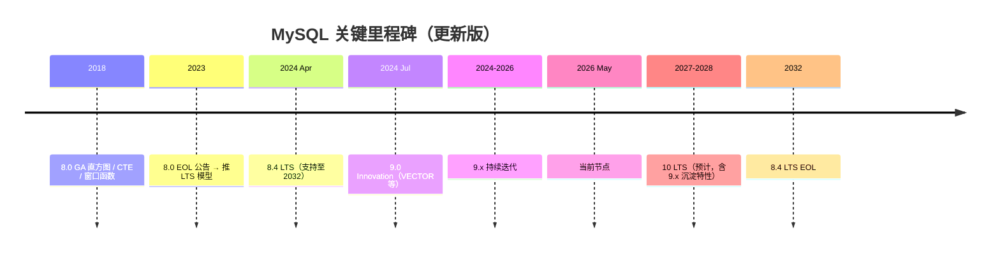

# 精通 MySQL 9 新特性：VECTOR 类型、事件追踪与权限模型

> 关联章节：[M10 现代 SQL](./10-精通-JSON-窗口函数.md)、[M09 高可用](./09-精通-MySQL-高可用.md)
>
> ⚠️ MySQL 9.x 是 **Innovation Release**（创新版），不是 LTS。生产基线仍推荐 8.4 LTS。本章用于评估、尝鲜、为未来 LTS 做准备。

---

## 引言：MySQL 9 是个什么版本

Oracle 在 2023 年宣布了 MySQL 的双轨发布模型：

- **LTS 版本**（长期支持，5+3 = 8 年）：稳定，企业生产用。如 **8.4 LTS**（2024-04 发布，2032-04 EOL）
- **Innovation 版本**（创新版，每 3 个月一发，仅次版本支持期 ~3 个月）：尝鲜新特性。9.0、9.1、9.2、9.3...

→ 9.x 的特性最终会"沉淀"到下一个 LTS（预计 10 LTS）。所以学 9.x 等于看下一代 MySQL 的雏形。

9 系列主要新特性：

- **VECTOR 类型**（9.0）：原生向量存储，AI / RAG 友好
- **JavaScript 存储函数**（9.0 企业版，9.x 后续开源跟进）
- **EXPLAIN INTO**（9.0）：保存执行计划到变量
- **事件跟踪扩展**：更精细的 audit
- **权限模型**：新增 / 调整的权限
- **索引提示扩展**
- 大量 InnoDB / replication 内部优化

读完之后你应该能：

- 用 VECTOR 类型存储与查询向量数据
- 评估 MySQL 9 是否适合放进生产（多数情况：否）
- 跟踪 9.x 的关键演进路线
- 在 8.4 与 9.x 之间做出合理选型

---

## 第一章：VECTOR 类型 —— MySQL 的 AI 接入点

### 1.1 背景：为什么 RDBMS 需要向量

LLM 时代的 RAG（检索增强生成）依赖**向量相似度搜索**：

1. 把文档切块 → 用 embedding 模型转成 N 维向量
2. 把向量入库
3. 用户提问 → 转向量 → 查询库中最近的 K 个向量
4. 取出对应文档，喂给 LLM 生成答案

传统做法：用专门的向量数据库（Pinecone / Milvus / Weaviate）。
新做法：让 RDBMS 直接支持，**与业务数据共用一个事务**。

### 1.2 MySQL 9 的 VECTOR 类型

9.0+ 引入：

```sql
CREATE TABLE docs (
  id BIGINT PRIMARY KEY,
  title VARCHAR(200),
  embedding VECTOR(384)  -- 384 维浮点向量
);
```

- 维度固定（建表时声明）
- 元素是 4 字节 float
- 384 维 = 1536 字节存储 ≈ 6 个 16KB 页一页放约 10 个向量
- 当前**仅支持二进制存储 + 距离函数**，没有内建 ANN（近似最近邻）索引

### 1.3 插入与查询

```sql
-- 用十六进制或函数构造
INSERT INTO docs VALUES (1, 'doc1', STRING_TO_VECTOR('[0.1, 0.2, 0.3, ...]'));

-- 转回字符串
SELECT VECTOR_TO_STRING(embedding) FROM docs LIMIT 1;

-- 维度
SELECT VECTOR_DIM(embedding) FROM docs LIMIT 1;
```

距离函数：

| 函数 | 含义 |
|---|---|
| `DISTANCE(v1, v2, 'EUCLIDEAN')` | 欧氏距离 |
| `DISTANCE(v1, v2, 'COSINE')` | 余弦距离（1 - cos相似度） |
| `DISTANCE(v1, v2, 'DOT')` | 负点积 |

查询最近 K 条（暴力扫表）：

```sql
SET @q = STRING_TO_VECTOR('[0.15, 0.25, ...]');
SELECT id, title, DISTANCE(embedding, @q, 'COSINE') AS d
FROM docs
ORDER BY d ASC
LIMIT 10;
```

### 1.4 真实性能

无索引的暴力扫描，10 万条 384 维向量：

- MySQL 9.0：单次 query ≈ 200-500ms
- 专业向量库（HNSW 索引）：≈ 1-5ms

差距来自**没有 ANN 索引**。

→ MySQL 9.x 的 VECTOR 目前**适合小规模（< 10 万）+ 强一致 + 与业务事务一起处理**的场景，不是替代专业向量库。

未来路线（HeatWave、9.x roadmap 公开提到）：

- **HNSW 索引**
- **IVF / PQ 索引**
- **GPU 加速距离计算**

但 2026-05 时，开源版本暂未提供。

### 1.5 实战：RAG 落地（小规模）

```sql
-- 文档库
CREATE TABLE knowledge_base (
  id BIGINT AUTO_INCREMENT PRIMARY KEY,
  doc_id VARCHAR(100),
  chunk_index INT,
  content TEXT,
  embedding VECTOR(1536),  -- OpenAI text-embedding-3-small
  created_at TIMESTAMP DEFAULT CURRENT_TIMESTAMP,
  INDEX idx_doc (doc_id, chunk_index)
);

-- 查询
SET @query_vec = STRING_TO_VECTOR((SELECT embed FROM tmp_query LIMIT 1));

SELECT doc_id, chunk_index, content,
       DISTANCE(embedding, @query_vec, 'COSINE') AS sim
FROM knowledge_base
ORDER BY sim ASC
LIMIT 5;
```

### 1.6 配合 HeatWave

Oracle 推 **HeatWave**——MySQL 的内存分析加速引擎，已集成：

- 向量索引（HNSW）
- AutoML（机器学习训练）
- LLM 集成（直接调外部 LLM API）

但 HeatWave 是**云端商业产品**，开源 MySQL 没有。如果在 OCI / AWS RDS 上跑 MySQL HeatWave，VECTOR 性能可以接近专业库。

---

## 第二章：JavaScript 存储函数

### 2.1 背景

MySQL 历来支持存储过程，但 SQL/PSM 语法相对原始，缺乏现代语言生态。

9.0 引入 JavaScript 存储函数（**Enterprise Edition** 起步，开源跟进中）：

```sql
CREATE FUNCTION js_upper(s VARCHAR(1000)) RETURNS VARCHAR(1000)
LANGUAGE JAVASCRIPT
AS $$
  return s.toUpperCase();
$$;

SELECT js_upper('hello');  -- HELLO
```

### 2.2 适用场景

- 字符串复杂处理（正则、JSON 操控）
- 业务校验逻辑下沉到数据库
- 与 JavaScript 应用层逻辑共享算法

### 2.3 性能与隔离

JS 函数运行在内嵌的 **GraalVM**（Oracle 的多语言运行时）中，每个函数调用会创建轻量级上下文。

性能：

- 字符串处理类：比 SQL/PSM 略快
- 数值计算类：比 SQL 内置函数慢
- 高频调用（每行一次）：慎用

### 2.4 限制

- 不能直接访问数据库内部数据（无法在 JS 中再发 SQL）
- 内存上限受 my.cnf 控制
- 调试体验有限

→ 适合"无副作用的纯函数"。

### 2.5 开源生态

社区还在跟进开源版本的兼容实现。生产前需确认你的发行版（社区版 / Percona / MariaDB fork）是否支持。

---

## 第三章：EXPLAIN INTO

### 3.1 解决什么问题

普通 EXPLAIN 输出到客户端，难以程序化处理：

```sql
EXPLAIN SELECT * FROM big WHERE id = 1;
```

9.0+ 支持把 EXPLAIN 输出**保存到变量**：

```sql
EXPLAIN FORMAT=JSON INTO @plan FOR SELECT * FROM big WHERE id = 1;
SELECT @plan;
```

`@plan` 是一个完整的 JSON 字符串，可以用 JSON 函数解析。

### 3.2 应用场景

- SQL 性能基线对比
- 在过程化 SQL 里做执行计划检查
- 自动化 CI 流程检测计划退化

```sql
-- 检测是否走索引
EXPLAIN FORMAT=JSON INTO @p FOR SELECT ...;
SET @access_type = JSON_EXTRACT(@p, '$.query_block.table.access_type');
IF @access_type = 'ALL' THEN
  SIGNAL SQLSTATE '45000' SET MESSAGE_TEXT = 'Query falls back to full scan!';
END IF;
```

---

## 第四章：审计与事件追踪

### 4.1 audit log（企业版历来有）

```sql
-- 启用
INSTALL PLUGIN audit_log SONAME 'audit_log.so';

-- 配置
SET GLOBAL audit_log_policy = 'ALL';        -- 记录所有
SET GLOBAL audit_log_format = 'JSON';        -- JSON 格式

-- 日志文件位置：data dir / audit.log
```

9.x 新增字段：

- 详细的连接信息（TLS cipher / 客户端版本）
- 事务级别的 attribution
- 更细粒度的 filter

### 4.2 Performance Schema 扩展

9.x 在 `performance_schema` 加了若干新表（部分需要 8.4 backport）：

- `replication_asynchronous_connection_failover` 详细的 failover 历史
- `connection_control_failed_login_attempts` 失败登录追踪
- 更详细的 `error_log` / `events_errors_summary_*`

### 4.3 SQL 错误统计

```sql
SELECT * FROM performance_schema.events_errors_summary_global_by_error
WHERE error_number > 0
ORDER BY sum_error_handled + sum_error_raised DESC LIMIT 10;
```

定位"什么错最常发生"——对应用代码质量诊断很有用。

---

## 第五章：权限与安全

### 5.1 新权限

9.0+ 引入或增强：

- `FLUSH_PRIVILEGES` 独立权限（原来需要 RELOAD）
- `SET_ANY_DEFINER` 显式控制谁能用 DEFINER 子句
- `SHOW_ROUTINE` 拆分自原 SELECT 权限
- `XA_RECOVER_ADMIN` 专管分布式事务恢复
- `INNODB_REDO_LOG_ARCHIVE` 控制 redo log 归档（HA 场景）

### 5.2 推荐做法

最小权限原则：

```sql
-- 业务账号
CREATE USER app@'10.0.%' IDENTIFIED BY 'xxx';
GRANT SELECT, INSERT, UPDATE, DELETE ON appdb.* TO app@'10.0.%';

-- 只读分析账号
CREATE USER analytics@'10.0.%' IDENTIFIED BY 'yyy';
GRANT SELECT ON appdb.* TO analytics@'10.0.%';

-- DBA
CREATE USER dba@'10.0.0.5' IDENTIFIED BY 'zzz';
GRANT ALL PRIVILEGES ON *.* TO dba@'10.0.0.5' WITH GRANT OPTION;

-- 禁止 root 远程登录（root 仅本机）
RENAME USER root@'%' TO root@'localhost';
```

### 5.3 密码策略

9.x 强化密码策略：

```sql
INSTALL COMPONENT 'file://component_validate_password';

SET GLOBAL validate_password.policy = 'STRONG';
SET GLOBAL validate_password.length = 12;
SET GLOBAL validate_password.mixed_case_count = 1;
SET GLOBAL validate_password.special_char_count = 1;
```

### 5.4 TLS

强烈推荐 8.0+ 全开 TLS：

```ini
[mysqld]
require_secure_transport = ON
tls_version = TLSv1.2,TLSv1.3
```

9.x 进一步：

- 默认 TLS 1.3
- 改进的证书轮换（`ALTER INSTANCE RELOAD TLS`）

---

## 第六章：索引提示

### 6.1 旧的 hint

```sql
SELECT * FROM t USE INDEX (idx1) WHERE ...;
SELECT * FROM t FORCE INDEX (idx1) WHERE ...;
SELECT * FROM t IGNORE INDEX (idx1) WHERE ...;
```

### 6.2 优化器 hint（5.7 起，8.0+ 完善）

```sql
SELECT /*+ NO_INDEX_MERGE(t idx1) */ * FROM t WHERE ...;
SELECT /*+ JOIN_ORDER(a, b, c) */ * FROM a, b, c WHERE ...;
SELECT /*+ HASH_JOIN(b) */ * FROM a JOIN b ON ...;
SELECT /*+ SET_VAR(sort_buffer_size=16M) */ * FROM t ORDER BY x;
```

### 6.3 9.x 新增

- 更精细的 JOIN 算法选择
- BKA、batched key access 控制
- 与 EXPLAIN INTO 配合做基线对比

---

## 第七章：复制与 HA 改进

### 7.1 异步复制改进

- **网络压缩**：`replica_compressed_protocol` 默认 zstd 而非 zlib
- **更小的 WriteSet**：`binlog_transaction_compression` 默认 zstd
- **延迟更可控**：每个 stage 都有 PS 统计

```sql
-- 9.x 看 replication 各 stage 耗时
SELECT * FROM performance_schema.replication_applier_status_by_worker;
```

### 7.2 MGR 改进

- **自动重连**：成员暂时离线后自动重新加入（不需要手工 START GROUP_REPLICATION）
- **更快的 view 切换**：选举速度从 ~10s 优化到 ~5s
- **更友好的报错**

### 7.3 ClusterSet（8.0.27 引入，9.x 增强）

跨集群同步：

```javascript
var cs = cluster.createClusterSet('myClusterSet');
cs.createReplicaCluster('user@dr-host:3306', 'drCluster');
cs.routingOptions();
```

9.x 加入：

- 跨 cluster 的 GTID 一致性检查
- 自动健康检查
- 故障切换工具更智能

---

## 第八章：InnoDB 进展

### 8.1 自适应刷脏

更精细的 page cleaner 控制，减少长事务 commit 时的"突刺"。

### 8.2 在线 ADD COLUMN

`ALGORITHM=INSTANT` 在 8.0 加列已是瞬时。9.x 扩展支持：

- 添加列到中间位置（不只末尾）
- 删除列（部分场景 INSTANT）

```sql
ALTER TABLE t ADD COLUMN c2 INT AFTER c1, ALGORITHM=INSTANT;
```

### 8.3 隐藏主键

8.0.30 引入 `sql_generate_invisible_primary_key`：所有没有主键的表自动创建隐藏主键 `my_row_id BIGINT UNSIGNED AUTO_INCREMENT`。

9.x 进一步：

- 隐藏主键参与 MGR 一致性
- 复制层透明处理

适合：从 MyISAM 迁移过来的"没主键"表批量改造为 InnoDB。

### 8.4 doublewrite buffer 改进

- 独立目录（8.0.20 引入，9.x 默认开启支持）
- 更智能的批量写

---

## 第九章：optimizer 进展

### 9.1 直方图改进

9.x 直方图统计：

- 自动维护（部分场景，需 hint 启用）
- 更精确的 ndv 估计
- JSON 列上的直方图

### 9.2 Hash Join 默认化

8.0.18 引入 hash join，9.x 进一步把它作为多数 OUTER JOIN / no-index 场景的默认选择。

### 9.3 Subquery 优化

更多场景把相关子查询转换为 JOIN / semi-join：

```sql
SELECT * FROM a WHERE x IN (SELECT y FROM b WHERE b.c = a.c);
```

可被改写为 semi-join。

---

## 第十章：8.4 LTS vs 9.x 选型

### 10.1 选 8.4 LTS 的理由

- **生产稳定性**：长期支持到 2032
- **生态成熟**：Percona / 云厂商都基于 8.4 优化
- **运维资料多**：踩坑帖、博客、Stack Overflow 全是 8.0/8.4
- **第三方工具**：Percona Toolkit / pt-osc / gh-ost 等已稳定支持

### 10.2 选 9.x 的理由

- **VECTOR / 向量搜索**：8.x 没有
- **EXPLAIN INTO 等开发体验**：8.x 没有
- **未来 10 LTS 的预演**：提前评估
- **特定新特性的业务依赖**

### 10.3 建议路线

| 场景 | 选择 |
|---|---|
| 大型生产 | 8.4 LTS |
| 中小生产 | 8.4 LTS |
| 内部工具 / 测试 | 9.x（尝鲜） |
| AI / RAG 业务 | 8.4 + 专业向量库；或 9.x VECTOR（小规模） |
| 等待 10 LTS（预计 2027-2028） | 8.4 → 10 LTS 直跳 |

→ **2026-05 时点：99% 的生产应该选 8.4 LTS**。

### 10.4 版本演进时间线



---

## 第十一章：升级实战

### 11.1 从 8.0 升 8.4

```bash
# 1. 备份
xtrabackup --backup --target-dir=/backup

# 2. 升级 mysql 软件包
yum upgrade mysql-server

# 3. 启动（in-place upgrade）
systemctl start mysqld
# 8.4 启动时自动运行 mysql_upgrade 等价逻辑

# 4. 验证
mysql -u root -p -e "SELECT VERSION();"
```

注意检查项：

- 弃用语法：`MASTER` → `SOURCE`、`SLAVE` → `REPLICA`
- `mysql_native_password` 默认弃用，可能需要重置密码到 `caching_sha2_password`
- 部分性能 schema 表结构变化

### 11.2 从 8.4 升 9.x

**不推荐生产升级**。理由：

- 9.x 是创新版，每版本支持期 ≈ 3 个月，频繁升级
- 兼容性破坏可能性大
- 第三方工具不一定跟上

如果非要：先在 staging 至少跑 1 个月观察。

### 11.3 跨版本复制兼容性

| 主库 → 从库 | 兼容性 |
|---|---|
| 8.0 → 8.4 | OK（暂时） |
| 8.4 → 9.x | OK（仅短期） |
| 9.x → 8.4 | 不推荐 |
| 跨 2 个大版本 | 不允许 |

升级时通常：先升从，再升主，不要反着来。

---

## 第十二章：MySQL 生态进展

### 12.1 Percona Server / Percona XtraDB

社区企业级发行版：

- 自带更多 PS 增强
- 备份工具 XtraBackup 跟随上游
- 通常滞后官方 1-2 个月

### 12.2 MariaDB

5.5 之后与 MySQL 分叉，**互不兼容**：

- 列式存储 ColumnStore
- 不同的 GTID 实现
- 不同的复制 / 集群（Galera）

不建议把 MySQL 和 MariaDB 混用。

### 12.3 TiDB / OceanBase / PolarDB

兼容 MySQL 协议的分布式 NewSQL：

- TiDB：PingCAP，开源
- OceanBase：阿里
- PolarDB：阿里云

它们解决的是"超大规模 + 分布式"问题——但语义上不是 MySQL，行为细节有差异。

### 12.4 云上 MySQL

- AWS RDS / Aurora
- 阿里云 RDS / PolarDB
- GCP Cloud SQL
- Azure Database for MySQL

通常落后官方 3-6 个月，但有专属的可用区切换、自动备份等增强。

---

## 总结 · 评估清单

- [ ] 现有版本？8.0 → 优先升 8.4 LTS
- [ ] 是否有 RAG / 向量搜索需求？小规模可试 9.x VECTOR
- [ ] 是否依赖 JavaScript 存储函数？目前仅企业版
- [ ] 是否需要 EXPLAIN INTO 做 SQL 基线？9.x 才有
- [ ] 团队对 Innovation 版本接受度？滚动升级能力？
- [ ] 第三方工具是否支持目标版本？

**最稳定的选择是 8.4 LTS。**关注 9.x 是为了 10 LTS 提前做功课。

---

## 练习题

1. MySQL 9 的 VECTOR 类型相比专业向量数据库（如 Milvus），最大的局限是什么？

2. 为什么"小规模 RAG"可以考虑 MySQL VECTOR 而"大规模 RAG"不推荐？

3. `EXPLAIN INTO @v` 与传统 EXPLAIN 输出到客户端，最大的差异在哪里？应用场景？

4. 8.4 LTS 的支持期到 2032，如果一个项目 2026 启动，预期生命周期 7 年，应该选 8.4 还是 9.x？

5. JavaScript 存储函数与 SQL/PSM 相比，性能差异源自什么？

6. `mysql_native_password` 在 8.4 被弃用，对旧应用迁移的影响是什么？

7. MariaDB 和 MySQL 现在的兼容性边界在哪里？什么场景必须区分？

8. MySQL 9.x 的 Innovation 模型对企业生产升级策略带来什么变化？

9. ClusterSet 与传统跨地域异步主从相比，新增的能力是什么？

10. 评估：一个金融业务，要求强一致 + 灾备 + 向量化营销推荐功能。架构如何设计？

---

> 📁 下一篇：[M12 精通分库分表与中间件](./12-精通-MySQL-分库分表.md)
