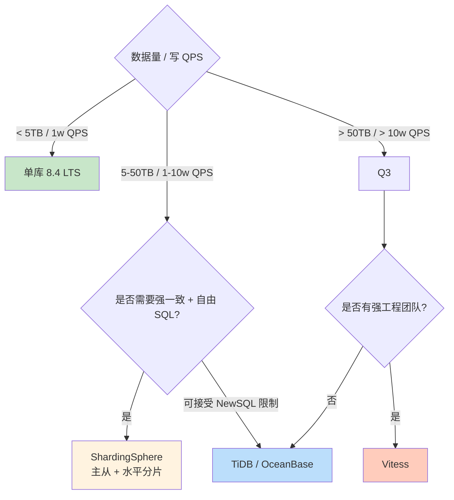

# 精通分库分表与中间件：Vitess、ShardingSphere 与分区表

> 关联章节：[M09 高可用](./09-精通-MySQL-高可用.md)、[M05 Binlog 与复制](./05-精通-Binlog-与复制.md)

---

## 引言：什么时候必须分库分表

在 SSD + 大内存 + 8.4 优化器加持下，单库 MySQL 现在能承载远比 10 年前多得多的数据。常见误区是**过早分库分表**——业务才 100 GB 就上分片中间件，把一堆原本简单的 SQL 改成跨片噩梦。

但当下列任何条件成立时，单库就到极限了：

- **数据量**：单表 > 10 亿行 / 单库 > 5 TB（备份恢复时间不可接受）
- **写 IOPS**：单实例已经撑满了 IO 上限（SSD 通常 30k-100k 写 IOPS）
- **DDL 不可承受**：大表加索引几小时锁表，业务无法接受
- **单点风险**：单实例故障影响所有业务
- **冷热数据**：90% 查询只访问最近 3 个月数据，但全量都在一起

这章把分库分表的几种主流方案讲透——重点不是哪个中间件用法，是**怎么选**、**怎么避坑**。

读完之后你应该能：

- 区分**垂直拆分**与**水平拆分**的适用场景
- 选择正确的**分片键**（最难、最关键的决策）
- 评估 Vitess、ShardingSphere、自研代理的取舍
- 理解 MySQL 原生**分区表**与分布式分片的不同
- 设计一致的**全局 ID** 生成方案
- 处理跨片 JOIN、跨片事务、扩容时的数据迁移

---

## 第一章：拆分策略

### 1.1 垂直拆分

按"字段"或"业务"拆开。

**按字段（一个大表拆成多个）**：

```
user (100 列) 
  → user_profile (基础信息)
  + user_extra (扩展信息) 
  + user_blob (头像、签名等大字段)
```

适合：一张表字段太多（> 100 列），冷热字段并存。

**按业务（一个库拆成多个库）**：

```
单库 → 用户库 + 订单库 + 商品库 + 评论库
```

适合：单库压力大，业务模块可分。最常见的"第一次拆分"。

优点：

- 实施简单（数据库实例多开几个）
- 业务隔离，故障影响小
- 各业务可独立扩容

缺点：

- 跨业务 JOIN 变成 RPC
- 跨业务事务变成分布式事务
- 通常不能解决单业务数据量超大的问题

### 1.2 水平拆分（分片）

把同一个表按**行**拆到多个库 / 多个表。

```
订单表 (10 亿行) → 
  shard_0.orders (2.5 亿) 
  shard_1.orders (2.5 亿)
  shard_2.orders (2.5 亿)
  shard_3.orders (2.5 亿)
```

适合：单业务数据量超大。

优点：

- 单表数据量降下来，SQL 性能恢复
- 可以水平扩容（加 shard）
- 写 IOPS 分摊

缺点：

- 分片键选错全盘皆输
- 跨片查询性能差
- 扩容复杂
- 全局唯一 ID、聚合查询、JOIN 都成挑战

### 1.3 两种拆分组合使用

实际生产**几乎都是两种结合**：

```
用户库
  └─ 单实例（数据小）

订单库（水平 4 分片）
  ├─ order_shard_0
  ├─ order_shard_1
  ├─ order_shard_2
  └─ order_shard_3

商品库
  └─ 单实例（数据中等）
```

---

## 第二章：分片键 —— 最关键的决策

### 2.1 分片键的角色

分片中间件路由查询：

```
SELECT * FROM orders WHERE user_id = 123;
                            ↑
                         分片键 → hash(123) % 4 → shard_3
```

如果 SQL 不带分片键：

```
SELECT * FROM orders WHERE total > 100;
                            ↑
                       没分片键 → 必须广播到所有 shard，结果归并
```

→ 分片键选择决定了**绝大多数查询的性能**。

### 2.2 分片键选择原则

1. **业务高频查询都带这个字段**：90%+ 的查询能命中单片
2. **数据分布均匀**：避免 hot shard
3. **写入分布均匀**：避免某 shard 写爆
4. **未来不会变**：分片键是建表时定死的，改一次要重构所有数据

### 2.3 常见分片键

**user_id**（最经典）：

- 优点：用户视角查询天然走单片（个人订单、个人消息）
- 缺点：不同用户活跃度差异大，可能造成数据/写入倾斜
- 适合：to C 业务（电商、社交、游戏）

**order_id 自身**：

- 优点：插入完美均匀（自增 ID 取 hash）
- 缺点：按 user_id 查订单需要二级索引或广播
- 适合：以订单为中心的查询

**时间**（如按月分表）：

- 优点：天然区分冷热，老数据可归档
- 缺点：最新月的 shard 是 hot shard，性能瓶颈在它
- 适合：日志、监控数据

**地理位置 / 租户 ID**：

- 适合多租户 SaaS 业务

### 2.4 主键选择

每个分片表的主键设计要点：

- **全局唯一**（避免不同 shard 主键冲突，复制时撞车）
- **趋势递增**（保持 InnoDB 主键顺序插入，避免页分裂）
- **包含分片信息**（可选——便于反查所在 shard）

→ 这就引出**全局 ID 方案**的话题（见第六章）。

### 2.5 经典陷阱：分片键选错

某电商一开始按 `order_id` 分片，因为"订单插入均匀"。结果：

- 用户查"我的所有订单"必须广播到所有 shard，性能差
- 后台运营查"某时间段订单"还是广播
- 真正按 order_id 单查的场景反而少（只有客服回查时用）

→ 半年后被迫**重新按 user_id 分片**，迁移数据花了 3 周。

**教训**：分片键应该选**最高频的等值查询字段**，不是看"分布是否均匀"。

---

## 第三章：分片中间件 vs 客户端分片

### 3.1 客户端分片

应用直接连多个 DB，自己路由：

```python
shard_idx = hash(user_id) % 4
conn = db_pool[shard_idx]
conn.execute("SELECT * FROM orders WHERE user_id = ?", user_id)
```

代表：早期 Sharding-JDBC（已并入 ShardingSphere）

优点：

- 性能最好（少一跳网络）
- 部署简单（无额外组件）

缺点：

- 每种语言都要维护一份分片库
- 多语言团队成本高
- DDL 变更需要协调所有应用

### 3.2 代理（Proxy）分片

应用连一个代理，代理负责路由：

```
App → Proxy → [Shard 0, Shard 1, Shard 2, Shard 3]
        ↑
   单一入口，应用看到一个"虚拟 MySQL"
```

代表：Vitess、ShardingSphere-Proxy、MyCAT（已不活跃）、TDDL（阿里内部）

优点：

- 应用无感知，像连普通 MySQL
- 一处变更全局生效
- 支持多语言

缺点：

- 多一跳延迟
- 代理本身要高可用
- 部分高级 SQL 可能不兼容

### 3.3 NewSQL（兼容 MySQL 协议）

底层是分布式存储，对外是单一 MySQL：

代表：TiDB、OceanBase、PolarDB-X、CockroachDB（PG 协议）

优点：

- 对开发完全透明
- 强一致性（多数派复制）
- 自动 sharding 与 rebalance

缺点：

- 性能不如纯 MySQL（事务延迟通常高 5-10x）
- 部分 SQL 行为细节与 MySQL 不一致
- 运维方式不同（要学一套新的）

---

## 第四章：主流中间件对比

### 4.1 Vitess（YouTube 出品，CNCF 毕业）

- **架构**：vtgate（代理）+ vttablet（每个 MySQL 旁挂一个 sidecar）+ topology server（etcd）
- **分片**：水平分片，支持 reshard 在线
- **协议**：兼容 MySQL 协议
- **HA**：依赖 MySQL 复制 + vttablet 故障切换
- **场景**：超大规模（千节点）+ 强工程团队

适合：YouTube、Slack、GitHub 这种量级的场景。

部署复杂度：高（需要 etcd / Kubernetes 经验）。

### 4.2 Apache ShardingSphere

- **三种形态**：JDBC Driver、Proxy、Sidecar
- **分片**：行级、库级、读写分离、加密
- **协议**：JDBC 模式无代理，Proxy 模式兼容 MySQL 协议
- **场景**：中型业务，国内生态成熟

中文文档好，国内用户多。

### 4.3 MySQL InnoDB ClusterSet（官方）

8.0.27+ 引入。**不是分片**——是跨地域同步多个 InnoDB Cluster，做灾备。

如果你只需要 HA + 灾备而**不需要分片**，ClusterSet 已够用。

### 4.4 PolarDB-X / TiDB（兼容 MySQL）

- PolarDB-X：阿里云，分布式 MySQL，开源版有限
- TiDB：PingCAP，开源 NewSQL，存算分离

不用自己搞分片，直接当成"大 MySQL"用。但语义细节与 MySQL 有差异（如外键、隔离级别）。

### 4.5 自研代理

大厂常见。基于 mysql-proxy / proxysql / 自己写 Go 代码。

适合：业务场景极特殊，无现有方案匹配。代价：维护成本高。

### 4.6 选型表

| 场景 | 推荐 |
|---|---|
| 数据量 < 5TB，不需分片 | 单库 8.4 LTS + 主从 |
| 中等规模分片（< 50 shard） | ShardingSphere |
| 超大规模（数百 shard） | Vitess 或 NewSQL |
| 全新业务，团队接受 NewSQL | TiDB / OceanBase |
| 跨地域灾备 | ClusterSet |
| 老业务跨数据库迁移 | ShardingSphere（迁移工具齐全） |

---

## 第五章：MySQL 原生分区表（不是分片）

### 5.1 概念

**分区表是单实例内**的物理划分——一个表逻辑上是一个，物理上拆成多个分区文件。

```sql
CREATE TABLE orders (
  id BIGINT,
  user_id BIGINT,
  created_at DATETIME,
  amount DECIMAL(10,2),
  PRIMARY KEY (id, created_at)
)
PARTITION BY RANGE (TO_DAYS(created_at)) (
  PARTITION p202401 VALUES LESS THAN (TO_DAYS('2024-02-01')),
  PARTITION p202402 VALUES LESS THAN (TO_DAYS('2024-03-01')),
  PARTITION p202403 VALUES LESS THAN (TO_DAYS('2024-04-01')),
  PARTITION pmax VALUES LESS THAN MAXVALUE
);
```

### 5.2 分区类型

- **RANGE**：按值范围（最常用，时间分区）
- **LIST**：按枚举值
- **HASH**：哈希分区
- **KEY**：MySQL 内部 hash
- **RANGE COLUMNS / LIST COLUMNS**：多列支持

### 5.3 优势

- **分区裁剪**：WHERE 子句命中分区时，只扫该分区
- **维护方便**：删除老数据用 `ALTER TABLE ... DROP PARTITION` 瞬时完成
- **应用透明**：一个表，无需改 SQL

### 5.4 限制

- **不解决单实例瓶颈**：依然在一个 MySQL 上，IO / CPU 不会因分区变多
- **主键必须包含分区键**：上例 `PRIMARY KEY (id, created_at)` 必须包含 `created_at`
- **外键不支持**
- **跨分区 JOIN 性能差**
- **分区上限**：8192（含子分区，非 NDB 引擎）

### 5.5 何时用分区表

- 时间序列数据（日志、监控）
- 需要快速删除老数据（DROP PARTITION 比 DELETE 高几个数量级）
- 数据量中等（单库能装下）

→ **分区表是"分片"的入门替代**，不能解决超大规模问题。

### 5.6 分区裁剪 EXPLAIN

```sql
EXPLAIN SELECT * FROM orders 
WHERE created_at BETWEEN '2024-02-15' AND '2024-02-20';

-- 看 partitions 列：应该只列出 p202402
```

如果 `partitions` 列出了所有分区，说明裁剪没生效——检查 WHERE 是否包含分区键。

---

## 第六章：全局 ID 生成

### 6.1 为什么需要

各 shard 上 `AUTO_INCREMENT` 会冲突。需要**全局唯一**的 ID 生成方案。

### 6.2 方案 1：UUID

```sql
INSERT INTO orders (id, ...) VALUES (UUID(), ...);
```

优点：客户端生成、绝对唯一。

缺点：

- 36 字符，索引大、性能差
- 完全随机，InnoDB 主键插入大量页分裂
- 不可读

→ **不推荐用作 InnoDB 主键**。

### 6.3 方案 2：数据库自增 + 步长

每个 shard 起始值不同、步长 = shard 数：

```
shard_0: 1, 5, 9, 13...
shard_1: 2, 6, 10, 14...
shard_2: 3, 7, 11, 15...
shard_3: 4, 8, 12, 16...
```

设置：

```sql
-- shard_0
SET GLOBAL auto_increment_offset = 1;
SET GLOBAL auto_increment_increment = 4;

-- shard_1
SET GLOBAL auto_increment_offset = 2;
SET GLOBAL auto_increment_increment = 4;
```

优点：简单、ID 较小。

缺点：

- 扩容时步长变了，老数据怎么办？
- 不能跨实例排序

### 6.4 方案 3：号段（Segment）

中央发号库下发号段：

```
应用每次申请 1000 个 ID（如 100001-101000），用完再申请
```

优点：

- 高性能（本地批量分配，无每次 RPC）
- ID 趋势递增

缺点：

- 实例重启会浪费一段 ID
- 多机器同时申请存在并发控制

代表：美团 Leaf、滴滴 TinyID。

### 6.5 方案 4：Snowflake

64 位整数：

```
[1 bit 符号][41 bit 时间戳][10 bit 机器ID][12 bit 序列号]
       0       2^41 ms ≈ 70 年      1024 台机器       4096/ms
```

```python
def snowflake(machine_id, ts):
    return (ts << 22) | (machine_id << 12) | seq
```

优点：

- 趋势递增
- 64 位 BIGINT，索引友好
- 客户端生成，无中心依赖

缺点：

- 依赖机器时钟（时钟回拨会出问题）
- 机器 ID 分配需要协调
- 起始时间用满 70 年后会重新

代表：Twitter Snowflake、百度 UidGenerator。

### 6.6 方案 5：MySQL 8.0 序列模拟

8.0 起 `AUTO_INCREMENT` 可由独立的 sequence 表管理：

```sql
CREATE TABLE id_sequence (
  name VARCHAR(50) PRIMARY KEY,
  next_id BIGINT
);

-- 申请号段
UPDATE id_sequence SET next_id = next_id + 1000 WHERE name = 'order';
SELECT next_id FROM id_sequence WHERE name = 'order';
```

简单方案，适合小规模业务。

### 6.7 推荐

- 中小业务：**号段** 或 **AUTO_INCREMENT + 步长**
- 中大业务：**Snowflake 变种**
- 极端业务：自研（如美团 Leaf）

---

## 第七章：跨分片查询

### 7.1 跨片 JOIN 三种处理方式

**1. 广播表**（小表）：

如 `provinces`（34 行）、`product_category`（500 行）。

→ 把这些小表**复制到每个 shard**，JOIN 时本地完成。

**2. 路由 JOIN**：

如果 JOIN 的两个表分片键相同（`user.id = orders.user_id`），且都按 `user_id` 分片，那么同一 user 的 user 行和 orders 行**必在同一 shard**——可以正常 JOIN。

**3. 拒绝跨片 JOIN，应用层组合**：

```python
users = shard_pick(user_ids).query("SELECT * FROM users WHERE id IN ?", user_ids)
orders = shard_broadcast.query("SELECT * FROM orders WHERE user_id IN ?", user_ids)
result = merge_in_python(users, orders)
```

最常见也最痛苦的方式——所以**分片键选对很关键**。

### 7.2 聚合查询

```sql
-- 全局商品销量 Top 10
SELECT product_id, SUM(amount) FROM orders 
GROUP BY product_id ORDER BY SUM(amount) DESC LIMIT 10;
```

跨片处理：

1. 每个 shard 算本地 `GROUP BY product_id, SUM(amount)`
2. 中间件归并所有 shard 结果，再做一次全局 `GROUP BY + ORDER BY`

注意：`COUNT(DISTINCT ...)` 在跨片下非常痛——无法简单合并。需要 HyperLogLog 等近似算法或专门的分析库（ClickHouse / Presto）。

### 7.3 排序与分页

```sql
SELECT * FROM orders ORDER BY created_at DESC LIMIT 100, 20;
```

跨片实现：

1. 每个 shard 都查前 120 条（offset + limit）
2. 中间件归并 + 排序后取第 100-120 条

→ 深度分页 OFFSET 越大，中间件需要拉的数据越多。**深度分页跨片性能极差**，要求业务改成 `WHERE id > last_seen_id` 这种 cursor 方式。

---

## 第八章：跨分片事务

### 8.1 XA 事务

MySQL 原生支持 XA：

```sql
XA START 'xid1';
INSERT INTO orders VALUES (...);  -- shard 0
XA END 'xid1';
XA PREPARE 'xid1';

-- 在 shard 1 同样
XA START 'xid2';
UPDATE inventory SET qty = qty - 1;
XA END 'xid2';
XA PREPARE 'xid2';

-- 全部 PREPARE 成功，统一 COMMIT
XA COMMIT 'xid1';
XA COMMIT 'xid2';
```

缺点：

- 性能差（多次网络往返）
- 协调者故障难处理（悬挂事务）
- 长时间锁定资源

### 8.2 TCC（Try-Confirm-Cancel）

应用层补偿型事务：

```
Try:    各 shard 预占资源（如预扣库存）
Confirm: 全部 try 成功 → 各 shard 真正扣减
Cancel: 任一 try 失败 → 各 shard 回滚预占
```

优点：

- 性能好（短锁定）
- 应用控制力强

缺点：

- 实现复杂
- 业务侵入

### 8.3 SAGA

长事务用一系列本地事务实现，失败时反向补偿：

```
T1 (订单创建) → T2 (扣库存) → T3 (扣余额)
失败: 
  → C3 (退余额) → C2 (回库存) → C1 (取消订单)
```

适合长流程、跨多个微服务的业务。

### 8.4 最终一致性 + 消息队列

订单服务本地事务 + 发消息到 MQ，库存服务消费消息更新库存：

- 消息表与业务表在同一事务内插入
- 后台扫描消息表，发送到 MQ
- 消费方幂等处理

适合：可容忍秒级延迟的业务。

### 8.5 推荐

- 强一致 + 短事务：XA（但慎用）
- 高吞吐 + 短事务：TCC
- 长流程业务：SAGA
- 大多数互联网业务：**最终一致性 + MQ**

---

## 第九章：扩容（Reshard）

### 9.1 倍增扩容

原 4 shard → 8 shard。如果当初用了 `user_id % 4`，扩容后变成 `user_id % 8`——大多数数据要搬家。

→ 几乎所有数据要重路由 → 大规模迁移 → 危险。

### 9.2 一致性哈希

减少扩容时的搬迁量：

```
原: hash 环上 4 个节点
新: 加 4 个节点 → 每个原节点只把约 1/2 的数据迁给新节点
```

但实现复杂，且 MySQL 中间件支持有限。

### 9.3 预分片

建库时一次性建多个 shard（如 1024 个虚拟 shard），物理上分布到少数实例上：

```
1024 个虚拟 shard
    映射到 4 个物理 MySQL 实例（每实例 256 个虚拟 shard）

扩容时：
    扩到 8 实例 → 每实例 128 虚拟 shard（搬一半）
    扩到 16 实例 → 每实例 64 虚拟 shard
```

虚拟 shard 永远不变，物理实例变。**生产推荐**。

### 9.4 双写 + 校验 + 切换

迁移流程：

1. 新老 shard 双写（应用同时写新旧位置）
2. 后台同步老数据到新 shard
3. 校验数据一致性
4. 切读流量到新 shard
5. 观察一段时间
6. 停止老 shard 写入
7. 下线老 shard

整个过程通常 1-4 周，看数据量。

### 9.5 工具

- Vitess 的 vreplication：在线迁移最成熟
- ShardingSphere-Scaling：开源 reshard 工具
- gh-ost / pt-osc：单表在线改表（间接配合迁移）

---

## 第十章：分片中的备份与恢复

### 10.1 备份策略

每个 shard 独立备份：

- 物理备份：XtraBackup
- 一致快照：所有 shard 同时 `FLUSH TABLES WITH READ LOCK`（不现实）
- GTID + binlog：用 GTID 做 PITR

**注意**：跨 shard 的"一致性快照"很难——通常接受 shard 间秒级不一致。业务层要能处理。

### 10.2 恢复

- 单 shard 故障：从备份恢复 + 应用 binlog
- 全部 shard：每个独立恢复，时间点取齐

→ 备份时记录每个 shard 的 GTID 位点，恢复时按位点恢复到一致状态。

---

## 第十一章：监控与告警

### 11.1 多 shard 监控

每个 shard 都要独立监控：

- CPU / 内存 / IO
- Buffer Pool 命中率
- 慢 SQL
- 复制延迟

### 11.2 数据倾斜监控

每个 shard 的数据量、QPS、写入速率应该接近。差异 > 30% 报警。

```sql
-- 每个 shard 跑
SELECT COUNT(*), DATE(created_at) AS day
FROM orders 
WHERE created_at > NOW() - INTERVAL 1 DAY
GROUP BY day;
```

中央汇总比较各 shard。

### 11.3 中间件监控

- 中间件本身的 QPS / 延迟
- 跨片查询占比（应该 < 5%）
- 广播查询占比（应该 < 1%）

---

## 第十二章：踩坑清单

### 12.1 分片键选错（最大坑）

错的判断标志：

- 90% 查询都需要广播
- 数据量倾斜严重
- 业务最常查的字段不是分片键

修复成本：1-3 个月数据迁移。

### 12.2 主键设计错（全自增）

每个 shard 都用 1 起始的自增 → 不同 shard 主键重复 → 复制 / 备份恢复混乱。

修复：分配步长或换 Snowflake。

### 12.3 全文搜索 / 复杂查询

分片表上无法跑全文搜索、复杂聚合。

→ 把这些查询移到 ES / ClickHouse。

### 12.4 跨片事务过多

业务设计中跨片操作多 → 分片没意义。

→ 拆业务流程，让单事务只涉及一个 shard。

### 12.5 中间件 SPOF

中间件本身没有高可用 → 一挂全挂。

→ 多副本部署 + 客户端 failover（Vitess、ShardingSphere-Proxy 都支持）。

### 12.6 在线 DDL 复杂

分片表加索引要同步在所有 shard 上。

→ 用 gh-ost / pt-osc 串行处理每个 shard，或 ShardingSphere 自带的 DDL 同步。

### 12.7 老数据归档忘了

热点数据增长，老数据从不删 → 单 shard 数据量爆炸。

→ 定期归档（按时间 DROP PARTITION 或转移到归档库）。

---

## 第十三章：现代趋势 —— 不分片的可能

### 13.1 硬件进步

2026 的服务器配置：

- 单实例可装 1-2 TB 内存
- NVMe SSD 提供 100k+ 写 IOPS
- 单实例可承载 5-10 TB 数据 + 几万 QPS

→ 很多业务**根本不需要分片**。

### 13.2 NewSQL 屏蔽分片

TiDB / OceanBase 这种自动 sharding 的 NewSQL，让用户**回到"单一逻辑数据库"的体验**。代价是某些性能与一致性的折中。

### 13.3 冷热分层

- 热数据：MySQL 内存表 / Buffer Pool
- 温数据：MySQL on SSD
- 冷数据：S3 / 对象存储 / 数据湖（Iceberg / Hudi）

不分片，按时间生命周期管理。

### 13.4 决策建议



---

## 总结 · 分片决策原则

1. **先 scale up，再 scale out**：单库够用就别分片
2. **垂直拆分先做**：业务拆开，单库压力大幅下降
3. **分区表是分片的廉价替代**：时间序列数据首选
4. **分片键选对一切都好说**：业务最高频等值查询字段
5. **预分片避免扩容惨案**：1024 虚拟 shard 起步
6. **跨片业务尽量少**：单事务单 shard 是设计目标
7. **监控数据倾斜**：> 30% 倾斜立即介入

---

## 练习题

1. 一个 30 亿订单表，按 `user_id` 分 64 片。用户查"我的订单"是怎么走的？运营查"昨日订单总额"是怎么走的？

2. 为什么 MySQL 原生分区表"不解决单库瓶颈"？分区与分片的本质区别？

3. 设计一个全局 ID 方案：要求趋势递增、64 位、能容忍 1ms 内 4096 个并发、支持 1024 台机器。详述结构。

4. 跨片 JOIN 性能差的根本原因？三种缓解策略各自适用什么场景？

5. 预分片 1024 个虚拟 shard 映射到 4 物理实例，扩容到 8 实例时，每实例要搬多少数据？

6. XA 事务为什么"性能差"？协调者故障会出现什么问题？

7. 一个分片表深度分页 LIMIT 1000000, 20，中间件大约要从底层 shard 拉多少数据？应该怎么改？

8. 评估 TiDB vs ShardingSphere：什么场景选谁？

9. 数据倾斜监控为什么重要？给一个具体的告警规则。

10. 公司业务正在从单库 (5TB) 增长到 (15TB)，预估 1 年内到 50TB。给出一个完整的扩容路线（要考虑业务连续性）。

---

## 参考答案

**1.** 30 亿订单按 `user_id` 分 64 片：
- 用户查"我的订单"——SQL 带 `WHERE user_id=?`，中间件 `hash(user_id) % 64` 路由到**单个 shard**，高效。
- 运营查"昨日订单总额"——`WHERE created_at ...` **不含分片键**，必须**广播到全部 64 个 shard**，各自算本地 `SUM`，中间件再归并汇总。这类查询性能差，建议移到 ES/ClickHouse 或离线数仓。

**2.** 分区表不解决单库瓶颈：分区表仍在**同一个 MySQL 实例**上，所有分区共享该实例的 CPU/内存/磁盘 IO/Buffer Pool，分区只是把数据物理切成多个文件、便于裁剪和 DROP PARTITION，**不增加任何硬件资源**。分片（sharding）是把数据分散到**多个独立实例/机器**，真正分摊 IO、CPU、存储与写入压力。本质区别：分区是单机内逻辑/物理划分，分片是跨机器的数据分布。

**3.** 全局 ID 方案：**Snowflake** 64 位结构正好满足"趋势递增、64 位、1ms 内 4096 个并发、1024 台机器"：
```
[1 bit 符号位=0][41 bit 毫秒时间戳][10 bit 机器ID(2^10=1024台)][12 bit 序列号(2^12=4096/ms)]
```
- 时间戳取相对某起始纪元的毫秒数（41 bit ≈ 70 年）；
- 10 bit 机器 ID 支持 1024 台；
- 12 bit 序列号支持同一毫秒同一机器内 4096 个并发；
- 整体随时间递增 → InnoDB 主键顺序插入友好。
- 需处理**时钟回拨**（回拨时等待或拒发），机器 ID 由配置中心/ZK 分配避免重复。

**4.** 跨片 JOIN 性能差的根本原因：JOIN 的两个表的关联行可能分布在**不同 shard**，无法在单实例内本地完成，需跨实例拉取数据再归并，产生大量网络往返与中间结果。三种缓解：① **广播表**——把小维表（省份、类目）复制到每个 shard，本地 JOIN，适合小且稳定的维表；② **绑定/同分片键 JOIN**——两表用相同分片键（如都按 user_id），同一 user 的行必在同片，可本地 JOIN，适合主子表关系；③ **应用层组合**——分别查各 shard 再在应用内 merge，适合无法同片且数据量可控的场景。

**5.** 预分片 1024 虚拟 shard 映射 4 物理实例（每实例 256 个）扩容到 8 实例（每实例 128 个）：每个原实例把自己 256 个虚拟 shard 中的 **128 个（一半）** 迁到新实例，即**每实例搬约 50% 数据**。虚拟 shard 编号与路由不变（`hash % 1024` 不变），只是虚拟 shard → 物理实例的映射表更新，迁移可控。

**6.** XA 性能差的原因：两阶段提交需多次网络往返（PREPARE → 各节点 fsync → COMMIT），且 PREPARE 后到 COMMIT 前**资源（锁）一直被持有**，跨节点协调拉长持锁时间、降低并发。协调者故障问题：若协调者在各节点 PREPARE 之后、发出 COMMIT/ROLLBACK 之前宕机，参与节点的事务处于"悬挂（in-doubt）"状态——锁一直不释放，需人工或恢复进程介入 `XA RECOVER` 决断，期间阻塞其他事务。

**7.** 分片表 `LIMIT 1000000, 20`：中间件需向**每个 shard** 请求前 `1000000 + 20 = 1000020` 条（按排序列），N 个 shard 共拉取约 **N × 1000020** 条到中间件归并排序后丢弃前 100 万、取 20 条——数据量与 offset 成正比、极差。应改成 **游标分页**：`WHERE sort_col > <last_seen_value> ORDER BY sort_col LIMIT 20`，每片只需拉少量数据，与翻页深度无关。

**8.** TiDB vs ShardingSphere 选型：
- **TiDB**（NewSQL）：对应用完全透明、自动 sharding + rebalance、强一致（Raft 多数派）、无需自己设计分片键；代价是事务延迟比原生 MySQL 高、部分 SQL 语义有差异、需学一套新运维。适合**全新业务、超大规模、希望"当成大 MySQL 用"且能接受 NewSQL 限制**的团队。
- **ShardingSphere**：在原生 MySQL 之上做分片，保留 MySQL 性能与语义、国内生态/文档成熟、迁移工具齐全；代价是要自己选分片键、处理跨片查询/事务、扩容需 reshard。适合**已有大量 MySQL、中型规模（几十 shard）、要保留原生 MySQL 行为**的场景。

**9.** 数据倾斜监控的重要性：分片的价值在于均匀分摊负载，一旦某 shard 数据量/QPS/写入显著高于其他（hot shard），该 shard 成为瓶颈、其余资源浪费，等同分片失效，还可能引发该实例过载故障。具体告警规则示例：**各 shard 近 1 天新增行数（或 QPS / 磁盘用量）的最大值 / 平均值 > 1.3（即偏差 > 30%）持续 10 分钟，触发告警**；中央定时采集各 shard 指标汇总比较。

**10.** 5TB → 15TB → 1 年内 50TB 的扩容路线（保业务连续性）：
1. **短期（5→15TB）先 scale up + 垂直拆分**：升级实例规格（内存/NVMe）、把不同业务模块拆到独立库（垂直拆分）降低单库压力；冷热分离/归档老数据；这一步无需分片、改动小。
2. **同步建设主从 + 监控**：完善复制（半同步/MGR）、备份（XtraBackup + binlog PITR）、慢 SQL 与容量监控，为分片做准备。
3. **设计水平分片（迎接 50TB）**：选高频等值查询字段为分片键（如 user_id）；采用**预分片 1024 虚拟 shard**映射到少量物理实例，避免未来扩容大迁移；设计 Snowflake/号段全局 ID；选 ShardingSphere（中型）或评估 TiDB（若可接受 NewSQL）。
4. **迁移执行（双写灰度）**：新分片集群与旧库**双写** → 后台同步存量数据 → pt-table-checksum 校验一致 → 灰度切读 → 观察 → 切写 → 下线旧库。全程可回滚。
5. **持续扩容**：随数据增长，虚拟 shard 不变、增加物理实例并迁移对应虚拟 shard（每次约搬一半）。
6. **跨片查询治理**：把聚合/全文/报表类查询导向 ClickHouse/ES，保证 OLTP 走单片。

---

> 📁 配套测验：[QUIZ.md](./QUIZ.md)
