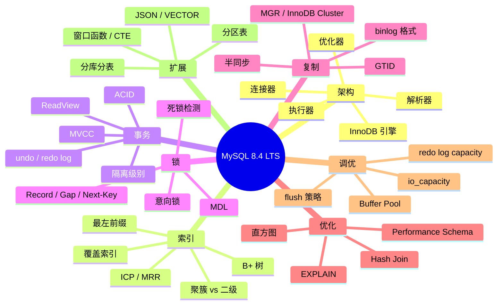

# MySQL 深度课程 · 综合测验

> 配套 [INDEX.md](./INDEX.md) 与 [ROADMAP.md](./ROADMAP.md)
>
> 共 100 题，覆盖 M01-M12 全部内容。题目按难度递增分四组：基础 / 进阶 / 高级 / 综合。
> 推荐用法：先合上书自己作答，再翻回各章对照。答错的题，把对应章节再看一遍。

---

## 第一组：基础（25 题，⭐⭐⭐）

### 架构与索引

1. SQL 从客户端到 InnoDB 存储引擎，依次经过哪几层？查询缓存为什么在 8.0 被移除？

2. InnoDB 的页（page）默认大小是多少？为什么选这个大小？

3. 聚簇索引和二级索引的本质区别是什么？为什么二级索引查询通常需要"回表"？

4. "最左前缀原则"在组合索引 `(a, b, c)` 上的具体含义是什么？以下查询哪些能用上该索引：`WHERE a=1` / `WHERE b=2` / `WHERE a=1 AND c=3` / `WHERE a=1 AND b=2 AND c=3`？

5. 什么是"覆盖索引"？怎么通过 EXPLAIN 判断查询是否用到了覆盖索引？

### 事务与锁

6. ACID 四个特性分别是什么？InnoDB 用什么机制保证 D（持久性）？

7. MySQL 的四种事务隔离级别（READ UNCOMMITTED / READ COMMITTED / REPEATABLE READ / SERIALIZABLE）依次解决了什么问题？InnoDB 默认是哪个？

8. 什么是 MVCC？它和锁的关系是什么？

9. `SELECT ... FOR UPDATE` 和 `SELECT ... LOCK IN SHARE MODE` 加的是什么锁？

10. 死锁是什么？InnoDB 怎么检测死锁？

### 复制与高可用

11. 异步复制、半同步复制、组复制（MGR）三者的一致性保证依次是什么？

12. binlog 的三种格式（STATEMENT / ROW / MIXED）各有什么优劣？默认是哪个？

13. GTID 相比传统 file:position 复制解决了什么问题？

14. MGR 推荐 3 / 5 / 7 节点，为什么不推荐 4 / 6？

15. 什么是脑裂？MGR 用什么机制避免脑裂？

### 优化与监控

16. EXPLAIN 输出里的 `type` 列从最差到最好依次是哪些？

17. `Using filesort` 和 `Using temporary` 在 Extra 列里出现意味着什么？怎么消除？

18. 什么是 ICP（Index Condition Pushdown）？

19. Performance Schema 与 information_schema 的本质区别？

20. `SHOW PROCESSLIST` 和 `SELECT * FROM performance_schema.threads` 各能看到什么？

### 现代特性

21. 窗口函数和 GROUP BY 的根本区别是什么？

22. CTE 是什么？什么场景下用递归 CTE？

23. MySQL 的 JSON 类型与 VARCHAR 存 JSON 字符串有什么区别？

24. 什么是生成列（Generated Column）？STORED 和 VIRTUAL 的区别？

25. 8.4 LTS 与 9.x 创新版的核心区别是什么？2026 年生产应该选哪个？

---

## 第二组：进阶（30 题，⭐⭐⭐⭐）

### 索引深度

26. InnoDB B+ 树的页内部结构（File Header / Page Header / 用户记录 / Page Directory）大致是什么样？

27. 为什么 InnoDB 主键推荐自增 BIGINT 而不是 UUID？UUID 主键带来的性能问题是什么？

28. 联合索引 `(a, b, c)` 上的 `ORDER BY b` 能否避免 filesort？为什么？

29. "索引下推 ICP" 对二级索引查询节省了什么操作？

30. MRR（Multi-Range Read）解决的是什么问题？

### MVCC 深度

31. ReadView 的结构是什么？包含哪四个核心字段？

32. RC 与 RR 隔离级别下 ReadView 的生成时机有什么不同？

33. undo log 链表在 MVCC 中扮演什么角色？

34. 长事务为什么对 MySQL 性能危害大？

35. purge 线程的作用是什么？

### 锁深度

36. 间隙锁（Gap Lock）和 Next-Key Lock 的关系？RC 级别下有间隙锁吗？

37. 意向锁（IS / IX）的作用是什么？为什么需要它？

38. 自增锁（AUTO-INC Lock）的三种模式（traditional / consecutive / interleaved）是什么？

39. INSERT INTO ... SELECT 默认会加什么锁？怎么避免锁住源表？

40. 什么是"插入意图锁"（Insert Intention Lock）？

### 复制深度

41. 双 1 模式 = sync_binlog=1 + innodb_flush_log_at_trx_commit=1。这能保证什么、不能保证什么？

42. 半同步复制的"timeout 后降级"是什么意思？为什么这是数据安全隐患？

43. 并行复制（MTS）的几种策略（DATABASE / LOGICAL_CLOCK / WRITESET）有什么区别？

44. 复制延迟的常见原因是什么？怎么诊断？

45. binlog 与 redo log 的两阶段提交（2PC）流程是怎样的？为什么需要 2PC？

### 性能调优

46. `innodb_buffer_pool_instances` 在 4GB / 32GB / 256GB Buffer Pool 下分别推荐多少？

47. `innodb_io_capacity` 设错的代价是什么？怎么测出合理值？

48. Buffer Pool 的 young / old 子链表是怎么防止全表扫污染热点的？

49. checkpoint 风暴的现象、原因、解决方法？

50. `innodb_flush_method = O_DIRECT` 在云盘上为什么不一定更好？

### 优化器与查询

51. 直方图统计（Histogram）解决了什么问题？什么时候需要手动建？

52. Hash Join（8.0.18+）相比 Nested Loop Join 的优势？什么场景下优化器会选 Hash Join？

53. 优化器 hint 与索引 hint（USE/FORCE/IGNORE INDEX）的区别？

54. `EXPLAIN ANALYZE`（8.0+）和 `EXPLAIN` 的区别？

55. 派生表（subquery in FROM）和 CTE 在 MySQL 中的执行差异？

---

## 第三组：高级（30 题，⭐⭐⭐⭐⭐）

### InnoDB 内部

56. 假设一行数据 200 字节，innodb_page_size = 16KB，主键 BIGINT。一棵 3 层 B+ 树大约能存多少行？

57. 自适应哈希索引（AHI）什么场景下应该关闭？

58. Change Buffer 为什么对**唯一索引**无效？

59. doublewrite buffer 防的"页撕裂"是什么？为什么不是冗余？

60. InnoDB 表空间 (.ibd) 文件的内部结构（segment / extent / page）？

### Performance Schema

61. `events_statements_summary_by_digest` 的 `digest` 字段是怎么生成的？带参数的 SQL 怎么聚合？

62. `events_waits_summary_global_by_event_name` 里 `wait/synch/mutex/...` 和 `wait/io/file/...` 类指标各代表什么？

63. 怎么用 PS 定位一次 P99 飙升？给出步骤。

64. sys schema 与 performance_schema 的关系？

65. PS 的 `consumers` 和 `instruments` 都开了，但是某些表为空，可能的原因？

### 锁与死锁

66. 给一个会产生死锁的两并发事务对，并解释 InnoDB 检测机制。

67. `next-key lock` 在范围查询 `WHERE id BETWEEN 10 AND 20` 下大致锁定的范围是什么？

68. 表 t 主键 id 上有 1, 5, 10, 15, 20。事务 A: `SELECT ... WHERE id = 10 FOR UPDATE`，事务 B 尝试 `INSERT (id=7)`，会被阻塞吗？为什么？

69. 同样表，事务 A: `SELECT ... WHERE id BETWEEN 5 AND 15 FOR UPDATE` (RR 级别)，事务 B 尝试 `INSERT (id=12)` 和 `INSERT (id=25)`，分别会被阻塞吗？

70. MDL（Metadata Lock）冲突常见场景？怎么避免大表 DDL 阻塞查询？

### 复制与 HA

71. MGR 的 certification 过程做什么？什么情况下事务会被认证失败回滚？

72. 3 节点 MGR 同时挂掉 2 个，剩 1 个节点会怎样？怎么恢复？

73. `group_replication_consistency = AFTER` 与默认 `EVENTUAL` 在写延迟上的差异？

74. 跨机房 30ms RTT 的 MGR 部署，单事务写延迟的下界？

75. ClusterSet 与传统跨地域异步复制相比，新增了什么？

### 分片与扩容

76. 一致性哈希解决了什么扩容问题？为什么生产中预分片方案更常用？

77. 跨片 JOIN 的三种处理方式（广播表 / 路由 JOIN / 应用层组合）各自适用场景？

78. 跨片深度分页 LIMIT 1000000, 20 的性能问题在哪？正确写法是什么？

79. Snowflake ID 的时钟回拨问题怎么解决？

80. 1024 虚拟 shard 分到 4 物理实例，扩容到 8 实例时迁移量？扩容到 16 呢？

### 现代 SQL

81. 写一个 SQL：每用户最近 3 条订单。给出窗口函数和 LATERAL 两种写法。

82. JSON 列的"部分更新"（partial update）什么时候生效？需要满足什么条件？

83. 多值索引（Multi-Valued Index）和生成列索引的区别？

84. 递归 CTE 生成连续日期，深度限制是多少？怎么调整？

85. `JSON_TABLE` 解决了什么问题？

---

## 第四组：综合应用（15 题，⭐⭐⭐⭐⭐+）

### 场景设计

86. **秒杀库存设计**：商品 10 万件，秒杀瞬间 10 万并发扣减。怎么设计表、索引、SQL 才能既无超卖又高吞吐？

87. **大表 DDL**：一个 10 亿行表要加索引。直接 `ALTER TABLE` / `pt-osc` / `gh-ost` / `INSTANT DDL` 各自适合什么场景？

88. **缓存与一致性**：MySQL + Redis 双写场景，旁路缓存模式（Cache-Aside）和写穿模式（Write-Through）各自的一致性问题？

89. **冷热分离**：日志类业务，最近 3 个月数据高频查询，3 个月以前的低频查询。设计一个冷热分层方案。

90. **跨地域容灾**：业务部署在 2 个地域，要求"主地域故障 30 分钟内切到备地域，丢失数据 < 1 分钟"。给出架构。

### 故障排查

91. **P99 飙升**：业务 P99 突然从 50ms 飙到 5s，每 10 分钟规律性出现 30 秒。给出排查步骤和最可能的原因。

92. **死锁频发**：业务凌晨批处理出现大量死锁。怎么定位？怎么修复？

93. **从库延迟暴涨**：一个一直健康的从库突然延迟从 0 涨到 1 小时。可能原因有哪些？怎么诊断？

94. **CPU 飙升**：MySQL CPU 突然 100% 持续 5 分钟。哪几个角度排查？

95. **磁盘空间告警**：MySQL 数据盘使用率 90%。在不能立即扩容的前提下，怎么紧急释放空间？

### 综合选型

96. 一个新业务预估 5 年内：数据量 < 1 TB，QPS < 5000，强一致要求，跨地域容灾。给出完整的 MySQL 架构方案（含版本、复制、备份、监控）。

97. 一个 5 年的老业务，单库 8 TB，写 QPS 已达 IO 极限，业务模块清晰。给出渐进式改造路线（不能停机）。

98. 一个 RAG 应用：知识库 100 万文档（embedding 1536 维），用户每次查询要在线检索 top-5。技术选型？

99. 一个 SaaS 业务，多租户隔离要求强，最大租户 1 TB，最小租户 1 GB。数据库怎么划分？

100. 公司 DBA 团队 2 人，要管理 50+ MySQL 实例。运维方案设计：自动化备份、监控告警、变更流程、灾备演练。

---

## 答题建议

### 自我评估

- **80+ 分**：MySQL 高级水平，可担任团队 MySQL 技术 owner
- **60-80 分**：MySQL 中高级，能独立解决大多数生产问题
- **40-60 分**：MySQL 中级，需要在工作中持续积累
- **< 40 分**：建议把对应章节重读，配合实操

### 实操建议

光看答案没用——做这些事情才能真正"会":

1. **本地装一个 MySQL 8.4**，跑遍每章的命令
2. **建一个 100 万行的表**，做索引 / EXPLAIN 实验
3. **模拟一次死锁**，看 `SHOW ENGINE INNODB STATUS` 输出
4. **搭一套 InnoDB Cluster** （3 个 Docker 容器即可）
5. **跑一次故障演练**：kill master、看 MGR 选举过程
6. **抓一次 P99 抖动**，用 Performance Schema 定位
7. **写一个 reshard 脚本**，把 1024 虚拟 shard 在 2 → 4 实例间迁移

---

## 重点知识图谱



---

## 关键参数速查

```ini
[mysqld]
# === InnoDB Buffer Pool ===
innodb_buffer_pool_size = 32G            # 物理内存 60-70%
innodb_buffer_pool_instances = 8         # ≥ 1GB / 实例

# === Redo Log (8.0.30+) ===
innodb_redo_log_capacity = 8G
innodb_flush_log_at_trx_commit = 1
sync_binlog = 1                          # 双 1

# === Flush ===
innodb_io_capacity = 4000                # SSD; NVMe 8000+
innodb_io_capacity_max = 8000
innodb_flush_method = O_DIRECT
innodb_flush_neighbors = 0
innodb_max_dirty_pages_pct = 75

# === binlog & GTID ===
log_bin = mysql-bin
binlog_format = ROW
binlog_row_image = MINIMAL
gtid_mode = ON
enforce_gtid_consistency = ON

# === 复制 ===
slave_parallel_workers = 8
slave_parallel_type = LOGICAL_CLOCK
slave_preserve_commit_order = ON

# === 安全 ===
sql_mode = STRICT_TRANS_TABLES,NO_ENGINE_SUBSTITUTION,ONLY_FULL_GROUP_BY
require_secure_transport = ON

# === 慢查询 ===
slow_query_log = ON
long_query_time = 0.1
log_queries_not_using_indexes = ON
```

---

## SQL 故障速查表

| 现象 | 第一步检查 |
|---|---|
| 慢 SQL | `EXPLAIN` / `events_statements_summary_by_digest` |
| 死锁 | `SHOW ENGINE INNODB STATUS\G` 看 `LATEST DETECTED DEADLOCK` |
| 锁等待 | `SELECT * FROM performance_schema.data_lock_waits` |
| 复制延迟 | `SHOW REPLICA STATUS\G` 看 Seconds_Behind_Source |
| CPU 高 | `SHOW PROCESSLIST` 看活跃线程，`PS.threads` 看 STATE |
| IO 高 | `events_waits_summary_global_by_event_name` 看 wait/io/file |
| 内存高 | `sys.memory_global_by_current_bytes` |
| 连接数高 | `SHOW STATUS LIKE 'Threads_%'` |
| 磁盘满 | `information_schema.tables` 按 DATA_LENGTH 排序找大表 |
| 数据丢失 | binlog 是最后的救命稻草——别用 `mysqldump --master-data=2` 备份才会有 |

---

## 结语

MySQL 是一门"看着简单实则博大"的技术。这套课程 12 篇 + 100 题，覆盖了从架构到调优、从单机到分布式、从经典 8.0 到前沿 9.x 的完整图景。

但**真正的进步发生在生产环境**——一次次故障复盘、一行行 SQL 优化、一次次架构演进。这套教材是地图，路要自己走。

> 🔁 反馈：每章学完后，回来挑相关题目作答；3 个月后全套再做一遍，对比进步

祝你成为团队里的 MySQL 顶梁柱。

---

## 相关资源

- [INDEX.md](./INDEX.md) — 课程总目录
- [ROADMAP.md](./ROADMAP.md) — Mermaid 可视化路线图
- 官方文档：[dev.mysql.com/doc/refman/8.4](https://dev.mysql.com/doc/refman/8.4/en/)
- 源码：[github.com/mysql/mysql-server](https://github.com/mysql/mysql-server)
- Percona 博客：[percona.com/blog](https://www.percona.com/blog/)
- MySQL 性能博客：Jeremy Cole / 何登成 / 李海翔
