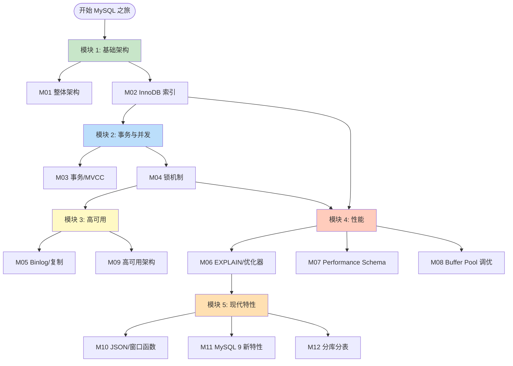
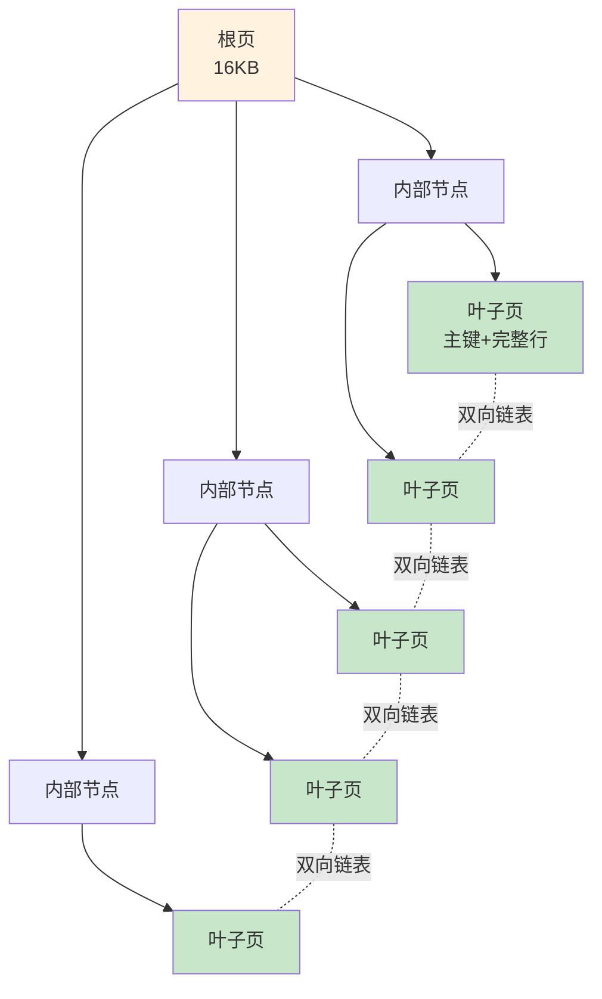
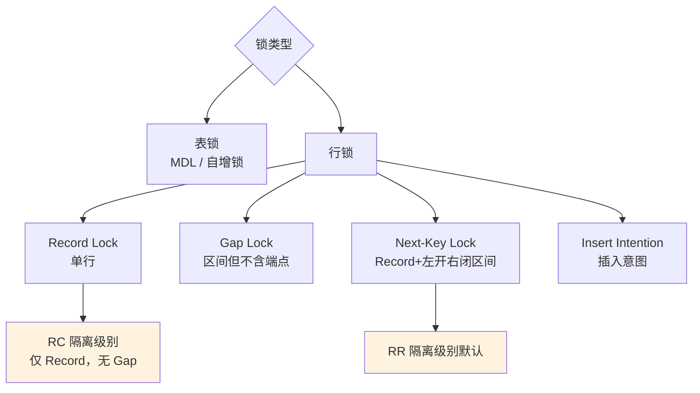
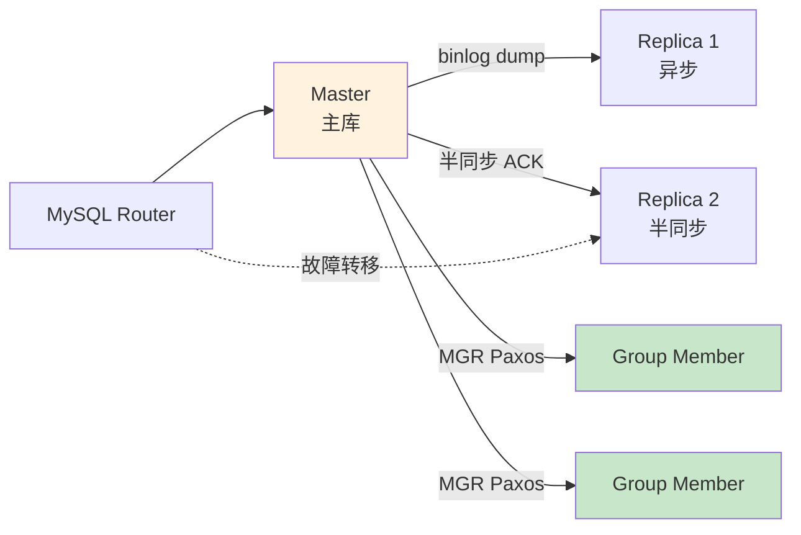
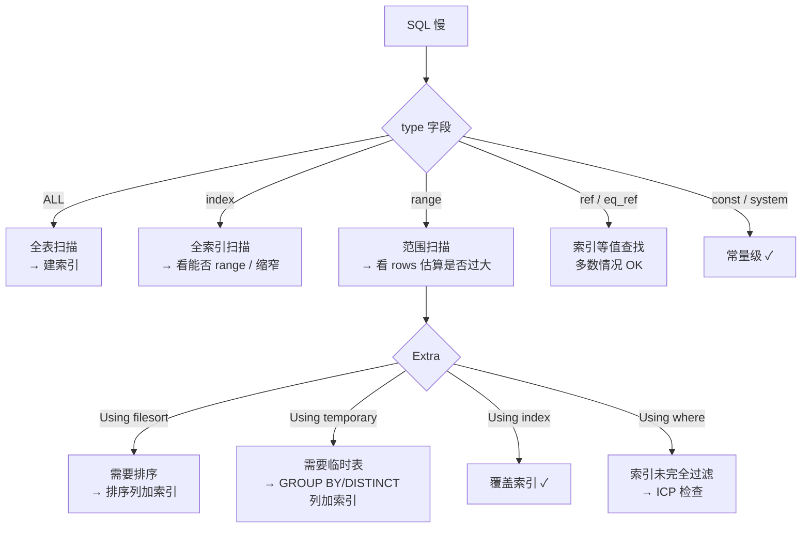
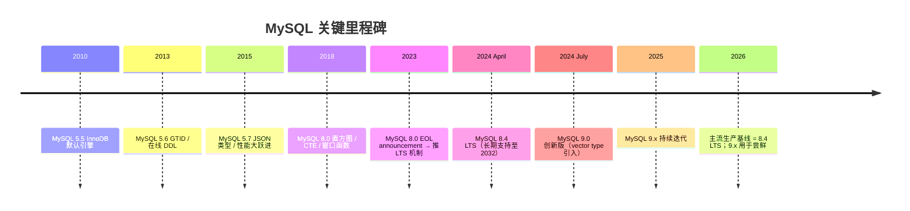

# MySQL 路线图 · Mermaid 可视化

> 配合 [INDEX.md](./INDEX.md) 与 [QUIZ.md](./QUIZ.md) 使用
>
> **📅 内容基准：MySQL 8.4 LTS + 9.x**（2026-05 时主流稳定版）

---

## 🗺️ 全景路线图

---

## 🔑 SQL 一句话经过的层

---

## 🌲 InnoDB B+ 树结构（聚簇索引）

二级索引叶子页存"索引列 + 主键"——查二级索引找到主键，**再用主键回表取完整行**（除非覆盖索引）。

---

## 🔒 锁等级

---

## 🔄 复制拓扑

---

## ⚡ EXPLAIN 速决树

---

## 🆕 MySQL 主要版本时间线

---

