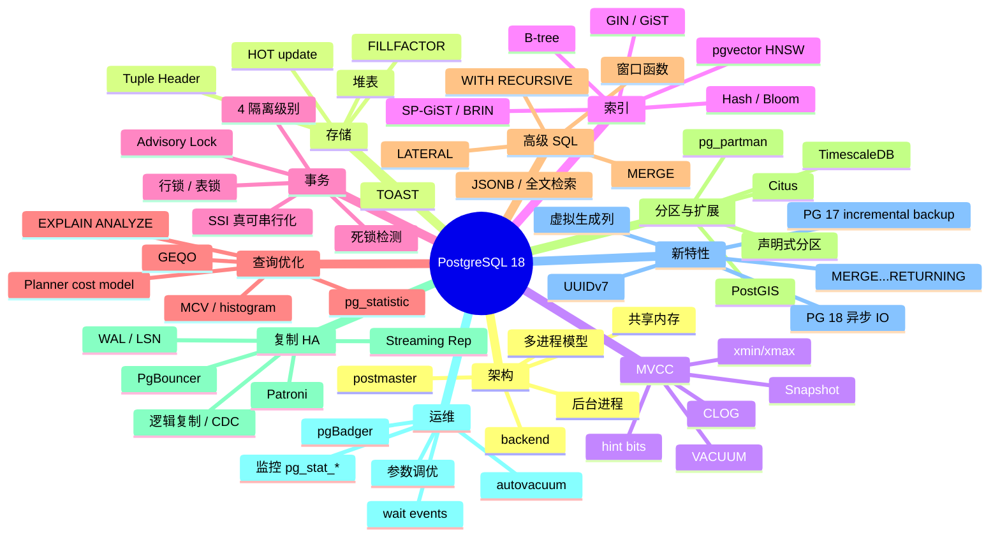

# PostgreSQL 深度课程 · 综合测验

> 配套 [INDEX.md](./INDEX.md) 与 [ROADMAP.md](./ROADMAP.md)
>
> 共 100 题，覆盖 P01-P22 全部内容。题目按难度递增分四组：基础 / 进阶 / 高级 / 综合。
> 推荐用法：先合上书自己作答，再翻回各章对照。答错的题，把对应章节再看一遍。

---

## 第一组：基础（25 题，⭐⭐⭐）

### 架构与存储

1. PostgreSQL 是多进程还是多线程模型？为什么这种选择让 PG 必须搭配 PgBouncer 才能撑高并发？

2. `postmaster` 进程在 PG 启动时做了什么？它和 `backend` 进程是什么关系？

3. `$PGDATA` 目录下的 `base/` / `global/` / `pg_wal/` / `pg_xact/` 各存什么？

4. PG 默认页大小是多少？为什么和 MySQL InnoDB 的 16KB 不一样？

5. 为什么 PostgreSQL 的堆表"没有聚簇索引"？这与 MySQL InnoDB 的设计本质区别是什么？

### MVCC 与可见性

6. `xmin` 和 `xmax` 分别记录什么？INSERT、UPDATE、DELETE 时它们怎么变化？

7. 为什么说 PostgreSQL 是"真 MVCC"而 MySQL 是"undo-log MVCC"？这种差异带来什么运维代价？

8. CLOG（`pg_xact`）记录什么？它的状态有哪几种？

9. PG 的 Snapshot 由哪几个核心字段构成？

10. 什么是 `hint bits`？它解决了什么性能问题？

### 索引基础

11. PG 内置的 6 大索引类型（B-tree / Hash / GIN / GiST / SP-GiST / BRIN）各自的典型适用场景是？

12. `CREATE INDEX` 和 `CREATE INDEX CONCURRENTLY` 的核心区别？哪个会锁表？

13. JSONB 列上的 GIN 索引有两种 opclass：`jsonb_ops` 和 `jsonb_path_ops`，区别是什么？

14. pgvector 的两种索引（IVFFlat 与 HNSW）在召回率、构建时间、查询性能上各有什么权衡？

15. 部分索引（partial index）和表达式索引（expression index）分别解决什么问题？举例。

### 事务与锁

16. PostgreSQL 支持的 4 个隔离级别，哪个是默认？为什么 READ UNCOMMITTED 实际等价于 READ COMMITTED？

17. PG 的 Serializable 隔离级别（SSI）和 MySQL 的 Repeatable Read（next-key lock）实现机制有什么本质不同？

18. PG 怎么检测死锁？默认超时是多少？被打破的是哪一个事务？

19. `SELECT ... FOR UPDATE SKIP LOCKED` 适合什么场景？

20. 什么是 advisory lock？什么时候用它而不是行锁？

### 复制与高可用

21. PG 的物理流复制和逻辑复制最本质的区别是什么？

22. `wal_level` 的三个档（minimal / replica / logical）分别影响什么能力？

23. 什么是 replication slot？为什么生产环境配置不当反而会"撑爆磁盘"？

24. PgBouncer 三种 pool_mode（session / transaction / statement）的兼容性和性能权衡是什么？

25. 同步复制下 `synchronous_commit = remote_apply` vs `remote_write` vs `on` 的语义有什么差异？

---

## 第二组：进阶（30 题，⭐⭐⭐⭐）

### 存储与 TOAST

26. PG 的 Tuple Header 24 字节包含哪些字段？为什么 PG 单行最小开销比 MySQL 大很多？

27. TOAST 触发的阈值（默认 ~2KB）是怎么决定的？四种 storage 策略（PLAIN / EXTENDED / EXTERNAL / MAIN）的差异？

28. TOAST 压缩算法 pglz 和 lz4（PG 14+）的取舍是什么？什么场景应该切换？

29. 什么是 HOT update（heap-only tuple）？它能减少哪种"膨胀"？触发条件是什么？

30. `FILLFACTOR` 参数怎么影响 HOT update 的命中率？OLTP 表建议设多少？

### B-tree 索引深度

31. PG 13 引入的 B-tree deduplication 解决了什么问题？对哪种工作负载收益最大？

32. PG 14 引入的 bottom-up index deletion 和传统 vacuum 清理索引的区别？

33. `INCLUDE` 列与普通索引列在 B-tree 中存的位置有什么不同？为什么 INCLUDE 不能用于排序？

34. 索引膨胀（index bloat）和表膨胀的关系？怎么在线重建一个膨胀的索引？

35. 多列 B-tree 索引 `(a, b, c)` 上 `WHERE a=1 AND c=3` 能用到索引吗？和 MySQL 的最左前缀有什么细微差异？

### MVCC 与 VACUUM 深度

36. dead tuple 什么时候才能被 vacuum 回收？为什么"长事务"会阻塞 vacuum？

37. autovacuum 默认的触发条件公式是什么？（涉及 `n_dead_tup`、scale_factor、threshold）

38. 什么是 transaction ID wraparound？PG 用什么机制避免它发生？

39. `VACUUM` 和 `VACUUM FULL` 的根本区别是什么？为什么生产环境很少敢直接执行 FULL？

40. 阻塞 vacuum 的"三大杀手"是哪三个？怎么监控发现？

### GIN/GiST/BRIN

41. GIN 的 `fastupdate` 选项是什么？它牺牲了什么换取了什么？

42. BRIN 索引在什么数据分布上"近乎免费"地高效？什么数据分布会让它退化？

43. PostGIS 默认推荐 GiST 还是 GIN 索引？为什么？

44. 在一个 1 亿行的日志表上，按 `created_at` 的范围扫描，B-tree 和 BRIN 应该怎么选？

### 锁与并发

45. PG 表锁的 8 个等级里，`SHARE UPDATE EXCLUSIVE` 比 `ACCESS EXCLUSIVE` 弱在哪里？哪些操作用它？

46. `FOR UPDATE` 和 `FOR NO KEY UPDATE` 的差异是什么？什么时候后者更合适？

47. 在 RC 隔离级别下，PG 会出现"幻读"吗？为什么？

48. 为什么 SSI 隔离级别下，一个看似只读的事务也可能被"abort"？

49. 用 `pg_blocking_pids()` 和 `pg_stat_activity` 怎么画一个阻塞树？

### 查询规划

50. `pg_statistic` 系统视图里 `MCV` 和 `histogram_bounds` 分别用来估算什么？

51. `default_statistics_target` 调高的代价是什么？什么场景下应该把某列的 statistics target 单独调高？

52. PG 12+ 的 CTE 默认 inline 了，这和 PG 11- 的 optimization fence 行为相比解决了什么问题？又带来什么新坑？

53. 为什么 PG 不支持 query hint？社区方案 `pg_hint_plan` 在什么场景下值得用？

54. `random_page_cost` 在 SSD 上推荐调成多少？为什么？

### EXPLAIN 与调优

55. `EXPLAIN (ANALYZE, BUFFERS)` 里的 `shared hit / read / dirtied / written` 各代表什么？怎么用它定位"冷查询"？

56. Bitmap Heap Scan + Bitmap Index Scan 这种"先建位图再回表"的方式，相比直接 Index Scan 优势是什么？

57. `Nested Loop` / `Hash Join` / `Merge Join` 各自最佳的输入规模和索引要求？

58. `Memoize`（PG 14+）解决了什么问题？

59. `pg_stat_statements` 里 `query` 字段是怎么 normalize 的？为什么 `WHERE id=1` 和 `WHERE id=2` 是同一行统计？

60. JIT 编译（PG 11+）什么时候有收益，什么时候反而拖慢？

---

## 第三组：高级（25 题，⭐⭐⭐⭐⭐）

### 索引深度实战

61. 设计一个 5000 万行订单表的索引：常见查询有 `(user_id, status) WHERE status='paid' ORDER BY created_at DESC LIMIT 20`。给出完整的索引方案并说明权衡。

62. 在一个 JSONB 列 `data` 上，高频查询是 `WHERE data->'meta'->>'channel' = 'app'`。怎么用最小代价加速？

63. pgvector 1536 维 embedding，1 千万条数据。HNSW 的 `m` 和 `ef_construction` 选多少？查询时 `ef_search` 怎么权衡 latency 与召回率？

64. 写一个查询找出"完全没被用到的索引"和"扫了很多但写多读少的索引"。

### MVCC 与膨胀治理

65. 一张 200GB 的表，`n_dead_tup` 占 40%。在不停机的前提下怎么处理？给出 3 种方案的对比（VACUUM FULL / pg_repack / 重建表 + 切换）。

66. 模拟一个会触发 wraparound 警告的场景。`autovacuum_freeze_max_age` 默认 2 亿，到达时数据库行为是什么？

67. 一个长跑的 `pg_dump` 阻塞了 vacuum，导致 dead tuple 累积。你作为 DBA 怎么决策（中断备份 vs 让它继续）？

68. autovacuum 在凌晨"卡住一张大表"，影响日间业务。给出 3 种解决思路（限速、分区、手动 vacuum）。

### 复制与高可用

69. 你的主备 streaming replication 突然延迟从秒级飙升到小时级，从 `pg_stat_replication` 看 `flush_lsn` 远落后于 `sent_lsn`。可能原因有哪些？怎么排查？

70. replication slot 长期未消费，磁盘快满了。你能直接 `pg_drop_replication_slot` 吗？怎么评估影响？

71. 用逻辑复制做 PG 14 → PG 18 零停机升级，写出关键 5 步流程。期间如何处理 DDL 不复制的问题？

72. 双向逻辑复制（PG 16+）的循环复制怎么避免？`origin` 过滤是怎么工作的？

73. Patroni + etcd 三节点集群，etcd 整体宕机时 Patroni 的行为是什么？为什么这是"安全失败"？

### 高级 SQL

74. 用 `LATERAL JOIN` 重写"每个用户取最新 5 条订单"。和 `ROW_NUMBER() OVER` 方案各有什么优劣？

75. 写一个 `WITH RECURSIVE` 查出某员工的所有下属（多级树形），并用 PG 14+ 的 `CYCLE` 子句防环。

76. 用 `MERGE`（PG 15+）写一个"存在则更新版本+1，不存在则插入"。和 `INSERT ... ON CONFLICT` 各自适合什么？

77. `GROUPING SETS / ROLLUP / CUBE` 三者的语义差异？什么场景用 `GROUPING()` 函数？

### 分区与扩展

78. 一张按日分区的 IoT 时序表，每天 10 亿行，保留 90 天。用 pg_partman vs TimescaleDB 各自的权衡？

79. Citus 的分布式表、引用表、本地表分别适合什么场景？协调器（coordinator）的瓶颈在哪里？

80. PostGIS 中 GEOMETRY 和 GEOGRAPHY 的差异？计算"两点距离"哪个更准、哪个更快？

### 参数调优

81. 16 核 64GB SSD 服务器，纯 OLTP 业务，QPS 5000。给出 `shared_buffers` / `work_mem` / `maintenance_work_mem` / `effective_cache_size` / `checkpoint_timeout` / `max_wal_size` 的推荐值并解释依据。

82. 为什么 `work_mem` 不能简单调大？它的"放大效应"具体怎么算？

83. `synchronous_commit = off` 适合什么场景？最坏情况下会丢多少数据？

84. `checkpoint_completion_target = 0.9` 设置背后的原理是什么？

### 监控诊断

85. 你看到 `pg_stat_activity` 里大量 `wait_event_type = LWLock`、`wait_event = BufferContent`。最可能的瓶颈是什么？

---

## 第四组：综合实战（15 题，⭐⭐⭐⭐⭐）

### 故障诊断

86. **症状**：业务发现 P99 从 50ms 突涨到 5s。`pg_stat_activity` 显示大量 `idle in transaction (aborted)`，CPU 不高，IO 不高。你怎么 5 分钟内定位？

87. **症状**：autovacuum 在主库吃掉 50% IO，业务受影响。`autovacuum_vacuum_cost_delay` 已经调到 20ms 没改善。可能的根因有哪些？

88. **症状**：备库延迟越来越大，`pg_stat_replication` 看 `replay_lsn` 远落后于 `flush_lsn`。可能原因？

89. **症状**：刚执行完 `VACUUM FULL` 的表磁盘空间没释放，反而看起来更大。可能是什么原因？

90. **症状**：一个原本几十毫秒的 SQL，跑了几个月后突然变成 30 秒。`EXPLAIN` 显示走了 Seq Scan。怎么排查？

### 选型与架构

91. **场景**：新业务上线，预估 3 年内数据量 < 500GB，QPS < 3000，强一致要求，跨可用区容灾。给出 PG 部署方案（含版本、复制拓扑、备份、监控、客户端连接策略）。

92. **场景**：把现有 MySQL 5.7 业务（10 TB 单库）迁到 PostgreSQL 17。给出迁移方案（评估、工具、灰度、回滚预案）。

93. **场景**：一个 RAG 应用，知识库 5000 万文档（1536 维 embedding），每次查询要先做向量召回 top-100 再做关键词 rerank。技术选型：纯 PG（pgvector + 全文检索） vs PG + Elasticsearch + Qdrant 组合，给出对比建议。

94. **场景**：SaaS 多租户，最大租户 200GB、最小租户 100MB，要强隔离。PG 的三种隔离方案（schema 级、database 级、Row-Level Security）各自适用范围？

95. **场景**：一个金融对账系统，对一致性要求极高，绝不能多记/少记一笔。事务隔离级别选 Read Committed 还是 Serializable？为什么？

### 运维与升级

96. **任务**：把生产 PG 14.5 升级到 PG 17.4，停机时间要求 < 1 分钟。给出可行方案（pg_upgrade vs 逻辑复制）的步骤和回滚预案。

97. **任务**：PgBouncer 在 transaction pool 模式下，应用代码报错"prepared statement does not exist"。可能原因？PG 17 是否解决了这个？

98. **任务**：你接手了一个老 PG 集群，发现 `max_connections = 5000`，平均活跃只有 50。这有什么风险？怎么改？

### 工程实践

99. **任务**：设计一张"用户行为日志"表，每天 50 亿行，保留 30 天，需要支持按 user_id 查近 7 天日志（< 100ms）。给出完整方案（分区、索引、压缩、归档）。

100. **任务**：公司有 30+ PG 实例，2 个 DBA。给出运维体系设计（备份策略、监控告警、变更流程、故障演练、容量规划）。

---

## 答题建议

### 自我评估

- **80+ 分**：PG 高级水平，可担任团队 PG 技术 owner / 平台架构师
- **60-80 分**：PG 中高级，能独立解决大多数生产问题
- **40-60 分**：PG 中级，需要继续在工作中积累
- **< 40 分**：建议把对应章节重读，配合实操

### 实操建议

光看答案没用——做这些事情才能真正"会":

1. **本地装一个 PG 18**（`docker run -d -p 5432:5432 -e POSTGRES_PASSWORD=pwd postgres:18`），跑遍每章命令
2. **建一个 1 亿行的表**，做 B-tree / GIN / BRIN 索引对比实验
3. **故意造一次膨胀**：长事务 + 大量 UPDATE → 看 dead tuple 涨、autovacuum 怎么处理
4. **模拟一次死锁**，看日志输出和 `pg_locks` 输出
5. **搭一个 3 节点 Patroni + etcd 集群**（Docker Compose 即可）
6. **跑一次主备切换**：kill primary → 观察 Patroni 选举 → 用 `pg_rewind` 把旧主拉回
7. **做一次跨大版本逻辑复制升级**：PG 14 → PG 18 不停机迁移演练
8. **抓一次慢 SQL**：用 `auto_explain` + `pg_stat_statements` 定位 → 用 `EXPLAIN (ANALYZE, BUFFERS)` 分析 → 加索引 → 验证
9. **跑 pgvector + 1000 万条 embedding**：对比 IVFFlat 和 HNSW 的召回率、QPS
10. **用 TimescaleDB 把一张时序表压缩到 1/10**，对比查询性能

---

## 重点知识图谱



---

## 关键参数速查

```ini
# === 内存（16C 64G SSD OLTP 示例）===
shared_buffers = 16GB                       # 物理内存 25%
effective_cache_size = 48GB                 # 物理内存 75%（planner 提示）
work_mem = 32MB                             # per-operation, 注意并发放大
maintenance_work_mem = 2GB                  # VACUUM / CREATE INDEX
wal_buffers = 64MB                          # 默认 1/32 shared_buffers，最大 16MB

# === WAL ===
wal_level = replica                         # logical 才能逻辑复制
max_wal_size = 16GB                         # 控制 checkpoint 频率
min_wal_size = 2GB
checkpoint_timeout = 15min
checkpoint_completion_target = 0.9
wal_compression = on                        # 减带宽
synchronous_commit = on                     # 不能 off 除非允许丢数据

# === Autovacuum ===
autovacuum = on
autovacuum_max_workers = 6                  # 大库可调高
autovacuum_naptime = 30s
autovacuum_vacuum_scale_factor = 0.1        # 默认 0.2 偏保守
autovacuum_vacuum_cost_delay = 2ms          # 默认 2ms（PG 12+）
autovacuum_freeze_max_age = 200000000

# === 并行 ===
max_worker_processes = 16
max_parallel_workers = 8
max_parallel_workers_per_gather = 4
max_parallel_maintenance_workers = 4

# === 连接 ===
max_connections = 200                       # 建议 ≤300，更多用 PgBouncer

# === Planner ===
random_page_cost = 1.1                      # SSD（HDD 用默认 4.0）
effective_io_concurrency = 200              # SSD
default_statistics_target = 100             # 偏少：可单列调高

# === 日志（pgBadger 友好）===
log_destination = 'csvlog'
logging_collector = on
log_min_duration_statement = 500ms
log_checkpoints = on
log_lock_waits = on
log_temp_files = 0
log_autovacuum_min_duration = 1s
log_line_prefix = '%t [%p]: user=%u,db=%d,client=%h '
```

---

## 结语

PostgreSQL 是一门"看着简单实则博大"的技术——它既是 OLTP 主力，又是 GIS / 时序 / 向量 / 全文 / 分布式的万能扩展底座。这套课程 22 篇 + 100 题，覆盖了从内核到生态、从单机到多集群、从 PG 14 到最新的 PG 18 的完整图景。

但**真正的进步发生在生产环境**——一次次膨胀治理、一次次故障切换、一行行 SQL 调优。这套教材是地图，路要自己走。

> 🔁 反馈：每章学完后，回来挑相关题目作答；3 个月后全套再做一遍，对比进步

祝你成为团队里的 PostgreSQL 顶梁柱。

---

## 相关资源

- [INDEX.md](./INDEX.md) — 课程总目录
- [ROADMAP.md](./ROADMAP.md) — Mermaid 可视化路线图
- 官方文档：[postgresql.org/docs/18](https://www.postgresql.org/docs/18/) / [17 LTS](https://www.postgresql.org/docs/17/)
- 源码：[github.com/postgres/postgres](https://github.com/postgres/postgres)
- 必读书：《PostgreSQL Internals》(Egor Rogov)
- 社区博客：[pganalyze.com/blog](https://pganalyze.com/blog) / [crunchydata.com/blog](https://www.crunchydata.com/blog)
- 邮件列表：pgsql-hackers / pgsql-general
- 国内社区：PostgresChina（公众号 / 大会）
