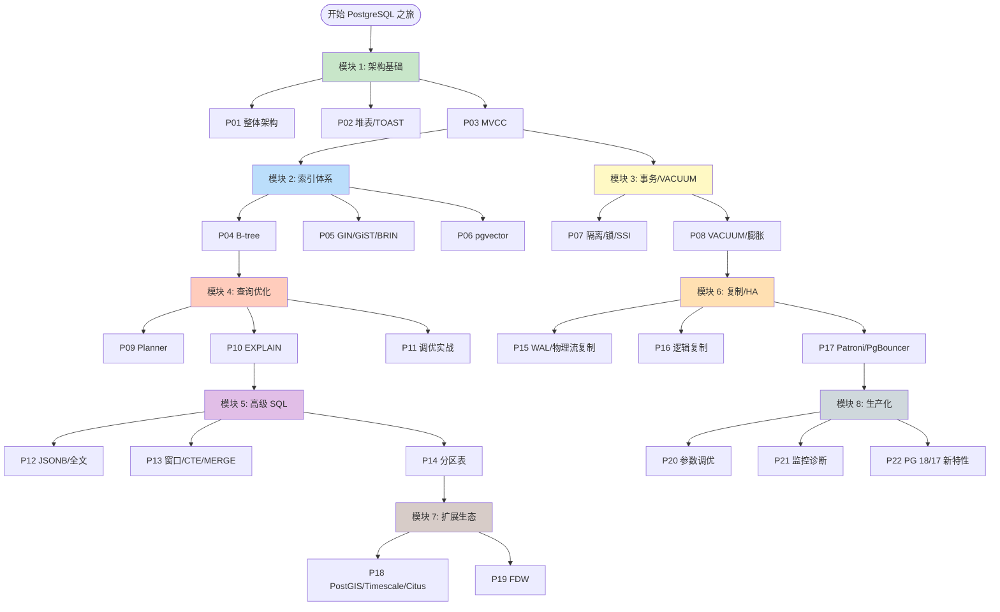
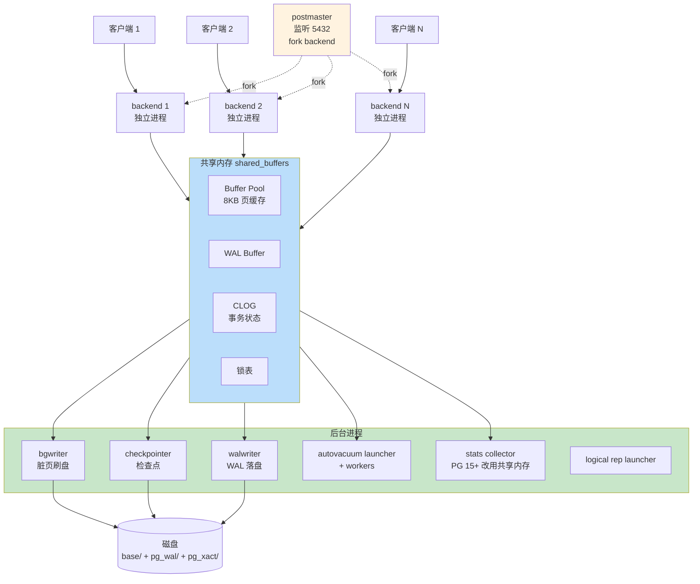
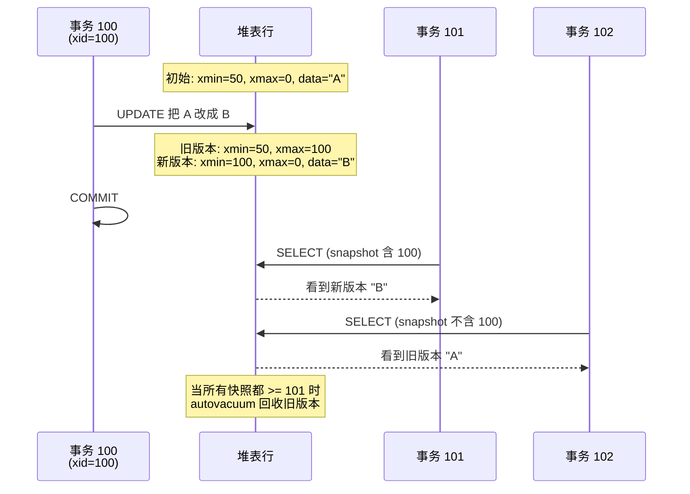
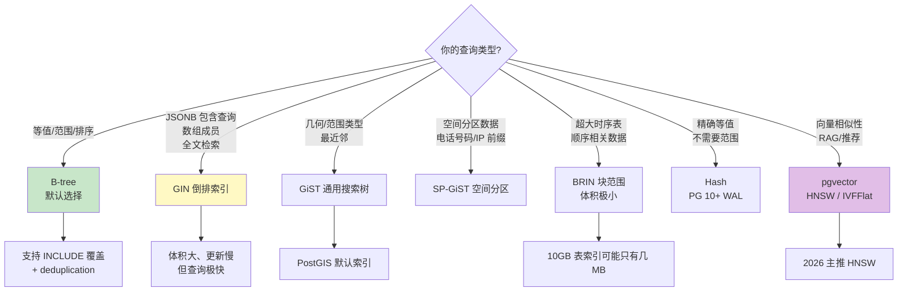
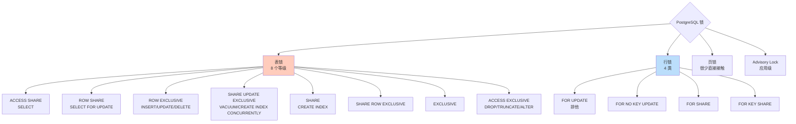
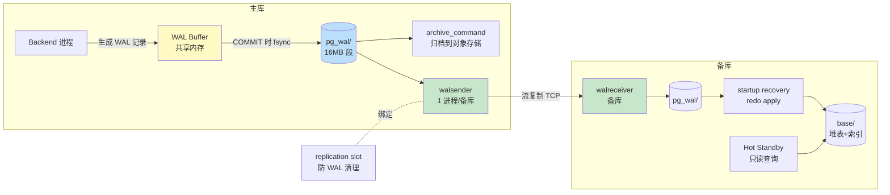
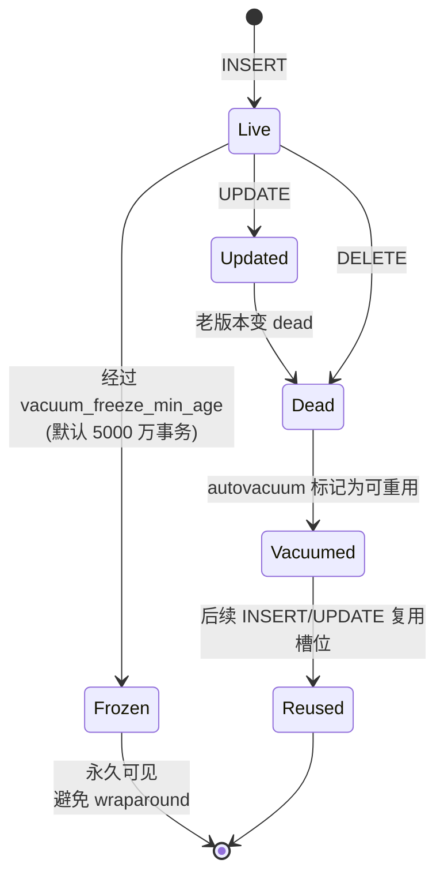
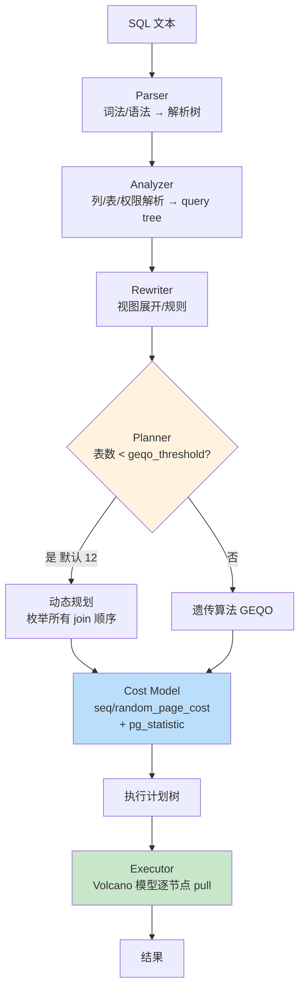
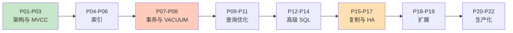

# PostgreSQL 路线图 · Mermaid 可视化

> 配合 [INDEX.md](./INDEX.md) 与 [QUIZ.md](./QUIZ.md) 使用
>
> **📅 内容基准：PostgreSQL 18 + 17**（2026-05 时主流稳定版；PostgreSQL 无官方 LTS，每个大版本支持 5 年）

---

## 🗺️ 全景路线图

---

## 🏛️ PostgreSQL 进程模型

**关键差异（vs MySQL）**：PG 是**多进程**模型（每连接 1 进程，约 10MB），MySQL 是多线程；这意味着 PG **必须配 PgBouncer 连接池**，否则 1000 并发 = 10GB+ 内存。

---

## 🧬 MVCC 行版本演化

**与 MySQL 的本质差异**：
- MySQL：旧版本走 undo log，由 purge 线程清理
- PostgreSQL：**旧版本就在堆里**，autovacuum 必须把它们标记为 dead 并回收——这就是 PG 独有的"膨胀"问题来源

---

## 🌳 索引家族决策树

---

## 🔒 锁等级图

---

## 🔄 WAL + 复制流

---

## 🩹 VACUUM 生命周期

---

## 📊 查询规划器决策

---

## 🚦 学习顺序建议

按顺序读 = 完整心智模型；按需读 = 看 [INDEX.md](./INDEX.md) 中的"学习路径"小节。
