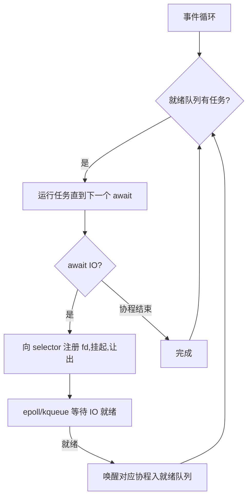

# 精通 Python asyncio 与协程

> asyncio 让单线程扛住海量并发 IO——这是现代 Python Web/网络服务(FastAPI、aiohttp)的基石。但它也最容易写错:一个阻塞调用就能拖垮整个事件循环。面试必问:"async/await 原理?""事件循环怎么调度?"本篇讲透,紧承 [P17 GIL](./P17-精通-Python-GIL原理.md)、[P05 生成器](./P05-精通-Python-迭代器与生成器.md),对比 [P20 线程](./P20-精通-Python-多线程threading.md)。
>
> **📅 基准:2026 年 6 月,CPython 3.13 / 3.14,TaskGroup 主流。**

---

## 一、为什么需要 asyncio

多线程做 IO 并发(见 [P20](./P20-精通-Python-多线程threading.md))受限于线程开销——几千个线程就吃大量内存和切换成本。**asyncio 用单线程 + 协程**实现高并发 IO:成千上万个并发连接,只需一个线程、极少资源。

核心思想:**协作式并发**——不靠 OS 抢占式切换线程,而是协程在**等待 IO 时主动让出**控制权,让事件循环去跑别的协程。等 IO 就绪再回来继续。一个线程"轮流推进"海量协程,谁也不闲着等。

---

## 二、协程:async / await

```python
import asyncio
async def fetch(url):              # async def 定义协程函数
    print(f"start {url}")
    await asyncio.sleep(1)         # await:挂起,让出控制权(模拟 IO 等待)
    print(f"done {url}")
    return url

async def main():
    # 并发跑三个,总耗时约 1 秒(而非 3 秒)
    results = await asyncio.gather(fetch("a"), fetch("b"), fetch("c"))

asyncio.run(main())               # 启动事件循环跑 main
```

- **`async def`** 定义**协程函数**,调用它返回一个**协程对象**(不立即执行,类似生成器,见 [P05](./P05-精通-Python-迭代器与生成器.md))。
- **`await x`**:等待一个 awaitable 完成;关键是它**在等待期间挂起当前协程、把控制权交还事件循环**,让别的协程运行。只能在 `async def` 里用。
- **`asyncio.run(coro)`**:创建事件循环、跑协程、收尾——程序的异步入口。

---

## 三、事件循环:协作式调度

**事件循环(event loop)**是 asyncio 的心脏——一个单线程的循环,管理所有协程的调度:



- 协程运行到 `await` 一个 IO 时,事件循环把这个 IO(fd)注册到操作系统的 **IO 多路复用**(epoll/kqueue/IOCP),然后**挂起该协程、去运行就绪队列里的其他协程**。
- 当 OS 通知某 IO 就绪,事件循环**唤醒**对应协程,从 `await` 处继续。
- 全程**单线程**:同一时刻只有一个协程在跑,切换发生在 `await` 点(协作式,非抢占)。

---

## 四、Task、gather、TaskGroup

`await coro` 只是**顺序等待**一个协程;要**并发**跑多个,需要把协程包装成 **Task**(调度到事件循环并发执行):

```python
# 并发的几种方式
task = asyncio.create_task(fetch("a"))   # 立即调度,返回 Task,可稍后 await
result = await task

results = await asyncio.gather(c1, c2, c3)   # 并发跑并收集所有结果

async with asyncio.TaskGroup() as tg:        # 3.11+ 结构化并发(推荐)
    t1 = tg.create_task(fetch("a"))
    t2 = tg.create_task(fetch("b"))
# 退出 with 时等所有任务完成;任一失败则取消其余并抛 ExceptionGroup
```

- **`create_task`** 把协程变成并发执行的 Task(注意:**要持有 Task 引用**,否则可能被 GC,见陷阱)。
- **`gather`**:并发运行多个、汇总结果(`return_exceptions=True` 可收集异常而不中断)。
- **`TaskGroup`(3.11)**:结构化并发——统一管理一组任务的生命周期、取消、异常(用 `except*` 处理 `ExceptionGroup`,见 [P08](./P08-精通-Python-异常处理.md)),是现代推荐写法。

---

## 五、协程的本质

asyncio 协程是从**生成器**(见 [P05](./P05-精通-Python-迭代器与生成器.md))演进来的:

- 早期(3.4)用生成器 + `yield from` + `@asyncio.coroutine` 实现协程——靠生成器的**暂停/恢复**能力(`yield` 挂起、`send` 喂值恢复)。
- 3.5 引入原生 `async`/`await` 语法,让协程成为一等概念,但**底层机制仍是"可暂停可恢复的函数"**:`await` 处暂停、保存状态,事件循环之后再恢复它。
- 所以"协程"= 可在 `await` 点挂起/恢复的函数 + 事件循环调度。理解了生成器的暂停恢复,就理解了协程。

awaitable 三类:**协程**、**Task**(协程的并发包装)、**Future**(底层的"将来会有结果"的占位)。

---

## 六、何时用 asyncio

- **适合 IO 密集 + 高并发**:海量网络连接/请求、API 网关、爬虫、聊天/推送服务、微服务间调用——单线程扛几万并发连接,资源效率远超多线程。
- **不解决 CPU 并行**:协程在单线程,CPU 密集任务会**霸占事件循环**(没有 await 让出点),把整个服务卡死;CPU 活要 `run_in_executor` 丢给线程/进程池或交给多进程(见 [P21](./P21-精通-Python-多进程multiprocessing.md)/[P24](./P24-精通-Python-并发选型与free-threading.md))。
- **要求全链路异步**:用到的库必须是异步的(aiohttp/httpx、asyncpg、aioredis);**混入同步阻塞调用会毁掉并发**(见 [P23](./P23-精通-Python-异步实战与陷阱.md))。

---

## 陷阱清单

- **在协程里做阻塞调用**:`time.sleep`、`requests.get`、同步 DB 查询会**阻塞整个事件循环**,所有协程一起卡死。用异步库或 `run_in_executor`(见 [P23](./P23-精通-Python-异步实战与陷阱.md))。
- **忘了 `await`**:`fetch()` 不 await 只是创建协程对象、不执行(还会 RuntimeWarning: coroutine never awaited)。
- **`create_task` 不保存引用**:任务可能被 GC 回收导致"任务消失";保存引用或用 TaskGroup。
- **在协程里跑 CPU 密集**:没有 await 让出,霸占事件循环;丢给 executor。
- **同步代码里直接 `await`**:`await` 只能在 `async def` 内用。
- **嵌套 `asyncio.run`**:它创建新事件循环,不能在已运行的循环里调用。
- **协程异常未处理**:`gather` 默认一个失败就抛(其余继续跑但结果丢);用 `return_exceptions=True` 或 TaskGroup。
- **忘记取消/超时**:用 `asyncio.timeout`(3.11)/`wait_for` 加超时,清理用 try/finally 处理 `CancelledError`。

---

## 2026 现状

- **asyncio 是高并发 IO 服务的主流**:FastAPI、aiohttp、httpx、asyncpg、SQLAlchemy 2.0 async 等生态成熟(见 [P28](./P28-精通-Python-Web框架与WSGI-ASGI.md)/[P29](./P29-精通-Python-数据库访问与ORM.md))。
- **`TaskGroup`(3.11)+ `except*` 异常组 + `asyncio.timeout`** 把结构化并发做成标配,取代裸 `gather`/`wait_for` 的旧写法。
- **`uvloop`** 用 Cython/libuv 实现更快的事件循环,生产中常用以提速。
- **虚拟线程 vs asyncio**:Java 21 虚拟线程([J30](../java/INDEX.md))用"同步写法 + 自动让出"达到类似效果,有人认为更易用;Python 仍是显式 async/await 的"染色"模型。
- 与 Go 对照:Go 的 goroutine([G11](../golang/INDEX.md))是运行时调度、写法同步、还能多核并行,比 asyncio 更省心;asyncio 是单线程协作、需显式 await、只擅长 IO。

---

## 练习题

1. asyncio 解决什么问题?它和多线程做 IO 并发有什么不同?

<details><summary>参考答案</summary>

asyncio 解决的是**用尽量少的资源实现海量并发 IO**的问题。多线程虽然也能做 IO 并发(IO 阻塞时释放 GIL,见 P20),但每个线程都有不小的开销(默认栈内存、操作系统调度/上下文切换成本),开到几千上万个线程会消耗大量内存、切换开销剧增,扛不住"超高并发连接"(如要同时维持数万个网络连接的服务器)。asyncio 用**单线程 + 协程 + 事件循环**的模型:在**一个线程**里就能并发地推进**成千上万个协程**,每个协程极其轻量(只是一个可暂停的函数状态),没有线程那样的栈和切换开销,因此能用很少的内存和一个线程支撑极高的并发 IO。**根本不同**:①**调度方式**——多线程是**抢占式**(OS 随时可能在任意字节码间切换线程,所以共享状态要加锁防竞态);asyncio 是**协作式**(只在协程显式 `await` 的点才切换,两个 await 之间的代码不会被打断,因此同一事件循环内的共享状态相对安全、几乎不需要锁)。②**并发单位与开销**——线程重(内核线程、栈、切换);协程轻(用户态、函数状态、在 await 点切换),并发规模能大得多。③**编程模型**——多线程可以用普通的同步阻塞代码(简单但受线程数限制);asyncio 需要用 `async`/`await` 显式标注、且**整条调用链都要异步**(有"传染性/染色"),并且**绝不能在协程里做阻塞调用**(会卡死整个事件循环)。④**都不能并行 CPU**——两者都受单线程/GIL 限制,只擅长 IO,CPU 密集要靠多进程。**选择**:并发量中等、想复用同步代码/库 → 多线程;超高并发 IO、追求资源效率、有异步生态支持 → asyncio(见 P24)。

</details>

2. `async def`、`await`、`asyncio.run` 各是什么?

<details><summary>参考答案</summary>

①**`async def`**:用于**定义协程函数**。普通 `def` 调用就执行函数体并返回结果;而 `async def` 定义的是协程函数,**调用它并不会立即执行函数体,而是返回一个"协程对象"**(类似生成器对象,是一个"待执行的、可暂停的任务描述",见 P05)。协程函数体内才能使用 `await`。要让协程真正运行,必须把它交给事件循环(通过 `await`、`asyncio.run`、`create_task` 等驱动)。②**`await`**:只能在 `async def` 内部使用,后面跟一个 **awaitable**(协程、Task 或 Future)。`await x` 的语义是:**等待 x 完成并取得其结果;在等待期间(尤其当 x 是一个 IO 操作时),当前协程会被挂起、把控制权交还给事件循环**,让事件循环去运行其他就绪的协程——等到 x 完成后,事件循环再恢复当前协程从 await 处继续。这个"在等待点主动让出"正是 asyncio 协作式并发的关键(让单线程不至于干等 IO)。③**`asyncio.run(coro)`**:是运行异步程序的**顶层入口**——它会**创建一个新的事件循环、运行传入的主协程直到完成、然后关闭事件循环**并清理。通常整个异步程序就一个 `asyncio.run(main())` 作为启动点。注意它不能在一个已经运行的事件循环内部再调用(会报错),也不要嵌套调用;在已有循环里要用 `await`/`create_task`。简言之:`async def` 声明协程(调用得到协程对象、不执行),`await` 在协程里等待并在等待时让出控制权,`asyncio.run` 启动事件循环跑起整个异步程序。

</details>

3. 事件循环是怎么调度协程的?为什么单线程能实现高并发?

<details><summary>参考答案</summary>

**事件循环(event loop)**是 asyncio 的核心——一个运行在**单线程**里的循环,负责调度和驱动所有协程/任务。它的工作流程大致是:维护一个"就绪任务队列",不断地:①从就绪队列取出一个任务(协程),**运行它直到遇到下一个 `await`**;②如果该 `await` 等待的是一个 **IO 操作**,事件循环就把对应的文件描述符(socket 等)**注册到操作系统的 IO 多路复用机制**(Linux 的 epoll、BSD/macOS 的 kqueue、Windows 的 IOCP/select),然后**挂起这个协程**(记下它在等什么)、**转去运行就绪队列里的其他协程**;③当没有就绪任务时,事件循环在多路复用上**等待(poll)**任何已注册的 IO 就绪;④一旦操作系统通知某个 IO 就绪,事件循环就**唤醒**对应的协程(把它放回就绪队列),下次轮到它时从 `await` 处**恢复**执行。如此循环往复。**为什么单线程能高并发**:关键在于**IO 等待不占用 CPU/线程**——传统同步模型里,一个线程发起 IO 后只能干等(阻塞),要并发 N 个 IO 就要 N 个线程;而 asyncio 中,当一个协程在等 IO 时它**主动让出**,这个唯一的线程立刻去推进**别的**协程,绝不空等。于是这个线程始终在"忙着推进某个有事可做的协程",成千上万个 IO 操作可以**同时处于等待状态**(都注册在 epoll 上由 OS 监管),而线程只在某个 IO 就绪、需要处理时才去处理它。也就是说,它把"很多个等待"高效地重叠起来了,用一个线程的 CPU 时间服务了海量并发连接——因为这些连接绝大多数时间都在等 IO、并不需要 CPU。这种"协作式 + IO 多路复用"的模型,正是 Nginx、Node.js 等高并发服务器的同款思路。代价是:它只对 IO 有效(CPU 密集会霸占线程),且要求代码在 await 点让出、不能有阻塞调用堵住这个唯一的线程。

</details>

4. `await coro`、`asyncio.create_task`、`asyncio.gather`、`TaskGroup` 有什么区别?

<details><summary>参考答案</summary>

它们都和"运行协程"有关,但并发语义不同:①**`await coro`**——**顺序地**等待**一个**协程完成并取其结果。它本身**不创造并发**:如果你写 `await fetch("a"); await fetch("b")`,那是先把 a 跑完、再跑 b(串行),总耗时是两者之和。`await` 的作用是"等这一个完成"(等待期间会让出给事件循环,但你只是在等这一个)。②**`asyncio.create_task(coro)`**——把协程**包装成一个 Task 并立即调度到事件循环并发执行**(不等待它),返回 Task 对象。这样多个 task 可以"同时在跑",你可以稍后 `await task` 去取结果。这是实现并发的基础。**注意**:要**保存返回的 Task 引用**,否则它可能被垃圾回收导致任务"凭空消失"。③**`asyncio.gather(*coros_or_tasks)`**——**并发地**运行多个协程/任务,等它们**全部完成**,并按传入顺序**返回所有结果的列表**。它是"并发跑一批并汇总结果"的常用方式(`await asyncio.gather(c1, c2, c3)`,总耗时约等于最慢的那个而非三者之和)。默认情况下任一子任务抛异常会立即向上抛(其余任务仍在后台跑、结果被丢弃);加 `return_exceptions=True` 可把异常作为结果收集而不中断。④**`asyncio.TaskGroup`(3.11+)**——**结构化并发**的推荐方式,用 `async with asyncio.TaskGroup() as tg:` + `tg.create_task(...)`:在 with 块内创建的所有任务会被**作为一个整体管理**,退出 with 时**等待全部完成**;如果**任一任务失败,会自动取消其余任务**并把异常(可能多个)汇总成 **`ExceptionGroup`** 抛出(用 `except*` 处理,见 P08)。相比 gather,它提供了更可靠的生命周期管理、联动取消和错误聚合,**不会泄漏任务**。**选择**:等单个用 `await`;要并发跑多个并拿结果、简单场景用 `gather`;现代推荐用 `TaskGroup`(更安全的结构化并发,自动取消和异常聚合);需要"发后不管"或精细控制单个任务用 `create_task`(记得持引用)。

</details>

5. 协程和生成器有什么关系?

<details><summary>参考答案</summary>

asyncio 的协程在历史和机制上都**源于生成器**——核心都是"**可以暂停执行、保存状态、之后从暂停处恢复**"的函数。**历史演进**:①Python 3.3/3.4 时代,异步是**基于生成器**实现的——用普通生成器函数加上 `yield`/`yield from`,配合 `@asyncio.coroutine` 装饰器来写协程,事件循环靠生成器的 `send()` 来驱动它"恢复并喂入结果"、靠 `yield` 来"暂停并交出控制权"。也就是说,协程当时就是被特殊使用的生成器,利用了生成器**暂停(yield 处)/恢复(send)/保存局部状态**的能力(见 P05)。②Python 3.5 引入了**原生的 `async`/`await` 语法**,把协程提升为独立的语言概念:`async def` 定义协程、`await` 替代 `yield from` 来等待 awaitable。这让协程语义更清晰、与生成器在类型上区分开(协程对象不是生成器对象),也避免了 `yield` 被混用的歧义。③但**底层机制仍然是"可暂停可恢复的函数"**:`await` 处就是协程的暂停点,事件循环在那里挂起它、记下状态,等条件满足再恢复它继续执行——这和生成器在 `yield` 处暂停、被 `send` 恢复是同一套"协程式"控制流。可以说原生协程是生成器协程的"正规化、专用化"版本。**关系小结**:生成器提供了"暂停/恢复/带状态"的基础能力;早期协程直接复用生成器实现;现在的 `async`/`await` 协程是建立在同样机制之上的一等语言特性。理解生成器的 `yield` 暂停/恢复,就理解了 `await` 挂起/恢复的本质。此外还有"异步生成器"(`async def` + `yield`,配合 `async for`,见 P23)把两者结合,用于异步地惰性产出数据流。awaitable 体系里的 Future/Task 则是对"将来会有结果"的封装,由事件循环驱动。

</details>

6. 为什么在协程里调用阻塞函数(如 time.sleep、requests)会有严重问题?

<details><summary>参考答案</summary>

因为 asyncio 是**单线程**的协作式并发——整个事件循环和它调度的所有协程都跑在**同一个线程**上,靠协程在 `await` 点**主动让出**控制权来轮流推进。**阻塞调用会霸占这个唯一的线程、阻止让出**,从而**卡死整个事件循环、饿死所有其他协程**。具体来说:像 `time.sleep(5)`(同步睡眠)、`requests.get(...)`(同步 HTTP)、同步数据库驱动的查询、同步文件读写、`input()` 等**同步阻塞函数**,在执行期间会让当前线程**真正停下来干等**(或忙于计算),而它们**不会触发 asyncio 的让出机制**(它们不是 awaitable、内部也没有 `await`)。于是在它们阻塞的这几秒里,事件循环根本没有机会运行**任何其他协程**——所有并发连接、所有其他任务全部停滞,服务表现为"卡住/无响应/吞吐暴跌",彻底破坏了 asyncio 高并发的意义(本来该"等 IO 时去服务别人",现在变成"一个请求把全场都堵死")。同理,在协程里跑**CPU 密集计算**(长时间不 await)也会霸占事件循环。**正确做法**:①**用异步库替代同步库**——`asyncio.sleep` 代替 `time.sleep`,`aiohttp`/`httpx`(异步模式)代替 `requests`,`asyncpg`/异步 ORM 代替同步 DB 驱动,`aiofiles` 代替同步文件操作——这些库的 IO 操作是 awaitable 的,会在等待时正确让出;②**确实无法避免的阻塞/CPU 调用**,用 `loop.run_in_executor(None, blocking_func, *args)`(或 `asyncio.to_thread(func, ...)`,3.9+)把它**丢到线程池/进程池**里执行,这样阻塞发生在别的线程、不堵住事件循环,你 `await` 这个 executor 任务即可;CPU 密集则丢给进程池(见 P21/P24)。所以 asyncio 编程的铁律是:**事件循环线程上绝不能有阻塞调用——要么全程用异步库,要么把阻塞/重计算的部分外包给 executor。** 这也是 asyncio "传染性/染色"的来源:为保证不阻塞,整条调用链都需要异步化(见 P23)。

</details>
