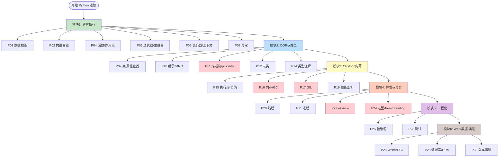
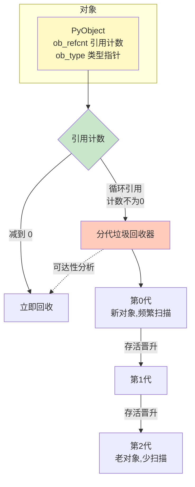
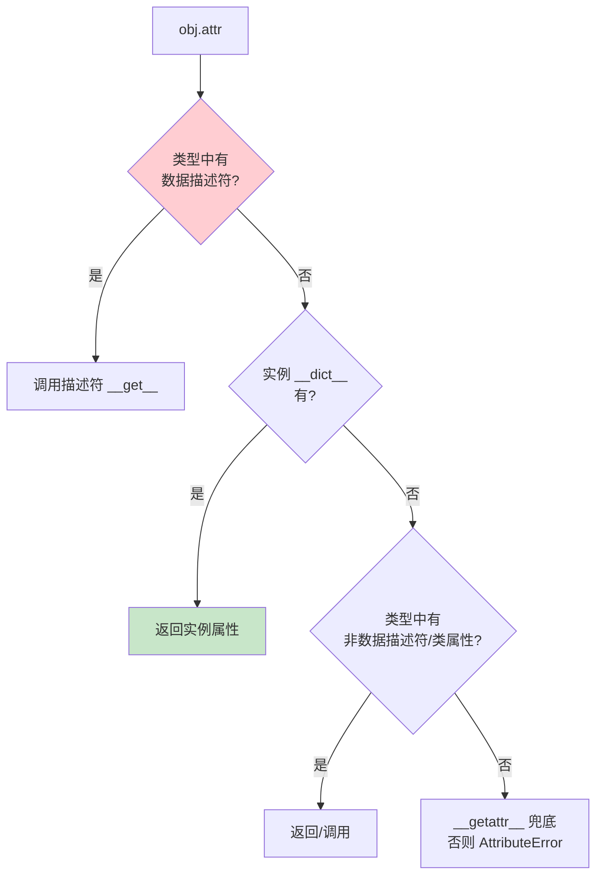
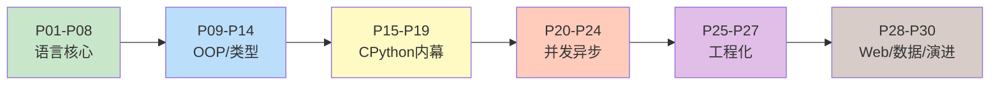

# Python 后端 路线图 · Mermaid 可视化

> 配合 [INDEX.md](./INDEX.md) 与 [QUIZ.md](./QUIZ.md) 使用
>
> **📅 内容基准：2026 年 6 月（Python 3.13 / 3.14，free-threading 转正）**

---

## 🗺️ 全景路线图



---

## 🐍 Python 并发全景（模块四 + GIL）

```mermaid
graph TB
    GIL[GIL 全局解释器锁<br>同一时刻只有一个线程执行字节码] --> T[多线程 threading]
    T --> TIO[✅ IO 密集<br>阻塞时释放 GIL]
    T --> TCPU[❌ CPU 密集<br>被 GIL 串行化]

    GIL --> P[多进程 multiprocessing]
    P --> PCPU[✅ CPU 并行<br>每进程独立解释器/GIL]
    P --> PIPC[代价: IPC/序列化/内存]

    GIL --> A[asyncio 协程]
    A --> AIO[✅ 单线程高并发 IO<br>事件循环 + await]
    A --> ABLOCK[❌ 阻塞调用<br>毁掉事件循环]

    GIL -.3.13+ 可选.-> FT[free-threading<br>no-GIL 构建]
    FT --> FTP[✅ 多线程真并行<br>免 IPC]

    style GIL fill:#ffcdd2
    style FT fill:#c8e6c9
    style AIO fill:#bbdefb
```

---

## 🧠 CPython 内存模型（P16）



---

## ⚡ asyncio 事件循环（P22）

```mermaid
flowchart TD
    Loop[事件循环 Event Loop] --> Ready{就绪队列<br>有任务?}
    Ready -->|是| Run[运行任务到下一个 await]
    Run --> Await{遇到 await<br>I/O?}
    Await -->|是,挂起| Reg[向 selector 注册 fd<br>让出控制权]
    Await -->|协程结束| Done[完成,设置结果]
    Reg --> Poll[epoll/kqueue 等待就绪]
    Poll -->|fd 就绪| Wake[唤醒对应任务入就绪队列]
    Wake --> Ready
    Done --> Ready

    Run -.阻塞调用 time.sleep/requests.-> Block[❌ 整个循环卡死<br>所有任务饿死]

    style Loop fill:#bbdefb
    style Reg fill:#c8e6c9
    style Block fill:#ffcdd2
```

---

## 🔎 属性查找顺序（P09/P11）



> 优先级：**数据描述符 > 实例字典 > 非数据描述符/类属性 > `__getattr__`**。这条线解释了 `property`、方法绑定、`__slots__` 的行为（[P11](./P11-精通-Python-描述符与property.md)）。

---

## 🎓 学习顺序建议



按顺序读 = 完整 Python 后端体系；面试突击 = 看 [INDEX.md](./INDEX.md) 的「路径 A」。
