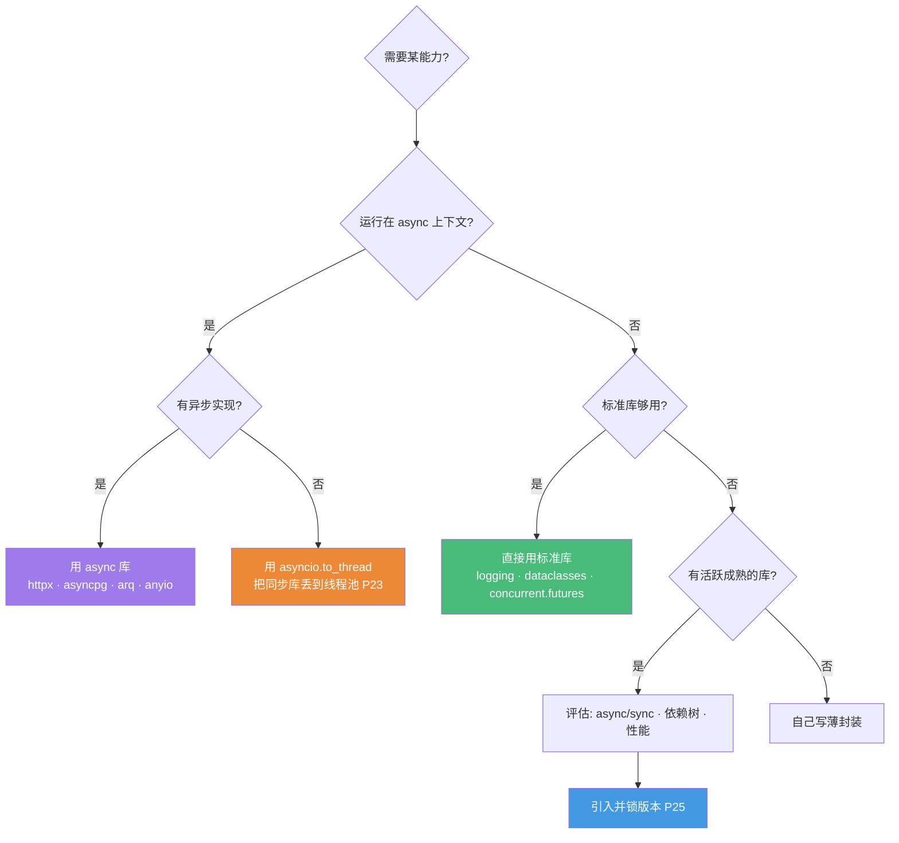

# Python 生态库选型地图 · 2026 实战精选

> 配套《Python 后端深度课程》的生态补充篇
> **📅 内容基准：Python 3.13（free-threading / 实验 JIT）主流、3.12 仍广泛在用、3.14（2025-10）free-threading 转官方支持**（2026-06）· 标注每个库的活跃度与选型建议
> 本课程主体讲透了**语言机制、CPython 内幕、并发与工程化**（见 [INDEX](../INDEX.md)），这一篇补上"真实项目里到底该用哪些第三方库"。

---

## 选型总原则：标准库 + 严格区分 async/sync

Python 的标准库"电池齐全"（batteries included），很多场景**根本不需要第三方库**。但 Python 生态也异常庞杂，且有一条 Go/Java 没有的高压线——**同步库不能用在异步代码里**。引入依赖前先问四个问题：

1. **标准库够用吗？** `logging`（P27）、`asyncio`（P22）、`concurrent.futures`（P24）、`unittest`、`dataclasses`、`argparse`、`json`、`sqlite3` 已覆盖大量需求。
2. **它是 async 还是 sync？** 这是 Python 选型的**头号陷阱**：在 `async def` 里调用 `requests`/`time.sleep`/同步 ORM，会**阻塞整个事件循环**（P23 核心考点）。异步路径必须用 `httpx`/`asyncpg`/`anyio.sleep` 等异步库。
3. **这个库还活着吗？** 看最近一次提交、issue 响应、是否被 archived。Python 生态有不少"明星已死/被取代"的库（如 Pydantic v1、SQLAlchemy 1.x 风格、setup.py 手写、flake8+black+isort 三件套）。
4. **它的成本是什么？** 纯 Python vs Rust/C 加速、依赖树大小、是否绑死某框架、Pydantic v2 这类是否带来编译期/二进制依赖。

> 📐 **黄金法则**：标准库能做到 80% 的事，第三方库帮你省掉重复的 20%。**但在异步代码里，选错"同步库"会让你的高并发服务退化成单线程串行——这比多写几行代码严重得多。**

---

## 1. Web 框架

| 库 | 用途 | 选型建议 | 2026 现状 |
|---|---|---|---|
| **FastAPI** | 异步 API 框架 | **新项目首选**：async-first、原生 Pydantic v2、自动 OpenAPI、对 AI/LLM 后端契合度极高（OpenAI/Anthropic/Microsoft 在用）| 活跃，事实标准（P28）|
| **Django** | 全功能框架 | 企业级 CRUD、admin、复杂关系业务的最强选择；ORM/auth/迁移/admin 开箱即用。同步 ORM 仍是异步短板，要 API 加 **DRF** 或 **django-ninja** | 活跃，5.2 增强异步 |
| **Flask** | 微框架 | 极简服务、ML 端点、内部工具、教学；WSGI 框架，**异步能力有结构性限制**，不适合做新的多端点异步 API 平台 | 活跃但定位收窄 |
| **Starlette** | ASGI 工具包 | FastAPI 的底层；想要更轻、自己掌控时直接用它 | 活跃 |
| **Litestar** | 异步 API 框架 | 技术上最强挑战者：基于 **msgspec** 序列化、强类型、更干净的 DI；但生态与招聘风险高于 FastAPI | 活跃，上升期 |

**一句话选型**：新建 API / AI 后端 → **FastAPI**（默认）；全栈 + admin + 复杂关系数据 → **Django(+DRF/ninja)**；极小服务/原型/教学 → Flask；想要极致性能 + 现代类型且能接受小生态 → Litestar。**真实生产里 Litestar 赢 benchmark，FastAPI 赢决策**——合成图表的差距很少出现在用户侧延迟上。

---

## 2. ASGI / WSGI 服务器

| 库 | 用途 | 选型建议 | 2026 现状 |
|---|---|---|---|
| **uvicorn** | ASGI 服务器 | FastAPI/Starlette 标配，benchmark 吞吐最高、延迟最低；**暂不支持 HTTP/2** | 活跃，ASGI 事实标准 |
| **gunicorn** | 进程管理器 | 传统 Django/Flask 同步服务的可靠默认；也常用 `-k uvicorn.workers.UvicornWorker` 管理 uvicorn 进程 | 活跃 |
| **hypercorn** | ASGI/WSGI 服务器 | 需要 **HTTP/2、HTTP/3、Trio** 时选它；功能更全但吞吐略低、延迟略高 | 活跃 |

**一句话选型**：同步 Django/Flask → **gunicorn**（同步 worker）；异步 FastAPI/Starlette → **uvicorn**（生产用 gunicorn 管多个 uvicorn worker）；确需 HTTP/2/3 或 Trio → hypercorn。**别为 benchmark 数字纠结服务器**，性能赢点在数据库与缓存。

---

## 3. 数据校验 / 设置

| 库 | 用途 | 选型建议 | 2026 现状 |
|---|---|---|---|
| **Pydantic v2** | 数据校验框架 | **事实标准**：Rust 核心（pydantic-core），比 v1 大幅提速；校验、序列化、与 FastAPI 深度集成。**务必用 v2，v1 已是历史**（P14）| 活跃，主导地位 |
| **pydantic-settings** | 配置/设置 | Pydantic 官方拆出的设置管理（原 `BaseSettings`），从 env/`.env`/secrets 加载并校验配置，12-factor 标配 | 活跃 |
| **msgspec** | 极速校验/序列化 | **最快**：比 Pydantic v2 快 2-5 倍，`Struct` 自带 `__slots__`、零拷贝解码；但功能窄、无 `@validator`、生态小 | 活跃 |
| **attrs** | 类定义 | 比 `dataclasses` 更强的类生成（校验器/转换器），初始化比 Pydantic 快得多；纯数据容器场景的轻量选择 | 成熟稳定 |

**一句话选型**：构建 API / 需要丰富校验与生态 → **Pydantic v2**；配置加载 → **pydantic-settings**；纯吞吐热点、能接受弱生态 → **msgspec**（Litestar 即基于它）。**别把 Pydantic 当纯数据容器**——那种场景 `dataclasses`/`attrs`/`msgspec` 快得多。

---

## 4. 数据库 / ORM / 迁移

| 库 | 用途 | 选型建议 | 2026 现状 |
|---|---|---|---|
| **SQLAlchemy 2.0** | ORM + Core | **Python ORM 事实标准**：2.0 风格注解式声明、PEP 484 全类型、原生 async（P29）；Mypy 插件已弃用（新类型支持免插件）| 2.0.x 稳定，2.1 beta |
| **SQLModel** | Pydantic+SQLAlchemy 桥 | tiangolo 出品，模型同时是 Pydantic + SQLAlchemy，配 FastAPI 极顺手；但仍 **0.0.x 未到 1.0**，慎用于关键系统 | 活跃，pre-1.0 |
| **Django ORM** | Django 内置 ORM | 用 Django 就用它；admin/迁移一体化、生产力高；异步支持仍有限 | 随 Django |
| **Tortoise ORM** | 异步 ORM | Django 风格的 async ORM，轻量；生态与成熟度不及 SQLAlchemy | 活跃 |
| **asyncpg** | PostgreSQL 异步驱动 | **最快**的 async PG 驱动（Cython + 二进制协议），比 psycopg3 async 快约 25-35%；asyncio 之父出品 | 活跃 |
| **psycopg3** | PostgreSQL 驱动 | 统一 sync/async API、更 Pythonic、独家支持 **pipeline 模式**；过 PgBouncer 时注意预编译语句兼容 | 活跃 |
| **Alembic** | 数据库迁移 | SQLAlchemy 官方迁移工具，**标配**；自动生成 + 手写迁移脚本 | 活跃 |

**一句话选型**：通用 → **SQLAlchemy 2.0 + Alembic**（2026 主流组合）；FastAPI 快速开发可试 SQLModel（接受 pre-1.0）；用 Django 就 Django ORM；PG 异步驱动追求极致速度 → **asyncpg**，要 sync/async 统一 + pipeline → **psycopg3**。**警惕 N+1 与同步 ORM 阻塞事件循环**（P23/P29）。

---

## 5. HTTP 客户端

| 库 | 用途 | 选型建议 | 2026 现状 |
|---|---|---|---|
| **httpx** | sync + async 客户端 | **新项目首选**：同一套 API 支持 sync/async、HTTP/2；OpenAI/Anthropic SDK 与 FastAPI `TestClient` 都用它 | 活跃 |
| **requests** | 同步客户端 | 脚本/原型/低并发的最简之选，生态最广；**但绝不能用在 `async def` 里**（会阻塞事件循环）| 活跃，sync only |
| **aiohttp** | 异步客户端/服务端 | 100% asyncio、极高并发（300+ 并发常以 1.5-5× 吞吐胜出）、原生 WebSocket 客户端；学习曲线更陡 | 活跃 |

**一句话选型**：绝大多数新项目 → **httpx**（一套代码兼顾 sync/async，从 requests 迁移平滑）；纯脚本 → requests；100% asyncio 的极高并发热点经 benchmark 证明有差距 → aiohttp。**核心红线：异步代码用异步客户端**（P23）。

---

## 6. 数据 / 科学计算

| 库 | 用途 | 选型建议 | 2026 现状 |
|---|---|---|---|
| **numpy** | 数值数组 | 科学计算地基，向量化的根（P19）；几乎所有数据库都依赖它 | 活跃，基石 |
| **pandas** | 数据分析 | 小数据交互、需要回流到 scikit-learn/matplotlib、字符串密集场景仍是首选；2.x 可选 PyArrow 后端 | 活跃 |
| **polars** | 高性能 DataFrame | **大数据首选**：Rust + Arrow、多核默认、惰性查询优化；>1GB 时 join/group-by 比 pandas 快 3-10× | 活跃，1.x 成熟 |
| **PyArrow** | 列式内存/格式 | Arrow 内存与 Parquet 读写的底座；pandas/polars 之间零拷贝交换的桥梁 | 活跃 |

**一句话选型**：>10 万行或定时跑的新管道 → **polars**；小数据 + ML 最后一公里（scikit-learn/matplotlib）→ **pandas(+PyArrow 后端)**；两者用 `.to_pandas(use_pyarrow_extension_array=True)` 零拷贝衔接。**别为迁移而迁移**——能跑的 pandas 代码不必硬换。（扫描密集分析也可考虑 DuckDB。）

---

## 7. AI / ML（点到为止）

| 库 | 用途 | 选型建议 |
|---|---|---|
| **PyTorch** | 深度学习框架 | 训练/研究/推理的事实标准，生态最大 |
| **scikit-learn** | 经典 ML | 传统机器学习（回归/分类/聚类/特征工程）首选，API 一致 |
| **transformers**（Hugging Face）| 预训练模型 | 调用/微调 LLM 与各类 Transformer 模型的标准入口 |
| **LangChain / LlamaIndex** | LLM 应用编排 | RAG/Agent 编排框架；**抽象重、迭代快**，简单场景常常直接调 SDK 更清晰——按需引入 |

**一句话选型**：深度学习 → PyTorch；传统 ML → scikit-learn；用预训练模型 → transformers。LLM 应用编排别一上来就套 LangChain，**先评估直接用 SDK**。详见 [ai-backend 专题](../../ai-backend/INDEX.md)。

---

## 8. 任务队列

| 库 | 用途 | 选型建议 | 2026 现状 |
|---|---|---|---|
| **Celery** | 分布式任务队列 | 最流行、功能最全（链/和弦/调度/多 broker/Flower 监控）；**复杂、配置坑多**（默认 early-ack + Redis 崩溃会丢任务，需调 `acks_late`）| 活跃 |
| **RQ** | Redis 任务队列 | **最简单**：API 极简、Redis 即用，"把函数丢到请求周期外"够用；无内置定时（需 rq-scheduler）、无复杂工作流 | 活跃 |
| **Dramatiq** | 可靠任务队列 | 以**可靠性**为设计目标，actor 模型、API 比 Celery/RQ 干净，支持 RabbitMQ/Redis；金融/合规等"丢任务不可接受"场景的好选择；生态较小 | 活跃 |
| **arq** | 异步任务队列 | **asyncio 原生**，配 FastAPI/asyncio 服务最自然、轻量；无内置多 worker（靠 supervisord）| 活跃 |

**一句话选型**：简单后台任务 → **RQ**（5 分钟上手）；可靠性优先（金融/合规）→ **Dramatiq**；复杂工作流/多 broker/大规模 → **Celery**（注意 `acks_late` 防丢任务）；纯 asyncio 服务 → **arq**。

---

## 9. 测试

| 库 | 用途 | 选型建议 | 2026 现状 |
|---|---|---|---|
| **pytest** | 测试框架 | **事实标准**：fixture、参数化、插件生态碾压 `unittest`（P26）| 活跃 |
| **pytest-asyncio** | 异步测试 | 测试 `async def` 用例（或用 `anyio` 的 pytest 插件）| 活跃 |
| **hypothesis** | 属性测试 | property-based testing，自动生成边界用例找 bug，强烈推荐补充示例测试 | 活跃 |
| **coverage**（+pytest-cov）| 覆盖率 | 覆盖率统计标配 | 活跃 |
| **respx / responses** | HTTP mock | mock httpx（respx）/ requests（responses）的外部调用 | 活跃 |
| **factory_boy** | 测试数据 | 构造测试用模型对象/假数据，配 ORM 用 | 活跃 |

**一句话选型**：一律 **pytest**；异步用例加 **pytest-asyncio**；想找隐蔽 bug 上 **hypothesis**；mock HTTP 按客户端选 respx/responses。**集成测试优先用 Testcontainers 拉真实 PG/Redis**（呼应 P26，真实依赖比 mock 可信）。

---

## 10. CLI / 终端

| 库 | 用途 | 选型建议 |
|---|---|---|
| **Typer** | 现代 CLI | **新项目首选**：用类型注解声明命令（tiangolo 出品、基于 Click），代码最少、自动补全/帮助 |
| **Click** | CLI 框架 | 成熟稳定的装饰器式 CLI，Typer 的底座；要更多控制时直接用 |
| **argparse**（标准库）| 简单 CLI | 单脚本/无依赖需求够用，**先看它再上第三方** |
| **rich** | 终端美化 | 彩色输出、表格、进度条、语法高亮、traceback 美化——日志与 CLI 输出神器 |
| **textual** | TUI 框架 | 用 rich 构建全功能终端 UI 应用（基于异步），做交互式终端程序 |

**一句话选型**：单脚本 → `argparse`（标准库）；正经 CLI → **Typer**（最简）或 Click（更多控制）；输出美化一律 **rich**；做 TUI → textual。

---

## 11. 通用实用工具

| 库 | 用途 | 选型建议 |
|---|---|---|
| **loguru** | 日志（开箱即用）| 零配置、API 极简的日志库，小项目/脚本省心；大型服务建议用标准 `logging`/structlog |
| **structlog** | 结构化日志 | 生产级结构化日志（JSON）、与标准 `logging` 集成、上下文绑定（P27）|
| **tenacity** | 重试 | 声明式重试 + 指数退避 + 抖动，调用外部 API/DB 的弹性标配 |
| **tqdm** | 进度条 | 循环/迭代进度条，一行包裹即用 |
| **more-itertools** | 迭代工具 | 补足 `itertools`（P05）的实用函数集（chunked/windowed/flatten 等）|

**一句话选型**：日志小项目 loguru、生产 **structlog**（或标准 `logging` + JSON formatter）；重试一律 **tenacity**；进度条 tqdm；迭代器工具先看标准库 `itertools`，不够再上 more-itertools。

---

## 12. 高性能序列化 / JSON

| 库 | 用途 | 选型建议 | 2026 现状 |
|---|---|---|---|
| **`json`**（标准库）| JSON | 默认首选，无依赖；非热点别折腾 | — |
| **orjson** | 极速 JSON | **最快的 JSON 库**（Rust），原生支持 dataclass/datetime/numpy，输出 `bytes`；Web 响应序列化提速明显 | 活跃 |
| **msgspec** | JSON + 校验 | 解码同时做类型校验、零拷贝，比单纯 JSON 库更进一步（见 §3）| 活跃 |
| **ujson** | 快速 JSON | 曾经的快速方案，**现已被 orjson 全面超越**——新项目优先 orjson | 维护放缓 |

**一句话选型**：默认标准库 `json`；**确证 JSON 是热点**（先用 P19 的 cProfile/timeit 证明）再上 **orjson**；要"解码即校验"用 msgspec。别用 ujson 了。

---

## 13. 包 / 环境管理

| 库 | 用途 | 选型建议 | 2026 现状 |
|---|---|---|---|
| **uv** | 包/项目/环境管理 | **2026 强推**：Rust 实现，比 pip 快 10-20×、比 Poetry 快 5-8×；一个工具取代 pip+venv+pyenv+pip-tools，原生 `uv build`/`uv publish`、锁文件、`pyproject.toml`（P25）| 1.0 已发，下载量超 Poetry |
| **Poetry** | 依赖/打包 | 仍广泛在用、维护活跃；库发布工作流与 dependency groups 是优势；许多团队**应用迁 uv、库留 Poetry** | 活跃 |
| **pdm** | PEP-621 管理器 | 合理但被 uv 挤压；偏好其单文件脚本/简洁的团队仍可用 | 活跃 |
| **pip-tools** | 依赖锁定 | 贴近 pip 的可复现方案，老牌企业仍在用；**新项目不推荐**，可迁到 uv 的 pip 兼容模式 | 维护中 |

**一句话选型**：**新项目直接 uv**（极速、一站式）；维护中的 Poetry 项目能跑就别硬迁，要迁用 uv 的 pip 兼容模式无痛过渡；发布纯库可继续 Poetry。**`pip` + `venv` 仍是标准库底座，理解它是基础**（P25）。
> ⚠️ 治理提示：2026-03 OpenAI 宣布收购 uv 背后的 Astral，已承诺 uv 保持开源（MIT/Apache 双协议）；即便如此，开源协议是兜底——这点值得知晓但不必为此放弃 uv。

---

## 14. 代码质量 / 类型检查

| 库 | 用途 | 选型建议 | 2026 现状 |
|---|---|---|---|
| **ruff** | linter + formatter | **2026 强推**：Rust 实现，**一个工具取代 flake8 + black + isort + pyupgrade + pydocstyle 等**，比组合管线快 ~150×；900+ 规则、formatter 与 black 近乎一致输出 | 活跃，主流 |
| **mypy** | 类型检查 | 老牌类型检查器，插件生态最广（P14）；CI 里跑类型门禁的稳妥之选 | 活跃 |
| **pyright** | 类型检查 | 微软出品（Pylance 引擎），VS Code 集成最强、速度快；IDE 内实时检查首选 | 活跃 |

**一句话选型**：lint + format **一律 ruff**（取代 flake8/black/isort 三件套，配置集中在 `pyproject.toml`）；类型检查 ruff **不做**，需配 **mypy**（CI 门禁）或 **pyright**（IDE 实时）。现代标准栈 = **uv + ruff + (mypy/pyright)**。
> 新兴：Astral 的 **ty**、Meta 的 **Pyrefly**（2026-05 到 1.0）是更快的 Rust 类型检查器，值得关注但 mypy/pyright 仍是当下稳妥选择。

---

## 15. 异步运行时

| 库 | 用途 | 选型建议 | 2026 现状 |
|---|---|---|---|
| **asyncio**（标准库）| 事件循环/协程 | **务实默认**：库兼容性最广，`TaskGroup`（3.11 结构化并发）、`async/await` 一切的基础（P22/P23）| — |
| **uvloop** | 快速事件循环 | asyncio 事件循环的 **drop-in 替换**（Cython + libuv），Linux/macOS 上近乎免费的提速，无需改代码 | 活跃 |
| **anyio** | 异步兼容层 | 在 asyncio/trio 之上提供 trio 风格结构化并发；**写库**或想后端无关时用它（Starlette/FastAPI/httpx 生态基石）| 活跃 |
| **trio** | 结构化并发运行时 | 最干净的结构化并发模型（nursery），正确性与人体工学好；**生态比 asyncio 窄** | 活跃 |

**一句话选型**：应用层 **asyncio 为默认** + Linux/macOS 加 **uvloop** 提速；**写库**或要后端无关 → **anyio**；追求最干净结构化并发且依赖支持 → trio。注意 anyio 3.2+ `use_uvloop` 默认 False，要 uvloop 需显式开。

---

## 16. 可观测性

| 库 | 用途 | 选型建议 |
|---|---|---|
| **OpenTelemetry Python** | trace/metric/log | **可观测性事实标准**：分布式追踪 + 指标 + 日志三合一，对接 Jaeger/Prometheus/OTLP；FastAPI/Django 有自动 instrumentation（P27）|
| **prometheus_client** | 指标采集 | 暴露 `/metrics`，Counter/Gauge/Histogram/Summary，配 Prometheus 抓取 |

**一句话选型**：可观测性统一上 **OpenTelemetry**（用其自动 instrumentation 接 Web 框架）；纯指标场景补 **prometheus_client**。结构化日志（structlog）作为 OTel 的 logs 信号桥接。

---

## 🗺️ 场景 → 首选 速查

| 场景 | 2026 首选 | 备选 |
|---|---|---|
| 新建 API / AI 后端 | **FastAPI** | Litestar / Django+DRF |
| 全栈 + admin | Django | — |
| ASGI 服务器 | **uvicorn**（gunicorn 管理）| hypercorn（HTTP/2/3）|
| 数据校验 | **Pydantic v2** | msgspec（极速）/ attrs |
| 配置/设置 | pydantic-settings | — |
| ORM + 迁移 | **SQLAlchemy 2.0 + Alembic** | SQLModel / Django ORM |
| PG 异步驱动 | asyncpg（最快）| psycopg3（统一 API）|
| HTTP 客户端 | **httpx** | requests（sync）/ aiohttp（高并发）|
| 大数据处理 | **polars** | pandas（小数据/ML 末端）|
| 任务队列 | RQ（简单）/ **Dramatiq**（可靠）| Celery（复杂）/ arq（async）|
| 测试 | **pytest** | + hypothesis / pytest-asyncio |
| CLI | **Typer** | Click / argparse |
| 终端输出 | **rich** | textual（TUI）|
| 日志 | structlog | loguru（小项目）|
| 重试 | tenacity | — |
| 高性能 JSON | **orjson** | msgspec |
| 包/环境管理 | **uv** | Poetry（库发布）|
| lint + format | **ruff** | — |
| 类型检查 | mypy / pyright | ty / Pyrefly（新兴）|
| 异步运行时 | **asyncio + uvloop** | anyio（写库）/ trio |
| 可观测性 | **OpenTelemetry** | prometheus_client |

---

## ⚠️ 选型避坑清单

- ❌ **在 `async def` 里用 requests / 同步 ORM / `time.sleep`**：阻塞整个事件循环，高并发服务退化为串行（P23 头号坑）。异步路径用 httpx/asyncpg/`asyncio.sleep`，迫不得已的同步库用 `asyncio.to_thread` 卸载。
- ❌ **还在用 Pydantic v1**：v2（Rust 核心）性能与 API 全面升级，新项目一律 v2（P14）。
- ❌ **flake8 + black + isort 三件套**：2026 一个 **ruff** 全包，快 ~150×。
- ❌ **手写 setup.py / 盲目 pip install 全局**：用 `pyproject.toml` + **uv**（或 venv 隔离），锁定依赖（P25）。
- ❌ **盲目上 SQLModel 做关键系统**：仍 0.0.x 未到 1.0，求稳用 SQLAlchemy 2.0。
- ❌ **不做 profile 就换"高性能"库**：先用 cProfile/timeit（P19）定位真瓶颈，再换 orjson/polars/msgspec。
- ❌ **把 Pydantic 当纯数据容器**：纯存数据用 dataclasses/attrs/msgspec，快得多。
- ❌ **Celery 默认配置丢任务**：Redis + early-ack，worker 崩溃任务永久丢失，关键任务设 `acks_late=True`。
- ❌ **用 ujson**：已被 orjson 全面超越。
- ❌ **以为 ruff 能做类型检查**：ruff 是 linter/formatter，类型检查得另配 mypy/pyright。

---

## 📌 与课程章节的对应

| 课程章节 | 相关生态库 |
|---|---|
| P05 迭代器/生成器 | more-itertools |
| P14 类型注解 | Pydantic v2 / mypy / pyright / msgspec / attrs |
| P19 性能剖析 | numpy / polars / orjson（先 profile 再换）|
| P22/P23 asyncio 与异步实战 | asyncio / anyio / trio / uvloop / httpx / aiohttp / asyncpg |
| P24 并发选型 | concurrent.futures / arq / Dramatiq / Celery |
| P25 包管理 | **uv** / Poetry / pdm / pip-tools |
| P26 测试 | pytest / pytest-asyncio / hypothesis / coverage / respx / factory_boy |
| P27 日志与可观测 | loguru / structlog / OpenTelemetry / prometheus_client |
| P28 Web 框架 | FastAPI / Django / Flask / Starlette / Litestar / uvicorn / gunicorn / hypercorn |
| P29 数据库 | SQLAlchemy 2.0 / SQLModel / asyncpg / psycopg3 / Alembic |

---

> 🔁 **原则复述**：标准库优先 → **严格区分 async/sync**（异步代码必用异步库）→ 确有需要再引入**活跃、成熟、性能可证**的库 → 用 P25 的 uv 锁版本、P19 用数据说话。2026 现代工具链 = **uv + ruff + Pydantic v2 + (mypy/pyright)**。生态会变，但"先标准库、不阻塞事件循环、用数据说话、控制依赖树"这套方法不变。
>
> 📅 库的活跃度会随时间变化，引入前请看 PyPI 下载趋势与 GitHub 最近提交/issue 响应，本篇基准为 2026-06（Python 3.13 主流 / 3.14 free-threading 转官方）。
