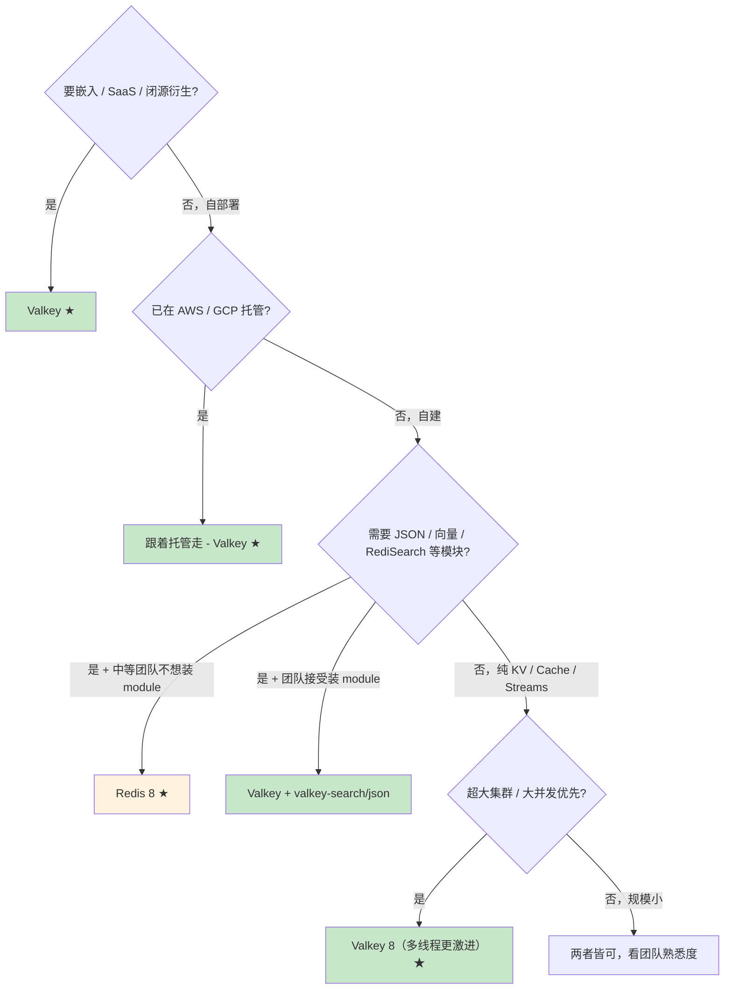

# Redis vs Valkey：fork 始末、许可证、技术演进、选型决策

> 关联章节：[11 Redis 8 新类型](./11-精通-Redis-8-新类型.md)、[12 生产实践](./12-精通-Redis-生产实践.md)

---

## 引言：开源软件商业化的代表性事件

2024 年 3 月 21 日，Redis Inc. 宣布把 Redis 从 BSD-3 改为 **RSALv2 + SSPLv1** 双源可见许可证（不再是 OSI 认可的开源协议）。这是继 MongoDB（2018 SSPL）、Elastic（2021 ELv2）、CockroachDB（2021 BSL）、HashiCorp（2023 BSL）之后又一个明星开源项目"重新许可"事件。

不到 10 天，Linux Foundation 联合 AWS / Google / Oracle / Ericsson / Snap 等 fork 出 **Valkey**（基于 Redis 7.2.4，BSD-3）。一年后 Redis Inc. 又妥协，发布 **Redis 8.0 (2025-05) 加入 AGPLv3 作为第三个许可证选项**——三选一。

这一章把这场分叉的来龙去脉讲清，并给 2026 年实际选型建议：

- 时间线、各方诉求、许可证差别
- 技术上 Redis 8 与 Valkey 8 的同与不同
- 迁移成本与互操作性
- 选型决策树

读完之后你应该能在团队 review 时给出明确建议而非"两个都看看"。

---

## 第一章：时间线

```
2009          Redis 1.0（BSD-3）
2015          Redis 3.0 Cluster GA
2018          Redis 5.0 Streams
2018          MongoDB → SSPL（OSI 不认可）
2021          Elastic → SSPL/ELv2（ES fork OpenSearch）
2024 March 21 Redis Inc. → RSALv2 / SSPLv1（不再 OSI 开源）
2024 March 28 Linux Foundation 宣布 Valkey fork（基于 Redis 7.2.4）
2024 April    AWS / Google Cloud / Oracle 加入 Valkey
2024 April    Valkey 7.2.5 首个独立 release
2024 August   Valkey 8.0 RC（多线程性能优化）
2024 Sept     Valkey 8.0 GA
2025 May      Redis Inc. → Redis 8.0 加入 AGPLv3（tri-license）
2025 Q3-Q4    AWS ElastiCache / GCP Memorystore 默认 Valkey
2026          Redis 8.x 与 Valkey 8.x 并行演进
```

### 1.1 Redis Inc. 的诉求

Redis Inc.（前身 RedisLabs）从 2018 年起就在尝试限制云厂商免费使用 Redis（先是 Redis Modules 改 Commons Clause，2019 改 RSAL，2024 把 core 也改了）。诉求：

- 云厂商（AWS ElastiCache、Google Memorystore、阿里云 Redis）用 Redis 做 SaaS 卖给最终用户，**收入归云厂商，研发归 Redis Inc.**——他们觉得不公平
- 改协议后云厂商必须要么签 OEM、要么走老 BSD 版本（< 7.4）、要么 fork

### 1.2 社区的反击

很多人认为 RSALv2 / SSPL 不算"真正开源"（OSI 不认可），把 Redis 排除在 Apache Software Foundation 等的"可依赖项"清单外。

Linux Foundation 联合多个大公司启动 Valkey：

- 基于 Redis 7.2.4（最后一个 BSD 版本）
- 完全 BSD-3，治理由 LF 中立基金会主持
- AWS / Google / Oracle / Ericsson / Snap / 阿里 等加入

### 1.3 Redis Inc. 的妥协（2025-05）

意识到大客户都在迁 Valkey，Redis Inc. 在 Redis 8.0 加入 **AGPLv3** 作为第三个许可证选项：

- 用户三选一：RSALv2、SSPLv1、AGPLv3
- AGPLv3 是 OSI 认可的开源协议
- 但 AGPLv3 有 **network copyleft** 条款——你做 SaaS 卖给别人也要开源你的修改

这次妥协换来什么？AGPLv3 对大多数自部署用户友好（你不卖 SaaS），但对云厂商仍不友好（卖 SaaS 必须开源整个 stack）。所以**云厂商一般不接受 AGPLv3**，仍倾向继续维护 Valkey。

---

## 第二章：许可证对比

| 许可证 | OSI 认可 | 商用 | 闭源衍生品 | 提供 SaaS |
|---|---|---|---|---|
| **BSD-3**（Valkey） | ✓ | ✓ | ✓ | ✓ |
| **RSALv2**（Redis 8 选项） | ✗ | 部分（非云竞争） | ✓ | ✗ 禁 |
| **SSPLv1**（Redis 8 选项） | ✗ | ✓ | ✓ | ✓ 但要开源所有依赖 stack |
| **AGPLv3**（Redis 8 选项） | ✓ | ✓ | 衍生品也要 AGPLv3 | ✓ 但要把你的 SaaS 整套开源 |

### 2.1 给自部署的影响

- 你在公司内部用 Redis 8 做缓存 / KV → AGPLv3 完全 OK，与 BSD 无差别
- 你的产品里嵌入 Redis 做 embedded 数据库 → 必须**整个产品**开源（AGPLv3 传染性）
- 你做 SaaS 卖给别人，里面用 Redis 8 → 必须开源整个 SaaS 代码

> Valkey 没这些束缚——纯 BSD。

### 2.2 给云厂商的影响

- 提供 Redis-as-a-service：必须签 Redis Inc. 商业 license（RSALv2/SSPL 都禁 SaaS）
- 选 AGPLv3：要把云厂商整个云平台代码开源（事实上不可能）
- 所以 AWS / GCP / Oracle 选 Valkey

### 2.3 给上游用户的影响

| 你是 | 推荐许可证路径 |
|---|---|
| 自部署内部使用 | Redis 8（任一）或 Valkey 任意选 |
| 产品里嵌入 Redis | Valkey BSD-3，避免 AGPL 传染 |
| SaaS 服务商 | Valkey BSD-3，或买 Redis Inc. 商业 license |
| 大型云厂商 | 一律 Valkey |
| 想吃模块红利（JSON / TimeSeries / Bloom / Vector Set 内置） | Redis 8（这些模块只 Redis 8 默认集成） |

---

## 第三章：技术差异（截至 2026-05）

### 3.1 协议与命令兼容性

- **客户端协议**：完全兼容（RESP2 / RESP3）
- **命令集**：核心命令 100% 兼容；新命令各自演化
- **Cluster / Sentinel / 复制**：完全兼容

业务代码可以**在 Redis 7.x、Redis 8.x、Valkey 7.x、Valkey 8.x 之间零修改切换**。这是最重要的事实。

### 3.2 Redis 8.0 独有

- **内置数据类型模块**（JSON / TimeSeries / Bloom / Cuckoo / Top-K / CMS / T-Digest / Vector Set，详 R09）
- **RediSearch 内置**（FT.SEARCH / FT.CREATE 等）
- **Active-Active CRDTs**（多区域双写最终一致，企业版功能下放）
- **某些性能优化**（新的 IO 线程模型、新的 backlog 实现）

### 3.3 Valkey 8.0 独有

- **多线程性能优化**（更激进的 I/O 多线程，单实例 QPS 提升 30-100%）
- **集群通信改进**（更大集群更稳定）
- **Slot Migration 改进**
- **Async DEL 默认开启**
- **更精细的 ACL**

### 3.4 模块生态

- **Redis 8**：模块开箱即用，全是 Redis Inc. 维护
- **Valkey 8**：核心 Valkey 不含这些模块；社区另起 `valkey-search`、`valkey-json`、`valkey-bloom` 等独立 module 项目（仍演化中，部分 GA、部分 alpha）

### 3.5 性能 benchmark（2026 最新观察）

| 场景 | Redis 8.0 | Valkey 8.0 | 备注 |
|---|---|---|---|
| 单线程 GET/SET 上限 | 同 | 同 | 都基于 6.x 单线程核心 |
| 多线程读 8 IO threads | 280k QPS | 380k+ QPS | Valkey 多线程更激进 |
| Cluster 大集群稳定性 | 优 | 更优 | Valkey 8 修了一些 gossip 老 bug |
| JSON 操作 | 内置原生 | 需装 valkey-json | 性能相近 |
| 向量检索 | Vector Set + RediSearch | valkey-search | RediSearch 更成熟 |
| 内存效率 | 同 | 同 | 同样的数据结构内核 |

**结论**：纯 KV / 缓存场景两者几乎无差；**Valkey 在大集群和多线程吞吐略胜**；**Redis 8 在模块和向量检索成熟度略胜**。

---

## 第四章：客户端 SDK 兼容性

主流 SDK 都把 Redis 和 Valkey 视为同一协议：

| SDK | 语言 | Redis / Valkey 支持 |
|---|---|---|
| Lettuce / Jedis | Java | ✓ |
| redis-py | Python | ✓ |
| ioredis | Node.js | ✓ |
| go-redis | Go | ✓ |
| StackExchange.Redis | .NET | ✓ |
| valkey-glide | 多语言（新） | ✓（AWS 出品，主推 Valkey） |
| node-redis | Node.js | ✓ |

**SDK 选择不影响后端选型**——你今天用 redis-py 连 Valkey，明天换 Redis 8，代码不用改。

新 SDK `valkey-glide` 是 AWS 出的官方 Valkey 客户端，重点在 cluster topology 自动更新、连接管理、tail latency 优化。**未来可能成为 Valkey 主推**。Redis 仍主推 `node-redis` / `redis-py`。

---

## 第五章：托管服务对比

| 云厂商 | 默认提供 | 备注 |
|---|---|---|
| AWS ElastiCache | **Valkey**（自 2024-Q3 起默认推荐） | Redis OSS 老版本仍可选；Redis 8 仅 Redis Cloud（OEM）|
| Google Memorystore for Redis | Redis OSS（< 7.4 BSD 版本）+ Valkey 选项 | Valkey 选项 2024 加入 |
| Azure Cache for Redis | Redis 6.x (BSD) + Redis Enterprise | 暂未明确 Valkey 路线 |
| Aliyun Tair / Redis | 自研 Tair（Redis 协议兼容）+ Valkey 选项 | |
| Redis Cloud（Redis Inc.） | Redis Stack（含所有模块） | 最新版本最快接入 |

如果你在 AWS / GCP：**默认就是 Valkey 了**。

---

## 第六章：迁移路径

### 6.1 Redis 7.2.x → Valkey 7.2.x

直接替换二进制即可，**协议完全一致**：

```bash
systemctl stop redis
mv /usr/bin/redis-server /usr/bin/redis-server.bak
cp valkey-server /usr/bin/redis-server   # 或新名字
systemctl start redis    # 但 daemon 已是 valkey-server
```

或正规步骤：

1. 部署一个 Valkey replica 跟 Redis master 复制
2. 等数据同步
3. 切流量到 Valkey（手动 failover：把 replica 提主，老 Redis 关）

### 6.2 Redis 8.x → Valkey 8.x

如果只用 KV / Hash / List / Set / ZSet / Stream → 同 §6.1。

如果用 Redis 8 独有模块（JSON / Vector Set 等）：

- Valkey 上装对应 module（`valkey-json`、`valkey-search` ...）
- 命令兼容（但可能少数命令名不同 → 用兼容层 / 改业务代码）

### 6.3 反向：Valkey → Redis 8

通常无需迁回，除非你需要 Redis 商业增值功能（Active-Active 多区域、Redis Cloud SaaS、Redis Insight）。

---

## 第七章：选型决策树



### 7.1 总结建议（2026-05）

**新自部署项目**：
- 纯 KV / 缓存 / 消息流 → **Valkey 8** 首选（许可证清爽 + 大集群优化）
- 需要向量检索 / 文档检索 / 时序模块 → **Redis 8**（一键集成）或 Valkey + 装 module

**已有 Redis 7.x**：
- 内部用 → 升 Redis 8 或迁 Valkey 8 两种都可，看团队心智成本
- 嵌入产品 → 迁 Valkey 8 防止 AGPLv3 传染

**云上托管**：
- AWS / GCP → 用云的 Valkey 选项即可
- Azure / 阿里云 → 看具体提供选项

---

## 第八章：长期看会怎么演化

### 8.1 两个项目持续分叉

- 内核功能（数据结构、Cluster、复制）—— 两边都会复制对方的好特性
- 模块生态 —— Redis 8 单一来源 + Redis Inc. 主导；Valkey 多 vendor + LF 治理
- 性能优化 —— Valkey 有 AWS 投入的工程师在改 multi-thread

### 8.2 标准化

社区在推 [Redis 协议（RESP）的开源标准化](https://github.com/redis/redis-specifications)——让 Redis 8 / Valkey 8 / Tair / DragonflyDB 等都按统一标准实现。

### 8.3 客户端的"中立化"

`valkey-glide` 已经支持 Redis 8 + Valkey 8 + 兼容协议；类似的中立 client 会越来越多。这反过来让"两者哪个赢"变得对用户没那么重要——**协议是真正的赢家**。

---

## 第九章：实战：在生产里同时维护 Redis 与 Valkey

某些大公司同时跑两套：

- **业务 A**：Redis 8（用 Vector Set 做 RAG）
- **业务 B**：Valkey 8（纯缓存，大集群）

操作上：

- 同一 SDK 同时连两个集群 → 不同 connection pool，不同地址
- 监控统一（redis_exporter 都兼容）
- 备份策略相同（RDB / AOF）
- 运维脚本可复用

唯一要小心：**模块命令在哪个集群可用要分清楚**——业务代码不能假设到处都有 JSON.GET。

---

## 第十章：常见误解 / 陷阱

### ❌ 误解 1："Valkey 是 Redis 的临时 fork，最终会回归"
不会。Linux Foundation 治理 + 多云厂商投资 + 已发布独立 8.x。Valkey 独立运营是长期事实。

### ❌ 误解 2："Redis 8.0 AGPLv3 又开源了，回 Redis"
AGPLv3 对自部署 OK，但对嵌入 / SaaS 仍有束缚。看你的使用方式。

### ❌ 误解 3："Valkey 命令跟 Redis 不一样"
99% 一样。新增命令可能小有差异，但核心命令、Cluster、Sentinel 都同。

### ❌ 误解 4："迁移到 Valkey 必须停服"
不必。Valkey 可以作为 Redis 的 replica 实时同步，然后 failover 切换。

### ❌ 误解 5："Redis Inc. 会再改 license 一次"
未来不确定。但你可以基于**当前 license 文本**做决策。Valkey BSD-3 是不可撤销的。

### ❌ 误解 6："用 Valkey 会失去 Redis 生态"
SDK、监控、文档、社区大部分通用。失去的是 Redis Inc. 商业支持和最新模块的"开箱即用"——可控。

### ❌ 误解 7："切 Valkey 性能更高所以无脑切"
Valkey 8 在某些 benchmark 上更快，但你的瓶颈可能不在 Redis 本身（大概率不在）。压测决策。

### ❌ 误解 8："Redis 8 模块是闭源的"
不是。Redis 8 source 完整可见（按 tri-license 之一），模块在 Redis 8 源码树里全开源。

### ❌ 误解 9："Valkey 没人用所以不要选"
2026 年所有主要云厂商已默认 Valkey。AWS / GCP / Oracle 都在大规模生产部署。规模已超 Redis OSS。

### ❌ 误解 10："Redis Stack / Redis Cloud / Redis 8 是一个东西"
- Redis Stack = 老的 Redis + 模块打包发行版（已被 Redis 8 取代）
- Redis Cloud = Redis Inc. 的托管 SaaS
- Redis 8 = 最新开源版本（tri-license），已内置原 Stack 的模块

---

## 第十一章：练习题

**练习 1**：公司做 SaaS 产品，给客户提供"在线协作工具"，内部用 Redis 做实时状态。该选 Redis 8 还是 Valkey？为什么。

**练习 2**：你在 AWS EC2 上自己装 Redis 7.2.4（BSD）+ RedisJSON 模块。想升级到带新功能的版本。给出 3 种选择 + 各自代价。

**练习 3**：Redis 8 AGPLv3 选项被你公司法务否决了。但你需要 Vector Set 做 RAG。怎么办？

**练习 4**：Valkey 集群比 Redis 集群在哪些方面更强？给出具体场景。

**练习 5**：解释为什么 Redis 协议（RESP）的开放性让"Redis vs Valkey"这场战争对终端用户冲击较小。

---

## 参考答案

**练习 1**：**Valkey** 更合适。原因：
- SaaS 给客户用 → Redis 8 AGPLv3 选项要求你开源整个 SaaS（不可能）
- SSPL 选项也类似困境
- RSALv2 选项要求不竞争"Redis 类服务"——你的协作工具不算
- 但即便 RSALv2 OK，也涉及商业许可问题
- Valkey BSD-3 完全无束缚，最干净

**练习 2**：
- A 升 Redis 8：享受 JSON 内置 + Vector Set；但需评估 AGPLv3 是否符合 AWS 自部署（自用 OK，不可对外卖）
- B 迁 Valkey 8 + valkey-json：BSD 无负担；但需装额外 module 维护
- C 升 ElastiCache（Valkey 托管）：完全交给 AWS，省运维但贵

**练习 3**：
- 方案 1：Valkey 8 + valkey-search 模块（如已 GA）
- 方案 2：Elasticsearch dense_vector 或 PostgreSQL pgvector
- 方案 3：专用向量库 Milvus / Qdrant
- 方案 4：等 Valkey 后续把 Vector Set 实现作为模块

**练习 4**：
- 大集群 gossip 通信优化：100+ 节点集群稳定性更好
- 多线程 I/O 更激进：连接数极多场景吞吐高 30-100%
- Async DEL 默认 on：少踩坑
- AWS 工程师重点投入：故障修复响应快
- 与 ElastiCache 集成深：托管运维体验最好

**练习 5**：因为 SDK 和监控工具都按 RESP 协议工作 → 切换底层实现对应用透明。这种"协议优先"的设计让 ecosystem 形成 commodity——任何兼容 RESP 的后端（Redis / Valkey / DragonflyDB / KeyDB / Garnet）都能接到现有 SDK。终端用户不必绑定具体实现，**选择自由 = 谈判筹码 = 价格压力 = 市场对所有 vendor 都好**。

---

## 小结

| 维度 | Redis 8 | Valkey 8 |
|---|---|---|
| 许可证 | tri-license (RSALv2/SSPL/AGPLv3) | BSD-3 |
| 治理 | Redis Inc. 单一 | Linux Foundation 多 vendor |
| 模块（JSON/向量/搜索） | 内置 | 独立 module |
| 大集群优化 | 良 | 优（AWS 投入） |
| 多线程 I/O | 良 | 优 |
| 云托管默认 | Redis Cloud | AWS/GCP 默认 |
| SDK 支持 | 全部主流 | 全部主流 |
| 协议兼容 | RESP2/3 | RESP2/3 |

四条决策原则：

1. **嵌入 / SaaS → Valkey**（许可证安全）
2. **云上托管 → 跟着云厂商走**（多半 Valkey）
3. **需要 Redis 8 独有模块 → Redis 8**（除非你愿意装 valkey 模块）
4. **协议兼容 = 切换成本极低**——别陷入"必须二选一"焦虑

下一篇 **R12 — 精通 Redis 客户端与连接管理**：RESP3、Cluster-aware、连接池、async 模式。
