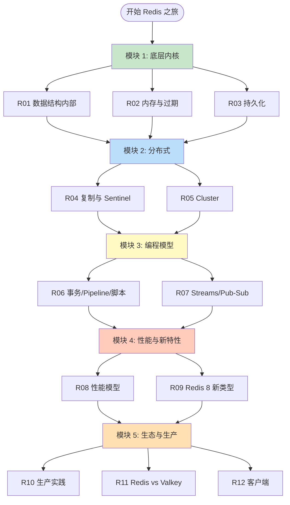
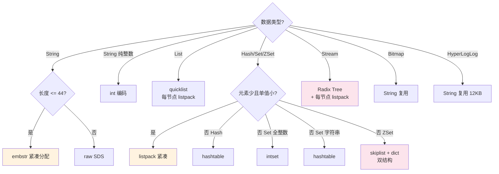
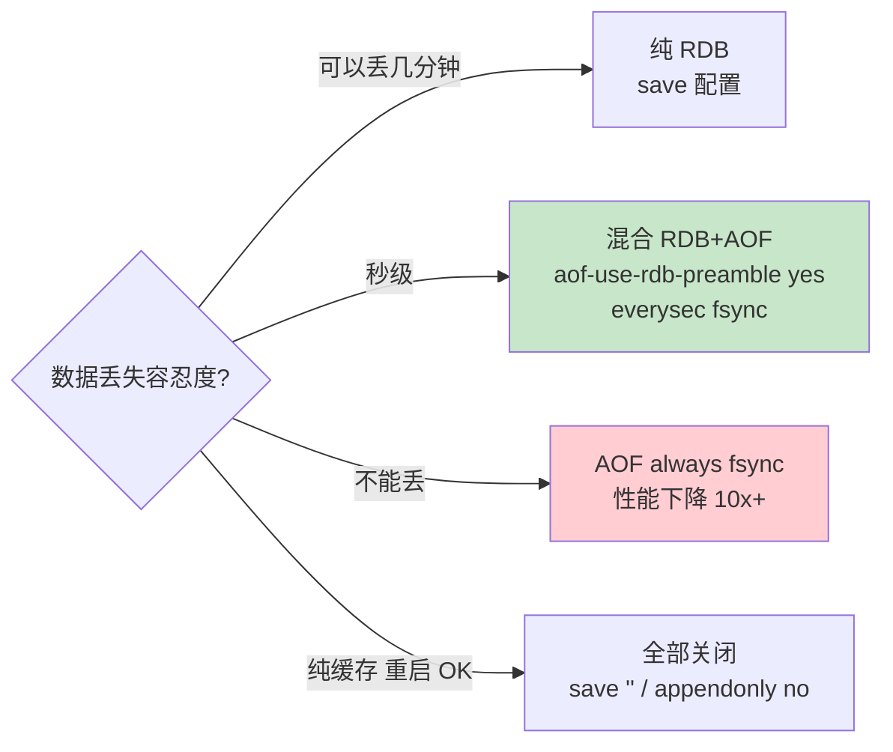
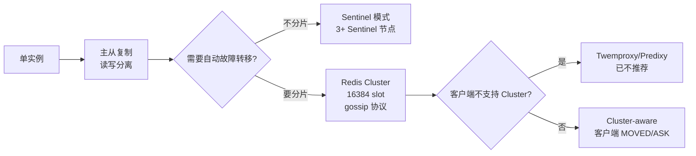
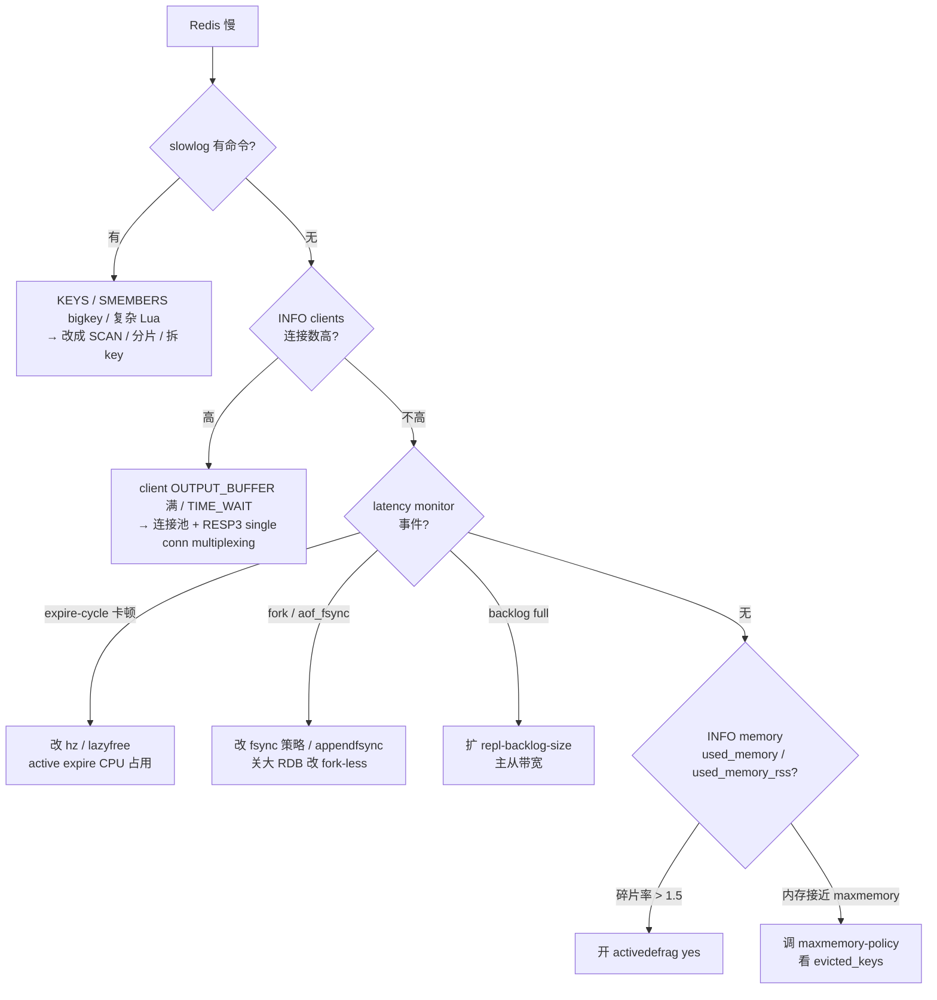
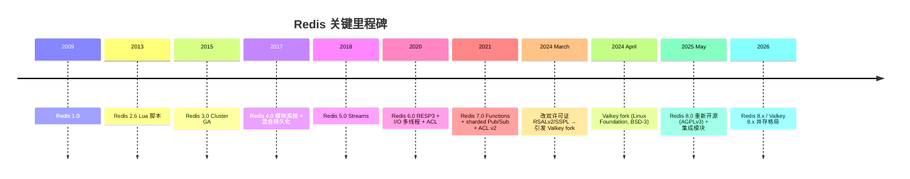

# Redis 路线图 · Mermaid 可视化

> 配合 [INDEX.md](./INDEX.md) 与 [QUIZ.md](./QUIZ.md) 使用
>
> **📅 内容基准：Redis 8.0 / Valkey 8.x**（2026-05 时主流稳定版）

---

## 🗺️ 全景路线图

---

## 🔑 内部数据结构选择决策

> 关键阈值（Redis 8 默认）：listpack ↔ 大结构切换由 `hash-max-listpack-entries`、`list-max-listpack-size`、`set-max-listpack-entries`、`zset-max-listpack-entries` 控制。

---

## 🔄 持久化策略选择

---

## 📡 复制拓扑选型

---

## ⚡ 性能调优速决树

---

## 🆕 Redis 8 / Valkey 8 关键演进时间线

---

> 📁 本路线图位于 `/data/workspace/dp4/redis/ROADMAP.md`
