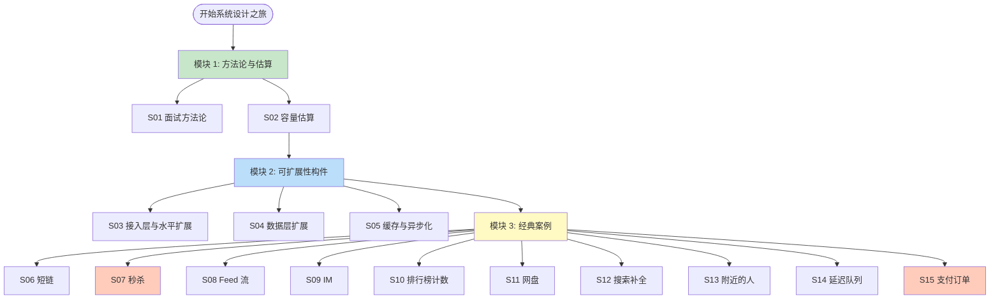
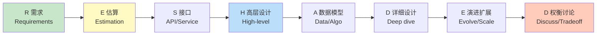
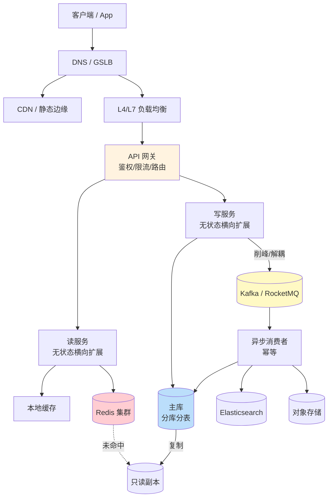
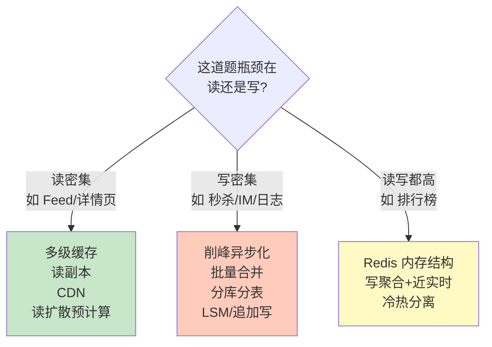
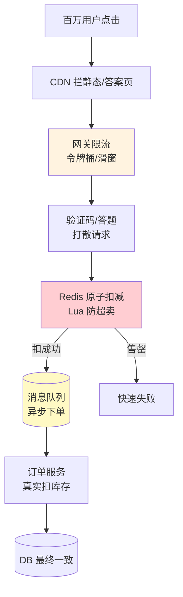
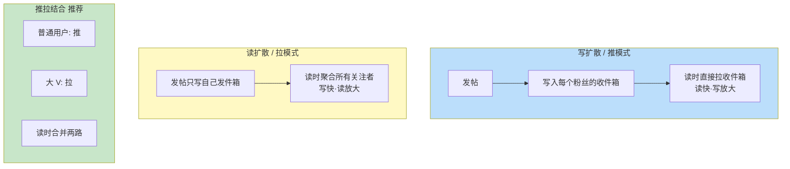
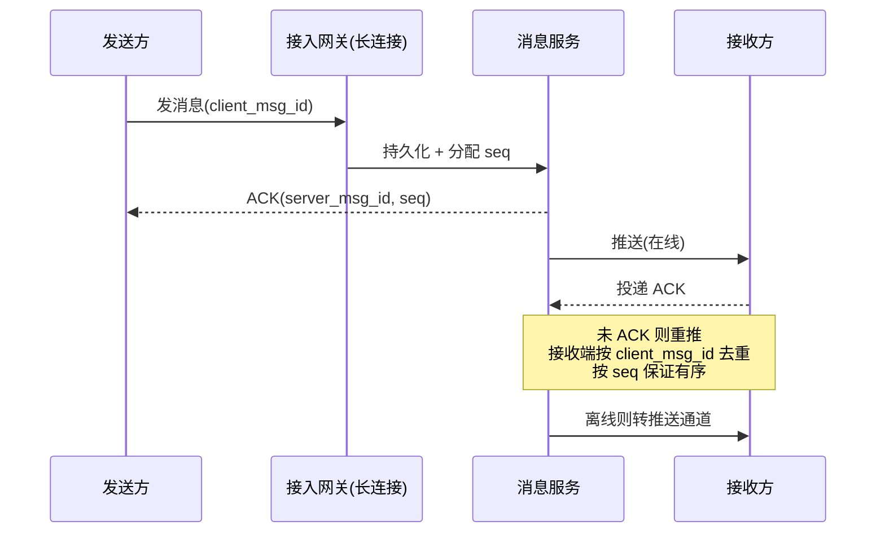
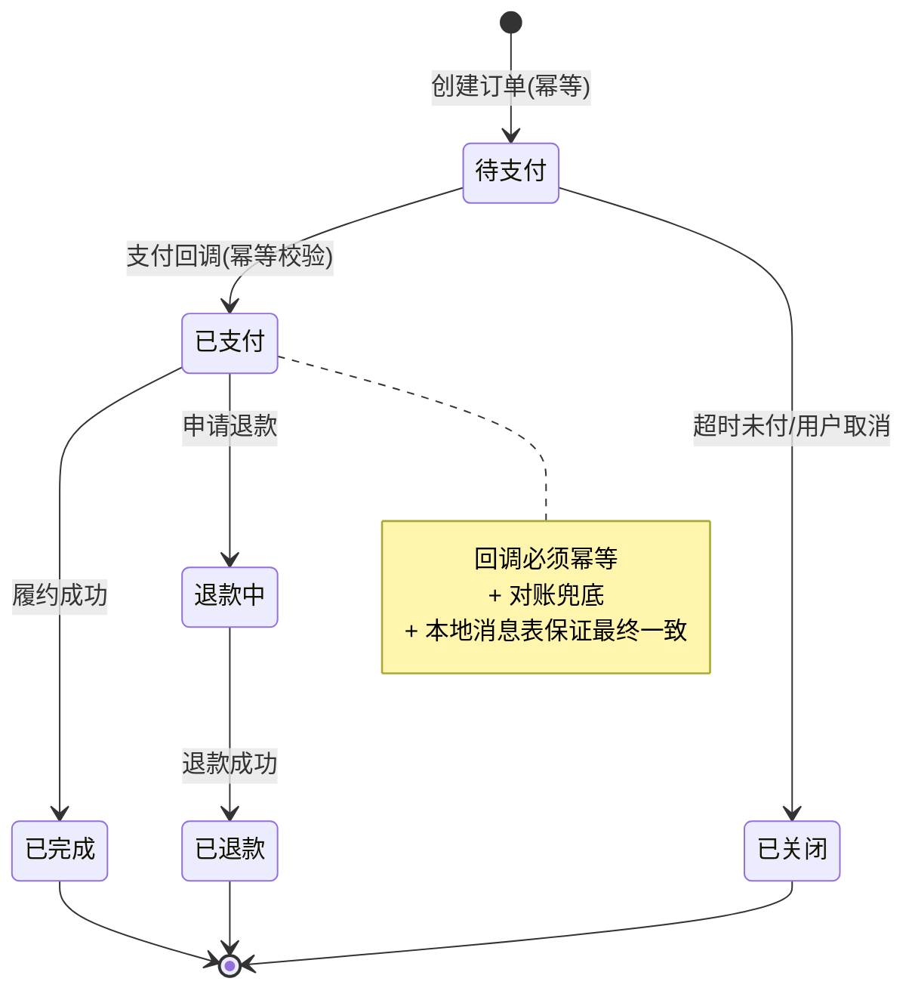
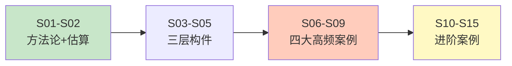

# 系统设计 路线图 · Mermaid 可视化

> 配合 [INDEX.md](./INDEX.md) 与 [QUIZ.md](./QUIZ.md) 使用
>
> **📅 内容基准：2026 年 6 月**

---

## 🗺️ 全景路线图

---

## 🧭 RESHADED 答题框架（每道题都走一遍）

> 顺序不死板，但**需求和估算永远在最前**——跳过这两步直接画框是面试最大扣分项。

---

## 🏛️ 通用可扩展架构骨架

---

## 📈 读密集 vs 写密集：选不同的武器

---

## 🔥 秒杀削峰漏斗（S07）

---

## 📰 Feed 流推拉模式（S08）

---

## 💬 IM 消息可靠投递（S09）

---

## 💰 支付订单状态机（S15）

---

## 🎓 学习顺序建议

按顺序读 = 完整答题能力；面试突击 = 看 [INDEX.md](./INDEX.md) 的「路径 A」。
