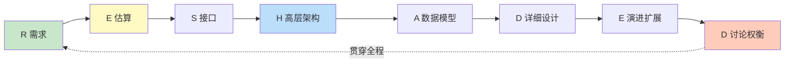
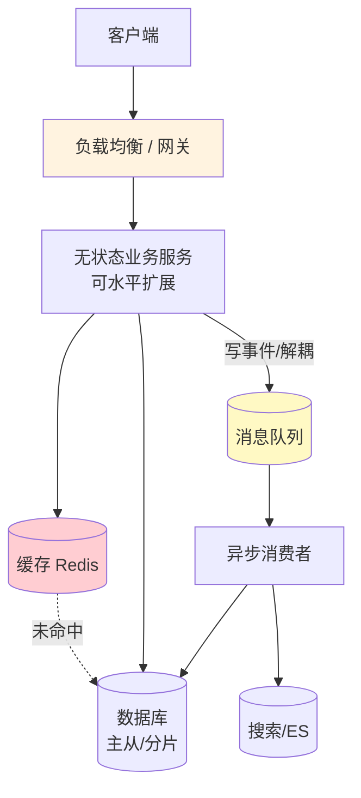

# 精通系统设计面试方法论

> 系统设计面试（System Design Interview）不考"你背没背过架构图"，考的是**在信息不全、时间有限的压力下，能不能像一个资深工程师那样把一个模糊问题拆成可落地的方案，并讲清每一步的取舍**。
>
> 这一篇是整个 system-design 专题的"操作系统"——后面 S06–S15 的每一道案例题，都是这套方法论的一次实例化。先把流程和话术练成肌肉记忆，再去套案例，事半功倍。

---

## 一、系统设计面试到底考什么

很多人栽在系统设计上，不是因为"不懂 Redis / Kafka / 分库分表"，而是因为**没有一套把这些零件组装起来的流程**，于是表现成：上来就画框、画到一半发现扩展不了、被追问就慌、从头到尾没说过一句"权衡"。

面试官真正在打分的，是下面五个维度，技术深度只占其一：

| 维度 | 在看什么 | 典型反面表现 |
|---|---|---|
| **需求把握** | 你会不会先问清楚再动手 | 没确认规模/读写比就开画 |
| **量级感** | 估算 QPS / 存储 / 带宽的数量级直觉 | 张口"用 Redis 就行"，给不出数字 |
| **架构合理性** | 组件选型是否对症、数据流是否自洽 | 为了用而用，堆一堆中间件 |
| **可扩展性** | 能不能从 1 万用户演进到 1 亿 | 方案只在小流量下成立 |
| **沟通表达** | 是否主动暴露假设、讲取舍、接受质疑 | 把面试当考试，闷头写"标准答案" |

**核心心智**：系统设计是开放题，没有唯一答案。面试官想看的是一场**协作设计对话**——你提方案、他抛约束、你调整并说清为什么。一个能把"方案 A 牺牲一致性换吞吐、方案 B 反之，鉴于本题读多写少我选 A"讲明白的候选人，胜过一个默写出豪华架构却说不出理由的人。

---

## 二、RESHADED 全流程框架

把一道题从零推到完整方案，用一个固定流程兜住，临场就不会乱。业界常用的助记是 **RESHADED**：

| 字母 | 阶段 | 产出 | 建议时长（45min） |
|---|---|---|---|
| **R** | Requirements 需求澄清 | 功能 + 非功能需求清单 | 5–8 min |
| **E** | Estimation 容量估算 | QPS / 存储 / 带宽量级 | 3–5 min |
| **S** | Service/API 接口 | 核心 API 签名 | 3 min |
| **H** | High-level 高层设计 | 一张组件框图 | 5–8 min |
| **A** | Algorithm/Data 数据与算法 | 表结构 + 关键算法 | 5 min |
| **D** | Detailed 详细设计 | 1–2 个核心模块深挖 | 8–10 min |
| **E** | Evolve 演进扩展 | 找瓶颈 → 加缓存/分片/异步 | 5–8 min |
| **D** | Discuss 讨论权衡 | 取舍表 + 取舍理由 | 贯穿全程 |

如果记不住八个字母，用更简的 **4S** 也够用：**Scenario（场景/需求）→ Service（拆服务/API）→ Storage（数据）→ Scale（扩展）**。两者是一回事，RESHADED 只是把 Scale 拆得更细。



**最重要的纪律：R 和 E 永远在最前面。** 跳过需求和估算直接画框，是系统设计面试第一大扣分项——因为后面所有的技术选择都依赖这两步的结论。

---

## 三、第一步·澄清需求

接到"设计一个微博 / 短链 / 打车"这种一句话题目，**第一反应不是动手，是提问**。目的有二：把无边界的题缩成 45 分钟能讲完的范围；向面试官展示你有产品 sense。

### 3.1 功能需求 vs 非功能需求

- **功能需求（Functional）**：系统"做什么"。如短链系统：长链转短链、短链跳转、点击统计。**主动圈定 MVP**："我先聚焦核心三个功能，自定义短码、过期这些先放一边，可以吗？"
- **非功能需求（Non-Functional）**：系统"做得多好"。这才是决定架构的关键——高可用？低延迟？强一致还是最终一致？读多还是写多？

### 3.2 必问清单

下面这些问题，几乎每道题都该问（按重要性排序）：

| 问题 | 为什么决定架构 |
|---|---|
| 用户规模 / DAU？ | 决定要不要分片、要几台机器 |
| 读写比例？ | 读多 → 缓存/读副本；写多 → 削峰/分片 |
| 一致性要求？ | 强一致 → 同步/单主；可接受最终一致 → 异步/多副本 |
| 延迟 SLA（p99）？ | 决定能不能走异步、能不能跨地域 |
| 可用性目标？ | 99.9% 还是 99.99%，决定冗余成本 |
| 数据量与保留期？ | 决定存储选型与归档策略 |

### 3.3 主动缩小范围

需求澄清的终点，是你能复述出一句**带约束的题目**："那我们设计一个 DAU 1 亿、读写比 100:1、可接受秒级最终一致、p99 < 200ms 的 Feed 系统，对吗？" 面试官点头，你就拿到了后续所有决策的依据。

---

## 四、第二步·容量估算

需求清楚后，立刻做量级估算——**这是从"我觉得"过渡到"数据说"的关键一步**。

估算的目的不是精确，而是**为决策提供数量级依据**：单机能不能扛？要不要缓存？要不要分库？比如算出写入 5万 QPS，你就知道单 MySQL 主库（数千 TPS 量级）扛不住，必须分片或前置消息队列——这个结论直接驱动后面的架构。

估算的套路（QPS、存储、带宽、Little 定律）和必背的延迟数字，单独成篇，见 [S02 容量估算与必背数字](./S02-精通-容量估算与必背数字.md)。这里只强调一点：**开口报数字时先亮假设、再给区间**。"假设 DAU 2 亿、人均每天读 50 次，平均读 QPS ≈ 2e8×50/1e5 ≈ 10 万，峰值按 3 倍算 ≈ 30 万"——这样说，比一个干巴巴的"30万"有说服力得多。

---

## 五、第三步·定义 API 与数据模型

高层架构之前，先把**对外接口**敲定。API 是需求的代码化，能帮你和面试官对齐"系统到底干啥"。不必写完整 OpenAPI，给出核心几个端点的签名即可：

```
POST /urls            { long_url } -> { short_code }      # 创建短链
GET  /{short_code}                 -> 302 Location        # 跳转
GET  /urls/{code}/stats            -> { pv, uv }          # 统计
```

要点：
- **参数与返回**点到为止，但要体现关键设计——比如创建接口要不要传 `idempotency_key`（防重复创建）。
- **认证/限流**一句话带过：哪些接口要鉴权、哪些要限流。
- 这一步常和高层设计交织，不用拘泥顺序。

---

## 六、第四步·高层架构

现在画第一张框图。原则是**先粗后细**：先把请求从客户端到数据落地的主干画出来，能跑通就行，细节留到后面深挖。

一个可扩展系统的通用骨架，几乎所有题都能从它裁剪：



讲这张图时的关键动作：
- **从一条主请求路径讲起**（如"用户发帖"），数据怎么流、写到哪，让面试官跟得上。
- **每个组件说一句"为什么在这"**：网关做鉴权限流、Redis 扛读、MQ 做削峰解耦。
- **先不分片、不多活**——保持简单，复杂度留给"演进"环节按需引入。一上来就画异地多活，反而暴露你不懂"按需设计"。

---

## 七、第五步·深入与扩展

高层图能跑通后，面试官通常会说"假设流量涨 100 倍" / "这里挂了怎么办"——这就进入了**找瓶颈、做演进**的环节，也是拉开差距的地方。

标准套路是**逐点加压**：

| 瓶颈 | 解法 | 本专题出处 |
|---|---|---|
| 读压力大 | 多级缓存、读副本、CDN | [S05 缓存与异步](./S05-精通-缓存与异步化设计.md) |
| 写压力大 / 单库扛不住 | 分库分表、消息削峰、异步落库 | [S04 数据层](./S04-精通-数据层扩展设计.md) |
| 单点故障 | 冗余、主从切换、多活 | [S03 接入层](./S03-精通-接入层与水平扩展.md) |
| 热点数据 | 本地缓存、热点 key 拆分 | [S05](./S05-精通-缓存与异步化设计.md) |
| 突发流量 | 限流、降级、削峰 | [B21 背压与限流](../backend/B21-精通背压与限流.md) |

讲演进时要体现"**先识别瓶颈，再对症下药**"的逻辑链，而不是把所有优化一股脑堆上。比如："现在读 QPS 30 万，单 Redis 约 10 万级扛不住，我会加一层进程内本地缓存挡住热点，再用 Redis 集群分片承载剩余，命中率打到 95%+ 后回源 DB 的压力就降到 1.5 万级，单主库可接受。"

---

## 八、如何表达权衡

**"讲权衡"是系统设计面试的灵魂**，也是区分初级和资深的分水岭。任何一个非平凡的决策，都要主动给出对比和理由，而不是抛一个"标准答案"。

万能句式：**"这里可以 A 或 B。A 的好处是…代价是…；B 反之。鉴于本题【某约束】，我选 X。"**

举例（短链跳转用 301 还是 302）：

| 方案 | 优点 | 代价 |
|---|---|---|
| 301 永久重定向 | 浏览器缓存，后续不回源，省服务器 | 丢失精确点击统计 |
| 302 临时重定向 | 每次回源，可统计 PV/UV | 服务器压力大 |

"如果产品强依赖点击分析，我选 302 并配异步埋点；如果以省成本为先、统计可粗略，选 301。"——这一句话就把你的工程判断力展示出来了。

常见的几对核心权衡，心里要有数：

- **一致性 vs 可用性**（CAP）：网络分区时保哪个，见 [B12 复制与 CAP](../backend/B12-精通数据库复制与-CAP.md)。
- **延迟 vs 一致性**：同步写多副本更一致但更慢，异步反之。
- **读放大 vs 写放大**：Feed 的推模式（写扩散）vs 拉模式（读扩散），见 [S08](./S08-精通-设计Feed流.md)。
- **成本 vs 性能**：缓存/冗余/多活都是花钱买指标。

---

## 九、45 分钟节奏分配与高频扣分项

一场典型 45 分钟面试的时间分配（前文表格的浓缩版）：需求 + 估算 ~10min，API + 高层架构 ~12min，详细设计深挖 ~13min，演进扩展 ~8min，权衡贯穿始终，最后留 2min 收尾总结。

**节奏要点**：不要在任何一步陷太深。需求问 3–5 个关键问题就够，别把澄清变成查户口；详细设计挑 1–2 个最有料的模块深挖（如秒杀挑"防超卖"），其余点到为止。

**高频扣分项自查**：

- ❌ 不澄清需求就开画
- ❌ 不做估算，凭感觉选型
- ❌ 只画框，组件之间数据怎么流说不清
- ❌ 钻进某个细节出不来，全局没讲完
- ❌ 从头到尾没说过一次"权衡 / 取舍"
- ❌ 被质疑就推翻重来（应该是"这是个好点，我调整一下这部分"）
- ❌ 默写一个超复杂架构，但解释不了为什么需要

### 通用应答模板（可直接套）

> "好的，在动手前我想先确认几个问题：这个系统的预期 DAU 大概多少？读写比例如何？对一致性和延迟有什么要求？……
> 好，那我们的目标是【复述带约束的题】。我先估一下量级：【QPS / 存储 / 带宽】，所以关键挑战在【读/写/一致性】。
> 我先画个高层架构：【主请求路径 + 核心组件】。
> 然后深入讲一下最关键的【某模块】，这里有两个方案 A / B，我倾向 X 因为【约束】。
> 如果流量再涨 100 倍，瓶颈会出现在【某处】，我会用【缓存/分片/异步】来扩展。
> 最后总结一下整体取舍：我们用【一致性/可用性】换了【性能/成本】。"

把这套话术练熟，无论抽到哪道题，你都有一条稳定的推进主线，而不会大脑空白。

---

## 陷阱清单

- **沉默式作答**：闷头画图不说话。面试是对话，要边想边讲，让面试官能介入。
- **过度设计**：小题用大锤，DAU 几万的系统上来就异地多活 + Service Mesh。按规模设计。
- **需求假设不声明**：自己脑补了"强一致"却没说，后面方案被判跑题。每个假设都要说出口。
- **估算与设计脱节**：估完 QPS 就扔一边，后面选型完全不引用。估算必须驱动决策。
- **只有 happy path**：不讲失败、超时、重试、幂等。资深的标志是会主动想"挂了怎么办"。
- **术语堆砌**：连说十个中间件名词却讲不清为什么需要它。深度 > 广度。
- **不接受质疑**：把面试官的追问当攻击。它其实是在给你加分机会，顺着调整即可。

---

## 2026 现状

- **远程白板常态化**：Excalidraw / tldraw / CoderPad 等在线协作画板成为主流，练习时就用这类工具，别只在纸上画。
- **AI 辅助与 AI 题目**：一方面出现 AI 模拟面试官（如本项目 OfferPilot 的 M1 模拟面试）；另一方面"设计一个 RAG 系统 / LLM 网关 / 向量检索服务"成为新的高频系统设计题，见 [ai-backend 专题](../ai-backend/INDEX.md)。
- **大厂权重不降反升**：在算法题逐渐被 AI 削弱区分度的背景下，系统设计因为更难"刷题速成"、更能反映真实工程能力，在中高级岗位的权重持续上升。
- **方法论书籍**：《System Design Interview》(Alex Xu) 卷一卷二、DDIA《数据密集型应用系统设计》仍是公认基准读物。

---

## 练习题

1. 面试官只说"设计一个打车系统"，请列出你开场会问的 6 个澄清问题，并说明每个问题的答案会如何改变你的架构。

<details><summary>参考答案</summary>

六个澄清问题及影响：①**规模**（DAU、同时在线司机/乘客数）——决定是否分片、要多少机器、是否多活；②**地理范围**（单城/全国/全球）——决定 LBS 方案和按城市分片、是否跨地域；③**实时性要求**（派单延迟、位置刷新频率）——决定长连接接入和位置更新写聚合方案；④**功能边界**（只派单，还是含支付、导航、拼车）——决定系统范围，避免无边界；⑤**读写特征**（司机位置高频写 vs 叫车请求）——决定存储与缓存设计；⑥**一致性要求**（订单/支付状态）——决定订单走强一致、位置走最终一致。核心是每个问题的答案都直接改变某一层的技术选择，所以必须先问再设计。

</details>

2. 用 RESHADED 框架为"设计一个微信红包系统"列出八个阶段各自的关键产出（不需展开细节，只列要点）。

<details><summary>参考答案</summary>

R 需求：功能（发红包/抢红包/退款）+ 非功能（节日瞬时高并发、绝不超发、金额最终对得上）；E 估算：节日峰值抢红包 QPS、红包总数、金额规模；S 接口：发红包、抢红包、查红包详情 API；H 高层：接入层→抢红包服务→Redis 原子扣减→MQ 异步入账→DB；A 数据/算法：红包表、领取记录表、金额拆分算法（如二倍均值法）；D 详细：防超抢（Redis+Lua 原子扣减，思路同秒杀）、金额拆分、异步入账与幂等；E 演进：热点红包分桶、削峰、热点隔离；D 权衡：钱相关用强一致 + 对账兜底，抢的过程可最终一致换吞吐。

</details>

3. 给定一个 DAU 5000 万、读写比 50:1 的内容社区，请只用"高层架构"这一步画出主干组件，并说明每个组件为什么存在。

<details><summary>参考答案</summary>

主干：client → CDN（静态资源就近）→ LB/网关（鉴权限流路由）→ 无状态内容服务（可水平扩展）→ Redis 缓存（扛绝大部分读）→ MySQL 主从（写主、读从）；发布等写操作走主库，并通过 MQ 异步做 Feed 扩散/通知/同步 ES。各组件存在的理由：读写比 50:1 是读密集，所以 CDN + Redis 缓存 + 读副本承担读压力；无状态服务才能加机器横扩；MQ 解耦写后的扩散动作、削峰。这一步只需画主干并说清数据流和每个组件"为什么在"，细节留到深入环节。

</details>

4. 举一个你做过的真实项目，用"方案 A vs B + 选择理由"的句式重述其中一个技术决策。

<details><summary>参考答案</summary>

开放题，重点是展示"有对比、有约束、有理由"的表达，而非答案本身。示例句式："会话存储我们考虑过本地缓存 vs Redis。本地缓存快（纳秒级、无网络）但多实例间不一致、无法主动失效；Redis 共享一致、可强制下线，代价是每次多一跳 ~0.5ms 网络。鉴于我们是多实例部署且需要服务端能强制登出，选 Redis，接受这点网络开销。"——讲清两个选项的优劣、点明决定性约束、给出选择，就达到了面试想考察的工程判断力。

</details>

5. 同一道"设计短链"，面对"创业公司 MVP"和"日活十亿的大厂"两种背景，你的方案会有哪三处不同？为什么？

<details><summary>参考答案</summary>

三处不同：①**存储**——MVP 单库 MySQL 足够，大厂需分库分表或 KV（如 TiKV）+ 多活；②**发号**——MVP 用数据库自增 ID 转 Base62，大厂用号段/雪花等分布式发号避免单点；③**缓存与跳转**——MVP 单 Redis 甚至不加，大厂要多级缓存 + CDN/边缘函数做就近跳转。原因是两者规模差几个数量级：MVP 重"简单、快上线、低成本"，过度设计是浪费；大厂重"可扩展、高可用、低延迟"。这正体现"按规模设计、不要过度设计"的原则。

</details>

6. 面试还剩 10 分钟但你只讲完了高层架构，应该如何取舍接下来要讲的内容？

<details><summary>参考答案</summary>

优先深入讲**最能体现深度、最核心的一个模块**（通常是这道题的难点，如秒杀讲防超卖、Feed 讲推拉），其余部分快速带过思路即可。主动向面试官说明取舍："时间有限，我先深入讲最关键的 X，其他部分简要说设计思路。"务必在结束前讲到**权衡和扩展演进**（这是高分项），而不是把时间耗在某个细节上。原则是宁可一个核心点讲透、讲出取舍，也不要每个点都讲半截、流于表面。

</details>

7. 面试官说"你这个缓存方案在缓存挂了时会雪崩"，请用"接受质疑并调整"的方式回应，而不是推翻重来。

<details><summary>参考答案</summary>

示例回应："您说得对，如果缓存集群整体故障，请求会直接打到 DB 造成雪崩。我补充两层防护：一是给缓存做高可用（主从/集群 + 多副本），降低整体宕机的概率；二是加限流降级——缓存全挂时，用限流保护 DB、对非核心请求返回降级内容或排队，而不是放任流量打垮 DB。再配合多级缓存（本地缓存兜底）进一步降低风险。"要点是顺着质疑承认问题、在原方案上加固，而不是推翻重来——面试官的追问是加分机会，展示你能接受反馈并迭代。

</details>

