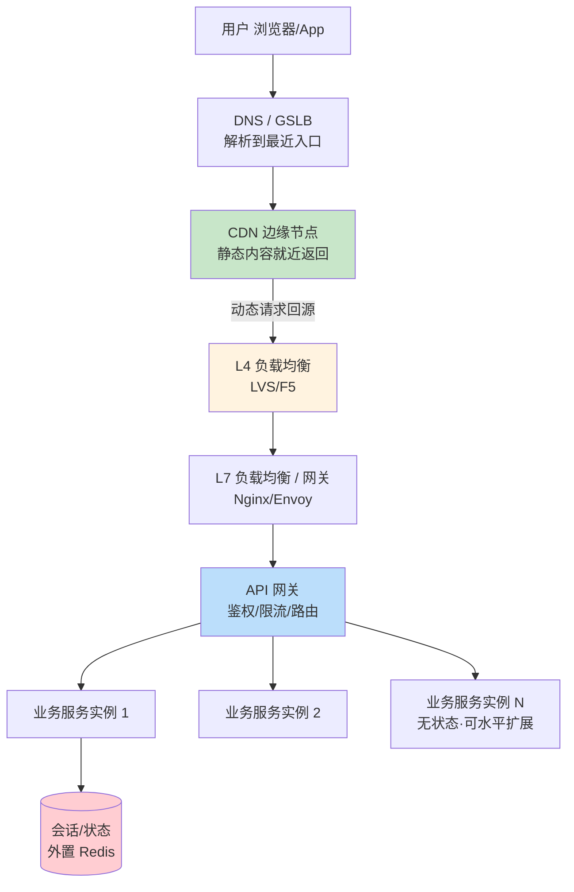
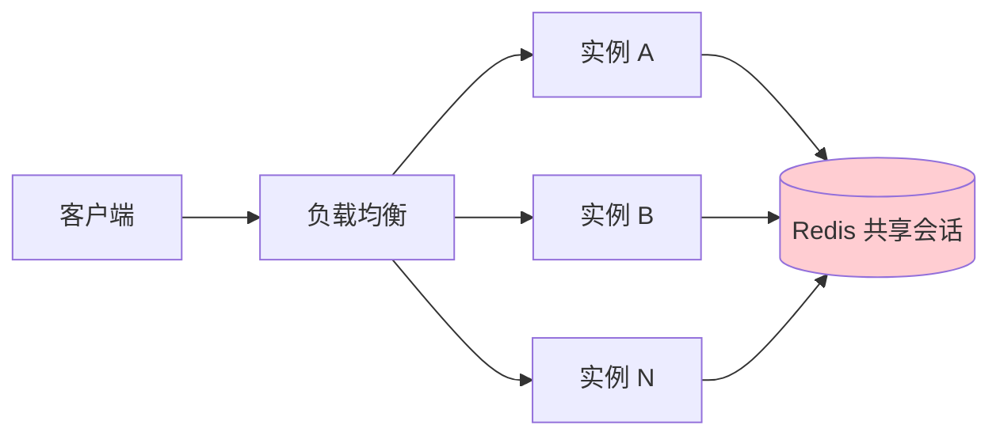

# 精通接入层与水平扩展

> 用户的请求从浏览器/App 出发，到真正命中你的业务逻辑之前，要穿过一层又一层基础设施：DNS → CDN → 负载均衡 → 网关 → 服务。这一层叫**接入层（Access Layer）**，是系统能不能"横向扩展、扛住流量、挂了不雪崩"的第一道关。
>
> 这一篇讲清楚接入层每一层的职责、选型与权衡，以及一个贯穿始终的核心命题：**横向扩展（Scale Out）的前提是无状态（Stateless）**。

---

## 一、从单机到接入层：流量进来的第一公里

单机时代，请求直接打到一个进程。一旦要扛量、要高可用，就必须在业务服务前面叠加接入层。一个成熟系统的流量入口全景：

**设计纪律：按需引入，别一上来全堆上。** DAU 几万的系统，一个 Nginx + 几个无状态服务实例就够了；CDN、多活、GSLB 是流量和可用性要求到了才加。面试时能说清"什么时候该加哪一层"，比把所有层都画上更能体现判断力。

---

## 二、DNS 与全局流量调度

DNS 是流量的第一个分流点。除了把域名解析成 IP，现代 DNS 还承担**全局流量调度**：

- **智能 DNS / GSLB（Global Server Load Balancing）**：根据用户地理位置、运营商、机房健康度，返回不同的 IP。北方用户解析到北京机房，南方解析到深圳机房，实现**就近接入**，降低 RTT。
- **故障切换**：某机房挂了，GSLB 把它的 IP 从解析结果剔除，流量自动导向健康机房。注意 DNS 有 TTL 缓存，切换不是瞬时的（分钟级），所以 DNS 容灾要配合更快的手段。
- **Anycast**：同一个 IP 在多地宣告，由 BGP 路由把用户引到最近节点。CDN 和 DNS 服务（如 8.8.8.8）大量使用，切换比 DNS 改解析快得多。

**权衡**：DNS 调度成本低、覆盖广，但 TTL 缓存导致切换慢、粒度粗（到机房级）。精细的实时流量调度还得靠下游的 LB 和网关。

---

## 三、负载均衡 L4 vs L7

负载均衡（LB）把流量分摊到多个后端实例，是水平扩展的核心。按工作的网络层次分两类：

| 维度 | L4（传输层） | L7（应用层） |
|---|---|---|
| 工作层 | TCP/UDP | HTTP/HTTPS/gRPC |
| 看得到 | IP + 端口 | URL、Header、Cookie、Body |
| 能力 | 仅转发，按连接分流 | 按路径/域名路由、改写、灰度、鉴权 |
| 性能 | 极高（百万级连接） | 略低（要解析应用层） |
| 代表 | LVS、F5、DPVS | Nginx、HAProxy、Envoy、Traefik |
| TLS | 通常透传 | 常在此终止 TLS |

典型生产架构是 **L4 + L7 两级**：LVS（L4）扛住海量连接做第一级分流，转给 Nginx/Envoy（L7）做精细路由。详见 [B25 Web 服务器与反向代理](../backend/B25-精通-Web-服务器与反向代理.md)。

### 3.1 负载均衡算法

| 算法 | 适用 | 注意 |
|---|---|---|
| 轮询 Round Robin | 实例性能均等 | 不考虑负载 |
| 加权轮询 | 实例配置不均 | 按权重分 |
| 最少连接 Least Conn | 请求耗时差异大 | 更均衡 |
| 一致性哈希 | 需要会话亲和 / 缓存命中 | 扩缩容时只迁移少量 key，见 [B11 分片](../backend/B11-精通分片与分区.md) |
| IP Hash | 简单会话保持 | 分布可能不均 |

### 3.2 健康检查与会话保持

- **健康检查**：LB 定期探测后端（TCP 连通 / HTTP 200），自动摘除故障实例。这是高可用的基础。
- **会话保持（sticky session）**：把同一用户的请求固定打到同一实例。**它是反模式信号**——意味着服务有状态，违背水平扩展原则。能不用就不用，宁可把状态外置（见下节）。

---

## 四、API 网关

API 网关（Gateway）是 L7 之后、业务服务之前的"统一入口"，把**横切关注点**从业务里抽出来收口：

- 认证鉴权（JWT 校验、OAuth）
- 限流熔断（保护后端，见 [B21](../backend/B21-精通背压与限流.md)）
- 路由与灰度（按版本/比例/用户分流）
- 协议转换（外部 HTTP ↔ 内部 gRPC）
- 聚合（BFF：为不同端聚合多个后端响应）
- 日志、监控、链路追踪埋点

**网关 vs 纯 LB**：LB 关心"把流量分到哪个实例"（连接级），网关关心"这个请求该不该过、怎么处理"（业务级）。生产中两者常合一部署（如 Envoy 既是 L7 LB 又是网关）。网关与 BFF 的细节见 [M06 API 网关与 BFF](../microservices/06-精通-API-网关与-BFF.md)。

**陷阱**：别把业务逻辑塞进网关。网关只做通用横切，一旦写业务，它就成了新的单体瓶颈和发布耦合点。

---

## 五、无状态化与会话外置

**这是整篇的核心。** 水平扩展的本质是"加机器就能扛更多"，而它成立的唯一前提是：**任意请求打到任意实例，结果都一样**——也就是服务**无状态**。

### 5.1 为什么有状态无法横扩

假设登录信息存在实例内存里：用户在实例 A 登录，下次请求被 LB 分到实例 B，B 不认识他 → 要么强制 sticky 绑死到 A（A 挂了就丢会话、扩容不均），要么用户被登出。**状态留在实例内，机器就不能随意增删**，扩展性归零。

### 5.2 把状态请出去

解法是把状态**外置到共享存储**，让服务实例变成纯计算单元：

| 方案 | 机制 | 优点 | 代价 |
|---|---|---|---|
| 会话外置到 Redis | session 存 Redis，实例只读取 | 实例完全无状态、可随意扩缩 | 多一次 Redis 读；Redis 要高可用 |
| 无状态 Token（JWT） | 状态编码进 token 由客户端持有 | 服务端不存会话，零查询 | 撤销难、token 变大、密钥管理，见 [B22 认证](../backend/B22-精通后端认证.md) |

**权衡**：JWT 适合无需即时撤销、追求零会话查询的场景；Redis 会话适合需要服务端控制（强制下线、会话管理）的场景。很多系统用"JWT access token（短期）+ Redis 存 refresh token / 黑名单"折中。

记住：**只要把状态外置干净，业务服务就能像牲口一样随意增删（cattle, not pets）**，这是云原生弹性的基础，也是 [B19 12-Factor App](../backend/B19-精通-12-Factor-App.md) 的核心原则之一。

---

## 六、CDN 与边缘加速

CDN（Content Delivery Network）把内容缓存到离用户最近的边缘节点，是**降延迟 + 卸载源站压力**的利器。

- **静态加速**：图片、视频、JS/CSS、下载包——直接在边缘命中，根本不回源。这是 CDN 最经典的用法，能卸载源站绝大部分出向带宽（回顾 [S02](./S02-精通-容量估算与必背数字.md) 的带宽估算，图片/视频出向是大头）。
- **动态加速（DSA）**：动态 API 请求虽不能缓存内容，但 CDN 可优化回源链路（就近接入边缘 + 专线回源 + TCP/TLS 优化）。
- **回源（origin pull）**：边缘未命中时回源站取，并按缓存策略（`Cache-Control`、TTL）缓存，见 [B02 HTTP 语义](../backend/B02-精通-HTTP-语义.md)。
- **缓存失效与预热**：内容更新要刷新 CDN（purge）；大促前把热点资源**预热**到边缘，避免开场回源风暴。

**陷阱**：给会变的动态内容设了长缓存 → 用户看到旧数据；或带个性化信息的页面被 CDN 缓存后串号。要严格区分可缓存（公共静态）和不可缓存（私有动态）。

---

## 七、同城双活与异地多活

可用性要求到 99.99%，单机房不够，要做多机房部署。难度递增：

| 形态 | 说明 | 难点 |
|---|---|---|
| 同城双活 | 同城两机房，RTT ~1ms，可近似当一个机房用 | 数据库主从/双写，延迟可接受 |
| 异地多活 | 跨城多机房同时提供服务 | 跨城 RTT ~30ms，强一致写极贵 |
| 异地灾备 | 异地备份，主挂了才切 | 切换慢、平时资源闲置 |

**异地多活的核心是单元化（Set/Unit 化）**：按用户维度把流量切成单元，每个单元在一个机房闭环处理自己的用户，**就近读写、避免跨城同步**。跨单元的全局数据（少量）才做跨城同步，并接受最终一致。

为什么这么设计？回顾 [S02](./S02-精通-容量估算与必背数字.md)：跨城 RTT ~30ms 是光速物理下限。如果每次写都要跨城确认，延迟无法接受。所以异地多活的本质是**用数据分区（按用户就近）绕开跨城同步**，而不是真的让一份数据在多地强一致。

**容灾切换**：某机房故障，把它负责的用户单元切到其他机房（DNS/GSLB + 流量调度），并处理好数据追平。切换演练（如阿里的"双十一切流"）是异地多活能力的试金石。

---

## 八、长连接接入层

前面讨论的多是 HTTP 短请求。IM、推送、实时协作等场景需要**长连接**（WebSocket / 长轮询 / 自定义 TCP），接入层要专门设计：

- **海量连接**：百万级长连接，单机靠 epoll/io_uring + 调优能扛几十万到百万连接（见 [L08 IO 多路复用](../linux/L08-精通-IO-多路复用.md)），需多台连接网关横向扩展。
- **连接路由表**：消息要推给某个用户，得知道"他的长连接挂在哪台网关上"。维护 `uid → gateway/conn` 的路由（存 Redis 或专门的路由服务），推送时先查路由再投递。
- **有状态的特殊性**：长连接天然"有状态"（连接绑在某台网关），所以扩容、网关重启要处理连接迁移/重连。这与第五节的无状态原则是张力点——把**业务状态**外置，但**连接本身**不得不留在网关，靠路由表解耦"谁在哪"。

长连接接入层的完整设计（在线状态、消息可靠投递、群扩散）见 [S09 设计 IM 即时通讯](./S09-精通-设计IM即时通讯.md)。

---

## 陷阱清单

- **会话留在实例内存**：水平扩展第一杀手。必须外置或用无状态 token。
- **滥用 sticky session**：用会话保持掩盖有状态问题，扩容不均、实例挂了丢会话。
- **业务逻辑塞进网关**：网关变单体，发布耦合、性能瓶颈。
- **CDN 缓存了动态/私有内容**：数据陈旧或用户串号。
- **以为 DNS 切换是实时的**：TTL 缓存导致故障切换有分钟级延迟，容灾不能只靠 DNS。
- **异地多活承诺跨城强一致低延迟**：违背光速物理下限，做不到。多活必须配数据分区 + 就近 + 最终一致。
- **健康检查过松或过严**：过松摘不掉故障实例，过严把抖动实例误杀导致连锁。
- **忘了 LB 自身的高可用**：LB 单点也会挂，要做 LB 集群 + VIP 漂移（如 keepalived）。

---

## 2026 现状

- **K8s Gateway API GA**：作为 Ingress 的继任者，提供更强的 L7 路由表达能力（按 Header/权重/流量切分），逐步成为云原生入口标准，见 [C04 Ingress 与 Gateway API](../cloud-native/C04-精通-Ingress-与-Gateway-API.md)。
- **eBPF 数据面**：Cilium 用 eBPF 实现内核态负载均衡与 Service Mesh，绕开 iptables/用户态代理，性能更高、sidecar 更轻（Istio Ambient 无 sidecar 模式 GA），见 [C10 Service Mesh](../cloud-native/C10-精通-Service-Mesh.md)。
- **QUIC / HTTP/3 普及**：基于 UDP，0-RTT、连接迁移（切换网络不断连），对移动端长连接和弱网体验提升明显；CDN 与网关普遍支持。
- **Anycast 常态化**：主流 CDN 与云 LB 默认 Anycast，故障切换更快。
- **后量子 TLS**：X25519MLKEM768 混合密钥交换在浏览器/CDN 默认开启，TLS 终止层需跟进，见 [B03 TLS](../backend/B03-精通-TLS-与-HTTPS.md)。

---

## 练习题

1. 解释为什么"把登录态存在服务实例的本地内存里"会让你无法做水平扩展，并给出两种修正方案及各自代价。

参考答案

因为请求经负载均衡会被分到任意实例：用户在实例 A 登录、登录态存在 A 的内存里，下次请求被分到 B，B 不认识他——要么强制 sticky 把他绑死在 A（A 挂了会话就丢、扩容不均），要么用户被登出。状态绑在具体机器上，机器就不能随意增删，水平扩展失效。两种修正：①**会话外置到 Redis**——实例变无状态可随意扩缩，代价是每次请求多一次 Redis 读、Redis 自身要高可用；②**无状态 Token（JWT）**——状态编码进 token 由客户端持有，服务端不存会话、零查询，代价是撤销/强制下线难、token 体积变大、密钥管理。

2. 一个系统同时需要"按 URL 路径路由到不同微服务"和"百万级 TCP 长连接接入"，你会如何组合 L4 与 L7？分别放什么？

参考答案

用 L4 + L7 两级。**L4（如 LVS/DPVS）放在最前**，承接百万级 TCP 连接、做第一级按连接的高性能分流——它只看 IP/端口、转发开销极小，最适合扛海量连接（尤其长连接接入）。**L7（如 Nginx/Envoy）在 L4 之后**，解析 HTTP、按 URL 路径/域名/Header 把请求路由到不同微服务，并做鉴权、限流、灰度。对于百万长连接，可在 L4 后接专门的长连接接入网关维护连接。分工：L4 管"连接规模和粗分流"，L7 管"应用层精细路由"，各取所长。

3. DNS 故障切换有什么固有延迟？为什么不能只靠 DNS 做机房级容灾？还需要配合什么？

参考答案

DNS 有 TTL 缓存：你把故障机房的 IP 从解析结果剔除后，各级解析器和客户端仍会使用缓存的旧 IP 直到 TTL 过期，所以切换有**分钟级延迟**，不是实时的。不能只靠 DNS 容灾的原因：切换慢（TTL 决定）、粒度粗（只能到机房/IP 级）、且有客户端不遵守 TTL 的情况。需要配合更快的手段：①**Anycast**（同一 IP 多地宣告，靠 BGP 路由秒级把流量引到健康节点）；②**LB 层健康检查**自动摘除故障实例；③客户端/SDK 重试其他 IP 或多活入口；④GSLB 综合调度。即 DNS 做粗粒度调度，快速容灾靠 Anycast + LB 健康检查兜。

4. 设计一个图片站，估算（参考 S02）后发现出向带宽 30Gbps。请说明 CDN 在其中承担什么、源站还剩多少压力。

参考答案

CDN 承担绝大部分出向：图片是静态内容、用户分布广，把图片缓存到离用户最近的 CDN 边缘节点，用户请求在边缘直接命中返回，这 30Gbps 的大头由 CDN 边缘网络分摊，根本不回源站。源站只承担"边缘未命中时的回源"——若 CDN 命中率做到 95%+，回源出向降到约 30Gbps × 5% ≈ 1.5Gbps 量级，单机房轻松承受。所以正确结论不是给源站堆几张万兆网卡硬扛 30Gbps，而是 CDN 扛出向主力、源站只做少量回源（再配缓存预热、防盗链）。

5. 异地多活为什么必须做"单元化/按用户分区"，而不能简单地让一份数据在多个机房强一致同步？用延迟数字论证。

参考答案

因为跨城 RTT ~30ms 是光速决定的物理下限（如京沪往返）。如果让一份数据在多个机房强一致同步，每次写都要等跨城对端确认，至少一个 ~30ms 的跨城往返（强一致协议往往还要多次交互），写延迟不可接受；且网络分区时为保一致只能拒绝写、可用性受损（CAP）。单元化/按用户分区把流量按用户切成单元，每个单元在某个机房内闭环处理自己的用户、就近读写，避免日常的跨城同步；只有少量全局数据才跨城同步并接受最终一致。本质是用"数据按用户分区 + 就近"绕开无法消除的跨城物理延迟，而不是真让一份数据在多地强一致。

6. 会话保持（sticky session）在什么情况下不得不用？它带来哪些扩展性与可用性问题？

参考答案

在服务**有状态且状态没有外置**时不得不用：比如遗留系统把会话/购物车存在实例本地内存、或长连接天然绑定在某台接入网关上，必须让同一用户的请求落到同一实例。问题：①**扩容不均**——已有会话粘在旧实例上，新加的实例分不到老用户流量，负载不均衡；②**可用性差**——某实例宕机，粘在它上面的所有会话/连接全部丢失；③**违背无状态原则**，妨碍弹性扩缩容（不能随意增删实例）。所以 sticky 是"有状态"的妥协标志，能把状态外置（Redis/JWT）就尽量别用它。

7. 长连接网关如何知道"该把消息推给的用户连在哪台机器上"？这个路由表存哪、怎么更新？

参考答案

靠一张 `uid → 网关ID/连接ID` 的**路由表**，通常存在 Redis（共享、低延迟）。用户建立长连接时，接入网关把"该 uid 在本网关、连接 X"写入路由表，并随心跳维持；连接断开/心跳超时则清除。要给某用户推消息时，消息服务先查路由表得知其所在网关，把消息投递到该网关，再由网关通过对应长连接推给用户。更新时机：连接建立、断开、重连（迁移到新网关要更新指向）、网关宕机（批量清理其名下所有路由）时都要及时更新——否则消息会被推到错误或失效的网关而丢失。多端登录时一个 uid 对应多条连接记录，需都推送。

