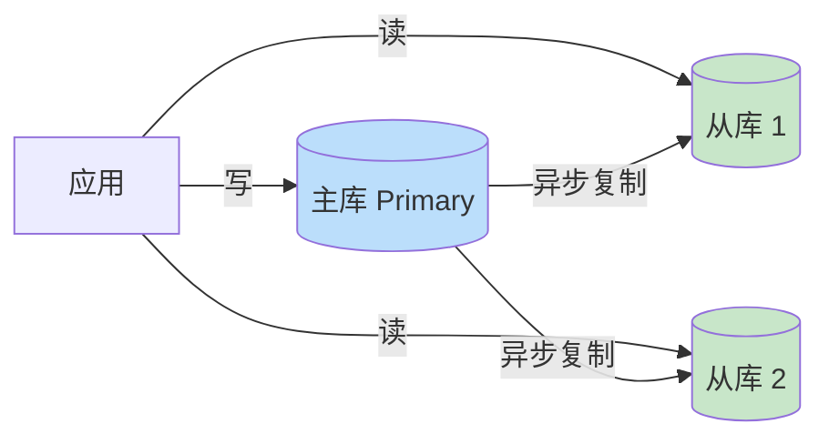

# 精通数据层扩展设计

> 无状态服务加机器就能扩，数据层不行——**数据是有状态的，它是系统里最难扩展、也最容易成为瓶颈的一层**。一道系统设计题做到后期，瓶颈几乎总是落在数据库上。
>
> 这一篇讲数据层从单机走向海量的完整路径：读写分离 → 分库分表 → 分片键选择 → 不停机扩容 → 一致性级别选择。组件内部原理（B-tree、MVCC、复制协议）在 [backend](../backend/INDEX.md) 与各数据库专题里，这里聚焦**设计决策**。

---

## 一、为什么数据层是最难扩的一层

无状态服务可以"加机器就扩"，因为每台机器都一样、互不依赖。数据库不行：

- **数据有状态**：每条数据只在某些节点上，不能随便复制到所有节点（成本 + 一致性）。
- **读写不对称**：读可以靠副本扩展，写必须落到"拥有这份数据"的节点，写扩展难得多。
- **一致性约束**：多副本之间要保持一致，而一致性、可用性、分区容忍三者受 CAP 约束不能全要，见 [B12 复制与 CAP](../backend/B12-精通数据库复制与-CAP.md)。

所以数据层扩展是一套**有顺序的组合拳**：先榨干单机 → 读写分离扩读 → 分库分表扩写 → 最后处理一致性与扩容。

---

## 二、垂直扩展的尽头，水平扩展的开始

- **垂直扩展（Scale Up）**：换更强的机器（更多 CPU/内存/NVMe）。简单、无需改架构，应该是**第一选择**。但有物理与性价比天花板，且单机始终是单点。
- **水平扩展（Scale Out）**：加更多机器分摊。理论上无上限，但要解决数据分布、路由、一致性，复杂度陡增。

**设计纪律：先垂直、再读写分离、最后才水平分片。** 别一上来就分库分表——它引入的复杂度（跨片查询、分布式事务、扩容）极高。面试时若估算（见 [S02](./S02-精通-容量估算与必背数字.md)）显示单库够用，就大方说"现阶段单库 + 读副本足够，待写入到 X QPS 再分片"，这是成熟判断。

---

## 三、读写分离与读副本

大多数业务读多写多倍（社交可达 100:1）。**读写分离**是性价比最高的第一步扩展：一主多从，写走主库，读走从库，读能力随从库数量线性扩展。



### 3.1 主从延迟与"读己之写"

主从复制通常**异步**，从库落后主库几毫秒到几秒。由此产生经典问题：**用户刚写完立刻读，可能读到从库的旧数据**（读不到自己刚发的评论）。这叫破坏了 **read-your-writes（读己之写）一致性**。

解法：

| 策略 | 做法 | 代价 |
|---|---|---|
| 强制走主 | 写后一段时间内该用户的读走主库 | 主库压力上升 |
| 读后等待 | 读时校验从库是否追上写入位点（如 GTID） | 实现复杂、可能等待 |
| 会话粘连 | 同一会话的写后读路由到主或已追平的从 | 需要会话级路由 |
| 客户端缓存 | 写成功后本地先用自己写的值 | 仅本端有效 |

实战常用"**写后 N 秒内强制走主**"这种简单策略覆盖绝大多数场景。

---

## 四、分库分表：何时拆、怎么拆

当**写入**或**单表数据量**到了单机扛不住（读副本解决不了写瓶颈），才上分库分表。

- **垂直拆分**：按业务/字段拆。垂直分库——用户库、订单库、商品库各自独立；垂直分表——把大字段（如文章正文）拆到单独的表。**先做垂直拆分**，它符合业务边界、复杂度低。
- **水平拆分（Sharding）**：把同一张表的行，按某个键分散到多个库/表。这是真正解决海量数据和写瓶颈的手段，也是复杂度的来源。

落地形态：

| 形态 | 代表 | 特点 |
|---|---|---|
| 客户端/SDK 分片 | ShardingSphere-JDBC | 应用内路由，无中间件，运维简单但侵入代码 |
| 代理中间件 | ShardingSphere-Proxy、MyCat | 独立代理，对应用透明，多一跳 |
| 数据库原生分片 | Vitess（MySQL）、MongoDB sharding | 数据库层解决，见 [B11 分片](../backend/B11-精通分片与分区.md) |

详见 [B11 分片与分区](../backend/B11-精通分片与分区.md)，这里重点讲最考验功力的"分片键选择"。

---

## 五、分片键选择

**分片键（Sharding Key）选错，是分库分表里代价最大的错误**——它决定数据怎么分布、查询能不能命中单片、会不会热点、将来怎么扩容。面试官几乎必问。

### 5.1 常见分片策略

| 策略 | 路由方式 | 优点 | 缺点 |
|---|---|---|---|
| 范围分片 Range | 按区间（如时间、ID 段） | 范围查询友好、易扩容 | 易热点（新数据全打最新片） |
| 哈希分片 Hash | `hash(key) % N` | 分布均匀、无热点 | 范围查询要扫所有片；扩容要 rehash |
| 一致性哈希 | 哈希环 | 扩容只迁移少量数据 | 实现复杂，见 [B11](../backend/B11-精通分片与分区.md) |
| 查表/目录 | 维护 key→片 映射表 | 灵活、可手工均衡 | 多一次查映射、映射表自身要高可用 |

### 5.2 选键的核心原则

1. **让最高频查询能路由到单片**。比如电商订单，用户查"我的订单"最频繁 → 用 `user_id` 分片，则一个用户的订单都在同一片，查询命中单片。若用 `order_id` 分片，则查某用户订单要扫全部片（scatter-gather），灾难。
2. **分布要均匀，避免数据倾斜与热点**。用自增 ID 范围分片，新订单永远打最后一片 → 写热点。用 `user_id` 哈希则均匀。
3. **避免跨片操作**。跨片 join、跨片事务、跨片聚合都极贵。好的分片键让绝大多数操作落在单片内。

### 5.3 经典技巧：基因法（Gene）

电商常遇到两个高频维度：用户查自己订单（`user_id`）、商家/系统按订单号查（`order_id`）。只能选一个键分片，另一个就要扫全片。**基因法**把 `user_id` 的分片基因（低几位）**编码进 `order_id`**，使得用 `order_id` 也能反解出所在分片：

```
order_id = 高位(时间/序列) + 低位(user_id 的分片基因)
路由时：shard = order_id 的基因位
```

这样 `user_id` 和 `order_id` 两种查询都能命中单片。这是分库分表里"鱼与熊掌"的经典解法，面试讲出来很加分。

### 5.4 跨片查询怎么办

实在避不开的跨维度查询（如运营后台按各种条件查订单），**不要在分片库上硬查**，而是：**把数据异构同步到 ES**（见 [S12 设计搜索](./S12-精通-设计搜索与自动补全.md)）或宽表，专门服务复杂查询。分片库只服务核心的单片高频查询。

---

## 六、扩容与 resharding

分片系统最痛的运维：**数据涨了，分片不够，要加片且不能停机**。

### 6.1 朴素哈希的扩容灾难

`hash(key) % N`，当 N 从 4 变 5，几乎所有 key 的归属都变了 → 要迁移几乎全部数据。不可接受。

### 6.2 三种缓解手段

| 方案 | 机制 | 优点 |
|---|---|---|
| 一致性哈希 | key 和节点都映射到哈希环，扩容只影响相邻区间 | 扩容只迁移 ~1/N 数据，见 [B11](../backend/B11-精通分片与分区.md) |
| 预分片（虚拟槽 slot） | 预先分成固定多个槽（如 Redis Cluster 16384 槽），槽再映射到物理节点 | 扩容只是搬槽，不 rehash |
| 倍增扩容 | 库数翻倍（4→8），每片对半分 | 迁移规则简单，只迁一半 |

**预分片是工程上最常用的**：一开始就分成远多于物理节点的逻辑分片（如 1024 个逻辑分片放在 4 个物理库），扩容时把部分逻辑分片整体搬到新库即可，路由规则不变。

### 6.3 不停机迁移（双写迁移）

标准灰度迁移流程：


关键点：双写期要处理好新老库一致性（以哪个为准）、迁移中途回滚预案、校验环节不能省。

---

## 七、冷热分离与历史数据归档

不是所有数据都同等重要。**冷热分离**按访问频率分层存储，省钱又提速：

- **热数据**（近 N 天、活跃）：放高性能存储（SSD / 内存 / 缓存），承载主要访问。
- **温/冷数据**（历史）：归档到廉价存储（对象存储、HDD、专门的归档库），少量访问可接受慢一点。

典型做法：订单库只留近 3 个月的热数据保证查询性能，更早的归档到历史库/数仓，按需查询。这也呼应 [S02](./S02-精通-容量估算与必背数字.md) 存储估算里"热数据放 SSD、冷数据归档"的成本意识。

---

## 八、一致性级别如何选

数据层扩展（多副本、分片）必然带来一致性问题。**不存在"永远强一致"的免费午餐**，要按业务选合适的级别：

| 级别 | 含义 | 适用场景 |
|---|---|---|
| 强一致 (Linearizable) | 写完，所有读立即看到最新 | 余额、库存、支付，见 [S15](./S15-精通-设计支付与订单系统.md) |
| 读己之写 | 自己写的自己立即能读到 | 用户发评论后看自己的评论 |
| 单调读 | 不会读到比之前更旧的 | 同一用户连续刷新不倒退 |
| 最终一致 | 一段时间后趋于一致 | 点赞数、Feed、粉丝数 |

**选择原则**：钱和库存相关的走强一致（宁可慢、宁可不可用也不能错）；社交计数、Feed、推荐等容忍最终一致（换取高可用和性能）。同一个系统不同模块可以用不同级别——支付强一致、点赞最终一致。CAP/一致性模型的理论见 [B12 复制与 CAP](../backend/B12-精通数据库复制与-CAP.md)。

---

## 九、分布式 ID

单库时用自增主键，分库后**自增 ID 会冲突**（每个库各自从 1 自增），且自增 ID 暴露业务量、不利于分片。需要全局唯一 ID：

- **雪花算法 Snowflake**：64 位 = 时间戳 + 机器号 + 序列号，趋势递增、无中心依赖（要处理时钟回拨）。
- **号段模式**：从中心发号器批量取一段 ID 缓存到本地用（如美团 Leaf）。
- **UUID**：简单但无序、占 16B、对索引不友好（PostgreSQL 18 的 UUIDv7 改善了有序性）。

详见 [M16 分布式 ID](../microservices/16-精通-分布式-ID.md)。注意：分片键和主键 ID 是两回事——ID 保证唯一，分片键决定数据分布，二者可以不同（也可如基因法让 ID 携带分片信息）。

---

## 陷阱清单

- **过早分库分表**：单库够用就硬分，凭空背上跨片查询/分布式事务/扩容三座大山。
- **分片键选错**：用了非高频查询维度做分片键，导致主要查询全表扫（scatter-gather）。
- **忽视数据倾斜**：按地区/大 V 分片，热门片被打爆。要预估分布。
- **朴素 `% N` 分片**：扩容时几乎全量迁移。用一致性哈希或预分片。
- **跨片硬查**：在分片库上做复杂多维查询。应异构到 ES/宽表。
- **以为读副本能扩写**：读写分离只扩读，写瓶颈得靠分片。
- **分库后还用自增 ID**：ID 冲突。必须上分布式 ID。
- **迁移不双写不校验**：直接切换，数据丢失或不一致无法回滚。

---

## 2026 现状

- **NewSQL 改变游戏规则**：TiDB / CockroachDB / YugabyteDB / Spanner 把分片、复制、分布式事务做进存储层，应用层**几乎不用手工分库分表**，写性能水平扩展、对外仍是单库视图。中大型新系统越来越多直接选 NewSQL 跳过分库分表的复杂度。
- **PostgreSQL 18**：异步 I/O、UUIDv7（有序 UUID，适合做主键）、virtual generated columns，单机性能进一步上探，推后了"必须分片"的拐点，见 [P22 PG18 新特性](../postgresql/22-精通-PG18-17-新特性.md)。
- **Vitess 成熟**：YouTube 出身的 MySQL 分片方案，PlanetScale 等托管化，让 MySQL 分片运维门槛大降。
- **存算分离**：云原生数据库（Aurora、PolarDB）存算分离，计算节点无状态可秒级扩、存储共享，改变了传统主从的扩展方式。

---

## 练习题

1. 一个订单系统，"用户查自己订单"和"客服按订单号查"都是高频。只能选一个分片键，你怎么办？详述基因法如何同时满足两种查询。

<details><summary>参考答案</summary>

选 **user_id 作分片键**（因为"用户查自己订单"最高频，用 user_id 分片能让一个用户的订单都落在同一片、查询命中单片）。但这样"按 order_id 查"就要扫所有片（scatter-gather）。**基因法**解决：生成 order_id 时，把 user_id 的"分片基因"（即决定路由的那几位，如 user_id 取模/哈希后的低位）**编码进 order_id**（如 order_id = 时间序列号 + user_id 分片基因位）。这样按 order_id 查询时，直接从 order_id 里反解出分片基因就知道它在哪一片，无需扫全片。于是 user_id 查询和 order_id 查询都能命中单片。这是分库分表里"两个高频维度只能选一个分片键"的经典破解法。

</details>

2. 解释为什么 `hash(key) % N` 在扩容时是灾难，并对比一致性哈希和预分片（虚拟槽）如何缓解。

<details><summary>参考答案</summary>

`hash(key) % N`：当节点数 N 变化（如 4→5），取模结果几乎全变，绝大多数 key 的归属节点都改变，扩容要迁移几乎全部数据，不可接受。**一致性哈希**：把 key 和节点都映射到一个哈希环上，key 归属顺时针最近的节点；增删节点只影响环上相邻区间的 key，扩容只需迁移约 1/N 的数据（配合虚拟节点让分布更均匀）。**预分片（虚拟槽）**：一开始就分成远多于物理节点的固定数量逻辑槽（如 Redis Cluster 的 16384 槽），key 先映射到槽、槽再映射到物理节点；扩容时只是把部分槽整体搬到新节点，key→槽 的规则不变、无需 rehash。两者都把"扩容=全量迁移"降为"只迁一小部分"。

</details>

3. 你的系统读写比 80:1，写 QPS 3000、单表 5 亿行查询变慢。应该先做读写分离还是分库分表？为什么？

<details><summary>参考答案</summary>

要分清瓶颈来源。读写分离（加从库）只能扩**读 QPS**，对"单表 5 亿行导致查询慢"和写瓶颈无能为力。这里的核心问题是**单表数据量过大**（5 亿行），查询慢主因是表太大、索引深、扫描多——这只能靠**分库分表**把单表拆小来解决；写 3000 QPS 虽不算极高，但叠加大表，分表也顺带缓解写压力。所以应**优先分库分表**（解决单表大 + 写）。读写分离可作为补充进一步扩读 QPS。判断原则：读 QPS 高但表不大 → 先读写分离（最划算）；单表数据量已到瓶颈（如 5 亿）→ 必须分库分表。

</details>

4. "用户发完评论刷新看不到自己的评论"——这是什么一致性问题？给出三种解法及代价。

<details><summary>参考答案</summary>

这是**读己之写（read-your-writes）一致性**被破坏：主从异步复制下，用户写到主库，紧接着的读被路由到尚未追上的从库，读到旧数据（看不到自己刚发的评论）。三种解法：①**写后强制走主**——该用户写操作后的一小段时间内，其读请求强制路由到主库（代价：增加主库读压力）；②**读时校验复制位点**——读从库前检查它是否已追上写入位点（如 GTID），未追上则等待或转主（代价：实现复杂、可能引入等待延迟）；③**客户端本地回显**——写成功后客户端先用自己提交的值展示（代价：只对本端有效，其他端仍可能短暂看不到）。实战常用①的简单版"写后 N 秒走主"覆盖绝大多数场景。

</details>

5. 设计一个不停机的分库迁移方案（从 4 库迁到 8 库），列出每个步骤和回滚预案。

<details><summary>参考答案</summary>

标准双写灰度迁移：①**双写**——上线后同时写老库（4）和新库（8），新增数据两边都有；②**存量迁移**——后台任务把老库历史数据按新分片规则搬到新库；③**数据校验**——比对新老库数据一致（按主键/对账），处理双写期的冲突（以老库为准）；④**灰度切读**——逐步把读流量从老库切到新库（按比例/按用户灰度），观察正确性和性能；⑤**停老库写、下线**——读全切新库且稳定后，停止双写、以新库为唯一源，下线老库。回滚预案：每一步都可回退——切读阶段发现异常立即把读切回老库；双写阶段始终以老库为权威，新库有问题可重灌；下线老库前保留一段观察期，确认无误再真正下线。关键是双写 + 校验 + 灰度，任何一步可回滚。

</details>

6. 同一个电商系统里，"账户余额"和"商品点赞数"应分别用什么一致性级别？为什么？

<details><summary>参考答案</summary>

**账户余额用强一致**：余额涉及钱，多扣少扣都是事故，必须保证任何时刻读到的都是最新准确值、并发扣减不能出错，宁可牺牲一点性能/可用性也要强一致（配合事务、行锁、对账）。**商品点赞数用最终一致**：点赞数短暂不精确（差几个、延迟几秒更新）完全不影响业务和体验，为了支撑高并发点赞（写聚合、异步、缓存），可以接受最终一致，换取高吞吐和高可用。这体现"按业务场景选一致性级别"——同一系统不同模块用不同级别，把强一致的成本只花在真正需要的地方（钱），其余用最终一致换性能。

</details>

7. 在什么情况下你会建议团队直接上 TiDB 这类 NewSQL，而不是 MySQL 分库分表？各自的取舍是什么？

<details><summary>参考答案</summary>

当：①写入需要水平扩展，但团队不想承担应用层分库分表带来的复杂度（分片键选择、跨片 JOIN/事务、resharding 扩容）；②业务需要对外仍是"单库视图"、需要较强的跨行/分布式事务和一致性；③数据量大且持续增长、希望存储层弹性扩展——这时建议直接上 TiDB 等 NewSQL，它把分片、复制、分布式事务做进存储层，应用几乎无感、写性能可水平扩展。取舍：TiDB 运维和资源成本更高、组件更重、极致单机简单查询性能和生态成熟度不如 MySQL；MySQL 分库分表更轻量、生态成熟，但把复杂度推给了应用层（跨片能力弱、扩容麻烦）。结论：中大型新系统、跨片需求多 → 倾向 NewSQL；已有 MySQL 体系且规模/分片可控 → 分库分表更务实。

</details>

