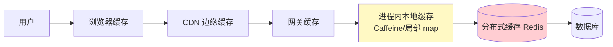
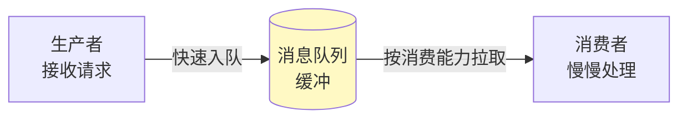
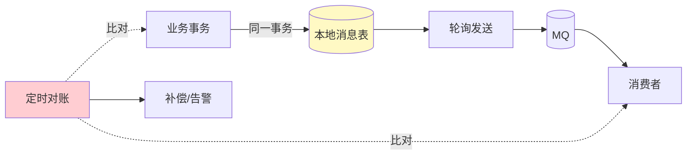

# 精通缓存与异步化设计

> 系统提速有两把万能武器：**缓存**换读性能，**异步**换写性能与解耦。几乎每一道系统设计题，到了"流量涨 100 倍怎么办"的环节，答案里都少不了这两样。
>
> 这一篇讲怎么在设计中正确地用缓存和异步——包括它们各自的模式、最难的"一致性"问题，以及一个常被忽视的点：**它们都不是银弹，用错了反而埋雷**。

---

## 一、加速系统的两把武器：缓存与异步

| 武器 | 解决什么 | 本质 | 主要代价 |
|---|---|---|---|
| 缓存 | 读慢、读压力大 | 用空间换时间，把热数据放离用户更近的快存储 | 一致性（缓存与源数据可能不一致） |
| 异步 | 写慢、耦合紧、突发流量 | 把"同步等结果"变成"先收下、慢慢处理" | 一致性（结果延迟）+ 复杂度（要兜底） |

注意它们的共同代价都是**一致性**。所以这一篇反复出现的主题是：**性能和一致性的权衡**——你为速度付出的，往往是"数据在某个瞬间不准"的容忍。

---

## 二、多级缓存体系

缓存不是只有 Redis 一层。从用户到数据库，每一层都能缓存，逐级拦截请求：



| 层 | 特点 | 适用 |
|---|---|---|
| 浏览器/客户端 | 零网络，最快 | 静态资源、用户私有数据 |
| CDN | 就近，卸载源站 | 静态内容，见 [S03](./S03-精通-接入层与水平扩展.md) |
| 进程内本地缓存 | 纳秒级、无网络，但每实例一份、容量小、需考虑一致性 | 极热点小数据（如配置、热门商品） |
| 分布式缓存 Redis | 共享、容量大、毫秒级 | 主力缓存层 |

**多级的价值**：本地缓存挡住极热点（避免热点 key 把单个 Redis 节点打爆），Redis 挡住大部分读，只有少量穿透到 DB。设计时给出**逐级命中率**（如本地 70%、Redis 25%、回源 5%），体现你对压力分摊的量化理解（呼应 [S02](./S02-精通-容量估算与必背数字.md) 的命中率估算）。

---

## 三、缓存读写模式

缓存与数据库如何配合，有几种标准模式：

| 模式 | 读 | 写 | 特点 |
|---|---|---|---|
| **Cache-Aside（旁路）** | 先查缓存，未命中查 DB 再回填 | 更新 DB，删除缓存 | 最常用，应用控制，缓存故障不影响正确性 |
| Read-Through | 缓存自己负责回源 | — | 应用只跟缓存打交道，逻辑收口到缓存层 |
| Write-Through | — | 写缓存同时同步写 DB | 强一致，但写变慢 |
| Write-Back（Write-Behind） | — | 写缓存即返回，异步刷 DB | 写极快，但宕机丢数据风险 |

**Cache-Aside 是默认选择**，因为它简单、缓存挂了也只是降级到 DB（不影响正确性）。Write-Back 性能最好但有丢数据风险，只用于能容忍的场景（如计数器、见 [S10](./S10-精通-设计排行榜与计数系统.md)）。

```go
// Cache-Aside 读
func GetUser(id int64) (*User, error) {
    if u, ok := cache.Get(id); ok {
        return u, nil // 命中
    }
    u, err := db.QueryUser(id) // 未命中回源
    if err != nil {
        return nil, err
    }
    cache.SetEX(id, u, ttl) // 回填，带过期
    return u, nil
}
```

---

## 四、缓存一致性

缓存最难的问题：**DB 更新了，缓存怎么办？** 处理不好就是用户看到旧数据。

### 4.1 更新缓存还是删除缓存？

**删除缓存**（让下次读重新回源）优于**更新缓存**（写回新值）：更新缓存在并发下容易写入旧值（两个写交错），且可能写了从不被读的缓存（浪费）。所以 Cache-Aside 标准做法是**更新 DB + 删除缓存**。

### 4.2 先删缓存还是先更 DB？

两种顺序都有并发漏洞：

- **先删缓存，再更 DB**：删缓存后、更 DB 前，有读请求把**旧值**回填缓存 → 不一致。
- **先更 DB，再删缓存**（推荐）：更 DB 后删缓存前的极短窗口有读会读到旧缓存，但删除后即恢复，窗口小得多。

### 4.3 延迟双删

为弥补"先更 DB 再删缓存"的残留窗口，可在更新后**延迟一小段时间再删一次**缓存（延迟双删），清掉期间可能被回填的旧值。实现简单但延迟时间难精确。

### 4.4 订阅 binlog 失效缓存

更彻底的方案：用 CDC 工具（Debezium / Canal / Flink CDC）**订阅数据库 binlog**，数据一变就发消息让缓存失效。优点是缓存失效与 DB 变更解耦、不漏更新、对业务代码无侵入；代价是多一套 CDC 链路。

### 4.5 按业务容忍度选

| 容忍度 | 方案 |
|---|---|
| 能容忍秒级不一致（多数场景） | 先更 DB 再删缓存 + 合理 TTL 兜底 |
| 要求更强 | 延迟双删 / 订阅 binlog 失效 |
| 必须强一致（如库存） | 别缓存，或读时校验，或用分布式锁 |

**关键认知**：缓存一致性没有完美解，**TTL 兜底**永远是最后防线——即使删除失败/漏删，缓存也会在 TTL 后自动过期回源。设计时务必给缓存设过期时间。缓存策略细节见 [B15 缓存策略](../backend/B15-精通缓存策略.md)。

---

## 五、缓存三大经典问题

缓存设计绕不开的三个高频面试点（原理与详解见 [B15 缓存策略](../backend/B15-精通缓存策略.md)，这里讲设计时如何规避）：

| 问题 | 现象 | 规避 |
|---|---|---|
| **缓存雪崩** | 大量 key 同时过期 / 缓存集群宕机，请求洪峰打到 DB | 过期时间加随机抖动；缓存高可用；限流降级兜底 |
| **缓存穿透** | 查不存在的数据，缓存永远不命中，每次打 DB（常被恶意利用） | 缓存空值；布隆过滤器拦截不存在的 key |
| **缓存击穿** | 某个热点 key 过期瞬间，大量请求同时回源 DB | 互斥锁/单飞（singleflight）只让一个请求回源；热点永不过期 + 异步刷新 |

设计中主动提这三点并给出防护，是"考虑了 happy path 之外"的成熟表现。

---

## 六、热点 key 与大 key

- **热点 key**：某个 key 访问量极高（如顶流明星、爆款商品），集中打到 Redis 单个节点，把该节点打爆（Redis 单节点约 10万 QPS 量级）。
  - 解法：**本地缓存兜底**（热点在进程内拦截，不到 Redis）；**热点 key 拆分**（key 后加随机后缀分散到多节点，读时随机选一个）；热点探测自动发现。
- **大 key**：单个 value 过大（如一个超大 list/hash），读写阻塞、网络拥塞、迁移困难。
  - 解法：**拆分**（大 hash 拆成多个小 hash）；避免一次性全量读（用 HSCAN 等渐进操作）。

热点是秒杀、排行榜、Feed 这类题的核心难点，分别见 [S07](./S07-精通-设计秒杀系统.md)、[S10](./S10-精通-设计排行榜与计数系统.md)、[S08](./S08-精通-设计Feed流.md)。

---

## 七、异步化与削峰填谷

第二把武器：**异步**。把"同步等结果"改成"先收下请求、后台慢慢处理"，用消息队列（MQ）解耦。



三大价值：

- **解耦**：生产者不直接依赖消费者，各自独立扩缩、独立故障。
- **削峰填谷**：突发流量先进队列缓冲，消费者按自己的稳定速率处理，保护下游不被冲垮（秒杀的核心，见 [S07](./S07-精通-设计秒杀系统.md)）。
- **异步化提速**：主流程只做核心写入，把发通知、更新统计、同步 ES 等**非核心操作**丢到队列异步做，主链路响应更快。

### 同步转异步的代价

异步不是免费的，它把代价转移到了别处：

- **一致性下降**：结果不是立即生效（最终一致）。用户下单后"订单处理中"，不是立刻完成。
- **可观测变难**：链路被队列切断，排查问题要追踪跨队列的消息流。
- **必须兜底**：消息可能丢、可能重复、可能堆积。没有兜底的异步是埋雷。

MQ 选型（Kafka / RabbitMQ / RocketMQ / NATS）见 [B17 消息队列](../backend/B17-精通消息队列.md) 与 [kafka 专题](../kafka/INDEX.md)。

---

## 八、最终一致与对账补偿

异步带来最终一致，就必须有机制保证"最终真的一致"，而不是"最终丢了"。

- **本地消息表（Outbox 模式）**：业务写库和"待发消息"写在**同一个本地事务**里，再由后台轮询把消息发出去。这解决了"DB 写成功但消息没发出"的双写不一致问题——核心是把分布式问题转化为本地事务 + 重试。详见 [M08 分布式事务](../microservices/08-精通-分布式事务.md)。
- **定时对账**：定期扫描，比对上下游状态，发现不一致的（如"扣了款但订单没建"）进行补偿或告警。**对账是异步系统的终极安全网**——前面所有机制都可能漏，对账兜住。
- **补偿任务**：对账发现的差错，自动重试或人工介入修复。



---

## 九、消费幂等与去重

异步消息**至少投递一次（at-least-once）**是常态，意味着**消息会重复**。消费者必须**幂等**——同一条消息处理一次和处理多次效果相同，否则重复扣款、重复发货。

常见幂等手段：

| 手段 | 做法 |
|---|---|
| 唯一键约束 | 用业务唯一 ID 建唯一索引，重复插入直接失败 |
| 去重表 / Redis SETNX | 处理前记录 message_id，已存在则跳过 |
| 状态机 CAS | `UPDATE ... WHERE status=待处理`，影响行数=0 说明已处理 |
| 幂等 token | 请求携带唯一 token，服务端校验 |

幂等是分布式系统的基本功，支付场景尤其关键，详见 [M09 幂等与去重](../microservices/09-精通-幂等与去重.md) 与 [S15 支付订单](./S15-精通-设计支付与订单系统.md)。

---

## 陷阱清单

- **缓存不设 TTL**：删除一旦失败/漏删，旧数据永久驻留。TTL 是最后防线，必设。
- **先删缓存再更 DB**：并发下旧值被回填，不一致窗口大。用"先更 DB 再删缓存"。
- **缓存空值不设短 TTL**：防穿透缓存了空值，但数据真出现时长期读到空。
- **所有 key 同一过期时间**：集体过期 → 雪崩。加随机抖动。
- **强一致数据上缓存**：库存、余额硬缓存，必然出错。要么不缓存，要么强同步。
- **异步无幂等**：消息重复导致重复扣款/发货。消费者必须幂等。
- **异步无对账**：以为发了消息就万事大吉。消息会丢，必须有对账兜底。
- **滥用异步**：把需要立即返回结果的同步操作强行异步，用户体验变差、复杂度暴增。
- **本地缓存一致性**：每个实例一份本地缓存，更新难同步，只适合容忍短期不一致的极热点数据。

---

## 2026 现状

- **Redis 8.0 / Valkey**：Redis 8.0 (2025) 回归开源（AGPLv3）；Valkey（Linux 基金会 BSD fork）成为 AWS/GCP 默认，是缓存层主流选择，见 [redis 专题](../redis/INDEX.md) 与 [R11 Redis vs Valkey](../redis/11-精通-Redis-vs-Valkey.md)。
- **CDC 做缓存失效成主流**：Debezium / Flink CDC / Canal 订阅 binlog 驱动缓存失效与数据同步，解耦且不漏，逐步取代手工删缓存。
- **多级缓存框架成熟**：如 JetCache、Caffeine + Redis 组合方案，把本地 + 分布式两级缓存的一致性（失效广播）封装好。
- **流处理融合**：Kafka Streams / Flink 让"异步处理 + 实时聚合"一体化，削峰之外还能做实时计算，见 [kafka 专题](../kafka/INDEX.md)。
- **Kafka 4.0（KRaft）**：去 ZooKeeper、KIP-848 新消费组协议，异步链路的基础设施更简、更稳。

---

## 练习题

1. 对比"更新缓存"和"删除缓存"两种策略，解释为什么 Cache-Aside 选择删除而非更新。

<details><summary>参考答案</summary>

更新缓存（写回新值）的问题：①并发下两个写操作交错，可能把旧值写进缓存（写 A 算出新值后被写 B 抢先，最终缓存留下 A 的旧值）；②可能更新了一个从此再也没人读的缓存项，纯属浪费计算。删除缓存（让下次读 miss 后重新回源）则简单可靠：写完只把缓存删掉，下次读自然从 DB 取到最新值再回填。所以 Cache-Aside 标准做法是"更新 DB + 删除缓存"，用删除规避并发写旧值和无效更新的问题。

</details>

2. "先更 DB 再删缓存"仍有一个极短不一致窗口，它出现在什么时刻？延迟双删如何缓解？还有什么更彻底的方案？

<details><summary>参考答案</summary>

窗口出现在：更新 DB 成功之后、删除缓存之前的那一小段时间——此时若有读请求，会读到缓存里的旧值（缓存还没被删）；一旦缓存删除完成即恢复。窗口很短但存在；此外在"先更 DB 再删缓存"前若有并发读把旧值回填，也可能残留。**延迟双删**：更新 DB + 删缓存后，再延迟一小段时间（覆盖可能的回填）删第二次缓存，清掉期间被回填的旧值；缺点是延迟时间难精确。**更彻底的方案**：用 CDC 订阅数据库 binlog（Canal/Debezium），数据一变就发消息驱动缓存失效——不依赖业务代码主动删、不漏更新、对业务无侵入，是最干净的最终一致方案。无论哪种，都要配合给缓存设 TTL 作为最后兜底。

</details>

3. 缓存雪崩、穿透、击穿三者的区别是什么？分别给出你在设计阶段就会加上的防护。

<details><summary>参考答案</summary>

**雪崩**：大量 key 在同一时刻集体过期，或缓存集群整体宕机，导致请求洪峰瞬间打到 DB 把它压垮。防护：给过期时间加随机抖动（避免集体过期）、缓存做高可用（主从/集群）、加限流降级兜底。**穿透**：查询的数据根本不存在，缓存永远不命中，每次都打到 DB（常被恶意构造不存在的 key 利用）。防护：缓存空值（设短 TTL）、用布隆过滤器拦截"一定不存在"的 key。**击穿**：某个**热点** key 在过期的一瞬间，大量并发请求同时回源同一个 key 打到 DB。防护：用互斥锁/单飞（singleflight）让同一时刻只有一个请求回源、其余等待结果，或对热点 key 永不过期 + 后台异步刷新。三者区别核心：雪崩是"大面积同时失效"、穿透是"查不存在的数据"、击穿是"单个热点过期瞬间"。

</details>

4. 一个顶流明星账号导致某 Redis 节点被打爆（热点 key）。你有哪两种设计手段分散这个热点？

<details><summary>参考答案</summary>

①**本地缓存兜底**：在应用进程内加一层本地缓存（如 Caffeine），把这个超级热点 key 缓存在每个实例本地，绝大部分读在进程内就命中、根本不到 Redis，从而把单点压力分散到所有应用实例（代价是本地缓存有短暂不一致，热点数据通常可接受）。②**热点 key 拆分**：把一个热点 key 拆成多个副本 key（如在 key 后加随机后缀 key#1…key#N，分布到不同 Redis 节点/槽），写时同步多份、读时随机选一个，从而把对单 key/单节点的访问分散到多个节点。两者可叠加：本地缓存挡掉大部分，剩余的再用拆分分散到多节点。

</details>

5. 解释本地消息表（Outbox）如何解决"DB 写成功但消息发送失败"的双写不一致问题。

<details><summary>参考答案</summary>

问题根源：业务要"写 DB + 发消息"两件事，若先写 DB 成功再发消息、消息发送却失败（或反之），就出现 DB 改了但下游收不到消息的不一致。本地消息表的做法：把"业务数据更新"和"插入一条待发消息到本地消息表"放在**同一个本地数据库事务**里——两者要么一起成功、要么一起回滚，从而保证"DB 改了，就一定有一条对应的待发消息被记录下来"（消除了双写中间态）。然后由一个独立的后台轮询/投递组件读取消息表里未发送的消息，可靠地发到 MQ，发送成功后标记已发；若发送失败就重试，直到成功。这样把"跨系统的双写一致性"问题转化为"一个本地事务 + 可靠投递重试"，配合下游幂等消费，达到最终一致。

</details>

6. 为什么异步消费者必须幂等？给出三种实现幂等的具体方法。

<details><summary>参考答案</summary>

因为消息队列普遍是"至少投递一次（at-least-once）"，意味着同一条消息可能被重复投递/重复消费（网络抖动、消费者重启、ack 丢失都会导致重发）；如果消费者不幂等，重复消费就会造成重复扣款、重复发货、重复加积分等严重后果。三种幂等方法：①**唯一键约束**——用业务唯一 ID 建数据库唯一索引，重复处理时插入冲突失败，天然去重；②**去重表 / Redis SETNX**——处理前先记录 message_id（SETNX/插入去重表），若已存在说明处理过、直接跳过；③**状态机 CAS**——`UPDATE ... SET status=已处理 WHERE status=待处理`，靠影响行数判断，已处理则影响 0 行、不重复执行。核心是让"处理一次"和"处理多次"产生相同结果。

</details>

7. 你的同事想把"扣款"操作改成异步以提升下单速度。请指出这样做的风险，并说明什么操作适合异步、什么不适合。

<details><summary>参考答案</summary>

风险：扣款是需要**立即确认结果、强一致**的核心操作。改异步后：用户下单时无法立即知道扣款是否成功（"处理中"），体验和业务逻辑受影响；异步过程中可能出现余额不足、并发超扣/超卖却已经让用户以为下单成功；一致性下降需要额外的对账、补偿和回滚机制，复杂度反而上升；失败处理（钱扣了单没建、或单建了钱没扣）很棘手。**适合异步**的是非核心、可延迟、可最终一致的操作：发通知/短信、更新统计计数、同步 ES、Feed 扩散、生成报表等。**不适合异步**的是需要立即返回结果、强一致、且结果决定后续流程的操作：扣款、扣库存的最终确认、风控拦截等。原则：核心强一致路径同步，旁路非关键动作异步。

</details>

8. 为什么说"对账是异步系统的终极安全网"？如果没有对账，最坏会发生什么？

<details><summary>参考答案</summary>

因为异步系统里前面所有机制都不是绝对可靠的：消息可能丢/重复、缓存失效可能漏、回调可能丢、本地消息表投递可能长时间失败、代码可能有 bug——任何一环出问题都会造成上下游状态不一致。对账是一道**独立于实时链路**的全量核对：定时（如每天/每小时）扫描并比对上下游的状态/账目（如订单与支付流水、库存与出货、各服务间的最终状态），发现不一致就补偿修复或告警人工介入，把漏网之鱼兜住。没有对账最坏的情况：这些漏掉的差错无人发现（如"扣了款没建单""扣了库存没发货""消息丢了权益没发放"），随时间累积成资金损失或大面积数据不一致，且事后难以追溯和修复。所以关键业务永远要有对账作为最终保险，这与秒杀库存对账、支付对账、定时兜底扫描是同一思想。

</details>

